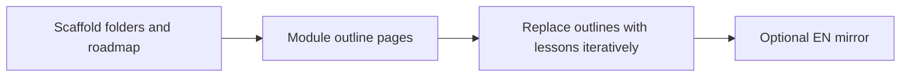

# Lộ trình docs: From Zero → Senior .NET (Backend-first)

## Bối cảnh kỹ thuật trong repo

- **Docusaurus classic** ([docusaurus.config.js](d:\repos\tiennhm.github.io\docusaurus.config.js)): `docs` dùng [sidebars.js](d:\repos\tiennhm.github.io\sidebars.js) với `tutorialSidebar: [{ type: 'autogenerated', dirName: '.' }]`, nên **thứ tự và nhãn sidebar** đến từ cây thư mục + file [`_category_.json`](d:\repos\tiennhm.github.io\docs\06-database\learn-sql-in-30-days\_category_.json) (`label`, `position`, `link.type: generated-index`, `description`).
- Các “khóa” lớn hiện dùng tiền tố số: `01-` … `08-` ([docs](d:\repos\tiennhm.github.io\docs)). Khóa mới nên là **`09-...`** để nổi bật trong sidebar và không đụng slug cũ.
- **Mẫu roadmap** đã có sẵn: [docs/06-database/learn-sql-in-30-days/00. 30-Day SQL Learning Roadmap.md](d:\repos\tiennhm.github.io\docs\06-database\learn-sql-in-30-days\00.%2030-Day%20SQL%20Learning%20Roadmap.md) — frontmatter (`title`, `slug`, `description`, `sidebar_position`, `tags`, …), `SummaryBox`, liên kết tới từng bài bằng đường dẫn file tương đối.
- **Đa ngôn ngữ** ([.cursor/rules/i18n.mdc](d:\repos\tiennhm.github.io\.cursor\rules\i18n.mdc)): nội dung tiếng Việt trong `docs/`; bản Anh (nếu cần) mirror dưới `i18n/en/docusaurus-plugin-content-docs/current/` cùng đường dẫn tương đối + cập nhật `current.json` khi có category mới cần dịch UI.

## Định vị và nguyên tắc nội dung (trích giáo trình)

- **Mục tiêu**: Giáo trình **C# + .NET chuyên sâu**, tránh biến thành “học đủ thứ”; chuỗi kỹ năng: **C# thật vững → ASP.NET Core thật sâu → Database thật chắc → Architecture thật mạnh → Production mindset thật thực chiến**.
- **Đối tượng đào tạo**: **Backend-first .NET Developer** (không full-stack lan man); phù hợp enterprise, outsource, SaaS, freelance backend.
- **Giá trị thương mại**: Cao; **trục dự án**: **“Build a Real Production CRM”** — gom CRUD, Auth, permission, workflow, approval, notification, SignalR, background jobs, deployment, scaling; **sát nhu cầu tuyển dụng**.

## Năm trụ trình bày (roadmap) ↔ năm thư mục `stage-*` trong repo

Trên roadmap `00`, hiển thị **năm trụ** dưới đây cho người đọc / SEO. Trong sidebar, giữ **nhãn kỹ thuật** theo từng stage (dễ điều hướng, khớp module).

| Trụ trình bày (giáo trình) | Thư mục docs đề xuất | Phạm vi |
|---------------------------|----------------------|---------|
| Foundation | `stage-01-foundation` | Module 1–3 |
| Professional Backend | `stage-02-csharp-professional` | Module 4–7 + Project 1 |
| Advanced Backend | `stage-03-aspnet-core-backend` + `stage-04-database-production` | Module 8–15 + Project 2 + Project 3 |
| Senior Engineering | `stage-05-senior-engineering` (phần lớn) | Module 16–19 + Final Project (góc vận hành hệ thống) |
| Architect Mindset | Nhúng trong Stage 5 + Final Project | Clean Architecture, DDD, distributed, microservices, performance, enterprise CRM/ERP — nhấn “system owner / thiết kế nền” ở M16–19 và mô tả Final Project |

## Nội dung trọng tâm — đề cương đầy đủ (bắt buộc phản ánh trong từng file module/project)

### Tổng thể

Năm giai đoạn (tên trụ): Foundation → Professional Backend → Advanced Backend → Senior Engineering → Architect Mindset (chi tiết module/project như các mục dưới).

### Đối chiếu [roadmap.sh — ASP.NET Core Developer](https://roadmap.sh/aspnet-core)

- Dùng roadmap cộng đồng làm **checklist bổ sung** (skills graph 2025–2026), không thay thế trục **CRM / backend-first** của giáo trình.
- Các mục roadmap mang tính **full-stack hoặc client .NET** (ví dụ Blazor, .NET MAUI, Razor Pages nặng UI) ghi rõ trong docs là **“Tùy chọn — ngoài phạm vi backend-first”** hoặc chỉ một trang “Mở rộng & liên kết ngoài”.
- Các mục roadmap đánh dấu *Alternative / Optional* (GraphQL, MongoDB, v.v.) đưa vào **cùng module** dưới dạng subsection “Lộ trình rộng / phỏng vấn”, tránh phình giáo trình thành “học đủ thứ”.
- Khi viết nội dung chi tiết, có thể tham chiếu trực tiếp topic list trên roadmap và repo nguồn dữ liệu graph (`nilbuild/developer-roadmap`, `aspnet-core.json`).

---

### Giai đoạn 1 — Foundation (From Zero)

**Mục tiêu**: Từ chưa biết lập trình → hiểu tư duy lập trình và viết được ứng dụng đầu tiên.

**Module 1 — Programming Logic**

- Variables, Conditions, Loops, Functions, Arrays, Objects, Algorithm basics, Problem solving mindset
- **Bổ sung (đối chiếu roadmap)**: Data Structures and Algorithms — mức tối thiểu cho tư duy phỏng vấn backend (Big-O cơ bản, danh sách, map, queue/stack); không biến module 1 thành khóa DSA riêng.

**Module 2 — Computer Science Basics**

- Internet hoạt động như thế nào, Client / Server, HTTP / HTTPS, API, JSON, Database, Authentication, Hosting
- **Bổ sung (đối chiếu roadmap)**: `.NET` runtime tổng quan; **.NET CLI** (`dotnet` SDK, solution/project, `dotnet run` / `build`); **Database fundamentals** + **SQL basics** + **database design basics** (chuẩn hóa nhẹ, khóa, quan hệ) — khớp phần “General Development Skills” trên roadmap, liên kết sau tới Module 12–13.

**Module 3 — Git + Developer Workflow**

- Git, GitHub, Branch, Merge, Pull Request, Debugging mindset
- **Bổ sung (đối chiếu roadmap)**: GitLab / Bitbucket như alternative; gợi ý đọc **Backend Roadmap** (roadmap.sh) để thấy phần còn thiếu so với ngôn ngữ cụ thể.

---

### Giai đoạn 2 — C# Professional

**Mục tiêu**: Từ người biết code → người viết code chuẩn production.

**Module 4 — C# Core**

- OOP toàn diện, Class / Interface, Inheritance, Polymorphism, Encapsulation, Abstraction, Access modifiers

**Module 5 — Advanced C#**

- SOLID, LINQ, Delegates, Events, Extension methods, Reflection, Generics, Expression Trees, Nullable reference types

**Module 6 — Async Programming**

- async / await, Task, Thread, Parallel programming, Cancellation Token, Deadlock, Performance thinking

**Module 7 — Dependency Injection**

- IoC, DI container, Lifetime, Scoped / Singleton / Transient, Anti-patterns

**Project 1 — Inventory System Console + API**

- Product, Stock, Warehouse, Import / Export, Logs

---

### Giai đoạn 3 — ASP.NET Core Backend

**Mục tiêu**: Tự xây dựng backend production-ready.

**Module 8 — ASP.NET Core Fundamentals**

- Request pipeline, Middleware, Routing, Controllers, Model Binding, Validation, Configuration, Logging, Exception handling
- **Bổ sung (đối chiếu roadmap)**: **ASP.NET Core Basics** tổng thể; **MVC** (routing/controller/view filter pipeline — hữu ích dù tập trung API); **Razor Pages** (tùy chọn, server HTML); **Minimal APIs**; **Filters và Attributes**; **App Settings và Configuration** (`IConfiguration`, options pattern); **StyleCop** / quy ước code style; logging với **Serilog** hoặc **NLog** (chọn một làm chuẩn production).

**Module 9 — Web API Professional**

- RESTful API, Swagger, API Versioning, Pagination, Filtering, Sorting, Dynamic Query, File upload, Background processing
- **Bổ sung (đối chiếu roadmap)**: **REST** (resource modeling, status codes, idempotency); OpenAPI — **Scalar** (hoặc Swagger UI) làm doc UI; **OData**; **gRPC**; **GraphQL / HotChocolate** (ghi rõ *alternative*, không làm trục chính); thư viện lọc/sắp xếp kiểu **Gridify** nếu cần dynamic query thực dụng; **Object mapping**: AutoMapper vs **Mapperly** vs manual mapping (ưu tiên Mapperly/manual cho performance).
- **Testing backend (bắt buộc gắn với API professional — theo roadmap)**: **xUnit** (hoặc NUnit); **WebApplicationFactory**; **Testcontainers**; integration test API; mocking (**Moq** / NSubstitute); giới thiệu **Respawn** (reset DB test); tùy chọn E2E (**Playwright**) cho API + hợp đồng; **Polly** (retry/circuit breaker) gắn với HTTP client resilience.

**Module 10 — Authentication + Authorization**

- JWT, Refresh Token, Claims, Roles, Policies, Permission system
- **Bổ sung (đối chiếu roadmap)**: Secure configuration secrets; correlation với logging/audit (chuẩn bị cho audit log CRM).

**Module 11 — SignalR**

- Realtime communication, Notification center, Chat system, Presence system
- **Bổ sung (đối chiếu roadmap)**: **SignalR Core**; **WebSockets** thuần (so sánh khi nào dùng); scale-out và backplane (Redis) — gắn với notification center / presence.

**Project 2 — CRM Backend API**

- Customer, Lead, Contact, Permission, Workflow, Approval, Notification, Audit log

---

### Giai đoạn 4 — Database + Production

**Mục tiêu**: Biết xử lý hệ thống thật ngoài doanh nghiệp.

**Module 12 — SQL Deep Dive**

- SQL Server, PostgreSQL, Query optimization, Indexing, Execution plan, Locks, Deadlocks, Transactions
- **Bổ sung (đối chiếu roadmap)**: **Stored procedures**, **constraints**, **triggers** (mức độ enterprise); **relational** vs giới thiệu **NoSQL** (MongoDB, v.v.) như *alternative*; tùy chọn **search** (Elasticsearch) cho CRM tìm kiếm nâng cao.

**Module 13 — Entity Framework Core**

- DbContext, Entity Mapping, Migration, Performance optimization, N+1 problem, Compiled Query, Bulk operations, Concurrency, Unit of Work
- **Bổ sung (đối chiếu roadmap)**: **Code First + Migrations**; **Lazy / Eager / Explicit loading**; **Change Tracker API**; **Dapper** (micro-ORM) khi cần đọc/ghi tối ưu; liệt kê ngắn RepoDB / NHibernate như *alternative* (không dạy sâu trừ khi mở rộng).

**Module 14 — Caching + Background Jobs**

- Redis, Caching strategy, Hangfire, Retry patterns, Queue basics
- **Bổ sung (đối chiếu roadmap)**: **Memory cache** vs **distributed cache**; **Native Background Service** (`IHostedService`); **Quartz** / **Coravel** so với Hangfire; **Polly** (retry) đồng bộ với job và HTTP; giới thiệu **message bus** (MassTransit / NServiceBus / EasyNetQ / Azure Service Bus) làm cầu nối tới Module 17.

**Module 15 — Docker + Deployment**

- Docker, Docker Compose, Linux VPS deploy, Azure deploy, CI/CD basics, Production logging
- **Bổ sung (đối chiếu roadmap)**: **Containerization**; **Kubernetes** (triển khai & vận hành cơ bản); **CI/CD**: GitHub Actions, Azure Pipelines, GitLab CI (chọn 1–2 làm chuẩn); **.NET Aspire** (local cloud-native dev — tùy chọn nhưng nên có 1 bài orientation); logging/metrics production (gắn observability ở Module 18).

**Project 3 — Production CRM Platform**

- Multi-tenant, Notification center, Approval engine, Background jobs, Realtime updates, Docker deployment

---

### Giai đoạn 5 — Senior Engineering

**Mục tiêu**: Từ Developer → System Owner.

**Module 16 — Clean Architecture**

- Layered architecture, Vertical Slice, Clean Architecture, DDD basics, Domain Events
- **Bổ sung (đối chiếu roadmap)**: **MediatR** (in-process mediator) + **FluentValidation**; template engines (**Razor** cho email/report server-side — không đẩy sang Blazor); “good-to-know” thư viện: **Marten** (event store) *optional*.

**Module 17 — Distributed Systems**

- Event-driven architecture, Kafka, RabbitMQ, CDC, Outbox pattern, Idempotency, Retry strategy
- **Bổ sung (đối chiếu roadmap)**: **Message brokers** (ActiveMQ, Kafka, RabbitMQ, Azure Service Bus); **MassTransit** / **NServiceBus** / **EasyNetQ** — chọn một stack demo; **NetMQ** *optional*.

**Module 18 — Microservices**

- Service decomposition, API Gateway, Service communication, Observability, Monitoring
- **Bổ sung (đối chiếu roadmap)**: **API Gateway**: **YARP** (ưu tiên Microsoft stack) và **Ocelot**; **Dapr** / **Steeltoe** / **Orleans** như *optional* patterns; health checks, distributed tracing, metrics; liên kết lại Docker/K8s từ Module 15.

**Module 19 — Performance Engineering**

- Benchmarking, Profiling, Throughput, Bottleneck analysis, Scaling strategy
- **Bổ sung (đối chiếu roadmap)**: **BenchmarkDotNet**; **distributed lock** (pattern + thư viện phổ biến); profiling memory/GC cơ bản cho .NET server.

**Final Project — Enterprise-grade CRM / ERP Platform**

- CRM, Ticketing, Membership, Loyalty, Payment, Contact center, Omnichannel communication, Event-driven modules, Microservices, Deployment production

---

### Bộ sách bắt buộc đi kèm (trang roadmap + có thể lặp ngắn ở đầu từng giai đoạn)

- **Foundation**: Head First C#; C# Yellow Book
- **Mid-level**: C# in Depth; ASP.NET Core in Action
- **Senior**: CLR via C#; Clean Architecture; Designing Data-Intensive Applications

### Trụ “Build a Real Production CRM” (nhắc trong roadmap và project docs)

CRM phủ: CRUD, Auth, Permission, Workflow, Approval, Notification, SignalR, Background jobs, Deployment, Scaling — **nhất quán** khi mô tả Project 2 → 3 → Final và khi viết mục “Liên hệ CRM” trong từng module.

### Ngoài phạm vi backend-first (chỉ footnote / trang “Mở rộng” — theo roadmap)

- **Blazor**, **.NET MAUI**, **Razor Components** / client-heavy UI: không đưa vào lộ trình lõi; có thể một doc `optional-client-dotnet.md` + link [roadmap.sh/aspnet-core](https://roadmap.sh/aspnet-core).

## Cấu trúc thư mục đề xuất

Tạo thư mục gốc khóa học, ví dụ:

`docs/09-dotnet-backend-zero-to-senior/`

Bên trong:

| Thư mục | Vai trò |
|--------|---------|
| `_category_.json` | Nhãn khóa (VD: “.NET Backend: Zero → Senior”), `position` (chọn số lớn hơn các khóa khác nếu muốn đẩy xuống cuối, hoặc theo ý bạn), `generated-index` mô tả **trục CRM + enterprise backend**. |
| `00-roadmap-dotnet-backend-zero-to-senior.md` | Trang mặt tiền: 5 giai đoạn, 19 module, 3 project + final project, **sách bắt buộc**, lý do “không full-stack lan man”. Cùng pattern với SQL roadmap (SummaryBox, slug rõ ràng). |
| `stage-01-foundation/` … `stage-05-senior-engineering/` | Mỗi stage một `_category_.json` + các file module/project. |

**Quy ước file (gọn, autogen-friendly):**

- `stage-02-csharp-professional/module-04-csharp-core.md` … tương ứng Module 4–7 + `project-01-inventory-console-api.md`.
- `stage-03-aspnet-core-backend/module-08-aspnet-fundamentals.md` … đến Module 11 + `project-02-crm-backend-api.md`.
- `stage-04-database-production/` Module 12–15 + `project-03-production-crm-platform.md`.
- `stage-05-senior-engineering/` Module 16–19 + `final-project-enterprise-crm-erp.md`.
- Stage 1: Module 1–3 (logic, CS basics, Git).

Mỗi file module (giai đoạn đầu triển khai) có thể là **bản khung chất lượng cao**: mục tiêu, **checklist trùng khớp từng bullet** trong mục “Nội dung trọng tâm” ở trên, “Thực hành gợi ý”, “Liên hệ CRM” (1 đoạn), và placeholder rõ ràng cho nội dung bài giảng sâu sau — tránh tạo hàng chục file chỉ một dòng.

## Nội dung trang `00-roadmap` (tóm tắt triển khai)

- Nhắc **định vị backend-first** và chuỗi **C# → ASP.NET Core → DB → Architecture → Production** (đồng bộ với mục “Định vị và nguyên tắc”).
- Bảng **năm trụ** ↔ link tới các `stage-*` (generated index) và tới file `00` / module.
- Liên kết nội bộ tới từng `module-*.md` / `project-*.md` (giống [SQL roadmap](d:\repos\tiennhm.github.io\docs\06-database\learn-sql-in-30-days\00.%2030-Day%20SQL%20Learning%20Roadmap.md)).
- Section **Build a Real Production CRM** + map Project 2 → 3 → Final (đã liệt kê trong đề cương).
- Section **Bộ sách bắt buộc** (Foundation / Mid / Senior) đúng danh mục trong plan.
- Một đoạn **“Đối chiếu roadmap.sh”** + link [ASP.NET Core Developer](https://roadmap.sh/aspnet-core) và cách dùng trong repo (checklist bổ sung, không lệch trục CRM).

## Sidebar và SEO

- Không bắt buộc sửa [sidebars.js](d:\repos\tiennhm.github.io\sidebars.js) nếu autogen đủ; chỉ cần **`position` nhất quán** trong mọi `_category_.json` (stage 1 → 5 tăng dần; trong stage, module trước project).
- Mỗi doc: `description`, `tags`/`keywords` (dotnet, csharp, aspnet-core, backend, crm, roadmap) để Algolia/SEO thống nhất với các khóa khác.

## i18n (tùy chọn trong cùng PR hoặc PR sau)

- Nếu giữ đúng rule dự án: sau khi ổn định tiếng Việt, thêm mirror `i18n/en/docusaurus-plugin-content-docs/current/09-dotnet-backend-zero-to-senior/...` và chuỗi dịch trong [i18n/en/docusaurus-plugin-content-docs/current.json](d:\repos\tiennhm.github.io\i18n\en\docusaurus-plugin-content-docs\current.json) cho label category autogen.

## Kiểm tra sau khi implement

- `npm run build` (hoặc script build tương đương trong [package.json](d:\repos\tiennhm.github.io\package.json)) để bắt broken links / frontmatter.
- Mở `/docs/09-dotnet-backend-zero-to-senior/...` kiểm tra sidebar và link từ roadmap.

## Lộ trình triển khai nội dung (không nhồi hết vào một lần)

1. **Scaffold**: folder `09-...`, tất cả `_category_.json`, file `00-roadmap`, các `module-*.md` / `project-*.md` với outline đầy đủ theo đề cương bạn gửi.  
2. **Điền sâu theo ưu tiên**: Foundation (Module 1–3) → C# core (4–7) → tiếp các stage; luôn giữ **nhánh CRM** đồng bộ trong project docs.  
3. **i18n**: batch theo stage khi nội dung Việt ổn định.

## Rủi ro / lưu ý

- **Độ dài URL**: tên folder/file nên ngắn gọn (slug trong frontmatter có thể rút gọn so với `title`).
- **Trùng chủ đề** với [learn-sql-in-30-days](d:\repos\tiennhm.github.io\docs\06-database\learn-sql-in-30-days): Module 12 SQL có thể **link chéo** thay vì copy nguyên si, tránh trùng lặp bảo trì.
