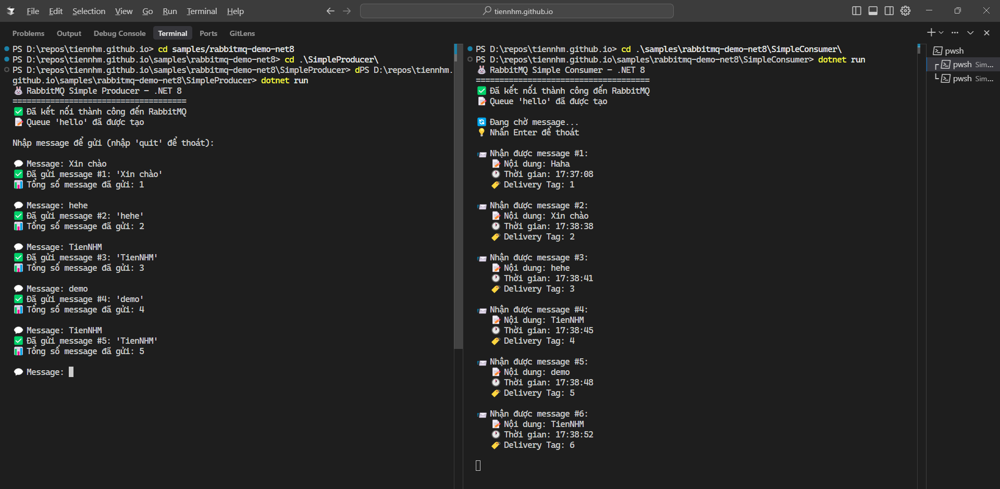

# Giới thiệu RabbitMQ - Message Broker mạnh mẽ với ví dụ .NET 8

RabbitMQ là một trong những message broker phổ biến nhất trong thế giới phát triển phần mềm hiện đại. Trong bài viết này, chúng ta sẽ tìm hiểu về RabbitMQ và cách sử dụng nó trong ứng dụng .NET 8.

<!-- truncate -->

## RabbitMQ là gì?

RabbitMQ là một open-source message broker (còn gọi là message queue) được phát triển bởi Rabbit Technologies. Nó hỗ trợ nhiều messaging protocols như AMQP, MQTT, STOMP và HTTP thông qua các plugins.

### Các khái niệm cơ bản

- **Producer**: Ứng dụng gửi message
- **Consumer**: Ứng dụng nhận và xử lý message
- **Queue**: Nơi lưu trữ message
- **Exchange**: Nhận message từ producer và định tuyến đến queue
- **Binding**: Quy tắc kết nối exchange với queue
- **Routing Key**: Khóa để exchange định tuyến message

## Cài đặt RabbitMQ

### Sử dụng Docker (Khuyến nghị)

```bash
docker run -d --name rabbitmq -p 5672:5672 -p 15672:15672 rabbitmq:3-management
```

Sau khi chạy, bạn có thể truy cập RabbitMQ Management UI tại: `http://localhost:15672` (username/password: guest/guest)

### Cài đặt trực tiếp

Tải và cài đặt từ [rabbitmq.com](https://www.rabbitmq.com/download.html)

## Ví dụ ứng dụng .NET 8

Chúng ta sẽ tạo một ứng dụng đơn giản để gửi và nhận message qua RabbitMQ.

### 1. Tạo project .NET 8

```bash
dotnet new console -n RabbitMQDemo
cd RabbitMQDemo
dotnet add package RabbitMQ.Client
```

### 2. Tạo Producer (Ứng dụng gửi message)

```csharp Producer/Program.cs
using RabbitMQ.Client;
using System.Text;

class Producer
{
    static void Main(string[] args)
    {
        // Kết nối đến RabbitMQ
        var factory = new ConnectionFactory() 
        { 
            HostName = "localhost",
            UserName = "guest",
            Password = "guest"
        };
        
        using var connection = factory.CreateConnection();
        using var channel = connection.CreateModel();
        
        // Khai báo queue
        const string queueName = "hello";
        channel.QueueDeclare(
            queue: queueName,
            durable: false,
            exclusive: false,
            autoDelete: false,
            arguments: null);
        
        Console.WriteLine("Nhập message để gửi (nhập 'quit' để thoát):");
        
        while (true)
        {
            var message = Console.ReadLine();
            if (message?.ToLower() == "quit") break;
            
            if (!string.IsNullOrEmpty(message))
            {
                var body = Encoding.UTF8.GetBytes(message);
                channel.BasicPublish(
                    exchange: "",
                    routingKey: queueName,
                    basicProperties: null,
                    body: body);
                
                Console.WriteLine($"Đã gửi: {message}");
            }
        }
    }
}
```

### 3. Tạo Consumer (Ứng dụng nhận message)

```csharp Consumer/Program.cs
using RabbitMQ.Client;
using RabbitMQ.Client.Events;
using System.Text;

class Consumer
{
    static void Main(string[] args)
    {
        // Kết nối đến RabbitMQ
        var factory = new ConnectionFactory() 
        { 
            HostName = "localhost",
            UserName = "guest",
            Password = "guest"
        };
        
        using var connection = factory.CreateConnection();
        using var channel = connection.CreateModel();
        
        // Khai báo queue
        const string queueName = "hello";
        channel.QueueDeclare(
            queue: queueName,
            durable: false,
            exclusive: false,
            autoDelete: false,
            arguments: null);
        
        Console.WriteLine("Đang chờ message...");
        
        // Tạo consumer
        var consumer = new EventingBasicConsumer(channel);
        consumer.Received += (model, ea) =>
        {
            var body = ea.Body.ToArray();
            var message = Encoding.UTF8.GetString(body);
            
            Console.WriteLine($"Nhận được: {message}");
            
            // Xác nhận đã xử lý message
            channel.BasicAck(ea.DeliveryTag, false);
        };
        
        // Bắt đầu nhận message
        channel.BasicConsume(
            queue: queueName,
            autoAck: false,
            consumer: consumer);
        
        Console.WriteLine("Nhấn Enter để thoát");
        Console.ReadLine();
    }
}
```

### 4. Sử dụng Exchange và Routing

Đây là ví dụ nâng cao sử dụng Exchange với routing key:

```csharp AdvancedProducer/Program.cs
using RabbitMQ.Client;
using System.Text;

class AdvancedProducer
{
    static void Main(string[] args)
    {
        var factory = new ConnectionFactory() { HostName = "localhost" };
        using var connection = factory.CreateConnection();
        using var channel = connection.CreateModel();
        
        // Khai báo exchange
        const string exchangeName = "logs";
        channel.ExchangeDeclare(
            exchange: exchangeName,
            type: ExchangeType.Direct);
        
        // Khai báo queues
        var queueNames = new[] { "error", "warning", "info" };
        foreach (var queueName in queueNames)
        {
            channel.QueueDeclare(queueName, false, false, false, null);
            channel.QueueBind(queueName, exchangeName, queueName);
        }
        
        Console.WriteLine("Nhập message theo format 'level:message' (ví dụ: error:Database connection failed)");
        Console.WriteLine("Levels: error, warning, info");
        
        while (true)
        {
            var input = Console.ReadLine();
            if (input?.ToLower() == "quit") break;
            
            if (input?.Contains(':') == true)
            {
                var parts = input.Split(':', 2);
                var level = parts[0].Trim().ToLower();
                var message = parts[1].Trim();
                
                if (queueNames.Contains(level))
                {
                    var body = Encoding.UTF8.GetBytes(message);
                    channel.BasicPublish(
                        exchange: exchangeName,
                        routingKey: level,
                        basicProperties: null,
                        body: body);
                    
                    Console.WriteLine($"Đã gửi {level}: {message}");
                }
                else
                {
                    Console.WriteLine($"Level không hợp lệ: {level}");
                }
            }
        }
    }
}
```

### 5. Consumer cho từng loại message

```csharp AdvancedConsumer/Program.cs
using RabbitMQ.Client;
using RabbitMQ.Client.Events;
using System.Text;

class AdvancedConsumer
{
    static void Main(string[] args)
    {
        Console.WriteLine("Chọn level để nhận message (error/warning/info):");
        var level = Console.ReadLine()?.Trim().ToLower();
        
        if (string.IsNullOrEmpty(level) || !new[] { "error", "warning", "info" }.Contains(level))
        {
            Console.WriteLine("Level không hợp lệ!");
            return;
        }
        
        var factory = new ConnectionFactory() { HostName = "localhost" };
        using var connection = factory.CreateConnection();
        using var channel = connection.CreateModel();
        
        // Khai báo exchange
        const string exchangeName = "logs";
        channel.ExchangeDeclare(
            exchange: exchangeName,
            type: ExchangeType.Direct);
        
        // Khai báo queue
        channel.QueueDeclare(level, false, false, false, null);
        channel.QueueBind(level, exchangeName, level);
        
        Console.WriteLine($"Đang chờ {level} messages...");
        
        var consumer = new EventingBasicConsumer(channel);
        consumer.Received += (model, ea) =>
        {
            var body = ea.Body.ToArray();
            var message = Encoding.UTF8.GetString(body);
            
            Console.WriteLine($"[{level.ToUpper()}] {message}");
            channel.BasicAck(ea.DeliveryTag, false);
        };
        
        channel.BasicConsume(level, false, consumer);
        
        Console.WriteLine("Nhấn Enter để thoát");
        Console.ReadLine();
    }
}
```

## Các tính năng nâng cao

### 1. Message Persistence

```csharp
// Đảm bảo queue và message được lưu trữ
channel.QueueDeclare(
    queue: "persistent-queue",
    durable: true,  // Queue sẽ được lưu trữ
    exclusive: false,
    autoDelete: false,
    arguments: null);

// Đảm bảo message được lưu trữ
var properties = channel.CreateBasicProperties();
properties.Persistent = true;

channel.BasicPublish(
    exchange: "",
    routingKey: "persistent-queue",
    basicProperties: properties,
    body: body);
```

### 2. Acknowledgment

```csharp
// Tắt auto-ack để xử lý thủ công
channel.BasicConsume(
    queue: "queue-name",
    autoAck: false,  // Tắt auto-ack
    consumer: consumer);

// Xác nhận message đã được xử lý thành công
channel.BasicAck(deliveryTag, false);

// Hoặc từ chối message
channel.BasicNack(deliveryTag, false, true);  // true = requeue
```

### 3. Dead Letter Exchange

```csharp
// Khai báo dead letter exchange
channel.ExchangeDeclare("dlx", ExchangeType.Direct);

// Khai báo queue với dead letter exchange
var arguments = new Dictionary<string, object>
{
    { "x-dead-letter-exchange", "dlx" },
    { "x-dead-letter-routing-key", "failed" }
};

channel.QueueDeclare(
    queue: "main-queue",
    durable: false,
    exclusive: false,
    autoDelete: false,
    arguments: arguments);
```

## Lợi ích của RabbitMQ

1. **Độ tin cậy cao**: Hỗ trợ message persistence và acknowledgment
2. **Hiệu suất tốt**: Xử lý hàng nghìn message mỗi giây
3. **Linh hoạt**: Hỗ trợ nhiều messaging patterns
4. **Khả năng mở rộng**: Dễ dàng thêm producer/consumer
5. **Monitoring**: Cung cấp web UI để quản lý

## Kết luận

RabbitMQ là một công cụ mạnh mẽ cho việc xây dựng kiến trúc microservices và xử lý message bất đồng bộ. Với .NET 8, việc tích hợp RabbitMQ trở nên đơn giản và hiệu quả hơn bao giờ hết.

Trong bài viết này, chúng ta đã tìm hiểu:
- Khái niệm cơ bản về RabbitMQ
- Cách cài đặt và sử dụng
- Ví dụ thực tế với .NET 8
- Các tính năng nâng cao

Để tìm hiểu thêm, bạn có thể tham khảo:
- [RabbitMQ Documentation](https://www.rabbitmq.com/documentation.html)
- [RabbitMQ .NET Client](https://github.com/rabbitmq/rabbitmq-dotnet-client)
- [AMQP Protocol](https://www.amqp.org/)

Trên đây là một số ví dụ cơ bản về RabbitMQ và cách sử dụng nó trong ứng dụng .NET 8, hy vọng bạn thấy hữu ích.

## 🚀 Source Code Mẫu

Để xem và chạy code mẫu hoàn chỉnh, hãy truy cập: [GitHub Repository](https://github.com/TienNHM/rabbitmq-demo-net8)

Repository bao gồm:
- **Simple Producer/Consumer**: Ví dụ cơ bản gửi/nhận message
- **Advanced Producer/Consumer**: Sử dụng Exchange với routing
- **Shared Library**: Các class và utility chung
- **Hướng dẫn chi tiết**: README.md và QUICKSTART.md
- **Script tự động**: PowerShell script để dễ dàng chạy demo

### 🎯 Cách sử dụng nhanh:

```bash
# 1. Clone repository
git clone https://github.com/TienNHM/rabbitmq-demo-net8.git
cd rabbitmq-demo-net8

# 2. Khởi động RabbitMQ
docker run -d --name rabbitmq -p 5672:5672 -p 15672:15672 rabbitmq:3-management

# 3. Chạy demo
cd samples
.\run-samples.ps1
```

Happy coding! 🚀


