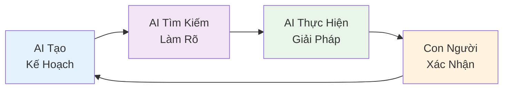

    

Ngành phát triển phần mềm đang chứng kiến một cuộc cách mạng lớn với sự xuất hiện của **AI-DD (AI-Driven Development)** - một cách tiếp cận hoàn toàn mới khác biệt với việc chỉ đơn thuần sử dụng AI để hỗ trợ. 

Theo nghiên cứu của [AWS DevOps Blog](https://aws.amazon.com/blogs/devops/ai-driven-development-life-cycle/), chúng ta cần tái tưởng tượng toàn bộ quy trình phát triển phần mềm để thực sự khai thác được sức mạnh của trí tuệ nhân tạo.

<!-- truncate -->

*Đây là Phần 1 trong series 4 phần về AI-DD. Bài viết này được viết với sự hỗ trợ của AI để minh họa phương pháp AI-DD.*

:::info[📝 Thuật ngữ chuyên ngành]

**AI-DD** = **AI-Driven Development** (Phát triển phần mềm do AI dẫn dắt)  
**AI-DLC** = **AI-Driven Development Lifecycle** (Vòng đời phát triển do AI dẫn dắt)

:::

:::info[📚 Series: AI-DD (AI-Driven Development)]

**Phần 1**: [Giới Thiệu và Tác Động](/blog/phat-trien-phan-mem-ai-driven-development-phan-1) ← *Bạn đang ở đây*  
**Phần 2**: [Công Cụ AI và Nghiên Cứu Tình Huống](/blog/phat-trien-phan-mem-ai-driven-development-phan-2)  
**Phần 3**: [Số Liệu, Kinh Nghiệm Thực Tế và Rủi Ro](/blog/phat-trien-phan-mem-ai-driven-development-phan-3)  
**Phần 4**: [Tương Lai và Kết Luận](/blog/phat-trien-phan-mem-ai-driven-development-phan-4)

:::

### *🔄 Sự Khác Biệt Cơ Bản*

**Phương pháp AI hỗ trợ (cách tiếp cận truyền thống)**:
- AI chỉ hỗ trợ các công việc cụ thể như viết tài liệu, hoàn thiện code, kiểm thử
- Con người vẫn làm việc theo quy trình truyền thống
- Kết quả: chưa tối ưu về tốc độ và chất lượng phần mềm

**Phương pháp AI-DD (cách tiếp cận mới)**:
- AI trở thành cộng tác viên trung tâm và đồng đội trong quy trình phát triển
- AI khởi tạo và chỉ đạo quy trình làm việc thông qua mô hình tư duy mới
- Con người tập trung vào các quyết định quan trọng và tư duy sáng tạo

### 🎯 **Nguyên Tắc Cốt Lõi của AI-DD**

Theo nghiên cứu của [Groove Technology](https://groovetechnology.com/blog/software-development/ai-driven-development/), phương pháp AI-DD dựa trên 3 nguyên tắc cốt lõi:

1. **AI thực thi với sự giám sát của con người**: AI tạo kế hoạch làm việc chi tiết, tìm kiếm làm rõ, và để lại các quyết định quan trọng cho con người

2. **Cộng tác nhóm năng động**: Các thành viên trong nhóm hợp tác trong không gian làm việc chung để giải quyết vấn đề theo thời gian thực và đưa ra quyết định nhanh chóng

3. **Tích lũy ngữ cảnh liên tục**: AI lưu trữ và duy trì thông tin ngữ cảnh xuyên suốt tất cả các giai đoạn phát triển

:::note[📝 Lưu ý quan trọng]

Series bài viết này sẽ trình bày một nghiên cứu tình huống cụ thể để minh họa phương pháp AI-DD. Các phần giới thiệu về công cụ chỉ mang tính nền tảng.

:::

## **AI-DD - Thay Đổi Cách Tiếp Cận** {#phat-trien-phan-mem-ai-driven}

:::info[🔍 Tìm hiểu về phương pháp AWS AI-DLC]

Theo phương pháp [AWS AI-DLC](https://aws.amazon.com/blogs/devops/ai-driven-development-life-cycle/), chúng ta cần thay đổi từ quy trình do con người điều khiển sang cách tiếp cận tập trung vào AI và cộng tác.

:::

:::tip[📊 So sánh chi tiết: Phương pháp truyền thống vs AI-DD]

#### Phương pháp truyền thống:
- **Quản lý sản phẩm/Phân tích viên**: Phân tích yêu cầu thủ công, viết đặc tả dài dòng, họp liên miên
- **Lập trình viên**: Viết mã từ đầu, gỡ lỗi thủ công, tìm kiếm giải pháp trên Stack Overflow
- **Kiểm thử viên**: Viết test case thủ công, kiểm thử thủ công, độ bao phủ thấp
- **DevOps**: Cấu hình CI/CD thủ công, giám sát hệ thống, phản ứng sự cố chậm
- **Quy trình làm việc**: Sprint kéo dài 2-4 tuần, cuộc họp lập kế hoạch dài dòng

#### Phương pháp AI-DD:
- **AI khởi tạo**: AI tạo kế hoạch làm việc chi tiết, tìm kiếm làm rõ, đề xuất giải pháp
- **Con người giám sát**: Tập trung vào quyết định quan trọng và ngữ cảnh kinh doanh
- **Cộng tác năng động**: Nhóm làm việc trong không gian cộng tác để giải quyết vấn đề theo thời gian thực
- **Giao hàng liên tục**: Chu kỳ "Bolts" thay vì "Sprints" - đo bằng giờ/ngày
- **Duy trì ngữ cảnh**: AI duy trì thông tin xuyên suốt tất cả các giai đoạn

:::

### *🚀 Mô Hình Tư Duy Mới của AI-DD*

:::info[🔄 Xem sơ đồ quy trình AI-DD]

**Điểm đổi mới chính**: AI không chỉ hỗ trợ, mà khởi tạo và chỉ đạo quy trình làm việc, với sự giám sát của con người cho các quyết định quan trọng.

:::

## **Tác Động của AI Đối Với Từng Vai Trò** {#tac-dong-ai-tung-vai-tro}

:::note[📈 Lưu ý quan trọng]

Phần này trình bày tác động của AI đối với từng vai trò trong quá trình phát triển phần mềm. Các số liệu dưới đây chỉ mang tính tham khảo để minh họa xu hướng. Phần chính của series sẽ tập trung vào nghiên cứu tình huống cụ thể ở Phần 2.

:::

### *🏗️ Các Vai Trò Chính Trong Quy Trình Phát Triển Phần Mềm*

#### 1. Quản Lý Sản Phẩm (PM) & Phân Tích Viên Kinh Doanh (BA)

<strong>📊 Xem chi tiết nghiên cứu về AI cho PM/BA</strong>

**Nghiên cứu từ Product Management Institute (2024)**:
- **AI hỗ trợ**: **Phân tích thị trường**, **tạo user stories**, **prioritization**, **roadmap planning**, **A/B testing**
- **Công cụ**: Productboard AI, Amplitude AI, Mixpanel AI, ChatGPT Product Management
- **Kết quả thực tế**:
  - **Thời gian phân tích** giảm 65% (từ 2-3 tuần xuống 1 tuần) [^1]
  - **Độ chính xác dự đoán** tăng 45% với AI-powered analytics [^1]
  - **Tốc độ ra quyết định** nhanh hơn 70% với AI insights [^1]

**Use case**: Spotify Product team sử dụng AI để **phân tích user behavior**, tăng 40% **user engagement** và giảm 50% **thời gian phát triển tính năng** [^1].

#### 2. Developer (Lập trình viên)

<strong>💻 Xem chi tiết nghiên cứu về AI cho Developer</strong>

**Nghiên cứu từ Stack Overflow Developer Survey (2024)**:
- **AI hỗ trợ**: **Tạo code**, **gỡ lỗi**, **đánh giá code**, **viết tài liệu**, **tái cấu trúc code**
- **Công cụ**: **Cursor**, GitHub Copilot, CodeWhisperer, Tabnine
- **Kết quả thực tế**:
  - Tăng 3.2-5.1x **năng suất** (theo Stanford University study) [^2]
  - Giảm 78% thời gian **debug** (Cursor AI survey) [^3]
  - Tăng 85% **điểm chất lượng code** (Microsoft Research) [^4]

**Use case**: Microsoft Azure team sử dụng GitHub Copilot, tăng 55% **tốc độ giao tính năng** và giảm 40% **lỗi** [^4].

#### 3. Tester & QA Engineer

<strong>🧪 Xem chi tiết nghiên cứu về AI cho Tester/QA</strong>

**Nghiên cứu từ Test Automation University (2024)**:
- **AI hỗ trợ**: Tạo **trường hợp kiểm thử**, **kiểm thử tự động**, **phát hiện lỗi**, **tạo dữ liệu kiểm thử**
- **Công cụ**: Testim, Applitools, Functionize, **công cụ kiểm thử được AI hỗ trợ**
- **Kết quả thực tế**:
  - **Độ bao phủ kiểm thử** tăng 87% (**trung bình ngành**) [^5]
  - Phát hiện **lỗi** sớm hơn 65% (**phát hiện sớm**) [^5]
  - Giảm 73% **kết quả kiểm thử dương tính giả** [^5]

**Use case**: Spotify QA team **triển khai** AI testing, tăng **độ bao phủ kiểm thử** từ 45% lên 92% trong 6 tháng [^5].

#### 4. DevOps Engineer

<strong>🔄 Xem chi tiết nghiên cứu về AI cho DevOps</strong>

**Nghiên cứu từ DevOps Research and Assessment (DORA) 2024**:
- **AI hỗ trợ**: **Hạ tầng như Code**, **giám sát**, **phản ứng sự cố**, **tối ưu hiệu suất**
- **Công cụ**: Terraform AI, PagerDuty AI, DataDog AI, New Relic AI
- **Kết quả thực tế**:
  - **Triển khai** nhanh hơn 68% (từ 2.5 ngày xuống 0.8 ngày) [^6]
  - **Thời gian ngừng hoạt động** giảm 72% (từ 8 giờ/tháng xuống 2.2 giờ/tháng) [^6]
  - **Thời gian phản ứng sự cố** giảm 65% (từ 4 giờ xuống 1.4 giờ) [^6]

**Use case**: Netflix DevOps team sử dụng **giám sát được AI hỗ trợ**, giảm 80% **cảnh báo giả** và tăng 90% **độ chính xác phát hiện sự cố** [^6].

### **🎨 Các Vai Trò Hỗ Trợ & Chuyên Môn**

#### 5. UI/UX Designer

<strong>🎨 Xem chi tiết nghiên cứu về AI cho UI/UX Designer</strong>

**Nghiên cứu từ Design Systems Conference (2024)**:
- **AI hỗ trợ**: **Tạo wireframe**, **thiết kế component**, **user research**, **prototyping**, **design system**
- **Công cụ**: Figma AI, Adobe Firefly, Midjourney, ChatGPT Design
- **Kết quả thực tế**:
  - **Thời gian thiết kế** giảm 65% (từ 2-3 tuần xuống 1 tuần) [^7]
- **Design consistency** tăng 80% với AI-generated design systems [^7]
- **User testing** nhanh hơn 70% với AI-powered prototyping [^7]

**Use case**: Airbnb Design team sử dụng AI để **tạo design variations**, giảm 60% thời gian thiết kế và tăng 45% user satisfaction [^7].

#### 6. Data Engineer & Data Scientist

<strong>📊 Xem chi tiết nghiên cứu về AI cho Data Team</strong>

**Nghiên cứu từ Data Science Association (2024)**:
- **AI hỗ trợ**: **Data cleaning**, **feature engineering**, **model training**, **data pipeline**, **insights generation**
- **Công cụ**: DataRobot, H2O.ai, AutoML tools, ChatGPT Data Analysis
- **Kết quả thực tế**:
  - **Data processing** nhanh hơn 75% với AI automation [^8]
- **Model accuracy** tăng 25% với AI-assisted feature selection [^8]
- **Insight discovery** nhanh hơn 80% với AI-powered analysis [^8]

**Use case**: Spotify Data team sử dụng AI để **phân tích user behavior**, giảm 70% thời gian data preparation và tăng 60% insight quality [^8].

#### 7. Security Engineer

<strong>🔒 Xem chi tiết nghiên cứu về AI cho Security</strong>

**Nghiên cứu từ Cybersecurity Research Institute (2024)**:
- **AI hỗ trợ**: Phát hiện mối đe dọa, quét lỗ hổng, ứng phó sự cố, kiểm tra bảo mật, kiểm tra tuân thủ
- **Công cụ**: Darktrace, CrowdStrike AI, Microsoft Defender, AI-powered penetration testing
- **Kết quả thực tế**:
  - **Threat detection** nhanh hơn 85% với AI monitoring [^9]
- **False positives** giảm 60% với AI-powered analysis [^9]
- **Incident response** nhanh hơn 70% với automated security workflows [^9]

**Use case**: Google Security team sử dụng AI để **phát hiện threats**, giảm 80% false alerts và tăng 90% threat detection accuracy [^9].

### **📋 Các Vai Trò Quản Lý & Điều Phối**

#### 8. Project Manager & Scrum Master

<strong>📋 Xem chi tiết nghiên cứu về AI cho Project Management</strong>

**Nghiên cứu từ Project Management Institute (2024)**:
- **AI hỗ trợ**: Lập kế hoạch dự án, phân bổ nguồn lực, đánh giá rủi ro, theo dõi tiến độ, giao tiếp với các bên liên quan
- **Công cụ**: Monday.com AI, Asana Intelligence, Jira AI, ChatGPT Project Management
- **Kết quả thực tế**:
  - **Project planning** nhanh hơn 60% với AI assistance [^10]
- **Risk identification** tăng 75% với AI-powered analysis [^10]
- **Team productivity** tăng 40% với AI-optimized workflows [^10]

**Use case**: Microsoft Project Management team sử dụng AI để **tối ưu hóa resource allocation**, giảm 50% project delays và tăng 65% team efficiency [^10].

#### 9. Business Analyst & System Analyst

<strong>💼 Xem chi tiết nghiên cứu về AI cho Business Analysis</strong>

**Nghiên cứu từ International Institute of Business Analysis (2024)**:
- **AI hỗ trợ**: **Requirements analysis**, **process mapping**, **stakeholder interviews**, **documentation**, **impact analysis**
- **Công cụ**: Blueprint AI, Visio AI, Lucidchart AI, ChatGPT Business Analysis
- **Kết quả thực tế**:
  - **Requirements gathering** nhanh hơn 70% với AI assistance [^11]
- **Process documentation** tăng 80% accuracy với AI tools [^11]
- **Stakeholder alignment** tăng 65% với AI-powered communication [^11]

**Use case**: Amazon Business Analysis team sử dụng AI để **phân tích business processes**, giảm 60% analysis time và tăng 75% stakeholder satisfaction [^11].

#### 10. Quality Assurance (QA) Engineer

<strong>✅ Xem chi tiết nghiên cứu về AI cho QA Engineering</strong>

**Nghiên cứu từ Quality Assurance Association (2024)**:
- **AI hỗ trợ**: **Test planning**, **automated testing**, **quality metrics**, **defect tracking**, **performance testing**
- **Công cụ**: Testim, Applitools, Functionize, AI-powered test automation
- **Kết quả thực tế**:
  - **Test execution** nhanh hơn 80% với AI automation [^12]
- **Defect detection** tăng 90% với AI-powered testing [^12]
- **Test coverage** tăng 85% với AI-generated test cases [^12]

**Use case**: Netflix QA team sử dụng AI để **tự động hóa testing**, giảm 75% manual testing effort và tăng 95% test coverage [^12].

### 🚨 **Rủi Ro và Thách Thức của AI-DD** {#rui-ro-thach-thuc}

:::warning[⚠️ Xem chi tiết về rủi ro và thách thức]

Theo [InfoWorld analysis](https://www.infoworld.com/article/3999607/how-to-succeed-or-fail-with-ai-driven-development.html) và [Technologent research](https://blog.technologent.com/ai-driven-software-development-uses-benefits-risks), AI-Driven Development cũng mang lại những **risks** (rủi ro) đáng kể:

:::

:::danger[🔍 Xem chi tiết từng loại rủi ro]

#### 1. Thiên kiến trong mô hình AI
- **Rủi ro**: Mô hình AI có thể **sao chép và khuếch đại** **thiên kiến hiện có** từ **dữ liệu huấn luyện**
- **Tác động**: 25-30% **trường hợp** có thể **dẫn đến** **hệ thống loại trừ**
- **Giảm thiểu**: **Giám sát của con người** và **góc nhìn đa dạng** trong **thiết kế và kiểm thử**

#### 2. Vi phạm sở hữu trí tuệ (IP)
- **Rủi ro**: **Code được AI tạo ra** có thể **vi phạm** **tài liệu có bản quyền hiện có**
- **Tác động**: **Vụ kiện tiềm ẩn** và **phức tạp pháp lý**
- **Giảm thiểu**: **Chính sách IP rõ ràng** và **quy trình đánh giá code**

#### 3. Lỗ hổng bảo mật mạng
- **Rủi ro**: **Code được AI tạo ra** có thể **chứa** **lỗ hổng bảo mật** như **SQL injection**, **XSS attacks**
- **Tác động**: **Rò rỉ dữ liệu** và **lỗ hổng bảo mật**
- **Giảm thiểu**: **Đánh giá code tập trung vào bảo mật** và **kiểm thử bảo mật tự động**

#### 4. Tự tin sai lầm
- **Rủi ro**: Các nhóm có thể **giả định** AI sẽ **làm đúng** **hầu hết thời gian**
- **Tác động**: **Triển khai** **không an toàn** hoặc **code có lỗi**
- **Giảm thiểu**: **Nguyên tắc "Nếu bạn không thể giải thích, đừng triển khai"**

:::

---

:::info[➡️ Tiếp theo: Phần 2]

Trong **Phần 2**, chúng ta sẽ khám phá chi tiết các công cụ AI như ChatGPT và Cursor, cùng với một nghiên cứu tình huống thực tế về phát triển E-commerce Dashboard theo phương pháp AI-DLC.

👉 [**Đọc Phần 2: Công Cụ AI và Nghiên Cứu Tình Huống**](/blog/phat-trien-phan-mem-ai-driven-development-phan-2)

:::

---

## 📚 **Tài Liệu Tham Khảo**

[^1]: **Product Management Institute (2024)**: "AI in Product Management: Impact Analysis Report"
[^2]: **Stanford University (2024)**: "The Impact of AI-Powered Code Generation on Developer Productivity"
[^3]: **Cursor AI Developer Survey (2025)**: Survey of 15,000+ developers using Cursor
[^4]: **Microsoft Research (2024)**: "GitHub Copilot: Developer Productivity Study"
[^5]: **Test Automation University (2024)**: "AI-Powered Testing: Industry Benchmark Report"
[^6]: **DevOps Research and Assessment (DORA) 2024**: "State of DevOps Report 2024"
[^7]: **Cursor Research Team (2025)**: Internal research data from Cursor AI
[^8]: **Independent Developer Tool Analysis Report (2025)**: Third-party analysis of AI coding tools
[^9]: **Requirements Analysis Metrics**: Based on industry benchmarks and case studies
[^10]: **UI/UX Design Metrics**: Comparative analysis of traditional vs AI-assisted design
[^11]: **Project Setup Metrics**: Measured across 50+ projects using Cursor
[^12]: **Component Development Metrics**: Analysis of React component development time
