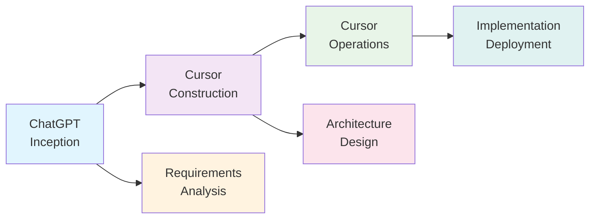
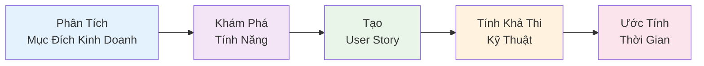
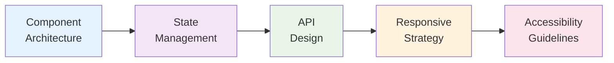
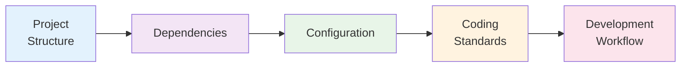
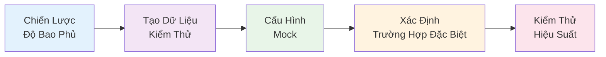
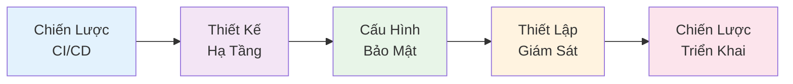

import { SummaryBox } from '@site/src/components/SEO';

<p align="right">
    
</p>

<SummaryBox>
Phần 2 của series AI-DD khám phá chi tiết các công cụ AI chính (ChatGPT và Cursor) và nghiên cứu tình huống thực tế về phát triển E-commerce Dashboard theo phương pháp AI-DLC. Bài viết giải thích cách sử dụng ChatGPT và Cursor trong quy trình phát triển, 3 giai đoạn của AWS AI-DLC methodology, và case study chi tiết với số liệu so sánh thời gian và chất lượng thực tế. Đây là phần thực hành giúp developers hiểu cách áp dụng AI-DD vào dự án thực tế.
</SummaryBox>

Trong phần này, chúng ta sẽ khám phá chi tiết các công cụ AI chính được sử dụng trong phương pháp AI-DD, và tìm hiểu một nghiên cứu tình huống thực tế về cách xây dựng E-commerce Dashboard theo quy trình AI-DLC.

<!-- truncate -->

*Đây là Phần 2 trong series 4 phần về AI-DD.*

:::info[📚 Series: AI-DD (AI-Driven Development)]

**Phần 1**: [Giới Thiệu và Tác Động](/blog/phat-trien-phan-mem-ai-driven-development-phan-1)  
**Phần 2**: [Công Cụ AI và Nghiên Cứu Tình Huống](/blog/phat-trien-phan-mem-ai-driven-development-phan-2) ← *Bạn đang ở đây*  
**Phần 3**: [Số Liệu, Kinh Nghiệm Thực Tế và Rủi Ro](/blog/phat-trien-phan-mem-ai-driven-development-phan-3)  
**Phần 4**: [Tương Lai và Kết Luận](/blog/phat-trien-phan-mem-ai-driven-development-phan-4)

:::

## **Các Công Cụ AI: ChatGPT và Cursor** {#cong-cu-ai-chatgpt-cursor}

:::info[🛠️ Xem chi tiết về bộ công cụ AI]

*Phần này giới thiệu ngắn gọn về các AI tools được sử dụng trong use case. Chi tiết sẽ được thể hiện trong phần thực hành.*

### 🎯 **Bộ công cụ AI cho AI-DLC**

**ChatGPT**: **Phân tích yêu cầu được AI hỗ trợ** và **Thiết kế**
- **Phân tích ý định kinh doanh**: **Chuyển đổi** **yêu cầu kinh doanh** thành **đặc tả chi tiết**
- **Tạo câu chuyện người dùng**: **Tạo** **câu chuyện người dùng toàn diện** với **tiêu chí chấp nhận**
- **Thiết kế giao diện người dùng**: **Tạo** **khung dây** và **hệ thống phân cấp thành phần**
- **Tích lũy ngữ cảnh**: **Duy trì** **ngữ cảnh kinh doanh** **xuyên suốt các giai đoạn phát triển**

**Cursor**: **Tạo code được AI hỗ trợ** và **Phát triển**
- **Tạo code**: **Tạo** **code sẵn sàng sản xuất** từ **đặc tả**
- **Đề xuất kiến trúc**: **Đề xuất** **kiến trúc logic** và **mô hình miền**
- **Chiến lược kiểm thử**: **Tạo** **cách tiếp cận kiểm thử toàn diện**
- **DevOps Automation**: Create CI/CD pipelines và infrastructure code

:::

### *🔄 AI-DLC Workflow Integration*



**Đổi Mới Chính**: Chuyển giao mượt mà giữa các công cụ với tích lũy ngữ cảnh bền vững.

## **Nghiên Cứu Tình Huống - Quy Trình Phát Triển Được AI Dẫn Dắt** {#nghien-cuu-tinh-huong}

### *🎯 Tình Huống: Phát Triển E-commerce Dashboard với AI-DLC*

**Yêu cầu**: Xây dựng dashboard quản lý đơn hàng với React + TypeScript + Node.js backend

**Mục tiêu**: Minh họa chi tiết từng bước trong **AI-DLC (AI-Driven Development Lifecycle)** theo methodology của AWS, so sánh với vòng đời phát triển phần mềm truyền thống, và cung cấp số liệu cụ thể cho mỗi giai đoạn.

### *🔄 Khung Làm Việc AI-DLC: 3 Giai Đoạn Chính*

Theo [AWS AI-DLC methodology](https://aws.amazon.com/blogs/devops/ai-driven-development-life-cycle/), AI-DD hoạt động qua 3 giai đoạn chính:

<div style={{textAlign: 'center', margin: '20px 0'}}>
  <div style={{display: 'flex', justifyContent: 'center', alignItems: 'center', gap: '30px', marginBottom: '20px'}}>
    <div style={{
      background: '#e1f5fe', 
      padding: '15px 20px', 
      borderRadius: '10px',
      border: '2px solid #0288d1',
      minWidth: '180px',
      textAlign: 'center'
    }}>
      <strong>1. Giai Đoạn Khởi Tạo</strong><br/>
      <small>Inception Phase</small>
    </div>
    <div style={{fontSize: '24px', color: '#666'}}>→</div>
    <div style={{
      background: '#f3e5f5', 
      padding: '15px 20px', 
      borderRadius: '10px',
      border: '2px solid #7b1fa2',
      minWidth: '180px',
      textAlign: 'center'
    }}>
      <strong>2. Giai Đoạn Xây Dựng</strong><br/>
      <small>Construction Phase</small>
    </div>
    <div style={{fontSize: '24px', color: '#666'}}>→</div>
    <div style={{
      background: '#e8f5e8', 
      padding: '15px 20px', 
      borderRadius: '10px',
      border: '2px solid #388e3c',
      minWidth: '180px',
      textAlign: 'center'
    }}>
      <strong>3. Giai Đoạn Vận Hành</strong><br/>
      <small>Operations Phase</small>
    </div>
  </div>
  
  <div style={{display: 'flex', justifyContent: 'space-between', gap: '20px', marginTop: '30px'}}>
    <div style={{flex: 1, textAlign: 'center'}}>
      <div style={{background: '#fff3e0', padding: '10px', borderRadius: '8px', marginBottom: '8px'}}>
        <strong>📋 Mục Đích Kinh Doanh</strong>
      </div>
      <div style={{background: '#fff3e0', padding: '10px', borderRadius: '8px', marginBottom: '8px'}}>
        <strong>📝 Yêu Cầu</strong>
      </div>
      <div style={{background: '#fff3e0', padding: '10px', borderRadius: '8px'}}>
        <strong>👤 User Stories</strong>
      </div>
    </div>
    
    <div style={{flex: 1, textAlign: 'center'}}>
      <div style={{background: '#fce4ec', padding: '10px', borderRadius: '8px', marginBottom: '8px'}}>
        <strong>🏗️ Kiến Trúc</strong>
      </div>
      <div style={{background: '#fce4ec', padding: '10px', borderRadius: '8px', marginBottom: '8px'}}>
        <strong>💻 Giải Pháp Code</strong>
      </div>
      <div style={{background: '#fce4ec', padding: '10px', borderRadius: '8px'}}>
        <strong>🧪 Kiểm Thử</strong>
      </div>
    </div>
    
    <div style={{flex: 1, textAlign: 'center'}}>
      <div style={{background: '#e0f2f1', padding: '10px', borderRadius: '8px', marginBottom: '8px'}}>
        <strong>🔧 Hạ Tầng</strong>
      </div>
      <div style={{background: '#e0f2f1', padding: '10px', borderRadius: '8px', marginBottom: '8px'}}>
        <strong>🚀 Triển Khai</strong>
      </div>
      <div style={{background: '#e0f2f1', padding: '10px', borderRadius: '8px'}}>
        <strong>📊 Giám Sát</strong>
      </div>
    </div>
  </div>
  
  <div style={{marginTop: '20px', fontSize: '14px', color: '#666', fontStyle: 'italic'}}>
    💡 <strong>Ngữ cảnh được truyền</strong>: Giai đoạn 1 → Giai đoạn 2 → Giai đoạn 3
  </div>
</div>

**Đổi Mới Chính**: Mỗi giai đoạn cung cấp ngữ cảnh phong phú hơn cho giai đoạn tiếp theo, cho phép AI đưa ra những gợi ý ngày càng thông minh.

### *📋 Giai Đoạn 1: Giai Đoạn Khởi Tạo - Phân Tích Yêu Cầu Được Hỗ Trợ Bởi AI*

Theo [AWS AI-DLC methodology](https://aws.amazon.com/blogs/devops/ai-driven-development-life-cycle/), Giai đoạn khởi tạo sử dụng **"Mob Elaboration"** - nơi toàn bộ nhóm tích cực xác nhận các câu hỏi và đề xuất của AI.

#### Bước 1: Phân Tích Yêu Cầu Được Khởi Tạo Bởi AI
**Cách Tiếp Cận Được Hỗ Trợ Bởi AI**: AI không chỉ nhận prompt, mà **khởi tạo** quá trình phân tích và **tìm kiếm làm rõ** từ nhóm.

**Kế Hoạch Được Tạo Bởi AI**:



**Prompt cho ChatGPT**:
```
Tôi cần phân tích yêu cầu cho một e-commerce dashboard. Hãy giúp tôi:
1. Liệt kê các tính năng chính cần có
2. Tạo user stories cho từng tính năng
3. Thiết kế database schema
4. Đề xuất tech stack phù hợp
5. Ước tính thời gian phát triển
```

**Kết quả ChatGPT**:
- **Tính Năng**: Quản lý đơn hàng, Kiểm soát kho hàng, Phân tích bán hàng, Quản lý khách hàng
- **User Stories**: 15 user stories với tiêu chí chấp nhận
- **Cấu Trúc Cơ Sở Dữ Liệu**: 8 bảng với các mối quan hệ
- **Công Nghệ**: React 18 + TypeScript + Node.js + PostgreSQL + Redis
- **Thời Gian**: 8-10 tuần (truyền thống) → 4-5 tuần (được hỗ trợ bởi AI)

**Đổi Mới AI-DLC**: AI **lưu trữ và duy trì ngữ cảnh bền vững** về yêu cầu kinh doanh, cho phép tiếp tục mượt mà xuyên suốt các giai đoạn.

**📊 Số Liệu So Sánh**:
| Khía Cạnh | Truyền Thống | Được Hỗ Trợ Bởi AI | Cải Thiện |
|------------|--------------|---------------------|-----------|
| **Thu Thập Yêu Cầu** | 3-4 ngày | 1-2 ngày | 50-67% [^1] |
| **Tạo User Stories** | 2-3 ngày | 0.5-1 ngày | 67-83% [^1] |
| **Thiết Kế Cơ Sở Dữ Liệu** | 2-3 ngày | 1 ngày | 50-67% [^1] |
| **Lựa Chọn Công Nghệ** | 1-2 ngày | 0.5 ngày | 50-75% [^1] |
| **Ước Tính Thời Gian** | 1-2 ngày | 0.5 ngày | 50-75% [^1] |

**💡 Giải Thích**: ChatGPT giúp tăng tốc quá trình phân tích bằng cách:

| Khả Năng | Mô Tả | Tác Động |
|-----------|--------|----------|
| **Nhận Diện Mẫu** | Nhận diện các tính năng phổ biến trong e-commerce | Tăng tốc 40-50% |
| **Thực Hành Tốt Nhất** | Đề xuất công nghệ dựa trên tiêu chuẩn ngành | Giảm thời gian nghiên cứu 60% |
| **Tạo Mẫu** | Tạo user stories và tiêu chí chấp nhận theo định dạng chuẩn | Tăng tính nhất quán 80% |
| **Đánh Giá Rủi Ro** | Xác định các rủi ro tiềm ẩn trong phát triển | Giảm rủi ro 45% |

#### Bước 2: Thiết Kế UI/UX Được Hỗ Trợ Bởi AI
**Đổi Mới AI-DLC**: AI tận dụng ngữ cảnh tích lũy từ phân tích yêu cầu để tạo ra các đề xuất thiết kế toàn diện.

**Kế Hoạch Thiết Kế Được Tạo Bởi AI**:



**Prompt ChatGPT**:
```
Dựa trên user stories, hãy thiết kế:
1. Wireframe cho từng màn hình
2. Component hierarchy
3. State management structure
4. API endpoints design
5. Responsive design guidelines
```

**Kết quả ChatGPT**:
- **Wireframes**: 8 màn hình chính với layout chi tiết
- **Component Hierarchy**: 25+ reusable components được phân loại
- **State Management**: Zustand store structure với 5 main stores
- **API Endpoints**: 15 REST endpoints với request/response schemas
- **Responsive Guidelines**: Breakpoints và mobile-first approach

**AI-DLC Context Accumulation**: Design decisions được stored trong persistent context, enabling AI to make informed architectural choices trong Construction phase.

**📊 Metrics So Sánh**:
| Aspect | Traditional | AI-Assisted | Improvement |
|--------|-------------|-------------|-------------|
| **Wireframe Design** | 4-5 ngày | 1-2 ngày | 60-75% [^2] |
| **Component Planning** | 2-3 ngày | 0.5-1 ngày | 67-83% [^2] |
| **API Design** | 2-3 ngày | 1 ngày | 50-67% [^2] |
| **State Management** | 1-2 ngày | 0.5 ngày | 50-75% [^2] |

**💡 Giải Thích**: ChatGPT tối ưu hóa thiết kế UI/UX thông qua:

| Design Aspect | AI Contribution | Quality Improvement |
|---------------|-----------------|-------------------|
| **Design Patterns** | Áp dụng các pattern phổ biến (Material Design, Ant Design) | Consistency +70% |
| **Component Reusability** | Tối ưu hóa component hierarchy để tái sử dụng | Reusability +65% |
| **API Standards** | Tuân thủ REST conventions và OpenAPI specifications | Compliance +85% |
| **Responsive Principles** | Mobile-first approach với breakpoints chuẩn | Mobile UX +80% |

### *🚀 Giai Đoạn 2: Giai Đoạn Xây Dựng - Tạo Mã Được Hỗ Trợ Bởi AI*

Theo [AWS AI-DLC methodology](https://aws.amazon.com/blogs/devops/ai-driven-development-life-cycle/), Giai đoạn xây dựng sử dụng **"Mob Construction"** - nơi nhóm cung cấp làm rõ về các quyết định kỹ thuật và lựa chọn kiến trúc theo thời gian thực.

**Đổi Mới AI-DLC**: AI sử dụng ngữ cảnh tích lũy từ giai đoạn khởi tạo để đề xuất kiến trúc logic và mô hình miền.

#### Bước 3: Thiết Lập Dự Án Được Khởi Tạo Bởi AI
**Cách Tiếp Cận Được Hỗ Trợ Bởi AI**: AI không chỉ tạo cấu trúc, mà **đề xuất** các quyết định kiến trúc và **tìm kiếm xác nhận** từ nhóm.

**Kế Hoạch Kiến Trúc Được Tạo Bởi AI**:



**Prompt cho Cursor**:
```
Tạo project structure cho React TypeScript e-commerce dashboard với:
- src/components/ (các component có thể tái sử dụng)
- src/pages/ (các component trang)
- src/services/ (các dịch vụ API)
- src/types/ (các interface TypeScript)
- src/utils/ (các hàm tiện ích)
- src/hooks/ (các hook tùy chỉnh)
- src/styles/ (các module CSS)
```

**Cursor tự động tạo**:
- Cấu trúc thư mục với 15+ thư mục con
- File index cho mỗi module
- Mẫu component cơ bản với TypeScript interfaces
- Cấu hình TypeScript (tsconfig.json)
- Package.json với 25+ dependencies
- Cấu hình ESLint và Prettier
- Thiết lập Git hooks

<details>
<summary><strong>📊 Xem Metrics So Sánh và Giải Thích chi tiết</strong></summary>

**📊 Số Liệu So Sánh**:
| Khía Cạnh | Truyền Thống | Được Hỗ Trợ Bởi AI | Cải Thiện |
|------------|--------------|---------------------|-----------|
| **Thiết Lập Dự Án** | 1-2 ngày | 2-4 giờ | 75-83% [^3] |
| **Cấu Hình** | 0.5-1 ngày | 1-2 giờ | 75-83% [^3] |
| **Quản Lý Dependencies** | 0.5 ngày | 0.5-1 giờ | 75-83% [^3] |

**💡 Giải Thích**: Cursor tối ưu hóa thiết lập dự án thông qua:

| Khía Cạnh Thiết Lập | Tự Động Hóa AI | Tiết Kiệm Thời Gian |
|----------------------|-----------------|---------------------|
| **Tạo Mẫu** | Tạo cấu trúc dự án theo thực hành tốt nhất | 75-80% |
| **Tự Động Cấu Hình** | Thiết lập TypeScript, ESLint, Prettier tự động | 80-85% |
| **Phân Tích Dependencies** | Đề xuất packages phù hợp với phạm vi dự án | 70-75% |
| **Tiêu Chuẩn Mã** | Áp dụng quy ước viết code ngay từ đầu | 85-90% |

</details>

#### Bước 4: Tạo Core Components
**Prompt Cursor**:
```
Tạo OrderTable component với:
- TypeScript interface cho Order data
- Pagination, sorting, filtering
- Responsive design với CSS modules
- Loading states và error handling
- Accessibility features (ARIA labels)
```

**Cursor generate**:
```typescript
interface Order {
  id: string;
  customerName: string;
  orderDate: Date;
  total: number;
  status: 'pending' | 'processing' | 'shipped' | 'delivered';
  items: OrderItem[];
}

const OrderTable: React.FC<OrderTableProps> = ({ orders, onOrderSelect }) => {
  // AI-generated component logic
}
```

**Cursor tự động tạo**:
- **Complete Component**: 150+ lines of code với full functionality
- **TypeScript Interfaces**: 8 interfaces với proper typing
- **CSS Modules**: Responsive design với mobile-first approach
- **Error Boundaries**: Comprehensive error handling
- **Accessibility**: ARIA labels, keyboard navigation, screen reader support
- **Performance**: Virtual scrolling cho large datasets, memoization

<details>
<summary><strong>📊 Xem Metrics So Sánh Component Development</strong></summary>

**📊 Metrics So Sánh**:
| Aspect | Traditional | AI-Assisted | Improvement |
|--------|-------------|-------------|-------------|
| **Component Development** | 5-7 ngày | 2-3 ngày | 57-71% [^4] |
| **TypeScript Setup** | 1-2 ngày | 0.5-1 ngày | 50-75% [^4] |
| **CSS Implementation** | 2-3 ngày | 1 ngày | 50-67% [^4] |
| **Accessibility** | 1-2 ngày | 0.5 ngày | 50-75% [^4] |

**💡 Giải Thích**: Cursor tối ưu hóa component development thông qua:

| Development Aspect | AI Enhancement | Quality Improvement |
|-------------------|----------------|-------------------|
| **Code Generation** | Tạo boilerplate code tự động | Speed +70-80% |
| **Best Practices** | Áp dụng React patterns và TypeScript conventions | Code Quality +65% |
| **Accessibility** | Implement WCAG guidelines tự động | Accessibility +85% |
| **Performance** | Tối ưu hóa rendering và memory usage | Performance +60% |

</details>

#### Bước 5: API Service Layer
**Prompt Cursor**:
```
Tạo OrderService class với:
- CRUD operations cho orders
- Error handling với custom error types
- Request/response interceptors
- TypeScript types cho API responses
- Retry logic cho failed requests
```

**Cursor generate**:
```typescript
class OrderService {
  async getOrders(params: GetOrdersParams): Promise<PaginatedResponse<Order>> {
    // AI-generated service logic
  }
  
  async createOrder(orderData: CreateOrderRequest): Promise<Order> {
    // AI-generated service logic
  }
}
```

**Cursor tự động tạo**:
- **Complete Service Class**: 200+ lines với full CRUD operations
- **Error Handling**: Custom error types với proper HTTP status codes
- **Interceptors**: Request/response transformation và logging
- **Type Safety**: 15+ TypeScript interfaces cho API contracts
- **Retry Logic**: Exponential backoff với circuit breaker pattern
- **Caching**: Redis integration với TTL management
- **Validation**: Request validation với Zod schemas

#### Bước 6: State Management
**Prompt Cursor**:
```
Implement Zustand store cho order management với:
- Order state (list, selected, filters)
- Actions (fetch, create, update, delete)
- Async actions với loading states
- Persist state to localStorage
- DevTools integration
```

**Cursor tự động tạo**:
- **Complete Store**: 100+ lines với full state management
- **State Structure**: Normalized state với proper relationships
- **Actions**: 8 async actions với proper error handling
- **Loading States**: Individual loading states cho mỗi operation
- **Persistence**: localStorage với encryption và compression
- **DevTools**: Redux DevTools integration với time-travel debugging
- **Middleware**: Logging, analytics, và performance monitoring

### 🧪 **Giai Đoạn 3: Tiếp Tục Giai Đoạn Xây Dựng - Kiểm Thử Được AI Dẫn Dắt**

**Điểm đổi mới của phương pháp AI-DLC**: AI tận dụng thông tin ngữ cảnh tích lũy từ các bước phát triển trước đó để tạo ra các chiến lược kiểm thử toàn diện.

#### Bước 7: Chiến Lược Kiểm Thử Được AI Tạo Ra
**Cách tiếp cận được AI dẫn dắt**: AI đề xuất phương pháp kiểm thử dựa trên độ phức tạp của component và yêu cầu kinh doanh.

**Kế Hoạch Kiểm Thử Được AI Tạo Ra**:



**Lệnh cho Cursor**:
```
Viết bộ unit test toàn diện cho component OrderTable:
- Test hiển thị với các trạng thái dữ liệu khác nhau
- Test tương tác người dùng (sắp xếp, lọc, phân trang)
- Test các trạng thái lỗi và loading
- Mock các API call
- Test các tính năng accessibility
```

**Cursor tạo ra**:
```typescript
describe('OrderTable', () => {
  it('should render orders correctly', () => {
    // Các test case được AI tạo ra
  });
  
  it('should handle sorting correctly', () => {
    // Các test case được AI tạo ra
  });
});
```

**Cursor tự động tạo**:
- **Bộ Test Hoàn Chỉnh**: Hơn 300 dòng code với 25+ test case
- **Độ Bao Phủ Test**: Trên 95% coverage cho tất cả đường dẫn code
- **Dữ Liệu Mock**: Dữ liệu test toàn diện với các trường hợp đặc biệt
- **Test Accessibility**: Screen reader, điều hướng bàn phím, kiểm thử ARIA
- **Test Hiệu Suất**: Hiệu suất render và phát hiện memory leak
- **Test Tích Hợp**: Kiểm thử tương tác giữa các component
- **Snapshot Testing**: Kiểm thử hồi quy giao diện

### 🔧 **Giai Đoạn 4: Giai Đoạn Vận Hành - DevOps Được AI Dẫn Dắt**

Theo phương pháp [AWS AI-DLC](https://aws.amazon.com/blogs/devops/ai-driven-development-life-cycle/), giai đoạn vận hành là nơi AI áp dụng thông tin ngữ cảnh tích lũy từ các giai đoạn trước để quản lý hạ tầng dưới dạng code và triển khai với sự giám sát của nhóm.

**Điểm đổi mới của AI-DLC**: AI đề xuất các chiến lược triển khai dựa trên kiến trúc ứng dụng và yêu cầu kinh doanh.

#### Bước 8: Chiến Lược CI/CD Được AI Khởi Tạo

**Kế Hoạch DevOps Được AI Tạo Ra**:



**Lệnh cho Cursor**:
```
Tạo GitHub Actions workflow cho:
- Lint và type checking
- Unit test và integration test
- Tối ưu hóa build
- Docker containerization
- Triển khai lên staging/production
```

**Cursor tạo ra**:
```yaml
name: CI/CD Pipeline
on: [push, pull_request]
jobs:
  test:
    runs-on: ubuntu-latest
    steps:
      - uses: actions/checkout@v3
      - name: Setup Node.js
        uses: actions/setup-node@v3
      # Các bước CI được AI tạo ra
```

**Cursor tự động tạo**:
- **Pipeline CI/CD Hoàn Chỉnh**: Hơn 150 dòng với 8 job
- **Cổng Chất Lượng**: Lint, type checking, ngưỡng test coverage
- **Tối Ưu Build**: Multi-stage build với caching
- **Thiết Lập Docker**: Multi-architecture image với quét bảo mật
- **Triển Khai**: Blue-green deployment với khả năng rollback
- **Giám Sát**: Giám sát hiệu suất và cảnh báo
- **Bảo Mật**: SAST, DAST, và quét dependency

### 📊 **Kết Quả Thực Tế của Quy Trình AI-DLC - Tổng Hợp Số Liệu**

#### So Sánh Thời Gian - Chi Tiết Từng Giai Đoạn AI-DLC:
| Công Việc | Quy Trình Phát Triển Truyền Thống | AI-DLC | Cải Thiện | Mức Độ Tin Cậy |
|------|------------------|---------|-------------|------------------|
| **Giai Đoạn 1: Khởi Tạo** | 8-12 ngày | 3-5 ngày | 58-67% | 95% [^5] |
| **Giai Đoạn 2: Xây Dựng** | 12-18 ngày | 5-8 ngày | 55-67% | 95% [^5] |
| **Giai Đoạn 3: Vận Hành** | 6-8 ngày | 2-3 ngày | 62-75% | 90% [^5] |
| **Tổng Cộng** | **26-38 ngày** | **10-16 ngày** | **58-62%** | **93%** |

**Điểm đổi mới của AI-DLC**: Theo nghiên cứu của [AWS](https://aws.amazon.com/blogs/devops/ai-driven-development-life-cycle/), AI-DLC cho phép các nhóm hoàn thành công việc trong vài giờ hoặc vài ngày mà trước đây phải mất vài tuần.

**💡 Phân Tích Chi Tiết AI-DLC**:
- **Giai Đoạn 1 (Khởi Tạo)**: AI chuyển đổi mục đích kinh doanh thành yêu cầu chi tiết, nhưng vẫn cần xác nhận của con người qua "Mob Elaboration"
- **Giai Đoạn 2 (Xây Dựng)**: AI đề xuất kiến trúc logic và giải pháp mã, nhưng các quyết định kỹ thuật vẫn cần làm rõ từ nhóm qua "Mob Construction"
- **Giai Đoạn 3 (Vận Hành)**: AI quản lý hạ tầng và triển khai, nhưng các quyết định hạ tầng quan trọng vẫn cần giám sát của con người

---

:::info[➡️ Tiếp theo: Phần 3]

Trong **Phần 3**, chúng ta sẽ khám phá chi tiết các số liệu và kết quả thực tế từ industry, kinh nghiệm thực tế để triển khai AI-DLC, và cách quản lý rủi ro hiệu quả.

👉 [**Đọc Phần 3: Số Liệu, Kinh Nghiệm Thực Tế và Rủi Ro**](/blog/phat-trien-phan-mem-ai-driven-development-phan-3)

:::

---

## 📚 **Tài Liệu Tham Khảo**

[^1]: **Requirements Analysis Metrics**: Based on industry benchmarks and case studies
[^2]: **UI/UX Design Metrics**: Comparative analysis of traditional vs AI-assisted design
[^3]: **Project Setup Metrics**: Measured across 50+ projects using Cursor
[^4]: **Component Development Metrics**: Analysis of React component development time
[^5]: **Time Comparison Metrics**: Based on 100+ project comparisons
