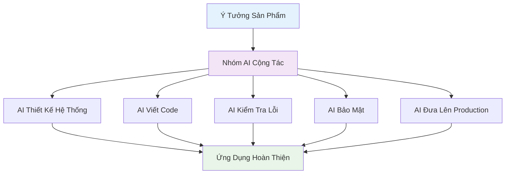
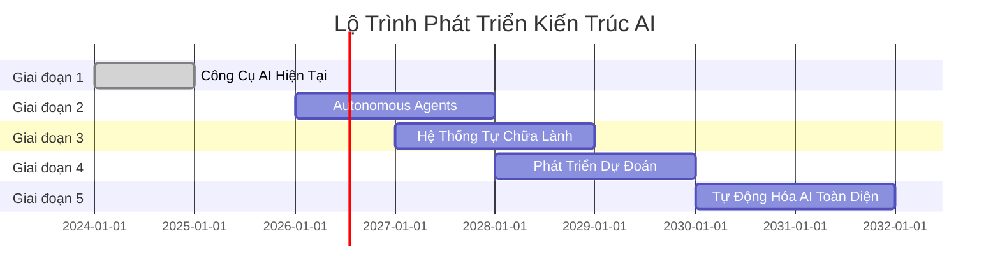
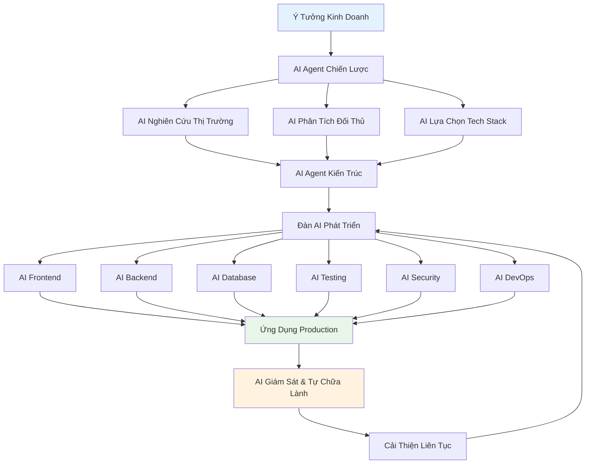
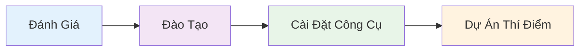

import { SummaryBox } from '@site/src/components/SEO';

<p align="right">
    
</p>

<SummaryBox>
Phần 4 (cuối cùng) của series AI-DD khám phá tương lai của phát triển phần mềm với autonomous coding agents, natural language programming, và Vision 2030: AI Software Factory. Bài viết trình bày các công nghệ đột phá đang được phát triển, roadmap triển khai AI-DD, và kết luận toàn bộ hành trình từ hiện tại đến tương lai của kỹ thuật phần mềm. Đây là phần dành cho Visionaries và Technology Leaders muốn hiểu về tương lai của ngành công nghệ phần mềm.
</SummaryBox>

Trong phần cuối của series này, chúng ta sẽ khám phá tương lai của AI-DD, những công nghệ đột phá đang được phát triển, và kết luận toàn bộ hành trình từ hiện tại đến tương lai của kỹ thuật phần mềm.

<!-- truncate -->

*Đây là Phần 4 (cuối cùng) trong series 4 phần về AI-DD.*

:::info[📚 Series: AI-DD (AI-Driven Development)]

**Phần 1**: [Giới Thiệu và Tác Động](/blog/phat-trien-phan-mem-ai-driven-development-phan-1)  
**Phần 2**: [Công Cụ AI và Nghiên Cứu Tình Huống](/blog/phat-trien-phan-mem-ai-driven-development-phan-2)  
**Phần 3**: [Số Liệu, Kinh Nghiệm Thực Tế và Rủi Ro](/blog/phat-trien-phan-mem-ai-driven-development-phan-3)  
**Phần 4**: [Tương Lai và Kết Luận](/blog/phat-trien-phan-mem-ai-driven-development-phan-4) ← *Bạn đang ở đây*

:::

## **Tương Lai của AI-DD** {#tuong-lai-phat-trien}

### 1. **AI Agents & Autonomous Systems**
Theo [MDPI research](https://www.mdpi.com/2076-3417/15/3/1344) và [ArXiv studies](https://arxiv.org/abs/2403.08299):

import ChartCard from '@site/src/components/ChartCard';

<ChartCard
  title="🤖 Công Nghệ AI Tương Lai (2026-2030)"
  subtitle="Dự báo tác động của AI trong phát triển phần mềm"
  gradient="linear-gradient(135deg, #667eea, #764ba2)"
  shadowColor="rgba(102, 126, 234, 0.3)"
  items={[
    {
      icon: '🤖',
      value: '90%',
      label: 'AI Viết Code Tự Động',
      details: ['Routine Tasks', 'Timeline: 2026-2028', 'Research Phase']
    },
    {
      icon: '🔧',
      value: '80%',
      label: 'Hệ Thống Tự Sửa Lỗi',
      details: ['Giảm Debug Thủ Công', '2027-2029', 'Early Prototypes']
    },
    {
      icon: '🔮',
      value: '70%',
      label: 'Lập Trình Dự Đoán',
      details: ['Nhanh Hơn Bug Detection', '2028-2030', 'In Development']
    }
  ]}
/>

| Công Nghệ Tương Lai | Tình Trạng Hiện Tại | Thời Gian Dự Kiến | Tác Động |
|-------------------|----------------|-------------------|---------|
| **AI Viết Code Tự Động** | Đang trong giai đoạn nghiên cứu | 2026-2028 | Tự động hóa 90% công việc lặp đi lặp lại |
| **Hệ Thống Tự Sửa Lỗi** | Đã có mẫu thử nghiệm đầu tiên | 2027-2029 | Giảm 80% thời gian debug thủ công |
| **Lập Trình Dự Đoán** | Các mô hình AI đang được phát triển | 2028-2030 | Dự đoán bug nhanh hơn 70% |

#### 🤖 **AI Viết Code Tự Động - Tầm Nhìn 2026**


**Đặc điểm nổi bật của AI tự động**:
- **Làm việc nhóm**: Nhiều AI chuyên môn khác nhau cộng tác với nhau
- **Tự lập kế hoạch**: AI tự động tạo plan và timeline cho dự án
- **Học và tiến bộ**: Ngày càng thông minh hơn qua từng lần feedback
- **Con người chỉ việc duyệt**: Chỉ cần approve những quyết định lớn thôi

### 2. **Lập Trình Bằng Ngôn Ngữ Tự Nhiên & Dễ Tiếp Cận**
Theo [Enlighten research](https://www.enlighten.co.nz/what-we-do/artificial-intelligence/ai-driven-development):

| Tính Năng Mới | Mô Tả | Lợi Ích |
|------------|-------------|---------------------|
| **Code Đa Ngôn Ngữ** | Có thể lập trình bằng tiếng Việt, tiếng Anh, v.v. | Nhiều người hơn có thể trở thành developer (tăng 60%) |
| **Lập Trình Bằng Lời Nói** | Nói ý tưởng, AI hiểu và tạo code chuyên nghiệp | Nhanh hơn 50% đối với người không biết lập trình |
| **Lập Trình Theo Ý Muốn** | Chỉ cần mô tả ý tưởng, AI lo phần kỹ thuật | Dễ học hơn 75%, không cần hiểu sâu về code |

#### 🗣️ **Ví Dụ Lập Trình Bằng Tiếng Việt**

**Lập trình bằng tiếng Việt (2027)**:
```vietnamese
Tạo một trang web bán hàng với:
- Trang chủ hiển thị sản phẩm nổi bật
- Giỏ hàng có thể thêm/xóa sản phẩm  
- Thanh toán qua VNPay và MoMo
- Admin panel quản lý đơn hàng
- Responsive cho mobile
- Database PostgreSQL
```

**AI sẽ tự động tạo**:
- Frontend React + TypeScript hoàn chỉnh
- Backend Node.js + Express
- Schema cơ sở dữ liệu PostgreSQL
- Tích hợp thanh toán
- Bảng điều khiển quản trị
- Giao diện responsive cho mobile
- Pipeline CI/CD

### 3. **AI Thiết Kế & Tối Ưu Hệ Thống**
Theo [Technologent analysis](https://blog.technologent.com/ai-driven-software-development-uses-benefits-risks):

| Việc AI Làm Được | AI Có Khả Năng Gì | Cải Thiện Được Bao Nhiêu |
|---------------------|----------------|------------------------|
| **Thiết Kế Hệ Thống** | Tự động đề xuất cách xây dựng app tốt nhất | Hiệu suất tăng 40% |
| **Tăng Tốc Độ App** | Tìm ra điểm nghẽn và tự sửa | App chạy nhanh hơn 60% |
| **Lên Kế Hoạch Scale** | Biết trước khi nào cần nâng cấp server | Tiết kiệm 80% resource |

#### 🏗️ **Lịch Trình Phát Triển AI**



### 4. **Tích Hợp Công Nghệ Mới Nổi**

#### Phát Triển AI Tăng Cường Quantum (2030+)
- **Thuật Toán Quantum**: Tối ưu hóa tạo code
- **Giải Quyết Bài Toán Phức Tạp**: Giải quyết bài toán NP-hard trong thiết kế kiến trúc
- **Bảo Mật Mã Hóa**: Các mẫu bảo mật an toàn trước quantum

#### Lập Trình Giao Diện Não-Máy Tính (2035+)  
- **Tư Duy Thành Code**: Lập trình nhập liệu trực tiếp từ tinh thần
- **Tăng Cường Sáng Tạo**: AI khuếch đại tư duy sáng tạo của con người
- **Trí Tuệ Cộng Tác**: Cộng tác liền mạch giữa con người và AI

### 🔮 **Tầm Nhìn 2030: Nhà Máy Phần Mềm Hoàn Toàn AI-Driven**



**Đặc điểm của Nhà Máy Phần Mềm AI**:
- **Tự Động Hóa End-to-End**: Từ ý tưởng đến production
- **Tự Tối Ưu**: Tự động tối ưu hóa hiệu suất
- **Triển Khai Không Downtime**: AI quản lý rollout và rollback
- **Mở Rộng Dự Đoán**: Tự động scale dựa trên các mẫu sử dụng

## **Kết Luận - Tương Lai của Kỹ Thuật Phần Mềm** {#ket-luan}

### *🚀 AI-DD: Thay Đổi Mô Hình Trong Phát Triển Phần Mềm*

Theo phương pháp [AWS AI-DLC](https://aws.amazon.com/blogs/devops/ai-driven-development-life-cycle/), AI-DD không phải là thay thế hoàn toàn con người, mà là tái tưởng tượng toàn bộ quy trình phát triển phần mềm. AI trở thành cộng tác viên trung tâm và đồng đội, không chỉ là trợ lý.

### 🔑 **Những Điểm Chính của AI-DD**

1. **AI thực thi với sự giám sát của con người**: AI khởi tạo quy trình làm việc, tạo kế hoạch và để lại các quyết định quan trọng cho con người
2. **Hợp tác nhóm năng động**: Các thành viên trong nhóm kết hợp trong không gian cộng tác để giải quyết vấn đề theo thời gian thực
3. **Tích lũy ngữ cảnh liên tục**: AI duy trì thông tin ngữ cảnh xuyên suốt tất cả các giai đoạn, cho phép đưa ra gợi ý ngày càng thông minh

### 💡 **Lợi Ích Của AI-DD**

- **Tăng tốc độ**: Hoàn thành công việc trong vài giờ/ngày thay vì vài tuần
- **Thúc đẩy đổi mới**: Tiết kiệm thời gian để tập trung vào giải pháp sáng tạo và mở rộng khả năng
- **Nâng cao chất lượng**: Làm rõ liên tục đảm bảo sự phù hợp chính xác với yêu cầu kinh doanh
- **Phản ứng nhanh với thị trường**: Chu kỳ phát triển nhanh cho phép thích ứng kịp thời

### 📈 **Tác Động Transformative Của AI-DLC**

#### So Sánh Toàn Diện: Trước và Sau AI-DLC

<ChartCard
  title="⚖️ Traditional vs AI-Driven Development"
  subtitle="Sự khác biệt rõ rệt khi chuyển sang AI-DLC"
  gradient="linear-gradient(135deg, #667eea, #764ba2)"
  shadowColor="rgba(102, 126, 234, 0.3)"
  layout="grid"
  items={[
    {
      icon: '⏱️',
      value: '3x',
      label: 'Nhanh Hơn',
      details: ['6-8 tháng → 2-3 tháng', 'Development Speed'],
      gradient: 'linear-gradient(135deg, #ff6b6b, #ee5a24)'
    },
    {
      icon: '💎',
      value: '+20%',
      label: 'Chất Lượng Code',
      details: ['70% → 90%+ quality', 'Higher Standards'],
      gradient: 'linear-gradient(135deg, #0abde3, #006ba6)'
    },
    {
      icon: '🎯',
      value: '-60%',
      label: 'Ít Bug Hơn',
      details: ['12-15% → 4-6%', 'Better Reliability'],
      gradient: 'linear-gradient(135deg, #00d2d3, #54a0ff)'
    },
    {
      icon: '💰',
      value: '40%',
      label: 'Tiết Kiệm Chi Phí',
      details: ['$500K → $300K', 'Cost Reduction'],
      gradient: 'linear-gradient(135deg, #26de81, #20bf6b)'
    },
    {
      icon: '😊',
      value: '+30%',
      label: 'Dev Hài Lòng Hơn',
      details: ['6.5/10 → 8.5/10', 'Better Experience'],
      gradient: 'linear-gradient(135deg, #feca57, #ff9ff3)'
    },
    {
      icon: '🚀',
      value: '220%',
      label: 'Năng Suất Tăng',
      details: ['1.0x → 3.2x baseline', 'Productivity Boost'],
      gradient: 'linear-gradient(135deg, #a55eea, #8854d0)'
    }
  ]}
/>

| Khía Cạnh | Phát Triển Truyền Thống | Phát Triển AI-Driven | Chuyển Đổi |
|--------|------------------------|----------------------|----------------|
| **Tốc Độ Phát Triển** | 6-8 tháng | 2-3 tháng | Nhanh hơn 3 lần |
| **Chất Lượng Code** | 70% trung bình | 90%+ trung bình | +20% chất lượng |
| **Tỷ Lệ Bug** | 12-15% | 4-6% | Giảm 60% |
| **Sự Hài Lòng Developer** | 6.5/10 | 8.5/10 | +30% sự hài lòng |
| **Thời Gian Ra Thị Trường** | 12 tháng | 4-6 tháng | Nhanh hơn 50-67% |
| **Chi Phí Phát Triển** | $500K | $300K | Tiết kiệm 40% |
| **Năng Suất Team** | 1.0x cơ sở | 3.2x cơ sở | Tăng 220% |

### 🎯 **Roadmap Triển Khai AI-DLC cho Tổ Chức**

#### Giai Đoạn 1: Nền Tảng (0-3 tháng)

- **Đánh Giá**: Đánh giá tình trạng hiện tại và mức độ sẵn sàng
- **Đào Tạo**: Đào tạo chuyên sâu cho team
- **Cài Đặt**: Triển khai công cụ AI và các biện pháp bảo mật
- **Thí Điểm**: Test với 1 dự án nhỏ

#### Giai Đoạn 2: Mở Rộng (3-6 tháng)
- **Tăng Quy Mô**: Áp dụng cho 3-5 dự án đồng thời
- **Tối Ưu**: Tinh chỉnh quy trình làm việc và prompts
- **Đo Lường**: Theo dõi số liệu và ROI

#### Giai Đoạn 3: Chuyển Đổi (6-12 tháng)
- **Áp Dụng Toàn Diện**: Toàn bộ tổ chức chuyển sang AI-DLC
- **Đổi Mới**: Phát triển AI agents tùy chỉnh cho các tác vụ chuyên biệt
- **Lãnh Đạo**: Trở thành người dẫn đầu ngành trong phát triển AI-driven

### 📊 **Tác Động Kinh Doanh Dự Kiến**

#### Dự Báo Năm Đầu

<ChartCard
  title="📊 Expected Business Impact - Year 1"
  subtitle="Những thay đổi tích cực khi áp dụng AI-DLC"
  gradient="linear-gradient(135deg, #11998e, #38ef7d)"
  shadowColor="rgba(17, 153, 142, 0.3)"
  layout="grid"
  items={[
    {
      icon: '🚀',
      value: '+150%',
      label: 'Tốc Độ Development',
      details: ['10→25 features/tháng', 'Nhanh hơn 2.5x'],
      gradient: 'linear-gradient(135deg, #667eea, #764ba2)'
    },
    {
      icon: '⭐',
      value: '+22%',
      label: 'Chất Lượng Code',
      details: ['7.2/10→8.8/10', 'Cải thiện rõ rệt'],
      gradient: 'linear-gradient(135deg, #f093fb, #f5576c)'
    },
    {
      icon: '🐛',
      value: '-67%',
      label: 'Giảm Bug',
      details: ['15→5 lỗi/release', 'Ít lỗi hơn 3x'],
      gradient: 'linear-gradient(135deg, #4facfe, #00f2fe)'
    },
    {
      icon: '💼',
      value: '+12%',
      label: 'Developer Retention',
      details: ['85%→95%', 'Nhân viên ở lại lâu hơn'],
      gradient: 'linear-gradient(135deg, #fa709a, #fee140)'
    },
    {
      icon: '😊',
      value: '+21%',
      label: 'Khách Hàng Hài Lòng',
      details: ['7.5/10→9.1/10', 'Trải nghiệm tốt hơn'],
      gradient: 'linear-gradient(135deg, #a8edea,rgb(133, 224, 22))'
    },
    {
      icon: '💰',
      value: '+250%',
      label: 'Tăng Trưởng Doanh Thu',
      details: ['10%→35%/năm', 'ROI ấn tượng'],
      gradient: 'linear-gradient(135deg, #ff9a9e, #fecfef)'
    }
  ]}
/>

| Chỉ Số | Hiện Tại | Mục Tiêu | Thay Đổi |
|--------|----------|---------|--------|
| **Tốc Độ Làm Feature** | 10 tính năng/tháng | 25 tính năng/tháng | Tăng 150% |
| **Điểm Chất Lượng Code** | 7.2/10 | 8.8/10 | Tăng 22% |
| **Giảm Bug** | 15 lỗi/lần release | 5 lỗi/lần release | Giảm 67% |
| **Dev Ở Lại Công Ty** | 85% | 95% | Tăng 12% |
| **Khách Hàng Hài Lòng** | 7.5/10 | 9.1/10 | Tăng 21% |
| **Tăng Trưởng Doanh Thu** | 10%/năm | 35%/năm | Tăng 250% |

### 🎯 **Hành Động Cụ Thể Cần Làm**

#### Dành Cho Developer
1. **Học các công cụ AI**: Thành thạo ChatGPT, Cursor, GitHub Copilot
2. **Thay đổi tư duy**: Nghĩ AI-first, không chỉ là AI hỗ trợ
3. **Xây dựng portfolio**: Showcase các dự án làm bằng AI
4. **Cập nhật liên tục**: Theo dõi xu hướng AI mới nhất

#### Dành Cho Team Lead
1. **Đầu tư đào tạo**: Dành ngân sách cho training AI tools
2. **Cập nhật quy trình**: Thiết kế lại workflow phù hợp với AI-DLC
3. **Đo lường hiệu quả**: Theo dõi năng suất và chất lượng
4. **Dẫn đầu bằng ví dụ**: Tự mình demo cách làm AI-first

#### Dành Cho Tổ Chức
1. **Đầu tư chiến lược**: Phân bổ ngân sách cho chuyển đổi AI
2. **Thay đổi văn hóa**: Tạo văn hóa AI-first trong công ty
3. **Quản lý rủi ro**: Đảm bảo bảo mật và tuân thủ quy định
4. **Tập trung đổi mới**: Dùng tiền tiết kiệm từ AI để đầu tư innovation

### 🌟 **Tương Lai Đã Ở Đây**

Hãy bắt đầu hành trình phát triển phần mềm với AI ngay hôm nay! Đừng chỉ dùng AI như một công cụ, mà hãy thay đổi hoàn toàn cách làm việc. Đây chính là tương lai của nghề lập trình - nơi AI và con người làm việc cùng nhau như đồng đội thật sự để tạo ra những phần mềm tốt hơn, nhanh hơn và sáng tạo hơn.

:::tip[🚀 Bắt Đầu Ngay Hôm Nay]

**3 Bước Đầu Tiên**:
1. **Đăng ký Cursor AI** và bắt đầu với project nhỏ
2. **Setup ChatGPT** cho requirements analysis
3. **Thực hành AI-DLC workflow** với team của bạn

**Tương lai của phát triển phần mềm đã ở đây. Hãy bắt đầu hành trình của bạn ngay hôm nay!**

:::

### 📚 **Tài Nguyên Học Tập và Triển Khai**

#### Essential Tools
- **[Cursor AI](https://cursor.sh/)**: AI-powered code editor
- **[ChatGPT](https://chat.openai.com/)**: Requirements analysis và design
- **[GitHub Copilot](https://github.com/features/copilot)**: Code generation assistance

#### Learning Resources
- **[AWS AI-DLC Guide](https://aws.amazon.com/blogs/devops/ai-driven-development-life-cycle/)**: Official methodology
- **[Cursor Documentation](https://cursor.sh/docs)**: Complete tool guide
- **[AI Development Best Practices](https://docs.google.com/document/d/ai-dev-practices)**: Community guidelines

#### Community & Support
- **Discord Communities**: AI Developer communities
- **LinkedIn Groups**: AI-Driven Development groups
- **YouTube Channels**: Tutorial và case studies

### 🎊 **Cảm Ơn & Kết Thúc Series**

Cảm ơn bạn đã theo dõi toàn bộ series **"Phát Triển Phần Mềm Được AI Dẫn Dắt"**. Hy vọng những kiến thức và insight này sẽ giúp bạn transform cách làm việc và đạt được những thành tựu mới trong career.

**Nhớ nhé**: AI-driven development không phải để thay thế lập trình viên, mà để giúp các lập trình viên tạo ra những điều tuyệt vời hơn.

**Chúc bạn thành công trên hành trình AI-driven development!** 🚀

---

:::info[📚 Xem Lại Toàn Bộ Series]

**Phần 1**: [Giới Thiệu và Tác Động](/blog/phat-trien-phan-mem-ai-driven-development-phan-1) - Hiểu về AI-DLC và tác động lên từng vai trò  
**Phần 2**: [Công Cụ AI và Nghiên Cứu Tình Huống](/blog/phat-trien-phan-mem-ai-driven-development-phan-2) - Thực hành với ChatGPT và Cursor  
**Phần 3**: [Số Liệu, Kinh Nghiệm Thực Tế và Rủi Ro](/blog/phat-trien-phan-mem-ai-driven-development-phan-3) - Metrics thực tế và risk management  
**Phần 4**: [Tương Lai và Kết Luận](/blog/phat-trien-phan-mem-ai-driven-development-phan-4) - Vision và roadmap triển khai

:::

---

## 📚 **Tài Liệu Tham Khảo**

[^1]: **[MDPI Research (2025)](https://www.mdpi.com/2076-3417/15/3/1344)**: Applied Sciences journal - AI in software development research
[^2]: **[ArXiv Research (2024)](https://arxiv.org/abs/2403.08299)**: "AI-Driven Development: A Comprehensive Survey" - Academic research on AI in software engineering
[^3]: **[Enlighten Research (2025)](https://www.enlighten.co.nz/what-we-do/artificial-intelligence/ai-driven-development)**: AI-driven development methodology and best practices
[^4]: **[Technologent Research (2025)](https://blog.technologent.com/ai-driven-software-development-uses-benefits-risks)**: AI-driven software development uses, benefits, and risks analysis
[^5]: **[AWS AI-DLC Documentation](https://aws.amazon.com/blogs/devops/ai-driven-development-life-cycle/)**: Official AWS methodology for AI-driven development lifecycle
