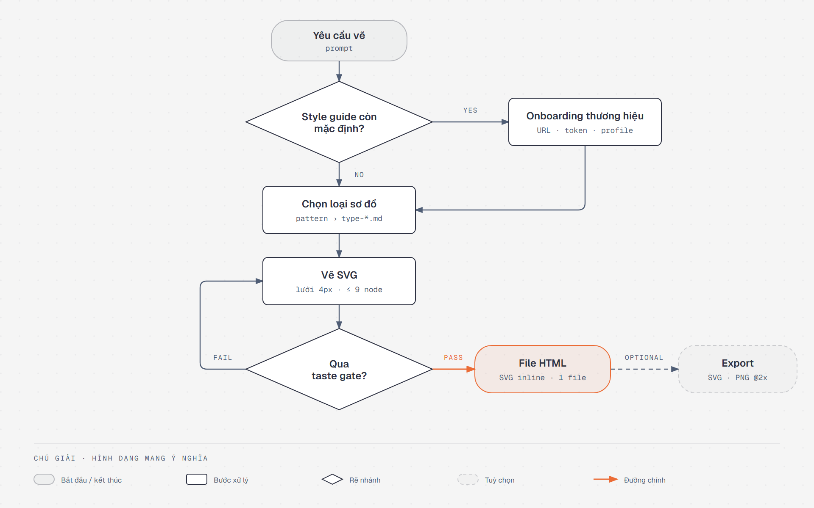

import { SummaryBox, FAQSection } from '@site/src/components/SEO';

# Diagram Design

<SummaryBox>
[Diagram Design](https://github.com/cathrynlavery/diagram-design) là một skill mã nguồn mở (giấy phép MIT) của Cathryn Lavery, dùng cho các AI agent như Claude Code, Codex và GitHub Copilot. Cài vào rồi, bạn chỉ cần bảo agent "vẽ sơ đồ kiến trúc cho hệ thống này" là nhận về một file HTML chứa sơ đồ gọn gàng, bố cục rõ ràng, không còn cảnh hộp chồng hộp hay mũi tên chéo lung tung. Nó vẽ được 44 loại sơ đồ và vẽ lại được sơ đồ cũ từ draw.io, Mermaid, Excalidraw. Màu, font và nền tối đổi được theo thương hiệu của bạn. Riêng với tiếng Việt, bạn nên đổi font tiêu đề, vì font mặc định thiếu nhiều chữ có dấu.
</SummaryBox>

Bài này là bài giới thiệu, chưa phải đánh giá sau thời gian dài sử dụng. Thông tin lấy từ [README trên GitHub](https://github.com/cathrynlavery/diagram-design) và file hướng dẫn `SKILL.md` của bản 2.6.68. Phần font tiếng Việt và độ tương phản màu là tôi tự kiểm tra.

<!-- truncate -->

## Vài thuật ngữ trước khi đọc

Bài có dùng một số từ tiếng Anh vì đó là tên gọi trong tài liệu gốc. Nghĩa của chúng trong bài như sau:

| Thuật ngữ | Nghĩa |
|---|---|
| Skill | Một bộ hướng dẫn bằng văn bản cài vào agent, dạy agent cách làm một việc cụ thể. Nó không phải code chạy được. |
| Node | Một ô trong sơ đồ: hộp chữ nhật, hình thoi, hình bầu dục… |
| Màu nhấn (accent) | Màu nổi bật duy nhất trong sơ đồ, dùng để chỉ chỗ quan trọng nhất |
| Skin | Phần "da" của sơ đồ: màu và font. Đổi skin không làm thay đổi bố cục. |
| Token | Một giá trị thiết kế có tên, ví dụ `accent = #eb6c36` |
| Hồ sơ (profile) | Một bộ skin được lưu lại có tên, để dùng lại về sau |

## Vì sao cần nó

Khi bạn bảo một AI agent "vẽ giúp sơ đồ kiến trúc", kết quả thường rơi vào một trong hai kiểu.

Kiểu thứ nhất là một đoạn Mermaid. Nội dung đúng, nhưng bố cục do máy tự xếp, các mũi tên cắt chéo nhau, nhìn là biết máy làm.

Kiểu thứ hai là một trang HTML nền tối, viền phát sáng màu xanh tím, mười mấy cái hộp giống hệt nhau, hộp nào cũng được tô màu "quan trọng".

README của Diagram Design gọi kiểu thứ hai là **"AI slop"**, tạm hiểu là "đồ AI làm cẩu thả". Skill liệt kê rõ từng lỗi để agent tránh:

| Lỗi thường gặp | Vì sao bị cấm |
|---|---|
| Nền tối kèm viền phát sáng xanh, tím | Trông có vẻ "kỹ thuật" nhưng không có chủ đích thiết kế nào |
| Dùng font mono (JetBrains Mono) cho mọi chữ | Font mono chỉ dành cho nội dung kỹ thuật như port, lệnh, URL |
| Mọi node là một cái hộp giống hệt nhau | Người đọc không biết cái nào chính, cái nào phụ |
| Đổ bóng | Bị cấm hoàn toàn, chỉ dùng viền |
| Bo góc thật tròn | Tối đa 6–10px, hoặc không bo |
| Tô màu nhấn cho mọi node "quan trọng" | Màu nhấn chỉ cho 1–2 chỗ, tô nhiều thì mất tác dụng |
| Giữ nguyên bố cục do Mermaid tự xếp | Bố cục tự động thường rối, thiếu chủ đích |

## Cài đặt và vẽ sơ đồ đầu tiên

Với Claude Code, chạy hai lệnh:

```bash
/plugin marketplace add cathrynlavery/diagram-design
/plugin install diagram-design@diagram-design
```

Với Codex:

```bash
codex plugin marketplace add cathrynlavery/diagram-design
codex plugin add diagram-design@diagram-design
```

Với GitHub Copilot CLI:

```bash
copilot plugin marketplace add cathrynlavery/diagram-design
copilot plugin install diagram-design@diagram-design
```

Với các agent khác hỗ trợ chuẩn Agent Skills:

```bash
npx skills add cathrynlavery/diagram-design
```

README còn có hướng dẫn cho Factory Droid, Pi, Kiro, OpenCode và Claude Cowork.

Cài xong, bạn không cần gõ lệnh gì đặc biệt. Cứ yêu cầu như bình thường, ví dụ "vẽ sơ đồ sequence cho luồng đăng nhập OAuth", skill sẽ tự được kích hoạt.

Ngoài ra có vài lệnh cho việc cụ thể:

| Lệnh | Việc nó làm |
|---|---|
| `/diagram-design:doctor` | Kiểm tra máy đã đủ điều kiện chạy chưa |
| `/diagram-design:import-mermaid` | Vẽ lại một sơ đồ Mermaid |
| `/diagram-design:import-drawio` | Vẽ lại một file draw.io |
| `/diagram-design:import-excalidraw` | Vẽ lại một bảng Excalidraw |
| `/diagram-design:export-diagram` | Xuất file HTML ra ảnh `.svg` và `.png` |
| `/diagram-design:profile` | Lưu, nạp, xoá hồ sơ thương hiệu |

Muốn xuất ảnh PNG thì cài thêm Playwright và Chromium:

```bash
pip install playwright && playwright install chromium
```

Một lưu ý an toàn: README nói rõ bản chính thức chỉ có ở repository này. Hãy tin lời đó. Skill là văn bản được nạp thẳng vào agent, nên cài một bản lạ cũng giống như để người lạ viết hướng dẫn cho agent của bạn.

## Agent vẽ một sơ đồ như thế nào

Sơ đồ dưới đây mô tả các bước agent đi qua khi nhận một yêu cầu vẽ. Bản thân nó cũng được vẽ bằng Diagram Design, dùng skin mặc định.



Đi lần lượt từng bước:

1. **Kiểm tra skin.** Nếu dự án vẫn đang dùng màu mặc định, agent dừng lại hỏi bạn có muốn đổi theo thương hiệu không (bước "Onboarding thương hiệu"). Phần này nói kỹ ở mục [Tuỳ biến](#tuỳ-biến-màu-font-nền-tối).
2. **Chọn loại sơ đồ.** Agent chọn một trong 44 loại, rồi đọc file hướng dẫn riêng của loại đó.
3. **Vẽ.** Agent vẽ SVG theo các quy tắc của skill.
4. **Tự chấm điểm.** Skill gọi bước này là **taste gate**, tức "cửa kiểm tra gu thẩm mỹ". Đó là một danh sách câu hỏi: chọn đúng loại sơ đồ chưa, còn bỏ bớt được node hay mũi tên nào không, màu nhấn có dùng quá hai chỗ không, các quy tắc kỹ thuật đã đúng chưa. Trượt câu nào thì agent quay lại vẽ.
5. **Xuất file.** Kết quả luôn là một file HTML. Xuất ra SVG hay PNG là bước tuỳ chọn, chỉ làm khi bạn yêu cầu.

Ảnh trên là bản PNG chụp lại. File gốc là [diagram-design-flow.html](pathname:///files/diagram-design/vi/diagram-design-flow.html), bạn có thể mở thẳng trong trình duyệt. Tôi chỉ sửa một chỗ trong file này là font tiêu đề, lý do nằm ở [mục tiếng Việt](#sơ-đồ-tiếng-việt-lỗi-font-tiêu-đề-và-cách-sửa).

Máy tôi chưa cài Playwright, nên tôi chụp PNG bằng Chrome chạy ở chế độ không giao diện (`--screenshot --force-device-scale-factor=2`). Ảnh ra cùng kích thước 1920×1200.

## Nguyên tắc: bớt đi thay vì thêm vào

Phần triết lý trong `SKILL.md` mở đầu bằng câu:

> The highest-quality move is usually deletion.

Dịch ra là: nước đi tốt nhất thường là xoá bớt. Từ câu này, skill rút ra mấy quy tắc:

- Mỗi node phải là một ý riêng. Hai node lúc nào cũng đi cùng nhau thì gộp làm một.
- Mỗi đường nối phải mang thông tin. Nếu nhìn vị trí đã hiểu quan hệ thì bỏ đường đó đi.
- Độ dày đặc nên ở mức 4/10: đủ thông tin, nhưng người đọc tự hiểu được mà không cần ai giải thích.
- Sơ đồ chỉ xong khi không còn gì bỏ được nữa, chứ không phải khi đã thêm đủ mọi thứ.

Những quy tắc này được biến thành giới hạn cứng:

| Giới hạn cho mỗi sơ đồ | Tối đa |
|---|---|
| Node | 9 |
| Mũi tên | 12 |
| Chỗ dùng màu nhấn | 2 |
| Chú thích | 2 |

Vượt giới hạn thì phải tách thành hai sơ đồ: một sơ đồ tổng quan và một sơ đồ chi tiết. Ai từng phải đọc một slide có ba mươi cái hộp microservice sẽ thấy quy tắc này đáng giá thế nào.

Trước khi vẽ, agent còn phải tự hỏi: *người đọc có hiểu thêm được gì từ sơ đồ này, so với một đoạn văn viết tốt không?* Nếu không thì đừng vẽ. Ví dụ:

- Một danh sách thì dùng bảng hoặc gạch đầu dòng.
- So sánh trước/sau mà chỉ khác vài thuộc tính thì dùng bảng.
- "Sơ đồ" chỉ có một hình thì viết thành một câu là đủ.

## Giao diện mặc định

**Màu.** Nền xám rất nhạt `#f5f5f5`, chữ xanh đen `#2d3142`, chữ phụ xám xanh `#4f5d75`, và một màu nhấn cam `#eb6c36`.

**Font.** Ba họ font, mỗi họ một việc:

| Dùng cho | Font |
|---|---|
| Tiêu đề trang | Instrument Serif (có chân) |
| Tên node | Geist (không chân), đậm |
| Nhãn kỹ thuật như port, URL, kiểu dữ liệu | Geist Mono (đơn cách) |
| Chú thích | Instrument Serif nghiêng |

**Đường nối.** Đây là phần quy định kỹ nhất, với sáu quy tắc bắt buộc:

- Chỉ bẻ góc vuông, bo góc 8px, không có đường chéo.
- Nhãn trên mũi tên tối đa 14 ký tự, viết hoa, có nền che phía sau và cách nét vẽ 6–10px.
- Hai đường song song cách nhau ít nhất 12px.
- Nhiều đường cùng nối vào một cạnh hộp thì mỗi đường có điểm nối riêng.
- Không đường nào được chạy ngầm phía sau một cái hộp không liên quan.
- Nền che của nhãn không được đè lên node vẽ sau nó.

Vi phạm bất kỳ quy tắc nào trong sáu quy tắc này đều bị tính là trượt.

**Biến thể.** Mỗi sơ đồ có ba bản: nền sáng (mặc định), nền tối, và bản "full editorial" có thêm thẻ tóm tắt cho bài viết dài. Ngoài ra còn có kiểu nét vẽ tay và kiểu khung cửa sổ terminal.

## 44 loại sơ đồ

README ghi 42 loại, còn `SKILL.md` bản 2.6.68 ghi 44. Có lẽ README chưa cập nhật kịp. Gom theo nhóm:

| Nhóm | Các loại |
|---|---|
| Hệ thống | Architecture, Architecture delta (trước/sau), IT current-state, Deployment, Dependency graph, High-level |
| Luồng và hành vi | Flowchart, Sequence, State machine, Swimlane, Process, User journey |
| Dữ liệu | ER, Database schema, UML class, Data flow, Medallion, DP integration, DP security matrix |
| Cấu trúc | Tree, Org chart, Nested, Layer stack, Venn, Pyramid/funnel |
| Biểu đồ số liệu | Bar, Line, Scatter, Heatmap, Treemap, Waterfall, Sankey, Radar, Polar |
| Kế hoạch, chiến lược | Timeline, Gantt, Kanban, Story map, Quadrant, Wardley map, Fishbone, Loop |
| Không gian | Exploded axonometric, Axonometric plan |

Mỗi loại có file hướng dẫn riêng, kèm danh sách lỗi riêng của loại đó. Muốn xem mẫu của tất cả thì vào [trang gallery](https://cathrynlavery.github.io/diagram-design/).

Có một tầng nữa gọi là **semantic pattern**, tạm dịch là "mẫu ý nghĩa". Nó dùng khi thứ bạn muốn thể hiện là *hành vi*, không chỉ là *hình dạng*. Ví dụ: một hàng đợi đang bị nghẽn, hay một quy trình có thử lại và huỷ giữa chừng. Khi đó agent chọn mẫu ý nghĩa trước, rồi mới chọn loại sơ đồ để sắp xếp. Lý do: cùng một sơ đồ luồng dữ liệu có thể đang kể chuyện nghẽn cổ chai, hoặc chuyện làm sạch dữ liệu thô, và mỗi chuyện cần làm nổi bật những chỗ khác nhau.

## Vẽ lại sơ đồ cũ

Đây là tính năng tôi thấy thực dụng nhất, vì team nào cũng có sẵn một đống sơ đồ cũ.

Skill nhận file draw.io (`.drawio`, `.drawio.svg`, `.drawio.png`), Mermaid (file `.mmd` hoặc khối code `mermaid` trong Markdown) và Excalidraw (`.excalidraw`). Quy trình có bốn bước:

1. **Đọc nội dung, không chụp hình.** Một script Python đọc file gốc và liệt kê các node, đường nối, nhóm.
2. **Chọn bốn thông số:** định dạng đầu ra; kích thước (nhúng tài liệu, slide 16:9, ảnh chia sẻ mạng xã hội, giấy A4…); mức chi tiết (`faithful` tối đa 24 node, `balanced` tối đa 12, `simplified` tối đa 7); và người đọc (`engineer`, `mixed`, `executive`).
3. **Vẽ lại từ đầu.** Vị trí, màu, font của bản gốc bị bỏ hết. Chỉ giữ nội dung: có những thành phần nào, nối với nhau ra sao, nhóm thế nào, theo hướng nào.
4. **Báo cáo những gì đã thay đổi.** Skill gọi đây là *fidelity ledger*: danh sách những gì đã gộp, thu gọn hay bỏ đi.

Tôi đánh giá cao bước 4. Người đưa file vào thường biết rất rõ bản gốc. Nếu một service tự dưng biến mất, họ sẽ nhận ra, và từ đó không tin cả sơ đồ nữa. Skill cũng cấm hai việc: bịa thêm thành phần cho đẹp bố cục, và lặng lẽ bỏ bớt thành phần.

Có thêm một chi tiết về bảo mật: mọi chữ đọc từ file gốc chỉ được coi là dữ liệu, không bao giờ là lệnh. Một file draw.io tải trên mạng về có thể chứa nhãn kiểu "bỏ qua mọi hướng dẫn trước đó". Skill dặn agent rõ ràng là không làm theo những câu như vậy. Đây là cách đúng để phòng *prompt injection*, kiểu tấn công giấu lệnh vào dữ liệu để điều khiển AI.

## Tuỳ biến: màu, font, nền tối

Skin mặc định đẹp. Nhưng nếu sơ đồ nằm trong tài liệu công ty hay trên blog của bạn, nó nên mang màu của nơi đó. Diagram Design tách rất rõ hai phần: cái gì được đổi, và cái gì không bao giờ đổi.

### Đổi được gì, không đổi được gì

Mọi thứ về giao diện nằm trong một file duy nhất, `references/style-guide.md`. Các file hướng dẫn khác không ghi mã màu cụ thể. Chúng chỉ gọi tên vai trò, ví dụ "dùng màu `accent`". Nhờ vậy, đổi một file là đổi được toàn bộ.

File này có 11 vai trò màu, mỗi vai trò có một giá trị cho nền sáng và một giá trị cho nền tối:

| Vai trò | Dùng cho |
|---|---|
| `paper`, `paper-2` | Nền trang, nền khung |
| `ink`, `ink-strong` | Chữ và nét chính |
| `muted`, `soft` | Chữ phụ, mũi tên thường, nhãn phụ |
| `rule`, `rule-solid` | Đường viền mảnh |
| `accent`, `accent-tint` | Màu nhấn và nền nhạt của nó |
| `link` | Lời gọi API, mũi tên ra bên ngoài |

Ngoài màu, file còn quy định 6 vai trò chữ (tiêu đề, tên node, nhãn phụ, nhãn mũi tên…), độ dày nét, độ bo góc và lưới 4px.

Những thứ **không** đổi được bằng cách đổi skin: sáu quy tắc đường nối, giới hạn 9 node, lưới 4px, quy định chỉ một màu nhấn. Đó là "ngữ pháp" của skill. Vì vậy, dù bạn đổi sang màu thương hiệu nào, sơ đồ vẫn giữ được sự gọn gàng như cũ.

### Bốn cách đổi skin

1. **Onboarding:** đưa cho agent một nguồn thiết kế, nó tự lấy màu và font ra. Nguồn có thể là địa chỉ website, một skill khác có chứa token thiết kế, hoặc một thư mục design system trên máy.
2. **Sửa tay:** mở `style-guide.md` và đổi mã màu.
3. **Dán token:** dán file token thiết kế dạng JSON vào `style-guide.md`, rồi gán từng token vào vai trò tương ứng.
4. **Hồ sơ:** lưu nhiều skin có tên, chuyển qua lại, hoặc gắn cố định một skin cho một dự án.

Lần đầu vẽ trong một dự án mà màu còn mặc định, agent sẽ hỏi bạn chọn cách nào. Có sáu lựa chọn: website, skill, thư mục, dán token, giữ mặc định, hoặc nạp hồ sơ đã lưu.

### Onboarding: để agent tự lấy màu từ website

Quy trình gồm sáu bước: đọc nguồn → lấy màu và font → gán vào vai trò → cho bạn xem trước thay đổi → ghi lại khi bạn đồng ý → đề nghị lưu thành hồ sơ.

Agent gán màu theo hai cách. Với website, nó nhìn vị trí. Với file token, nó nhìn tên biến:

| Vai trò | Lấy từ website | Lấy từ tên biến chứa |
|---|---|---|
| `paper` | Màu nền trang | `background`, `bg`, `surface` |
| `ink` | Màu chữ thân bài | `foreground`, `text`, `body` |
| `muted` | Màu chữ chú thích | `muted`, `subtle`, `secondary` |
| `accent` | Màu thương hiệu dùng nhiều nhất (nút, link) | `accent`, `brand`, `primary` |
| `rule` | Màu viền | `border`, `divider`, `outline` |
| Font tiêu đề | Font của `<h1>` | |
| Font tên node | Font của thân bài | |
| Font nhãn kỹ thuật | Font của `<code>` | `mono`, `code` |

Trước khi ghi, agent kiểm tra ba điều:

- Chữ chính (`ink`) và chữ phụ (`muted`) phải đủ tương phản với nền, đạt chuẩn WCAG AA, tức tỉ lệ từ 4,5:1 trở lên.
- Màu nhấn phải là màu rực nhất, không được ngả xám.
- Nền không được là trắng tinh. Nếu website dùng `#ffffff`, agent đề xuất `#fafaf7` cho đỡ lạnh, hoặc hỏi lại bạn.

Với font, có một quy tắc tôi thấy rất đúng: không được tự ý thay font thương hiệu bằng font chung chung chỉ để file gọn hơn.
- Font có trên Google Fonts thì giữ đúng tên và độ đậm.
- Font tự host hoặc font trả phí thì không nhúng được vào file HTML, nên agent phải ghi rõ là đang dùng font thay thế (`fallback`), không được giả vờ là khớp.
- Cuối cùng, agent kiểm tra xem font có thực sự tải được không.

Khi bạn yêu cầu "làm cho khớp với trang này", agent phải kèm một bản báo cáo: đã lấy mẫu ở những trang nào, tìm được màu gì, font gì, và font nào khớp chính xác, font nào là thay thế.

Về an toàn, mọi nội dung đọc từ website chỉ được coi là dữ liệu. Agent chỉ lấy màu và font, không làm theo câu chữ nào trong trang.

### Những điều nên giữ

`style-guide.md` có một danh sách "đừng phá mấy thứ này":

| Nên giữ | Vì sao |
|---|---|
| Chỉ một màu nhấn | Hai màu nhấn thì người đọc không biết nhìn vào đâu |
| Thương hiệu có nhiều màu thì chỉ chọn 3: nền, chữ, nhấn | Các màu còn lại thành biến thể của màu chữ phụ |
| Tối đa ba họ font | Nếu thương hiệu chỉ có font không chân, vẫn nên giữ font có chân cho tiêu đề để tạo độ tương phản |
| Nền ấm, không trắng tinh | Trắng tinh làm sơ đồ trông lạnh lẽo |
| Nền chấm bi chỉ là tuỳ chọn | Mặc định là nền trơn |
| Không đóng khung sơ đồ | Sơ đồ đặt thẳng lên nền; khung là tuỳ chọn |

Tôi phải thú thật: sơ đồ mặc định ở trên có nền chấm bi, vì tôi chép theo file mẫu của skill. Theo quy tắc thì chấm bi là tuỳ chọn, nên ở bản theo màu blog bên dưới tôi bỏ đi.

### Lưu ý về độ tương phản của màu nhấn

Có một điểm tôi phát hiện khi tự kiểm tra, còn skill thì không nhắc tới. Phép kiểm tương phản chỉ áp cho màu chữ chính và chữ phụ, không áp cho màu nhấn. Nhưng màu nhấn đôi khi cũng được dùng làm màu chữ, ví dụ nhãn `PASS` trong sơ đồ trên.

Màu cam mặc định `#eb6c36` trên nền `#f5f5f5` chỉ đạt **2,86:1**, thấp hơn ngưỡng 4,5:1 cho chữ thường. Nếu sơ đồ của bạn có chữ dùng màu nhấn, hãy tự kiểm tra thêm khi chọn màu.

### Nền tối

Mỗi vai trò màu đã có sẵn giá trị cho nền tối. Muốn vẽ sơ đồ nền tối thì bắt đầu từ file mẫu `assets/template-dark.html`.

Với skin tự tạo, agent sinh bản nền tối theo một **quy tắc đảo màu**: màu chữ ở bản sáng thành màu nền ở bản tối và ngược lại, độ trong suốt giữ nguyên. Màu nhấn được làm sáng hơn một chút để vẫn nổi trên nền tối.

Nếu website của bạn chủ yếu dùng nền tối, làm ngược lại: lấy nền tối làm mặc định, rồi đảo ra bản sáng.

### Hồ sơ cho từng dự án

Nếu bạn sửa thẳng `style-guide.md` trong thư mục cài plugin, lần cập nhật plugin tới sẽ ghi đè mất. Hồ sơ giải quyết chuyện này.

Mỗi hồ sơ là một bản sao đầy đủ của `style-guide.md`, lưu ở `~/.diagram-design/profiles/<tên>.md`, tức là nằm ngoài thư mục plugin. Đầu file có vài dòng thông tin:

```markdown
<!-- diagram-design-profile
name: tiennhm blog
slug: tiennhm-blog
source-url: https://tiennhm.io.vn
created: 2026-10-08
updated: 2026-10-08
notes: Teal Infima, Noto Serif Display cho tiêu đề tiếng Việt
-->
# Style Guide
...
```

Muốn một dự án luôn dùng một hồ sơ, đặt file `.diagram-design` ở thư mục gốc của repo, nội dung chỉ một dòng:

```text
profile: tiennhm-blog
```

File này đi theo repo, nên ai clone về cũng vẽ ra đúng màu đó. Bạn có thể làm song song cho hai khách hàng ở hai cửa sổ mà màu không bị lẫn. Skill đọc file này rất chặt: chỉ chấp nhận đúng một dòng `profile:`, tên hồ sơ chỉ gồm chữ thường, số và dấu gạch ngang. Sai một chút là bỏ qua cả file và báo lý do.

Các thao tác với hồ sơ dùng lệnh `/diagram-design:profile`:

| Thao tác | Việc nó làm |
|---|---|
| `save` | Lưu skin hiện tại thành hồ sơ mới |
| `load` hoặc `switch` | Chuyển sang một hồ sơ |
| `list`, `show` | Liệt kê các hồ sơ, xem hồ sơ đang dùng |
| `update` | Cập nhật hồ sơ theo skin hiện tại |
| `reset` | Quay về skin mặc định |
| `delete` | Xoá một hồ sơ (có hỏi xác nhận) |

Lần đầu lưu hồ sơ, skill tự lưu lại skin gốc thành hồ sơ `default`, nên lúc nào bạn cũng `reset` được. Khi plugin lên bản mới có thêm vai trò màu, hồ sơ cũ sẽ được tạm bù phần còn thiếu bằng giá trị mặc định, và skill báo để bạn cập nhật.

### Các kiểu giao diện đặc biệt

Có vài kiểu giao diện cố ý không đi theo màu thương hiệu:

- **Bảng màu cho biểu đồ nhiều chuỗi:** năm màu nhạt dành cho biểu đồ cần phân biệt nhiều đường chồng lên nhau, như biểu đồ radar. Không dùng cho sơ đồ kiến trúc.
- **Kiểu terminal:** bộ màu cố định giống cửa sổ dòng lệnh, nền `#0a0a0a`, màu nhấn `#ff5a36`. Không đổi theo thương hiệu.
- **Kiểu nét vẽ tay:** một bộ lọc SVG làm các nét rung nhẹ như vẽ tay. Chỉnh được độ rung (`scale` từ 1 đến 6, mặc định 1,5). Chỉ áp cho hình, không áp cho chữ, vì chữ bị rung sẽ khó đọc. Không nên dùng trên nền tối.

### Ví dụ: đổi skin theo màu của blog này

Để thấy tuỳ biến trông ra sao, tôi tự làm lại các bước onboarding cho blog này.

Blog chạy bằng Docusaurus. Trong file `custom.css`, màu chủ đạo là xanh ngọc `hsl(167 68% 30%)` cho nền sáng và `hsl(167 68% 45%)` cho nền tối. Nền tối là `#1b1b1d`. Chữ dùng font mặc định của hệ điều hành.

Kết quả gán vai trò như sau. Số trong ngoặc là tỉ lệ tương phản với nền cùng cột, cần từ 4,5 trở lên:

| Vai trò | Mặc định | Blog, nền sáng | Blog, nền tối |
|---|---|---|---|
| `paper` | `#f5f5f5` | `#fafaf7` | `#1b1b1d` |
| `ink` | `#2d3142` (11,82) | `#1c1e21` (15,98) | `#e3e3e3` (13,40) |
| `muted` | `#4f5d75` (6,11) | `#525860` (6,87) | `#b4b9c0` (8,71) |
| `accent` | `#eb6c36` (**2,86**) | `#18816a` (4,58) | `#25c19f` (7,54) |
| Font tiêu đề | Instrument Serif | Noto Serif Display, hẹp 75% | như bản sáng |
| Font tên node, nhãn | Geist, Geist Mono | Geist, Geist Mono (`fallback`) | như bản sáng |

Vài quyết định tôi đã đưa ra:

- Nền blog là trắng tinh, nên tôi làm theo đề xuất của skill, đổi sang `#fafaf7`.
- Màu xanh ngọc của blog đạt 4,58, vượt ngưỡng mà màu cam mặc định không đạt.
- Đúng ra phải giữ font hệ điều hành như blog. Nhưng font hệ điều hành mỗi máy một khác, còn ảnh PNG thì chụp trên máy tôi. Vì vậy tôi giữ Geist (có đủ chữ tiếng Việt) và ghi rõ là font thay thế.
- Bỏ nền chấm bi.

Sơ đồ bên dưới tự đổi theo chế độ sáng/tối bạn đang xem. Bấm nút đổi giao diện trên thanh điều hướng để xem bản còn lại:


File gốc: [bản nền sáng](pathname:///files/diagram-design/vi/diagram-design-flow-blog.html) và [bản nền tối](pathname:///files/diagram-design/vi/diagram-design-flow-blog-dark.html).

So với bản mặc định ở trên, bố cục, vị trí, nét vẽ và chữ giống hệt nhau, chỉ khác màu và font. Đó chính là lợi ích của việc tách skin ra khỏi ngữ pháp.

## Sơ đồ tiếng Việt: lỗi font tiêu đề và cách sửa

Tôi kiểm tra trên Google Fonts xem các font mặc định có hỗ trợ tiếng Việt không:

| Font | Hỗ trợ tiếng Việt |
|---|---|
| Geist (tên node) | Có |
| Geist Mono (nhãn kỹ thuật) | Có |
| Instrument Serif (tiêu đề) | **Không** |

Tên node và nhãn hiển thị tiếng Việt bình thường. Vấn đề nằm ở **tiêu đề**. Instrument Serif thiếu các chữ có hai lớp dấu hoặc dấu nặng, như *ạ, ấ, ế, ệ, ố, ộ, ữ, ự* (dải Unicode `U+1EA0–U+1EF1`).

Template của skill đã có sẵn font dự phòng là Noto Serif, font này có đủ tiếng Việt. Nên chữ không bị mất hay hiện ô vuông. Nhưng trình duyệt thay font *từng chữ một*. Trong cùng một từ, chữ không dấu lấy từ Instrument Serif (mảnh, hẹp), chữ có dấu lấy từ Noto Serif (rộng, đậm hơn).

Tôi gặp đúng lỗi này khi làm sơ đồ cho bài. Tiêu đề "Diagram Design xử lý một yêu cầu vẽ như thế nào" có các chữ *ử, ộ, ế* to và đậm hơn hẳn phần còn lại, nhìn như lỗi in.

Cách sửa là **thay hẳn font tiêu đề**, không dựa vào font dự phòng. Tôi chọn Noto Serif Display. Font này có đủ tiếng Việt, và có thể ép hẹp lại để trông gần giống Instrument Serif:

```html
<link href="https://fonts.googleapis.com/css2?family=Noto+Serif+Display:wdth,wght@62.5..100,400&display=swap" rel="stylesheet">
```

```css
--font-serif: 'Noto Serif Display', serif;
h1 { font-family: var(--font-serif); font-stretch: 75%; }
```

Nếu vẽ sơ đồ tiếng Việt thường xuyên, hãy làm việc này một lần ở bước onboarding (chọn "dán token"), rồi lưu thành hồ sơ. Các sơ đồ sau sẽ tự dùng font này. Nếu muốn kiểu chữ khác, Playfair Display, Fraunces và Newsreader cũng có đủ tiếng Việt.

Thêm một lời khuyên của riêng tôi: nhãn trên mũi tên bị giới hạn 14 ký tự, viết hoa, cỡ chữ rất nhỏ. Tiếng Việt viết hoa ở cỡ đó thì dấu bị chen chúc, mà 14 ký tự cũng chỉ đủ hai ba từ. Tôi để nhãn mũi tên bằng thuật ngữ tiếng Anh như `HTTPS`, `YES`, `FAIL`, còn tiếng Việt dành cho tên node và tiêu đề. Các sơ đồ trong bài này đều làm theo cách đó.

## So với Mermaid

Hai công cụ này không thay thế nhau, vì chúng giải quyết hai việc khác nhau:

| | Mermaid | Diagram Design |
|---|---|---|
| Nguồn | Đoạn văn bản trong Markdown | File HTML do agent tạo ra |
| Bố cục | Máy tự xếp | Agent xếp theo quy tắc |
| Review trong pull request | Xem được từng dòng thay đổi | Khó đọc thay đổi |
| Sửa nhỏ | Sửa một dòng | Nhờ agent vẽ lại |
| Hiển thị trên GitHub, Docusaurus | Có sẵn | Phải xuất ảnh rồi nhúng |
| Thẩm mỹ | Đủ dùng | Là mục tiêu chính |
| Vẽ lại có ra y hệt không | Có | Không chắc |

Dòng cuối cần nói rõ. Skill chỉ là văn bản hướng dẫn. Agent đọc rồi tự quyết định làm theo đến đâu, nên chạy hai lần cùng một yêu cầu chưa chắc ra cùng một hình. Tôi đã viết kỹ hơn về chuyện này trong bài [cơ chế của agent skills](/blog/agent-skills-co-che-va-tri-thuc-bi-bo-qua). Bộ quy tắc chặt và script kiểm tra `self_check.py` giúp kết quả ổn định hơn nhiều, nhưng không thể giống hệt nhau mỗi lần.

Cách chia việc tôi thấy hợp lý:
- Sơ đồ nằm cùng code, sửa thường xuyên, cần review: dùng Mermaid.
- Sơ đồ cho slide, bài viết, tài liệu gửi khách hàng, cần đẹp và ít khi sửa: dùng Diagram Design. Bạn có thể lấy luôn file Mermaid làm nguồn để vẽ lại.

## Điểm cộng khác

- **Hỗ trợ trình đọc màn hình.** Mỗi sơ đồ có sẵn tiêu đề và mô tả ngắn để người khiếm thị biết sơ đồ nói về gì.
- **Chỉ một file.** Mọi thứ nằm trong một file HTML, không cần ảnh ngoài, không có JavaScript trừ khi bật hiệu ứng. Gửi qua chat là người nhận mở được ngay.
- **Hiệu ứng là tuỳ chọn.** Có bốn chế độ: `none` (mặc định), `reveal`, `step`, `loop`. Bản có hiệu ứng vẫn phải đọc hiểu được khi tắt JavaScript.
- **Bộ icon.** 87 icon một màu cho hạ tầng và cloud, lấy từ Tabler Icons và Simple Icons.

## Khi nào không nên dùng

Skill tự trả lời câu này, và tôi đồng ý:
- Khi một bảng ba cột cũng nói được điều tương tự.
- Khi nội dung chỉ là một danh sách.
- Khi chỉ cần một sơ đồ ASCII nhanh trong commit message hay comment code.

Tôi thêm một trường hợp: khi sơ đồ sẽ được nhiều người sửa đi sửa lại trong repo. Lúc đó, xem được thay đổi từng dòng quan trọng hơn vẻ đẹp.

<FAQSection
  items={[
    {
      question: "Diagram Design là gì?",
      answer: "Diagram Design là một skill mã nguồn mở theo giấy phép MIT của Cathryn Lavery, dùng cho Claude Code, Codex, GitHub Copilot và các agent hỗ trợ chuẩn Agent Skills. Nó hướng dẫn agent vẽ sơ đồ kỹ thuật ra một file HTML theo bộ quy tắc thiết kế chặt: một màu nhấn cho tối đa hai chỗ, tối đa 9 node, đường nối góc vuông, không đổ bóng."
    },
    {
      question: "Diagram Design vẽ được những loại sơ đồ nào?",
      answer: "Bản 2.6.68 có 44 loại, gồm sơ đồ kiến trúc, flowchart, sequence, state machine, ER, database schema, UML class, swimlane, timeline, Gantt, Sankey, Wardley map, fishbone, kanban, user journey, deployment, dependency graph và nhiều loại biểu đồ số liệu như bar, line, scatter, heatmap, treemap, waterfall. README trên GitHub ghi 42 loại."
    },
    {
      question: "Cài Diagram Design vào Claude Code như thế nào?",
      answer: "Chạy hai lệnh trong Claude Code: /plugin marketplace add cathrynlavery/diagram-design, rồi /plugin install diagram-design@diagram-design. Muốn xuất ảnh PNG thì cài thêm Playwright và Chromium bằng pip install playwright và playwright install chromium."
    },
    {
      question: "Diagram Design có chuyển được sơ đồ Mermaid hay draw.io không?",
      answer: "Có, nhưng nó vẽ lại từ đầu chứ không chuyển đổi. Một script đọc các node, đường nối và nhóm từ file gốc. Vị trí, màu và font cũ bị bỏ, agent dựng bố cục mới theo quy tắc của skill, rồi báo cáo những gì đã gộp, thu gọn hoặc bỏ đi. Hỗ trợ draw.io, Mermaid và Excalidraw."
    },
    {
      question: "Vẽ sơ đồ tiếng Việt bằng Diagram Design có bị lỗi font không?",
      answer: "Tên node và nhãn dùng Geist và Geist Mono, hai font này có đủ tiếng Việt nên hiển thị bình thường. Tiêu đề dùng Instrument Serif, font này thiếu các chữ như ạ, ế, ệ, ố, ự. Font dự phòng có sẵn chỉ thay từng chữ, nên tiêu đề vẫn bị lẫn hai kiểu chữ. Cách sửa là thay hẳn font tiêu đề bằng một font có đủ tiếng Việt, ví dụ Noto Serif Display ép hẹp 75%, rồi lưu thành hồ sơ."
    },
    {
      question: "Làm sao đổi màu và font của Diagram Design theo thương hiệu?",
      answer: "Toàn bộ giao diện nằm trong file references/style-guide.md, gồm 11 vai trò màu như paper, ink, muted, accent và 6 vai trò chữ. Có bốn cách đổi: để agent tự lấy màu và font từ website, từ một skill có token thiết kế hoặc từ thư mục design system; sửa tay mã màu; dán file token JSON; hoặc nạp một hồ sơ đã lưu. Agent kiểm tra độ tương phản và cho bạn xem trước thay đổi rồi mới ghi."
    },
    {
      question: "Hồ sơ (profile) của Diagram Design dùng để làm gì?",
      answer: "Hồ sơ là một bản style-guide.md đầy đủ lưu ở ~/.diagram-design/profiles/, nằm ngoài thư mục plugin nên không bị mất khi cập nhật. Đặt file .diagram-design chứa một dòng profile: <tên> ở gốc repo thì dự án đó luôn dùng hồ sơ ấy. Nhiều dự án cho nhiều khách hàng có thể chạy song song mà màu không bị lẫn."
    },
    {
      question: "Diagram Design có hỗ trợ nền tối không?",
      answer: "Có. Mỗi vai trò màu đều có sẵn giá trị cho nền tối, và có file mẫu template-dark.html. Với skin tự tạo, agent sinh bản nền tối bằng cách đảo màu chữ và màu nền, giữ nguyên độ trong suốt, và làm màu nhấn sáng hơn một chút."
    },
    {
      question: "Nên dùng Diagram Design hay Mermaid?",
      answer: "Tuỳ mục đích. Sơ đồ nằm cùng code, sửa thường xuyên và cần review trong pull request thì Mermaid hợp hơn, vì xem được thay đổi từng dòng và GitHub hiển thị trực tiếp. Sơ đồ cho slide, bài viết hoặc tài liệu gửi khách hàng, cần đẹp và ít sửa, thì Diagram Design hợp hơn. Bạn có thể dùng chính file Mermaid làm nguồn để vẽ lại."
    },
    {
      question: "Sơ đồ do Diagram Design vẽ có giống nhau giữa các lần chạy không?",
      answer: "Không chắc. Skill là văn bản hướng dẫn mà agent đọc và làm theo, nên kết quả có thể khác nhau giữa các lần. Bộ quy tắc chặt giúp kết quả ổn định hơn nhiều, nhưng không giống hệt nhau như khi dùng một công cụ vẽ tự động."
    }
  ]}
/>

## Tham khảo

- [cathrynlavery/diagram-design](https://github.com/cathrynlavery/diagram-design) — repository chính thức, README và hướng dẫn cài
- [Gallery](https://cathrynlavery.github.io/diagram-design/) — xem mẫu của tất cả các loại sơ đồ
- [Google Fonts: Instrument Serif](https://fonts.google.com/specimen/Instrument+Serif) và [Geist](https://fonts.google.com/specimen/Geist) — kiểm tra font hỗ trợ những ký tự nào
- [Cài skill rồi code tiếp: cơ chế đằng sau và phần tri thức bị bỏ lại](/blog/agent-skills-co-che-va-tri-thuc-bi-bo-qua) — vì sao skill không cho kết quả giống hệt nhau mỗi lần
- [MeiGen: thư viện prompt ảnh miễn phí, và cái MCP server ít người để ý](/blog/meigen-ai-prompt-gallery-mcp) — một công cụ khác cho phần hình ảnh
