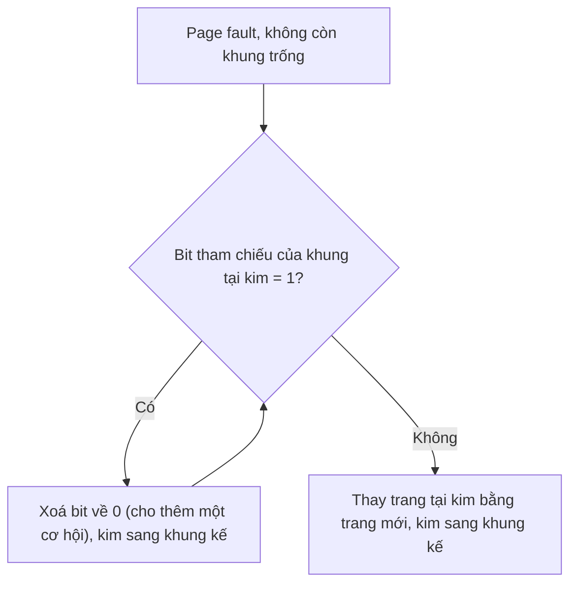

# Các thuật toán thay trang

## Giới thiệu

Trong bài viết này, mình sẽ giới thiệu các thuật toán thay trang (page replacement algorithms) trong hệ điều hành. Các thuật toán này được sử dụng để thay thế các trang (page) trong bộ nhớ ảo (virtual memory) khi bộ nhớ đầy.

## Các thuật toán thay trang

### FIFO

Thuật toán FIFO (First In First Out) sẽ thay thế trang đầu tiên được đưa vào bộ nhớ ảo. Thuật toán này dễ hiểu và dễ cài đặt, nhưng nó không phải là thuật toán tối ưu.

<iframe class="video"
    src="https://www.youtube.com/embed/r6Uf8mwuo2E" 
    title="FIFO (First In First Out)" 
    frameborder="0" 
    allow="accelerometer; autoplay; clipboard-write; encrypted-media; gyroscope; picture-in-picture; web-share" allowfullscreen>
</iframe>

### Optimal

Thuật toán Optimal sẽ thay thế trang mà sẽ không được sử dụng trong tương lai gần nhất. Thuật toán này là thuật toán tối ưu nhất, nhưng nó không thể cài đặt được.

<iframe class="video"
    src="https://www.youtube.com/embed/jWWvXr_mIoc" 
    title="Optimal" 
    frameborder="0" 
    allow="accelerometer; autoplay; clipboard-write; encrypted-media; gyroscope; picture-in-picture; web-share" allowfullscreen>
</iframe>

### LRU

Thuật toán LRU (Least Recently Used) sẽ thay thế trang mà được sử dụng lâu nhất. Thuật toán này là thuật toán tối ưu nhất có thể cài đặt được.

#### LRU Stack

Thuật toán LRU Stack sẽ thay thế trang mà được sử dụng lâu nhất. Thuật toán này là thuật toán tối ưu nhất có thể cài đặt được.

<iframe class="video"
    src="https://www.youtube.com/embed/TD3Rbda-z2E" 
    title="LRU Stack" 
    frameborder="0" 
    allow="accelerometer; autoplay; clipboard-write; encrypted-media; gyroscope; picture-in-picture; web-share" allowfullscreen>
</iframe>

#### LRU Counter

Thuật toán LRU Counter sẽ thay thế trang mà được sử dụng lâu nhất. Thuật toán này là thuật toán tối ưu nhất có thể cài đặt được.

<iframe class="video" 
    src="https://www.youtube.com/embed/fvwBP3GeOa8" 
    title="LRU Counter" 
    frameborder="0" 
    allow="accelerometer; autoplay; clipboard-write; encrypted-media; gyroscope; picture-in-picture; web-share" allowfullscreen>
</iframe>

### Clock

Thuật toán Clock sẽ thay thế trang mà được sử dụng lâu nhất. Thuật toán này không phải là thuật toán tối ưu, nhưng nó có thể cài đặt được.

Khi cần chọn trang nạn nhân, kim quay vòng qua các khung và xét bit tham chiếu của từng khung (bit bật lên 1 mỗi khi trang được truy cập):

<iframe class="video"
    src="https://www.youtube.com/embed/p1wV_Ix8pVk" 
    title="Clock" 
    frameborder="0" 
    allow="accelerometer; autoplay; clipboard-write; encrypted-media; gyroscope; picture-in-picture; web-share" allowfullscreen>
</iframe>

## Tổng kết

Trong bài viết này, mình đã giới thiệu các thuật toán thay trang trong hệ điều hành. Hy vọng bài viết này sẽ giúp ích cho các bạn.

:::info
Bên cạnh các thuật toán trên, còn có các thuật toán khác như: MFU, LFU, Second Chance, Enhanced Second Chance, NRU, FIFO Approximation, LRU Approximation, Random, ... Các bạn có thể tìm hiểu thêm về các thuật toán này.
:::

:::tip Luyện tập
Nắm lý thuyết rồi thì kiểm tra lại bằng [trắc nghiệm bộ nhớ ảo và thay trang](./05-quiz/07.virtual-memory.mdx): đủ bài tính FIFO, LRU, Optimal và CLOCK trên **cùng một chuỗi tham chiếu** để so sánh trực tiếp, kèm bảng khung trang từng bước và lời giải cho nghịch lý Belady.

Hai phần nền nằm dưới thuật toán thay trang: [trắc nghiệm phân trang và TLB](./05-quiz/06.paging.mdx) (bảng trang đa cấp, thời gian truy cập hiệu quả) và [trắc nghiệm quản lý bộ nhớ](./05-quiz/05.memory-management.mdx) (MMU, Best-Fit, swap space).
:::

:::tip
Để xem thêm các video khác, các bạn có thể truy cập vào [kênh Youtube](https://www.youtube.com/TienNguyen09) của mình.
:::