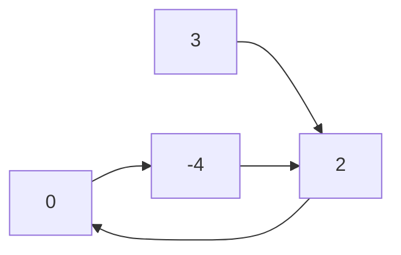
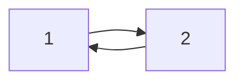
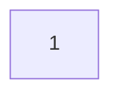

import Tabs from '@theme/Tabs';
import TabItem from '@theme/TabItem';
import CodeBlock from '@theme/CodeBlock';
import LinkedListCycleCs from '!!raw-loader!./csharp/141-linked-list-cycle.cs';
import LinkedListCycleTs from '!!raw-loader!./typescript/141-linked-list-cycle.ts';

# 141. Linked List Cycle

## Giới thiệu bài toán

Chi tiết: https://leetcode.com/problems/linked-list-cycle/

:::tip Yêu cầu
Given `head`, the head of a linked list, determine if the linked list has a cycle in it.

There is a cycle in a linked list if there is some node in the list that can be reached again by continuously following the next pointer. Internally, `pos` is used to denote the index of the node that tail's next pointer is connected to. Note that `pos` is not passed as a parameter.

Return `true` if there is a cycle in the linked list. Otherwise, return `false`.
:::

**Example 1:**

- Input: `head` = [3,2,0,-4], `pos` = 1
- Output: `true`
- Explanation: There is a cycle in the linked list, where the tail connects to the 1st node (0-indexed).

**Example 2:**

- Input: `head` = [1,2], `pos` = 0
- Output: `true`
- Explanation: There is a cycle in the linked list, where the tail connects to the 0th node.

**Example 3:**

- Input: `head` = [1], `pos` = -1
- Output: `false`
- Explanation: There is no cycle in the linked list.

**Constraints:**

- The number of the nodes in the list is in the range `[0, 104]`.
- `-105 <= Node.val <= 105`
- `pos` is `-1` or a valid index in the linked-list.
 
**Follow up:** Can you solve it using `O(1)` (i.e. constant) memory?

## Giải quyết bài toán

<Tabs defaultValue="csharp" groupId="language" queryString>
  <TabItem value="csharp" label="C#">
    <CodeBlock language="csharp" showLineNumbers>
        {LinkedListCycleCs}
    </CodeBlock>
  </TabItem>
  <TabItem value="typescript" label="TypeScript">
    <CodeBlock language="typescript" showLineNumbers>
        {LinkedListCycleTs}
    </CodeBlock>
  </TabItem>
</Tabs>

**Tham khảo:**
- [C#](https://leetcode.com/submissions/detail/1040119073/)
- [TypeScript](https://leetcode.com/submissions/detail/1040132046/)