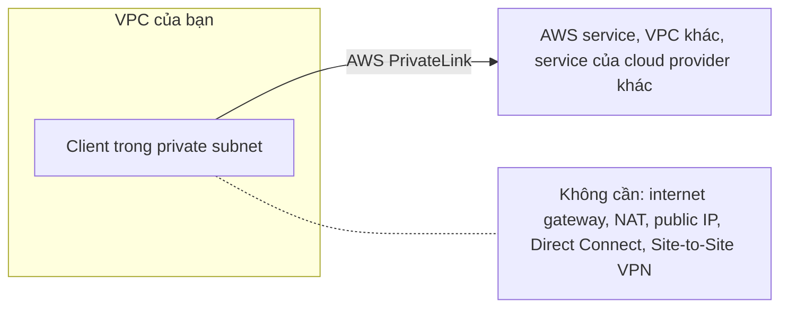

Trong bài học này, bạn sẽ khám phá thêm các hybrid cloud connections với AWS Cloud. Cụ thể, bạn sẽ học thêm các cách để connect clients, datacenters, và sites của bạn đến AWS Cloud.

## Mục tiêu học tập

Sau khi hoàn thành bài học này, bạn sẽ có thể:

- ✅ Mô tả AWS Client VPN và khi nào sử dụng nó
- ✅ Mô tả AWS Site-to-Site VPN và khi nào sử dụng nó
- ✅ Mô tả AWS PrivateLink và khi nào sử dụng nó
- ✅ Mô tả AWS Direct Connect và khi nào sử dụng nó
- ✅ Hiểu về các additional gateway services (Transit Gateway, NAT Gateway, API Gateway)

## Connecting to the AWS Cloud

**Với rất nhiều different types của networks, on-premises datacenters, và remote workers, companies cần một wide range của ways để connect đến AWS Cloud.**

  

**Trong phần sau, bạn sẽ học bốn ways để connect đến AWS Cloud:**

1. **AWS Client VPN** - Kết nối remote workers
2. **AWS Site-to-Site VPN** - Kết nối sites đến sites
3. **AWS PrivateLink** - Kết nối resources một cách private
4. **AWS Direct Connect** - Dedicated private connection

## Securely Connect a Remote Workforce to AWS Cloud Resources

**Hãy tưởng tượng một company với một recent acquisition cần securely connect new remote workforce của họ đến AWS Cloud resources của họ.** Even the largest companies với worldwide remote workers có thể quickly scale up và connect đến AWS Cloud. **That's where AWS Client VPN có thể help.**

### AWS Client VPN

  

**AWS Client VPN là một networking service** mà bạn có thể sử dụng để connect remote workers và on-premises networks của bạn đến cloud. **Nó là một fully managed, elastic VPN service** mà automatically scales up hoặc down based on user demand.

**Vì nó là một cloud VPN solution, bạn không cần install và manage hardware hoặc try để estimate how many remote users để support tại một time.**

#### Benefits của AWS Client VPN

- 🔐 **Advanced authentication** - Xác thực nâng cao
- 🌐 **Remote access** - Truy cập từ xa
- 📈 **Elastic** - Tự động scale based on demand
- 🛠️ **Fully managed** - Quản lý hoàn toàn bởi AWS

#### Use Cases

- ✅ **Quickly scale remote-worker access** - Nhanh chóng mở rộng truy cập cho remote workers
- ✅ **Secure access từ anywhere** - Truy cập an toàn từ bất kỳ đâu
- ✅ **Connect remote workers đến AWS resources và on-premises networks**

  

**Client VPN, một managed VPN service, provides secure access đến AWS resources và on-premises networks từ anywhere.** Nó sử dụng một OpenVPN-based client, và nó works với global Regions bằng cách sử dụng AWS global network.

## Securely Connect Sites to Other Sites

**Một số companies có thể muốn establish secure, encrypted connections giữa on-premises networks của họ như data centers hoặc branch offices và resources của họ trong Amazon VPC của họ.** That's where Site-to-Site VPN có thể help.

### AWS Site-to-Site VPN

  

**Site-to-Site VPN creates một secure connection** giữa data center hoặc branch offices của bạn và AWS Cloud resources của bạn.

#### Benefits của AWS Site-to-Site VPN

- 🔄 **High availability** - Tính khả dụng cao
- 🔒 **Secure và private sessions** - Phiên bảo mật và riêng tư
- ⚡ **Accelerates applications** - Tăng tốc ứng dụng

#### Use Cases

- ✅ **Application migration** - Di chuyển ứng dụng
- ✅ **Secure communication giữa remote locations** - Giao tiếp an toàn giữa các vị trí từ xa
- ✅ **Connect multiple sites đến AWS Cloud** - Kết nối nhiều sites đến AWS Cloud

  

**Site-to-Site VPN allows bạn để connect multiple on-premises locations** (như data centers, branch offices, manufacturing sites) đến Amazon VPC của bạn thông qua secure VPN tunnels.

## Securely Connect Resources, Even in Other VPCs

**Other companies sometimes cần flexibility để privately connect đến resources trong other cloud providers như though they were trong own VPC của họ.** Họ cần một way để communicate với these resources và don't want hassle của setting up gateways hoặc site-to-site VPNs. **That's where AWS PrivateLink có thể help.**

### AWS PrivateLink

  

**AWS PrivateLink là một highly available, scalable technology** mà bạn có thể sử dụng để privately connect VPC của bạn đến services và resources như if they were trong VPC của bạn.

**Bạn không cần sử dụng:**
- ❌ Internet gateway
- ❌ NAT device
- ❌ Public IP address
- ❌ Direct Connect connection
- ❌ AWS Site-to-Site VPN connection

**Để allow communication với AWS services hoặc resources từ private subnets của bạn.**

**Instead, bạn control specific API endpoints, sites, services, và resources** mà are reachable từ VPC của bạn.

#### Benefits của AWS PrivateLink

- 🔒 **Secure traffic** - Bảo mật lưu lượng
- 🔗 **Connect với simplified management rules** - Kết nối với quy tắc quản lý đơn giản
- 🚫 **No internet gateway required** - Không cần internet gateway
- 🔐 **Private connectivity** - Kết nối riêng tư

#### Use Cases

- ✅ **Connecting clients trong VPC của bạn đến resources** - Kết nối clients trong VPC đến resources
- ✅ **Connecting đến other VPCs** - Kết nối đến các VPC khác
- ✅ **Connecting đến endpoints** - Kết nối đến endpoints
- ✅ **Connecting đến services trong other cloud providers** - Kết nối đến services trong các cloud providers khác

**Even though preceding connections là highly available và scalable, traffic jams are possible vì bạn're sử dụng cùng connection như other clients.** That's why cho một số use cases, bạn có thể cần một dedicated private connection với a lot of bandwidth.

## Dedicated Private Connections for Increased Bandwidth

### AWS Direct Connect

  

**Direct Connect là một service** mà makes it possible để bạn establish một dedicated private connection giữa network của bạn và VPC trong AWS Cloud.

#### Benefits của AWS Direct Connect

- 💰 **Reduces network costs** - Giảm chi phí mạng
- 📈 **Increases amount of bandwidth** - Tăng lượng băng thông
- 🔒 **Dedicated private connection** - Kết nối riêng tư chuyên dụng
- ⚡ **Consistent, low-latency network experience** - Trải nghiệm mạng nhất quán, độ trễ thấp

  

**Để learn more về Direct Connect, expand từng của following three categories:**

### 1. Latency-Sensitive Applications

  

**Direct Connect bypasses internet và provides một consistent, low-latency network experience.** Điều này makes it ideal cho applications như:
- 🎥 **Video streaming** - Phát video
- ⚡ **Real-time applications** - Ứng dụng thời gian thực
- 🎮 **Applications require high performance** - Ứng dụng yêu cầu hiệu suất cao

### 2. Large-Scale Data Migration or Transfer

  

**Direct Connect helps ensure smooth và reliable data transfers tại massive scale** cho:
- 📊 **Real-time analysis** - Phân tích thời gian thực
- 💾 **Rapid data backup** - Sao lưu dữ liệu nhanh
- 📺 **Broadcast media processing** - Xử lý phương tiện phát sóng

### 3. Hybrid Cloud Architectures

  

**Bạn có thể sử dụng Direct Connect để link AWS và on-premises networks của bạn** để build applications mà span environments without compromising performance.

**Hybrid cloud architectures allow bạn để:**
- 🔗 **Connect AWS và on-premises** - Kết nối AWS và on-premises
- 🏗️ **Build applications span environments** - Xây dựng ứng dụng trải dài môi trường
- ⚡ **Maintain performance** - Duy trì hiệu suất

## Additional Gateway Services

**Có several different types của gateways bạn có thể sử dụng để connect AWS resources của bạn.** Depending on needs của bạn, bạn có thể muốn learn more về what they are used for và where để go để learn more.

### AWS Transit Gateway

  

**AWS Transit Gateway được sử dụng để connect Amazon VPCs và on-premises networks của bạn through một central hub.** As cloud infrastructure của bạn expands globally, **inter-Region peering connects transit gateways together** sử dụng AWS Global Infrastructure.

**Benefits:**
- 🎯 **Central hub** - Trung tâm kết nối
- 🔗 **Simplifies network management** - Đơn giản hóa quản lý mạng
- 🌐 **Inter-Region peering** - Kết nối giữa các regions
- 📈 **Scalable** - Có thể mở rộng

**Để learn more, refer to [AWS Transit Gateway](https://aws.amazon.com/transit-gateway/).**

### Network Address Translation (NAT) Gateway

  

**A NAT gateway là một NAT service.** Bạn có thể sử dụng một NAT gateway để instances trong một private subnet có thể connect đến services outside VPC của bạn nhưng external services can't initiate một connection với those instances.

**Benefits:**
- 🔒 **Outbound-only internet communication** - Chỉ giao tiếp internet ra ngoài
- 🛡️ **Protects private instances** - Bảo vệ instances riêng tư
- 📍 **Public và Private NAT gateways** - NAT gateway công cộng và riêng tư

**Để learn more, refer to [NAT Gateway Documentation](https://docs.aws.amazon.com/vpc/latest/userguide/vpc-nat-gateway.html).**

### Amazon API Gateway

  

**Bạn đã học về Application Programming Interface (API)s earlier.** Quick refresher, **an API defines how different software systems có thể interact và communicate với each other.**

**Amazon API Gateway là một AWS service** cho creating, publishing, maintaining, monitoring, và securing APIs tại any scale.

**Benefits:**
- 🚪 **Front door cho applications** - Cửa trước cho ứng dụng
- 🔒 **Secure APIs** - Bảo mật API
- 📊 **Monitor và manage APIs** - Giám sát và quản lý API
- ⚡ **RESTful APIs và WebSocket APIs** - RESTful APIs và WebSocket APIs

**Để learn more, refer to [Amazon API Gateway](https://aws.amazon.com/api-gateway/).**

## Review: Four Types of Connectivity Options

**Trong bài học này, bạn đã identify services mà help bạn connect AWS Cloud của bạn đến clients, datacenters, và sites của bạn.** Để review bốn types của connectivity options, hãy chọn từng flashcards sau:

### AWS Direct Connect

  

**AWS Direct Connect**

**AWS Direct Connect là một private, dedicated AWS connection đến data center hoặc office của bạn.**

- 🔒 **Dedicated private connection** - Kết nối riêng tư chuyên dụng
- ⚡ **High bandwidth** - Băng thông cao
- 📍 **Direct connection** - Kết nối trực tiếp

### AWS Client VPN

  

**AWS Client VPN**

**AWS Client VPN connects remote workforce của bạn đến AWS hoặc on-premises với một VPN.**

- 👥 **Remote workers** - Nhân viên từ xa
- 🔐 **Secure access** - Truy cập an toàn
- 📈 **Elastic và fully managed** - Tự động mở rộng và quản lý hoàn toàn

### AWS Site-to-Site VPN

  

**AWS Site-to-Site VPN**

**AWS Site-to-Site VPN là một encrypted network connection đến Amazon VPCs của bạn.**

- 🏢 **Data centers và branch offices** - Trung tâm dữ liệu và văn phòng chi nhánh
- 🔒 **Secure và encrypted** - An toàn và mã hóa
- 🔄 **High availability** - Tính khả dụng cao

### AWS PrivateLink

  

**AWS PrivateLink**

**AWS PrivateLink connects VPC của bạn privately đến services và resources như though they were trong VPC của bạn.**

- 🔗 **Private connectivity** - Kết nối riêng tư
- 🚫 **No internet gateway required** - Không cần internet gateway
- 🔒 **Secure traffic** - Lưu lượng an toàn

## So sánh các Connectivity Options

| Service | Use Case | Key Benefits |
|---------|----------|--------------|
| **AWS Client VPN** | Remote workers | Elastic, fully managed, secure remote access |
| **AWS Site-to-Site VPN** | Data centers, branch offices | High availability, encrypted, secure |
| **AWS PrivateLink** | Private connectivity to services | No internet gateway, simplified management |
| **AWS Direct Connect** | High bandwidth, low latency | Dedicated connection, consistent performance |

## Test Your Skills

### Câu hỏi 1

Một company đang conducting một large-scale migration của on-premises data center của họ với data warehouse và data backup của họ. Họ cần một solution mà sẽ meet large amount của bandwidth requirements during migration. Solution này cũng sẽ được sử dụng cho ongoing data transfers của họ sau move vì họ sẽ retain part của on-premises data center của họ cho một hybrid cloud solution.

**Câu hỏi:**

**Which AWS solution would best meet their needs?**

**Giải pháp AWS nào sẽ đáp ứng tốt nhất nhu cầu của họ?**

<strong>📋 Xem các lựa chọn</strong>

- [ ] AWS Client VPN
  - [ ] AWS Client VPN
- [ ] AWS Site-to-Site VPN
  - [ ] AWS Site-to-Site VPN
- [x] AWS Direct Connect link to their on-premises network and the AWS Cloud
  - [x] AWS Direct Connect liên kết đến mạng on-premises và AWS Cloud của họ
- [ ] AWS Private Link to their on-premises datacenter
  - [ ] AWS PrivateLink đến datacenter on-premises của họ

<strong>✅ Đáp án đúng</strong>

**Đáp án đúng:**
- ✅ **AWS Direct Connect link to their on-premises network and the AWS Cloud**

**Giải thích:**

✅ **AWS Direct Connect là best solution** cho requirements này.

**Requirements:**
- 📊 **Large-scale migration** - Di chuyển quy mô lớn
- 📈 **Large amount of bandwidth** - Lượng băng thông lớn
- 🔄 **Ongoing data transfers** - Chuyển dữ liệu liên tục
- 🏗️ **Hybrid cloud solution** - Giải pháp hybrid cloud

**Why AWS Direct Connect:**
- ✅ **Dedicated private connection** - Kết nối riêng tư chuyên dụng với high bandwidth
- ✅ **Consistent, low-latency** - Nhất quán, độ trễ thấp cho large-scale data transfers
- ✅ **Ideal cho hybrid cloud architectures** - Lý tưởng cho kiến trúc hybrid cloud
- ✅ **Reduces network costs** - Giảm chi phí mạng

**Các lựa chọn không đúng:**
- ❌ **AWS Client VPN**: Designed cho remote workers, không provide bandwidth needed cho large-scale migration
- ❌ **AWS Site-to-Site VPN**: Có thể có bandwidth limitations và không ideal cho large-scale data transfers
- ❌ **AWS PrivateLink**: Designed cho private connectivity đến services, không phải cho large-scale data migration

### Câu hỏi 2

Một company đang choosing type của gateway cho network của họ. Họ cần connect corporate data center của họ với private subnet trong Amazon Virtual Private Cloud của họ. Gateway của họ cần allow chỉ protected internet traffic đến enter vào Amazon VPC. Nó cũng nên allow một connection giữa Amazon VPC của họ và một private network chỉ nếu nó đang coming từ một approved network.

**Câu hỏi:**

**Which type of gateway would BEST meet their needs?**

**Loại gateway nào sẽ đáp ứng tốt nhất nhu cầu của họ?**

  

<strong>📋 Xem các lựa chọn</strong>

- [ ] Internet gateway
  - [ ] Internet gateway
- [x] Virtual private gateway
  - [x] Virtual private gateway
- [ ] AWS Transit Gateway
  - [ ] AWS Transit Gateway
- [ ] Amazon API Gateway
  - [ ] Amazon API Gateway

<strong>✅ Đáp án đúng</strong>

**Đáp án đúng:**
- ✅ **Virtual private gateway**

**Giải thích:**

✅ **Virtual private gateway là best choice** cho requirements này.

**Requirements:**
- 🔒 **Connect corporate data center** - Kết nối trung tâm dữ liệu công ty
- 🔐 **Only protected internet traffic** - Chỉ lưu lượng internet được bảo vệ
- ✅ **Connection từ approved network only** - Kết nối chỉ từ mạng được phê duyệt
- 🏢 **Private subnet** - Subnet riêng tư

**Why Virtual Private Gateway:**
- ✅ **Allows VPN connection** - Cho phép kết nối VPN từ corporate data center
- ✅ **Only allows traffic từ approved networks** - Chỉ cho phép lưu lượng từ các mạng được phê duyệt
- ✅ **Protected, encrypted traffic** - Lưu lượng được bảo vệ, mã hóa
- ✅ **Ideal cho private subnets** - Lý tưởng cho các subnet riêng tư

**Các lựa chọn không đúng:**
- ❌ **Internet gateway**: Allows public traffic từ internet, không restrict đến approved networks only
- ❌ **AWS Transit Gateway**: Central hub cho multiple VPCs, không phải best choice cho single VPN connection
- ❌ **Amazon API Gateway**: Service cho APIs, không phải networking gateway cho VPC connections

## Tóm tắt

Trong bài học này, bạn đã học về:

- ✅ **AWS Client VPN**: Fully managed VPN service cho remote workers với elastic scaling
- ✅ **AWS Site-to-Site VPN**: Encrypted connection giữa on-premises sites và Amazon VPCs
- ✅ **AWS PrivateLink**: Private connectivity đến services và resources without internet gateway
- ✅ **AWS Direct Connect**: Dedicated private connection với high bandwidth cho large-scale transfers
- ✅ **Additional Gateway Services**: Transit Gateway, NAT Gateway, API Gateway

## Next Steps

Trong các bài học tiếp theo, bạn sẽ:

- Tìm hiểu về Security Groups và Network ACLs
- Khám phá Route Tables và routing
- Học về cách thiết kế network architecture cho high availability
- Tìm hiểu về monitoring và troubleshooting network issues

Hãy tiếp tục với bài học tiếp theo để tìm hiểu sâu hơn về AWS Networking! 🌐

