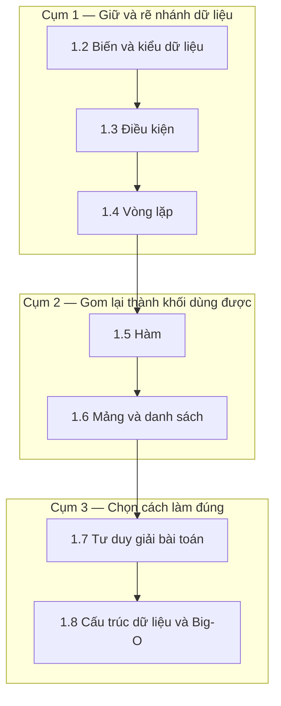

import { SummaryBox, Checklist, FAQSection } from '@site/src/components/SEO';

# 1.1 — Định hướng Module 1: Tư duy lập trình

<SummaryBox>
Module này **không dạy cú pháp C#** — module 4 mới làm việc đó. Nó dạy thứ mà người tự học hay bỏ qua rồi trả giá suốt hai năm sau: **cách chia một bài toán thành các bước máy chạy được**. Dấu hiệu nhận ra bạn đang thiếu kỹ năng này rất rõ: đọc code người khác thì hiểu, nhưng ngồi trước file trống thì không biết gõ dòng đầu tiên. Bảy bài trong module đi từ biến tới Big-O, nhưng trục xuyên suốt chỉ có một: **biến một câu tiếng Việt mơ hồ thành một chuỗi thao tác xác định**.
</SummaryBox>

## Module này giải quyết vấn đề gì

Một người mới học thường mắc kẹt ở đúng một chỗ. Họ thuộc `if`, thuộc `for`, làm được bài tập "in ra bảng cửu chương". Rồi gặp đề thật — *"tính doanh thu trung bình mỗi khách hàng trong quý, bỏ qua đơn đã huỷ"* — và đứng hình.

Khoảng cách đó không phải khoảng cách cú pháp. Nó là khoảng cách **phân rã**: đề bài trên thực ra là bốn thao tác nối nhau (lọc theo quý → lọc bỏ đơn huỷ → gom nhóm theo khách → tính trung bình), và người nào nhìn ra bốn bước đó thì phần còn lại chỉ là tra cú pháp.

Vì vậy module này tổ chức quanh một câu hỏi lặp đi lặp lại ở mọi bài: **"bài toán này gồm những bước nào, và mỗi bước cần giữ dữ liệu ở dạng gì?"**

Đây cũng là lý do bài cuối cùng là Big-O. Khi đã biết chia bài toán thành bước, câu hỏi kế tiếp là *chọn bước nào* — và Big-O là ngôn ngữ để trả lời câu đó mà không cần chạy thử.

## Bạn cần gì trước khi bắt đầu

Module này bắt đầu từ số không về lập trình, nhưng cần môi trường chạy được. Hãy xác nhận từng dòng dưới đây **trước** khi vào bài 1.2:

<Checklist
  title="Điều kiện đầu vào"
  items={[
    { text: <>{"Đã cài .NET SDK 8 trở lên. Kiểm tra bằng "}<code>dotnet --version</code>{", phải in ra số phiên bản chứ không phải lỗi."}</> },
    { text: <>{"Tạo và chạy được một project rỗng: "}<code>dotnet new console -o Thu &amp;&amp; cd Thu &amp;&amp; dotnet run</code>{" in ra "}<code>Hello, World!</code>{"."}</> },
    { text: "Có một trình soạn thảo có gợi ý code — Visual Studio Code kèm extension C# Dev Kit, hoặc Visual Studio Community, hoặc JetBrains Rider." },
    { text: <>{"Biết mở terminal và di chuyển thư mục bằng "}<code>cd</code>{"."}</> },
    { text: "Dành được khoảng 8–10 giờ cho module này. Đây là module nền; học vội ở đây sẽ phải quay lại." },
  ]}
/>

Không cần biết gì về Git, database hay web. Module 3 lo Git, module 2 lo phần còn lại.

## Bản đồ module

Bảy bài lõi chia thành ba cụm. Cụm sau dùng lại kết quả cụm trước, nên thứ tự này không đảo được:



| Bài | Câu hỏi bài này trả lời | Thời lượng |
|---|---|---|
| [1.2 — Biến và kiểu dữ liệu](1.2-variables-and-data-types.mdx) | Dữ liệu được giữ ở đâu, và vì sao chọn sai kiểu thì tiền bạc tính ra sai số? | 60 phút |
| [1.3 — Điều kiện](1.3-conditions.mdx) | Làm sao để chương trình rẽ nhánh mà không đẻ ra mê cung `if` lồng nhau? | 60 phút |
| [1.4 — Vòng lặp](1.4-loops.mdx) | Lặp bao nhiêu lần, dừng khi nào, và vì sao lặp lồng lặp là dấu hiệu đáng ngờ? | 75 phút |
| [1.5 — Hàm](1.5-functions-methods.mdx) | Khi nào tách một đoạn code ra thành hàm, và hàm tốt trông thế nào? | 75 phút |
| [1.6 — Mảng và danh sách](1.6-arrays-and-lists.mdx) | Nhiều giá trị cùng loại thì giữ bằng gì, và khác nhau ở đâu? | 75 phút |
| [1.7 — Tư duy giải bài toán](1.7-problem-solving-mindset.mdx) | Quy trình nào đi từ đề bài tiếng Việt tới code chạy được? | 90 phút |
| [1.8 — Cấu trúc dữ liệu và Big-O](1.8-data-structures-and-big-o.mdx) | Vì sao cùng một việc mà cách này nhanh gấp nghìn lần cách kia? | 90 phút |

Bốn bài còn lại là phần bổ trợ, học sau khi xong bảy bài trên: [1.9 — Mở rộng và đào sâu](1.9-advanced-notes.mdx), [1.10 — Mini case study](1.10-mini-case-study.mdx), [1.11 — Ví dụ thực tế nhanh](1.11-quick-real-world-example.mdx), và [1.12 — Review and Assessment](1.12-review-and-assessment.mdx) để tự chấm.

## Kết quả đầu ra đo được

Mục tiêu học tập chỉ có giá trị khi kiểm chứng được. Sau module này bạn phải làm được **từng việc cụ thể** sau, không phải "hiểu về" chúng:

| Năng lực | Cách tự kiểm chứng |
|---|---|
| Chọn đúng kiểu dữ liệu cho tiền tệ | Giải thích được vì sao `decimal` chứ không phải `double` cho số tiền, và đưa ra một phép tính mà `double` cho kết quả sai |
| Thay `if` lồng nhau bằng early return | Lấy một hàm lồng 3 tầng `if`, viết lại còn 1 tầng, kết quả không đổi |
| Viết vòng lặp có điều kiện dừng đúng | Viết hàm tìm phần tử đầu tiên thoả điều kiện, chạy đúng cả khi danh sách rỗng |
| Tách hàm theo một trách nhiệm | Lấy một hàm 40 dòng, tách thành 3 hàm, đặt tên mỗi hàm bằng một động từ |
| Chọn giữa `List<T>` và `Dictionary<K,V>` | Nêu được một bài toán mà đổi từ `List` sang `Dictionary` giảm từ O(n²) xuống O(n) |
| Ước lượng độ phức tạp | Nhìn một hàm có 2 vòng lặp lồng nhau và nói ngay là O(n²) |

## Sản phẩm bàn giao của module

Xuyên suốt module, bạn xây dần **một chương trình console quản lý danh sách khách hàng** — phiên bản tí hon của hệ CRM mà cả giáo trình hướng tới. Mỗi bài thêm một mảnh:

```text
1.2  → Định nghĩa được một khách hàng bằng các biến: tên, email, doanh thu (decimal)
1.3  → Phân loại khách theo doanh thu: Vàng / Bạc / Thường
1.4  → Duyệt toàn bộ danh sách và in báo cáo
1.5  → Tách phần phân loại và phần in ra thành hàm riêng
1.6  → Giữ nhiều khách bằng List<Customer>, thêm/xoá/tìm
1.7  → Thêm chức năng "doanh thu trung bình mỗi khách trong quý"
1.8  → Đổi tra cứu theo email từ List sang Dictionary, đo lại thời gian
```

Tới bài 1.8, bạn có khoảng 150 dòng code chạy được và **đo được** sự khác biệt hiệu năng giữa hai cách làm. Đó là sản phẩm mang sang module 2.

## Lộ trình học gợi ý

Với người đi làm, học buổi tối khoảng 90 phút mỗi ngày:

| Ngày | Nội dung | Việc phải xong trước khi đi ngủ |
|---|---|---|
| 1 | 1.2 + 1.3 | Chương trình phân loại được một khách hàng |
| 2 | 1.4 | In được báo cáo cho danh sách cứng 5 khách |
| 3 | 1.5 | Code đã tách thành ít nhất 3 hàm |
| 4 | 1.6 | Thêm/xoá/tìm khách bằng `List<T>` |
| 5 | 1.7 | Tự giải bài "doanh thu trung bình theo quý" không nhìn lời giải |
| 6 | 1.8 | Đo được chênh lệch thời gian `List` so với `Dictionary` |
| 7 | 1.9 → 1.12 | Làm bài tự chấm 1.12, đạt từ 70% trở lên |

Nếu ngày 5 làm không nổi, **đừng đi tiếp** — quay lại 1.4 và 1.5. Đó là điểm thắt thật sự của module.

## Ba sai lầm thường gặp khi học module này

**Một — đọc thay vì gõ.** Đọc code hiểu ngay là ảo giác quen thuộc nhất của người mới. Hiểu khi đọc và tạo ra được khi nhìn trang trắng là hai kỹ năng khác nhau, luyện bằng hai cách khác nhau. Quy tắc cho module này: mỗi đoạn code trong bài, **gõ lại bằng tay**, không copy. Gõ sai rồi sửa chính là lúc học.

**Hai — nhảy sang C# nâng cao quá sớm.** LINQ viết `customers.Where(c => c.Revenue > 1000).Average(c => c.Revenue)` gọn hơn hẳn vòng lặp thủ công, và rất cám dỗ. Nhưng nếu chưa tự viết được vòng lặp tương đương thì LINQ chỉ là câu thần chú. Module 5 sẽ dạy LINQ, lúc đó bạn sẽ hiểu nó làm gì bên dưới.

**Ba — bỏ qua Big-O vì "nghe có vẻ hàn lâm".** Big-O không phải kiến thức thi cử. Nó là lý do một API trả về trong 80 mili-giây hay 40 giây khi dữ liệu tăng từ 100 lên 100.000 dòng. Sự cố hiệu năng mà module 19 xử lý phần lớn bắt nguồn từ một vòng lặp lồng nhau viết ở tuần đầu tiên.

## Bài tập khởi động

Làm bài này **trước khi** vào 1.2. Mục đích không phải kiểm tra kiến thức C# — bạn chưa có — mà đo xem bạn phân rã bài toán tới đâu.

> **Đề bài.** Một cửa hàng có danh sách đơn hàng, mỗi đơn gồm: mã khách, số tiền, trạng thái (`đã thanh toán` / `đã huỷ`). Hãy mô tả **bằng tiếng Việt, từng bước một**, cách tính *tổng số tiền đã thanh toán của khách hàng chi nhiều nhất*.
>
> Không viết code. Viết các bước ra giấy. Yêu cầu: mỗi bước phải cụ thể tới mức người khác đọc xong làm theo được mà không cần hỏi lại.

<details>
<summary><strong>Gợi ý — nếu bạn chưa biết bắt đầu từ đâu</strong></summary>

Ba câu hỏi mở khoá gần như mọi bài toán dạng này:

1. **Dữ liệu nào không liên quan?** Đề nói "đã thanh toán" — vậy đơn đã huỷ bị loại ngay từ đầu. Loại bỏ trước khi tính là thói quen tốt: bước sau xử lý ít dữ liệu hơn và ít khả năng sai hơn.
2. **Kết quả cuối là một số hay một danh sách?** Ở đây là một số (tổng tiền) gắn với một khách. Nhưng để tìm ra khách đó, bạn phải đi qua một bước trung gian: **tổng tiền của từng khách**. Nhận ra bước trung gian này là phần khó nhất của bài.
3. **Bước trung gian đó giữ ở đâu?** Bạn cần một chỗ ánh xạ *mã khách → tổng tiền*. Ghi chú lại ý này; bài 1.8 sẽ cho nó một cái tên là `Dictionary`.

</details>

<details>
<summary><strong>Hướng dẫn giải — đọc sau khi đã tự làm</strong></summary>

**Các bước:**

1. Chuẩn bị một bảng trống gồm hai cột: *mã khách* và *tổng tiền*.
2. Xét lần lượt từng đơn hàng trong danh sách.
3. Với mỗi đơn: nếu trạng thái là `đã huỷ` thì bỏ qua, chuyển sang đơn kế tiếp.
4. Nếu mã khách của đơn **chưa có** trong bảng: thêm một dòng mới với tổng tiền bằng số tiền của đơn này.
5. Nếu mã khách **đã có**: cộng thêm số tiền của đơn này vào tổng tiền đang có ở dòng đó.
6. Sau khi hết đơn hàng, duyệt bảng và tìm dòng có tổng tiền lớn nhất.
7. Trả về tổng tiền của dòng đó.

**Bốn điểm tự chấm — đây mới là phần đáng giá của bài tập:**

- **Bạn có nêu bước 1 không?** Rất nhiều người bắt đầu thẳng từ bước 2 và quên rằng phải có chỗ chứa kết quả trung gian. Quên bước này là nguồn gốc của biến chưa khởi tạo.
- **Bạn có tách bước 4 và 5 không?** Gộp chung thành "cộng tiền vào bảng" nghe thì gọn, nhưng máy không biết phải làm gì khi dòng chưa tồn tại. Phân biệt *lần đầu* với *các lần sau* là một mẫu lặp lại suốt sự nghiệp.
- **Bạn xử lý trường hợp danh sách rỗng chưa?** Nếu mọi đơn đều bị huỷ, bảng rỗng và bước 6 không có gì để tìm. Nghĩ tới trường hợp biên ngay từ khi mô tả là thói quen phân biệt người mới với người có kinh nghiệm.
- **Bạn có duyệt danh sách đơn hàng đúng một lần không?** Một cách làm sai phổ biến: với mỗi khách, quét lại toàn bộ đơn hàng. Cách đó cho kết quả đúng nhưng chậm gấp *n* lần. Bài 1.8 sẽ gọi tên hai cách này là O(n) và O(n²).

Nếu bạn viết ra được 5 bước trở lên và nhận ra ít nhất hai trong bốn điểm trên, bạn đã có nền tư duy tốt hơn mức trung bình khi vào module này.

</details>

## Tự kiểm tra đầu vào

<FAQSection
  items={[
    {
      question: "Tôi đã biết một ngôn ngữ khác (Python, JavaScript, PHP) thì có bỏ qua module này được không?",
      answer: "Bỏ qua được 1.2 đến 1.6 nếu bạn tự tin về biến, điều kiện, vòng lặp, hàm và danh sách. Nhưng nên đọc 1.2 phần kiểu dữ liệu, vì C# là ngôn ngữ kiểu tĩnh và cách nó phân biệt decimal với double khác hẳn Python hay JavaScript — đây là nguồn lỗi tính tiền thường gặp. Không nên bỏ 1.7 và 1.8: chúng bàn về quy trình giải bài và độ phức tạp, độc lập với ngôn ngữ, và là hai bài mà người chuyển ngôn ngữ hay thiếu nhất."
    },
    {
      question: "Vì sao module đầu tiên không bắt đầu thẳng bằng C# mà bàn về tư duy?",
      answer: "Vì cú pháp tra được trong 30 giây còn tư duy phân rã thì không. Một người thuộc cú pháp nhưng không phân rã được bài toán sẽ viết ra code chạy đúng trên ví dụ mẫu và sai trên dữ liệu thật. Ngược lại, người phân rã tốt mà chưa thuộc cú pháp chỉ cần tra tài liệu. Module 4 sẽ dạy C# một cách có hệ thống, và lúc đó bạn đã có khung để treo kiến thức vào."
    },
    {
      question: "Big-O có thật sự cần cho lập trình viên backend không?",
      answer: "Cần, và cần thường xuyên hơn người ta tưởng. Phần lớn sự cố hiệu năng trong ứng dụng backend không đến từ thuật toán tinh vi mà từ một vòng lặp lồng nhau hoặc một truy vấn chạy trong vòng lặp. Biết nhìn ra O(n²) giúp bạn phát hiện vấn đề lúc đọc code review, tức là trước khi nó lên production. Module 13 gọi đúng một biến thể của lỗi này là vấn đề N+1 query."
    },
    {
      question: "Tôi nên gõ lại code trong bài hay copy cho nhanh?",
      answer: "Gõ lại bằng tay, và đây là khuyến nghị nghiêm túc chứ không phải lời khuyên sáo. Khi gõ, bạn buộc phải đọc từng ký tự, gặp lỗi biên dịch, và đọc thông báo lỗi. Ba việc đó chính là nội dung cần học. Copy code chạy được ngay cho cảm giác tiến bộ nhanh nhưng không để lại gì. Riêng các đoạn dài trên 30 dòng ở bài mini case study thì copy được, vì lúc đó mục tiêu là đọc hiểu cấu trúc tổng thể."
    },
    {
      question: "Mất bao lâu để xong module này?",
      answer: "Khoảng 8 đến 10 giờ học thật, trải ra một tuần nếu mỗi tối 90 phút. Con số này tính cả thời gian gõ code và làm bài tập, không phải thời gian đọc lướt. Nếu bạn xong trong 3 giờ thì gần như chắc chắn bạn đã đọc mà không gõ, và bài 1.12 sẽ cho biết điều đó."
    },
    {
      question: "Nếu tôi làm bài tập khởi động ở trên mà không ra được thì sao?",
      answer: "Hoàn toàn bình thường và không phải dấu hiệu nên bỏ cuộc. Bài đó đo mức xuất phát chứ không phải điều kiện vào học. Điều cần làm là giữ lại tờ giấy bạn đã viết, rồi sau khi học xong bài 1.7 quay lại làm lại từ đầu. So sánh hai lần viết là cách đo tiến bộ trực quan nhất trong cả module."
    }
  ]}
/>

## Kết luận

Ba điều cần mang theo khi bước vào bài 1.2:

1. **Đích đến của module là kỹ năng phân rã, không phải cú pháp.** Mọi bài học đều quay về câu hỏi "bài toán này gồm những bước nào".
2. **Gõ tay, đừng copy.** Đây là module duy nhất mà tốc độ học chậm lại có lợi.
3. **Bài 1.7 là điểm thắt.** Nếu tới đó thấy chật vật, quay lại 1.4 và 1.5 thay vì cố đi tiếp.

## Tham khảo

- [C# documentation — Microsoft Learn](https://learn.microsoft.com/en-us/dotnet/csharp/) — tài liệu gốc về ngôn ngữ
- [Tutorial: Create a console application](https://learn.microsoft.com/en-us/dotnet/core/tutorials/with-visual-studio-code) — dựng project đầu tiên bằng VS Code
- [C# fundamentals — interactive tutorials](https://learn.microsoft.com/en-us/dotnet/csharp/tour-of-csharp/tutorials/) — bài tập chạy ngay trên trình duyệt
- [.NET SDK downloads](https://dotnet.microsoft.com/en-us/download) — cài đặt môi trường

## Điều hướng

- **Hub lộ trình:** [00. Lộ trình From Zero → Senior .NET (Backend-first)](../../roadmap-dotnet-backend-zero-to-senior.mdx)
- **Bài trước:** Không có — đây là bài mở đầu của cả giáo trình.
- **Bài tiếp theo:** [1.2 — Biến và Kiểu Dữ Liệu](1.2-variables-and-data-types.mdx)
- **Module tiếp theo:** [Module 2 — Computer Science Basics](../module-02-computer-science-basics/)
- **Về module:** [Trang mục lục](./)
