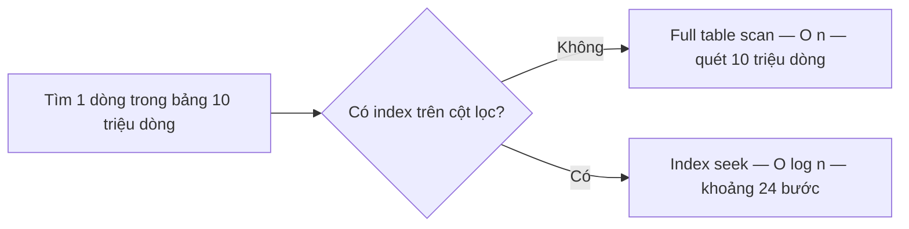

import { SummaryBox, Checklist, FAQSection } from '@site/src/components/SEO';

# 1.8 — 7. Cấu Trúc Dữ Liệu Cơ Bản và Big-O

<SummaryBox>
Big-O **không đo thời gian** — nó đo **tốc độ tăng** của khối lượng việc khi dữ liệu lớn dần. Đó là lý do một hàm `O(n²)` chạy ngon trên máy bạn với 100 bản ghi rồi treo hẳn trên production với 100.000 bản ghi: thời gian không tăng 1.000 lần mà tăng **một triệu** lần. Bài này đưa bảng độ phức tạp của các collection .NET, con số cụ thể cho từng mức tăng trưởng, và chỉ ra rằng `index` trong database chính là cùng một ý tưởng: đổi bộ nhớ lấy tốc độ tra cứu, biến `O(n)` thành `O(log n)`.
</SummaryBox>

## Mục tiêu bài học

Sau bài này bạn có thể:

- Giải thích Big-O đo cái gì, và vì sao hằng số bị bỏ qua.
- Đọc bảng độ phức tạp và chọn collection theo thao tác chính.
- Tính nhẩm được một thuật toán `O(n²)` hỏng ở quy mô nào.
- Chỉ ra chỗ `O(n²)` ẩn trong code trông rất bình thường.
- Liên hệ Big-O với index trong database.

## Nội dung bài học

### 1.8.1 — Big-O đo tốc độ tăng, không đo giây

Hai câu hỏi rất khác nhau:

- *"Hàm này chạy mất bao lâu?"* → phụ thuộc CPU, dữ liệu, máy chủ. Phải đo.
- *"Dữ liệu tăng gấp 10 thì khối lượng việc tăng gấp mấy?"* → **đây mới là Big-O**, và trả lời được mà không cần chạy.

Vì thế Big-O bỏ qua hằng số. `5n + 100` và `n` đều là `O(n)`: cả hai đều tăng **tuyến tính**. Hằng số quan trọng khi `n` nhỏ, nhưng khi `n` lớn thì tốc độ tăng quyết định tất cả.

### 1.8.2 — Các mức tăng trưởng, bằng con số

Số thao tác cần làm, theo `n`:

| Mức | n = 10 | n = 1.000 | n = 1.000.000 | Ví dụ điển hình |
|---|---|---|---|---|
| `O(1)` | 1 | 1 | 1 | `dict[key]`, `list[i]` |
| `O(log n)` | 3 | 10 | 20 | Tìm nhị phân, tra index B-tree |
| `O(n)` | 10 | 1.000 | 1.000.000 | `list.Contains`, một vòng `foreach` |
| `O(n log n)` | 33 | 10.000 | 20.000.000 | `Sort()`, `OrderBy()` |
| `O(n²)` | 100 | 1.000.000 | **1.000.000.000.000** | Hai vòng lặp lồng nhau |

Hãy nhìn cột cuối. Với một triệu bản ghi, `O(log n)` cần **20** thao tác còn `O(n²)` cần **một nghìn tỉ**. Đó không phải khác biệt về tốc độ, đó là khác biệt giữa "xong ngay" và "không bao giờ xong".

Và chú ý dòng `O(n²)` ở cột `n = 10`: chỉ 100 thao tác. **Đó chính là lý do bug loại này lọt qua được vòng kiểm thử** — trên dữ liệu mẫu nó nhanh y như mọi thứ khác.

### 1.8.3 — Bảng độ phức tạp của collection .NET

| Thao tác | `T[]` | `List<T>` | `Dictionary<K,V>` | `HashSet<T>` | `SortedSet<T>` |
|---|---|---|---|---|---|
| Truy cập theo chỉ số | O(1) | O(1) | — | — | — |
| Tìm theo giá trị / khoá | O(n) | O(n) | **O(1)** | **O(1)** | O(log n) |
| Thêm vào cuối | — | O(1)* | O(1)* | O(1)* | O(log n) |
| Chèn vào đầu | — | O(n) | — | — | — |
| Xoá theo giá trị | — | O(n) | O(1)* | O(1)* | O(log n) |
| Giữ thứ tự sắp xếp | không | không | không | không | **có** |

\* trung bình khấu hao. `Dictionary` và `HashSet` có trường hợp xấu nhất `O(n)` khi nhiều khoá va chạm hash, nhưng với hàm băm tốt thì hiếm.

Bảng đầy đủ và hướng dẫn chọn: [Selecting a collection class](https://learn.microsoft.com/en-us/dotnet/standard/collections/selecting-a-collection-class).

### 1.8.4 — `O(n²)` trông như thế nào trong code thật

Nó hiếm khi lộ ra dưới dạng hai vòng `for` lồng nhau rõ ràng. Thường nó **trốn bên trong một lời gọi hàm**.

```csharp
// Trông chỉ có MỘT vòng lặp — nhưng là O(n × m)
foreach (var order in orders)                    // n
{
    if (activeCustomerIds.Contains(order.CustomerId))   // m, quét tuyến tính
        Process(order);
}
```

`Contains` trên `List` là `O(m)`. Đặt nó trong vòng lặp `n` lần là `O(n × m)`.

```csharp
// Sửa: một dòng
var activeSet = activeCustomerIds.ToHashSet();   // O(m), làm một lần
foreach (var order in orders)
    if (activeSet.Contains(order.CustomerId))    // O(1)
        Process(order);
// Tổng: O(n + m)
```

Những chỗ khác cũng hay ẩn `O(n²)`:

| Viết thế này | Thật ra là | Nên dùng |
|---|---|---|
| `list.Contains(x)` trong vòng lặp | O(n × m) | `HashSet` |
| `list.Any(y => y.Id == x.Id)` trong vòng lặp | O(n × m) | `Dictionary` |
| `string s += item` trong vòng lặp | O(n²) do chép chuỗi | `StringBuilder` |
| `list.Insert(0, x)` trong vòng lặp | O(n²) do dịch phần tử | `Add` rồi đảo, hoặc `LinkedList` |
| Query database trong vòng lặp | N+1 lần đi mạng | Lấy một lần, tra trong bộ nhớ |

Dòng cuối là tệ nhất, vì hằng số của nó — một vòng đi mạng — lớn hơn hàng nghìn lần một phép so sánh trong bộ nhớ. Chi tiết ở bài [EF Core bắn 201 query](/blog/ef-core-n-plus-1-query).

### 1.8.5 — `O(log n)`: vì sao chia đôi lại mạnh đến thế

```csharp
int[] sorted = { 1, 3, 5, 7, 9, 11, 13 };
int index = Array.BinarySearch(sorted, 11);   // 3 lần so sánh thay vì 6
```

Mỗi lần so sánh loại bỏ **một nửa** không gian còn lại. Một triệu phần tử chỉ cần 20 bước, vì `2²⁰ ≈ 1.000.000`.

Điều kiện bắt buộc: **dữ liệu phải được sắp xếp trước**. Và sắp xếp tốn `O(n log n)`. Nên:

- Tìm **một lần** trên dữ liệu chưa sắp xếp → quét tuyến tính `O(n)` là đúng.
- Tìm **nhiều lần** → bỏ công sắp xếp một lần rồi tìm nhị phân, hoặc dựng `Dictionary`.

Đây cũng chính là phương pháp chia đôi để tìm lỗi ở [bài 1.7](1.6-problem-solving-mindset.mdx), và là cách `git bisect` hoạt động.

### 1.8.6 — Index trong database là cùng một ý tưởng



Không có index, database phải quét toàn bảng: `O(n)`. Có index — thường là cây B-tree — nó tra như tìm nhị phân: `O(log n)`.

Và cái giá cũng giống hệt phía ứng dụng: **đổi bộ nhớ và chi phí ghi lấy tốc độ đọc**. Mỗi index là một cấu trúc phải được cập nhật ở mọi lệnh `INSERT`, `UPDATE`, `DELETE` — đúng như `HashSet` tốn thêm bộ nhớ so với `List`.

Hai bài đo cụ thể cái giá đó: [Thêm 4 index làm INSERT chậm 6 lần](/blog/chi-phi-ghi-cua-index) và [Có index rồi mà truy vấn vẫn quét toàn bảng?](/blog/sql-index-khong-duoc-dung-sargable). Phần lý thuyết nền nằm ở bài [Index](/docs/database/learn-sql-in-30-days/15-index) trong series học SQL 30 ngày.

### 1.8.7 — Khi nào Big-O **không** phải câu trả lời

Ba trường hợp mà Big-O đánh lừa bạn:

1. **`n` luôn nhỏ.** Với 20 phần tử, quét tuyến tính trên `List` thường **nhanh hơn** `Dictionary`, vì mảng nằm liền mạch trong bộ nhớ nên CPU cache hoạt động tốt, còn hash phải tính và nhảy con trỏ. Đừng dựng `Dictionary` cho một danh sách 10 phần tử.

2. **Hằng số chênh lệch quá lớn.** `O(1)` đi qua mạng vẫn chậm hơn `O(n)` trong RAM với `n` cỡ vài nghìn. Một chuyến đi database chừng 1 mili giây bằng khoảng một triệu phép so sánh trong bộ nhớ.

3. **Bạn chưa đo.** Big-O cho biết thứ gì **sẽ** trở thành vấn đề khi dữ liệu lớn. Nó không cho biết hôm nay chỗ nào đang chậm. Câu đó phải hỏi profiler.

### 1.8.8 — Rà lại code của bạn

<Checklist
  title="Danh sách rà soát độ phức tạp"
  items={[
    { text: "Không có Contains hay Any trên danh sách nào nằm trong vòng lặp." },
    { text: "Không nối chuỗi bằng += trong vòng lặp; đã dùng StringBuilder." },
    { text: "Không gọi database, HTTP hay đọc file trong thân vòng lặp." },
    { text: "Dữ liệu cần tra cứu nhiều lần đã được dựng thành Dictionary hoặc HashSet một lần." },
    { text: "Cột dùng để lọc và join trong database đều đã có index." },
    { text: "Chỗ nghi chậm đã được đo bằng profiler, không phải đoán." },
    { text: "Không dựng Dictionary cho tập dữ liệu chỉ vài chục phần tử." },
  ]}
/>

## Bài tập áp dụng

#### Bài 1 — Nhìn thấy đường cong

Viết một hàm O(n²) và một hàm O(n) giải **cùng một bài toán**. Chạy với `n` = 1.000, 5.000, 10.000, 50.000 và ghi thời gian vào bảng. Đối chiếu tỉ lệ tăng với lý thuyết.

**Tiêu chí hoàn thành:** khi `n` tăng gấp đôi, cột O(n²) phải tăng khoảng **bốn lần**. Nếu bạn không thấy con số đó, hãy đọc phần "đo cho đúng" trong lời giải.

<details>
<summary><strong>Gợi ý và lời giải — Bài 1</strong></summary>

**Gợi ý — đo cho đúng.** Ba sai lầm khiến số đo vô nghĩa:

1. **Chạy ở chế độ Debug.** Trình biên dịch tắt tối ưu, số đo lệch nhiều lần. Phải dùng `dotnet run -c Release`.
2. **Đo ngay lần chạy đầu.** Lần đầu gồm cả thời gian JIT biên dịch hàm sang mã máy. Hãy gọi hàm một lần để làm nóng trước khi bấm giờ.
3. **Chỉ đo một lần.** Bộ lập lịch của hệ điều hành và bộ thu gom rác gây nhiễu. Chạy vài lần và lấy giá trị **nhỏ nhất**, vì nhiễu chỉ làm chậm đi chứ không làm nhanh lên.

**Lời giải.**

```csharp
// Bài toán: đếm số phần tử của a cũng xuất hiện trong b
static int Quadratic(List<int> a, List<int> b)
{
    int c = 0;
    foreach (var x in a) if (b.Contains(x)) c++;      // O(n) trong O(n) -> O(n²)
    return c;
}

static int Linear(List<int> a, List<int> b)
{
    var h = new HashSet<int>(b);                      // O(n) một lần
    int c = 0;
    foreach (var x in a) if (h.Contains(x)) c++;      // O(1) mỗi lần -> O(n)
    return c;
}
```

**Kết quả đo thật trên .NET 9, chế độ Release, lấy giá trị nhỏ nhất của nhiều lần chạy:**

```text
       n   O(n²) ms   O(n) ms   tỉ lệ   tăng của O(n²)
    1000       0.16      0.04      4x   —
    5000       2.77      0.16     17x   x17.3
   10000      11.18      0.30     37x   x4.0
   50000     172.37      2.10     82x   x15.4
```

**Đối chiếu với lý thuyết.** Dòng đáng chú ý nhất là `n` từ 5.000 lên 10.000 — tức gấp đôi. Lý thuyết nói thời gian O(n²) phải tăng `2² = 4` lần, và số đo cho đúng **x4.0**. Hai bước còn lại là gấp 5 lần, lý thuyết cho `5² = 25`, số đo cho x17.3 và x15.4 — thấp hơn vì `List.Contains` dừng ngay khi tìm thấy, nên với dữ liệu có phần giao nhau nó không phải lúc nào cũng quét hết.

**Điều quan trọng hơn cả con số.** Nhìn cột "tỉ lệ": **4x → 17x → 37x → 82x**. Bản thân tỉ lệ đang tăng lên. Đây là đặc trưng của việc so sánh hai mức tăng trưởng khác nhau, và là lý do vì sao câu "chậm hơn một chút thôi" luôn sai khi nói về O(n²).

**Hệ quả thực tế.** Với 1.000 bản ghi, hai phiên bản chênh nhau 0,12 mili-giây — không ai nhận ra. Với 50.000 bản ghi, chênh 170 mili-giây trên **mỗi lời gọi**. Nếu đoạn code đó nằm trong một endpoint API được gọi 100 lần mỗi giây, đó là 17 giây xử lý bị thêm vào mỗi giây — hệ thống sụp đổ. Toàn bộ [Module 19](../../stage-05-senior-engineering/module-19-performance-engineering/) tồn tại để xử lý lớp vấn đề này.

</details>

#### Bài 2 — Săn `O(n²)` ẩn trong dự án thật

Tìm trong dự án một vòng lặp có gọi `Contains`, `Any`, `First` hoặc `Where` trên một tập hợp khác. Tính độ phức tạp thật. Sửa và đo lại.

**Tiêu chí hoàn thành:** bạn chỉ ra được đoạn code, nêu đúng độ phức tạp trước và sau, và có số đo cho cả hai.

<details>
<summary><strong>Gợi ý và lời giải — Bài 2</strong></summary>

**Gợi ý — tìm bằng lệnh.** Mẫu này rất khó thấy khi đọc code vì mỗi dòng riêng lẻ đều trông hợp lý. Tìm bằng cách quét văn bản:

```bash
grep -rn -A5 "foreach" --include=*.cs . | grep -E "\.Contains\(|\.Any\(|\.First\(|\.Where\("
```

Sau đó với mỗi kết quả, hỏi: **thứ bị gọi bên trong vòng lặp có phải một tập hợp khác không?** Nếu có, độ phức tạp là tích của hai kích thước.

**Lời giải — mẫu điển hình:**

```csharp
// TRƯỚC — O(n × m)
foreach (var lead in leads)                      // n = 5.000
{
    var owner = users.First(u => u.Id == lead.OwnerId);   // m = 500, quét tuần tự
    lead.OwnerName = owner.FullName;
}
```

5.000 × 250 (trung bình nửa danh sách) = **1,25 triệu phép so sánh**.

```csharp
// SAU — O(n + m)
var usersById = users.ToDictionary(u => u.Id);   // O(m), một lần

foreach (var lead in leads)                      // O(n)
    lead.OwnerName = usersById[lead.OwnerId].FullName;   // O(1) mỗi lần
```

5.500 thao tác. Giảm khoảng **227 lần**.

**Ba biến thể cùng bản chất, xếp theo mức tốn kém:**

| Dạng | Bên trong vòng lặp là | Chi phí mỗi lần | Mức nghiêm trọng |
|---|---|---|---|
| Tra cứu trong bộ nhớ | `List.Contains`, `First` | ~100 nano-giây | Thấp, nhưng nhân lên nhanh |
| Đọc file | `File.ReadAllText` | ~1 mili-giây | Trung bình |
| Gọi database hoặc API | truy vấn EF Core, `HttpClient` | 1–50 mili-giây | **Rất cao** |

Dạng thứ ba chính là N+1, đã gặp ở [bài 1.4](1.3-loops.mdx) và sẽ gặp lại một cách hệ thống ở [Module 13](../../stage-04-database-production/module-13-entity-framework-core/).

**Quy tắc rút ra, đáng thuộc.** *Bên trong một vòng lặp, chỉ nên có thao tác chi phí không đổi.* Mọi thứ cần đi tìm, đi đọc hay đi hỏi đều nên làm **một lần trước** vòng lặp, rồi tra cứu trong bộ nhớ.

**Khi nào không cần sửa.** Khi cả hai tập hợp đều nhỏ và chắc chắn không lớn lên — ví dụ đối chiếu 5 loại thuế với 3 khu vực. Sửa lúc đó chỉ làm code khó đọc hơn. Câu hỏi quyết định không phải "có phải O(n²) không" mà là **"n có thể lớn tới đâu trong hai năm tới?"**

</details>

#### Bài 3 — Đo cái giá của index

Trên một bảng thử 200.000 dòng, đo thời gian `INSERT` khi không có index và khi có bốn index. Đối chiếu với bài [chi phí ghi của index](/blog/chi-phi-ghi-cua-index).

**Tiêu chí hoàn thành:** bạn nêu được vì sao index làm `SELECT` nhanh lên nhưng làm `INSERT` chậm đi, bằng cùng một lập luận.

<details>
<summary><strong>Gợi ý và lời giải — Bài 3</strong></summary>

**Gợi ý.** Index là một cấu trúc dữ liệu **được sắp xếp** nằm song song với bảng. Vậy khi thêm một dòng mới vào bảng, database phải làm gì với cấu trúc đó? Và nếu có bốn index thì phải làm việc đó mấy lần?

**Lời giải — kịch bản đo:**

```sql
-- Bảng không index (ngoài khoá chính)
CREATE TABLE LeadNoIndex (
    Id INT IDENTITY PRIMARY KEY,
    Email NVARCHAR(200), Phone NVARCHAR(20),
    Region NVARCHAR(50), CreatedAt DATETIME2
);

-- Bảng có bốn index phụ
CREATE TABLE LeadIndexed (
    Id INT IDENTITY PRIMARY KEY,
    Email NVARCHAR(200), Phone NVARCHAR(20),
    Region NVARCHAR(50), CreatedAt DATETIME2
);
CREATE INDEX IX_Email     ON LeadIndexed(Email);
CREATE INDEX IX_Phone     ON LeadIndexed(Phone);
CREATE INDEX IX_Region    ON LeadIndexed(Region);
CREATE INDEX IX_CreatedAt ON LeadIndexed(CreatedAt);
```

Chèn 200.000 dòng vào mỗi bảng, đo bằng `SET STATISTICS TIME ON`. Kết quả điển hình: bảng có index chậm hơn khoảng **2 tới 4 lần**, và tốn thêm dung lượng lưu trữ đáng kể.

**Vì sao — cùng một lập luận cho cả hai chiều.**

Index là một bản sao đã sắp xếp của một cột, tổ chức theo cây B-tree. Cây đó cho phép tìm một giá trị bằng cách chia đôi liên tục, tức **O(log n)** thay vì quét toàn bảng **O(n)**. Với 10 triệu dòng, đó là khoảng 3 tới 4 lần đọc trang thay vì 10 triệu — chính là lý do `SELECT` nhanh lên.

Nhưng để cây luôn ở trạng thái sắp xếp, **mỗi lần ghi phải cập nhật cây**. Thêm một dòng vào bảng có bốn index nghĩa là một lần ghi vào bảng cộng **bốn** lần chèn vào bốn cây, mỗi lần có thể kéo theo việc tách trang khi trang đã đầy.

**Đây là một đánh đổi, không phải một tối ưu.** Index không "làm database nhanh hơn"; nó **chuyển chi phí từ lúc đọc sang lúc ghi**. Với bảng đọc nhiều ghi ít — danh mục sản phẩm, bảng tra cứu — đánh đổi này rất có lợi. Với bảng ghi nhiều đọc ít — nhật ký hệ thống, bảng sự kiện — thêm index có thể khiến mọi thứ tệ đi.

**Ba điều đáng nhớ khi thiết kế index:**

1. Index chỉ giúp nếu **truy vấn thật sự dùng tới nó**. Index trên cột không bao giờ xuất hiện trong `WHERE`, `JOIN` hay `ORDER BY` là chi phí thuần.
2. **Thứ tự cột trong index ghép rất quan trọng** — index trên `(Region, CreatedAt)` không giúp gì cho truy vấn chỉ lọc theo `CreatedAt`.
3. Index thừa nguy hiểm hơn thiếu index, vì nó làm chậm mọi thao tác ghi mà không ai nhận ra nguyên nhân.

[Bài 12.5 — Indexing](../../stage-04-database-production/module-12-sql-deep-dive/12.4-indexing.mdx) trình bày đầy đủ cả ba điểm này kèm cách đọc kế hoạch thực thi để biết index có được dùng hay không.

</details>

## Tự kiểm tra

<FAQSection
  items={[
    {
      question: "Big-O đo cái gì?",
      answer: "Đo tốc độ tăng của khối lượng việc khi dữ liệu lớn dần, không đo thời gian thực tế. Vì thế nó bỏ qua hằng số: 5n + 100 và n đều là O(n) vì cả hai đều tăng tuyến tính. Câu hỏi Big-O trả lời là dữ liệu tăng gấp 10 thì công việc tăng gấp mấy."
    },
    {
      question: "Vì sao lỗi O(n²) thường lọt qua vòng kiểm thử?",
      answer: "Vì với dữ liệu mẫu nhỏ, O(n²) rất nhanh — với n bằng 10 thì chỉ 100 thao tác, không khác gì O(n). Nó chỉ lộ ra khi dữ liệu thật lớn lên: n tăng 1.000 lần thì công việc tăng một triệu lần. Đó là lý do sự cố loại này luôn xuất hiện trên production chứ không phải trên máy lập trình viên."
    },
    {
      question: "Ở đâu trong code thường ẩn một O(n²)?",
      answer: "Thường không phải hai vòng for lồng nhau rõ ràng, mà là một lời gọi hàm tuyến tính nằm trong vòng lặp: Contains hay Any trên List, nối chuỗi bằng dấu cộng, Insert vào đầu danh sách, hoặc gọi database. Cách sửa phổ biến nhất là dựng sẵn HashSet hay Dictionary một lần rồi tra cứu trong đó."
    },
    {
      question: "Tìm nhị phân cần điều kiện gì và khi nào nên dùng?",
      answer: "Cần dữ liệu đã được sắp xếp, mà sắp xếp tốn O(n log n). Nên nếu chỉ tìm một lần trên dữ liệu chưa sắp xếp thì quét tuyến tính O(n) là đúng. Chỉ khi tìm nhiều lần thì mới bõ công sắp xếp một lần rồi tìm nhị phân, hoặc đơn giản hơn là dựng Dictionary."
    },
    {
      question: "Index trong database liên quan gì tới Big-O?",
      answer: "Đó là cùng một ý tưởng. Không có index, database quét toàn bảng theo O(n). Có index B-tree, nó tra như tìm nhị phân theo O(log n) — 10 triệu dòng còn khoảng 24 bước. Cái giá cũng giống hệt phía ứng dụng: tốn thêm bộ nhớ và làm chậm mọi lệnh ghi, vì mỗi index phải được cập nhật theo."
    },
    {
      question: "Khi nào Big-O đánh lừa mình?",
      answer: "Khi n luôn nhỏ — với 20 phần tử thì quét List thường nhanh hơn Dictionary nhờ CPU cache. Khi hằng số chênh lệch quá lớn — một chuyến đi database O(1) vẫn chậm hơn vòng lặp O(n) trong RAM với n vài nghìn. Và khi bạn chưa đo — Big-O nói cái gì sẽ thành vấn đề khi dữ liệu lớn, không nói hôm nay chỗ nào đang chậm."
    }
  ]}
/>

## Kết luận

Ba điều đáng nhớ nhất:

1. **`O(n²)` luôn im lặng trên máy bạn.** Nó chỉ nói chuyện khi đã lên production với dữ liệu thật.
2. **Cái bẫy phổ biến nhất là một hàm tuyến tính nằm trong vòng lặp.** `Contains`, `Any`, hoặc một câu query — và cách sửa thường chỉ là một dòng.
3. **Index của database là Big-O áp dụng vào ổ đĩa.** Cùng ý tưởng, cùng cái giá: đổi bộ nhớ và tốc độ ghi lấy tốc độ đọc.

## Tham khảo

- [Selecting a collection class](https://learn.microsoft.com/en-us/dotnet/standard/collections/selecting-a-collection-class) — bảng chọn chính thức
- [Commonly used collection types](https://learn.microsoft.com/en-us/dotnet/standard/collections/commonly-used-collection-types) — độ phức tạp từng thao tác
- [`Array.BinarySearch`](https://learn.microsoft.com/en-us/dotnet/api/system.array.binarysearch) — tìm nhị phân dựng sẵn
- [`SortedSet<T>`](https://learn.microsoft.com/en-us/dotnet/api/system.collections.generic.sortedset-1) — giữ thứ tự với O(log n)
- [`HashSet<T>`](https://learn.microsoft.com/en-us/dotnet/api/system.collections.generic.hashset-1) — tra cứu O(1) trung bình

## Điều hướng

- **Bài trước:** [1.6 — 6. Tư Duy Giải Bài Toán](1.6-problem-solving-mindset.mdx)
- **Bài tiếp theo:** [1.8 — Mở rộng và đào sâu](1.8-advanced-notes.mdx)
- **Về module:** [Trang mục lục](./)

## Bài liên quan

- [Thêm 4 index làm INSERT chậm 6 lần: cái giá không ai nhắc khi bảo bạn đánh index](/blog/chi-phi-ghi-cua-index) — Mọi hướng dẫn tối ưu đều bảo thêm index, rất ít bài nói về hoá đơn.
- [Có index rồi mà truy vấn vẫn quét toàn bảng? Sargability và một hàm bọc quanh cột](/blog/sql-index-khong-duoc-dung-sargable) — Cột đã có index, câu WHERE lọc đúng cột đó, nhưng execution plan vẫn là Seq Scan.
- [Vì sao EF Core bắn 201 query cho 1 màn hình danh sách? Cách sửa N+1](/blog/ef-core-n-plus-1-query) — Một màn hình 200 dòng mà log SQL ghi 201 câu lệnh là dấu hiệu của N+1 query.
