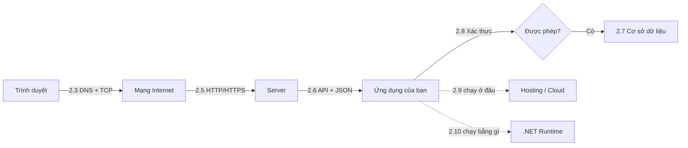

import { SummaryBox, Checklist, FAQSection } from '@site/src/components/SEO';

# 2.1 — Định hướng Module 2: Nền tảng khoa học máy tính

<SummaryBox>
Module 1 dạy bạn viết code chạy trên **một máy**. Module này giải thích chuyện gì xảy ra khi code đó phải nói chuyện với **máy khác qua mạng** — tức là toàn bộ công việc của một backend developer. Trọng tâm không phải học thuộc thuật ngữ, mà xây một **mô hình tinh thần đúng**: một request đi từ trình duyệt tới server của bạn qua những chặng nào, mỗi chặng có thể hỏng ra sao. Thiếu mô hình này, bạn sẽ debug bằng cách đoán — và mọi lỗi CORS, lỗi 401, lỗi timeout đều trông giống nhau.
</SummaryBox>

## Module này giải quyết vấn đề gì

Có một kiểu lập trình viên backend làm được việc nhưng luôn ở thế bị động: API trả 500 thì thêm `try/catch`, gặp CORS thì dán một dòng cấu hình tìm trên Stack Overflow, token hết hạn thì tăng thời gian sống lên một năm. Mỗi lần đều "sửa được", và không lần nào hiểu vì sao.

Điểm chung của cả ba tình huống: **không có mô hình về đường đi của một request**. Khi không biết request đi qua DNS, TCP, TLS, proxy, rồi mới tới middleware của bạn, thì mọi lỗi đều là hộp đen.

Module này dựng mô hình đó, theo đúng thứ tự một byte di chuyển:



Sau module này, khi thấy lỗi `CORS policy: No 'Access-Control-Allow-Origin' header`, bạn sẽ biết ngay đó là **trình duyệt** chặn chứ không phải server hỏng — và biết phải sửa ở đâu.

## Bạn cần gì trước khi bắt đầu

<Checklist
  title="Điều kiện đầu vào"
  items={[
    { text: "Đã xong Module 1, hoặc tự tin viết được một hàm C# có vòng lặp và điều kiện." },
    { text: "Cài được một công cụ gọi HTTP: Postman, Insomnia, hoặc `curl` có sẵn trong terminal." },
    { text: "Biết mở DevTools của trình duyệt (phím F12) và tìm được tab Network." },
    { text: "Có kết nối Internet ổn định — nhiều bài yêu cầu gọi API công khai thật." },
    { text: "Dành được khoảng 9–11 giờ. Module này nhiều khái niệm mới nhưng ít code." },
  ]}
/>

Không cần biết Git, chưa cần cài SQL Server. Bài 2.7 chỉ giới thiệu khái niệm cơ sở dữ liệu; module 12 mới đi sâu.

## Bản đồ module

Tám bài lõi chia thành ba tầng, từ đường truyền lên tới nền tảng chạy ứng dụng:

| Bài | Câu hỏi bài này trả lời | Thời lượng |
|---|---|---|
| [2.2 — Concept learning path](2.2-concept-learning-path.mdx) | Nên học các khái niệm trong module theo thứ tự nào và vì sao? | 30 phút |
| [2.3 — Internet hoạt động thế nào](2.3-how-the-internet-works.mdx) | Gõ một địa chỉ web rồi nhấn Enter thì chuyện gì xảy ra? | 75 phút |
| [2.4 — Mô hình Client–Server](2.4-client.mdx) | Ai giữ dữ liệu, ai giữ giao diện, và vì sao không được tin client? | 60 phút |
| [2.5 — HTTP/HTTPS](2.5-http-https.mdx) | Một request gồm những phần nào, mã trạng thái nói gì, HTTPS bảo vệ điều gì? | 90 phút |
| [2.6 — API và JSON](2.6-api-and-json.mdx) | Hai hệ thống thống nhất định dạng trao đổi dữ liệu bằng cách nào? | 75 phút |
| [2.7 — Cơ sở dữ liệu là gì](2.7-what-is-a-database.mdx) | Vì sao không lưu dữ liệu vào file, và quan hệ với NoSQL khác nhau ở đâu? | 75 phút |
| [2.8 — Authentication và Authorization](2.8-authentication-and-authorization.mdx) | "Bạn là ai" khác "bạn được làm gì" ở chỗ nào? | 75 phút |
| [2.9 — Hosting và Cloud cơ bản](2.9-hosting-and-cloud-co-ban.mdx) | Ứng dụng chạy ở đâu sau khi rời khỏi máy bạn? | 60 phút |
| [2.10 — .NET Runtime và Ecosystem](2.10-dotnet-runtime-and-ecosystem.mdx) | CLR, JIT, GC và NuGet là gì, và vì sao chúng ảnh hưởng tới code của bạn? | 90 phút |

Phần bổ trợ học sau: [2.11 — Mở rộng và đào sâu](2.11-advanced-notes.mdx), [2.12 — Mini case study](2.12-mini-case-study.mdx), [2.13 — Ví dụ thực tế nhanh](2.13-quick-real-world-example.mdx), [2.14 — Review and Assessment](2.14-review-and-assessment.mdx).

## Kết quả đầu ra đo được

| Năng lực | Cách tự kiểm chứng |
|---|---|
| Đọc được một HTTP request đầy đủ | Mở DevTools, chỉ ra method, path, 3 header quan trọng và body của một request bất kỳ |
| Phân biệt nhóm mã trạng thái | Nói ngay 401 khác 403 ở đâu, 502 khác 503 ở đâu |
| Giải thích HTTPS bảo vệ gì | Nêu được ba thứ TLS bảo đảm, và một thứ nó **không** bảo đảm |
| Nhận ra lỗi do client hay do server | Nhìn một lỗi CORS và nói được vì sao thêm header ở server mới sửa được |
| Thiết kế một JSON response hợp lý | Viết được cấu trúc JSON cho danh sách khách hàng có phân trang |
| Phân biệt xác thực và phân quyền | Cho một tình huống và chỉ ra nên trả 401 hay 403 |
| Giải thích GC ảnh hưởng gì tới ứng dụng | Nêu được vì sao cấp phát nhiều đối tượng ngắn hạn làm tăng độ trễ đuôi |

## Sản phẩm bàn giao của module

Không phải code, mà là **một tài liệu phân tích** — và đây là chủ ý. Bạn sẽ chọn một API công khai (ví dụ [JSONPlaceholder](https://jsonplaceholder.typicode.com/) hoặc [GitHub REST API](https://docs.github.com/en/rest)) rồi viết một trang mô tả:

```text
1. Địa chỉ được phân giải thành IP nào (dùng nslookup hoặc dig)
2. Kết nối dùng HTTP phiên bản mấy, TLS phiên bản mấy
3. Request mẫu: method, path, headers, body
4. Response mẫu: mã trạng thái, headers đáng chú ý, cấu trúc JSON
5. API xác thực bằng cách nào — và nếu gọi thiếu xác thực thì trả mã gì
6. Thử gọi sai một cách có chủ ý, ghi lại mã lỗi nhận được
```

Tài liệu này ngắn (1–2 trang) nhưng ép bạn dùng cả tám bài cùng lúc. Nó cũng là bản nháp đầu tiên của kỹ năng đọc tài liệu API — thứ bạn dùng hằng ngày về sau.

## Lộ trình học gợi ý

| Ngày | Nội dung | Việc phải xong |
|---|---|---|
| 1 | 2.2 + 2.3 | Chạy được `nslookup` và giải thích kết quả |
| 2 | 2.4 + 2.5 | Gửi được một GET và một POST bằng curl hoặc Postman |
| 3 | 2.5 (phần HTTPS) | Giải thích được vì sao không được gửi mật khẩu qua HTTP |
| 4 | 2.6 | Tự thiết kế JSON cho một danh sách có phân trang |
| 5 | 2.7 + 2.8 | Phân biệt được 401 và 403 qua ba tình huống cụ thể |
| 6 | 2.9 + 2.10 | Nêu được ba khác biệt giữa chạy local và chạy trên cloud |
| 7 | 2.11 → 2.14 | Nộp tài liệu phân tích API, làm bài tự chấm 2.14 |

## Ba sai lầm thường gặp khi học module này

**Một — học thuộc danh sách mã trạng thái.** Thuộc cả 60 mã không giúp gì. Hiểu **quy tắc nhóm** mới có giá trị: 4xx nghĩa là client gửi sai nên gửi lại y như cũ cũng vô ích; 5xx nghĩa là server hỏng nên thử lại có thể thành công. Chính quy tắc này quyết định logic retry mà module 17 sẽ xây.

**Hai — nghĩ HTTPS là "đã an toàn".** TLS bảo vệ dữ liệu **trên đường truyền**. Nó không kiểm tra dữ liệu bạn nhận có hợp lệ không, không chặn SQL injection, không ngăn một người dùng đã đăng nhập đọc dữ liệu của người khác. Nhầm lẫn này dẫn thẳng tới lớp lỗi mà module 10 phải dọn.

**Ba — bỏ qua 2.10 vì "runtime là chuyện của Microsoft".** Bài về CLR, JIT và garbage collector nghe xa vời nhất module, nhưng nó là nền cho hai module nặng nhất về sau: [module 6 — Async](../../stage-02-csharp-professional/module-06-async-programming/) và [module 19 — Performance Engineering](../../stage-05-senior-engineering/module-19-performance-engineering/). Hiểu vì sao `async` không tạo thêm luồng bắt đầu từ đây.

## Bài tập khởi động

Làm trước khi vào 2.3. Không cần viết code, chỉ cần một terminal.

> **Đề bài.** Chạy lệnh sau và trả lời bốn câu hỏi bên dưới:
>
> ```bash
> curl -s -o /dev/null -D - https://api.github.com/users/octocat
> ```
>
> 1. Server trả về mã trạng thái nào, và nó thuộc nhóm nào?
> 2. Header `content-type` nói gì về định dạng dữ liệu?
> 3. Tìm các header bắt đầu bằng `x-ratelimit-`. Chúng đang nói với bạn điều gì?
> 4. Bây giờ chạy lại nhưng đổi `octocat` thành một tên chắc chắn không tồn tại. Mã trạng thái đổi thành gì, và vì sao **không phải** là 500?

<details>
<summary><strong>Gợi ý — nếu lệnh curl không chạy hoặc bạn không biết đọc kết quả</strong></summary>

- Cờ `-D -` yêu cầu curl in **toàn bộ header phản hồi** ra màn hình; `-o /dev/null` vứt bỏ phần thân để output đỡ rối. Nếu máy Windows không có `curl`, dùng Postman và mở tab *Headers* của phản hồi.
- Dòng đầu tiên của kết quả có dạng `HTTP/2 200` — đó chính là phiên bản giao thức và mã trạng thái.
- Về câu 4: hãy tự hỏi *ai* đã làm sai. Nếu bạn yêu cầu một tài nguyên không tồn tại thì server hoàn toàn khỏe mạnh và đã trả lời đúng. Lỗi nằm ở nội dung **yêu cầu**, không phải ở server.

</details>

<details>
<summary><strong>Hướng dẫn giải — đọc sau khi đã tự làm</strong></summary>

**Câu 1.** `HTTP/2 200`. Mã 200 thuộc nhóm **2xx — thành công**: server đã nhận, hiểu và xử lý xong yêu cầu.

**Câu 2.** `content-type: application/json; charset=utf-8`. Header này cho client biết cách **diễn giải chuỗi byte** nhận được. Không có nó, client chỉ thấy một dãy byte và phải đoán. Đây chính là cơ chế mà bài 2.6 gọi là *content negotiation*, và là lý do ASP.NET Core biết khi nào nên tuần tự hoá sang JSON.

**Câu 3.** Bạn sẽ thấy đại loại `x-ratelimit-limit: 60`, `x-ratelimit-remaining: 59`, `x-ratelimit-reset: 1727170000`. GitHub đang nói: *bạn được gọi 60 lần mỗi giờ, còn 59 lần, hạn mức đặt lại vào thời điểm này*. Hai điều rút ra:

- Header `x-` là header tuỳ biến do ứng dụng tự định nghĩa, không thuộc chuẩn HTTP. Server của bạn cũng có thể tạo header riêng như vậy.
- Giới hạn tần suất là **mối quan tâm của backend**, không phải của client. Module 9 sẽ cài đặt rate limiting cho chính API của bạn.

**Câu 4.** Trả về `404 Not Found`, thuộc nhóm **4xx — lỗi phía client**. Phân biệt này quan trọng hơn vẻ ngoài của nó:

| | 4xx | 5xx |
|---|---|---|
| Ai sai | Client gửi yêu cầu không hợp lệ | Server không xử lý được |
| Gửi lại y hệt | Vô ích, vẫn lỗi | Có thể thành công |
| Cần cảnh báo vận hành | Không | Có |

Trả nhầm 500 cho trường hợp "không tìm thấy" gây hai hậu quả thật: hệ thống giám sát báo động giả lúc nửa đêm, và client tự động thử lại vô ích, làm tăng tải đúng lúc không nên. Module 9 sẽ chuẩn hoá việc này bằng định dạng `ProblemDetails`.

**Điểm tự chấm.** Trả lời đúng câu 4 kèm giải thích "vì lỗi nằm ở yêu cầu chứ không ở server" là dấu hiệu bạn đã có tư duy đúng để vào module.

</details>

## Tự kiểm tra đầu vào

<FAQSection
  items={[
    {
      question: "Tôi muốn viết API ngay, học mạng máy tính có phải đi đường vòng không?",
      answer: "Viết được API mà không hiểu HTTP là chuyện hoàn toàn khả thi, và đó chính là vấn đề. Bạn sẽ viết được cho tới lần đầu gặp lỗi CORS, hoặc lần đầu phải quyết định trả 401 hay 403, hoặc lần đầu API chậm mà không biết chậm ở chặng nào. Chín giờ bỏ ra ở module này tiết kiệm nhiều ngày mò mẫm về sau, vì mọi module từ 8 trở đi đều giả định bạn đã có mô hình này."
    },
    {
      question: "Khác biệt thực tế giữa Authentication và Authorization là gì?",
      answer: "Authentication trả lời 'bạn là ai' — kiểm tra danh tính, thường qua mật khẩu hoặc token. Authorization trả lời 'bạn được làm gì' — kiểm tra quyền trên một tài nguyên cụ thể. Hệ quả trực tiếp là mã trạng thái: thiếu hoặc sai token thì trả 401 Unauthorized; token hợp lệ nhưng không đủ quyền thì trả 403 Forbidden. Nhầm hai mã này khiến client không biết nên đăng nhập lại hay từ bỏ. Module 10 sẽ cài đặt cả hai trong ASP.NET Core."
    },
    {
      question: "HTTPS bảo vệ những gì, và không bảo vệ gì?",
      answer: "TLS bảo đảm ba điều trên đường truyền: dữ liệu được mã hoá nên người ở giữa không đọc được, dữ liệu không bị sửa đổi mà không bị phát hiện, và client xác minh được server đúng là bên nó muốn nói chuyện. Nó không kiểm tra dữ liệu bạn nhận có hợp lệ hay không, không ngăn SQL injection, không ngăn một người dùng đã đăng nhập truy cập dữ liệu của người khác, và không bảo vệ dữ liệu sau khi đã nằm trong database. HTTPS là điều kiện cần, không phải điều kiện đủ."
    },
    {
      question: "Lỗi CORS là lỗi của server hay của trình duyệt?",
      answer: "Cơ chế chặn nằm ở trình duyệt, nhưng cách sửa nằm ở server. Trình duyệt thực thi chính sách same-origin: nó vẫn gửi request đi và server vẫn trả lời bình thường, nhưng nếu phản hồi thiếu header Access-Control-Allow-Origin phù hợp thì trình duyệt từ chối đưa kết quả cho JavaScript. Vì vậy gọi cùng API đó bằng curl hay Postman thì chạy được — hai công cụ này không thực thi chính sách của trình duyệt. Đây là lý do server phải khai báo CORS chứ không phải client."
    },
    {
      question: "Vì sao không lưu dữ liệu vào file cho đơn giản?",
      answer: "Với một người dùng thì file chạy tốt. Vấn đề xuất hiện khi có nhiều request đồng thời: hai tiến trình cùng ghi một file sẽ làm hỏng dữ liệu, và không có cách nào quay lại trạng thái trước đó khi thao tác thất bại giữa chừng. Cơ sở dữ liệu tồn tại để giải quyết đúng nhóm vấn đề này — giao dịch, truy cập đồng thời, và truy vấn trên tập dữ liệu lớn mà không phải đọc toàn bộ. Bài 2.7 trình bày khái niệm, module 12 đi vào chi tiết."
    },
    {
      question: "Module này có phải học thuộc nhiều thuật ngữ không?",
      answer: "Không nên học theo cách đó. Mục tiêu là xây một mô hình về đường đi của request, còn thuật ngữ chỉ là nhãn dán lên các chặng của mô hình đó. Cách kiểm tra bạn đã học đúng cách: nhìn một thông báo lỗi bất kỳ và nói được nó phát sinh ở chặng nào — phân giải tên miền, bắt tay TLS, định tuyến, xác thực, hay tầng dữ liệu. Nếu làm được việc đó thì thuật ngữ tự khắc nhớ."
    }
  ]}
/>

## Kết luận

1. **Mục tiêu là một mô hình, không phải một danh sách thuật ngữ.** Đo bằng việc chỉ ra được lỗi phát sinh ở chặng nào.
2. **Quy tắc 4xx so với 5xx là kiến thức dùng suốt sự nghiệp.** Nó quyết định logic retry, cảnh báo vận hành và trải nghiệm client.
3. **Đừng bỏ bài 2.10.** Nó là nền cho async ở module 6 và hiệu năng ở module 19.

## Tham khảo

- [MDN — HTTP overview](https://developer.mozilla.org/en-US/docs/Web/HTTP/Overview) — tài liệu tham chiếu tốt nhất về HTTP
- [MDN — HTTP response status codes](https://developer.mozilla.org/en-US/docs/Web/HTTP/Status) — tra cứu mã trạng thái kèm ngữ cảnh dùng
- [MDN — Cross-Origin Resource Sharing (CORS)](https://developer.mozilla.org/en-US/docs/Web/HTTP/CORS) — giải thích đầy đủ cơ chế và cách khắc phục
- [.NET runtime — Microsoft Learn](https://learn.microsoft.com/en-us/dotnet/core/introduction) — tổng quan CLR, JIT và hệ sinh thái

## Điều hướng

- **Hub lộ trình:** [00. Lộ trình From Zero → Senior .NET (Backend-first)](../../roadmap-dotnet-backend-zero-to-senior.mdx)
- **Bài trước:** Không có (bài mở đầu module).
- **Bài tiếp theo:** [2.2 — Concept learning path](2.2-concept-learning-path.mdx)
- **Module trước:** [Module 1 — Programming Logic](../module-01-programming-logic/)
- **Module tiếp theo:** [Module 3 — Git + Developer Workflow](../module-03-git-developer-workflow/)
- **Về module:** [Trang mục lục](./)
