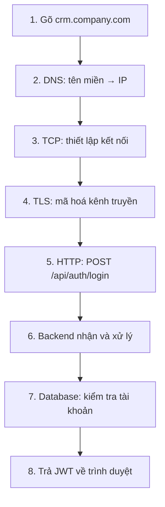

import { SummaryBox, Checklist, FAQSection } from '@site/src/components/SEO';

# 2.2 — Concept learning path

<SummaryBox>
Module này có nhiều thuật ngữ rời rạc — DNS, TCP, TLS, HTTP, JSON, JWT, database, hosting — và học từng cái riêng lẻ rất dễ quên. Bài này là **bản đồ** nối tất cả lại bằng **một ví dụ duy nhất chạy xuyên suốt**: chuyện gì xảy ra khi bạn gõ `crm.company.com` và bấm Đăng nhập. Tám chặng, mỗi chặng ứng với một bài trong module. Cách học được khuyến nghị: **đọc bài này trước, học từng bài, rồi quay lại đọc bài này lần nữa** — lần hai bạn sẽ thấy các mảnh ghép vào đúng chỗ. Và thứ tự quan trọng: học **từ trải nghiệm hằng ngày tới thuật ngữ kỹ thuật**, không phải ngược lại.
</SummaryBox>

## Mục tiêu bài học

Sau bài này bạn có thể:

- Mô tả tám chặng của một request web.
- Biết mỗi bài trong module ứng với chặng nào.
- Chọn thứ tự học phù hợp với nền tảng của mình.
- Nhận ra chặng nào gây lỗi khi có sự cố.

## Nội dung bài học

### 2.2.1 — Ví dụ xuyên suốt



Tám chặng này xảy ra trong khoảng **200 mili giây**, và mỗi chặng là một bài trong module.

### 2.2.2 — Từng chặng, học ở bài nào

**Chặng 1–2: gõ URL và phân giải DNS** → [bài 2.3](2.3-how-the-internet-works.mdx)

```
crm.company.com  ->  DNS resolver  ->  203.0.113.45
```

Trình duyệt không biết `crm.company.com` nằm ở đâu. Nó hỏi DNS — giống tra danh bạ điện thoại — để lấy địa chỉ IP.

**Chặng 3: kết nối TCP** → [bài 2.3](2.3-how-the-internet-works.mdx)

Trình duyệt và server bắt tay ba bước để mở một kênh tin cậy. TCP đảm bảo dữ liệu tới **đủ** và **đúng thứ tự**.

**Chặng 4: bắt tay TLS** → [bài 2.5](2.5-http-https.mdx)

Hai bên trao đổi khoá để mã hoá. Đây là chữ `S` trong HTTPS. Không có nó, mật khẩu bạn gửi đi ai cũng đọc được trên đường truyền.

**Chặng 5: request HTTP** → [bài 2.5](2.5-http-https.mdx) và [bài 2.6](2.6-api-and-json.mdx)

```http
POST /api/auth/login HTTP/1.1
Host: crm.company.com
Content-Type: application/json

{ "email": "an@company.com", "password": "..." }
```

Đây là chỗ bạn sẽ làm việc nhiều nhất với tư cách backend engineer: method, đường dẫn, header, body, và mã trạng thái trả về.

**Chặng 6: backend xử lý** → [bài 2.4](2.4-client.mdx)

Server nhận request, phân tích, và quyết định làm gì. Đây là mô hình client–server: một bên hỏi, một bên trả lời.

**Chặng 7: truy vấn database** → [bài 2.7](2.7-what-is-a-database.mdx)

```sql
SELECT Id, PasswordHash FROM Users WHERE Email = @email;
```

Backend hỏi database xem tài khoản có tồn tại không và mật khẩu có khớp không.

**Chặng 8: trả JWT** → [bài 2.8](2.8-authentication-and-authorization.mdx)

```json
{ "token": "eyJhbGciOiJIUzI1NiIs..." }
```

Từ các request sau, trình duyệt đính token này vào header `Authorization` để server biết bạn là ai mà không phải đăng nhập lại.

**Và tất cả chạy ở đâu?** → [bài 2.9](2.9-hosting-and-cloud-co-ban.mdx) và [bài 2.10](2.10-dotnet-runtime-and-ecosystem.mdx)

### 2.2.3 — Chặng nào gây lỗi gì

Bảng này hữu ích ngay cả khi bạn chưa học hết module — nó giúp khoanh vùng khi có sự cố:

| Triệu chứng | Chặng có vấn đề |
|---|---|
| `ERR_NAME_NOT_RESOLVED` | DNS (chặng 2) |
| `ERR_CONNECTION_REFUSED` | TCP — server không chạy hoặc sai cổng (chặng 3) |
| `ERR_CERT_AUTHORITY_INVALID` | TLS — chứng chỉ sai hoặc hết hạn (chặng 4) |
| `404 Not Found` | HTTP — sai đường dẫn (chặng 5) |
| `500 Internal Server Error` | Backend — lỗi trong code (chặng 6) |
| Timeout khi gọi API | Database chậm hoặc mất kết nối (chặng 7) |
| `401 Unauthorized` | Token thiếu, sai hoặc hết hạn (chặng 8) |

Nguyên tắc chẩn đoán: **mã lỗi cho biết chặng nào**, và biết chặng nào tiết kiệm rất nhiều thời gian tìm kiếm ([bài 2.12](2.12-mini-case-study.mdx)).

### 2.2.4 — Thứ tự học theo nền tảng

**Nếu bạn hoàn toàn mới với web:** đọc theo đúng thứ tự 2.3 → 2.10. Mỗi bài dựa trên bài trước.

**Nếu đã biết HTML/CSS/JavaScript:** bắt đầu từ [2.5](2.5-http-https.mdx) (HTTP) và [2.6](2.6-api-and-json.mdx) (API và JSON) — hai bài gần với công việc backend nhất. Quay lại 2.3 và 2.4 khi cần.

**Nếu đã làm frontend:** [2.7](2.7-what-is-a-database.mdx) (database) và [2.8](2.8-authentication-and-authorization.mdx) (xác thực) là hai mảng bạn ít tiếp xúc nhất. Ưu tiên chúng.

**Nếu chỉ có 2 giờ:** [2.5](2.5-http-https.mdx) và [2.8](2.8-authentication-and-authorization.mdx). Hai bài này chiếm phần lớn công việc hàng ngày của một backend engineer.

### 2.2.5 — Học từ trải nghiệm tới thuật ngữ

Cách học **không** hiệu quả:

```
Hoc thuoc: "DNS la he thong phan giai ten mien thanh dia chi IP"
-> Nho duoc vai ngay, roi quen
```

Cách học hiệu quả:

```
1. Mo terminal, go:  nslookup google.com
2. Thay ket qua tra ve mot dia chi IP
3. Go dia chi IP do vao trinh duyet — van ra Google
4. "A, DNS la de khoi phai nho day so nay"
-> Hieu, va khong quen
```

Với mỗi khái niệm trong module, tìm một cách **tự tay thử** nó. Vài lệnh đáng biết ngay:

```bash
nslookup crm.company.com          # DNS tra ve IP nao
curl -i https://example.com       # Xem day du header phan hoi
ping google.com                   # Do do tre mang
```

Và công cụ quan trọng nhất: **DevTools của trình duyệt**, tab Network. Mọi thứ trong module này đều quan sát được ở đó — request, header, mã trạng thái, thời gian từng chặng.

### 2.2.6 — Rà lại code của bạn

<Checklist
  title="Danh sách rà soát trước khi sang Module 3"
  items={[
    { text: "Mô tả được tám chặng của một request web." },
    { text: "Biết mã lỗi nào ứng với chặng nào." },
    { text: "Đã tự chạy nslookup và curl ít nhất một lần." },
    { text: "Mở được DevTools tab Network và đọc được một request." },
    { text: "Phân biệt được HTTP và HTTPS khác nhau ở đâu." },
    { text: "Giải thích được JWT dùng để làm gì." },
    { text: "Biết database nằm ở chặng nào trong luồng." },
  ]}
/>

## Bài tập áp dụng

1. **Lần theo luồng thật.** Mở DevTools trên một trang có đăng nhập, thực hiện đăng nhập, và xác định từng chặng trong tab Network.

2. **Thử DNS bằng tay.** Chạy `nslookup` cho ba tên miền bất kỳ, rồi thử truy cập bằng IP thay vì tên miền.

3. **Tự vẽ sơ đồ.** Không nhìn bài, vẽ lại tám chặng và ghi tên bài học tương ứng với mỗi chặng.

## Tự kiểm tra

<FAQSection
  items={[
    {
      question: "Vì sao nên học từ trải nghiệm tới thuật ngữ?",
      answer: "Vì học thuộc định nghĩa thì quên sau vài ngày, còn tự tay chạy nslookup rồi gõ IP vào trình duyệt thì hiểu ngay DNS dùng để làm gì và không quên. Mỗi khái niệm nên có một cách tự thử."
    },
    {
      question: "Tám chặng của một request web là gì?",
      answer: "Gõ URL, phân giải DNS, thiết lập kết nối TCP, bắt tay TLS, gửi request HTTP, backend xử lý, truy vấn database, và trả kết quả kèm token về trình duyệt."
    },
    {
      question: "Mã lỗi ERR_CONNECTION_REFUSED cho biết vấn đề ở chặng nào?",
      answer: "Chặng TCP. Tên miền đã phân giải ra IP thành công nhưng không mở được kết nối, thường vì server không chạy hoặc sai cổng."
    },
    {
      question: "Lỗi 401 khác lỗi 404 ở chỗ nào về mặt chẩn đoán?",
      answer: "404 là sai đường dẫn ở chặng HTTP, tức route không tồn tại. 401 là vấn đề ở chặng xác thực, tức token thiếu, sai hoặc hết hạn, còn đường dẫn thì đúng."
    },
    {
      question: "Nếu chỉ có hai giờ thì nên học bài nào?",
      answer: "Bài về HTTP và bài về xác thực, vì hai mảng đó chiếm phần lớn công việc hàng ngày của một backend engineer."
    },
    {
      question: "Công cụ quan trọng nhất để quan sát mọi thứ trong module này là gì?",
      answer: "DevTools của trình duyệt, tab Network. Ở đó bạn thấy được request, header, mã trạng thái và thời gian của từng chặng."
    }
  ]}
/>

## Kết luận

Ba điều đáng nhớ nhất:

1. **Một ví dụ xuyên suốt nối mọi khái niệm lại** — dễ nhớ hơn học từng thuật ngữ rời.
2. **Mã lỗi cho biết chặng nào có vấn đề.** Đây là kỹ năng chẩn đoán cơ bản nhất.
3. **Tự tay thử mỗi khái niệm.** Một lệnh `nslookup` đáng giá hơn một đoạn định nghĩa.

## Tham khảo

- [HTTP trên MDN](https://developer.mozilla.org/en-US/docs/Web/HTTP)
- [HTTP status codes](https://developer.mozilla.org/en-US/docs/Web/HTTP/Status)
- [TLS — hướng dẫn triển khai thực tế](https://developer.mozilla.org/en-US/docs/Web/Security/Practical_implementation_guides/TLS)
- [Giới thiệu .NET](https://learn.microsoft.com/en-us/dotnet/core/introduction)

## Điều hướng

- **Bài trước:** [2.1 — Module Orientation](2.1-module-orientation.mdx)
- **Bài tiếp theo:** [2.3 — 1. Internet hoạt động như thế nào](2.3-how-the-internet-works.mdx)
- **Về module:** [Trang mục lục](./)
