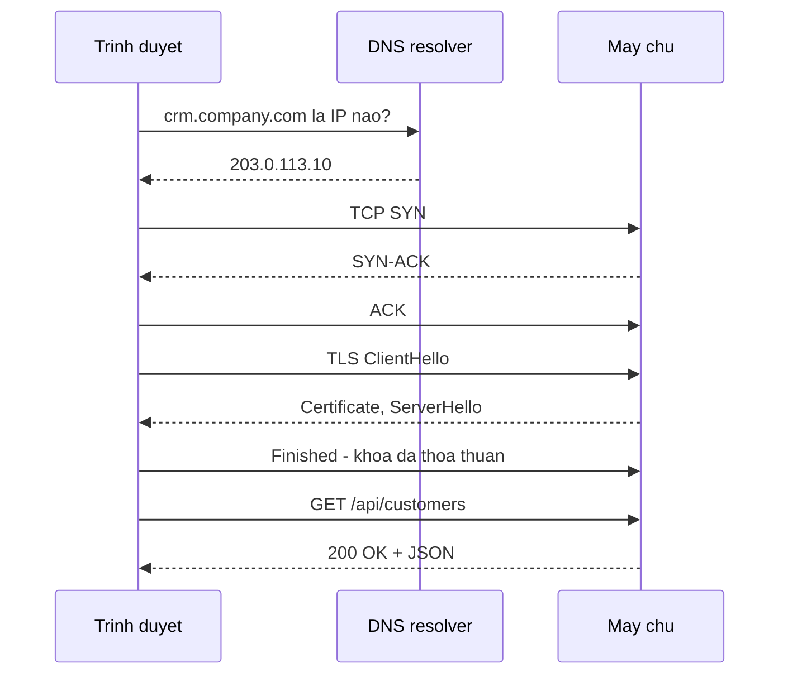

import { SummaryBox, Checklist, FAQSection } from '@site/src/components/SEO';

# 2.3 — 1. Internet hoạt động như thế nào

<SummaryBox>
Gõ `crm.company.com` rồi bấm Enter, và trước khi byte dữ liệu đầu tiên của bạn rời máy, trình duyệt đã làm xong **ba lần bắt tay riêng biệt**: hỏi DNS để đổi tên miền thành địa chỉ IP, bắt tay TCP ba bước để mở kết nối, rồi bắt tay TLS để thoả thuận khoá mã hoá. Ba việc đó tốn vài trăm mili giây **trước khi** máy chủ của bạn nhận được gì. Hiểu chuỗi này là điều kiện để trả lời những câu hỏi rất thực tế: vì sao đổi DNS phải đợi, vì sao một API gọi 5 lần chậm hơn hẳn một API gọi 1 lần, và vì sao mở kết nối mới tốn kém tới mức phải có connection pool.
</SummaryBox>

## Mục tiêu bài học

Sau bài này bạn có thể:

- Kể lại các chặng một request đi qua, theo đúng thứ tự.
- Giải thích DNS TTL là gì và vì sao đổi bản ghi DNS không có hiệu lực ngay.
- Nêu TCP bắt tay mấy bước, TLS thêm bao nhiêu vòng, và tổng chi phí mở một kết nối.
- Giải thích vì sao connection pool và keep-alive lại quan trọng với backend.
- Phân biệt độ trễ do mạng với độ trễ do máy chủ xử lý.

## Nội dung bài học

### 2.3.1 — Toàn cảnh một request



Chú ý: **bốn lượt đi về trước khi gửi được request đầu tiên**. Trên đường truyền quốc tế với độ trễ một chiều 80ms, riêng phần chuẩn bị đã tốn khoảng 480ms.

### 2.3.2 — DNS: đổi tên thành số

Máy tính không hiểu `crm.company.com`; nó cần `203.0.113.10`. DNS là hệ thống tra cứu phân tán làm việc đổi đó.

Chuỗi tra cứu, dừng ngay khi có cache:

1. Cache của trình duyệt
2. Cache của hệ điều hành
3. DNS resolver của nhà mạng
4. Root server → TLD server (`.com`) → name server của domain

**TTL (Time To Live)** là điểm hay bị hiểu nhầm nhất. Mỗi bản ghi DNS kèm một TTL tính bằng giây, và mọi cache trên đường được phép giữ kết quả đến hết khoảng đó.

```
crm.company.com.   300   IN   A   203.0.113.10
                    ↑
                 TTL 300 giây
```

Hệ quả thực tế: đổi bản ghi DNS trỏ sang máy chủ mới **không có hiệu lực ngay**. Trong tối đa một TTL nữa, một phần người dùng vẫn đi tới máy chủ cũ. Vì thế trước mỗi lần chuyển máy chủ, việc đầu tiên là **hạ TTL xuống** vài phút và đợi hết TTL cũ, rồi mới đổi bản ghi.

### 2.3.3 — TCP: bắt tay ba bước

```
Client  ──── SYN ────▶  Server
Client  ◀── SYN-ACK ──  Server
Client  ──── ACK ────▶  Server
        (kết nối sẵn sàng)
```

Một vòng đi về hoàn chỉnh trước khi gửi được dữ liệu. TCP bảo đảm **đúng thứ tự** và **không mất gói** — gói nào không tới nơi sẽ được gửi lại.

### 2.3.4 — TLS: chữ "S" trong HTTPS

Sau TCP, TLS thoả thuận cách mã hoá. TLS 1.3 cần thêm **một vòng** nữa (TLS 1.2 cần hai).

TLS làm ba việc, và hay bị rút gọn thành mỗi việc đầu:

1. **Mã hoá** — người ở giữa không đọc được nội dung.
2. **Xác thực** — chứng chỉ chứng minh máy chủ đúng là chủ của tên miền đó.
3. **Toàn vẹn** — nội dung bị sửa trên đường thì phát hiện được.

Việc thứ hai là lý do chứng chỉ phải do một CA đáng tin cấp, và phải **gia hạn trước khi hết hạn**. Bài [Traefik + Cloudflare: vì sao cert hết hạn đồng loạt sau 60 ngày](/blog/traefik-cloudflare-https-tu-dong-vps) là một sự cố thật của việc gia hạn tự động không chạy.

### 2.3.5 — Vì sao backend phải quan tâm

Ba con số làm mọi thứ sáng ra:

| Thao tác | Thời gian điển hình |
|---|---|
| Đọc từ RAM | ~100 nano giây |
| Đọc từ SSD | ~100 micro giây (nghìn lần chậm hơn RAM) |
| Gọi trong cùng trung tâm dữ liệu | ~0,5 mili giây |
| Gọi qua Internet (cùng quốc gia) | ~20 mili giây |
| Gọi qua Internet (xuyên lục địa) | ~150 mili giây |

Từ bảng này suy ra ba nguyên tắc thiết kế:

1. **Mở kết nối là tốn kém.** Nên `HttpClient` phải được dùng lại qua `IHttpClientFactory`, và database phải có connection pool. Mỗi kết nối mới là TCP cộng TLS cộng toàn bộ độ trễ ở trên.
2. **Gọi 5 lần chậm hơn hẳn gọi 1 lần**, kể cả khi mỗi lần đều nhanh — vì độ trễ mạng cộng dồn tuyến tính. Đây chính là lý do vấn đề [N+1 query](/blog/ef-core-n-plus-1-query) tàn phá đến thế: hằng số của mỗi lần đi mạng lớn gấp hàng nghìn lần một phép so sánh trong bộ nhớ.
3. **Gần người dùng thì nhanh hơn.** Đó là toàn bộ lý do tồn tại của CDN và edge cache.

### 2.3.6 — Phân biệt chậm do mạng hay chậm do server

Khi có người báo "hệ thống chậm", câu hỏi đầu tiên là chậm ở đâu.

```bash
# Tổng thời gian và từng chặng
curl -w "dns:%{time_namelookup}s connect:%{time_connect}s tls:%{time_appconnect}s \
ttfb:%{time_starttransfer}s total:%{time_total}s\n" -o /dev/null -s https://api.company.com/health
```

Đọc kết quả:

- `dns` cao → vấn đề ở phân giải tên miền.
- `connect` trừ `dns` cao → độ trễ mạng hoặc máy chủ quá tải ở tầng TCP.
- `tls` trừ `connect` cao → bắt tay TLS chậm, thường do chuỗi chứng chỉ dài hoặc OCSP.
- `ttfb` trừ `tls` cao → **máy chủ của bạn xử lý chậm**. Đây mới là lúc đi tìm câu query chậm.
- `total` trừ `ttfb` cao → phần thân phản hồi quá lớn, hoặc băng thông hẹp.

Không có bước này thì rất dễ bỏ cả ngày tối ưu câu SQL trong khi vấn đề nằm ở DNS.

### 2.3.7 — Rà lại hệ thống của bạn

<Checklist
  title="Danh sách rà soát tầng mạng"
  items={[
    { text: "HttpClient được tạo qua IHttpClientFactory, không new trong mỗi request." },
    { text: "Connection pool của database đã bật và kích thước phù hợp với tải." },
    { text: "Chứng chỉ TLS có cơ chế gia hạn tự động, và có cảnh báo khi sắp hết hạn." },
    { text: "TTL của DNS đã hạ xuống trước mỗi lần chuyển máy chủ." },
    { text: "Đã đo được TTFB tách khỏi thời gian DNS, TCP và TLS." },
    { text: "Tài nguyên tĩnh phục vụ qua CDN thay vì đi thẳng về máy chủ gốc." },
  ]}
/>

## Bài tập áp dụng

1. **Bóc tách độ trễ.** Chạy lệnh `curl -w` ở mục 2.3.6 với ba mục tiêu: một API nội bộ, một website trong nước, một website nước ngoài. Lập bảng năm chặng và chỉ ra chặng nào khác biệt nhất.

2. **Quan sát DNS TTL.** Dùng `dig crm.company.com` (hoặc `nslookup`) trên một tên miền bất kỳ, ghi lại TTL. Chạy lại sau 30 giây và xem TTL giảm đi. Giải thích con số đó nói gì về thời gian chờ khi đổi bản ghi.

3. **Đo cái giá của kết nối mới.** Viết một chương trình nhỏ gọi cùng một API 20 lần: lần một tạo `HttpClient` mới mỗi lượt, lần hai dùng lại một instance. So sánh tổng thời gian.

## Tự kiểm tra

<FAQSection
  items={[
    {
      question: "Một request đi qua những chặng nào trước khi tới máy chủ?",
      answer: "Bốn chặng: phân giải DNS để đổi tên miền thành IP, bắt tay TCP ba bước để mở kết nối, bắt tay TLS để thoả thuận khoá mã hoá, rồi mới gửi request HTTP. Ba chặng đầu tốn vài vòng đi về, nên trên đường truyền quốc tế chúng có thể chiếm vài trăm mili giây trước khi máy chủ nhận được gì."
    },
    {
      question: "DNS TTL là gì và vì sao đổi DNS không có hiệu lực ngay?",
      answer: "TTL là số giây mà mọi cache trên đường được phép giữ lại kết quả tra cứu. Sau khi đổi bản ghi, các cache vẫn trả kết quả cũ cho tới khi hết TTL, nên một phần người dùng vẫn đi tới máy chủ cũ. Cách xử lý là hạ TTL xuống vài phút trước, đợi hết TTL cũ, rồi mới đổi bản ghi."
    },
    {
      question: "TLS làm những việc gì ngoài mã hoá?",
      answer: "Ba việc. Mã hoá để người ở giữa không đọc được. Xác thực để chứng minh máy chủ đúng là chủ của tên miền, thông qua chứng chỉ do CA đáng tin cấp. Và toàn vẹn để phát hiện nội dung bị sửa trên đường. Việc thứ hai là lý do chứng chỉ phải được gia hạn trước hạn."
    },
    {
      question: "Vì sao phải dùng lại HttpClient thay vì tạo mới mỗi lần?",
      answer: "Vì mỗi kết nối mới phải trả lại toàn bộ chi phí bắt tay TCP và TLS, tức vài vòng đi về. Dùng lại instance qua IHttpClientFactory cho phép tận dụng kết nối đang mở. Tạo mới HttpClient liên tục còn gây cạn kiệt socket do các kết nối ở trạng thái TIME_WAIT."
    },
    {
      question: "Vì sao gọi API 5 lần lại chậm hơn nhiều so với gọi 1 lần?",
      answer: "Vì độ trễ mạng cộng dồn tuyến tính theo số lần gọi, và độ trễ đó lớn hơn hàng nghìn lần thời gian xử lý trong bộ nhớ. Đây chính là cơ chế khiến vấn đề N+1 query gây hại lớn: không phải mỗi query chậm, mà là số lần đi mạng quá nhiều."
    },
    {
      question: "Làm sao biết chậm do mạng hay do máy chủ?",
      answer: "Dùng curl với tuỳ chọn -w để tách thời gian thành năm chặng: namelookup, connect, appconnect, starttransfer và total. Nếu khoảng cách giữa appconnect và starttransfer lớn thì đó là thời gian máy chủ xử lý. Còn nếu các chặng trước đó lớn thì vấn đề nằm ở DNS, mạng hoặc TLS."
    }
  ]}
/>

## Kết luận

Ba điều đáng nhớ nhất:

1. **Bốn lượt đi về xảy ra trước request đầu tiên.** Đó là lý do kết nối phải được dùng lại chứ không tạo mới.
2. **DNS TTL quyết định thời gian chờ khi chuyển máy chủ.** Hạ TTL trước, đổi bản ghi sau.
3. **Tách TTFB ra khỏi phần còn lại trước khi tối ưu.** Nếu không, rất dễ sửa nhầm chỗ.

## Tham khảo

- [DNS — MDN Glossary](https://developer.mozilla.org/en-US/docs/Glossary/DNS)
- [HTTP — MDN](https://developer.mozilla.org/en-US/docs/Web/HTTP) — tổng quan giao thức
- [RFC 9110 — HTTP Semantics](https://www.rfc-editor.org/rfc/rfc9110.html) — đặc tả gốc
- [Host and deploy ASP.NET Core](https://learn.microsoft.com/en-us/aspnet/core/host-and-deploy/) — phía máy chủ

## Điều hướng

- **Bài trước:** [2.2 — Concept learning path](2.2-concept-learning-path.mdx)
- **Bài tiếp theo:** [2.4 — 2. Client - Server Model](2.4-client.mdx)
- **Về module:** [Trang mục lục](./)

## Bài liên quan

- [Traefik + Cloudflare: vì sao cert hết hạn đồng loạt sau 60 ngày?](/blog/traefik-cloudflare-https-tu-dong-vps) — Một VPS, 14 container, 13 hostname, tất cả nằm sau Cloudflare và đều cần HTTPS tự động.
- [Vì sao EF Core bắn 201 query cho 1 màn hình danh sách? Cách sửa N+1](/blog/ef-core-n-plus-1-query) — Một màn hình 200 dòng mà log SQL ghi 201 câu lệnh là dấu hiệu của N+1 query.
