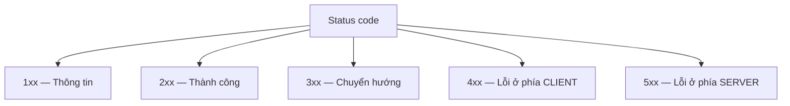

import { SummaryBox, Checklist, FAQSection } from '@site/src/components/SEO';

# 2.5 — 3. HTTP/HTTPS

<SummaryBox>
HTTP là một giao thức văn bản đơn giản tới mức gõ tay được. Nhưng ba chỗ trong nó thường xuyên bị dùng sai. **Method có ngữ nghĩa**: `GET` phải an toàn và `PUT`/`DELETE` phải idempotent — vi phạm thì proxy, trình duyệt và cơ chế retry sẽ làm hỏng dữ liệu của bạn. **Status code nói với máy, không nói với người**: trả `200` kèm `{"error": ...}` là làm mù mọi lớp giám sát. Và **giá trị header chỉ được chứa ASCII** — một dấu tiếng Việt lọt vào là `HttpClient` ném ngoại lệ trước khi request kịp rời máy.
</SummaryBox>

## Mục tiêu bài học

Sau bài này bạn có thể:

- Đọc và tự gõ một request HTTP thô.
- Giải thích "an toàn" và "idempotent", và nói được method nào có tính chất nào.
- Chọn đúng status code, đặc biệt phân biệt `401` với `403`, `400` với `422`.
- Nêu giới hạn ký tự của giá trị header và cách gửi tiếng Việt cho đúng.
- Chỉ ra HTTPS bảo vệ được gì và không bảo vệ được gì.

## Nội dung bài học

### 2.5.1 — Một request trông như thế nào

```http
POST /api/customers HTTP/1.1
Host: api.company.com
Content-Type: application/json
Authorization: Bearer eyJhbGciOi...
Accept-Language: vi-VN

{"name":"Nguyễn Văn A","email":"a@company.com"}
```

Bốn phần: **dòng đầu** (method, đường dẫn, phiên bản), **các header**, **một dòng trống**, rồi **phần thân**. Response cũng đúng cấu trúc đó, chỉ khác dòng đầu:

```http
HTTP/1.1 201 Created
Content-Type: application/json
Location: /api/customers/42

{"id":42,"name":"Nguyễn Văn A"}
```

Dòng trống là bắt buộc — nó báo cho bên nhận biết header đã hết.

### 2.5.2 — Method có ngữ nghĩa, không chỉ là cái tên

| Method | An toàn | Idempotent | Nghĩa |
|---|---|---|---|
| `GET` | có | có | Đọc, không đổi gì |
| `HEAD` | có | có | Như `GET` nhưng không lấy thân |
| `POST` | không | **không** | Tạo mới, hoặc thao tác không xếp được vào đâu |
| `PUT` | không | có | Thay thế toàn bộ tài nguyên |
| `PATCH` | không | không | Sửa một phần |
| `DELETE` | không | có | Xoá |

Hai khái niệm này không phải lý thuyết suông:

- **An toàn** nghĩa là không làm đổi trạng thái. Trình duyệt, proxy và trình thu thập dữ liệu **tự ý gọi `GET`** bất cứ lúc nào. Nếu bạn làm `GET /orders/42/delete` thì một con bot quét link sẽ xoá sạch đơn hàng. Đây là chuyện đã xảy ra với nhiều hệ thống thật.
- **Idempotent** nghĩa là gọi một lần hay mười lần cho cùng kết quả. Quan trọng vì mạng không đáng tin: client gửi request, mất phản hồi, và **gửi lại**. Với `DELETE` thì vô hại. Với `POST` tạo đơn hàng thì bạn có hai đơn.

Cách xử lý `POST` bị gửi lại: yêu cầu client gửi kèm một khoá idempotency và từ chối khoá đã dùng.

```http
POST /api/orders
Idempotency-Key: 7c9e6679-7425-40de-944b-e07fc1f90ae7
```

### 2.5.3 — Status code: nói với máy, không nói với người



Ranh giới `4xx`/`5xx` quyết định ai phải đi sửa: `4xx` là "bạn gửi sai", `5xx` là "tôi hỏng". Đặt sai nhóm là đổ lỗi nhầm người, và làm hỏng mọi cảnh báo dựng trên tỉ lệ lỗi `5xx`.

Những mã hay dùng nhất:

| Mã | Khi nào |
|---|---|
| `200 OK` | Thành công, có thân phản hồi |
| `201 Created` | Đã tạo — kèm header `Location` |
| `204 No Content` | Thành công, không có gì để trả |
| `301` / `308` | Chuyển hướng **vĩnh viễn** |
| `302` / `307` | Chuyển hướng **tạm thời** |
| `304 Not Modified` | Client dùng bản cache đi |
| `400 Bad Request` | Request dị dạng, không parse được |
| `401 Unauthorized` | **Chưa biết bạn là ai** |
| `403 Forbidden` | **Biết bạn là ai, nhưng không cho** |
| `404 Not Found` | Không có tài nguyên này |
| `409 Conflict` | Xung đột trạng thái, ví dụ email đã tồn tại |
| `422 Unprocessable Entity` | Cú pháp đúng, **nghiệp vụ sai** |
| `429 Too Many Requests` | Vượt giới hạn tần suất |
| `500 Internal Server Error` | Lỗi không lường trước |
| `502` / `503` / `504` | Gateway lỗi / quá tải / hết giờ chờ |

Hai cặp hay nhầm nhất:

- **`401` và `403`.** `401` nghĩa là "hãy đăng nhập đi" — thiếu hoặc hỏng token. `403` nghĩa là "đã đăng nhập rồi nhưng không đủ quyền". Trả `401` cho một người đã đăng nhập khiến frontend đá họ về trang login một cách vô lý.
- **`400` và `422`.** `400` là JSON hỏng, không parse nổi. `422` là JSON hợp lệ nhưng `age = -5`.

Và một lỗi nghiêm trọng hơn cả hai: **trả `200` kèm thân báo lỗi**.

```json
HTTP/1.1 200 OK
{"success": false, "message": "Khách hàng không tồn tại"}
```

Mọi thứ nằm ngoài code của bạn — dashboard giám sát, cân bằng tải, cơ chế retry, CDN — đều chỉ nhìn status code. Với chúng, response trên là một thành công. Tỉ lệ lỗi của hệ thống sẽ mãi mãi hiển thị 0%.

Danh sách đầy đủ: [HTTP response status codes — MDN](https://developer.mozilla.org/en-US/docs/Web/HTTP/Reference/Status).

### 2.5.4 — Header, và giới hạn ASCII ít ai biết

```http
Content-Type: application/json; charset=utf-8
Authorization: Bearer <token>
Cache-Control: no-store
X-Request-Id: 7c9e6679-7425-40de-944b
```

Đây là chỗ có một cái bẫy thật sự. Theo [RFC 9110](https://www.rfc-editor.org/rfc/rfc9110.html), giá trị header là chuỗi **ký tự US-ASCII in được**. Byte ngoài khoảng đó (`obs-text`) tồn tại trong đặc tả vì lý do lịch sử, nhưng không có cách diễn giải chuẩn.

Hệ quả trong .NET: gán một chuỗi có dấu tiếng Việt vào header và `HttpClient` sẽ nổ **trước khi** request rời máy.

```csharp
// Nổ ở đây, chưa gửi đi byte nào
request.Headers.Add("X-City", "Hà Nội");
```

Cách đúng là mã hoá theo RFC 8187, hoặc chuyển dữ liệu xuống phần thân:

```http
X-City*: UTF-8''H%C3%A0%20N%E1%BB%99i
```

Ba bài đi sâu vào đúng chuyện này, từ ba góc khác nhau:

- [HTTP header có chứa được tiếng Việt không?](/blog/http-header-unicode-ascii-dotnet) — phần đặc tả và chỗ .NET vạch ranh giới
- [Một dấu tiếng Việt làm chết lời gọi API](/blog/cloudflare-header-broke-dotnet-httpclient) — sự cố thật với header `cf-ipcity`
- [Forward header trong ASP.NET Core](/blog/forward-http-header-an-toan-aspnet-core) — vì sao "forward hết" là một lỗi kiến trúc

### 2.5.5 — Cache: `ETag` và `Cache-Control`

```http
# Lần đầu
GET /api/customers/42
→ 200 OK
  ETag: "v3"
  Cache-Control: max-age=60

# Lần sau
GET /api/customers/42
If-None-Match: "v3"
→ 304 Not Modified          ← không có thân, tiết kiệm băng thông
```

`ETag` là dấu vân tay của nội dung. Client gửi lại dấu đó, máy chủ so sánh, và nếu chưa đổi thì trả `304` rỗng.

`ETag` còn dùng để chống ghi đè lẫn nhau:

```http
PUT /api/customers/42
If-Match: "v3"
→ 412 Precondition Failed    ← ai đó đã sửa trước bạn
```

### 2.5.6 — HTTPS bảo vệ gì, và không bảo vệ gì

**Có:** nội dung request và response, đường dẫn URL, query string, header, cookie. Người ở giữa chỉ thấy một luồng byte vô nghĩa.

**Không:** tên miền bạn truy cập (lộ qua SNI và DNS), địa chỉ IP, kích thước và thời điểm các gói tin. Và quan trọng nhất — HTTPS **không** kiểm tra máy chủ có đáng tin về mặt nội dung hay không; nó chỉ chứng minh máy chủ đúng là chủ của tên miền đó. Một trang lừa đảo vẫn có ổ khoá xanh.

Thêm một lớp nữa nên bật: `Strict-Transport-Security` buộc trình duyệt chỉ dùng HTTPS cho tên miền này, kể cả khi người dùng gõ `http://`.

```http
Strict-Transport-Security: max-age=31536000; includeSubDomains
```

### 2.5.7 — Rà lại API của bạn

<Checklist
  title="Danh sách rà soát HTTP"
  items={[
    { text: "Không có endpoint GET nào làm thay đổi dữ liệu." },
    { text: "Lỗi luôn trả mã 4xx hoặc 5xx, không bao giờ trả 200 kèm thân báo lỗi." },
    { text: "Phân biệt đúng 401 (chưa đăng nhập) và 403 (không đủ quyền)." },
    { text: "Endpoint tạo mới trả 201 kèm header Location." },
    { text: "Không có giá trị header nào chứa ký tự ngoài ASCII." },
    { text: "POST tạo tài nguyên có cơ chế idempotency-key để chống gửi lại." },
    { text: "Đã bật Strict-Transport-Security trên tên miền production." },
  ]}
/>

## Bài tập áp dụng

#### Bài 1 — Gõ HTTP bằng tay

Dùng `curl -v` gọi một API của bạn và đọc toàn bộ request lẫn response thô. Chỉ ra bốn phần trong mỗi bên. Sau đó thử `curl -I` và giải thích khác biệt.

**Tiêu chí hoàn thành:** bạn chỉ đúng bốn phần trên output thật, và nói được vì sao `HEAD` tồn tại.

<details>
<summary><strong>Gợi ý và lời giải — Bài 1</strong></summary>

**Gợi ý.** Trong output của `curl -v`, dấu `>` đánh dấu dòng **gửi đi**, dấu `<` đánh dấu dòng **nhận về**, và dấu `*` là ghi chú của chính `curl` chứ không thuộc giao thức.

**Lời giải.**

```bash
curl -v https://tiennhm.io.vn/ -o /dev/null
```

**Bốn phần của request:**

```text
> GET / HTTP/2              <- 1. Dòng khởi đầu: method, đường dẫn, phiên bản
> Host: tiennhm.io.vn       <- 2. Header
> user-agent: curl/8.5.0
> accept: */*
>                           <- 3. Dòng trống, ngăn header với thân
                            <- 4. Thân — GET không có thân
```

**Bốn phần của response:**

```text
< HTTP/2 200                <- 1. Dòng trạng thái: phiên bản, mã, lý do
< content-type: text/html   <- 2. Header
< content-length: 48213
<                           <- 3. Dòng trống
<!DOCTYPE html>...          <- 4. Thân
```

**Về `HEAD`.** Lưu ý `curl -X HEAD` thường bị treo vì `curl` vẫn chờ thân phản hồi; cách đúng là dùng `curl -I`:

```bash
curl -I https://tiennhm.io.vn/
```

`HEAD` trả về **y hệt** header của `GET` nhưng **không có thân**. Nó tồn tại cho ba việc thực tế:

1. **Kiểm tra tài nguyên có tồn tại không** mà không tải nội dung — hữu ích với file lớn.
2. **Đọc `Content-Length`** để biết trước kích thước trước khi quyết định tải.
3. **Kiểm tra `ETag` hoặc `Last-Modified`** xem bản đệm còn dùng được không.

**Chi tiết đáng chú ý.** Header `content-length` trong phản hồi `HEAD` báo kích thước mà `GET` **sẽ** trả về, dù bản thân `HEAD` không gửi byte nội dung nào. Đây là điểm dễ gây nhầm khi tự cài đặt: nếu framework của bạn tính lại `Content-Length` bằng 0 cho `HEAD`, client sẽ nhận thông tin sai. ASP.NET Core xử lý đúng việc này tự động khi bạn dùng `MapGet`, nhưng middleware tự viết thì cần lưu ý.

**Thử thêm.** Chạy `curl -v --http1.1` và so với mặc định. Với HTTP/2, `curl` hiển thị tên header bằng chữ thường vì giao thức yêu cầu vậy, còn HTTP/1.1 giữ nguyên chữ hoa thường như được gửi. Tên header **không phân biệt hoa thường** ở cả hai phiên bản, nên code so sánh tên header phải dùng so sánh không phân biệt hoa thường.

</details>

#### Bài 2 — Tự tạo lỗi ASCII trong header

Viết một đoạn C# thêm header có giá trị `"Hà Nội"` rồi gửi bằng `HttpClient`. Ghi lại ngoại lệ đầy đủ. Sau đó mã hoá theo RFC 8187 và xác nhận request đi được.

**Tiêu chí hoàn thành:** bạn ghi lại được **chính xác chỗ** ngoại lệ được ném ra — và nó không phải chỗ bạn đoán.

<details>
<summary><strong>Gợi ý và lời giải — Bài 2</strong></summary>

**Gợi ý.** Đặt điểm dừng ở cả dòng `Headers.Add` lẫn dòng `SendAsync`. Một trong hai dòng ném ngoại lệ, và việc nó là dòng nào mới là điều đáng học ở bài này.

**Lời giải.**

```csharp
using var client = new HttpClient();
var req = new HttpRequestMessage(HttpMethod.Get, "https://tiennhm.io.vn/");

req.Headers.Add("X-City", "Hà Nội");     // KHÔNG ném ở đây
var res = await client.SendAsync(req);   // ném ở đây
```

**Kết quả đo thật trên .NET 9:**

```text
Thêm header: OK (không ném lúc Add)
NÉM: HttpRequestException
     Request headers must contain only ASCII characters.
```

**Đây là điểm quan trọng nhất của bài.** `Headers.Add` **không** kiểm tra ký tự, nên đoạn code trông như chạy bình thường. Ngoại lệ chỉ xuất hiện lúc gửi, tức là:

- Bài kiểm thử đơn vị nào chỉ dựng `HttpRequestMessage` rồi kiểm tra header sẽ **pass**.
- Lỗi chỉ lộ ra khi thật sự gọi mạng, tức là ở môi trường tích hợp hoặc production.
- Thông báo lỗi không nói **header nào** sai, nên với request có hai chục header thì phải tự đi tìm.

**Cách sửa theo RFC 8187:**

```csharp
var enc = Uri.EscapeDataString("Hà Nội");
req.Headers.Add("X-City", $"UTF-8''{enc}");
```

**Kết quả:**

```text
RFC 8187 value: UTF-8''H%C3%A0%20N%E1%BB%99i
Gửi sau khi mã hoá: 200
```

Định dạng gồm ba phần: tên bảng mã, một phần ngôn ngữ để trống giữa hai dấu nháy đơn, rồi giá trị đã mã hoá phần trăm. Bên nhận giải mã ngược lại.

**Vì sao giới hạn này tồn tại.** Đặc tả HTTP/1.1 quy định header dùng bảng mã ASCII. Ký tự ngoài ASCII có thể bị các proxy và máy chủ trung gian diễn giải khác nhau, dẫn tới một lớp tấn công gọi là chèn header. .NET chọn cách chặn thẳng từ phía client thay vì để hành vi trở nên khó đoán.

**Ba chỗ hay dính lỗi này trong thực tế:**

| Chỗ | Ví dụ giá trị |
|---|---|
| Tên file trong `Content-Disposition` | `báo-cáo-quý-4.xlsx` |
| Header tuỳ biến mang tên người dùng | `Nguyễn Văn An` |
| Thông báo lỗi nhét vào header | `Không tìm thấy khách hàng` |

Trường hợp thứ nhất phổ biến nhất và có cách xử lý riêng: `Content-Disposition` hỗ trợ tham số `filename*` theo đúng RFC 8187, và ASP.NET Core tự làm việc này khi bạn dùng `File(stream, contentType, fileName)`. Chi tiết ở [bài 9.6](../../stage-03-aspnet-core-backend/module-09-web-api-professional/9.5-file-upload-and-download.mdx).

Bài [Một dấu tiếng Việt làm chết lời gọi API](/blog/cloudflare-header-broke-dotnet-httpclient) là một sự cố production có thật bắt đầu từ đúng lỗi này.

</details>

#### Bài 3 — Soát lại mã trạng thái

Liệt kê mười endpoint trong dự án và mã chúng trả về khi thất bại. Đếm xem bao nhiêu cái trả `200` kèm `success: false`, và bao nhiêu cái lẫn lộn `401` với `403`.

**Tiêu chí hoàn thành:** với mỗi chỗ sai, bạn nêu được **hậu quả cụ thể** chứ không chỉ nói là không đúng chuẩn.

<details>
<summary><strong>Gợi ý và lời giải — Bài 3</strong></summary>

**Gợi ý.** Đừng bắt đầu từ việc tra bảng mã trạng thái. Bắt đầu từ hai câu hỏi:

1. *Ai đã làm sai?* — client gửi sai thì 4xx, server hỏng thì 5xx.
2. *Gửi lại y hệt request này có ích gì không?* — không thì 4xx, có thể thì 5xx.

**Lời giải — bảng soát:**

| Tình huống | Mã đúng | Mã hay bị dùng sai | Hậu quả cụ thể của cái sai |
|---|---|---|---|
| Thiếu token hoặc token hết hạn | `401` | `403` | Client không biết nên làm mới token, người dùng bị đăng xuất vô cớ |
| Có token nhưng không đủ quyền | `403` | `401` | Client cố làm mới token vô hạn, tạo vòng lặp gọi API |
| Không tìm thấy bản ghi | `404` | `200` + `success: false` | Bộ đệm lưu lại phản hồi lỗi; hệ thống giám sát không đếm được |
| Dữ liệu gửi lên không hợp lệ | `400` | `500` | Cảnh báo giả lúc nửa đêm; client tự động thử lại vô ích |
| Xung đột trạng thái, ví dụ email trùng | `409` | `400` | Client không phân biệt được lỗi nhập liệu với lỗi trùng dữ liệu |
| Server gặp lỗi không lường trước | `500` | `200` + `success: false` | **Sự cố không được phát hiện** vì mọi thứ trông như thành công |

**Vì sao `200` kèm `success: false` là lựa chọn tệ nhất.** Nó phá vỡ mọi tầng hạ tầng bên ngoài code của bạn, vì tất cả đều đọc mã trạng thái chứ không đọc thân phản hồi:

- **Hệ thống giám sát** báo tỉ lệ lỗi bằng 0 trong khi hệ thống đang hỏng.
- **Bộ cân bằng tải** không loại máy chủ hỏng ra khỏi vòng, vì nó vẫn trả `200`.
- **Bộ đệm và CDN** lưu lại phản hồi lỗi và phục vụ nó cho những người dùng khác.
- **Logic thử lại** của client không kích hoạt, vì `200` nghĩa là thành công.

**Vì sao nhầm `401` với `403` gây vòng lặp.** Client thường được viết theo quy tắc: gặp `401` thì gọi endpoint làm mới token rồi thử lại. Nếu server trả `401` cho trường hợp thiếu quyền, client làm mới token thành công, thử lại, lại nhận `401`, lại làm mới — vòng lặp vô hạn, tạo tải đáng kể lên hệ thống xác thực.

**Cách chuẩn hoá.** Dùng định dạng `ProblemDetails` theo RFC 9457 cho mọi phản hồi lỗi, với `status` khớp đúng mã HTTP:

```json
{
  "type": "https://tools.ietf.org/html/rfc9110#section-15.5.9",
  "title": "Không đủ quyền",
  "status": 403,
  "detail": "Tài khoản của bạn không có quyền xoá khách hàng.",
  "instance": "/api/v1/customers/42",
  "traceId": "00-4bf92f...-01"
}
```

Trường `traceId` là mã tương quan để tra log — thứ biến câu "tôi gặp lỗi" thành một truy vấn log chính xác. [Bài 8.9](../../stage-03-aspnet-core-backend/module-08-aspnet-core-fundamentals/8.8-global-exception-handling.mdx) trình bày cách cấu hình để mọi ngoại lệ tự động trả về định dạng này.

</details>

## Tự kiểm tra

<FAQSection
  items={[
    {
      question: "An toàn và idempotent khác nhau thế nào?",
      answer: "An toàn nghĩa là không làm thay đổi trạng thái, như GET và HEAD — nên trình duyệt và bot tự ý gọi lúc nào cũng được. Idempotent nghĩa là gọi một lần hay nhiều lần đều cho cùng kết quả, như PUT và DELETE — quan trọng vì mạng không đáng tin và client hay gửi lại. POST không có cả hai tính chất, nên tạo tài nguyên bằng POST cần khoá idempotency để chống trùng."
    },
    {
      question: "Vì sao không được để GET làm thay đổi dữ liệu?",
      answer: "Vì GET được đặc tả là an toàn, nên trình duyệt, proxy, trình thu thập dữ liệu và trình duyệt tăng tốc đều tự ý gọi nó. Một endpoint như GET /orders/42/delete sẽ bị một con bot quét link kích hoạt và xoá dữ liệu mà không ai bấm nút nào."
    },
    {
      question: "401 và 403 khác nhau ở đâu?",
      answer: "401 Unauthorized nghĩa là máy chủ chưa biết bạn là ai — thiếu token, token hỏng hoặc hết hạn, và cách xử lý là đăng nhập. 403 Forbidden nghĩa là đã biết bạn là ai nhưng tài khoản này không đủ quyền, đăng nhập lại cũng không giúp gì. Trả nhầm 401 cho người đã đăng nhập khiến frontend đá họ về trang login một cách vô lý."
    },
    {
      question: "Vì sao trả 200 kèm success:false lại tệ?",
      answer: "Vì mọi thứ nằm ngoài code của bạn — dashboard giám sát, cân bằng tải, cơ chế retry, CDN — chỉ nhìn status code chứ không đọc thân phản hồi. Với chúng, response đó là thành công, nên tỉ lệ lỗi của hệ thống sẽ mãi hiển thị 0% dù người dùng đang gặp lỗi liên tục."
    },
    {
      question: "Giá trị header HTTP chứa được tiếng Việt không?",
      answer: "Không. Theo RFC 9110, giá trị header là chuỗi ký tự US-ASCII in được. Byte ngoài khoảng đó tồn tại trong đặc tả vì lý do lịch sử nhưng không có cách diễn giải chuẩn. Trong .NET, gán chuỗi có dấu vào header khiến HttpClient ném ngoại lệ trước khi request kịp rời máy. Cách đúng là mã hoá theo RFC 8187 hoặc chuyển dữ liệu xuống phần thân."
    },
    {
      question: "HTTPS không bảo vệ được những gì?",
      answer: "Không giấu được tên miền bạn truy cập, vì nó lộ qua SNI và qua truy vấn DNS. Không giấu địa chỉ IP, kích thước và thời điểm các gói tin. Và nó không nói gì về việc máy chủ có đáng tin về nội dung hay không — chứng chỉ chỉ chứng minh máy chủ là chủ của tên miền, nên một trang lừa đảo vẫn có ổ khoá xanh."
    }
  ]}
/>

## Kết luận

Ba điều đáng nhớ nhất:

1. **Method là một lời hứa.** `GET` hứa không đổi gì, và cả Internet tin lời hứa đó.
2. **Status code là cách nói chuyện với máy móc.** Trả `200` cho một lỗi là tự làm mù hệ thống giám sát của chính mình.
3. **Header chỉ chứa ASCII.** Một dấu tiếng Việt lọt vào là đủ để giết một lời gọi API trước khi nó rời máy.

## Tham khảo

- [HTTP — MDN](https://developer.mozilla.org/en-US/docs/Web/HTTP) — tài liệu tổng quan tốt nhất
- [HTTP request methods](https://developer.mozilla.org/en-US/docs/Web/HTTP/Reference/Methods) — bảng an toàn và idempotent
- [HTTP response status codes](https://developer.mozilla.org/en-US/docs/Web/HTTP/Reference/Status) — danh sách đầy đủ
- [RFC 9110 — HTTP Semantics](https://www.rfc-editor.org/rfc/rfc9110.html) — đặc tả gốc, phần `field-value`
- [ASP.NET Core Web API](https://learn.microsoft.com/en-us/aspnet/core/web-api/) — trả status code cho đúng trong .NET

## Điều hướng

- **Bài trước:** [2.3 — 2. Client - Server Model](2.3-client.mdx)
- **Bài tiếp theo:** [2.5 — 4. API và JSON](2.5-api-and-json.mdx)
- **Về module:** [Trang mục lục](./)

## Bài liên quan

- [Một dấu tiếng Việt làm chết lời gọi API: cf-ipcity, HttpClient và giới hạn ASCII](/blog/cloudflare-header-broke-dotnet-httpclient) — Trên một nền tảng loyalty thương mại điện tử khoảng 3 triệu khách hàng, một lời gọi HTTP nội bộ hỏng trên production trong khi database, Kubernetes…
- [HTTP header có chứa được tiếng Việt không? ASCII, obs-text và chỗ .NET vạch ranh giới](/blog/http-header-unicode-ascii-dotnet) — Câu trả lời ngắn là không, và lý do thú vị hơn vẻ ngoài của nó.
- [Forward header trong ASP.NET Core: vì sao 'forward hết' là một lỗi kiến trúc](/blog/forward-http-header-an-toan-aspnet-core) — Vòng lặp copy mọi header từ request đi vào sang lời gọi HttpClient đi ra là đoạn code trông vô hại nhất mà tôi từng thấy gây sự cố production.
