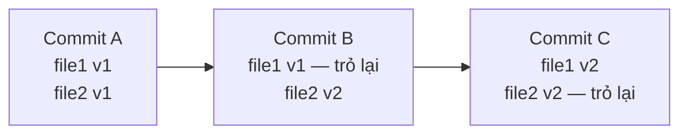
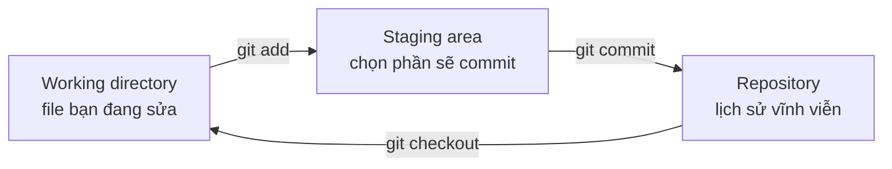

import { SummaryBox, Checklist, FAQSection } from '@site/src/components/SEO';

# 3.2 — 1. Git là gì và tại sao cần

<SummaryBox>
Git không phải "thư mục có nút undo". Nó là một **đồ thị các ảnh chụp bất biến**: mỗi commit chụp lại toàn bộ cây thư mục tại một thời điểm, được định danh bằng mã băm SHA-1 của chính nội dung đó, và **không bao giờ thay đổi**. Hai điều quan trọng suy ra từ đây. Thứ nhất, những lệnh trông như "sửa lịch sử" — `commit --amend`, `rebase` — thực ra **tạo commit mới** chứ không sửa cái cũ. Thứ hai, vì commit cũ vẫn còn nằm đó, gần như **mọi sai lầm trong Git đều hoàn tác được** bằng `git reflog`, kể cả khi bạn nghĩ đã mất sạch.
</SummaryBox>

## Mục tiêu bài học

Sau bài này bạn có thể:

- Giải thích vì sao Git lưu ảnh chụp chứ không lưu bản vá, và điều đó thay đổi gì.
- Kể tên ba vùng làm việc và cho biết một thay đổi đang ở vùng nào.
- Mô tả commit là gì về mặt dữ liệu, và vì sao nó bất biến.
- Dùng `git reflog` để lấy lại công việc tưởng đã mất.
- Phân biệt Git với GitHub.

## Nội dung bài học

### 3.2.1 — Vấn đề Git giải quyết

Trước khi có hệ thống quản lý phiên bản, người ta làm thế này:

```
bao-cao.docx
bao-cao-v2.docx
bao-cao-v2-final.docx
bao-cao-v2-final-THAT-SU-CUOI.docx
báo-cáo-v2-final-sửa-theo-sếp.docx
```

Bốn vấn đề không giải quyết được bằng cách đặt tên file:

1. **Không biết cái gì đã đổi** giữa hai phiên bản, và **vì sao**.
2. **Hai người sửa cùng lúc** thì một người mất việc.
3. **Không quay lại được** một trạng thái cụ thể trong quá khứ.
4. **Không thử nghiệm an toàn** — muốn thử một hướng mới phải chép cả thư mục.

Git giải quyết cả bốn, và làm điều đó bằng một mô hình dữ liệu đơn giản đến bất ngờ.

### 3.2.2 — Git lưu ảnh chụp, không lưu bản vá

Nhiều hệ thống cũ (SVN, CVS) lưu **những gì đã thay đổi** giữa các phiên bản. Git làm khác:

> Mỗi commit là một **ảnh chụp toàn bộ cây thư mục** tại thời điểm đó.

Nghe có vẻ tốn chỗ, nhưng không: file nào không đổi thì commit mới chỉ **trỏ tới đúng đối tượng cũ**, không nhân bản.



Hệ quả thực tế: **chuyển sang một commit bất kỳ đều nhanh như nhau**, vì Git chỉ việc lấy ảnh chụp đó ra, không phải dựng lại từ chuỗi bản vá.

### 3.2.3 — Một commit chứa gì

Một commit là một đối tượng nhỏ gồm năm phần:

```
tree      → ảnh chụp cây thư mục
parent    → commit (hoặc các commit) ngay trước nó
author    → ai viết, lúc nào
committer → ai đưa vào lịch sử, lúc nào
message   → mô tả
```

Toàn bộ khối đó được băm bằng SHA-1 ra một mã 40 ký tự — chính là "mã commit" bạn hay thấy.

Điểm then chốt: **mã băm được tính từ nội dung**. Đổi một dấu phẩy trong message, hay đổi commit cha, là ra một mã hoàn toàn khác. Nói cách khác:

> Commit là **bất biến**. Không ai sửa được một commit. Chỉ tạo được commit mới.

Đây là lý do `git commit --amend` và `git rebase` **không** sửa lịch sử — chúng tạo commit mới rồi trỏ nhánh sang đó. Commit cũ vẫn nằm trong kho, chỉ là không còn ai trỏ tới.

Và đó cũng là lý do bài sau nói rằng gần như mọi sai lầm đều cứu được.

### 3.2.4 — Ba vùng làm việc



| Vùng | Là gì | Lệnh đưa vào |
|---|---|---|
| Working directory | Thư mục thật trên đĩa | — |
| Staging area (index) | Bản nháp của commit tiếp theo | `git add` |
| Repository | Lịch sử đã ghi | `git commit` |

**Staging area là thứ khiến Git khác các công cụ khác.** Nó cho phép bạn commit *một phần* những gì đã sửa:

```bash
# Sửa 5 file, nhưng chỉ commit 2 file liên quan tới một việc
git add src/OrderService.cs src/OrderValidator.cs
git commit -m "fix: chặn đơn hàng có tổng tiền âm"

# 3 file còn lại vẫn nằm trong working directory
```

Nhờ vậy mỗi commit kể đúng **một** câu chuyện, thay vì gộp ba việc không liên quan.

Xem trạng thái từng vùng:

```bash
git status              # tổng quan cả ba vùng
git diff                # working directory so với staging
git diff --staged       # staging so với commit cuối
```

### 3.2.5 — Phân tán: mỗi máy có toàn bộ lịch sử

Git là hệ thống **phân tán**. Khi bạn `clone`, bạn không lấy về bản sao làm việc — bạn lấy về **toàn bộ kho**, đủ mọi commit từ đầu.

Ba hệ quả:

1. **Phần lớn thao tác chạy ngoại tuyến.** `log`, `diff`, `commit`, `branch`, chuyển nhánh — không cần mạng.
2. **Chúng cũng nhanh**, vì không có vòng đi mạng nào.
3. **Mỗi bản clone là một bản sao lưu.** Máy chủ trung tâm cháy thì lịch sử vẫn còn trên mọi máy lập trình viên.

### 3.2.6 — Git không phải GitHub

| Git | GitHub |
|---|---|
| Công cụ chạy trên máy bạn | Dịch vụ lưu kho trên mạng |
| Nguồn mở, miễn phí | Sản phẩm thương mại của Microsoft |
| Chạy được mà không cần Internet | Cần Internet |
| Không có pull request | Pull request, issue, Actions |

**Pull request không phải khái niệm của Git.** Nó là tính năng do GitHub tạo ra, sau đó GitLab, Bitbucket làm theo với tên khác (merge request). Git chỉ biết `merge` và `push`.

Biết ranh giới này giúp bạn không bối rối khi chuyển sang GitLab hay Azure DevOps: phần Git giữ nguyên, chỉ lớp bên ngoài đổi.

### 3.2.7 — Rà lại hiểu biết của bạn

<Checklist
  title="Danh sách kiểm tra khái niệm Git"
  items={[
    { text: "Nói được một thay đổi đang nằm ở vùng nào trong ba vùng." },
    { text: "Giải thích được vì sao commit không sửa được, chỉ tạo mới." },
    { text: "Biết git status, git diff và git diff --staged xem gì khác nhau." },
    { text: "Hiểu vì sao clone là lấy về toàn bộ lịch sử, không phải một phiên bản." },
    { text: "Phân biệt được tính năng nào thuộc Git, tính năng nào thuộc GitHub." },
  ]}
/>

## Bài tập áp dụng

#### Bài 1 — Nhìn vào bên trong một commit

Chạy `git cat-file -p HEAD` trong một kho bất kỳ. Đọc các phần của commit. Sau đó chạy `git cat-file -p <mã tree>` để xem cây thư mục.

**Tiêu chí hoàn thành:** bạn giải thích được vì sao commit đầu tiên của kho **thiếu một dòng** so với các commit sau.

<details>
<summary><strong>Gợi ý và lời giải — Bài 1</strong></summary>

**Gợi ý.** `cat-file -p` in ra nội dung **thô** của một đối tượng trong kho Git, đúng như Git lưu nó. Hãy so sánh output của commit đầu tiên với một commit ở giữa lịch sử.

**Lời giải — commit thứ hai trở đi:**

```bash
git cat-file -p HEAD
```

```text
tree e4916ac4507ef42a747100f9341dcb7589b1ffa4
parent ec780ca705ddad72bfff8d01dc8517d4602866fd
author Thu Nghiem <a@b.c> 1790257555 +0000
committer Thu Nghiem <a@b.c> 1790257555 +0000

commit 2
```

**Commit đầu tiên của kho:**

```text
tree bd88182f34c57b12b7e76d399fbab9b12359c91a
author Thu Nghiem <a@b.c> 1790257541 +0000
committer Thu Nghiem <a@b.c> 1790257541 +0000

commit 1
```

**Trả lời câu hỏi của đề:** commit đầu tiên **không có dòng `parent`**, vì nó không có commit nào trước nó. Đây chính là gốc của đồ thị. Một commit gộp thì ngược lại — nó có **hai** dòng `parent`.

**Năm thành phần của một commit:**

| Thành phần | Nghĩa |
|---|---|
| `tree` | Ảnh chụp **toàn bộ** thư mục tại thời điểm commit |
| `parent` | Commit trước đó; vắng mặt ở commit gốc, có hai ở commit gộp |
| `author` | Người viết code, kèm thời điểm |
| `committer` | Người tạo commit — khác `author` khi rebase hoặc cherry-pick |
| message | Phần mô tả sau dòng trống |

**Xem cây thư mục:**

```bash
git cat-file -p e4916ac4507ef42a747100f9341dcb7589b1ffa4
```

```text
100644 blob 1bd073f92aa619bab70244cf38d9c5c169357670	file.txt
```

Mỗi dòng là một mục: quyền truy cập, loại đối tượng, mã băm, tên. Thư mục con hiện ra dưới dạng `tree` và bạn đi tiếp xuống được. Nội dung file thật nằm trong đối tượng `blob`.

**Ba điều rút ra, quan trọng hơn bản thân lệnh:**

1. **Git lưu ảnh chụp, không lưu bản vá.** Mỗi commit trỏ tới một `tree` mô tả **toàn bộ** cây thư mục, chứ không phải danh sách thay đổi. Phần "thay đổi" mà bạn thấy trong `git diff` được **tính ra** khi cần, bằng cách so hai ảnh chụp.

2. **File không đổi thì không tốn thêm chỗ.** Vì mã băm của nội dung không đổi, `tree` mới trỏ tới đúng `blob` cũ. Đây là lý do kho Git nhỏ hơn nhiều so với "một bản sao cho mỗi commit".

3. **Mã băm được tính từ toàn bộ nội dung này.** Đổi một ký tự trong message, hay đổi thời điểm, là mã băm đổi hoàn toàn — bài 2 dưới đây chứng minh điều đó.

</details>

#### Bài 2 — Chứng minh commit là bất biến

Ghi lại `git rev-parse HEAD`. Chạy `git commit --amend -m "message khác"`. Ghi lại mã mới. Giải thích vì sao hai mã khác nhau, rồi dùng `git reflog` tìm lại commit cũ.

**Tiêu chí hoàn thành:** bạn nêu được vì sao `--amend` **không** sửa commit cũ mà tạo ra commit mới.

<details>
<summary><strong>Gợi ý và lời giải — Bài 2</strong></summary>

**Gợi ý.** Mã băm của một commit được tính từ **toàn bộ** nội dung của nó, gồm cả message. Vậy nếu message đổi thì mã băm có thể giữ nguyên được không?

**Lời giải.**

```bash
git rev-parse HEAD
# f16e5c62bc65762cef93bf3e2a6637aa4cd85017

git commit --amend -m "commit 1 sửa message"

git rev-parse HEAD
# ec780ca705ddad72bfff8d01dc8517d4602866fd
```

Hai mã hoàn toàn khác nhau. Đây **không phải** chuyện Git sửa commit rồi đánh số lại — Git đã tạo ra một commit **hoàn toàn mới** và dời nhánh sang trỏ vào nó. Commit cũ vẫn còn nguyên trong kho, chỉ là không còn tên nào trỏ tới.

```bash
git reflog
```

```text
ec780ca HEAD@{0}: commit (amend): commit 1 sửa message
f16e5c6 HEAD@{1}: commit (initial): commit 1
```

Commit cũ `f16e5c6` vẫn ở đó. Quay lại bằng `git reset --hard f16e5c6`.

**Vì sao thiết kế như vậy.** Mã băm được tính từ nội dung, nên nó vừa là **định danh** vừa là **tổng kiểm tra**. Hai hệ quả:

1. **Không thể sửa lịch sử một cách âm thầm.** Sửa bất kỳ thứ gì trong một commit cũ là mã băm của nó đổi, kéo theo mã băm của **mọi commit sau nó** cũng đổi, vì mỗi commit chứa mã băm của cha. Bất kỳ ai có bản sao đều phát hiện ra ngay.
2. **Mọi lệnh "sửa lịch sử" thực chất là tạo mới.** `--amend`, `rebase`, `cherry-pick` đều không sửa commit cũ — chúng tạo commit mới rồi dời con trỏ nhánh.

**Hệ quả thực tế, và đây là lý do bài này quan trọng.** Vì mã băm đổi, mọi lệnh viết lại lịch sử đều gây vấn đề nếu commit đó **đã được chia sẻ**. Người khác đang có commit `f16e5c6`; bạn đẩy lên `ec780ca`; giờ hai bên có hai phiên bản khác nhau của cùng một công việc, và người kia sẽ gặp xung đột khó hiểu.

Đây chính là nội dung của luật vàng ở [bài 3.6](3.5-branching-and-merging.mdx): **viết lại lịch sử thoải mái trên nhánh chưa ai dùng, không bao giờ trên nhánh đã chia sẻ.**

**Một chi tiết về `--amend` ít người để ý.** Nó không chỉ sửa message — nó gộp luôn mọi thứ đang nằm trong staging area vào commit mới. Nên nếu bạn `git add` một file rồi `git commit --amend` với ý định chỉ sửa chữ, file đó cũng lặng lẽ vào theo. Kiểm tra bằng `git show --stat` trước khi đẩy lên.

</details>

#### Bài 3 — Dùng staging area cho đúng

Sửa ba file thuộc **hai** việc khác nhau. Dùng `git add` để tạo hai commit riêng, mỗi commit chỉ chứa phần thuộc về một việc. Kiểm tra bằng `git show --stat`.

**Tiêu chí hoàn thành:** hai commit tách bạch, và bạn nêu được vì sao điều đó có giá trị về sau chứ không phải lúc này.

<details>
<summary><strong>Gợi ý và lời giải — Bài 3</strong></summary>

**Gợi ý.** Staging area tồn tại chính là để trả lời câu hỏi *"lần này tôi commit cái gì"* tách khỏi câu hỏi *"tôi đã sửa những gì"*. Không có nó thì mọi thay đổi trong thư mục buộc phải vào cùng một commit.

**Lời giải.**

```bash
# Đã sửa: Customer.cs, CustomerService.cs (việc A — thêm trường ghi chú)
#         README.md                        (việc B — cập nhật hướng dẫn chạy)

git status --short
#  M Customer.cs
#  M CustomerService.cs
#  M README.md

# Commit việc A
git add Customer.cs CustomerService.cs
git commit -m "feat: add notes field to customer"

# Commit việc B
git add README.md
git commit -m "docs: update project run instructions"
```

Kiểm tra:

```bash
git show --stat HEAD~1   # chỉ 2 file của việc A
git show --stat HEAD     # chỉ README.md
```

**Khi hai việc nằm trong *cùng một file*,** dùng chế độ tương tác theo từng đoạn:

```bash
git add -p Customer.cs
```

Git hiện từng đoạn thay đổi và hỏi. Các phím hay dùng:

| Phím | Nghĩa |
|---|---|
| `y` | Đưa đoạn này vào staging |
| `n` | Bỏ qua đoạn này |
| `s` | Chia đoạn này thành các đoạn nhỏ hơn |
| `e` | Sửa tay chính xác những dòng nào được đưa vào |
| `q` | Thoát |

**Vì sao điều này có giá trị về sau, không phải lúc này.** Lúc commit thì gộp chung nhanh hơn. Cái giá trả sau, ở bốn tình huống:

1. **Khi cần hoàn tác.** `git revert` hoạt động trên **cả commit**. Nếu tính năng mới có lỗi phải gỡ, mà commit đó kèm luôn bản sửa README và một lần đổi tên biến, bạn buộc phải gỡ hết hoặc gỡ tay từng phần.
2. **Khi tìm commit gây lỗi.** `git bisect` chỉ cho biết **commit nào** hỏng. Commit chứa một việc thì bạn biết ngay; commit chứa bốn việc thì vẫn phải tự đi tìm trong đó.
3. **Khi review.** Người review một commit làm một việc sẽ đọc kỹ. Commit 40 file làm sáu việc thường nhận được một lời "ổn rồi" mà không ai thật sự đọc.
4. **Khi đọc lịch sử sau sáu tháng.** `git log --oneline` chỉ có nghĩa khi mỗi dòng mô tả đúng một thay đổi.

**Tiêu chí duy nhất cần nhớ**, và nó tương đương với mọi quy tắc dài dòng khác: *viết được câu mô tả commit mà không cần dùng chữ "và"*. Cần chữ "và" nghĩa là đang gộp hai việc.

</details>

## Tự kiểm tra

<FAQSection
  items={[
    {
      question: "Git lưu ảnh chụp hay lưu bản vá?",
      answer: "Lưu ảnh chụp toàn bộ cây thư mục ở mỗi commit. Nghe tốn chỗ nhưng không, vì file nào không đổi thì commit mới chỉ trỏ tới đúng đối tượng cũ chứ không nhân bản. Nhờ đó chuyển sang một commit bất kỳ đều nhanh như nhau, không phải dựng lại từ chuỗi bản vá như các hệ thống cũ."
    },
    {
      question: "Vì sao nói commit là bất biến?",
      answer: "Vì mã định danh của commit là mã băm SHA-1 tính từ chính nội dung của nó: cây thư mục, commit cha, tác giả, thời gian và message. Đổi bất cứ thứ gì trong đó là ra một mã hoàn toàn khác, tức là một commit khác. Nên không ai sửa được commit, chỉ tạo được commit mới."
    },
    {
      question: "Vậy git commit --amend và git rebase làm gì?",
      answer: "Chúng tạo commit mới rồi trỏ nhánh sang đó, chứ không sửa commit cũ. Commit cũ vẫn nằm trong kho, chỉ là không còn nhánh nào trỏ tới nữa. Đó là lý do gần như mọi sai lầm trong Git đều lấy lại được bằng git reflog."
    },
    {
      question: "Staging area dùng để làm gì?",
      answer: "Để chọn chính xác phần nào trong những gì đã sửa sẽ đi vào commit tiếp theo. Nhờ đó bạn sửa năm file rồi vẫn tạo được một commit chỉ gồm hai file liên quan tới một việc. Mỗi commit kể đúng một câu chuyện thay vì gộp nhiều việc không liên quan."
    },
    {
      question: "Phân tán nghĩa là gì và lợi ích ra sao?",
      answer: "Nghĩa là khi clone, bạn lấy về toàn bộ kho với đủ mọi commit từ đầu, chứ không phải một phiên bản làm việc. Ba lợi ích: phần lớn thao tác chạy được khi không có mạng, chúng nhanh vì không có vòng đi mạng, và mỗi bản clone là một bản sao lưu đầy đủ."
    },
    {
      question: "Git và GitHub khác nhau ở đâu?",
      answer: "Git là công cụ nguồn mở chạy trên máy bạn, quản lý phiên bản, không cần Internet. GitHub là dịch vụ thương mại lưu kho Git trên mạng và thêm các tính năng cộng tác. Pull request không phải khái niệm của Git mà là tính năng GitHub tạo ra; bản thân Git chỉ biết merge và push."
    }
  ]}
/>

## Kết luận

Ba điều đáng nhớ nhất:

1. **Commit là ảnh chụp bất biến, không phải bản vá.** Hiểu điều này là hiểu vì sao Git hành xử như nó hành xử.
2. **Không lệnh nào sửa được commit cũ.** Chúng chỉ tạo commit mới — nên hầu hết sai lầm đều cứu được.
3. **Staging area là nơi bạn biên tập câu chuyện.** Dùng nó để mỗi commit chỉ nói một việc.

## Tham khảo

- [Pro Git book](https://git-scm.com/book/en/v2) — sách chính thức, miễn phí, đọc chương 1–3 trước
- [git-config](https://git-scm.com/docs/git-config) — mọi tuỳ chọn cấu hình
- [git-reflog](https://git-scm.com/docs/git-reflog) — nhật ký mọi lần `HEAD` di chuyển
- [GitHub Pull requests](https://docs.github.com/en/pull-requests) — phần thuộc về GitHub

## Điều hướng

- **Bài trước:** Không có (bài mở đầu module).
- **Bài tiếp theo:** [3.2 — 2. Cài đặt và cấu hình Git](3.2-git-install-config.mdx)
- **Về module:** [Trang mục lục](./)
