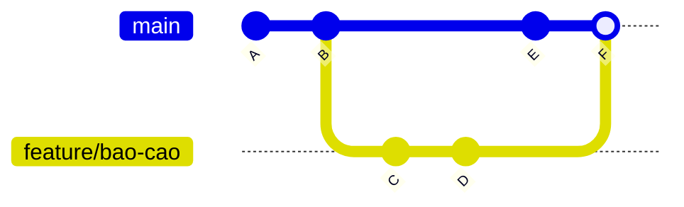
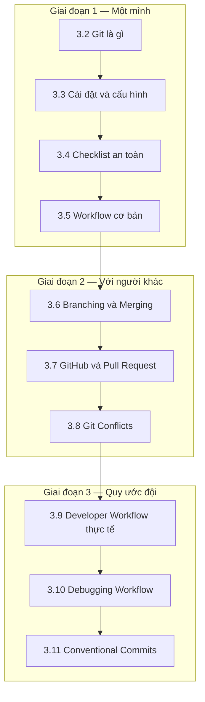

import { SummaryBox, Checklist, FAQSection } from '@site/src/components/SEO';

# 3.1 — Định hướng Module 3: Git và quy trình làm việc

<SummaryBox>
Gần như ai cũng "biết Git" theo nghĩa thuộc bốn lệnh `add`, `commit`, `push`, `pull`. Và gần như ai cũng có một lần hoảng loạn khi Git báo `CONFLICT`, hoặc khi lỡ tay `git reset --hard` mất một ngày làm việc. Khác biệt giữa hai trạng thái đó không nằm ở số lệnh thuộc, mà ở chỗ có hay không **mô hình về đồ thị commit**. Module này dạy mô hình trước, lệnh sau — vì khi hình dung được kho chứa là một đồ thị có hướng, mọi lệnh Git trở thành thao tác di chuyển con trỏ trên đồ thị đó, và bạn thôi sợ.
</SummaryBox>

## Module này giải quyết vấn đề gì

Ba tình huống lặp lại ở mọi đội có người mới:

- **Sợ nhánh.** Mọi người làm thẳng trên `main` vì tạo nhánh xong không biết cách đưa về.
- **Sợ conflict.** Gặp `<<<<<<< HEAD` thì xoá hết đi làm lại từ đầu, kèm theo mất phần việc của người khác.
- **Lịch sử vô dụng.** `git log` toàn `update`, `fix`, `final`, `final2`. Khi cần tìm commit nào gây lỗi thì không có manh mối nào.

Cả ba đều là triệu chứng của cùng một nguyên nhân: Git bị học như **một danh sách lệnh cần thuộc** thay vì **một cấu trúc dữ liệu cần hiểu**. Git lưu lịch sử dưới dạng đồ thị có hướng, mỗi commit là một ảnh chụp trỏ về commit cha, và nhánh chỉ là một con trỏ có tên vào một commit:



Nhìn hình này, ba câu hỏi gây hoang mang nhất tự có lời đáp. *Nhánh là gì?* Một cái tên gắn vào một nút. *Merge là gì?* Tạo một nút mới có hai cha. *Vì sao có conflict?* Vì hai nhánh sửa cùng một dòng kể từ điểm rẽ, và Git không có cơ sở để chọn hộ bạn.

## Bạn cần gì trước khi bắt đầu

<Checklist
  title="Điều kiện đầu vào"
  items={[
    { text: "Có một tài khoản GitHub và đã đăng nhập được." },
    { text: <>{"Cài được Git. Kiểm tra bằng "}<code>git --version</code>{"."}</> },
    { text: <>{"Dùng được terminal ở mức cơ bản: "}<code>cd</code>{", "}<code>ls</code>{" (hoặc "}<code>dir</code>{"), "}<code>mkdir</code>{"."}</> },
    { text: "Có một thư mục code bất kỳ để thực hành — dùng lại project console từ Module 1 là hợp lý nhất." },
    { text: "Dành được khoảng 10–12 giờ. Đây là module thực hành nặng, phải gõ lệnh thật." },
  ]}
/>

Bài [3.4 — Checklist an toàn khi làm Git](3.4-git-safety-checklist.mdx) nên đọc **sớm**, ngay sau 3.3, kể cả khi bạn chưa hiểu hết. Nó là tấm lưới an toàn cho phần còn lại của module.

## Bản đồ module

Mười bài chia thành ba giai đoạn: làm việc một mình, làm việc với người khác, rồi quy ước của đội.



| Bài | Câu hỏi bài này trả lời | Thời lượng |
|---|---|---|
| [3.2 — Git là gì và tại sao cần](3.2-git-intro-and-motivation.mdx) | Git lưu gì, và vì sao nó khác một thư mục sao lưu? | 60 phút |
| [3.3 — Cài đặt và cấu hình](3.3-git-install-config.mdx) | Cấu hình tối thiểu nào phải đặt trước commit đầu tiên? | 45 phút |
| [3.4 — Checklist an toàn](3.4-git-safety-checklist.mdx) | Những lệnh nào có thể làm mất việc, và cứu lại bằng cách nào? | 60 phút |
| [3.5 — Workflow cơ bản](3.5-workflow-co-ban.mdx) | Vòng lặp hằng ngày gồm những bước nào? | 75 phút |
| [3.6 — Branching và Merging](3.6-branching-and-merging.mdx) | Nhánh thực chất là gì, merge khác rebase ở đâu? | 90 phút |
| [3.7 — GitHub và Pull Request](3.7-github-and-pull-request.mdx) | Code đi từ máy bạn tới nhánh chính qua quy trình nào? | 75 phút |
| [3.8 — Git Conflicts](3.8-git-conflicts.mdx) | Conflict sinh ra thế nào và giải quyết theo thứ tự nào? | 90 phút |
| [3.9 — Developer Workflow thực tế](3.9-real-world-developer-workflow.mdx) | Git Flow hay trunk-based, và hotfix làm sao cho đúng? | 75 phút |
| [3.10 — Debugging Workflow](3.10-debugging-workflow.mdx) | Tìm commit gây lỗi bằng cách nào thay vì đoán? | 75 phút |
| [3.11 — Conventional Commits](3.11-conventional-commits.mdx) | Thông điệp commit thế nào để sinh được changelog tự động? | 60 phút |

Phần bổ trợ: [3.12 — Mở rộng và đào sâu](3.12-advanced-notes.mdx), [3.13 — Mini case study](3.13-mini-case-study.mdx), [3.14 — Ví dụ thực tế nhanh](3.14-quick-real-world-example.mdx), [3.15 — Review and Assessment](3.15-review-and-assessment.mdx).

## Kết quả đầu ra đo được

| Năng lực | Cách tự kiểm chứng |
|---|---|
| Đọc được đồ thị commit | Chạy `git log --graph --oneline --all` và giải thích từng nhánh đang trỏ vào đâu |
| Tạo và hoàn tất một nhánh | Đi trọn vòng từ tạo nhánh tới merge và xoá nhánh mà không tra tài liệu |
| Giải conflict có chủ đích | Cố ý tạo conflict rồi giải, giữ được thay đổi của **cả hai** phía |
| Khôi phục việc tưởng đã mất | Dùng `git reflog` lấy lại một commit sau khi `reset --hard` |
| Tìm commit gây lỗi | Dùng `git bisect` định vị commit hỏng trong lịch sử 20 commit |
| Viết commit message dùng được | Viết 10 commit theo Conventional Commits, sinh được changelog từ chúng |
| Chọn mô hình nhánh | Nêu lý do chọn trunk-based hay Git Flow cho một đội cụ thể |

## Sản phẩm bàn giao của module

Một **kho GitHub công khai** chứa project console từ Module 1, nhưng có lịch sử phát triển thật:

```text
- Ít nhất 15 commit theo chuẩn Conventional Commits
- Ít nhất 3 nhánh tính năng đã merge qua Pull Request
- Một Pull Request có ít nhất một nhận xét review do chính bạn viết
- Một conflict đã được tạo có chủ ý và giải quyết, ghi lại trong README
- File .gitignore đúng cho project .NET
- README mô tả cách chạy project
```

Kho này có giá trị vượt ngoài bài học: nó là thứ đầu tiên nhà tuyển dụng mở ra xem. Một kho có lịch sử sạch nói nhiều hơn một dòng "thành thạo Git" trong CV.

## Lộ trình học gợi ý

| Ngày | Nội dung | Việc phải xong |
|---|---|---|
| 1 | 3.2 + 3.3 + 3.4 | Cấu hình xong Git, đọc hết checklist an toàn |
| 2 | 3.5 | Commit đầu tiên, đẩy lên GitHub |
| 3 | 3.6 | Tạo nhánh, merge, đọc được `git log --graph` |
| 4 | 3.7 | Mở và merge Pull Request đầu tiên |
| 5 | 3.8 | Tự tạo và giải một conflict |
| 6 | 3.9 + 3.10 | Dùng được `git bisect` trên lịch sử tự tạo |
| 7 | 3.11 → 3.15 | Chuẩn hoá commit message, làm bài tự chấm 3.15 |

## Ba sai lầm thường gặp khi học module này

**Một — học lệnh mà không nhìn đồ thị.** Cách chữa đơn giản: sau **mỗi** lệnh làm thay đổi lịch sử, chạy `git log --graph --oneline --all` và nhìn xem hình vẽ đổi thế nào. Vài chục lần như vậy là mô hình tự hình thành, nhanh hơn mọi bài giải thích.

**Hai — sợ thử vì sợ hỏng.** Đây là nỗi sợ không có cơ sở, và nó cản trở việc học nhiều nhất. Git giữ lại gần như mọi thứ trong `reflog` ít nhất 30 ngày, kể cả commit đã bị `reset --hard`. Hãy tạo một kho nháp và cố ý phá nó: reset lung tung, xoá nhánh, rebase sai. Học cách khôi phục trong kho nháp dễ chịu hơn nhiều so với học lúc đang hoảng trên kho thật.

**Ba — coi commit message là thủ tục.** Message là thứ duy nhất còn lại sau sáu tháng, khi không ai nhớ vì sao dòng code đó tồn tại. Một message tốt trả lời **vì sao**, không phải **cái gì** — phần "cái gì" đã nằm trong diff rồi. So sánh `fix bug` với `fix: chặn đơn hàng có tổng tiền âm khi áp mã giảm giá vượt giá trị đơn`: câu sau tiết kiệm nửa giờ điều tra cho người đọc nó sau này.

## Bài tập khởi động

Làm trước khi vào 3.2. Bài này cố ý **làm hỏng rồi cứu**, để bạn thấy Git an toàn hơn bạn nghĩ.

> **Đề bài.** Chạy đúng các lệnh sau trong một thư mục trống:
>
> ```bash
> mkdir git-thu && cd git-thu && git init
> echo "dong 1" > file.txt && git add . && git commit -m "commit 1"
> echo "dong 2" >> file.txt && git commit -am "commit 2"
> echo "dong 3" >> file.txt && git commit -am "commit 3"
> git reset --hard HEAD~2
> cat file.txt
> ```
>
> Bạn vừa xoá hai commit. `file.txt` giờ chỉ còn một dòng.
>
> **Nhiệm vụ:** lấy lại cả ba dòng, **không** gõ lại nội dung bằng tay.

<details>
<summary><strong>Gợi ý — nếu bạn nghĩ hai commit đó đã mất hẳn</strong></summary>

Chúng chưa mất. `git reset --hard` chỉ di chuyển con trỏ nhánh về commit cũ hơn; hai commit kia vẫn nằm trong kho, chỉ là không còn tên nào trỏ tới chúng.

Git ghi nhật ký **mọi lần `HEAD` di chuyển** vào một nơi riêng, tồn tại độc lập với lịch sử nhánh. Hãy tìm lệnh có tên gợi ý đúng điều đó — nó gồm chữ `log` và một tiền tố nghĩa là "tham chiếu".

Khi tìm được danh sách đó, bạn sẽ thấy mã băm của commit 3. Việc còn lại là trỏ nhánh hiện tại về đúng mã băm ấy.

</details>

<details>
<summary><strong>Hướng dẫn giải — đọc sau khi đã tự làm</strong></summary>

```bash
git reflog
```

Kết quả có dạng:

```text
a1b2c3d (HEAD -> main) HEAD@{0}: reset: moving to HEAD~2
e4f5g6h HEAD@{1}: commit: commit 3
i7j8k9l HEAD@{2}: commit: commit 2
a1b2c3d HEAD@{3}: commit: commit 1
```

Khôi phục bằng một trong hai cách:

```bash
git reset --hard e4f5g6h      # dùng mã băm của commit 3
# hoặc
git reset --hard HEAD@{1}     # dùng ký hiệu vị trí trong reflog
```

Kiểm tra lại bằng `cat file.txt` — cả ba dòng đã trở về.

**Bốn điều rút ra, quan trọng hơn bản thân lệnh:**

1. **Commit hầu như không bao giờ mất.** `reset --hard` chỉ di chuyển con trỏ nhánh. Commit vẫn nằm trong kho cho tới khi trình dọn rác của Git xoá nó — mặc định sau khoảng 30 ngày và chỉ với commit không còn tham chiếu nào.
2. **`reflog` là nhật ký riêng của máy bạn.** Nó không được đẩy lên remote và không chia sẻ với ai. Vì vậy nó cứu được bạn, nhưng không cứu được đồng nghiệp.
3. **Thứ thật sự mất được là thay đổi *chưa* commit.** `reset --hard` xoá sạch những sửa đổi chưa đưa vào commit, và `reflog` không giúp gì. Bài học thực dụng: commit sớm và thường xuyên, kể cả commit dang dở — lịch sử luôn dọn lại được về sau.
4. **Hai cách viết đều đúng.** Mã băm chỉ đích danh một commit; `HEAD@{1}` chỉ vị trí trước đó của `HEAD`. Dùng mã băm an toàn hơn khi bạn đã chạy thêm nhiều lệnh, vì chỉ số trong reflog dịch chuyển theo mỗi thao tác.

Làm xong bài này, bạn có thể thử nghiệm thoải mái trong phần còn lại của module mà không sợ mất việc.

</details>

## Tự kiểm tra đầu vào

<FAQSection
  items={[
    {
      question: "Tôi dùng giao diện đồ hoạ như GitHub Desktop hay tính năng Git trong VS Code, có cần học dòng lệnh không?",
      answer: "Nên học, và lý do không phải là dòng lệnh cao cấp hơn. Giao diện đồ hoạ che bớt mô hình bên dưới, nên khi gặp tình huống nó không có nút xử lý — rebase dở dang, conflict trong lúc cherry-pick, cần đọc reflog — bạn sẽ không biết làm gì. Ngoài ra mọi tài liệu, câu trả lời trên diễn đàn và kịch bản CI đều viết bằng dòng lệnh. Cách dùng hợp lý là học bằng dòng lệnh để hiểu mô hình, rồi dùng giao diện hằng ngày cho nhanh."
    },
    {
      question: "Merge và rebase khác nhau thế nào, nên dùng cái nào?",
      answer: "Merge tạo một commit mới có hai cha, giữ nguyên lịch sử thật kể cả khi nó rối. Rebase viết lại các commit của bạn lên trên đầu nhánh đích, cho lịch sử thẳng và dễ đọc nhưng thay đổi mã băm của commit. Quy tắc an toàn: rebase thoải mái trên nhánh cá nhân chưa ai dùng, và không bao giờ rebase nhánh đã chia sẻ, vì mã băm đổi sẽ làm hỏng bản sao của người khác. Bài 3.6 đi vào chi tiết."
    },
    {
      question: "Vì sao không nên làm việc trực tiếp trên nhánh main?",
      answer: "Vì main nên luôn ở trạng thái deploy được. Làm trực tiếp trên main nghĩa là mọi trạng thái dang dở đều nằm trên nhánh mà production lấy code, nên không thể phát hành bản vá khẩn cấp mà không kéo theo phần việc chưa xong. Ngoài ra bạn mất luôn cơ chế review, vì không có gì để mở Pull Request. Nhánh tính năng ngắn ngày giải quyết cả hai vấn đề mà gần như không tốn chi phí."
    },
    {
      question: "Conflict có phải dấu hiệu ai đó đã làm sai không?",
      answer: "Không. Conflict chỉ có nghĩa là hai nhánh cùng sửa một vùng code kể từ điểm rẽ, và Git không có cơ sở để chọn hộ bạn phiên bản nào đúng. Đó là tình huống bình thường trong mọi đội có nhiều người. Điều đáng lo không phải conflict mà là conflict lớn, và nguyên nhân gần như luôn là nhánh sống quá lâu. Đồng bộ với main hằng ngày giúp conflict nhỏ lại tới mức giải trong vài phút."
    },
    {
      question: "Commit bao lâu một lần là hợp lý?",
      answer: "Mỗi khi hoàn thành một thay đổi có nghĩa và code vẫn chạy được, thường là vài lần mỗi giờ. Tiêu chí thực dụng: commit khi bạn viết được một câu mô tả nó mà không cần dùng chữ 'và'. Cần chữ 'và' nghĩa là commit đang gộp hai việc, nên tách ra. Commit nhỏ giúp revert chính xác khi có sự cố và giúp git bisect ở bài 3.10 định vị lỗi nhanh hơn nhiều."
    },
    {
      question: "Conventional Commits có phải thủ tục rườm rà không?",
      answer: "Nó là thủ tục chỉ khi không ai dùng tới kết quả. Khi có dùng, tiền lệ rất cụ thể: công cụ tự sinh changelog từ tiền tố feat và fix, tự quyết định tăng số phiên bản, và cho phép lọc lịch sử theo loại thay đổi. Chi phí là khoảng năm giây mỗi commit để thêm một tiền tố. Bài 3.11 sẽ dựng một pipeline sinh changelog tự động để bạn thấy lợi ích cụ thể thay vì phải tin lời."
    }
  ]}
/>

## Kết luận

1. **Hiểu đồ thị trước, thuộc lệnh sau.** Sau mỗi lệnh đổi lịch sử, chạy `git log --graph --oneline --all` để nhìn kết quả.
2. **Tạo một kho nháp và cố ý phá nó.** `reflog` cứu được gần như mọi sai lầm, nhưng chỉ khi bạn đã tập dùng nó lúc bình tĩnh.
3. **Commit message viết cho người đọc sau sáu tháng.** Trả lời "vì sao", vì "cái gì" đã nằm trong diff.

## Tham khảo

- [Pro Git book](https://git-scm.com/book/en/v2) — sách gốc, miễn phí, chương 3 về nhánh là phần đáng đọc nhất
- [Git reference documentation](https://git-scm.com/docs) — tra cứu chính thức từng lệnh
- [GitHub Skills](https://skills.github.com/) — bài thực hành tương tác trên kho thật
- [Conventional Commits 1.0.0](https://www.conventionalcommits.org/en/v1.0.0/) — đặc tả chuẩn commit message

## Điều hướng

- **Hub lộ trình:** [00. Lộ trình From Zero → Senior .NET (Backend-first)](../../roadmap-dotnet-backend-zero-to-senior.mdx)
- **Bài trước:** Không có (bài mở đầu module).
- **Bài tiếp theo:** [3.2 — Git là gì và tại sao cần](3.2-git-intro-and-motivation.mdx)
- **Module trước:** [Module 2 — Computer Science Basics](../module-02-computer-science-basics/)
- **Module tiếp theo:** [Module 4 — C# Core](../../stage-02-csharp-professional/module-04-csharp-core/)
- **Về module:** [Trang mục lục](./)
