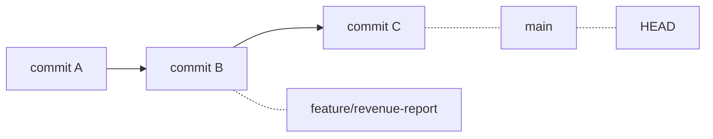

import { SummaryBox, Checklist, FAQSection } from '@site/src/components/SEO';

# 3.6 — 4. Branching và Merging

<SummaryBox>
Một nhánh trong Git là **một file văn bản chứa đúng một mã commit** — khoảng 41 byte. Không phải bản sao thư mục, không phải thư mục riêng. Biết điều này là hiểu ngay vì sao tạo nhánh **tức thì và gần như miễn phí**, và vì sao Git khuyến khích tạo nhánh cho mọi việc. Phần còn lại của bài là hai cách hợp nhánh: **merge** giữ nguyên lịch sử thật và tạo một commit hợp nhất, **rebase** viết lại các commit của bạn lên trên nhánh đích cho lịch sử thẳng. Cả hai đều đúng, nhưng có một luật không được phá: **đừng rebase nhánh mà người khác đang dùng**.
</SummaryBox>

## Mục tiêu bài học

Sau bài này bạn có thể:

- Giải thích một nhánh là gì về mặt dữ liệu, và vì sao tạo nhánh rẻ.
- Phân biệt fast-forward merge với merge có commit hợp nhất.
- Chọn giữa merge và rebase theo hoàn cảnh, và nêu luật vàng của rebase.
- Đọc `git log --graph` để hiểu hình dạng lịch sử.
- Dọn nhánh đã merge mà không xoá nhầm nhánh còn việc.

## Nội dung bài học

### 3.6.1 — Nhánh chỉ là một con trỏ

```bash
cat .git/refs/heads/main
# a1b2c3d4e5f6...    ← đúng một dòng, một mã commit
```

Đó là toàn bộ một nhánh. Tạo nhánh mới nghĩa là ghi thêm một file như vậy:

```bash
git branch feature/revenue-report      # tạo con trỏ mới tại commit hiện tại
```

Không có gì được sao chép. Đây là khác biệt lớn so với SVN, nơi tạo nhánh là chép cả cây thư mục — và cũng là lý do trong SVN người ta ngại tạo nhánh, còn trong Git thì tạo thoải mái.

`HEAD` là con trỏ chỉ vào nhánh bạn đang đứng:



Khi bạn commit, Git tạo commit mới rồi **dịch con trỏ nhánh** sang đó. Chuyển nhánh là dịch `HEAD` và cập nhật thư mục làm việc cho khớp.

### 3.6.2 — Đặt tên nhánh

```
feature/revenue-report         # tính năng mới
fix/negative-order-total       # sửa lỗi
hotfix/payment-failure         # sửa khẩn cấp trên production
refactor/split-order-service   # tái cấu trúc
chore/upgrade-efcore-9         # việc vặt, phụ thuộc
```

Quy ước: `<loại>/<mô-tả-ngắn-bằng-gạch-nối>`, viết bằng **tiếng Anh**, không dấu, không khoảng trắng.

Nếu đội dùng công cụ quản lý việc, gắn thêm mã issue: `feature/CRM-142-revenue-report`. Nhờ đó nhìn tên nhánh là biết nó thuộc yêu cầu nào.

### 3.6.3 — Merge: hai hình dạng

**Fast-forward** — khi nhánh đích **không có commit mới** nào kể từ lúc bạn tách ra:

```
Trước:  A --- B --- C (main)
                     \
                      D --- E (feature)

Sau:    A --- B --- C --- D --- E (main, feature)
```

Git chỉ việc **dịch con trỏ `main` lên phía trước**. Không có commit hợp nhất nào được tạo.

**Merge commit** — khi cả hai nhánh đều có commit mới:

```
Trước:  A --- B --- C --- F (main)
                     \
                      D --- E (feature)

Sau:    A --- B --- C --- F --- M (main)
                     \         /
                      D --- E
```

`M` là **merge commit**: commit duy nhất có **hai cha**. Nó ghi lại sự thật rằng hai dòng công việc đã gặp nhau.

```bash
git checkout main
git merge feature/revenue-report              # tự chọn kiểu phù hợp
git merge --no-ff feature/revenue-report      # luôn tạo merge commit, kể cả khi ff được
```

`--no-ff` đáng dùng khi bạn muốn lịch sử **giữ lại dấu vết của từng tính năng** — nhìn đồ thị là thấy rõ nhánh nào gom vào lúc nào. Nhiều đội đặt nó làm mặc định cho nhánh tính năng.

### 3.6.4 — Rebase: viết lại để lịch sử thẳng

```
Trước:  A --- B --- C --- F (main)
                     \
                      D --- E (feature)

Sau:    A --- B --- C --- F (main)
                           \
                            D' --- E' (feature)
```

Chú ý `D'` và `E'` có dấu phẩy: chúng là **commit mới**, mã băm khác, dù nội dung thay đổi giống hệt. Đúng như [bài 3.2](3.1-git-intro-and-motivation.mdx) đã nói — commit không sửa được, chỉ tạo mới.

```bash
git checkout feature/revenue-report
git rebase main
```

| | Merge | Rebase |
|---|---|---|
| Lịch sử | Giữ nguyên sự thật, có nhánh | Thẳng, dễ đọc |
| Mã commit | Không đổi | **Đổi hết** |
| An toàn trên nhánh chung | Có | **Không** |
| Xung đột | Giải một lần | Có thể phải giải ở **từng commit** |

### 3.6.5 — Luật vàng của rebase

> **Đừng rebase commit mà người khác đã có.**

Lý do đã nằm sẵn trong mô hình dữ liệu: rebase tạo commit **mới** với mã băm mới. Đồng nghiệp đang giữ commit cũ. Khi họ `pull`, Git thấy hai dãy commit khác nhau cùng nội dung và không có cách nào biết chúng là một — nên họ rơi vào tình trạng phân kỳ, và nếu merge thì mọi thay đổi xuất hiện hai lần.

Quy tắc dùng được ngay:

- **Nhánh riêng của bạn, chưa ai pull** → rebase thoải mái, cho lịch sử sạch.
- **Nhánh chung (`main`, `develop`)** → chỉ merge.
- **Nhánh của bạn nhưng đã push và có người xem** → hỏi trước, hoặc merge.

Một cách dùng rebase rất có ích: dọn nhánh riêng **trước khi** mở pull request.

```bash
git rebase -i main      # interactive: gộp, sửa message, bỏ commit rác
```

`rebase -i` cho phép `squash` năm commit kiểu "fix", "fix lại", "fix nữa" thành một commit sạch trước khi trình cho người khác đọc.

### 3.6.6 — Dọn nhánh

```bash
# Xem nhánh nào ĐÃ merge vào nhánh hiện tại
git branch --merged

# Xoá nhánh đã merge (an toàn: Git từ chối nếu chưa merge)
git branch -d feature/revenue-report

# Xoá cưỡng bức, kể cả chưa merge — CẨN THẬN
git branch -D feature/revenue-report

# Xoá nhánh trên remote
git push origin --delete feature/revenue-report

# Dọn các nhánh theo dõi đã bị xoá trên remote
git fetch --prune
```

Khác biệt giữa `-d` và `-D` là một lưới an toàn thật sự: `-d` **từ chối** xoá nhánh chưa merge. Chỉ dùng `-D` khi bạn cố ý vứt bỏ công việc trên nhánh đó — và kể cả lúc ấy, [`reflog`](3.3-git-safety-checklist.mdx) vẫn cứu được trong 90 ngày.

### 3.6.7 — Rà lại cách bạn dùng nhánh

<Checklist
  title="Danh sách rà soát nhánh"
  items={[
    { text: "Mỗi tính năng và mỗi lần sửa lỗi đều có nhánh riêng, không commit thẳng vào main." },
    { text: "Tên nhánh theo quy ước loại/mô-tả, không dấu, không khoảng trắng." },
    { text: "Chưa bao giờ rebase một nhánh mà người khác đã pull." },
    { text: "Dọn nhánh riêng bằng rebase -i trước khi mở pull request." },
    { text: "Dùng git branch -d chứ không phải -D, trừ khi cố ý vứt bỏ." },
    { text: "Đã bật fetch.prune để nhánh theo dõi cục bộ không tồn đọng." },
    { text: "Nhánh tính năng sống ngắn — gộp trong vài ngày, không vài tuần." },
  ]}
/>

## Bài tập áp dụng

#### Bài 1 — Nhìn thấy con trỏ

Tạo một nhánh mới, rồi `cat .git/refs/heads/<tên>`. Commit một lần rồi xem lại file đó. Giải thích thứ vừa thay đổi.

**Tiêu chí hoàn thành:** bạn nói được vì sao tạo một nhánh trong kho có hàng nghìn commit lại **tức thời**.

<details>
<summary><strong>Gợi ý và lời giải — Bài 1</strong></summary>

**Gợi ý.** Mở file bằng `cat` và đếm xem nó có bao nhiêu ký tự. Con số đó nói lên tất cả.

**Lời giải — output thật:**

```bash
git init -q -b main
echo base > f.txt && git add . && git commit -q -m "base"

cat .git/refs/heads/main
# e5a1eda6581024bb51d25c023a4c80ee43812377
```

Toàn bộ nội dung của một nhánh là **một mã băm 40 ký tự**. Không có gì khác.

```bash
git checkout -b feature-a
cat .git/refs/heads/feature-a
# e5a1eda6581024bb51d25c023a4c80ee43812377    <- Y HỆT main
```

Nhánh mới trỏ vào **đúng commit** mà `main` đang trỏ. Tạo nhánh chỉ là ghi ra một file 41 byte.

```bash
echo a >> f.txt && git commit -q -am "commit on branch a"

cat .git/refs/heads/feature-a
# 14763e06db502f2ef2fae9077e4c73aa3ccb48fd    <- đã tiến lên
cat .git/refs/heads/main
# e5a1eda6581024bb51d25c023a4c80ee43812377    <- đứng yên
```

**Trả lời câu hỏi của đề.** Tạo nhánh tức thời vì Git **không sao chép gì cả**. Nó chỉ ghi một file chứa mã băm. Kho có ba commit hay ba trăm nghìn commit thì thao tác vẫn như nhau — đây là khác biệt lớn so với các hệ thống quản lý phiên bản đời trước, nơi tạo nhánh nghĩa là sao chép cả cây thư mục.

**Ba hệ quả thực tế:**

1. **Tạo nhánh cho mọi việc, kể cả việc nhỏ.** Chi phí bằng không, nên không có lý do gì để tiếc.
2. **Xoá nhánh cũng không xoá commit.** `git branch -d` chỉ xoá cái tên; commit vẫn còn và `reflog` vẫn tìm lại được.
3. **`HEAD` là con trỏ tới con trỏ.** Xem bằng `cat .git/HEAD`:

   ```text
   ref: refs/heads/feature-a
   ```

   Nó không chứa mã băm mà chứa **tên nhánh** bạn đang đứng. Đó là lý do khi bạn commit, nhánh hiện tại tự động tiến lên.

**Trạng thái `HEAD` tách rời.** Khi bạn `git checkout <mã băm>` thay vì tên nhánh, `.git/HEAD` chứa thẳng mã băm thay vì `ref: ...`. Commit tạo ra lúc đó **không thuộc nhánh nào**, nên chuyển sang nhánh khác là chúng trở thành mồ côi. Git cảnh báo rất rõ, và `reflog` vẫn cứu được — nhưng biết cơ chế thì bạn hiểu ngay cảnh báo đó nói gì.

**Xem nhanh mọi con trỏ:**

```bash
git show-ref --heads
ls .git/refs/heads/          # nhánh cục bộ
ls .git/refs/remotes/origin/ # nhánh theo dõi từ xa
cat .git/packed-refs         # nhánh cũ được gom lại để tiết kiệm inode
```

</details>

#### Bài 2 — So sánh hai hình dạng merge

Tạo hai nhánh cùng tách từ `main`, mỗi nhánh một commit. Merge nhánh thứ nhất (fast-forward), rồi merge nhánh thứ hai (tạo merge commit). Xem `git log --oneline --graph --all` và mô tả khác biệt.

**Tiêu chí hoàn thành:** bạn đếm được **số commit cha** của `HEAD` sau mỗi lần merge.

<details>
<summary><strong>Gợi ý và lời giải — Bài 2</strong></summary>

**Gợi ý.** Đếm số dòng `parent` trong nội dung thô của commit:

```bash
git cat-file -p HEAD | grep -c '^parent'
```

**Lời giải — kịch bản và kết quả thật:**

```bash
git checkout main && git merge feature-a
# Fast-forward
git cat-file -p HEAD | grep -c '^parent'
# 1
```

Không có commit mới nào được tạo. `main` chỉ **trượt tới** vị trí của `feature-a`, vì `main` chưa có commit nào mới kể từ điểm rẽ. Đây là *fast-forward*.

```bash
git checkout -b feature-b HEAD~1     # tách từ trước đó, nên hai nhánh phân kỳ
echo b > g.txt && git add . && git commit -q -m "commit on branch b"
git checkout main && git merge --no-ff feature-b -m "merge branch b"

git cat-file -p HEAD | grep -c '^parent'
# 2
```

Lần này Git tạo một commit mới có **hai cha**.

**Đồ thị kết quả:**

```text
*   69111ba merge branch b
|\
| * 6f5843d commit on branch b
* | 14763e0 commit on branch a
|/
* e5a1eda base
```

**Bảng so sánh:**

| | Fast-forward | Merge commit |
|---|---|---|
| Xảy ra khi | Nhánh đích chưa có commit mới | Hai nhánh đã phân kỳ |
| Commit mới | Không | Có, với hai cha |
| Lịch sử | Một đường thẳng | Có nhánh rẽ và hợp |
| Còn dấu vết nhánh | Không | Có |
| Ép bằng cờ | `--ff-only` | `--no-ff` |

**Chọn cái nào — và đây là một quyết định có thật của mỗi đội:**

- **`--no-ff` luôn luôn.** Mọi lần gộp đều để lại dấu vết, nên nhìn lịch sử là biết tính năng nào được gộp lúc nào, và `git revert -m 1 <merge commit>` gỡ được cả tính năng bằng một lệnh. Đổi lại đồ thị rậm rạp hơn.
- **`--ff-only` luôn luôn.** Lịch sử là một đường thẳng, rất dễ đọc và `git bisect` chạy gọn. Đổi lại phải rebase trước mỗi lần gộp, và mất thông tin về ranh giới tính năng.
- **Squash merge.** Gộp toàn bộ nhánh thành **một** commit trên `main`. Lịch sử `main` cực sạch, mỗi dòng là một tính năng. Đổi lại mất hoàn toàn các commit chi tiết bên trong, nên `git bisect` chỉ định vị được tới mức cả tính năng.

**Khuyến nghị thực dụng.** Với nhánh tính năng ngắn ngày theo mô hình trunk-based ở [bài 3.9](3.8-real-world-developer-workflow.mdx), **squash merge** thường là lựa chọn tốt nhất: nhánh vốn chỉ sống một ngày nên các commit bên trong không có nhiều giá trị lâu dài, còn `main` thì sạch sẽ và mỗi commit tương ứng đúng một pull request.

**Một chi tiết về revert một merge commit.** Vì nó có hai cha, Git không biết bạn muốn giữ nhánh nào, nên phải chỉ rõ:

```bash
git revert -m 1 <mã merge commit>    # 1 = giữ nhánh chính, gỡ nhánh được gộp vào
```

Quên cờ `-m` là nhận thông báo lỗi `commit is a merge but no -m option was given`.

</details>

#### Bài 3 — Dọn lịch sử trước khi trình

Tạo một nhánh với năm commit lộn xộn kiểu `wip`, `fix`, `fix nữa`. Dùng `git rebase -i main` gộp thành hai commit có message tử tế. So sánh `git log` trước và sau.

**Tiêu chí hoàn thành:** hai commit cuối cùng đều thoả tiêu chí ở [bài 3.5](3.4-workflow-co-ban.mdx) — `revert` riêng từng cái mà hệ thống vẫn chạy.

<details>
<summary><strong>Gợi ý và lời giải — Bài 3</strong></summary>

**Gợi ý.** `git rebase -i` mở một trình soạn thảo với danh sách commit và một từ khoá trước mỗi dòng. Bạn **sửa các từ khoá đó** rồi lưu lại; Git thực hiện theo kịch bản bạn vừa viết.

**Lời giải — trạng thái trước:**

```bash
git log --oneline main..HEAD
# 5e5e5e5 fix again
# 4d4d4d4 fix
# 3c3c3c3 add test
# 2b2b2b2 wip
# 1a1a1a1 add report endpoint
```

```bash
git rebase -i main
```

Trình soạn thảo hiện ra, commit cũ nhất ở **trên cùng** — ngược với `git log`:

```text
pick 1a1a1a1 add report endpoint
pick 2b2b2b2 wip
pick 3c3c3c3 add test
pick 4d4d4d4 fix
pick 5e5e5e5 fix again
```

Sửa thành:

```text
pick   1a1a1a1 add report endpoint
fixup  2b2b2b2 wip
fixup  4d4d4d4 fix
fixup  5e5e5e5 fix again
reword 3c3c3c3 add test
```

Lưu và đóng. Git dừng lại ở bước `reword` để bạn sửa message.

**Các từ khoá hay dùng:**

| Từ khoá | Tác dụng |
|---|---|
| `pick` | Giữ nguyên |
| `reword` | Giữ thay đổi, sửa message |
| `squash` | Gộp vào commit phía trên, **ghép cả hai message** |
| `fixup` | Gộp vào commit phía trên, **bỏ message của nó** |
| `drop` | Bỏ hẳn commit này |
| `edit` | Dừng lại để sửa nội dung commit |

`fixup` dùng nhiều hơn `squash`, vì message của các commit `wip` và `fix` thường không đáng giữ.

**Kết quả:**

```bash
git log --oneline main..HEAD
# b2b2b2b test: add tests for the revenue report endpoint
# a1a1a1a feat: add revenue report endpoint grouped by branch
```

**Sau đó phải force push**, vì mã băm đã đổi:

```bash
git push --force-with-lease
```

Dùng `--force-with-lease` chứ không phải `--force`, vì lý do đã chứng minh bằng thực nghiệm ở [bài 3.4](3.3-git-safety-checklist.mdx).

**Luật vàng — lặp lại vì nó quan trọng.** Chỉ rebase nhánh mà **chưa ai khác dùng**. Nhánh tính năng cá nhân thì thoải mái; `main` hoặc `develop` thì không bao giờ. Rebase đổi mã băm, nên người khác đã lấy nhánh đó về sẽ có hai phiên bản mâu thuẫn của cùng công việc.

**Một mẹo làm việc này dễ hơn nhiều.** Thay vì để dồn tới cuối rồi ngồi sắp xếp, hãy đánh dấu ngay lúc commit:

```bash
git commit --fixup=1a1a1a1      # tạo commit có message "fixup! them endpoint bao cao"
git rebase -i --autosquash main # Git tự xếp đúng vị trí và đặt sẵn từ khoá fixup
```

Với `--autosquash`, danh sách hiện ra đã đúng thứ tự và đúng từ khoá, bạn chỉ việc lưu lại.

**Khi rebase gặp xung đột.** Giải xung đột, `git add`, rồi `git rebase --continue` — **không** phải `git commit`. Muốn bỏ giữa chừng và quay lại trạng thái ban đầu thì `git rebase --abort`; lệnh này luôn an toàn.

</details>

## Tự kiểm tra

<FAQSection
  items={[
    {
      question: "Một nhánh trong Git là gì về mặt dữ liệu?",
      answer: "Là một file văn bản chứa đúng một mã commit, khoảng 41 byte, nằm trong .git/refs/heads. Không có gì được sao chép khi tạo nhánh. Đó là lý do tạo nhánh trong Git tức thì và gần như miễn phí, khác hẳn SVN nơi tạo nhánh là chép cả cây thư mục."
    },
    {
      question: "Fast-forward merge khác merge commit ở đâu?",
      answer: "Fast-forward xảy ra khi nhánh đích không có commit mới nào kể từ lúc tách ra; Git chỉ dịch con trỏ lên phía trước và không tạo commit nào. Merge commit xảy ra khi cả hai nhánh đều có commit mới; Git tạo một commit có hai cha để ghi lại việc hai dòng công việc gặp nhau."
    },
    {
      question: "Vì sao không được rebase nhánh chung?",
      answer: "Vì rebase tạo ra các commit mới với mã băm mới, trong khi đồng nghiệp đang giữ commit cũ. Khi họ pull, Git thấy hai dãy commit khác nhau dù nội dung giống hệt và không biết chúng là một, nên họ rơi vào trạng thái phân kỳ. Nếu merge tiếp thì mọi thay đổi xuất hiện hai lần."
    },
    {
      question: "Khi nào nên dùng rebase?",
      answer: "Trên nhánh riêng của bạn mà chưa ai pull, đặc biệt là để dọn dẹp trước khi mở pull request. git rebase -i cho phép gộp những commit kiểu wip và fix thành một commit sạch, và đặt lại các commit của bạn lên trên phần mới nhất của nhánh đích để lịch sử thẳng."
    },
    {
      question: "git branch -d và -D khác nhau thế nào?",
      answer: "Chữ d thường từ chối xoá nếu nhánh chưa được merge, nên nó là một lưới an toàn. Chữ D hoa xoá cưỡng bức bất kể đã merge hay chưa. Chỉ dùng D khi cố ý vứt bỏ công việc trên nhánh đó — và kể cả khi đó, reflog vẫn cứu lại được trong 90 ngày."
    },
    {
      question: "--no-ff có lợi gì?",
      answer: "Nó buộc Git tạo merge commit ngay cả khi fast-forward được. Nhờ đó lịch sử giữ lại dấu vết của từng nhánh tính năng: nhìn đồ thị là thấy rõ nhánh nào được gom vào lúc nào, và revert cả tính năng chỉ cần revert đúng merge commit đó."
    }
  ]}
/>

## Kết luận

Ba điều đáng nhớ nhất:

1. **Nhánh là con trỏ 41 byte.** Tạo nhánh gần như miễn phí, nên hãy tạo cho mọi việc.
2. **Rebase tạo commit mới, không sửa commit cũ.** Đó là toàn bộ lý do không được rebase nhánh chung.
3. **`rebase -i` trước khi mở PR.** Người review đọc lịch sử của bạn — hãy cho họ một câu chuyện mạch lạc.

## Tham khảo

- [git-merge](https://git-scm.com/docs/git-merge) — các chiến lược hợp nhánh
- [git-rebase](https://git-scm.com/docs/git-rebase) — kèm chế độ interactive
- [Pro Git — Git Branching](https://git-scm.com/book/en/v2) — chương 3, có hình minh hoạ đầy đủ
- [GitHub Pull requests](https://docs.github.com/en/pull-requests)

## Điều hướng

- **Bài trước:** [3.4 — 3. Workflow cơ bản](3.4-workflow-co-ban.mdx)
- **Bài tiếp theo:** [3.6 — 5. GitHub và Pull Request](3.6-github-and-pull-request.mdx)
- **Về module:** [Trang mục lục](./)
