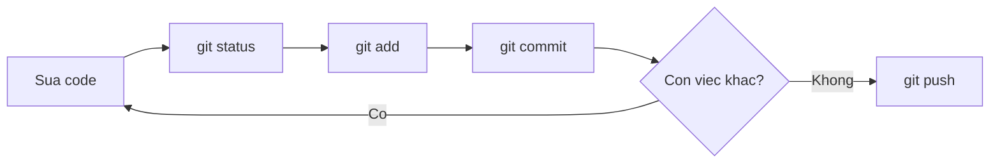

import { SummaryBox, Checklist, FAQSection } from '@site/src/components/SEO';

# 3.5 — 3. Workflow cơ bản

<SummaryBox>
Vòng lặp hằng ngày chỉ có bốn lệnh: `status`, `add`, `commit`, `push`. Phần khó không nằm ở cú pháp mà ở **chia commit cho đúng**. Một commit tốt là commit **hoàn tác được độc lập** — nghĩa là nếu `git revert` nó, hệ thống vẫn chạy và chỉ mất đúng một tính năng. Từ tiêu chí đó suy ra mọi quy tắc khác: đừng gộp việc không liên quan, đừng để commit nào làm build hỏng, và message phải trả lời câu hỏi **vì sao** chứ không phải *cái gì* — vì *cái gì* thì `git diff` đã nói rồi.
</SummaryBox>

## Mục tiêu bài học

Sau bài này bạn có thể:

- Chạy trôi chảy vòng lặp `status` → `add` → `commit` → `push`.
- Áp dụng tiêu chí "hoàn tác được độc lập" để quyết định chia commit.
- Viết commit message trả lời được câu hỏi *vì sao*.
- Dùng `git add -p` để tách một thay đổi lớn thành nhiều commit.
- Đọc lịch sử bằng `log`, `show` và `blame`.

## Nội dung bài học

### 3.5.1 — Vòng lặp hằng ngày



```bash
git status                       # đang có gì thay đổi?
git diff                         # cụ thể đổi những dòng nào?
git add src/OrderService.cs      # chọn phần sẽ commit
git diff --staged                # kiểm tra lại đúng thứ mình định commit
git commit -m "fix: chan don hang co tong tien am"
git push
```

Dòng `git diff --staged` là thói quen đáng tập nhất trong nhóm này. Nó là lần kiểm tra cuối trước khi thứ gì đó đi vào lịch sử vĩnh viễn — và nó bắt được rất nhiều `Console.WriteLine` bỏ quên.

### 3.5.2 — Chia commit: tiêu chí duy nhất cần nhớ

Câu hỏi "commit bao nhiêu là vừa" có một câu trả lời dùng được:

> Một commit tốt là commit mà bạn **hoàn tác riêng nó được** mà hệ thống vẫn chạy.

Thử tưởng tượng sáu tháng sau có người phát hiện tính năng X gây lỗi. Họ chạy `git revert <commit của X>`. Nếu lệnh đó gỡ đúng tính năng X và không kéo theo gì khác, commit của bạn đã chia đúng.

```bash
# XẤU — ba việc không liên quan trong một commit
git add .
git commit -m "update"
# Muốn gỡ mỗi phần đổi tên biến? Không tách ra được.

# TỐT — ba commit, mỗi cái hoàn tác riêng được
git add src/OrderValidator.cs
git commit -m "fix: chan don hang co tong tien am"

git add src/ReportService.cs
git commit -m "feat: them bao cao doanh thu theo chi nhanh"

git add src/Utils.cs
git commit -m "refactor: doi ten bien cho ro nghia"
```

Hai quy tắc phụ đi kèm:

- **Mỗi commit phải build được.** Lịch sử có commit làm hỏng build thì `git bisect` không dùng được, mà đó lại là công cụ tìm lỗi mạnh nhất.
- **Đừng trộn đổi format với đổi logic.** Một commit chỉ chạy formatter, một commit khác đổi hành vi. Trộn lại thì phần diff logic chìm trong hàng trăm dòng đổi dấu cách.

### 3.5.3 — `git add -p`: tách ngay cả trong một file

Bạn sửa hai việc trong cùng một file. Vẫn tách được:

```bash
git add -p src/OrderService.cs
# Git hiện từng khối thay đổi và hỏi:
#   y = đưa khối này vào staging
#   n = bỏ qua khối này
#   s = chia khối này nhỏ hơn nữa
#   q = thoát
```

Đây là công cụ biến "tôi lỡ sửa lẫn lộn hết rồi" thành một lịch sử sạch. Rất đáng tập.

### 3.5.4 — Commit message: trả lời *vì sao*

Phần *cái gì* đã nằm trong `git diff`. Message nên dùng chỗ của nó cho thứ diff không nói được.

```
❌ "fix bug"
❌ "update code"
❌ "sua theo yeu cau cua sep"

✅ "fix: chan don hang co tong tien am

Khach hang nhap so luong am o form dat hang lam tong tien ra so am,
va he thong van tao don. Them kiem tra o tang domain thay vi o
controller, vi con co luong tao don tu API va tu job nhap lieu."
```

Cấu trúc một message đầy đủ:

```
<loại>: <tóm tắt, dưới 72 ký tự, thể mệnh lệnh>
<dòng trống>
<vì sao cần thay đổi này, bối cảnh, đánh đổi đã cân nhắc>
<dòng trống>
<tham chiếu issue nếu có>
```

Dùng **thể mệnh lệnh** cho dòng tóm tắt — "them", "sua", "xoa", không phải "da them". Lý do: chính Git cũng viết vậy khi tự sinh message (`Merge branch...`, `Revert...`), nên đọc lên nhất quán.

Quy ước đặt tên loại (`feat`, `fix`, `refactor`...) là chủ đề của [bài 3.11 Conventional Commits](3.11-conventional-commits.mdx).

### 3.5.5 — Đọc lịch sử

```bash
# Gọn, mỗi commit một dòng, kèm đồ thị nhánh
git log --oneline --graph --decorate -20

# Lịch sử của một file
git log --follow -p src/OrderService.cs

# Xem một commit cụ thể
git show a1b2c3d

# Ai sửa dòng này, ở commit nào
git blame src/OrderService.cs

# Tìm commit nào từng nhắc tới một chuỗi
git log -S "CalculateDiscount" --oneline
```

`git log -S` ít người biết nhưng rất mạnh: nó tìm những commit làm **thay đổi số lần xuất hiện** của một chuỗi — tức là commit thêm vào hoặc xoá đi. Đây là cách nhanh nhất để trả lời "đoạn code này ra đời từ đâu".

`git blame` không phải để đổ lỗi. Nó để tìm **commit** chứa dòng đó, từ đó đọc message và hiểu bối cảnh. Đây chính là lúc bạn cảm ơn người đã viết message tử tế.

### 3.5.6 — Sửa commit chưa đẩy lên

```bash
# Quên một file, hoặc muốn sửa message của commit VỪA tạo
git add file-quen.cs
git commit --amend --no-edit        # giữ nguyên message
git commit --amend -m "message mới" # đổi message

# Bỏ commit cuối nhưng GIỮ thay đổi trong staging
git reset --soft HEAD~1

# Bỏ commit cuối, giữ thay đổi ở working directory
git reset HEAD~1
```

Quy tắc an toàn: **chỉ amend và reset commit chưa push**. Sau khi đẩy lên, hãy dùng `git revert` — nó tạo một commit mới đảo ngược, không viết lại lịch sử.

```bash
git revert a1b2c3d     # an toàn trên nhánh chung
```

### 3.5.7 — Rà lại thói quen của bạn

<Checklist
  title="Danh sách rà soát workflow"
  items={[
    { text: "Luôn chạy git diff --staged trước khi commit." },
    { text: "Mỗi commit hoàn tác riêng được mà hệ thống vẫn chạy." },
    { text: "Mỗi commit đều build được — không có commit nào làm hỏng build." },
    { text: "Không trộn đổi format với đổi logic trong cùng một commit." },
    { text: "Message trả lời được vì sao, không chỉ nói cái gì." },
    { text: "Dòng tóm tắt dùng thể mệnh lệnh và dưới 72 ký tự." },
    { text: "Chỉ amend và reset những commit chưa push; đã push thì dùng revert." },
    { text: "Không dùng git add . mà không xem git status trước." },
  ]}
/>

## Bài tập áp dụng

1. **Tách bằng `add -p`.** Sửa hai việc không liên quan trong cùng một file. Dùng `git add -p` tách thành hai commit. Kiểm tra bằng `git show --stat` rằng mỗi commit chỉ chứa phần của nó.

2. **Kiểm tra tiêu chí hoàn tác.** Lấy năm commit gần nhất trong dự án của bạn. Với mỗi cái, trả lời: nếu `git revert` riêng nó, hệ thống còn chạy không? Đếm số commit không đạt.

3. **Truy nguồn một dòng code.** Chọn một dòng khó hiểu trong dự án. Dùng `git blame` tìm commit, đọc message. Message đó có giải thích được vì sao dòng ấy tồn tại không? Nếu không, bạn vừa thấy cái giá của message cẩu thả.

## Tự kiểm tra

<FAQSection
  items={[
    {
      question: "Chia commit thế nào là đúng?",
      answer: "Tiêu chí dùng được: một commit tốt là commit mà bạn hoàn tác riêng nó được mà hệ thống vẫn chạy. Thử tưởng tượng sáu tháng sau có người git revert đúng commit đó — nếu nó gỡ đúng một tính năng và không kéo theo gì khác thì bạn đã chia đúng."
    },
    {
      question: "Vì sao mỗi commit phải build được?",
      answer: "Vì nếu lịch sử có commit làm hỏng build thì git bisect không dùng được, mà đó lại là công cụ tìm lỗi mạnh nhất — nó chia đôi lịch sử để khoanh vùng commit gây lỗi. Một commit hỏng build nằm giữa dải tìm kiếm là đủ làm cả quy trình đó vô dụng."
    },
    {
      question: "Commit message nên viết gì?",
      answer: "Trả lời vì sao, vì phần cái gì đã nằm trong git diff rồi. Bối cảnh, lý do chọn cách này, đánh đổi đã cân nhắc — đó là thứ diff không nói được và là thứ người đọc sáu tháng sau cần. Dòng tóm tắt viết ở thể mệnh lệnh, dưới 72 ký tự."
    },
    {
      question: "git add -p dùng để làm gì?",
      answer: "Để chọn từng khối thay đổi trong một file thay vì cả file. Khi bạn lỡ sửa hai việc không liên quan trong cùng một file, add -p cho phép tách chúng thành hai commit riêng. Nó biến một thư mục làm việc lộn xộn thành một lịch sử sạch."
    },
    {
      question: "Khi nào dùng amend, khi nào dùng revert?",
      answer: "Amend cho commit chưa push, vì nó tạo commit mới thay thế commit cũ và làm đổi mã băm. Sau khi đã push lên nhánh chung thì dùng revert, vì nó tạo một commit mới đảo ngược thay đổi mà không viết lại lịch sử, nên không ai bị phân kỳ."
    },
    {
      question: "git log -S dùng khi nào?",
      answer: "Khi muốn biết một đoạn code ra đời từ đâu. Nó tìm những commit làm thay đổi số lần xuất hiện của một chuỗi, tức là commit thêm vào hoặc xoá đi chuỗi đó. Nhanh hơn nhiều so với đọc thủ công toàn bộ lịch sử của file."
    }
  ]}
/>

## Kết luận

Ba điều đáng nhớ nhất:

1. **"Hoàn tác riêng được" là tiêu chí chia commit.** Mọi quy tắc khác đều suy ra từ đó.
2. **Message dùng để nói *vì sao*.** *Cái gì* thì `git diff` đã kể rồi.
3. **`git diff --staged` trước mỗi commit.** Thói quen rẻ nhất, bắt được nhiều lỗi nhất.

## Tham khảo

- [Pro Git — Git Basics](https://git-scm.com/book/en/v2) — chương 2, vòng lặp cơ bản
- [git-merge](https://git-scm.com/docs/git-merge)
- [Conventional Commits](https://www.conventionalcommits.org/en/v1.0.0/) — quy ước đặt tên loại commit
- [git-reflog](https://git-scm.com/docs/git-reflog) — khi amend hoặc reset nhầm

## Điều hướng

- **Bài trước:** [3.4 — Checklist an toàn khi làm Git](3.4-git-safety-checklist.mdx)
- **Bài tiếp theo:** [3.6 — 4. Branching và Merging](3.6-branching-and-merging.mdx)
- **Về module:** [Trang mục lục](./)
