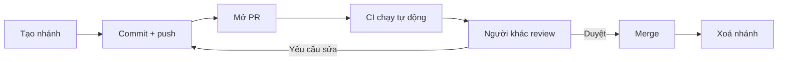

import { SummaryBox, Checklist, FAQSection } from '@site/src/components/SEO';

# 3.7 — 5. GitHub và Pull Request

<SummaryBox>
Pull request thường bị xem là cổng gác — ai đó phải bấm **Approve** thì code mới vào được. Nhưng giá trị lớn hơn nằm ở chỗ khác: nó là nơi **kiến thức về hệ thống lan ra khỏi đầu một người**. Từ góc nhìn đó suy ra cách làm hiệu quả: PR **nhỏ** (dưới 400 dòng, vì quá ngưỡng đó khả năng phát hiện lỗi của người review tụt hẳn), mô tả trả lời **vì sao** chứ không kể lại diff, và nhận xét nhắm vào **code** chứ không nhắm vào người viết. Bài này cũng làm rõ ba kiểu merge của GitHub và hệ quả rất khác nhau của chúng lên lịch sử.
</SummaryBox>

## Mục tiêu bài học

Sau bài này bạn có thể:

- Mở một pull request mà người khác review được trong 15 phút.
- Chọn đúng giữa merge commit, squash merge và rebase merge.
- Viết nhận xét review cụ thể và không mang tính công kích.
- Thiết lập branch protection cho nhánh chính.
- Dùng draft PR và CI để rút ngắn vòng phản hồi.

## Nội dung bài học

### 3.7.1 — Vòng đời một pull request



```bash
git checkout -b feature/revenue-report
# ... làm việc, commit ...
git push -u origin feature/revenue-report
# GitHub in ra một đường dẫn tạo PR ngay trong output của lệnh push
```

### 3.7.2 — PR nhỏ là PR được review tử tế

Đây là yếu tố ảnh hưởng nhiều nhất tới chất lượng review, và nó không liên quan gì tới kỹ năng của người review.

| Kích thước PR | Chuyện thường xảy ra |
|---|---|
| Dưới 100 dòng | Review kỹ, nhận xét cụ thể |
| 100–400 dòng | Vẫn ổn, cần tập trung |
| 400–1000 dòng | Bắt đầu đọc lướt |
| Trên 1000 dòng | **"LGTM 👍"** |

PR càng to, người review càng khó giữ toàn bộ bối cảnh trong đầu, và xác suất họ chỉ duyệt cho xong càng cao. Một PR 2000 dòng thường nhận được ít nhận xét hơn một PR 200 dòng — không phải vì nó tốt hơn.

Cách giữ PR nhỏ:

- Tách tái cấu trúc ra khỏi thay đổi hành vi. Hai PR, review độc lập.
- Gửi PR "dọn đường" trước (đổi tên, di chuyển file), rồi mới gửi PR logic.
- Tính năng lớn thì chia theo lát cắt dọc: mỗi PR là một phần chạy được từ đầu tới cuối.

### 3.7.3 — Mô tả PR

```markdown
## Vì sao

Khách hàng nhập số lượng âm ở form đặt hàng, hệ thống vẫn tạo đơn
với tổng tiền âm. Tuần trước có 3 đơn như vậy lọt vào báo cáo doanh thu.

## Làm gì

- Thêm kiểm tra ở tầng domain (`Order.AddLine`), không đặt ở controller
  vì còn luồng tạo đơn từ API công khai và từ job nhập liệu.
- Thêm test cho số lượng âm, bằng không, và vượt tồn kho.

## Cách kiểm tra

1. Gọi `POST /api/orders` với `quantity: -5`
2. Kỳ vọng `422` kèm `ProblemDetails`
3. Kiểm tra bảng `orders` không có bản ghi mới

## Lưu ý cho người review

Phần `OrderValidator` có thay đổi hành vi với đơn hàng đã tạo trước đây —
xem `Migrations/20260924_FixNegativeTotals.cs`.
```

Mục cuối là mục ít người viết nhất và có giá trị cao nhất. Nó **chỉ thẳng vào chỗ cần soi kỹ**, thay vì để người review tự mò trong 300 dòng diff.

### 3.7.4 — Ba kiểu merge của GitHub

| Kiểu | Lịch sử `main` | Dùng khi |
|---|---|---|
| **Create a merge commit** | Giữ mọi commit của nhánh, thêm một merge commit | Muốn giữ chi tiết quá trình |
| **Squash and merge** | **Gộp tất cả thành một commit** | Nhánh có nhiều commit "wip", "fix" |
| **Rebase and merge** | Đặt từng commit lên đầu `main`, lịch sử thẳng | Các commit đã sạch sẵn |

**Squash** là mặc định hợp lý cho hầu hết đội: `main` có lịch sử sạch, mỗi dòng là một tính năng hoàn chỉnh, và `git bisect` chạy rất hiệu quả trên đó.

Đánh đổi của squash: mất chi tiết quá trình. Với PR lớn, sáu tháng sau bạn chỉ thấy một commit 800 dòng, không còn biết thứ tự người viết đã làm. Đây là **một lý do nữa để giữ PR nhỏ** — với PR nhỏ, đánh đổi này gần như bằng không.

Lưu ý kỹ thuật: cả squash và rebase đều **tạo mã commit mới**, nên nhánh cũ trên máy bạn trở nên lỗi thời. Sau khi merge, hãy xoá nhánh cục bộ và `git fetch --prune`.

### 3.7.5 — Review: nhắm vào code, không nhắm vào người

```markdown
❌ "Code này viết tệ quá."
❌ "Sao lại làm thế này?"
❌ "Bạn không hiểu async à?"

✅ "Chỗ này `await` trong vòng lặp sẽ gọi database N lần.
    Gợi ý: lấy toàn bộ trong một query rồi tra bằng Dictionary.
    Tham khảo: /blog/ef-core-n-plus-1-query"

✅ "Mình chưa rõ vì sao cần cache ở đây — dữ liệu này đổi mỗi phút mà?
    Có bối cảnh nào mình đang thiếu không?"
```

Bốn nguyên tắc dùng được ngay:

1. **Nói về code, không nói về người.** "Hàm này" chứ không phải "bạn".
2. **Kèm lý do và gợi ý.** Nhận xét không có đường đi tiếp chỉ làm người ta bế tắc.
3. **Phân loại mức độ.** Đánh dấu rõ cái nào phải sửa, cái nào chỉ là đề xuất:

```markdown
**Phải sửa:** SQL injection ở dòng 42
**Nên sửa:** hàm này 80 dòng, tách được thành ba
**Tuỳ bạn:** mình hay đặt tên biến này là `orderTotal`
```

4. **Khen chỗ đáng khen.** Nếu ai đó xử lý một ca biên khéo, nói ra. Review chỉ toàn chê là review mà người ta sợ.

Và một quy tắc cho người **nhận** review: nếu một nhận xét khiến bạn phải giải thích dài dòng, rất có thể **code cần một comment** — vì người đọc tiếp theo cũng sẽ hỏi đúng câu đó.

### 3.7.6 — Branch protection

Thiết lập tối thiểu cho nhánh `main` của một dự án thật:

- ☑ Require a pull request before merging
- ☑ Require approvals (ít nhất 1)
- ☑ Require status checks to pass — build và test phải xanh
- ☑ Require branches to be up to date before merging
- ☑ Do not allow bypassing the above settings

Mục thứ tư đáng chú ý: nó chặn tình huống PR của bạn xanh khi tách ra, nhưng `main` đã đổi ở giữa và hai thay đổi xung đột về mặt logic dù không xung đột về mặt văn bản.

Kèm theo đó, một quy trình CI tối thiểu cho .NET:

```yaml
# .github/workflows/ci.yml
name: CI
on: [pull_request]
jobs:
  build:
    runs-on: ubuntu-latest
    steps:
      - uses: actions/checkout@v4
      - uses: actions/setup-dotnet@v4
        with:
          dotnet-version: '9.0.x'
      - run: dotnet restore
      - run: dotnet build --no-restore
      - run: dotnet test --no-build --verbosity normal
```

Chi tiết: [GitHub Actions](https://docs.github.com/en/actions).

### 3.7.7 — Rà lại quy trình của bạn

<Checklist
  title="Danh sách rà soát pull request"
  items={[
    { text: "PR dưới 400 dòng thay đổi; lớn hơn thì đã tách nhỏ." },
    { text: "Mô tả PR trả lời vì sao, không kể lại diff." },
    { text: "Có mục hướng dẫn kiểm tra để người review chạy thử được." },
    { text: "Có chỉ rõ chỗ cần soi kỹ nhất." },
    { text: "Tái cấu trúc và thay đổi hành vi nằm ở hai PR khác nhau." },
    { text: "Nhận xét review phân loại rõ phải sửa / nên sửa / tuỳ bạn." },
    { text: "Nhánh main đã bật branch protection và yêu cầu CI xanh." },
    { text: "Nhánh được xoá sau khi merge, và đã fetch --prune ở máy cục bộ." },
  ]}
/>

## Bài tập áp dụng

#### Bài 1 — Đo kích thước pull request

Lấy mười PR gần nhất của đội, ghi số dòng thay đổi và số nhận xét review của mỗi cái. Vẽ tương quan giữa hai con số.

**Tiêu chí hoàn thành:** bạn có bảng mười dòng và nhận ra xu hướng — số nhận xét **không** tăng theo kích thước PR.

<details>
<summary><strong>Gợi ý và lời giải — Bài 1</strong></summary>

**Gợi ý.** Lấy số liệu bằng lệnh thay vì mở từng PR trên giao diện:

```bash
gh pr list --state merged --limit 10 \
  --json number,additions,deletions,reviews \
  --jq '.[] | "\(.number)\t\(.additions + .deletions)\t\(.reviews | length)"'
```

Không có `gh` thì lấy số dòng từ Git:

```bash
git log --merges -10 --format="%H %s" | while read h s; do
  echo "$s  $(git diff --shortstat $h^1 $h | head -1)"
done
```

**Lời giải — dạng bảng thường thấy:**

| PR | Số dòng thay đổi | Số nhận xét review | Nhận xét / 100 dòng |
|---|---|---|---|
| #142 | 47 | 8 | 17,0 |
| #145 | 112 | 6 | 5,4 |
| #147 | 89 | 7 | 7,9 |
| #151 | 340 | 3 | 0,9 |
| #153 | 1.247 | 1 | 0,1 |
| #156 | 2.891 | 0 | 0,0 |

**Xu hướng gần như luôn xuất hiện:** số nhận xét **không** tăng theo kích thước. Nó tăng tới khoảng 200 dòng rồi **giảm mạnh**, và PR trên 1.000 dòng thường chỉ nhận được một lời "LGTM".

**Vì sao.** Review là công việc tốn sức tập trung. Người review phải dựng lại trong đầu ngữ cảnh của toàn bộ thay đổi trước khi đánh giá được từng dòng. Vượt một ngưỡng nhất định, việc đó trở nên bất khả thi trong một lần ngồi, và phản ứng tự nhiên là **duyệt cho xong** thay vì thừa nhận mình không đọc nổi.

Nghiên cứu về review code trong công nghiệp cho kết quả nhất quán ở một điểm: khả năng phát hiện lỗi giảm rõ rệt khi kích thước thay đổi vượt vài trăm dòng, và thời gian tập trung hiệu quả cho một lần review vào khoảng 60 phút.

**Bảng thực dụng:**

| Số dòng | Chất lượng review |
|---|---|
| Dưới 100 | Từng dòng được đọc, nhận xét có chất lượng |
| 100–300 | Còn tốt, nhưng bắt đầu bỏ sót |
| 300–1.000 | Chỉ còn đọc lướt cấu trúc |
| Trên 1.000 | Trên thực tế là **không được review** |

**Cách chia PR lớn — ba hướng, theo thứ tự nên thử:**

1. **Chia theo tầng.** Migration database thành một PR, tầng nghiệp vụ một PR, API một PR. Mỗi PR merge được độc lập nếu dùng mẫu mở rộng rồi thu hẹp ở [bài 3.5](3.4-workflow-co-ban.mdx).
2. **Tách riêng phần dọn dẹp.** Đổi tên, định dạng lại, sắp xếp using — gộp chung với thay đổi logic là cách chắc chắn nhất để không ai review được. Tách chúng thành PR riêng, người review duyệt trong hai phút.
3. **Dùng feature flag.** Merge code chưa hoàn thiện nhưng chưa bật cho người dùng, nên PR nhỏ lại mà không cần chờ tính năng xong — cách làm của mô hình trunk-based ở [bài 3.9](3.8-real-world-developer-workflow.mdx).

**Một con số đáng ghi nhớ.** Nếu đội bạn muốn một chỉ số duy nhất để cải thiện quy trình review, hãy dùng **số dòng trung vị mỗi PR** và đặt mục tiêu đưa nó xuống dưới 200.

</details>

#### Bài 2 — Viết lại một mô tả PR

Chọn một PR cũ có mô tả sơ sài. Viết lại theo cấu trúc ở mục 3.7.3, kèm mục "lưu ý cho người review". Hỏi đồng nghiệp: bản nào dễ review hơn?

**Tiêu chí hoàn thành:** mô tả mới trả lời được *vì sao* thay đổi này cần thiết, không chỉ *nó làm gì*.

<details>
<summary><strong>Gợi ý và lời giải — Bài 2</strong></summary>

**Gợi ý.** Diff đã nói **cái gì** thay đổi. Mô tả PR tồn tại để nói những thứ diff **không** nói được: vì sao cần, đã cân nhắc phương án nào khác, chỗ nào rủi ro, kiểm thử ra sao.

**Lời giải — trước:**

```markdown
Sửa bug tính doanh thu
```

**Sau:**

```markdown
## Vấn đề

Báo cáo doanh thu theo chi nhánh tính cả đơn hàng đã huỷ, nên số liệu
tháng 8 cao hơn thực tế khoảng 12%. Phòng kinh doanh phát hiện khi đối
chiếu với sổ kế toán (CRM-142).

## Cách xử lý

Thêm điều kiện lọc `IsCancelled == false` ở tầng truy vấn thay vì lọc
trong bộ nhớ, để database làm việc lọc và không kéo về dữ liệu thừa.

## Phương án đã cân nhắc

- Lọc trong bộ nhớ sau khi lấy dữ liệu: đơn giản hơn nhưng vẫn truyền
  toàn bộ đơn huỷ qua mạng, với chi nhánh lớn là khoảng 40% dữ liệu.
- Thêm một view trong database: sạch hơn nhưng phải thêm migration và
  đội vận hành đang tạm dừng thay đổi lược đồ trong tuần này.

## Lưu ý cho người review

- Hàm `TinhDoanhThu` được dùng ở **ba** chỗ khác: dashboard, xuất Excel,
  và job gửi email hằng tuần. Đã kiểm tra cả ba, nhưng đây là chỗ rủi ro nhất.
- Chưa xử lý đơn hoàn tiền một phần — sẽ làm ở CRM-148, đã tạo issue.

## Kiểm thử

- Thêm 3 unit test cho các trường hợp: không có đơn huỷ, toàn đơn huỷ, hỗn hợp.
- Chạy lại báo cáo tháng 8 trên dữ liệu staging: khớp với sổ kế toán.

Closes #142
```

**Năm phần và lý do tồn tại của từng phần:**

| Phần | Trả lời câu hỏi | Vì sao cần |
|---|---|---|
| Vấn đề | Vì sao thay đổi này tồn tại | Sáu tháng sau, đây là thứ duy nhất còn giải thích được |
| Cách xử lý | Đã chọn hướng nào | Người review đánh giá được lựa chọn, không chỉ đánh giá code |
| Phương án đã cân nhắc | Vì sao **không** làm cách khác | Chặn trước câu "sao không dùng cách X" |
| Lưu ý cho người review | Nên soi kỹ chỗ nào | Hướng sự tập trung vào phần rủi ro nhất |
| Kiểm thử | Làm sao biết nó đúng | Người review không phải tự đoán |

**Mục "lưu ý cho người review" là mục có giá trị cao nhất**, và cũng là mục hay thiếu nhất. Nó thừa nhận rằng người review có thời gian hữu hạn, và hướng thời gian đó vào nơi đáng dùng. Nói thẳng "chỗ này tôi không chắc" không phải điểm yếu — nó là cách hiệu quả nhất để nhận được review thực chất.

**Tự động hoá bằng mẫu.** Tạo file `.github/pull_request_template.md` với các tiêu đề trên; GitHub tự điền vào mỗi PR mới. Công sức bỏ ra một lần, cả đội hưởng lợi lâu dài.

**Liên hệ với commit message.** Cùng một nguyên tắc ở hai quy mô: commit message trả lời "vì sao" cho một thay đổi, mô tả PR trả lời "vì sao" cho một nhóm thay đổi. [Bài 3.11](3.10-conventional-commits.mdx) trình bày cách chuẩn hoá phần này để sinh changelog tự động.

</details>

#### Bài 3 — Dựng CI tối thiểu và chặn merge

Thêm file workflow vào một dự án .NET, mở một PR cố ý làm hỏng test, và xác nhận GitHub chặn không cho merge.

**Tiêu chí hoàn thành:** nút Merge bị vô hiệu hoá, và bạn giải thích được vì sao cấu hình bảo vệ nhánh quan trọng hơn bản thân file workflow.

<details>
<summary><strong>Gợi ý và lời giải — Bài 3</strong></summary>

**Gợi ý.** Chỉ thêm workflow thôi thì CI **chạy** nhưng không **chặn** được gì — nó chỉ hiện dấu đỏ mà mọi người vẫn merge được. Phần chặn nằm ở cấu hình bảo vệ nhánh trên GitHub.

**Lời giải — bước 1, file `.github/workflows/ci.yml`:**

```yaml
name: CI

on:
  pull_request:
    branches: [main]
  push:
    branches: [main]

jobs:
  build-and-test:
    runs-on: ubuntu-latest
    steps:
      - uses: actions/checkout@v4

      - uses: actions/setup-dotnet@v4
        with:
          dotnet-version: '9.0.x'

      - name: Khôi phục gói
        run: dotnet restore

      - name: Build
        run: dotnet build --no-restore --configuration Release

      - name: Test
        run: dotnet test --no-build --configuration Release --verbosity normal
```

**Bước 2 — bật bảo vệ nhánh.** Trên GitHub: *Settings > Branches > Add branch protection rule* cho `main`, rồi bật:

```text
[x] Require a pull request before merging
    [x] Require approvals: 1
[x] Require status checks to pass before merging
    [x] Require branches to be up to date before merging
    -> chọn check "build-and-test"
[x] Do not allow bypassing the above settings
```

**Bước 3 — kiểm chứng.** Mở một PR có test hỏng. Kết quả mong đợi: check hiện dấu đỏ và nút Merge chuyển sang trạng thái không bấm được, kèm dòng *"Required statuses must pass before merging"*.

**Vì sao bảo vệ nhánh quan trọng hơn file workflow.** Không có nó, CI chỉ là một tín hiệu mang tính gợi ý. Thực tế lặp lại ở mọi đội: khi đang gấp, người ta merge đè lên dấu đỏ với lý do "test này hay hỏng vặt thôi". Vài lần như vậy là cả đội quen với việc bỏ qua dấu đỏ, và CI mất sạch giá trị.

**Ba tuỳ chọn đáng bật thêm:**

| Tuỳ chọn | Ngăn được gì |
|---|---|
| Require branches to be up to date | Xung đột ngữ nghĩa ở [bài 3.8](3.7-git-conflicts.mdx) — buộc CI chạy trên kết quả merge thật |
| Require conversation resolution | Merge khi nhận xét review chưa được xử lý |
| Do not allow bypassing | Người có quyền quản trị tự ý bỏ qua mọi quy tắc |

Tuỳ chọn đầu tiên đáng giá nhất, và cũng là tuỳ chọn hay bị bỏ qua nhất.

**Giữ CI dưới 10 phút.** Đây là điều kiện mà [bài 3.9](3.8-real-world-developer-workflow.mdx) nêu cho mô hình trunk-based. CI chạy 40 phút khiến người ta gộp nhiều việc vào một PR để đỡ phải chờ nhiều lần — đúng thứ mà bài 1 ở trên cho thấy là có hại. Hai cách rút ngắn hiệu quả nhất: bật bộ đệm gói NuGet, và tách bộ test chậm sang một workflow chạy theo lịch thay vì chạy trên mỗi PR.

```yaml
      - uses: actions/cache@v4
        with:
          path: ~/.nuget/packages
          key: nuget-${{ hashFiles('**/packages.lock.json') }}
```

</details>

## Tự kiểm tra

<FAQSection
  items={[
    {
      question: "Vì sao PR nhỏ lại được review tốt hơn?",
      answer: "Vì người review phải giữ toàn bộ bối cảnh trong đầu, và khả năng đó giảm nhanh theo kích thước. Trên khoảng 400 dòng thì người ta bắt đầu đọc lướt, trên 1000 dòng thì thường chỉ duyệt cho xong. Một PR 2000 dòng thường nhận ít nhận xét hơn một PR 200 dòng, không phải vì nó tốt hơn."
    },
    {
      question: "Ba kiểu merge của GitHub khác nhau ra sao?",
      answer: "Merge commit giữ mọi commit của nhánh và thêm một commit hợp nhất. Squash and merge gộp tất cả thành một commit duy nhất trên main. Rebase and merge đặt từng commit lên đầu main cho lịch sử thẳng. Squash là mặc định hợp lý cho hầu hết đội vì main có lịch sử sạch và git bisect chạy rất hiệu quả."
    },
    {
      question: "Đánh đổi của squash merge là gì?",
      answer: "Mất chi tiết quá trình. Với PR lớn, sáu tháng sau bạn chỉ thấy một commit 800 dòng và không còn biết thứ tự người viết đã làm. Đây là thêm một lý do để giữ PR nhỏ — với PR nhỏ thì đánh đổi này gần như bằng không."
    },
    {
      question: "Mục nào trong mô tả PR có giá trị cao nhất?",
      answer: "Mục lưu ý cho người review, chỉ thẳng vào chỗ cần soi kỹ nhất. Đó là mục ít người viết nhất nhưng tiết kiệm nhiều thời gian nhất, vì nó thay việc người review tự mò trong hàng trăm dòng diff bằng một chỉ dẫn cụ thể."
    },
    {
      question: "Nhận xét review nên viết thế nào?",
      answer: "Nói về code chứ không nói về người, kèm lý do và một hướng đi tiếp cụ thể, và phân loại rõ mức độ: phải sửa, nên sửa, hay chỉ là đề xuất tuỳ chọn. Cũng nên khen chỗ đáng khen, vì review chỉ toàn chê là review mà người ta sợ."
    },
    {
      question: "Require branches to be up to date before merging chặn được gì?",
      answer: "Chặn tình huống PR của bạn xanh khi tách ra, nhưng nhánh main đã thay đổi ở giữa, và hai thay đổi xung đột về mặt logic dù không xung đột về mặt văn bản. Tuỳ chọn này buộc nhánh phải cập nhật theo main rồi chạy lại CI trước khi được merge."
    }
  ]}
/>

## Kết luận

Ba điều đáng nhớ nhất:

1. **PR là nơi kiến thức lan ra**, không chỉ là cổng gác.
2. **400 dòng là ngưỡng thực tế.** Vượt qua nó, review biến thành nghi lễ.
3. **Nhận xét cần kèm đường đi tiếp.** Chỉ ra vấn đề mà không gợi ý giải pháp chỉ làm người ta bế tắc.

## Tham khảo

- [GitHub Pull requests](https://docs.github.com/en/pull-requests) — vòng đời và tuỳ chọn merge
- [GitHub Actions](https://docs.github.com/en/actions) — dựng CI cho PR
- [git-merge](https://git-scm.com/docs/git-merge) — phần Git bên dưới
- [Conventional Commits](https://www.conventionalcommits.org/en/v1.0.0/) — hữu ích khi dùng squash merge

## Điều hướng

- **Bài trước:** [3.5 — 4. Branching và Merging](3.5-branching-and-merging.mdx)
- **Bài tiếp theo:** [3.7 — 6. Git Conflicts](3.7-git-conflicts.mdx)
- **Về module:** [Trang mục lục](./)
