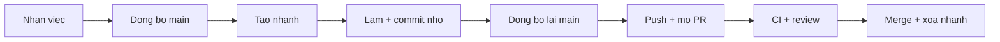
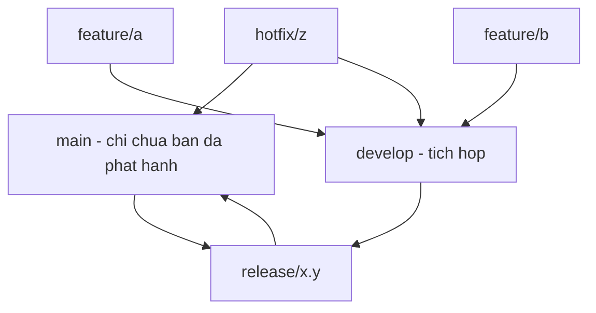
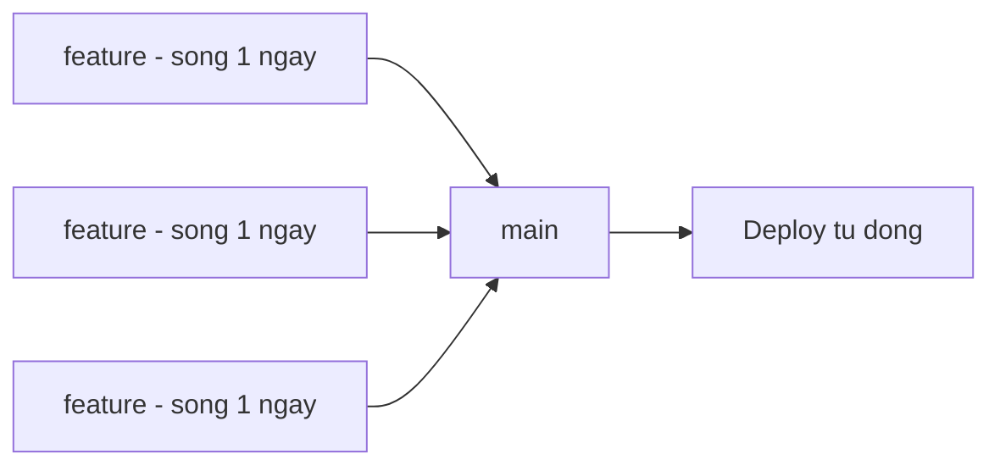

import { SummaryBox, Checklist, FAQSection } from '@site/src/components/SEO';

# 3.9 — 7. Developer Workflow thực tế

<SummaryBox>
Biết lệnh Git chưa đủ; cái quyết định là **quy ước của đội**. Bài này so sánh hai mô hình phổ biến và đưa ra khuyến nghị rõ ràng: **Git Flow** với năm loại nhánh sinh ra cho thời kỳ phần mềm phát hành theo phiên bản đóng gói, nên với đội nhỏ deploy vài lần một tuần nó chỉ tạo thêm nghi lễ; **trunk-based** với nhánh sống dưới một ngày hợp hơn nhiều. Phần thứ hai là **quy trình hotfix** — thứ bạn chỉ cần tới lúc production đang hỏng và không còn đầu óc để nghĩ ra, nên phải viết sẵn từ trước.
</SummaryBox>

## Mục tiêu bài học

Sau bài này bạn có thể:

- Đi hết một chu trình từ nhận việc tới merge mà không bỏ bước nào.
- So sánh Git Flow với trunk-based và chọn theo quy mô đội.
- Thực hiện một hotfix đúng thứ tự khi production đang hỏng.
- Giải thích vì sao feature flag thay thế được nhánh sống lâu.
- Nhận ra dấu hiệu quy trình của đội đang quá nặng.

## Nội dung bài học

### 3.9.1 — Một ngày làm việc



```bash
# 1. Đồng bộ trước khi bắt đầu
git checkout main && git pull

# 2. Nhánh cho đúng một việc
git checkout -b feature/CRM-142-bao-cao-doanh-thu

# 3. Làm việc, commit nhỏ và thường xuyên
git add -p && git commit -m "feat: them truy van doanh thu theo chi nhanh"

# 4. Trước khi mở PR, đồng bộ lại
git fetch origin && git rebase origin/main

# 5. Đẩy lên và mở PR
git push -u origin feature/CRM-142-bao-cao-doanh-thu

# 6. Sau khi merge, dọn
git checkout main && git pull
git branch -d feature/CRM-142-bao-cao-doanh-thu
git fetch --prune
```

Bước 4 là bước hay bị bỏ nhất, và là bước tiết kiệm nhiều thời gian nhất. Đồng bộ **trước khi** mở PR nghĩa là bạn giải xung đột trên máy mình, lúc rảnh rang — thay vì giải nó trong giao diện web khi người review đang chờ.

### 3.9.2 — Git Flow



Năm loại nhánh: `main`, `develop`, `feature/*`, `release/*`, `hotfix/*`.

**Hợp khi:** phần mềm phát hành theo phiên bản đóng gói, phải hỗ trợ nhiều phiên bản cùng lúc, có giai đoạn QA tách biệt, hoặc khách hàng tự quyết khi nào nâng cấp.

**Không hợp khi:** đội nhỏ, deploy liên tục, chỉ có một phiên bản đang chạy — tức là phần lớn ứng dụng web nội bộ và SaaS.

Git Flow ra đời năm 2010, cho bối cảnh phát hành theo bản. Chính tác giả của nó sau này đã ghi chú rằng nó **không phù hợp** với các đội làm sản phẩm web deploy liên tục. Dùng nó cho một API nội bộ deploy ba lần một tuần là mang bộ máy của một nhà xuất bản phần mềm vào một đội năm người.

### 3.9.3 — Trunk-based



Một nhánh chính. Nhánh tính năng **sống dưới một ngày**. Merge vào `main` liên tục. `main` luôn ở trạng thái deploy được.

Điều kiện để chạy được:

- **Bộ test đủ tin cậy**, vì không có giai đoạn QA riêng để bắt lỗi.
- **CI nhanh**, dưới 10 phút, nếu không người ta sẽ ngại merge.
- **Feature flag** cho tính năng chưa hoàn thiện.

Điểm thứ ba là chìa khoá. Nó giải quyết mâu thuẫn "tính năng chưa xong thì merge kiểu gì":

```csharp
if (_features.IsEnabled("new-revenue-report"))
{
    return await _newReportService.GenerateAsync(ct);
}
return await _legacyReportService.GenerateAsync(ct);
```

Code chưa hoàn thiện vẫn **vào `main` mỗi ngày**, chỉ là chưa bật cho người dùng. Đổi lại bạn không bao giờ có nhánh sống ba tuần — thứ gây ra phần lớn xung đột nặng.

Cái giá: phải dọn flag sau khi tính năng ổn định. Flag bỏ quên tích tụ thành một dạng nợ kỹ thuật riêng.

### 3.9.4 — Hotfix: viết sẵn trước khi cần

Production đang hỏng. Đây là lúc **không nên** nghĩ ra quy trình.

```bash
# 1. Tách từ TRẠNG THÁI ĐANG CHẠY, không phải từ develop
git checkout main && git pull
git checkout -b hotfix/don-hang-tong-tien-am

# 2. Sửa NHỎ NHẤT CÓ THỂ — chỉ chặn máu, không tái cấu trúc
git commit -am "fix: chan don hang co tong tien am"

# 3. Vẫn mở PR, vẫn để CI chạy
git push -u origin hotfix/don-hang-tong-tien-am

# 4. Merge và deploy

# 5. Gộp ngược về nhánh phát triển nếu mô hình có nhánh đó
git checkout develop && git merge hotfix/don-hang-tong-tien-am
```

Bốn nguyên tắc, và mỗi cái đều từng bị vi phạm với hậu quả thật:

1. **Tách từ nhánh đang chạy trên production.** Tách từ `develop` là kéo theo mọi thứ chưa được kiểm thử.
2. **Sửa nhỏ nhất có thể.** Hotfix không phải lúc dọn dẹp. Ghi lại việc dọn vào một issue riêng.
3. **Vẫn chạy CI.** Cám dỗ bỏ qua khi đang gấp là lớn nhất, và đó cũng là lúc một lỗi thứ hai gây thiệt hại nhất.
4. **Đừng quên bước 5.** Quên gộp ngược về nhánh phát triển thì lần phát hành sau sẽ **xoá mất bản vá**, và lỗi quay lại.

Bước 5 là lỗi kinh điển của các đội dùng Git Flow, và là một điểm cộng nữa cho trunk-based — nơi chỉ có một nhánh nên không có gì để quên.

### 3.9.5 — Chọn mô hình nào

| | Git Flow | Trunk-based |
|---|---|---|
| Quy mô đội | Vừa và lớn | Mọi quy mô, tốt nhất với nhỏ |
| Nhịp phát hành | Theo bản, có lịch | Liên tục |
| Tuổi nhánh | Nhiều tuần | **Dưới một ngày** |
| Cần feature flag | Không | **Có** |
| Cần bộ test mạnh | Vừa | **Rất cần** |
| Độ phức tạp quy trình | Cao | Thấp |

Khuyến nghị thực dụng: **bắt đầu bằng trunk-based**. Chỉ thêm nhánh và quy trình khi có một vấn đề cụ thể đòi hỏi. Quy trình nặng rất dễ thêm vào và rất khó bỏ đi.

### 3.9.6 — Dấu hiệu quy trình đang quá nặng

- Mỗi thay đổi nhỏ mất hơn một ngày để tới production.
- Có nhánh sống hơn hai tuần.
- Người ta thường xuyên phải giải cùng một xung đột nhiều lần.
- Có bước trong quy trình mà không ai giải thích được vì sao tồn tại.
- Hotfix phải đi vòng qua ba nhánh trước khi tới được production.

Mỗi dấu hiệu trên là một chi phí trả hằng ngày. Quy trình tồn tại để giảm rủi ro — khi nó không còn giảm rủi ro nào cụ thể, nó chỉ còn là chi phí.

### 3.9.7 — Rà lại quy trình của đội

<Checklist
  title="Danh sách rà soát workflow của đội"
  items={[
    { text: "Nhánh tính năng sống dưới một tuần, lý tưởng là dưới một ngày." },
    { text: "Đồng bộ với main trước khi mở PR, không phải sau." },
    { text: "main luôn ở trạng thái deploy được." },
    { text: "Có quy trình hotfix viết sẵn, và mọi người biết nó ở đâu." },
    { text: "Hotfix tách từ nhánh đang chạy trên production." },
    { text: "Có cơ chế feature flag cho tính năng chưa hoàn thiện." },
    { text: "Có lịch dọn các feature flag đã hết vai trò." },
    { text: "Mỗi bước trong quy trình đều giải thích được nó giảm rủi ro gì." },
  ]}
/>

## Bài tập áp dụng

1. **Đo tuổi nhánh.** Chạy `git for-each-ref --sort=committerdate --format='%(refname:short) %(committerdate:relative)' refs/remotes/origin` trên kho của đội. Đếm số nhánh sống quá hai tuần.

2. **Viết quy trình hotfix.** Soạn một tài liệu một trang cho đội bạn, theo năm bước ở mục 3.9.4, có tên người chịu trách nhiệm ở từng bước. Đặt nó ở nơi tìm được trong 30 giây.

3. **Diễn tập.** Cố ý deploy một lỗi lên môi trường staging. Chạy đủ quy trình hotfix, tính giờ từ lúc phát hiện tới lúc bản vá lên staging. Ghi lại bước nào chậm nhất.

## Tự kiểm tra

<FAQSection
  items={[
    {
      question: "Vì sao nên đồng bộ với main trước khi mở PR?",
      answer: "Vì bạn giải xung đột trên máy mình lúc rảnh rang, với đầy đủ công cụ và có thể chạy test ngay. Nếu để sau, bạn phải giải xung đột trong giao diện web khi người review đang chờ, và CI có thể chạy trên một kết quả merge khác với thứ bạn đã kiểm tra."
    },
    {
      question: "Khi nào Git Flow phù hợp?",
      answer: "Khi phần mềm phát hành theo phiên bản đóng gói, phải hỗ trợ nhiều phiên bản cùng lúc, có giai đoạn QA tách biệt, hoặc khách hàng tự quyết khi nào nâng cấp. Nó ra đời năm 2010 cho bối cảnh đó. Với đội nhỏ deploy liên tục và chỉ có một phiên bản đang chạy thì nó chỉ tạo thêm nghi lễ."
    },
    {
      question: "Trunk-based cần điều kiện gì?",
      answer: "Ba điều kiện: bộ test đủ tin cậy vì không có giai đoạn QA riêng, CI nhanh dưới mười phút nếu không người ta sẽ ngại merge, và feature flag cho tính năng chưa hoàn thiện. Điều kiện thứ ba là chìa khoá vì nó cho phép merge code chưa xong vào main mỗi ngày mà chưa bật cho người dùng."
    },
    {
      question: "Vì sao hotfix phải tách từ nhánh đang chạy trên production?",
      answer: "Vì tách từ nhánh phát triển sẽ kéo theo mọi thay đổi chưa được kiểm thử vào bản vá khẩn cấp. Khi production đang hỏng, bạn muốn đưa lên đúng một thay đổi nhỏ nhất có thể, không kèm theo hai chục thứ khác."
    },
    {
      question: "Bước nào trong quy trình hotfix hay bị quên nhất?",
      answer: "Bước gộp ngược bản vá về nhánh phát triển. Quên bước này thì lần phát hành sau sẽ xoá mất bản vá và lỗi quay trở lại. Đây là lỗi kinh điển của các đội dùng Git Flow, và cũng là một điểm cộng cho trunk-based, nơi chỉ có một nhánh nên không có gì để quên."
    },
    {
      question: "Feature flag có cái giá gì?",
      answer: "Phải dọn sau khi tính năng đã ổn định. Flag bỏ quên tích tụ thành một dạng nợ kỹ thuật riêng: code có hai nhánh chạy song song, không ai nhớ nhánh nào còn dùng, và việc kiểm thử nhân đôi số tổ hợp. Nên đặt lịch rà soát và xoá flag hết vai trò."
    }
  ]}
/>

## Kết luận

Ba điều đáng nhớ nhất:

1. **Nhánh sống lâu là nguồn gốc của phần lớn đau khổ.** Mọi khuyến nghị khác đều xoay quanh việc rút ngắn tuổi nhánh.
2. **Quy trình hotfix phải viết trước khi cần.** Lúc production hỏng không phải lúc thiết kế quy trình.
3. **Mỗi bước trong quy trình phải trả lời được nó giảm rủi ro gì.** Không trả lời được thì đó là chi phí thuần.

## Tham khảo

- [Pro Git — Distributed Workflows](https://git-scm.com/book/en/v2) — các mô hình cộng tác
- [GitHub Pull requests](https://docs.github.com/en/pull-requests)
- [GitHub Actions](https://docs.github.com/en/actions) — tự động hoá kiểm thử và deploy
- [Conventional Commits](https://www.conventionalcommits.org/en/v1.0.0/) — nền cho phát hành tự động

## Điều hướng

- **Bài trước:** [3.8 — 6. Git Conflicts](3.8-git-conflicts.mdx)
- **Bài tiếp theo:** [3.10 — 8. Debugging Workflow](3.10-debugging-workflow.mdx)
- **Về module:** [Trang mục lục](./)
