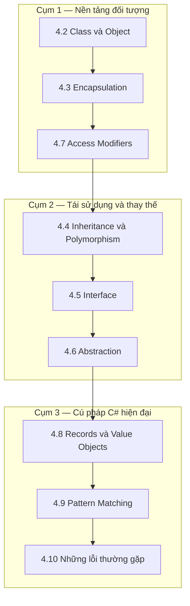

import { SummaryBox, Checklist, FAQSection } from '@site/src/components/SEO';

# 4.1 — Định hướng Module 4: C# Core và lập trình hướng đối tượng

<SummaryBox>
Hầu hết tài liệu OOP dạy bốn trụ cột theo thứ tự đóng gói, kế thừa, đa hình, trừu tượng — rồi dành phần lớn ví dụ cho **kế thừa**, thứ ít dùng nhất trong code backend thật. Module này đảo trọng số: **đóng gói là kỹ năng dùng hằng ngày**, kế thừa là công cụ hẹp và dễ lạm dụng, còn `interface` cùng `record` mới là thứ bạn gõ nhiều nhất. Mục tiêu cuối module không phải "biết OOP" mà là một domain model `Customer` / `Lead` / `Contact` **không thể bị đưa vào trạng thái sai** — nền cho toàn bộ hệ CRM về sau.
</SummaryBox>

## Module này giải quyết vấn đề gì

Đây là đoạn code mà gần như mọi lập trình viên C# đều từng viết trong năm đầu:

```csharp
public class Customer
{
    public string Name { get; set; }
    public string Email { get; set; }
    public decimal Revenue { get; set; }
    public string Status { get; set; }
}
```

Nó biên dịch được, chạy được, và là nguồn của một lớp lỗi rất tốn kém. Vì mọi thuộc tính đều `set` công khai, **bất kỳ dòng code nào trong toàn bộ ứng dụng** cũng đặt được `Revenue = -5000`, `Email = "khong-phai-email"`, hay `Status = "Actve"` do gõ nhầm. Khi dữ liệu hỏng xuất hiện trong database sáu tháng sau, không có cách nào biết dòng code nào đã ghi nó.

Lớp học thuật gọi vấn đề này là *thiếu bất biến* (invariant). Thực tế nó có tên gọn hơn: **anemic domain model** — đối tượng chỉ chứa dữ liệu, còn quy tắc nghiệp vụ nằm rải rác ở nơi khác.

Module này dạy cách viết lại cùng lớp đó sao cho trạng thái sai **không biểu diễn được**:

```csharp
public class Customer
{
    public string Name { get; private set; }
    public Email Email { get; private set; }
    public decimal Revenue { get; private set; }
    public CustomerStatus Status { get; private set; }

    public Customer(string name, Email email)
    {
        if (string.IsNullOrWhiteSpace(name))
            throw new ArgumentException("Tên khách hàng không được rỗng", nameof(name));
        Name = name;
        Email = email;
        Status = CustomerStatus.Prospect;
    }

    public void GhiNhanDoanhThu(decimal soTien)
    {
        if (soTien <= 0)
            throw new ArgumentOutOfRangeException(nameof(soTien), "Doanh thu phải dương");
        Revenue += soTien;
    }
}
```

Khác biệt không nằm ở số dòng code mà ở chỗ: sau khi viết như vậy, **không tồn tại** đường nào tạo ra một `Customer` có tên rỗng hay doanh thu âm. Quy tắc nghiệp vụ được thực thi bởi trình biên dịch và hàm khởi tạo, chứ không phụ thuộc vào việc mọi người nhớ kiểm tra.

## Bạn cần gì trước khi bắt đầu

<Checklist
  title="Điều kiện đầu vào"
  items={[
    { text: <>{"Đã xong Module 1: viết được hàm, vòng lặp, điều kiện, và dùng được "}<code>{"List<T>"}</code>{"."}</> },
    { text: "Đã xong Module 3, hoặc ít nhất commit được code lên GitHub — module này sinh nhiều code cần lưu lại." },
    { text: <>{"Tạo được project bằng "}<code>dotnet new console</code>{" và "}<code>dotnet new classlib</code>{"."}</> },
    { text: "Trình soạn thảo có gợi ý code và hiện được lỗi biên dịch ngay khi gõ." },
    { text: "Dành được khoảng 12–14 giờ. Đây là module dài nhất của Stage 2." },
  ]}
/>

Chưa cần biết về database, web hay async. Module này chỉ làm việc với code chạy trong một tiến trình.

## Bản đồ module

Chín bài chia thành ba cụm, đi từ "giữ dữ liệu an toàn" tới "diễn đạt ý định gọn gàng":



| Bài | Câu hỏi bài này trả lời | Thời lượng |
|---|---|---|
| [4.2 — Class và Object](4.2-class-and-object.mdx) | Lớp khác thể hiện ở đâu, và đối tượng nằm ở đâu trong bộ nhớ? | 75 phút |
| [4.3 — Encapsulation](4.3-encapsulation.mdx) | Vì sao `public set` ở khắp nơi là nguồn gốc dữ liệu hỏng? | 90 phút |
| [4.4 — Inheritance và Polymorphism](4.4-inheritance-and-polymorphism.mdx) | Khi nào kế thừa đúng, và vì sao thường thì không? | 90 phút |
| [4.5 — Interface](4.5-interface.mdx) | Vì sao interface là công cụ tách phụ thuộc chính của C#? | 90 phút |
| [4.6 — Abstraction](4.6-abstraction.mdx) | Chọn `abstract class` hay `interface` theo tiêu chí nào? | 75 phút |
| [4.7 — Access Modifiers](4.7-access-modifiers.mdx) | `internal` khác `private protected` thế nào, và dùng khi nào? | 60 phút |
| [4.8 — Records và Value Objects](4.8-records-and-value-objects.mdx) | Vì sao `Email` nên là một kiểu riêng chứ không phải `string`? | 90 phút |
| [4.9 — Pattern Matching](4.9-pattern-matching.mdx) | Làm sao thay chuỗi `if-else` dài bằng một `switch` đọc được? | 75 phút |
| [4.10 — Những lỗi thường gặp](4.10-common-mistakes.mdx) | Những bẫy nào người mới gần như chắc chắn rơi vào? | 60 phút |

Phần bổ trợ: [4.11 — Mở rộng và đào sâu](4.11-advanced-notes.mdx), [4.12 — Mini case study](4.12-mini-case-study.mdx), [4.13 — Ví dụ thực tế nhanh](4.13-quick-real-world-example.mdx), [4.14 — Review and Assessment](4.14-review-and-assessment.mdx).

## Kết quả đầu ra đo được

| Năng lực | Cách tự kiểm chứng |
|---|---|
| Viết lớp có bất biến được bảo vệ | Đưa lớp `Customer` cho người khác và thách họ tạo ra doanh thu âm — họ không làm được |
| Chọn giữa kế thừa và kết hợp | Cho một yêu cầu, nêu lý do chọn `interface` thay vì lớp cơ sở |
| Thiết kế interface hẹp | Viết interface không quá 4 phương thức, và nêu được ai sẽ cài đặt nó |
| Dùng `record` đúng chỗ | Nói được vì sao `Email` là `record` còn `Customer` là `class` |
| Viết `switch expression` | Thay một chuỗi 5 `if-else` bằng một `switch expression` có xử lý đủ nhánh |
| Chọn access modifier nhỏ nhất đủ dùng | Rà một lớp và hạ cấp mọi thành viên `public` không cần thiết |
| Nhận ra anemic domain model | Nhìn một lớp toàn `get; set;` và chỉ ra quy tắc nghiệp vụ đang thiếu ở đâu |

## Sản phẩm bàn giao của module

Một **thư viện lớp `Crm.Domain`** — không phải console app — chứa domain model dùng lại được suốt giáo trình:

```text
Crm.Domain/
├── Customer.cs        lớp có bất biến, không setter công khai
├── Lead.cs            trạng thái chuyển theo quy tắc, không gán tuỳ ý
├── Contact.cs         thông tin liên hệ gắn với Customer
├── ValueObjects/
│   ├── Email.cs       record, tự xác thực khi khởi tạo
│   ├── PhoneNumber.cs record, chuẩn hoá định dạng
│   └── Money.cs       record, mang cả số tiền lẫn đơn vị tiền tệ
└── Enums/
    ├── CustomerStatus.cs
    └── LeadStage.cs
```

Tiêu chí nghiệm thu, kiểm tra được bằng cách thử viết code phá:

1. Không tạo được `Customer` với tên rỗng.
2. Không tạo được `Email` với chuỗi thiếu ký tự `@`.
3. Không đặt `Revenue` thành số âm từ bên ngoài.
4. Không chuyển `Lead` từ `Won` ngược về `New`.
5. Không có thành viên `public` nào mà bên ngoài không thật sự cần.

Thư viện này được [Module 7 — Dependency Injection](../module-07-dependency-injection/) đưa vào container, [Module 13 — EF Core](../../stage-04-database-production/module-13-entity-framework-core/) ánh xạ xuống database, và [Module 16 — Clean Architecture](../../stage-05-senior-engineering/module-16-clean-architecture/) đặt vào tầng trong cùng. Làm cẩn thận ở đây tiết kiệm rất nhiều công sửa về sau.

## Lộ trình học gợi ý

| Ngày | Nội dung | Việc phải xong |
|---|---|---|
| 1 | 4.2 | Tạo được lớp `Customer` với constructor |
| 2 | 4.3 + 4.7 | Bỏ hết setter công khai, code vẫn biên dịch |
| 3 | 4.4 | Nêu được một trường hợp kế thừa đúng và một trường hợp sai |
| 4 | 4.5 | Viết `ILeadRepository` và một cài đặt trong bộ nhớ |
| 5 | 4.6 + 4.8 | Có `Email` và `Money` dưới dạng `record` tự xác thực |
| 6 | 4.9 + 4.10 | Thay một chuỗi `if-else` bằng `switch expression` |
| 7 | 4.11 → 4.14 | Hoàn tất `Crm.Domain`, làm bài tự chấm 4.14 |

## Ba sai lầm thường gặp khi học module này

**Một — lạm dụng kế thừa.** Tài liệu OOP hay lấy ví dụ `Animal → Dog → Poodle`, gợi ý rằng kế thừa là công cụ chính. Trong code backend thật, phân cấp kế thừa sâu là nguồn của những lỗi khó nhất, vì thay đổi ở lớp cha ảnh hưởng mọi lớp con theo cách không nhìn thấy tại chỗ sửa. Nguyên tắc thực dụng: mặc định dùng `interface` và kết hợp; chỉ kế thừa khi lớp con **thật sự là** một dạng đặc biệt của lớp cha và bạn có thể dùng nó ở mọi chỗ lớp cha xuất hiện.

**Hai — coi `record` chỉ là "class viết ngắn hơn".** `record` khác `class` ở một điểm bản chất: nó **so sánh theo giá trị**. Hai `Email` cùng nội dung thì bằng nhau; hai `Customer` cùng tên thì không, vì đó là hai khách hàng khác nhau. Chọn sai làm hỏng việc so sánh và tra cứu trong `Dictionary`. Quy tắc: thứ được định danh bởi **giá trị** của nó thì dùng `record`; thứ có **danh tính riêng** tồn tại độc lập với giá trị thì dùng `class`.

**Ba — viết interface cho mọi lớp theo phản xạ.** Nhiều codebase có `IProductService` chỉ được cài đặt bởi đúng `ProductService`, không bao giờ có cài đặt thứ hai. Interface đó không tách phụ thuộc gì cả, chỉ thêm một file phải mở mỗi khi đọc code. Interface có giá trị khi thật sự có **nhiều cài đặt**, hoặc khi cần thay thế bằng bản giả lúc kiểm thử, hoặc khi đường ranh giới đó là một quyết định kiến trúc có chủ ý. Ba lý do đó là đủ; ngoài ra thì không.

## Bài tập khởi động

Làm trước khi vào 4.2. Bài này không cần viết code, chỉ cần đọc và phát hiện lỗi.

> **Đề bài.** Lớp dưới đây được lấy từ một dự án thật (đã đổi tên). Hãy tìm **ít nhất bốn cách** khiến đối tượng rơi vào trạng thái vô nghĩa về mặt nghiệp vụ, mà trình biên dịch vẫn chấp nhận.
>
> ```csharp
> public class Order
> {
>     public int Id { get; set; }
>     public string CustomerEmail { get; set; }
>     public List<OrderLine> Lines { get; set; }
>     public decimal Total { get; set; }
>     public string Status { get; set; }
>     public DateTime CreatedAt { get; set; }
>     public DateTime? PaidAt { get; set; }
> }
> ```
>
> Với mỗi cách, viết một dòng code thể hiện nó.

<details>
<summary><strong>Gợi ý — ba hướng để soi</strong></summary>

1. **Trường nào đáng lẽ phải được suy ra từ trường khác?** Nếu một giá trị có thể tính được từ các giá trị khác nhưng lại lưu độc lập, thì luôn có khả năng hai bên lệch nhau.
2. **Trường nào là chuỗi tự do nhưng thực chất chỉ có vài giá trị hợp lệ?** Chuỗi tự do đồng nghĩa với việc lỗi gõ nhầm chỉ bị phát hiện lúc chạy, thường là rất muộn.
3. **Cặp trường nào ràng buộc lẫn nhau?** Khi hai trường phải nhất quán với nhau nhưng được gán riêng rẽ, không gì ngăn chúng mâu thuẫn.

</details>

<details>
<summary><strong>Hướng dẫn giải — đọc sau khi đã tự làm</strong></summary>

Có ít nhất bảy cách. Bốn cách đầu là những cách hầu hết mọi người tìm ra:

```csharp
var o = new Order();

// 1. Total không khớp với Lines — hai nguồn sự thật cho cùng một con số
o.Lines = new List<OrderLine> { new(soTien: 100) };
o.Total = 999_999;

// 2. Status là chuỗi tự do — gõ nhầm chỉ lộ ra lúc chạy
o.Status = "Pending ";   // thừa dấu cách
o.Status = "peding";     // gõ sai

// 3. Đơn chưa thanh toán nhưng đã có thời điểm thanh toán
o.Status = "Unpaid";
o.PaidAt = DateTime.UtcNow;

// 4. Đơn hàng không có dòng nào nhưng vẫn có tổng tiền
o.Lines = new List<OrderLine>();
o.Total = 500;

// 5. Email không phải email
o.CustomerEmail = "asdf";

// 6. Lines là null — mọi vòng lặp trên nó sẽ ném NullReferenceException
o.Lines = null;

// 7. Thời điểm thanh toán trước thời điểm tạo đơn
o.CreatedAt = new DateTime(2026, 1, 10);
o.PaidAt   = new DateTime(2025, 6, 1);
```

**Bốn kỹ thuật module này dạy để chặn từng loại:**

| Vấn đề | Kỹ thuật | Bài |
|---|---|---|
| `Total` lệch `Lines` | Bỏ setter, tính `Total` thành thuộc tính chỉ đọc từ `Lines` | [4.3](4.3-encapsulation.mdx) |
| `Status` gõ sai | Thay `string` bằng `enum OrderStatus` | [4.8](4.8-records-and-value-objects.mdx) |
| Cặp trường mâu thuẫn | Chỉ đổi trạng thái qua phương thức `ĐánhDấuĐãThanhToán()` đặt cả hai cùng lúc | [4.3](4.3-encapsulation.mdx) |
| Email không hợp lệ | Thay `string` bằng `record Email` tự xác thực trong constructor | [4.8](4.8-records-and-value-objects.mdx) |

**Điều rút ra quan trọng nhất.** Cả bảy lỗi đều **không phải lỗi biên dịch**. Chúng chỉ lộ ra khi chạy, thường sau khi dữ liệu hỏng đã nằm trong database. Toàn bộ module này xoay quanh một mục tiêu: **đẩy càng nhiều lỗi lên thời điểm biên dịch càng tốt**. Một lỗi biên dịch tốn mười giây để sửa; cùng lỗi đó phát hiện trên production tốn vài ngày và một lần xin lỗi khách hàng.

Nếu bạn tìm ra từ bốn cách trở lên, bạn đã có đúng phản xạ để vào module.

</details>

## Tự kiểm tra đầu vào

<FAQSection
  items={[
    {
      question: "Khi nào nên dùng interface, khi nào nên dùng abstract class?",
      answer: "Dùng interface khi bạn chỉ muốn quy định một hợp đồng — các lớp cài đặt không chia sẻ code nào với nhau, và một lớp có thể cài nhiều interface cùng lúc. Dùng abstract class khi có phần cài đặt chung thật sự muốn chia sẻ, hoặc cần giữ trạng thái được bảo vệ ở lớp cơ sở. Mặc định thực dụng cho code backend là interface, vì nó không ràng buộc cây kế thừa và không khoá lớp của bạn vào một lớp cha duy nhất. Bài 4.6 phân tích kỹ hơn."
    },
    {
      question: "record khác class ở đâu, và chọn cái nào?",
      answer: "Khác biệt bản chất là cách so sánh. Hai record được coi là bằng nhau khi mọi thành phần của chúng bằng nhau, còn hai class chỉ bằng nhau khi chúng là cùng một đối tượng trong bộ nhớ. Vì vậy dùng record cho những thứ được định danh bởi giá trị của chúng, như Email, Money hay PhoneNumber, và dùng class cho những thứ có danh tính riêng tồn tại độc lập với giá trị, như Customer hay Order. Hai khách hàng trùng tên vẫn là hai khách hàng khác nhau."
    },
    {
      question: "Vì sao nên tránh public setter?",
      answer: "Vì mỗi setter công khai là một cánh cửa để bất kỳ đoạn code nào trong ứng dụng đặt đối tượng vào trạng thái vô nghĩa, và khi dữ liệu hỏng xuất hiện thì không có cách nào truy ra nơi đã ghi nó. Cách thay thế là đặt setter thành private và cho phép thay đổi trạng thái qua các phương thức mang tên nghiệp vụ như GhiNhanDoanhThu hay DanhDauDaThanhToan. Các phương thức đó kiểm tra quy tắc tại một chỗ duy nhất, và tên của chúng còn nói lên ý định của thay đổi."
    },
    {
      question: "Kế thừa có phải là công cụ nên dùng nhiều không?",
      answer: "Không, và đây là điểm mà nhiều tài liệu OOP gây hiểu nhầm. Kế thừa tạo ra ràng buộc chặt nhất giữa hai lớp: mọi thay đổi ở lớp cha lan xuống toàn bộ lớp con theo cách không nhìn thấy được tại chỗ sửa. Trong code backend thật, phần lớn trường hợp dùng interface cộng với kết hợp đối tượng sẽ linh hoạt hơn. Chỉ nên kế thừa khi lớp con thật sự là một dạng đặc biệt của lớp cha và có thể thay thế lớp cha ở mọi nơi mà chương trình vẫn đúng."
    },
    {
      question: "Có phải mọi lớp đều nên có một interface tương ứng không?",
      answer: "Không. Một interface chỉ có đúng một lớp cài đặt và không bao giờ có lớp thứ hai là chi phí thuần: thêm một file phải mở mỗi khi đọc code, mà không tách được phụ thuộc nào. Interface xứng đáng tồn tại khi có nhiều cài đặt thật, khi cần thay bằng bản giả trong kiểm thử, hoặc khi đường ranh giới đó là một quyết định kiến trúc có chủ ý mà module 16 sẽ bàn. Ngoài ba lý do này thì lớp cụ thể là đủ."
    },
    {
      question: "Tôi đã biết OOP từ Java hoặc PHP, có bỏ qua module này được không?",
      answer: "Bỏ được phần lớn 4.2 tới 4.7 vì các khái niệm gần như trùng nhau. Nhưng nên đọc kỹ 4.8 và 4.9, vì record và pattern matching là đặc trưng của C# hiện đại và không có tương ứng trực tiếp trong Java cũ hay PHP. Cũng nên làm phần sản phẩm bàn giao, vì thư viện Crm.Domain được dùng lại xuyên suốt các module sau, và nếu thiếu nó thì các bài về EF Core và Clean Architecture sẽ không có gì để làm ví dụ."
    }
  ]}
/>

## Kết luận

1. **Đóng gói là trụ cột dùng hằng ngày, kế thừa thì không.** Nếu chỉ nhớ một điều từ module này, hãy nhớ bỏ setter công khai.
2. **Mục tiêu là đẩy lỗi lên thời điểm biên dịch.** Mỗi `enum` thay cho `string`, mỗi value object thay cho kiểu nguyên thuỷ đều là một lớp lỗi bị loại bỏ vĩnh viễn.
3. **`Crm.Domain` là tài sản dùng lại tới hết giáo trình.** Đầu tư thời gian ở đây có lãi kép.

## Tham khảo

- [Object-Oriented programming (C#)](https://learn.microsoft.com/en-us/dotnet/csharp/fundamentals/tutorials/oop) — hướng dẫn chính thức kèm bài thực hành
- [Records — C# reference](https://learn.microsoft.com/en-us/dotnet/csharp/language-reference/builtin-types/record) — đặc tả đầy đủ về `record`
- [Pattern matching — C# reference](https://learn.microsoft.com/en-us/dotnet/csharp/fundamentals/functional/pattern-matching) — các dạng mẫu và cách kết hợp
- [Access modifiers — C# reference](https://learn.microsoft.com/en-us/dotnet/csharp/language-reference/keywords/access-modifiers) — bảng đầy đủ về phạm vi truy cập

## Điều hướng

- **Hub lộ trình:** [00. Lộ trình From Zero → Senior .NET (Backend-first)](../../roadmap-dotnet-backend-zero-to-senior.mdx)
- **Bài trước:** Không có (bài mở đầu module).
- **Bài tiếp theo:** [4.2 — Class và Object](4.2-class-and-object.mdx)
- **Module trước:** [Module 3 — Git + Developer Workflow](../../stage-01-foundation/module-03-git-developer-workflow/)
- **Module tiếp theo:** [Module 5 — Advanced C#](../module-05-advanced-csharp/)
- **Về module:** [Trang mục lục](./)
