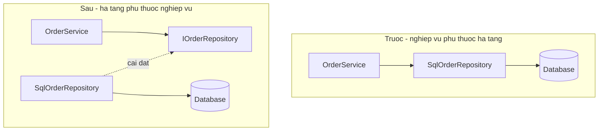

import { SummaryBox, Checklist, FAQSection } from '@site/src/components/SEO';

# 4.5 — 4. Interface

<SummaryBox>
Interface là **hợp đồng**: nó nói *làm được gì* mà không nói *làm bằng cách nào*. Nhưng giá trị thật không nằm ở việc "có thể có nhiều cài đặt" — phần lớn interface trong dự án thật chỉ có đúng một cài đặt. Giá trị nằm ở chỗ nó **đảo ngược hướng phụ thuộc**: tầng nghiệp vụ định nghĩa thứ nó cần, tầng hạ tầng đi theo, và nhờ vậy nghiệp vụ không còn phụ thuộc vào database hay nhà cung cấp email. Bài này cũng nói thẳng về mặt kia: **không phải class nào cũng cần interface**, và một `IFooService` chỉ để bọc `FooService` là nghi lễ chứ không phải thiết kế.
</SummaryBox>

## Mục tiêu bài học

Sau bài này bạn có thể:

- Viết interface mô tả **năng lực** thay vì mô tả class hiện có.
- Giải thích đảo ngược phụ thuộc và vẽ được hướng mũi tên trước/sau.
- Áp dụng tiêu chí chia nhỏ interface thay vì gom thành một khối lớn.
- Quyết định khi nào **không** cần interface.
- Dùng cài đặt tường minh và default interface method cho đúng chỗ.

## Nội dung bài học

### 4.5.1 — Hợp đồng, không phải cài đặt

```csharp
public interface IPaymentGateway
{
    Task<PaymentResult> ChargeAsync(decimal amount, string token, CancellationToken ct);
    Task RefundAsync(string transactionId, CancellationToken ct);
}

public class StripeGateway  : IPaymentGateway { /* gọi Stripe */ }
public class VnPayGateway   : IPaymentGateway { /* gọi VNPay */ }
public class FakeGateway    : IPaymentGateway { /* dùng trong test */ }
```

Code nghiệp vụ chỉ biết `IPaymentGateway`. Đổi nhà cung cấp là đổi một dòng đăng ký, không đụng tới logic đặt hàng.

Một class cài đặt được **nhiều** interface — đây là chỗ C# cho phép "đa kế thừa" mà không gặp vấn đề của đa kế thừa cài đặt:

```csharp
public class OrderRepository : IOrderReader, IOrderWriter, IDisposable { }
```

### 4.5.2 — Giá trị thật: đảo ngược hướng phụ thuộc

Đây là phần quan trọng nhất, và nó không phải chuyện "có nhiều cài đặt".



Ở sơ đồ dưới, mũi tên từ `SqlOrderRepository` **đi ngược lên** phía interface. Interface thuộc về tầng nghiệp vụ, và tầng hạ tầng phải đi theo nó.

Ba thứ có được từ việc đảo hướng này:

1. **Nghiệp vụ kiểm thử được mà không cần database.** Đây là lợi ích cụ thể nhất và cảm nhận được ngay.
2. **Nghiệp vụ không biết gì về EF Core, Dapper hay SQL.** Đổi ORM không làm sập tầng nghiệp vụ.
3. **Thứ tự viết code đổi chiều.** Bạn viết logic nghiệp vụ trước, khai báo thứ nó cần, rồi mới cài đặt — thay vì để cấu trúc bảng quyết định hình dạng nghiệp vụ.

Điểm 3 là điểm hay bị bỏ qua nhưng ảnh hưởng nhiều nhất tới kiến trúc.

### 4.5.3 — Interface nhỏ, đúng vai

```csharp
// QUÁ LỚN — người chỉ cần đọc vẫn phải cài đặt cả phần ghi
public interface IOrderService
{
    Task<Order> GetByIdAsync(int id);
    Task<List<Order>> SearchAsync(OrderFilter f);
    Task CreateAsync(Order o);
    Task UpdateAsync(Order o);
    Task DeleteAsync(int id);
    Task<byte[]> ExportToExcelAsync(OrderFilter f);
    Task SendConfirmationEmailAsync(int id);
}
```

Hai vấn đề cụ thể:

- Một bản giả trong test phải cài đặt cả bảy phương thức, kể cả khi bài test chỉ dùng một.
- `ExportToExcelAsync` và `SendConfirmationEmailAsync` **không cùng lý do thay đổi** với phần truy cập dữ liệu. Ghép chung nghĩa là đổi định dạng Excel cũng đụng vào interface của repository.

```csharp
// Chia theo VAI TRÒ của người dùng interface
public interface IOrderReader
{
    Task<Order?> GetByIdAsync(int id, CancellationToken ct);
    Task<IReadOnlyList<Order>> SearchAsync(OrderFilter f, CancellationToken ct);
}

public interface IOrderWriter
{
    Task CreateAsync(Order o, CancellationToken ct);
    Task UpdateAsync(Order o, CancellationToken ct);
}

public interface IOrderExporter
{
    Task<byte[]> ExportToExcelAsync(OrderFilter f, CancellationToken ct);
}
```

Một class vẫn cài đặt cả ba nếu muốn. Nhưng **người gọi chỉ khai báo phụ thuộc vào phần mình dùng** — và nhìn vào constructor của một service là biết ngay nó đọc hay ghi.

Tiêu chí chia: **nhóm theo vai trò của người dùng, không nhóm theo class cài đặt.**

### 4.5.4 — Khi nào **không** cần interface

Phần này ít tài liệu nói, nhưng quan trọng không kém.

```csharp
// Nghi lễ — interface chỉ để bọc đúng một class, không đảo phụ thuộc gì
public interface IOrderCalculator
{
    decimal CalculateTotal(Order o);
}
public class OrderCalculator : IOrderCalculator
{
    public decimal CalculateTotal(Order o) => o.Lines.Sum(l => l.Amount);
}
```

Interface trên không mang lại gì: chỉ có một cài đặt, không có ranh giới hạ tầng nào được vượt qua, và hàm thì thuần tuý nên test thẳng cũng được.

Ba câu hỏi để quyết định:

1. Nó có **vượt qua ranh giới hạ tầng** không? (database, HTTP, file, đồng hồ, hàng đợi) → **cần**.
2. Có **nhiều cài đặt thật** không? → **cần**.
3. Có cần **thay bằng bản giả** để test thứ khác không? → **cần**.

Cả ba đều "không" → viết class thẳng. Thêm interface sau cũng chỉ là một thao tác refactor nhỏ.

Đáng chú ý: một trong những chỗ **cần** interface mà người ta hay quên là **đồng hồ**. `DateTimeOffset.UtcNow` là một phụ thuộc hạ tầng trá hình, và nó làm code không test được cho các mốc thời gian cụ thể. .NET 8 đã đưa vào `TimeProvider` cho đúng việc này.

### 4.5.5 — Cài đặt tường minh

```csharp
public class Repository : IReadable, IWritable
{
    // Cài đặt ngầm — gọi được qua chính class
    public void Read() { }

    // Cài đặt TƯỜNG MINH — chỉ gọi được qua interface
    void IWritable.Write() { }
}

var repo = new Repository();
repo.Read();                        // OK
// repo.Write();                    // Lỗi biên dịch
((IWritable)repo).Write();          // OK
```

Hai chỗ dùng thật:

1. **Hai interface có phương thức trùng tên** nhưng nghĩa khác nhau.
2. **Muốn giấu bớt** phương thức khỏi API công khai của class — ví dụ `IDisposable.Dispose()` cài tường minh để người dùng phải dùng `using` thay vì gọi tay.

Dùng vừa phải. Cài đặt tường minh làm code khó đọc hơn nếu không có lý do rõ ràng.

### 4.5.6 — Default interface method (C# 8+)

```csharp
public interface ILogger
{
    void Log(LogLevel level, string message);

    // Cài đặt mặc định — lớp cài đặt không bắt buộc viết lại
    void LogError(string message) => Log(LogLevel.Error, message);
}
```

Mục đích ban đầu: **thêm phương thức vào interface đã phát hành mà không phá vỡ mọi cài đặt hiện có**. Đây là bài toán thật của tác giả thư viện.

Nhưng đừng dùng nó như cách chia sẻ code thông thường. Phương thức mặc định không truy cập được state, không override tự nhiên như class, và làm mờ ranh giới giữa hợp đồng và cài đặt. Trong code ứng dụng, một abstract class hoặc một extension method thường là lựa chọn rõ ràng hơn.

### 4.5.7 — Rà lại code của bạn

<Checklist
  title="Danh sách rà soát interface"
  items={[
    { text: "Mọi phụ thuộc vượt ranh giới hạ tầng đều đi qua interface." },
    { text: "Không có interface nào chỉ bọc một class mà không vượt ranh giới nào." },
    { text: "Interface nhóm theo vai trò người dùng, không nhóm theo class cài đặt." },
    { text: "Không có interface nào buộc bản giả trong test phải cài đặt phương thức không dùng." },
    { text: "Thời gian hiện tại đi qua TimeProvider hoặc một abstraction, không gọi UtcNow trực tiếp trong logic." },
    { text: "Interface đặt ở tầng nghiệp vụ, không đặt cùng chỗ với cài đặt hạ tầng." },
    { text: "Không dùng default interface method như cách chia sẻ code thông thường." },
  ]}
/>

## Bài tập áp dụng

1. **Vẽ lại hướng mũi tên.** Chọn một service trong dự án gọi thẳng `DbContext`. Vẽ sơ đồ phụ thuộc hiện tại. Thêm interface ở tầng nghiệp vụ và vẽ lại. Chỉ ra mũi tên nào đã đổi chiều.

2. **Đếm phương thức thừa trong test.** Tìm một interface lớn và một bài test dùng nó. Đếm số phương thức bản giả phải cài đặt so với số phương thức bài test thật sự gọi.

3. **Tách đồng hồ ra.** Tìm một hàm gọi `DateTimeOffset.UtcNow` bên trong. Đưa `TimeProvider` vào, rồi viết một test cho hành vi vào đúng 23:59:59 ngày 31/12 — điều mà phiên bản cũ không test được.

## Tự kiểm tra

<FAQSection
  items={[
    {
      question: "Giá trị thật của interface là gì?",
      answer: "Không phải chuyện có thể có nhiều cài đặt, vì phần lớn interface trong dự án thật chỉ có một. Giá trị nằm ở chỗ nó đảo ngược hướng phụ thuộc: tầng nghiệp vụ định nghĩa thứ nó cần, tầng hạ tầng đi theo. Nhờ đó nghiệp vụ kiểm thử được mà không cần database, và đổi ORM không làm sập tầng nghiệp vụ."
    },
    {
      question: "Nên chia interface theo tiêu chí nào?",
      answer: "Theo vai trò của người dùng interface, không theo class cài đặt. Một interface bảy phương thức buộc mọi bản giả trong test phải cài đặt cả bảy dù chỉ dùng một, và ghép những thứ không cùng lý do thay đổi vào một chỗ. Chia thành IOrderReader, IOrderWriter, IOrderExporter thì người gọi chỉ khai báo phần mình dùng."
    },
    {
      question: "Khi nào KHÔNG cần interface?",
      answer: "Khi cả ba câu hỏi đều trả lời không: nó không vượt ranh giới hạ tầng nào, không có nhiều cài đặt thật, và không cần thay bằng bản giả để test thứ khác. Một IFooService chỉ bọc FooService là nghi lễ chứ không phải thiết kế. Thêm interface sau cũng chỉ là một thao tác refactor nhỏ."
    },
    {
      question: "Vì sao thời gian hiện tại nên đi qua abstraction?",
      answer: "Vì DateTimeOffset.UtcNow là một phụ thuộc hạ tầng trá hình: nó làm hàm không test được cho các mốc thời gian cụ thể, ví dụ hành vi vào đúng cuối năm hay ngày 29 tháng 2. .NET 8 đã đưa vào TimeProvider đúng cho việc này."
    },
    {
      question: "Cài đặt tường minh dùng khi nào?",
      answer: "Hai trường hợp: khi hai interface có phương thức trùng tên nhưng nghĩa khác nhau, và khi muốn giấu bớt một phương thức khỏi API công khai của class — ví dụ cài tường minh IDisposable.Dispose để buộc người dùng dùng using. Ngoài hai trường hợp đó thì nó chỉ làm code khó đọc hơn."
    },
    {
      question: "Default interface method sinh ra để làm gì?",
      answer: "Để tác giả thư viện thêm được phương thức vào interface đã phát hành mà không phá vỡ mọi cài đặt hiện có. Nó không phải cách chia sẻ code thông thường: phương thức mặc định không truy cập được state, không override tự nhiên như class, và làm mờ ranh giới giữa hợp đồng với cài đặt."
    }
  ]}
/>

## Kết luận

Ba điều đáng nhớ nhất:

1. **Interface để đảo hướng phụ thuộc**, không phải để đếm số cài đặt.
2. **Chia theo vai trò người dùng.** Interface bảy phương thức là bảy lý do để thay đổi gộp vào một chỗ.
3. **Không phải class nào cũng cần interface.** Ba câu hỏi ở mục 4.5.4 trả lời được điều đó trong 10 giây.

## Tham khảo

- [Interfaces — C#](https://learn.microsoft.com/en-us/dotnet/csharp/fundamentals/types/interfaces)
- [Object-oriented programming in C#](https://learn.microsoft.com/en-us/dotnet/csharp/fundamentals/object-oriented/)
- [Framework design guidelines](https://learn.microsoft.com/en-us/dotnet/standard/design-guidelines/) — chọn giữa interface và abstract class
- [Singleton, Scoped hay Transient?](/blog/singleton-scoped-transient-captive-dependency) — đăng ký cài đặt cho interface

## Điều hướng

- **Bài trước:** [4.4 — 3. Inheritance và Polymorphism](4.4-inheritance-and-polymorphism.mdx)
- **Bài tiếp theo:** [4.6 — 5. Abstraction](4.6-abstraction.mdx)
- **Về module:** [Trang mục lục](./)
