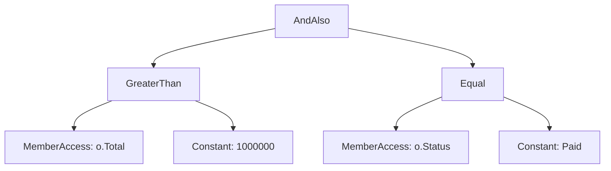

import { SummaryBox, Checklist, FAQSection } from '@site/src/components/SEO';

# 5.8 — 7. Expression Trees và Reflection (Overview)

<SummaryBox>
Hai cơ chế này trả lời cùng một câu hỏi — *"làm sao code biết về chính nó?"* — nhưng ở hai thời điểm khác nhau. **Expression tree** biến một lambda thành **cây dữ liệu mô tả nó**, để thứ khác đọc và dịch sang ngôn ngữ khác — đây chính là cách `_db.Orders.Where(o => o.Total > 100)` trở thành một câu `WHERE` trong SQL. **Reflection** đọc thông tin kiểu và gọi thành viên lúc chạy — nền của mọi DI container và serializer. Cả hai rất mạnh, và cả hai đều có **cái giá thật**: reflection chậm hơn gọi trực tiếp hàng chục tới hàng trăm lần, và cả hai đều xung đột với Native AOT cùng tính năng cắt tỉa mã.
</SummaryBox>

## Mục tiêu bài học

Sau bài này bạn có thể:

- Phân biệt `Func<T, bool>` với `Expression<Func<T, bool>>` và nói được cái nào dịch sang SQL được.
- Giải thích vì sao ORM cần expression tree.
- Dùng reflection để đọc thông tin kiểu, và biết khi nào nên tránh.
- Nêu cái giá hiệu năng và cách giảm bằng caching hoặc source generator.
- Biết vì sao cả hai gây khó cho Native AOT.

## Nội dung bài học

### 5.8.1 — Hai thứ rất giống nhau, khác nhau một chữ

```csharp
// Delegate — code ĐÃ BIÊN DỊCH, chỉ gọi được
Func<Order, bool> f = o => o.Total > 100_000m;
bool result = f(order);

// Expression tree — CÂY DỮ LIỆU mô tả đoạn code đó
Expression<Func<Order, bool>> e = o => o.Total > 100_000m;
Console.WriteLine(e);        // o => (o.Total > 100000)
```

Chỉ khác chữ `Expression<...>` bọc bên ngoài, nhưng bản chất hoàn toàn khác. Cái thứ hai **đọc ra được**:

```csharp
var body = (BinaryExpression)e.Body;
Console.WriteLine(body.NodeType);   // GreaterThan
Console.WriteLine(body.Left);       // o.Total
Console.WriteLine(body.Right);      // 100000
```

Cây đó có thể được duyệt và **dịch sang ngôn ngữ khác** — ví dụ SQL.

### 5.8.2 — Vì sao ORM cần expression tree

```csharp
// IQueryable nhận Expression -> dịch được sang SQL
IQueryable<Order> q = _db.Orders;
q.Where(o => o.Total > 100_000m);
// -> SELECT * FROM Orders WHERE Total > 100000

// IEnumerable nhận Func -> KHÔNG dịch được, phải chạy trong bộ nhớ
IEnumerable<Order> e = _db.Orders.AsEnumerable();
e.Where(o => o.Total > 100_000m);
// -> SELECT * FROM Orders   rồi lọc bằng C#
```

Nhìn vào chữ ký là thấy toàn bộ câu chuyện:

```csharp
// System.Linq.Enumerable
Where<T>(this IEnumerable<T> source, Func<T, bool> predicate)

// System.Linq.Queryable
Where<T>(this IQueryable<T> source, Expression<Func<T, bool>> predicate)
```

Đây là lời giải thích kỹ thuật cho cái bẫy `.ToList()` đặt sai chỗ ở [bài 5.4](5.3-linq.mdx): gọi `AsEnumerable()` hay `ToList()` là **đổi kiểu tham số từ `Expression` sang `Func`**, và từ đó không còn gì để dịch sang SQL nữa.

Hệ quả kèm theo: chỉ những biểu thức mà provider **biết cách dịch** mới dùng được. Gọi một hàm C# tự viết trong `Where` sẽ ném ngoại lệ, vì cây biểu thức chứa một nút mà EF Core không hiểu.

### 5.8.3 — Tự dựng expression tree

```csharp
// Tương đương: o => o.Total > 100000
var param = Expression.Parameter(typeof(Order), "o");
var body = Expression.GreaterThan(
    Expression.Property(param, nameof(Order.Total)),
    Expression.Constant(100_000m));

var lambda = Expression.Lambda<Func<Order, bool>>(body, param);

// Dùng trực tiếp với IQueryable
var result = await _db.Orders.Where(lambda).ToListAsync(ct);

// Hoặc biên dịch thành delegate để chạy trong bộ nhớ
Func<Order, bool> compiled = lambda.Compile();
```

Chỗ dùng thật của kỹ thuật này: **dựng bộ lọc động** khi người dùng chọn cột và toán tử ở giao diện, mà vẫn giữ được việc lọc chạy trong database.

Lưu ý về `Compile()`: nó **rất tốn kém** vì phải sinh IL lúc chạy. Gọi nó trong một vòng lặp hoặc trong mỗi request là một lỗi hiệu năng nghiêm trọng — hãy biên dịch một lần và cache lại.

### 5.8.4 — Reflection: đọc và gọi lúc chạy

```csharp
var type = typeof(Customer);

foreach (var prop in type.GetProperties())
    Console.WriteLine($"{prop.Name}: {prop.PropertyType.Name}");

// Tạo instance và gán giá trị mà không biết kiểu lúc biên dịch
var instance = Activator.CreateInstance(type)!;
type.GetProperty("Name")!.SetValue(instance, "Nguyen Van A");

// Tìm mọi lớp cài đặt một interface — nền của việc tự đăng ký DI
var handlers = Assembly.GetExecutingAssembly()
    .GetTypes()
    .Where(t => t.IsAssignableTo(typeof(IEventHandler)) && !t.IsAbstract);
```

Bạn dùng reflection mỗi ngày mà không biết: DI container phân giải constructor bằng nó, `System.Text.Json` đọc thuộc tính bằng nó, ASP.NET Core tìm controller và action bằng nó, EF Core ánh xạ entity sang bảng bằng nó.

### 5.8.5 — Cái giá

```csharp
// Gọi trực tiếp — nhanh nhất
var name = customer.Name;

// Reflection — chậm hơn hàng chục tới hàng trăm lần
var name = typeof(Customer).GetProperty("Name")!.GetValue(customer);

// Reflection có cache — nhanh hơn nhiều
private static readonly PropertyInfo NameProp = typeof(Customer).GetProperty("Name")!;
var name = NameProp.GetValue(customer);

// Biên dịch thành delegate một lần — gần bằng gọi trực tiếp
private static readonly Func<Customer, string> GetName = BuildGetter();
var name = GetName(customer);
```

Phần chậm nhất của reflection là **tra cứu metadata** (`GetProperty`, `GetMethod`), không phải lời gọi. Nên quy tắc là: **tra cứu một lần, cache lại, dùng nhiều lần**.

Hướng hiện đại hơn là **source generator**: sinh mã lúc biên dịch thay vì suy diễn lúc chạy. `System.Text.Json` đã có chế độ này, cho hiệu năng gần bằng mã viết tay và hoạt động được với AOT.

### 5.8.6 — Xung đột với Native AOT và trimming

Đây là điểm ngày càng quan trọng.

**Trimming** loại bỏ mã không được tham chiếu để giảm kích thước. **Native AOT** biên dịch thẳng sang mã máy lúc build, như đã nói ở [bài 2.10](/docs/dotnet-backend-zero-to-senior/stage-01-foundation/module-02-computer-science-basics/2.9-dotnet-runtime-and-ecosystem).

Cả hai đều cần biết **lúc biên dịch** những gì sẽ được dùng. Reflection phá vỡ giả định đó:

```csharp
// Trình phân tích không thấy được kiểu này được dùng -> có thể bị cắt mất
var type = Type.GetType(configuration["HandlerType"]!)!;
var handler = Activator.CreateInstance(type);
```

Kết quả là ngoại lệ lúc chạy, và **chỉ xuất hiện ở bản build đã trim** — không tái hiện được khi chạy debug. Đây là loại lỗi rất khó chẩn đoán.

Cách xử lý, theo thứ tự nên dùng:

1. **Dùng source generator** thay cho reflection ở những chỗ có sẵn (`System.Text.Json`, logging, `RegexGenerator`).
2. **Đăng ký tường minh** thay vì quét assembly.
3. Nếu buộc phải dùng reflection, gắn `[DynamicallyAccessedMembers]` để trình phân tích biết giữ lại gì.

Nếu dự án của bạn không dùng AOT thì chưa phải lo. Nhưng đây là hướng mà .NET đang đi, nên mỗi chỗ dùng reflection là một khoản nợ tương lai.

### 5.8.7 — Rà lại code của bạn

<Checklist
  title="Danh sách rà soát expression tree và reflection"
  items={[
    { text: "Hiểu rõ chỗ nào trong code chuyển từ IQueryable sang IEnumerable." },
    { text: "Không gọi Expression.Compile() trong vòng lặp hay trong mỗi request." },
    { text: "Mọi kết quả GetProperty, GetMethod dùng lặp lại đều được cache trong static readonly." },
    { text: "Không quét assembly trong đường chạy nóng; chỉ quét một lần lúc khởi động." },
    { text: "Ưu tiên source generator ở những chỗ có sẵn thay cho reflection." },
    { text: "Nếu nhắm tới AOT hoặc trimming, đã rà soát mọi chỗ dùng reflection." },
    { text: "Bộ lọc động dựng bằng expression tree để lọc vẫn chạy trong database." },
  ]}
/>

## Bài tập áp dụng

#### Bài 1 — Nhìn vào cây biểu thức

Tạo `Expression<Func<Order, bool>>` cho một điều kiện có hai vế nối bằng `&&`. In ra `NodeType`, `Left`, `Right` của từng nút và vẽ lại cây bằng tay.

**Tiêu chí hoàn thành:** bạn giải thích được vì sao EF Core **dịch được** biểu thức này thành SQL còn một `Func` thì không.

<details>
<summary><strong>Gợi ý và lời giải — Bài 1</strong></summary>

**Gợi ý.** Khác biệt giữa `Func<Order, bool>` và `Expression<Func<Order, bool>>` chỉ là một từ, nhưng thứ trình biên dịch sinh ra hoàn toàn khác nhau: một bên là **mã máy chạy được**, một bên là **cấu trúc dữ liệu mô tả mã đó**.

**Lời giải.**

```csharp
Expression<Func<Order, bool>> bieuThuc =
    o => o.Total > 1_000_000m && o.Status == OrderStatus.Paid;

var than = (BinaryExpression)bieuThuc.Body;
Console.WriteLine($"gốc      : {than.NodeType}");           // AndAlso
Console.WriteLine($"  trái   : {than.Left.NodeType}  {than.Left}");
Console.WriteLine($"  phải   : {than.Right.NodeType} {than.Right}");

var trai = (BinaryExpression)than.Left;
Console.WriteLine($"    trái.trái  : {trai.Left.NodeType}  {trai.Left}");
Console.WriteLine($"    trái.phải  : {trai.Right.NodeType} {trai.Right}");
```

**Kết quả:**

```text
gốc      : AndAlso
  trái   : GreaterThan  (o.Total > 1000000)
  phải   : Equal        (o.Status == Paid)
    trái.trái  : MemberAccess  o.Total
    trái.phải  : Constant      1000000
```

**Cây vẽ ra:**



**Vì sao EF Core dịch được.** Nhà cung cấp truy vấn **đi qua cây này** và sinh ra SQL tương ứng cho từng loại nút:

| Nút trong cây | SQL sinh ra |
|---|---|
| `AndAlso` | `AND` |
| `GreaterThan` | `>` |
| `Equal` | `=` |
| `MemberAccess: o.Total` | `o."Total"` |
| `Constant: 1000000` | tham số `@p0` |

Kết quả:

```sql
WHERE o."Total" > @p0 AND o."Status" = @p1
```

**Vì sao `Func` thì không.** `Func<Order, bool>` đã được biên dịch thành **mã máy**. EF Core nhận được một con trỏ hàm và không có cách nào biết bên trong nó làm gì — nó chỉ gọi được hàm đó với một `Order` cụ thể. Vì vậy EF Core buộc phải **tải toàn bộ bảng về** rồi mới lọc trong bộ nhớ.

Đây chính là khác biệt giữa `IQueryable<T>` và `IEnumerable<T>` mà [bài 5.4](5.3-linq.mdx) đo bằng câu SQL sinh ra:

```csharp
IQueryable<Order> q = db.Orders;
q.Where(o => o.Total > 1000);        // nhận Expression -> dịch sang SQL

IEnumerable<Order> e = db.Orders;
e.Where(o => o.Total > 1000);        // nhận Func -> lọc trong bộ nhớ
```

Hai dòng trông giống hệt nhau. Khác biệt duy nhất là **kiểu của biến**, và nó quyết định toàn bộ hành vi.

**Một hệ quả thực tế.** Đây là lý do một phương thức helper có thể âm thầm phá hỏng truy vấn:

```csharp
// Phá hỏng — tham số là Func
public IEnumerable<Order> Loc(IQueryable<Order> q, Func<Order, bool> dk)
    => q.Where(dk);      // chuyển sang lọc trong bộ nhớ

// Giữ nguyên — tham số là Expression
public IQueryable<Order> Loc(IQueryable<Order> q, Expression<Func<Order, bool>> dk)
    => q.Where(dk);      // vẫn dịch được sang SQL
```

Khi viết hàm nhận điều kiện lọc và truyền xuống `IQueryable`, **luôn** dùng `Expression<Func<...>>`.

</details>

#### Bài 2 — Đo giá của reflection

Đọc một thuộc tính một triệu lần theo bốn cách: trực tiếp, reflection không cache, reflection có cache `PropertyInfo`, và delegate biên dịch sẵn. Lập bảng tỉ lệ.

**Tiêu chí hoàn thành:** bạn biết cách nào đáng dùng khi thật sự cần reflection trong đường dẫn nóng.

<details>
<summary><strong>Gợi ý và lời giải — Bài 2</strong></summary>

**Gợi ý.** Làm nóng trước và lấy giá trị nhỏ nhất của nhiều lần chạy, như [bài 1.8](../../stage-01-foundation/module-01-programming-logic/1.7-data-structures-and-big-o.mdx) đã nêu. Ngoài ra phải **dùng** kết quả, nếu không JIT sẽ loại bỏ luôn vòng lặp.

**Lời giải.**

```csharp
var pi = typeof(Cust).GetProperty("Name")!;
var getter = (Func<Cust, string>)Delegate.CreateDelegate(
    typeof(Func<Cust, string>), pi.GetGetMethod()!);

// 1. trực tiếp
for (int i = 0; i < N; i++) sink += c.Name.Length;

// 2. reflection không cache — GetProperty mỗi vòng
for (int i = 0; i < N; i++)
    sink += ((string)typeof(Cust).GetProperty("Name")!.GetValue(c)!).Length;

// 3. reflection có cache PropertyInfo
for (int i = 0; i < N; i++) sink += ((string)pi.GetValue(c)!).Length;

// 4. delegate biên dịch sẵn
for (int i = 0; i < N; i++) sink += getter(c).Length;
```

**Kết quả đo thật trên .NET 9, chế độ Release, một triệu lần:**

```text
trực tiếp              :   1 ms    1.0x
reflection không cache :  93 ms     93x
reflection có cache    :  16 ms     16x
delegate biên dịch sẵn :   3 ms    3.0x
```

**Đọc bảng này:**

- **Bản thân `GetProperty` là phần đắt nhất.** Chỉ cần lưu lại `PropertyInfo` là giảm từ 93x xuống 16x — cải thiện gần 6 lần chỉ bằng một biến `static readonly`.
- **`GetValue` vẫn tốn kém.** 16x là vì mỗi lần gọi phải kiểm tra kiểu, xử lý tham số, và có thể boxing giá trị trả về.
- **Delegate biên dịch sẵn gần bằng gọi trực tiếp.** 3x là chi phí của một lời gọi delegate thay vì lời gọi trực tiếp được nội tuyến.

**Đây là kỹ thuật mà các thư viện hiệu năng cao dùng.** Thay vì gọi `GetValue` mỗi lần, dựng một delegate **một lần** cho mỗi thuộc tính rồi lưu lại:

```csharp
public static class FastAccessor<T>
{
    private static readonly Dictionary<string, Func<T, object?>> _cache = TaoCache();

    private static Dictionary<string, Func<T, object?>> TaoCache()
    {
        var d = new Dictionary<string, Func<T, object?>>();
        foreach (var p in typeof(T).GetProperties())
        {
            var param = Expression.Parameter(typeof(T), "x");
            var body = Expression.Convert(Expression.Property(param, p), typeof(object));
            d[p.Name] = Expression.Lambda<Func<T, object?>>(body, param).Compile();
        }
        return d;
    }

    public static object? Doc(T obj, string ten) => _cache[ten](obj);
}
```

Kết hợp với mẫu `static` theo kiểu generic ở [bài 5.3](5.2-generics.mdx): cache được dựng đúng một lần cho mỗi kiểu, không cần khoá.

**Khi nào reflection là lựa chọn đúng.** Khi nó chạy **một lần lúc khởi động** hoặc **vài lần mỗi request**, không phải trong vòng lặp triệu lần. Ví dụ hợp lý: quét assembly để đăng ký DI, đọc thuộc tính cấu hình lúc khởi động, dựng metadata cho tuần tự hoá.

**Và một xu hướng đáng biết.** .NET đang dịch chuyển khỏi reflection lúc chạy sang **sinh mã lúc biên dịch** (source generator). `System.Text.Json` có bộ sinh mã riêng cho phép tuần tự hoá **không cần reflection**, vừa nhanh hơn vừa tương thích với Native AOT và cắt tỉa assembly:

```csharp
[JsonSerializable(typeof(Customer))]
internal partial class CrmJsonContext : JsonSerializerContext { }

JsonSerializer.Serialize(customer, CrmJsonContext.Default.Customer);
```

[Module 19](../../stage-05-senior-engineering/module-19-performance-engineering/) bàn về đánh đổi giữa hai hướng này.

</details>

#### Bài 3 — Bộ lọc động bằng expression tree

Viết một hàm nhận tên cột và giá trị, dựng `Expression` tương ứng, rồi áp vào `IQueryable`. Bật log SQL và xác nhận điều kiện lọc thật sự xuất hiện trong câu lệnh.

**Tiêu chí hoàn thành:** câu SQL sinh ra có mệnh đề `WHERE`, và bạn nêu được rủi ro bảo mật của cách làm này.

<details>
<summary><strong>Gợi ý và lời giải — Bài 3</strong></summary>

**Gợi ý.** Cần dựng ba phần: tham số đầu vào, truy cập thuộc tính, và phép so sánh với hằng số. Rồi gói chúng thành một lambda.

**Lời giải.**

```csharp
public static IQueryable<T> LocTheo<T>(this IQueryable<T> nguon, string tenCot, object giaTri)
{
    var thamSo = Expression.Parameter(typeof(T), "x");

    var thuocTinh = typeof(T).GetProperty(tenCot,
        BindingFlags.Public | BindingFlags.Instance | BindingFlags.IgnoreCase)
        ?? throw new ArgumentException($"Không có cột {tenCot}", nameof(tenCot));

    var truyCap = Expression.Property(thamSo, thuocTinh);
    var hangSo  = Expression.Constant(Convert.ChangeType(giaTri, thuocTinh.PropertyType));
    var soSanh  = Expression.Equal(truyCap, hangSo);

    var lambda = Expression.Lambda<Func<T, bool>>(soSanh, thamSo);
    return nguon.Where(lambda);
}
```

Dùng:

```csharp
var kq = await db.Customers.LocTheo("Region", "HN").ToListAsync(ct);
```

SQL sinh ra:

```sql
SELECT c."Id", c."Name", c."Region", ...
FROM "Customers" AS c
WHERE c."Region" = 'HN'
```

Điều kiện đã xuống tới database — đúng như mong muốn.

**Rủi ro bảo mật.** Thoạt nhìn có vẻ an toàn vì không nối chuỗi SQL, nhưng có **ba** rủi ro thật:

1. **Lộ cột không nên lộ.** `tenCot` đến từ người dùng, nên họ lọc được theo **bất kỳ** thuộc tính nào, kể cả `PasswordHash`, `InternalNote`, `CreditLimit`. Bằng cách thử nhiều giá trị và quan sát số kết quả, kẻ tấn công **suy ra được** giá trị của cột đó — một dạng tấn công kênh bên.

2. **Tấn công từ chối dịch vụ.** Lọc theo cột không có chỉ mục trên bảng lớn buộc database quét toàn bảng. Gửi vài chục request như vậy là đủ làm quá tải.

3. **Lộ cấu trúc dữ liệu.** Thông báo lỗi `"Không có cột X"` cho biết cột nào tồn tại, giúp kẻ tấn công vẽ bản đồ lược đồ.

**Sửa bằng danh sách cho phép:**

```csharp
private static readonly HashSet<string> CotChoPhep =
    new(StringComparer.OrdinalIgnoreCase) { "Region", "Status", "CreatedAt" };

public static IQueryable<T> LocTheo<T>(this IQueryable<T> nguon, string tenCot, object giaTri)
{
    if (!CotChoPhep.Contains(tenCot))
        throw new ArgumentException("Không hỗ trợ lọc theo trường này", nameof(tenCot));
    // ...
}
```

Danh sách **cho phép** chứ không phải danh sách **cấm** — thêm một cột nhạy cảm vào entity sau này sẽ không tự động bị lộ. Đây là cùng một nguyên tắc với việc tách DTO khỏi entity ở [bài 9.2](../../stage-03-aspnet-core-backend/module-09-web-api-professional/9.1-rest-api-design-principles.mdx).

**Khi nào nên tự dựng expression tree.** Ít khi. Ba lựa chọn thường tốt hơn:

| Nhu cầu | Giải pháp |
|---|---|
| Lọc động theo vài cột cố định | Chuỗi `if` với `Where` thường — đơn giản và an toàn |
| Truy vấn báo cáo phức tạp | Viết SQL thẳng, hoặc dùng view |
| Bộ lọc thật sự tuỳ biến | Thư viện có sẵn như `System.Linq.Dynamic.Core`, đã xử lý các vấn đề trên |

Tự dựng expression tree chỉ nên làm khi bạn cần điều mà các lựa chọn trên không đáp ứng được — và khi đó hãy nhớ rằng bạn đang nhận thêm trách nhiệm về bảo mật.

</details>

## Tự kiểm tra

<FAQSection
  items={[
    {
      question: "Func và Expression của Func khác nhau ra sao?",
      answer: "Func là code đã biên dịch, chỉ gọi được. Expression của Func là một cây dữ liệu mô tả chính đoạn code đó, nên đọc ra được và dịch sang ngôn ngữ khác được. Đó là lý do IQueryable nhận Expression để dịch sang SQL, còn IEnumerable nhận Func và chạy trong bộ nhớ."
    },
    {
      question: "Vì sao gọi ToList sớm lại làm mất khả năng dịch sang SQL?",
      answer: "Vì nó đổi kiểu tham số từ Expression sang Func. Sau khi đã là IEnumerable, mọi Where nhận một delegate đã biên dịch chứ không phải cây biểu thức, nên không còn gì để provider đọc và dịch sang SQL. Toàn bộ dữ liệu phải được kéo về trước rồi mới lọc bằng C#."
    },
    {
      question: "Vì sao gọi một hàm C# tự viết trong Where của EF Core lại lỗi?",
      answer: "Vì cây biểu thức khi đó chứa một nút gọi phương thức mà provider không biết cách dịch sang SQL. EF Core 3.0 trở lên ném ngoại lệ thay vì âm thầm kéo cả bảng về như phiên bản cũ, và đó là hành vi tốt hơn vì nó buộc bạn quyết định."
    },
    {
      question: "Phần nào của reflection là chậm nhất?",
      answer: "Việc tra cứu metadata như GetProperty hay GetMethod, chứ không phải lời gọi. Nên quy tắc là tra cứu một lần rồi cache PropertyInfo vào một static readonly, và dùng lại nhiều lần. Nhanh hơn nữa là biên dịch thành delegate một lần, cho hiệu năng gần bằng gọi trực tiếp."
    },
    {
      question: "Vì sao reflection xung đột với Native AOT và trimming?",
      answer: "Vì cả hai cần biết lúc biên dịch những gì sẽ được dùng, để cắt bỏ phần còn lại hoặc sinh sẵn mã máy. Reflection tra cứu kiểu lúc chạy, thường từ chuỗi trong cấu hình, nên trình phân tích không thấy được và có thể cắt mất kiểu đó. Lỗi chỉ xuất hiện ở bản build đã trim, không tái hiện khi debug."
    },
    {
      question: "Source generator giải quyết vấn đề gì?",
      answer: "Nó sinh mã lúc biên dịch thay vì suy diễn lúc chạy, nên vừa nhanh gần bằng mã viết tay, vừa hoạt động được với AOT và trimming vì mọi thứ đều hiện diện lúc build. System.Text.Json đã có chế độ này, và đó là hướng .NET đang đi để thay dần reflection."
    }
  ]}
/>

## Kết luận

Ba điều đáng nhớ nhất:

1. **`Expression` là code dưới dạng dữ liệu.** Đó là toàn bộ lý do ORM dịch được LINQ sang SQL.
2. **Reflection chậm ở khâu tra cứu, không ở khâu gọi.** Cache `PropertyInfo` là hầu hết những gì bạn cần làm.
3. **Mỗi chỗ dùng reflection là một khoản nợ với AOT.** Ưu tiên source generator ở nơi có sẵn.

## Tham khảo

- [Expression trees](https://learn.microsoft.com/en-us/dotnet/csharp/advanced-topics/expression-trees/)
- [Reflection in .NET](https://learn.microsoft.com/en-us/dotnet/fundamentals/reflection/reflection)
- [Native AOT deployment](https://learn.microsoft.com/en-us/dotnet/core/deploying/native-aot/) — hạn chế với reflection
- [LINQ overview](https://learn.microsoft.com/en-us/dotnet/csharp/linq/) — nơi expression tree được dùng nhiều nhất

## Điều hướng

- **Bài trước:** [5.6 — 6. Nullable Reference Types (C# 8+)](5.6-nullable-reference-types.mdx)
- **Bài tiếp theo:** [5.8 — 8. Tuples và Deconstruction](5.8-tuples-and-deconstruction.mdx)
- **Về module:** [Trang mục lục](./)
