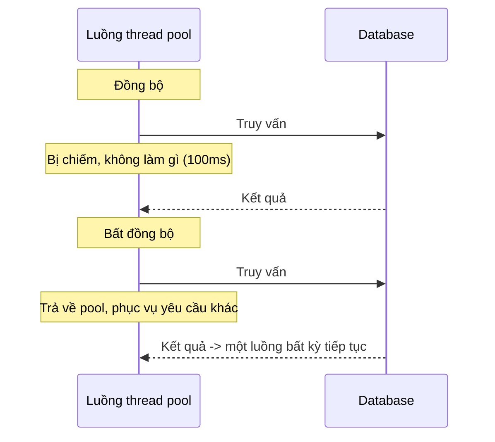
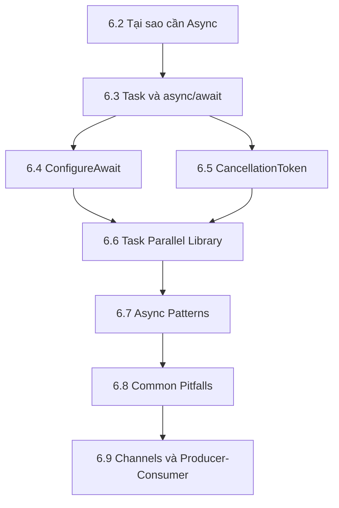

import { SummaryBox, Checklist, FAQSection } from '@site/src/components/SEO';

# 6.1 — Định hướng Module 6: Lập trình bất đồng bộ

<SummaryBox>
Câu hiểu nhầm phổ biến nhất về `async` là nó **tạo thêm luồng để chạy song song**. Sự thật ngược lại: mục đích chính của `async` I/O là **không giữ luồng nào cả** trong lúc chờ. Hiểu sai điều này dẫn thẳng tới hai sự cố tốn kém nhất trong ứng dụng .NET thực tế — **deadlock** khi gọi `.Result` và **thread pool starvation** khi chặn luồng hàng loạt. Cả hai đều không hiện ra lúc phát triển với một người dùng, và cùng bùng phát vào ngày có tải thật.
</SummaryBox>

## Module này giải quyết vấn đề gì

Một API đơn giản: nhận yêu cầu, gọi database, trả kết quả. Truy vấn mất 100 mili-giây. Viết đồng bộ:

```csharp
public Customer GetCustomer(int id)
{
    return _db.Customers.Find(id);   // luồng đứng chờ 100ms
}
```

Trong 100 mili-giây đó, luồng xử lý **không làm gì cả** — nó chỉ chờ dữ liệu từ mạng. Nhưng nó vẫn bị chiếm, vẫn tốn khoảng một megabyte bộ nhớ ngăn xếp, và không phục vụ được yêu cầu nào khác.

Thread pool của .NET mặc định bắt đầu với số luồng bằng số nhân CPU, và chỉ tăng thêm rất chậm — khoảng **một hoặc hai luồng mỗi giây**. Với máy 8 nhân, khi 200 yêu cầu đồng thời cùng chờ database, 8 luồng bị chiếm hết và 192 yêu cầu còn lại xếp hàng chờ thread pool nở ra. Người dùng thấy API "chậm đột ngột", còn biểu đồ CPU thì gần như bằng không — dấu hiệu đặc trưng và rất dễ chẩn đoán nhầm.

Viết bất đồng bộ:

```csharp
public async Task<Customer> GetCustomerAsync(int id, CancellationToken ct)
{
    return await _db.Customers.FindAsync(new object[] { id }, ct);
}
```

Khi gặp `await`, luồng **được trả lại thread pool** và đi phục vụ yêu cầu khác. Khi dữ liệu về, hệ điều hành báo lên và một luồng bất kỳ tiếp tục phần còn lại của hàm. Cùng 8 luồng đó giờ phục vụ được hàng nghìn yêu cầu đang chờ.



Câu tóm gọn của Stephen Cleary, và cũng là nhan đề bài viết kinh điển về chủ đề này: **không có luồng nào cả**. Trong lúc chờ I/O, không luồng nào đang thực hiện công việc chờ đợi đó.

## Bạn cần gì trước khi bắt đầu

<Checklist
  title="Điều kiện đầu vào"
  items={[
    { text: "Đã xong Module 4 và Module 5: viết được lớp, interface, và dùng được LINQ." },
    { text: "Đã đọc bài 2.10 về .NET runtime, đặc biệt phần thread pool." },
    { text: "Gọi được một HTTP API từ code bằng HttpClient." },
    { text: "Có một trình gỡ lỗi dùng được — module này cần đặt điểm dừng để quan sát luồng." },
    { text: "Dành được khoảng 12–14 giờ. Đây là module dễ hiểu sai nhất trong Stage 2." },
  ]}
/>

## Bản đồ module

Tám bài đi theo đúng thứ tự một người mắc lỗi rồi sửa:



| Bài | Câu hỏi bài này trả lời | Thời lượng |
|---|---|---|
| [6.2 — Tại sao cần Async](6.2-why-async-matters.mdx) | Thread pool starvation xảy ra thế nào và trông ra sao trên biểu đồ? | 75 phút |
| [6.3 — Task và async/await](6.3-task-and-async-await.mdx) | Trình biên dịch biến hàm `async` thành cái gì? | 120 phút |
| [6.4 — ConfigureAwait](6.4-configureawait.mdx) | Synchronization context là gì, và vì sao thư viện nên dùng `false`? | 75 phút |
| [6.5 — CancellationToken](6.5-cancellationtoken.mdx) | Làm sao dừng việc đang chạy khi người dùng đã đóng trình duyệt? | 90 phút |
| [6.6 — Task Parallel Library](6.6-task-parallel-library.mdx) | Gọi ba dịch vụ song song và gộp kết quả bằng cách nào? | 90 phút |
| [6.7 — Async Patterns](6.7-async-patterns.mdx) | Stream dữ liệu lớn mà không nạp hết vào bộ nhớ bằng cách nào? | 90 phút |
| [6.8 — Common Pitfalls](6.8-common-pitfalls.mdx) | Những cách viết nào gây deadlock, và vì sao? | 90 phút |
| [6.9 — Channels và Producer-Consumer](6.9-channels-and-producer-consumer.mdx) | Nối một bên sinh việc với một bên xử lý việc thế nào? | 90 phút |

Phần bổ trợ: [6.10 — Mở rộng và đào sâu](6.10-advanced-notes.mdx), [6.11 — Mini case study](6.11-mini-case-study.mdx), [6.12 — Ví dụ thực tế nhanh](6.12-quick-real-world-example.mdx), [6.13 — Review and Assessment](6.13-review-and-assessment.mdx).

## Kết quả đầu ra đo được

| Năng lực | Cách tự kiểm chứng |
|---|---|
| Giải thích "không có luồng nào cả" | Nói được luồng đi đâu trong lúc `await` một truy vấn database |
| Truyền `CancellationToken` xuyên suốt | Rà một chuỗi gọi 4 tầng và xác nhận token đi tới tận cùng |
| Gọi song song đúng cách | Viết đoạn gọi 3 dịch vụ bằng `Task.WhenAll` và đo thời gian giảm |
| Nhận ra deadlock trước khi chạy | Nhìn `.Result` trong một hàm và nói được vì sao nó treo |
| Nhận ra thread pool starvation | Nhìn biểu đồ CPU thấp mà độ trễ cao và đoán đúng nguyên nhân |
| Stream dữ liệu lớn | Xuất 1 triệu dòng CSV bằng `IAsyncEnumerable` với bộ nhớ gần như không đổi |
| Dựng hàng đợi trong tiến trình | Viết producer-consumer bằng `Channel` có giới hạn dung lượng |

## Sản phẩm bàn giao của module

Một **bộ so sánh có số liệu** — vì async là chủ đề mà trực giác hay sai, nên phải đo:

```text
1. Một API có hai endpoint làm cùng một việc: một đồng bộ, một bất đồng bộ
2. Kịch bản tạo tải 200 yêu cầu đồng thời (bombardier, k6, hoặc script tự viết)
3. Bảng kết quả: thông lượng, độ trễ trung vị, độ trễ phân vị 95, số luồng dùng
4. Một đoạn code cố ý gây deadlock bằng .Result, kèm giải thích cơ chế
5. Một tác vụ xuất CSV 1 triệu dòng dùng IAsyncEnumerable, đo bộ nhớ đỉnh
6. Một hàng đợi Channel xử lý nền, có giới hạn dung lượng và huỷ được
```

Bảng ở mục 3 là phần giá trị nhất. Nó biến "async tốt hơn" từ một câu người ta bảo thành một con số bạn tự đo. Kỹ năng đo này chính là thứ [Module 19 — Performance Engineering](../../stage-05-senior-engineering/module-19-performance-engineering/) xây tiếp.

## Lộ trình học gợi ý

| Ngày | Nội dung | Việc phải xong |
|---|---|---|
| 1 | 6.2 | Giải thích được thread pool starvation bằng lời của mình |
| 2 | 6.3 | Viết được chuỗi gọi async 3 tầng không chỗ nào chặn |
| 3 | 6.4 + 6.5 | Token huỷ đi tới tận truy vấn database |
| 4 | 6.6 | Đo được thời gian giảm khi chuyển sang `Task.WhenAll` |
| 5 | 6.7 | Xuất CSV lớn với bộ nhớ ổn định |
| 6 | 6.8 | Tái hiện deadlock rồi sửa |
| 7 | 6.9 → 6.13 | Hoàn tất bảng đo, làm bài tự chấm 6.13 |

## Ba sai lầm thường gặp khi học module này

**Một — nghĩ `async` nghĩa là "chạy song song".** Đây là hiểu nhầm gốc, và nó sinh ra mọi hiểu nhầm khác. `async` giải quyết vấn đề **chờ đợi**, không phải vấn đề **tính toán**. Với công việc tốn CPU thuần — mã hoá, nén, xử lý ảnh — `async` không giúp gì; thứ cần dùng là `Task.Run` hoặc `Parallel.ForEach`. Ngược lại, với công việc chờ I/O — gọi database, gọi API, đọc file — `async` là công cụ đúng và `Task.Run` chỉ tổ lãng phí một luồng.

**Hai — gọi `.Result` hoặc `.Wait()` "chỉ chỗ này thôi".** Đây là câu người ta hay nói trước khi gây ra sự cố production. Trong ngữ cảnh có synchronization context — ứng dụng desktop, hoặc ASP.NET bản cũ — `.Result` gây deadlock lập tức. Trong ASP.NET Core thì không deadlock, nhưng vẫn chặn một luồng thread pool, và khi một endpoint bị gọi nhiều thì đó chính là nguyên nhân starvation. Quy tắc không ngoại lệ: **async đi tới đâu thì async tới cùng**, từ controller xuống tận lời gọi database.

**Ba — bỏ qua `CancellationToken` vì "chưa cần".** Khi người dùng đóng tab trình duyệt, ASP.NET Core huỷ token của yêu cầu đó. Nếu code của bạn không truyền token xuống, truy vấn database vẫn chạy tới cùng, vẫn chiếm kết nối, vẫn tốn CPU cho một kết quả không ai nhận. Trên hệ thống có tải, phần công việc vô ích này tích tụ rất nhanh. Thêm một tham số vào chữ ký hàm ngay từ đầu rẻ hơn nhiều so với đi sửa hàng trăm hàm về sau.

## Bài tập khởi động

Làm trước khi vào 6.2. Không cần chạy code — chỉ cần đọc và dự đoán.

> **Đề bài.** Bốn đoạn code dưới đây cùng gọi ba dịch vụ, mỗi dịch vụ mất đúng 1 giây. Với **mỗi đoạn**, trả lời: (a) mất tổng bao lâu, (b) chiếm bao nhiêu luồng trong lúc chờ, (c) có vấn đề gì không.
>
> ```csharp
> // A
> var a = await _svc1.GetAsync();
> var b = await _svc2.GetAsync();
> var c = await _svc3.GetAsync();
>
> // B
> var ta = _svc1.GetAsync();
> var tb = _svc2.GetAsync();
> var tc = _svc3.GetAsync();
> await Task.WhenAll(ta, tb, tc);
>
> // C
> var a = _svc1.GetAsync().Result;
> var b = _svc2.GetAsync().Result;
> var c = _svc3.GetAsync().Result;
>
> // D
> await Task.Run(async () => await _svc1.GetAsync());
> await Task.Run(async () => await _svc2.GetAsync());
> await Task.Run(async () => await _svc3.GetAsync());
> ```

<details>
<summary><strong>Gợi ý — hai câu hỏi tách bạch</strong></summary>

Đừng trộn hai câu hỏi làm một. Hãy hỏi riêng:

1. **Lời gọi bắt đầu lúc nào?** Một `Task` khởi động ngay khi phương thức được gọi, chứ không phải khi bạn `await` nó. Vậy đoạn nào khởi động cả ba trước khi chờ cái nào?
2. **Trong lúc chờ, luồng ở đâu?** `await` trả luồng về pool. Truy cập `.Result` thì không — nó giữ luồng lại cho tới khi có kết quả.

Riêng đoạn D, hãy hỏi thêm: `Task.Run` đẩy công việc sang một luồng thread pool. Nhưng công việc bên trong lại là `await` một thao tác I/O, vốn **không cần luồng nào** trong lúc chờ. Vậy luồng được mượn ra đó đang làm gì?

</details>

<details>
<summary><strong>Hướng dẫn giải — đọc sau khi đã tự làm</strong></summary>

| | Thời gian | Luồng bị chiếm khi chờ | Đánh giá |
|---|---|---|---|
| **A** | ~3 giây | 0 | Đúng cú pháp, nhưng tuần tự không cần thiết |
| **B** | ~1 giây | 0 | **Đúng nhất** |
| **C** | ~3 giây | 1 (bị chặn suốt) | Sai — nguy cơ deadlock và starvation |
| **D** | ~3 giây | 1 mỗi lần, vô ích | Sai — tốn luồng mà không nhanh hơn |

**A.** Mỗi `await` chờ xong rồi mới gọi cái tiếp theo, nên ba giây nối tiếp. Nhưng luồng được trả về pool trong lúc chờ, nên không chiếm tài nguyên. Cách viết này **không sai** — nó chỉ chậm khi ba lời gọi vốn độc lập với nhau. Nếu lời gọi sau cần kết quả của lời gọi trước thì đây lại là cách duy nhất đúng.

**B.** Ba `Task` khởi động ngay tại ba dòng đầu và chạy chồng lấn nhau. `Task.WhenAll` chờ cả ba, nên tổng thời gian bằng lời gọi lâu nhất, khoảng một giây. Đây là cách đúng cho các lời gọi độc lập. Lưu ý một chi tiết hay bị bỏ: nếu **nhiều** task cùng ném ngoại lệ, `await Task.WhenAll` chỉ ném ra ngoại lệ đầu tiên; muốn đủ cả thì phải đọc thuộc tính `Exception` của task tổng hợp.

**C.** Sai nghiêm trọng nhất. `.Result` **chặn luồng hiện tại** cho tới khi có kết quả. Hai hậu quả:

- Trong ngữ cảnh có synchronization context (WPF, WinForms, ASP.NET bản cũ), phần tiếp theo của hàm `async` cần quay lại đúng luồng đang bị chặn để chạy tiếp — mà luồng đó đang chờ chính nó. Đó là **deadlock** kinh điển, treo vĩnh viễn.
- Trong ASP.NET Core không có context nên không deadlock, nhưng một luồng thread pool bị giam suốt ba giây. Khi endpoint này được gọi đồng thời nhiều lần, thread pool cạn và toàn bộ ứng dụng chậm theo.

**D.** Trường hợp tinh vi nhất và đáng suy nghĩ nhất. Nó không deadlock, nhưng vô nghĩa: `Task.Run` mượn một luồng thread pool để chạy một công việc mà ngay lập tức `await` một thao tác I/O — tức là luồng vừa mượn xong lại được trả về ngay. Kết quả là bạn trả chi phí chuyển ngữ cảnh mà không được lợi gì, và vẫn tuần tự ba giây vì `await` ngay sau mỗi `Task.Run`. Quy tắc: **`Task.Run` dành cho công việc tốn CPU, không dành cho I/O.**

**Điều rút ra.** Nếu bạn dự đoán đúng A và B, bạn đã nắm phần lớn `async`. Nếu giải thích được vì sao C deadlock và D lãng phí, bạn đã ở trên mức trung bình đáng kể — hai lỗi đó xuất hiện trong code production nhiều hơn người ta tưởng.

</details>

## Tự kiểm tra đầu vào

<FAQSection
  items={[
    {
      question: "async có tạo thêm luồng không?",
      answer: "Không, và đây là điểm cốt lõi của cả module. Với thao tác I/O, trong lúc chờ thì không có luồng nào đang thực hiện công việc chờ đợi đó cả. Luồng gọi được trả về thread pool ngay tại điểm await, và khi hệ điều hành báo dữ liệu đã về thì một luồng bất kỳ trong pool tiếp tục phần còn lại của hàm. Chính vì vậy async giúp một máy phục vụ nhiều yêu cầu đồng thời hơn mà không cần thêm luồng, chứ nó không làm cho một yêu cầu đơn lẻ chạy nhanh hơn."
    },
    {
      question: "Vì sao gọi .Result lại gây deadlock?",
      answer: "Trong môi trường có synchronization context như WPF, WinForms hay ASP.NET bản cũ, phần code sau await phải quay lại đúng luồng ban đầu để chạy tiếp. Nếu luồng đó đang bị chặn vì bạn gọi .Result, nó không thể nhận phần tiếp theo, mà phần tiếp theo lại là thứ cần chạy xong mới có kết quả để .Result trả về. Hai bên chờ nhau vĩnh viễn. ASP.NET Core không có synchronization context nên không deadlock, nhưng vẫn giam một luồng thread pool và đó là nguyên nhân starvation."
    },
    {
      question: "Thread pool starvation biểu hiện thế nào trên hệ thống thật?",
      answer: "Dấu hiệu đặc trưng là độ trễ tăng vọt trong khi CPU gần như rảnh. Nhiều người nhìn thấy vậy rồi kết luận nhầm là database chậm hoặc mạng có vấn đề. Nguyên nhân thật là các luồng thread pool đều bị chặn vì chờ I/O theo kiểu đồng bộ, nên yêu cầu mới phải xếp hàng. Thread pool có nở thêm nhưng rất chậm, chỉ khoảng một tới hai luồng mỗi giây, nên hệ thống mất vài phút mới hồi phục. Bài 6.2 trình bày cách xác nhận bằng số liệu thay vì đoán."
    },
    {
      question: "Khi nào nên dùng Task.Run?",
      answer: "Chỉ khi có công việc tốn CPU thật sự mà bạn muốn đẩy khỏi luồng hiện tại, ví dụ xử lý ảnh, nén dữ liệu hoặc tính toán nặng trong ứng dụng có giao diện. Với thao tác I/O thì không nên, vì thao tác I/O vốn đã không cần luồng trong lúc chờ, và bọc nó trong Task.Run chỉ tốn thêm một lần chuyển ngữ cảnh mà không nhanh hơn. Trong ASP.NET Core, dùng Task.Run cho I/O còn phản tác dụng vì nó lấy đi luồng khỏi pool đang phục vụ các yêu cầu khác."
    },
    {
      question: "ConfigureAwait(false) có phải lúc nào cũng nên thêm không?",
      answer: "Nên thêm khi bạn viết thư viện dùng chung, vì thư viện không biết nó sẽ chạy trong môi trường nào và việc quay lại context ban đầu vừa không cần thiết vừa tốn kém. Trong code ứng dụng ASP.NET Core thì không cần, vì ASP.NET Core không có synchronization context nên ConfigureAwait(false) không thay đổi gì. Trong ứng dụng có giao diện thì ngược lại, không được thêm ở những chỗ sau đó cần cập nhật giao diện, vì việc đó bắt buộc phải chạy trên luồng UI."
    },
    {
      question: "Vì sao phải truyền CancellationToken nếu công việc vẫn chạy xong được?",
      answer: "Vì công việc chạy xong cho một người dùng đã bỏ đi là công việc lãng phí, và nó vẫn chiếm kết nối database, CPU và bộ nhớ. Khi người dùng đóng tab, ASP.NET Core huỷ token của yêu cầu đó ngay; nếu token được truyền xuống tận truy vấn thì truy vấn dừng lại và tài nguyên được giải phóng. Trên hệ thống có tải cao, phần công việc vô ích này tích tụ đủ để ảnh hưởng tới người dùng còn lại. Thêm tham số từ đầu rẻ hơn nhiều so với sửa hàng trăm chữ ký hàm về sau."
    }
  ]}
/>

## Kết luận

1. **`async` giải quyết vấn đề chờ đợi, không phải vấn đề tính toán.** Nhớ đúng câu này thì phần lớn lỗi tự tránh được.
2. **Async đi tới đâu thì async tới cùng.** Một `.Result` ở giữa chuỗi đủ để phá hỏng toàn bộ lợi ích.
3. **Đo, đừng tin trực giác.** Sản phẩm bàn giao của module là một bảng số liệu chính vì lý do đó.

## Tham khảo

- [Asynchronous programming with async and await](https://learn.microsoft.com/en-us/dotnet/csharp/asynchronous-programming/) — hướng dẫn chính thức
- [Async guidance — David Fowler](https://github.com/davidfowl/AspNetCoreDiagnosticScenarios/blob/master/AsyncGuidance.md) — tài liệu thực chiến được trích dẫn nhiều nhất trong cộng đồng .NET
- [There Is No Thread — Stephen Cleary](https://blog.stephencleary.com/2013/11/there-is-no-thread.html) — bài giải thích kinh điển về điều gì thực sự xảy ra khi chờ I/O
- [Cancellation in managed threads](https://learn.microsoft.com/en-us/dotnet/standard/threading/cancellation-in-managed-threads) — mô hình huỷ tác vụ hợp tác

## Điều hướng

- **Hub lộ trình:** [00. Lộ trình From Zero → Senior .NET (Backend-first)](../../roadmap-dotnet-backend-zero-to-senior.mdx)
- **Bài trước:** Không có (bài mở đầu module).
- **Bài tiếp theo:** [6.2 — Tại sao cần Async?](6.2-why-async-matters.mdx)
- **Module trước:** [Module 5 — Advanced C#](../module-05-advanced-csharp/)
- **Module tiếp theo:** [Module 7 — Dependency Injection](../module-07-dependency-injection/)
- **Về module:** [Trang mục lục](./)
