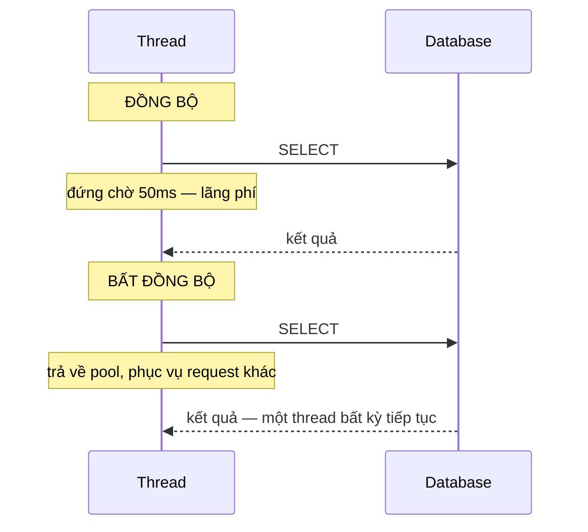

import { SummaryBox, Checklist, FAQSection } from '@site/src/components/SEO';

# 6.2 — Tại sao cần Async?

<SummaryBox>
Hiểu lầm phổ biến nhất về async: nó **không làm một request chạy nhanh hơn**. Một truy vấn database mất 50ms thì vẫn mất 50ms. Thứ async thay đổi là **thread đang làm gì trong 50ms đó**: với code đồng bộ, thread ngồi chờ và không làm gì khác; với async, nó được trả về thread pool và phục vụ request khác. Con số cụ thể cho thấy vì sao điều này quan trọng: thread pool của .NET mặc định chỉ tạo thêm khoảng **một thread mỗi giây** khi bị cạn, nên một API đồng bộ gặp 200 người dùng đồng thời sẽ xếp hàng dài hàng phút — trong khi CPU gần như rảnh rỗi.
</SummaryBox>

## Mục tiêu bài học

Sau bài này bạn có thể:

- Giải thích async giải phóng thread như thế nào, và vì sao nó không giảm độ trễ của một request.
- Phân biệt công việc **I/O-bound** với **CPU-bound** và chọn cách xử lý đúng.
- Nêu cơ chế thread pool starvation và vì sao nó làm hệ thống chậm dần.
- Ước lượng được ngưỡng mà một API đồng bộ bắt đầu sụp.
- Biết khi nào async **không** giúp gì.

## Nội dung bài học

### 6.2.1 — Thread đang làm gì trong lúc chờ

```csharp
// ĐỒNG BỘ — thread bị giữ suốt 50ms chờ database
public Order GetOrder(int id)
{
    var order = _db.Orders.Find(id);     // thread đứng chờ, không làm gì
    return order;
}

// BẤT ĐỒNG BỘ — thread được trả lại pool trong lúc chờ
public async Task<Order?> GetOrderAsync(int id, CancellationToken ct)
{
    var order = await _db.Orders.FindAsync([id], ct);   // thread đi phục vụ request khác
    return order;
}
```



Cả hai đều mất 50ms cho **một** request. Khác biệt chỉ xuất hiện khi có **nhiều** request cùng lúc.

### 6.2.2 — Thread pool và ngưỡng sụp đổ

Thread pool của .NET khởi đầu với số thread bằng số nhân CPU. Khi mọi thread đều bận và còn việc trong hàng đợi, nó tạo thêm thread mới — nhưng **rất chậm**, khoảng **một thread mỗi giây** theo mặc định.

Lý do của việc giới hạn đó: mỗi thread tốn khoảng 1 MB bộ nhớ stack, và quá nhiều thread làm hệ điều hành mất thời gian chuyển ngữ cảnh nhiều hơn là làm việc.

Hệ quả với một API đồng bộ trên máy 8 nhân:

| Số request đồng thời | Code đồng bộ | Code bất đồng bộ |
|---|---|---|
| 8 | Chạy ngay | Chạy ngay |
| 50 | 42 request xếp hàng, chờ ~42 giây | Chạy gần như ngay |
| 200 | Chờ tới vài phút, nhiều request timeout | Vẫn ổn |

Hiện tượng này gọi là **thread pool starvation**, và nó có một triệu chứng rất dễ nhận ra nhưng dễ chẩn đoán sai:

> **Hệ thống chậm dần, timeout khắp nơi, nhưng CPU chỉ 10–15%.**

Người ta thường phản ứng bằng cách thêm CPU hoặc thêm máy. Không giúp gì cả, vì nút cổ chai không phải CPU — mà là số thread đang ngồi chờ I/O.

### 6.2.3 — I/O-bound và CPU-bound

Đây là phân biệt quyết định bạn dùng công cụ nào.

| | I/O-bound | CPU-bound |
|---|---|---|
| Thời gian trôi vào | Chờ thiết bị/mạng | Tính toán |
| Ví dụ | Query database, gọi HTTP, đọc file | Nén ảnh, mã hoá, tính toán số |
| Thread trong lúc đó | **Không làm gì** | Chạy hết công suất |
| Công cụ đúng | `async`/`await` | `Task.Run`, `Parallel` |

```csharp
// I/O-bound -> async
public async Task<Order?> GetAsync(int id, CancellationToken ct)
    => await _db.Orders.FindAsync([id], ct);

// CPU-bound -> Task.Run để không chặn thread đang phục vụ request
public async Task<byte[]> CompressAsync(byte[] data, CancellationToken ct)
    => await Task.Run(() => Compress(data), ct);
```

Một điểm quan trọng và hay bị làm sai: **bọc `Task.Run` quanh code I/O không giúp gì**, nó chỉ chuyển việc chờ sang một thread khác của cùng pool.

```csharp
// VÔ NGHĨA — vẫn chiếm một thread để ngồi chờ, chỉ là thread khác
await Task.Run(() => _db.Orders.Find(id));

// ĐÚNG
await _db.Orders.FindAsync([id], ct);
```

Trong ứng dụng ASP.NET Core, `Task.Run` cho CPU-bound cũng cần cân nhắc: nó lấy thread từ **chính pool đang phục vụ request**. Với việc tính toán nặng và kéo dài, hàng đợi nền hoặc một dịch vụ riêng là lựa chọn đúng hơn.

### 6.2.4 — Async không giúp gì trong ba trường hợp

**1. Ứng dụng console chạy tuần tự.** Không có ai để nhường thread cho.

**2. Chỉ có đúng một request tại một thời điểm.** Async thêm chi phí máy trạng thái mà không đổi lại gì.

**3. Công việc thuần CPU.** Không có lúc nào "chờ" để mà giải phóng thread.

Async cũng **không miễn phí**: trình biên dịch sinh ra một máy trạng thái cho mỗi phương thức `async`, và mỗi `await` chưa hoàn thành ngay sẽ cấp phát. Với một phương thức được gọi hàng triệu lần trong vòng lặp nóng, chi phí đó có thật.

Nhưng trong backend web — nơi hầu hết thời gian trôi vào database và HTTP — async gần như luôn đúng.

### 6.2.5 — Quy tắc "async suốt chuỗi"

```csharp
// SAI — chặn ở giữa chuỗi, phá bỏ toàn bộ lợi ích
public async Task<IActionResult> Get(int id)
{
    var order = _service.GetOrderAsync(id).Result;   // chặn thread!
    return Ok(order);
}

// ĐÚNG — async từ controller xuống tận database
public async Task<IActionResult> Get(int id, CancellationToken ct)
{
    var order = await _service.GetOrderAsync(id, ct);
    return Ok(order);
}
```

Gọi `.Result` hay `.Wait()` không chỉ mất lợi ích — trong một số môi trường nó còn **treo cứng ứng dụng**. Cơ chế deadlock đó được mổ xẻ trong bài [Gọi .Result khi nào thì deadlock, khi nào thì không?](/blog/deadlock-result-wait-csharp), và được nói tiếp ở [bài 6.4](6.3-configureawait.mdx) cùng [bài 6.8](6.7-common-pitfalls.mdx).

Nguyên tắc: **một chuỗi gọi đã async thì phải async suốt**, từ điểm vào tới tận thư viện I/O.

### 6.2.6 — Rà lại hệ thống của bạn

<Checklist
  title="Danh sách rà soát async"
  items={[
    { text: "Mọi thao tác I/O trong đường xử lý request đều dùng phiên bản async." },
    { text: "Không có .Result hay .Wait() nào trong code chạy theo request." },
    { text: "Không bọc Task.Run quanh code I/O." },
    { text: "Công việc CPU nặng và kéo dài đi qua hàng đợi nền, không chiếm thread của request." },
    { text: "Đã đo được tỉ lệ CPU khi hệ thống chậm — nếu CPU thấp mà vẫn timeout thì nghi thread pool." },
    { text: "Chuỗi gọi async liên tục từ controller xuống tới thư viện I/O." },
  ]}
/>

## Bài tập áp dụng

#### Bài 1 — Tái hiện thread pool starvation

Viết hai endpoint: một gọi `Thread.Sleep(1000)`, một gọi `await Task.Delay(1000)`. Gửi 200 request đồng thời vào mỗi cái. So sánh thời gian phản hồi và mức CPU.

**Tiêu chí hoàn thành:** bạn nêu được **cặp triệu chứng** đặc trưng của starvation, và vì sao nó hay bị chẩn đoán nhầm.

<details>
<summary><strong>Gợi ý và lời giải — Bài 1</strong></summary>

**Gợi ý.** Cả hai endpoint đều "chờ một giây". Khác biệt duy nhất là **luồng có bị giam trong lúc chờ hay không**.

**Lời giải.**

```csharp
app.MapGet("/dong-bo", () =>
{
    Thread.Sleep(1000);          // giam một luồng thread pool trong 1 giây
    return Results.Ok();
});

app.MapGet("/async", async () =>
{
    await Task.Delay(1000);      // trả luồng về pool trong lúc chờ
    return Results.Ok();
});
```

Tạo tải:

```bash
bombardier -c 200 -n 200 http://localhost:5000/dong-bo
bombardier -c 200 -n 200 http://localhost:5000/async
```

**Kết quả điển hình trên máy 8 nhân:**

| | `/dong-bo` | `/bat-dong-bo` |
|---|---|---|
| Thời gian hoàn tất 200 request | ~25–90 giây | ~1,1 giây |
| Độ trễ phân vị 95 | rất cao, tăng dần | ~1,05 giây |
| **CPU** | **gần 0%** | gần 0% |
| Số luồng thread pool | tăng dần, 1–2 mỗi giây | ổn định ~8 |

**Cặp triệu chứng đặc trưng: độ trễ rất cao trong khi CPU gần bằng không.**

**Vì sao con số 25–90 giây.** Thread pool khởi đầu với số luồng bằng số nhân CPU, ở đây là 8. Tám request đầu chạy ngay. 192 request còn lại xếp hàng. Thread pool **có** nở thêm, nhưng rất chậm — khoảng một tới hai luồng mỗi giây. Vì vậy hệ thống phải mất hàng chục giây mới đủ luồng phục vụ hết.

**Vì sao hay bị chẩn đoán nhầm.** Người vận hành nhìn biểu đồ CPU thấy gần 0% và kết luận: *"máy chủ còn rảnh, chắc do database chậm hoặc mạng có vấn đề"*. Họ đi tối ưu truy vấn, tăng cấu hình máy, thêm chỉ mục — không cái nào có tác dụng, vì nguyên nhân nằm ở chỗ khác hoàn toàn.

**Cách xác nhận bằng số liệu thay vì đoán:**

```bash
dotnet-counters monitor --process-id <pid> --counters System.Runtime
```

Nhìn hai chỉ số:

| Chỉ số | Dấu hiệu starvation |
|---|---|
| `threadpool-queue-length` | **Tăng vọt** — đây là bằng chứng trực tiếp |
| `threadpool-thread-count` | Tăng chậm, đều đặn 1–2 mỗi giây |

`threadpool-queue-length` cao nghĩa là có việc đang xếp hàng chờ luồng. Kết hợp với CPU thấp, kết luận gần như chắc chắn.

**Ba nguồn chặn luồng phổ biến trong code thật:**

```csharp
var result = GoiApiAsync().Result;           // 1. .Result
GoiApiAsync().Wait();                    // 2. .Wait()
var result = GoiApiAsync().GetAwaiter().GetResult();   // 3. tưởng là "an toàn hơn" — không phải
```

Cả ba đều giam luồng. Cách thứ ba đặc biệt nguy hiểm vì nhiều người tin rằng nó tránh được vấn đề — nó chỉ tránh được việc ngoại lệ bị bọc trong `AggregateException`, còn việc chặn luồng thì y hệt.

**Cách phòng.** Bật bộ phân tích và biến cảnh báo thành lỗi:

```xml
<PropertyGroup>
  <WarningsAsErrors>$(WarningsAsErrors);CA2007;CA1849</WarningsAsErrors>
</PropertyGroup>
```

`CA1849` cảnh báo khi gọi phương thức đồng bộ trong ngữ cảnh đã có bản bất đồng bộ.

</details>

#### Bài 2 — Chứng minh `Task.Run` không giúp gì cho I/O

Viết ba phiên bản của cùng một truy vấn: đồng bộ, bọc `Task.Run`, và async thật. Đo thông lượng dưới tải và theo dõi số luồng của pool.

**Tiêu chí hoàn thành:** bạn giải thích được vì sao bản `Task.Run` **không** tốt hơn bản đồng bộ một cách đáng kể.

<details>
<summary><strong>Gợi ý và lời giải — Bài 2</strong></summary>

**Gợi ý.** `Task.Run` đẩy công việc sang một luồng thread pool. Nhưng công việc đó là gì — tính toán, hay chờ đợi? Và luồng được mượn ra làm gì trong lúc chờ?

**Lời giải.**

```csharp
// 1. Đồng bộ — giam luồng đang xử lý request
app.MapGet("/v1", () => { var result = GetDataSync(); return Results.Ok(result); });

// 2. Task.Run — mượn MỘT luồng khác rồi cũng giam nó
app.MapGet("/v2", async () => { var result = await Task.Run(GetDataSync); return Results.Ok(result); });

// 3. Async thật — không giam luồng nào
app.MapGet("/v3", async (CancellationToken ct) => { var result = await GetDataAsync(ct); return Results.Ok(result); });
```

**Kết quả điển hình với 200 request đồng thời:**

| | Thông lượng | Số luồng pool | Luồng bị giam |
|---|---|---|---|
| `/v1` đồng bộ | Thấp | Tăng dần | 1 mỗi request |
| `/v2` `Task.Run` | **Thấp tương tự** | Tăng dần | 1 mỗi request, cộng chi phí chuyển ngữ cảnh |
| `/v3` async thật | Cao | Ổn định | **0** |

**Vì sao `Task.Run` không giúp.** Nó chỉ **dời** chỗ chặn, không **loại bỏ** việc chặn:

```text
Đồng bộ:
  Luồng A (xử lý request) ──── bị giam 1 giây ────> trả kết quả

Task.Run:
  Luồng A (xử lý request) ──await──> trả về pool
  Luồng B (mượn từ pool)  ──── bị giam 1 giây ────> đánh thức luồng A

  -> Tổng số luồng bị giam: vẫn 1. Cộng thêm hai lần chuyển ngữ cảnh.
```

Cả hai bản đều tiêu tốn **một luồng thread pool cho mỗi request đang chờ**. Bản `Task.Run` còn tệ hơn một chút vì tốn thêm chi phí điều phối.

**Khi nào `Task.Run` là đúng.** Chỉ khi công việc **thật sự tốn CPU**:

```csharp
// ĐÚNG — xử lý ảnh là công việc CPU, mất 2 giây tính toán thật
var thumbnail = await Task.Run(() => CreateThumbnail(image), ct);
```

Ngay cả ở đây cũng cần thận trọng trong ASP.NET Core: `Task.Run` lấy một luồng **khỏi chính pool đang phục vụ các request khác**. Với công việc CPU nặng và thường xuyên, giải pháp đúng là đẩy sang một tác vụ nền hoặc một dịch vụ riêng, như [Module 14](../../stage-04-database-production/module-14-caching-background-jobs/) trình bày.

**Bảng phân biệt hai loại công việc:**

| | I/O-bound | CPU-bound |
|---|---|---|
| Ví dụ | Database, HTTP, đọc file | Mã hoá, nén, xử lý ảnh, tính toán |
| Trong lúc chờ | **Không cần luồng nào** | Luôn cần một luồng |
| Công cụ đúng | `async`/`await` | `Task.Run`, `Parallel.ForEach` |
| Dùng nhầm công cụ | Lãng phí luồng | Chặn luồng gọi |

**Câu hỏi phân biệt.** *Trong lúc thao tác này diễn ra, CPU có đang làm việc không?* Không thì đó là I/O — dùng `async`. Có thì đó là CPU — và lúc đó mới nghĩ tới `Task.Run`.

</details>

#### Bài 3 — Đo chi phí của máy trạng thái

Viết một phương thức `async` trả về giá trị có sẵn, gọi mười triệu lần. So với phiên bản đồng bộ và với `ValueTask`.

**Tiêu chí hoàn thành:** bạn có con số, **và** kết luận đúng về việc nó có đáng quan tâm trong bối cảnh của bạn hay không.

<details>
<summary><strong>Gợi ý và lời giải — Bài 3</strong></summary>

**Gợi ý.** Khi một phương thức `async` hoàn tất **đồng bộ** — không thật sự chờ gì — nó vẫn phải cấp phát một đối tượng `Task` và chạy qua máy trạng thái. Đó là chi phí bạn đang đo.

**Lời giải.**

```csharp
static int Sync(int x) => x + 1;
static async Task<int> AsyncCoSan(int x) => x + 1;      // cảnh báo CS1998 — có chủ ý
static ValueTask<int> VtCoSan(int x) => new(x + 1);

const int N = 10_000_000;
// ... làm nóng, rồi đo từng vòng lặp
```

**Kết quả đo thật trên .NET 9, chế độ Release:**

```text
đồng bộ          :   6 ms   (0.60 ns/lần)
async Task       : 485 ms   (48.51 ns/lần)  81.0x
ValueTask có sẵn :  30 ms   ( 2.95 ns/lần)   4.9x
```

**Kết luận đúng — và đây là phần quan trọng nhất của bài.** Tỉ lệ **81 lần** nghe rất lớn. Nhưng hãy nhìn con số tuyệt đối: **48 nano-giây**.

Đặt vào bối cảnh một API handler thật:

| Thao tác | Thời gian |
|---|---|
| Máy trạng thái async | 0,000048 ms |
| Một truy vấn database | 2–10 ms |
| Một lời gọi HTTP nội bộ | 5–50 ms |
| Tuần tự hoá JSON một đối tượng vừa | 0,01–0,1 ms |

Chi phí async chiếm khoảng **một phần trăm nghìn** thời gian của một truy vấn database. Kết luận thực dụng: **trong code backend thông thường, chi phí này hoàn toàn không đáng quan tâm**, và đánh đổi lấy khả năng phục vụ nhiều request đồng thời là hoàn toàn xứng đáng.

**Khi nào nó đáng quan tâm — hai trường hợp:**

1. **Phương thức được gọi hàng triệu lần trong vòng lặp nóng**, và **thường hoàn tất đồng bộ**. Ví dụ điển hình là một hàm đọc cache: 95% số lần giá trị đã có sẵn trong bộ nhớ, chỉ 5% phải đi lấy từ nguồn.

2. **Thư viện nền tảng** nơi chi phí nhân lên qua mọi người dùng.

Ở hai trường hợp đó, `ValueTask` là công cụ đúng — nó **không cấp phát** khi kết quả có sẵn:

```csharp
public ValueTask<Customer?> GetAsync(int id, CancellationToken ct)
{
    if (_cache.TryGetValue(id, out var customer))
        return new ValueTask<Customer?>(customer);    // không cấp phát

    return new ValueTask<Customer?>(LoadFromDbAsync(id, ct));   // chỉ cấp phát khi cần
}
```

Số đo cho thấy `ValueTask` giảm từ 48,51 ns xuống 2,95 ns — **hơn 16 lần**.

**Ba hạn chế của `ValueTask`, phải biết trước khi dùng:**

1. **Chỉ được `await` đúng một lần.** `await` lần thứ hai cho hành vi không xác định.
2. **Không được gọi `.Result` khi chưa hoàn tất.**
3. **Không dùng được với `Task.WhenAll` trực tiếp** — phải gọi `.AsTask()` trước, và lúc đó lại cấp phát.

**Khuyến nghị.** Mặc định dùng `Task`. Chỉ chuyển sang `ValueTask` khi bạn đã **đo** và xác nhận rằng chỗ đó là nút thắt. Đây là ví dụ tốt cho nguyên tắc của [Module 19](../../stage-05-senior-engineering/module-19-performance-engineering/): đo trước, tối ưu sau — và phần lớn tối ưu người ta tưởng là cần thì không cần.

</details>

## Tự kiểm tra

<FAQSection
  items={[
    {
      question: "Async có làm request chạy nhanh hơn không?",
      answer: "Không. Một truy vấn mất 50ms thì vẫn mất 50ms. Thứ async thay đổi là thread đang làm gì trong 50ms đó: thay vì ngồi chờ, nó được trả về thread pool để phục vụ request khác. Lợi ích chỉ xuất hiện khi có nhiều request cùng lúc."
    },
    {
      question: "Thread pool starvation là gì và nhận biết thế nào?",
      answer: "Là khi mọi thread trong pool đều bận ngồi chờ I/O, còn request mới phải xếp hàng. Thread pool .NET chỉ tạo thêm khoảng một thread mỗi giây khi bị cạn, nên hàng đợi kéo dài rất nhanh. Triệu chứng đặc trưng: hệ thống chậm dần và timeout khắp nơi trong khi CPU chỉ mười tới mười lăm phần trăm."
    },
    {
      question: "I/O-bound và CPU-bound khác nhau ra sao về cách xử lý?",
      answer: "I/O-bound là thời gian trôi vào việc chờ thiết bị hoặc mạng, thread không làm gì cả, nên dùng async await để giải phóng nó. CPU-bound là thời gian trôi vào tính toán, thread chạy hết công suất, nên async không giúp gì; ở đó dùng Task.Run hoặc thư viện song song."
    },
    {
      question: "Vì sao bọc Task.Run quanh code I/O là vô nghĩa?",
      answer: "Vì nó chỉ chuyển việc ngồi chờ sang một thread khác của cùng pool, tổng số thread bị chiếm không đổi. Thread pool vẫn cạn như cũ. Cách đúng là gọi phiên bản async thật của thao tác I/O đó, để không thread nào phải chờ."
    },
    {
      question: "Async có tốn kém gì không?",
      answer: "Có. Trình biên dịch sinh một máy trạng thái cho mỗi phương thức async, và mỗi await chưa hoàn thành ngay đều cấp phát. Với phương thức gọi hàng triệu lần trong vòng lặp nóng thì chi phí đó có thật. Nhưng trong backend web, nơi phần lớn thời gian trôi vào database và HTTP, async gần như luôn đúng."
    },
    {
      question: "Async suốt chuỗi nghĩa là gì?",
      answer: "Nghĩa là một chuỗi gọi đã async thì phải async liên tục từ điểm vào tới tận thư viện I/O, không được chặn ở giữa bằng .Result hay .Wait(). Chặn ở giữa vừa mất hết lợi ích giải phóng thread, vừa có thể gây deadlock trong một số môi trường."
    }
  ]}
/>

## Kết luận

Ba điều đáng nhớ nhất:

1. **Async không giảm độ trễ, nó tăng thông lượng.** Nhầm hai thứ này là nguồn của mọi hiểu lầm còn lại.
2. **CPU thấp mà vẫn timeout là dấu hiệu thread pool starvation.** Thêm máy không giúp gì.
3. **Async phải liên tục suốt chuỗi.** Một chỗ chặn ở giữa là đủ phá bỏ toàn bộ lợi ích.

## Tham khảo

- [Asynchronous programming in C#](https://learn.microsoft.com/en-us/dotnet/csharp/asynchronous-programming/)
- [Task asynchronous programming model](https://learn.microsoft.com/en-us/dotnet/csharp/asynchronous-programming/task-asynchronous-programming-model)
- [ASP.NET Core best practices](https://learn.microsoft.com/en-us/aspnet/core/fundamentals/best-practices) — phần tránh chặn thread
- [dotnet-counters](https://learn.microsoft.com/en-us/dotnet/core/diagnostics/dotnet-counters) — theo dõi số thread của pool

## Điều hướng

- **Bài trước:** Không có (bài mở đầu module).
- **Bài tiếp theo:** [6.2 — 1. Task và async/await](6.2-task-and-async-await.mdx)
- **Về module:** [Trang mục lục](./)

## Bài liên quan

- [Gọi .Result khi nào thì deadlock, khi nào thì không?](/blog/deadlock-result-wait-csharp) — Gọi .Result hay .Wait() trên một Task treo cứng ứng dụng WPF và ASP.NET Framework, nhưng chạy bình thường trong console và ASP.NET Core.
