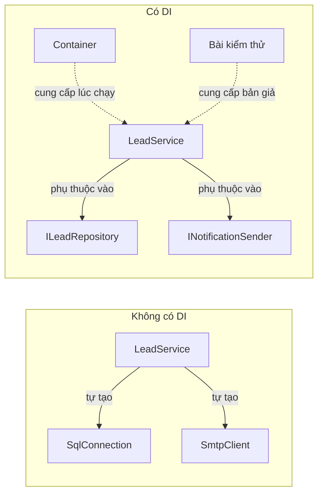
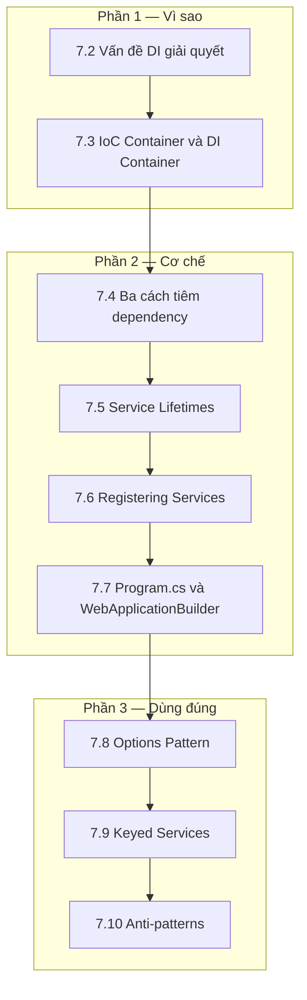

import { SummaryBox, Checklist, FAQSection } from '@site/src/components/SEO';

# 7.1 — Định hướng Module 7: Dependency Injection

<SummaryBox>
Dependency Injection thường được dạy như một nghi lễ: khai báo interface, đăng ký trong `Program.cs`, nhận qua constructor — không ai giải thích **đổi lại được gì**. Module này bắt đầu từ vấn đề: một lớp tự tạo ra phụ thuộc của mình là một lớp **không kiểm thử được**, và không kiểm thử được nghĩa là mỗi lần sửa đều phải chạy thử cả hệ thống bằng tay. DI đảo chiều việc tạo phụ thuộc để có thể thay thế chúng. Phần khó thật sự không nằm ở cú pháp mà ở **vòng đời**: chọn sai giữa `Singleton`, `Scoped` và `Transient` tạo ra lỗi chỉ xuất hiện khi có nhiều người dùng đồng thời.
</SummaryBox>

## Module này giải quyết vấn đề gì

Quay lại lớp đã gặp ở [Module 5](../module-05-advanced-csharp/5.1-module-orientation.mdx):

```csharp
public class LeadService
{
    public void CreateLead(string name, string email)
    {
        using var conn = new SqlConnection("Server=prod;...");  // tự tạo
        var smtp = new SmtpClient("smtp.company.com");          // tự tạo
        var logger = new FileLogger("C:\\logs\\leads.txt");     // tự tạo
        // ...
    }
}
```

Lớp này **tự quyết định** phụ thuộc của nó là gì. Hệ quả rất cụ thể:

- Muốn viết một bài kiểm thử cho quy tắc "email phải hợp lệ", bạn buộc phải có database production, máy chủ SMTP thật, và ổ đĩa `C:\`. Nên thực tế sẽ không ai viết bài kiểm thử đó.
- Muốn đổi sang PostgreSQL, phải sửa bên trong lớp — và sửa ở mọi lớp khác cũng tự tạo kết nối.
- Muốn dùng lớp này trong một tác vụ nền không có SMTP, không có cách nào.

DI đảo chiều quyết định đó: lớp **khai báo cái nó cần**, và ai đó bên ngoài cung cấp:

```csharp
public class LeadService
{
    private readonly ILeadRepository _repository;
    private readonly INotificationSender _notifier;
    private readonly ILogger<LeadService> _logger;

    public LeadService(ILeadRepository repository, INotificationSender notifier, ILogger<LeadService> logger)
    {
        _repository = repository;
        _notifier = notifier;
        _logger = logger;
    }
}
```

Giờ bài kiểm thử truyền vào ba bản giả và chạy trong vài mili-giây, không cần hạ tầng gì. Đó là **toàn bộ** lý do DI tồn tại. Mọi thứ khác — container, vòng đời, extension method — chỉ là cơ khí phục vụ mục tiêu này.



## Bạn cần gì trước khi bắt đầu

<Checklist
  title="Điều kiện đầu vào"
  items={[
    { text: "Đã xong Module 4: viết và cài đặt được interface thành thạo." },
    { text: "Đã đọc Module 5 bài 5.2, đặc biệt nguyên tắc Dependency Inversion." },
    { text: "Biết async ở mức cơ bản (Module 6) — phần lớn service trong module này là bất đồng bộ." },
    { text: "Tạo được project ASP.NET Core rỗng bằng dotnet new web." },
    { text: "Dành được khoảng 10–12 giờ." },
  ]}
/>

## Bản đồ module

Chín bài chia thành ba phần: vì sao, cơ chế, và những chỗ dễ sai.



| Bài | Câu hỏi bài này trả lời | Thời lượng |
|---|---|---|
| [7.2 — Vấn đề DI giải quyết](7.2-di-problem-scope.mdx) | Không có DI thì cụ thể mất gì? | 60 phút |
| [7.3 — IoC Container và DI Container](7.3-ioc-container-and-di-container.mdx) | Container thực chất làm gì khi bạn gọi `GetService`? | 75 phút |
| [7.4 — Ba cách tiêm dependency](7.4-three-ways-register-services.mdx) | Constructor, property hay method — chọn cái nào? | 60 phút |
| [7.5 — Service Lifetimes](7.5-service-lifetimes.mdx) | Ba vòng đời khác nhau ở đâu, và chọn sai thì hỏng thế nào? | 120 phút |
| [7.6 — Registering Services](7.6-registering-services.mdx) | Đăng ký hàng chục service mà `Program.cs` không phình to? | 75 phút |
| [7.7 — Program.cs và WebApplicationBuilder](7.7-program-cs-and-webapplicationbuilder.mdx) | Container được dựng lúc nào trong vòng đời ứng dụng? | 75 phút |
| [7.8 — Options Pattern](7.8-options-pattern.mdx) | Đọc cấu hình sao cho có kiểu và xác thực được lúc khởi động? | 90 phút |
| [7.9 — Keyed Services](7.9-keyed-services.mdx) | Cần hai cài đặt của cùng một interface thì làm sao? | 60 phút |
| [7.10 — Anti-patterns](7.10-anti-patterns.mdx) | Những cách dùng nào biến DI thành gánh nặng? | 75 phút |

Phần bổ trợ: [7.11 — Mở rộng và đào sâu](7.11-advanced-notes.mdx), [7.12 — Mini case study](7.12-mini-case-study.mdx), [7.13 — Ví dụ thực tế nhanh](7.13-quick-real-world-example.mdx), [7.14 — Review and Assessment](7.14-review-and-assessment.mdx).

## Kết quả đầu ra đo được

| Năng lực | Cách tự kiểm chứng |
|---|---|
| Giải thích lợi ích cụ thể của DI | Viết một bài kiểm thử cho `LeadService` chạy dưới 50 mili-giây, không cần database |
| Chọn đúng vòng đời | Cho `DbContext`, `IMemoryCache`, `HttpClient` — nêu vòng đời đúng và lý do |
| Nhận ra captive dependency | Nhìn một `Singleton` nhận `Scoped` và nói được hỏng ở đâu |
| Tổ chức đăng ký gọn gàng | `Program.cs` dưới 40 dòng dù có hơn 30 service |
| Dùng Options Pattern có xác thực | Ứng dụng **từ chối khởi động** khi cấu hình thiếu, thay vì lỗi lúc chạy |
| Dùng Keyed Services | Đăng ký hai `INotificationSender` và chọn đúng theo khoá |
| Nhận ra Service Locator | Chỉ ra vì sao tiêm `IServiceProvider` vào constructor là anti-pattern |

## Sản phẩm bàn giao của module

Một **API ASP.NET Core có cấu trúc DI đầy đủ**, lần đầu tiên trong giáo trình ghép domain, hạ tầng và web lại với nhau:

```text
Crm.Api/
├── Program.cs                     dưới 40 dòng, chỉ gọi các extension method
├── Extensions/
│   ├── ServiceCollectionExtensions.cs   AddCrmDomain(), AddCrmInfrastructure()
│   └── ConfigurationExtensions.cs       AddCrmOptions() có xác thực
├── Options/
│   ├── DatabaseOptions.cs         có DataAnnotations + ValidateOnStart
│   └── NotificationOptions.cs
└── Services/
    ├── ILeadRepository.cs  +  InMemoryLeadRepository.cs
    └── INotificationSender.cs  +  EmailSender.cs  +  SmsSender.cs (keyed)

Crm.Api.Tests/
└── LeadServiceTests.cs            chạy không cần hạ tầng nào
```

Tiêu chí nghiệm thu:

1. Bộ kiểm thử chạy xong dưới **một giây** và không chạm tới database hay mạng.
2. Xoá một mục cấu hình bắt buộc thì ứng dụng **không khởi động được**, kèm thông báo rõ thiếu gì.
3. Không có lớp nào nhận `IServiceProvider` qua constructor.
4. Không có `Singleton` nào phụ thuộc vào `Scoped` — xác nhận bằng cách bật kiểm tra phạm vi.

Cấu trúc này là bộ khung mà [Module 8](../../stage-03-aspnet-core-backend/module-08-aspnet-core-fundamentals/) và [Module 9](../../stage-03-aspnet-core-backend/module-09-web-api-professional/) xây tiếp lên.

## Lộ trình học gợi ý

| Ngày | Nội dung | Việc phải xong |
|---|---|---|
| 1 | 7.2 + 7.3 | Viết được bài kiểm thử đầu tiên dùng bản giả |
| 2 | 7.4 + 7.5 | Giải thích được ba vòng đời bằng ví dụ cụ thể |
| 3 | 7.5 (captive dependency) | Tái hiện lỗi `Singleton` nhận `Scoped` rồi sửa |
| 4 | 7.6 + 7.7 | `Program.cs` gọn, đăng ký gom vào extension method |
| 5 | 7.8 | Cấu hình thiếu làm ứng dụng không khởi động |
| 6 | 7.9 + 7.10 | Hai cài đặt keyed chạy đúng |
| 7 | 7.11 → 7.14 | Hoàn tất `Crm.Api`, làm bài tự chấm 7.14 |

## Ba sai lầm thường gặp khi học module này

**Một — đăng ký tất cả thành `Singleton` cho "nhanh".** Nghe có vẻ tối ưu vì chỉ tạo một thể hiện. Nhưng `Singleton` được **nhiều yêu cầu dùng chung đồng thời**, nên mọi trạng thái bên trong nó trở thành trạng thái chia sẻ giữa các người dùng. Một `Singleton` giữ thông tin người dùng hiện tại sẽ trả dữ liệu của người này cho người kia — lỗi rò rỉ dữ liệu nghiêm trọng, và hầu như không bao giờ xuất hiện khi thử một mình trên máy.

**Hai — captive dependency.** Đây là bẫy tinh vi nhất của module. Khi một `Singleton` nhận vào một `Scoped`, thể hiện `Scoped` đó bị **giam** trong `Singleton` và sống mãi, thay vì kết thúc cùng yêu cầu. Với `DbContext` — vốn là `Scoped` — hậu quả là một context duy nhất dùng chung cho mọi yêu cầu: bộ theo dõi thay đổi phình vô hạn, dữ liệu cũ bị giữ lại, và lỗi truy cập đồng thời xuất hiện ngẫu nhiên. .NET có sẵn cơ chế phát hiện; bài 7.5 chỉ cách bật nó.

**Ba — tiêm `IServiceProvider` rồi tự gọi `GetService`.** Cách này giải quyết được mọi tình huống khó, nên rất cám dỗ. Nó cũng vứt bỏ toàn bộ giá trị của DI: nhìn constructor không còn biết lớp cần gì, phụ thuộc thiếu chỉ lộ ra lúc chạy chứ không phải lúc khởi động, và viết kiểm thử phải giả lập cả container. Mẫu này có tên riêng là **Service Locator**, và bài 7.10 trình bày cách thay thế cho từng tình huống người ta thường viện tới nó.

## Bài tập khởi động

Làm trước khi vào 7.2. Bài này đưa thẳng vào lỗi vòng đời — thứ khó nhất của module.

> **Đề bài.** Một ứng dụng có ba đăng ký sau:
>
> ```csharp
> builder.Services.AddSingleton<ICacheService, CacheService>();
> builder.Services.AddScoped<ICurrentUser, CurrentUser>();
> builder.Services.AddDbContext<CrmDbContext>();   // mặc định là Scoped
> ```
>
> Và một lớp:
>
> ```csharp
> public class ReportGenerator
> {
>     public ReportGenerator(ICacheService cache, ICurrentUser user, CrmDbContext db) { }
> }
> ```
>
> Trả lời ba câu:
>
> 1. Nếu đăng ký `ReportGenerator` là `Singleton`, chuyện gì xảy ra?
> 2. Nếu đăng ký là `Scoped` thì sao?
> 3. Nếu `CacheService` cần đọc dữ liệu từ `CrmDbContext`, phải làm thế nào?

<details>
<summary><strong>Gợi ý — quy tắc một dòng</strong></summary>

Có một quy tắc bao trùm mọi câu hỏi về vòng đời:

> **Một service chỉ được phụ thuộc vào service có vòng đời *bằng hoặc dài hơn* nó.**

Sắp xếp từ dài tới ngắn: `Singleton` → `Scoped` → `Transient`.

Với câu 1 và 2, hãy kiểm tra `ReportGenerator` theo quy tắc đó với từng phụ thuộc.

Với câu 3, hãy để ý rằng vấn đề là một thứ sống mãi cần dùng một thứ sống ngắn. Không thể kéo dài tuổi của thứ ngắn, vậy chỉ còn một hướng: đừng giữ nó, mà **xin một cái mới mỗi lần cần**. Hãy tìm xem .NET cung cấp gì để tạo ra một phạm vi mới theo yêu cầu.

</details>

<details>
<summary><strong>Hướng dẫn giải — đọc sau khi đã tự làm</strong></summary>

**Câu 1 — đăng ký `Singleton`: hỏng, và hỏng âm thầm.**

`ReportGenerator` sống suốt vòng đời ứng dụng, nên nó giữ mãi một `ICurrentUser` và một `CrmDbContext` được tạo ra ở **yêu cầu đầu tiên**. Hậu quả:

- `ICurrentUser` mãi mãi là người dùng đã gọi yêu cầu đầu tiên sau khi khởi động. Mọi báo cáo về sau sinh ra dưới danh nghĩa người đó — vừa sai dữ liệu vừa là lỗ hổng phân quyền.
- `CrmDbContext` không bao giờ được giải phóng. Bộ theo dõi thay đổi tích luỹ mọi thực thể từng đọc, nên bộ nhớ tăng đều cho tới khi tiến trình chết. Đồng thời `DbContext` **không an toàn khi dùng đồng thời**, nên khi hai yêu cầu cùng chạm vào nó, bạn nhận những ngoại lệ ngẫu nhiên khó tái hiện.

Đây chính là **captive dependency**. .NET phát hiện được nếu bạn bật kiểm tra phạm vi:

```csharp
builder.Host.UseDefaultServiceProvider(options =>
{
    options.ValidateScopes = true;      // ném lỗi khi Singleton nhận Scoped
    options.ValidateOnBuild = true;     // kiểm tra ngay lúc khởi động
});
```

Ở môi trường Development, ASP.NET Core bật sẵn hai tuỳ chọn này. Đừng tắt chúng.

**Câu 2 — đăng ký `Scoped`: đúng.**

`ReportGenerator` sống đúng bằng một yêu cầu. Nó phụ thuộc vào `ICurrentUser` và `CrmDbContext` cùng vòng đời — hợp lệ — và `ICacheService` có vòng đời dài hơn — cũng hợp lệ, vì cache vẫn còn đó sau khi yêu cầu kết thúc. Đây là lựa chọn đúng cho gần như mọi service tầng nghiệp vụ trong ứng dụng web.

**Câu 3 — `Singleton` cần `Scoped`: tạo phạm vi thủ công.**

Không kéo dài được tuổi của `DbContext`, nên đừng giữ nó. Thay vào đó, xin một phạm vi mới mỗi lần cần:

```csharp
public class CacheService : ICacheService
{
    private readonly IServiceScopeFactory _scopeFactory;

    public CacheService(IServiceScopeFactory scopeFactory) => _scopeFactory = scopeFactory;

    public async Task<List<Branch>> GetBranchesAsync(CancellationToken ct)
    {
        using var scope = _scopeFactory.CreateScope();
        var db = scope.ServiceProvider.GetRequiredService<CrmDbContext>();
        return await db.Branches.ToListAsync(ct);
    }
}
```

`IServiceScopeFactory` **là** `Singleton`, nên tiêm nó vào `Singleton` hoàn toàn hợp lệ. `DbContext` được tạo trong phạm vi mới và giải phóng ngay khi khối `using` kết thúc.

Ba điểm cần lưu ý khi dùng cách này:

- Đây là ngoại lệ có lý do, không phải giấy phép dùng `IServiceProvider` khắp nơi. Nó chỉ dành cho service sống dài thật sự cần công việc ngắn hạn — điển hình là tác vụ nền và dịch vụ chạy theo lịch.
- `BackgroundService` gặp đúng tình huống này, vì nó là `Singleton`. [Module 14](../../stage-04-database-production/module-14-caching-background-jobs/) dùng lại chính mẫu này.
- Tuyệt đối không giữ lại đối tượng lấy ra từ phạm vi sau khi phạm vi đã đóng. Làm vậy là quay về đúng bài toán captive dependency, chỉ khó thấy hơn.

**Điểm tự chấm.** Trả lời đúng câu 1 kèm giải thích cả hai hậu quả, và nêu được `IServiceScopeFactory` ở câu 3, là dấu hiệu bạn đã nắm phần khó nhất của module trước cả khi học.

</details>

## Tự kiểm tra đầu vào

<FAQSection
  items={[
    {
      question: "DI mang lại lợi ích gì cụ thể, ngoài việc nghe có vẻ đúng chuẩn?",
      answer: "Lợi ích lớn nhất và đo được ngay là khả năng kiểm thử. Một lớp tự tạo kết nối database và máy chủ email chỉ kiểm thử được khi có đủ hạ tầng đó, nên trên thực tế sẽ không ai viết kiểm thử cho nó. Cùng lớp đó nhận phụ thuộc qua constructor thì kiểm thử chạy trong vài mili-giây với các bản giả. Lợi ích thứ hai là thay thế cài đặt mà không sửa nơi sử dụng, ví dụ đổi từ gửi email thật sang ghi ra file ở môi trường phát triển."
    },
    {
      question: "Ba vòng đời Singleton, Scoped và Transient khác nhau thế nào?",
      answer: "Singleton tạo đúng một thể hiện cho toàn bộ vòng đời ứng dụng và mọi yêu cầu dùng chung. Scoped tạo một thể hiện cho mỗi phạm vi, mà trong ứng dụng web thì mỗi yêu cầu HTTP là một phạm vi. Transient tạo thể hiện mới mỗi lần được yêu cầu, kể cả nhiều lần trong cùng một yêu cầu. Quy tắc chọn thực dụng là dùng Scoped cho service tầng nghiệp vụ và cho DbContext, Singleton cho thứ không giữ trạng thái riêng của người dùng như cache hay cấu hình, và Transient cho đối tượng nhẹ, không giữ trạng thái."
    },
    {
      question: "Captive dependency là gì và vì sao nguy hiểm?",
      answer: "Là tình huống một service vòng đời dài giữ tham chiếu tới một service vòng đời ngắn, khiến thứ ngắn bị kéo dài tuổi thọ ngoài ý muốn. Ví dụ điển hình là Singleton nhận DbContext vốn là Scoped: context đó không bao giờ được giải phóng, bộ theo dõi thay đổi phình vô hạn, và vì DbContext không an toàn khi dùng đồng thời nên xuất hiện lỗi ngẫu nhiên rất khó tái hiện. Nguy hiểm nằm ở chỗ nó không gây lỗi ngay khi chạy thử một mình mà chỉ bùng phát khi có tải thật."
    },
    {
      question: "Vì sao tiêm IServiceProvider vào constructor lại bị coi là anti-pattern?",
      answer: "Vì nó xoá bỏ chính thứ khiến DI có giá trị. Khi lớp nhận IServiceProvider, nhìn constructor không còn biết lớp cần những gì, nên người đọc code phải đi tìm khắp thân lớp. Phụ thuộc bị thiếu cũng không lộ ra lúc khởi động mà chỉ ném lỗi lúc chạy, đúng vào lúc bất tiện nhất. Ngoài ra kiểm thử phải giả lập cả container thay vì truyền thẳng vài bản giả. Mẫu này có tên là Service Locator, và bài 7.10 đưa ra cách thay thế cho từng tình huống hay viện tới nó."
    },
    {
      question: "Options Pattern hơn gì so với đọc thẳng IConfiguration?",
      answer: "Ba điểm. Thứ nhất là có kiểu: bạn nhận một lớp với các thuộc tính rõ ràng thay vì tra khoá bằng chuỗi và tự ép kiểu. Thứ hai là xác thực được: gắn DataAnnotations rồi gọi ValidateOnStart thì ứng dụng từ chối khởi động khi cấu hình sai, thay vì chạy được rồi hỏng giữa chừng lúc ba giờ sáng. Thứ ba là kiểm thử dễ hơn, vì truyền một đối tượng options vào đơn giản hơn dựng cả cây cấu hình giả."
    },
    {
      question: "Khi nào cần Keyed Services?",
      answer: "Khi cần nhiều cài đặt của cùng một interface và chọn giữa chúng lúc chạy. Ví dụ INotificationSender có bản gửi email và bản gửi SMS, và loại thông báo quyết định dùng bản nào. Trước .NET 8 phải tự viết factory để làm việc này. Từ .NET 8, container hỗ trợ sẵn qua AddKeyedScoped và thuộc tính FromKeyedServices. Lưu ý là đừng dùng khi chỉ có một cài đặt, vì khi đó thêm khoá chỉ làm code khó đọc hơn mà không giải quyết gì."
    }
  ]}
/>

## Kết luận

1. **DI tồn tại để code kiểm thử được.** Mọi cơ chế còn lại đều phục vụ mục tiêu đó.
2. **Vòng đời là phần khó thật sự.** Quy tắc duy nhất cần thuộc: chỉ phụ thuộc vào thứ sống bằng hoặc lâu hơn mình.
3. **Bật kiểm tra phạm vi và đừng tắt.** Nó bắt captive dependency lúc khởi động thay vì lúc có sự cố.

## Tham khảo

- [Dependency injection in ASP.NET Core](https://learn.microsoft.com/en-us/aspnet/core/fundamentals/dependency-injection) — tài liệu gốc kèm bảng vòng đời
- [Dependency injection guidelines](https://learn.microsoft.com/en-us/dotnet/core/extensions/dependency-injection-guidelines) — khuyến nghị chính thức và các mẫu nên tránh
- [Options pattern in ASP.NET Core](https://learn.microsoft.com/en-us/aspnet/core/fundamentals/configuration/options) — cấu hình có kiểu và xác thực khi khởi động
- [Keyed service registrations](https://learn.microsoft.com/en-us/dotnet/core/extensions/dependency-injection#keyed-services) — nhiều cài đặt cho cùng một hợp đồng

## Điều hướng

- **Hub lộ trình:** [00. Lộ trình From Zero → Senior .NET (Backend-first)](../../roadmap-dotnet-backend-zero-to-senior.mdx)
- **Bài trước:** Không có (bài mở đầu module).
- **Bài tiếp theo:** [7.2 — Vấn đề DI giải quyết](7.2-di-problem-scope.mdx)
- **Module trước:** [Module 6 — Async Programming](../module-06-async-programming/)
- **Tiếp theo trong lộ trình:** [Project 1 — Inventory System (Console + API)](../project-01-inventory-console-api.mdx)
- **Về module:** [Trang mục lục](./)
