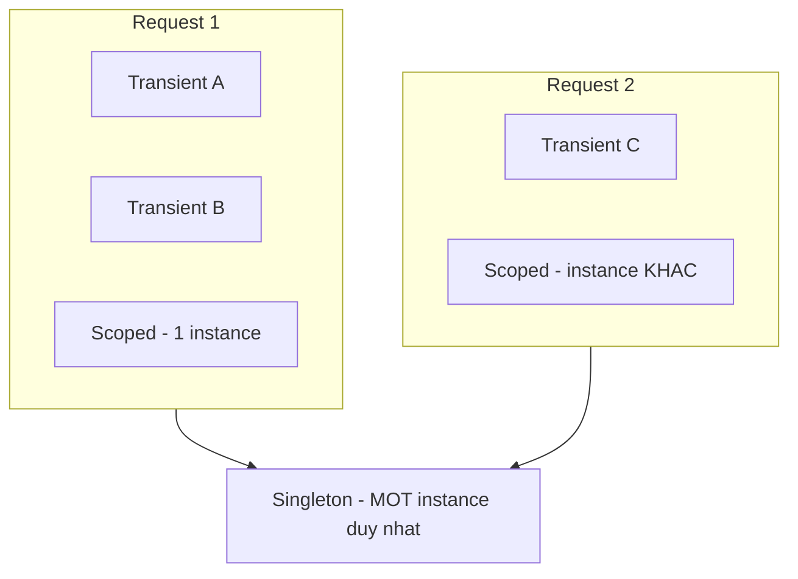

import { SummaryBox, Checklist, FAQSection } from '@site/src/components/SEO';

# 7.5 — 3. Service Lifetimes

<SummaryBox>
Lifetime trả lời hai câu hỏi: **khi nào tạo instance mới** và **khi nào `Dispose` nó**. Ba lựa chọn: `Transient` (mỗi lần xin là một cái mới), `Scoped` (một cái cho mỗi HTTP request), `Singleton` (một cái cho cả ứng dụng). Sai lầm nguy hiểm nhất trong toàn module là **captive dependency**: một `Singleton` nhận vào một `Scoped`, khiến `Scoped` đó **sống mãi tới khi ứng dụng tắt** — `DbContext` không bao giờ được giải phóng, change tracker phình mãi, và dữ liệu cũ được trả về hàng tháng trời. Từ .NET 6, `ValidateScopes` bật sẵn ở Development nên lỗi này nổ ngay lúc khởi động; ở Production thì **không**.
</SummaryBox>

## Mục tiêu bài học

Sau bài này bạn có thể:

- Chọn đúng lifetime cho một service dựa trên trạng thái nó giữ.
- Giải thích chính xác điều gì xảy ra với captive dependency.
- Dùng `IServiceScopeFactory` đúng chỗ.
- Bật kiểm tra scope cho môi trường Production.
- Biết vì sao `Transient` cài `IDisposable` là một dạng rò rỉ bộ nhớ.

## Nội dung bài học

### 7.5.1 — Ba lifetime

| Lifetime | Tạo mới khi | `Dispose` khi | Điển hình |
|---|---|---|---|
| `Transient` | **Mỗi lần** resolve | Scope chứa nó kết thúc | Service không trạng thái, nhẹ |
| `Scoped` | **Mỗi** HTTP request | Request kết thúc | `DbContext`, repository, Unit of Work |
| `Singleton` | Lần resolve **đầu tiên** | Ứng dụng tắt | Cache, cấu hình, `HttpClientFactory` |



Điểm quan trọng nhất trong bảng là **cột `Dispose`**, không phải cột tạo mới.

### 7.5.2 — Chọn lifetime theo trạng thái

Quy tắc quyết định chỉ có một câu hỏi: **service này giữ trạng thái gì?**

- **Không giữ gì** (chỉ nhận vào, tính, trả ra) → `Transient` hoặc `Singleton`. Nếu nó cũng không có phụ thuộc scoped, chọn `Singleton` để khỏi cấp phát liên tục.
- **Giữ trạng thái theo request** (change tracker, thông tin người dùng hiện tại, transaction) → `Scoped`.
- **Giữ trạng thái chung cho cả ứng dụng** (cache, kết nối dùng chung) → `Singleton`, và **phải thread-safe**.

```csharp
services.AddScoped<CrmDbContext>();                          // giu change tracker
services.AddScoped<ICustomerRepository, EfCustomerRepository>();
services.AddScoped<IUnitOfWork, UnitOfWork>();

services.AddSingleton<ICustomerCache, InMemoryCustomerCache>();  // dung chung
services.AddTransient<ILeadScorer, RuleBasedLeadScorer>();       // khong trang thai
```

`Scoped` cho `DbContext` và repository không phải quy ước cho đẹp: nó đảm bảo `CustomerRepository` và `LeadRepository` trong **cùng một request** dùng **chung một `DbContext`**, nên `SaveChangesAsync()` ghi cả hai thay đổi trong **một transaction**.

`Singleton` phải thread-safe vì nhiều request chạm vào nó cùng lúc: `ConcurrentDictionary` thay vì `Dictionary`, và không có field nào bị ghi mà không đồng bộ hoá.

### 7.5.3 — Captive dependency

Quy tắc: **một service chỉ được phụ thuộc vào service có lifetime dài bằng hoặc dài hơn nó.**

| Service | Được phụ thuộc vào |
|---|---|
| `Singleton` | Chỉ `Singleton` |
| `Scoped` | `Scoped`, `Singleton` |
| `Transient` | Tất cả |

Vi phạm phổ biến nhất là Singleton nhận Scoped:

```csharp
// BUG
public class CacheRefresher(ICustomerRepository repo)   // repo la Scoped
{
    public Task RefreshAsync() => repo.RefreshCacheAsync();
}
services.AddSingleton<CacheRefresher>();
```

Điều thật sự xảy ra: container dựng `CacheRefresher` **một lần**, và để dựng nó phải dựng một `ICustomerRepository`. Instance đó — cùng với `DbContext` bên trong — bị **giam** trong Singleton và sống tới khi ứng dụng tắt.

Hậu quả, theo thứ tự xuất hiện:

1. **Dữ liệu cũ.** `DbContext` trả về entity từ change tracker chứ không đi xuống database. Bản ghi bạn vừa sửa vẫn hiện giá trị cũ.
2. **Bộ nhớ phình dần.** Change tracker giữ mọi entity đã nạp, không bao giờ dọn. Biểu đồ memory đi lên đều suốt nhiều ngày.
3. **Lỗi đồng thời.** `DbContext` không thread-safe ([bài 6.6](../module-06-async-programming/6.6-task-parallel-library.mdx)), nên hai request đồng thời cho `InvalidOperationException`.
4. **Rò rỉ dữ liệu giữa tenant.** Nếu repository nhớ tenant hiện tại, tenant đầu tiên khởi động ứng dụng sẽ quyết định dữ liệu của tất cả.

Cách chữa là **tạo scope khi cần dùng**:

```csharp
public class CacheRefresher(IServiceScopeFactory scopeFactory)
{
    public async Task RefreshAsync()
    {
        await using var scope = scopeFactory.CreateAsyncScope();
        var repo = scope.ServiceProvider.GetRequiredService<ICustomerRepository>();

        await repo.RefreshCacheAsync();
        // scope dispose -> DbContext duoc giai phong dung cach
    }
}
```

Đây là mẫu bắt buộc trong `BackgroundService`, vì `BackgroundService` **luôn là Singleton** — xem [bài 6.9](../module-06-async-programming/6.9-channels-and-producer-consumer.mdx).

:::tip Đọc thêm
Bài [Singleton, Scoped hay Transient? Chọn sai là `DbContext` sống mãi](/blog/singleton-scoped-transient-captive-dependency) đi vào chi tiết từng hậu quả cùng cách phát hiện trong log.
:::

### 7.5.4 — `ValidateScopes` và vì sao nó không cứu bạn ở Production

.NET tự phát hiện captive dependency, nhưng **chỉ khi được bật**:

```csharp
// Mac dinh cua CreateBuilder:
// ValidateScopes  = true  chi khi Environment la Development
// ValidateOnBuild = true  chi khi Environment la Development
```

Nghĩa là code sai vẫn chạy bình thường ở Development nếu ai đó đặt `ASPNETCORE_ENVIRONMENT=Production` trên máy mình, và **luôn** chạy im lặng trên Production.

Bật cho mọi môi trường:

```csharp
builder.Host.UseDefaultServiceProvider(options =>
{
    options.ValidateScopes  = true;   // bat captive dependency
    options.ValidateOnBuild = true;   // bat thieu dang ky ngay luc khoi dong
});
```

`ValidateOnBuild` đặc biệt đáng giá: nó thử dựng **mọi** service đã đăng ký ngay khi khởi động. Thiếu một đăng ký thì ứng dụng **không lên**, thay vì trả 500 vào 3 giờ sáng khi có người gọi đúng endpoint đó.

Chi phí là vài trăm mili giây lúc khởi động. Đáng.

### 7.5.5 — `Transient` cài `IDisposable` là một dạng rò rỉ

```csharp
services.AddTransient<IFileProcessor, FileProcessor>();   // FileProcessor : IDisposable
```

Container **theo dõi** mọi `IDisposable` nó tạo ra để gọi `Dispose` sau. Với `Transient`, đối tượng được ghi vào danh sách của **scope đang chứa nó** — và nếu đó là scope gốc (resolve từ Singleton hoặc từ `app.Services`), danh sách đó chỉ được dọn khi ứng dụng tắt.

Nghĩa là: mỗi lần resolve là một đối tượng nữa nằm lại trong danh sách, **vĩnh viễn**. Trông y hệt một rò rỉ bộ nhớ, và rất khó lần ra vì đối tượng "đã dùng xong" rồi.

Ba cách xử lý:

1. Làm cho nó **không cần `IDisposable`** — thường là dấu hiệu nó đang giữ tài nguyên mà nó không nên giữ.
2. Đổi sang `Scoped` nếu tài nguyên gắn với request.
3. Không đăng ký vào container, **tự `new` trong `using`** nếu nó thật sự là tài nguyên ngắn hạn.

### 7.5.6 — Hai trường hợp đặc biệt

**`DbContext`**: `AddDbContext<T>()` đăng ký `Scoped` sẵn. Đừng đổi lifetime. Cần dùng ngoài request thì dùng `AddDbContextFactory` ([bài 6.6](../module-06-async-programming/6.6-task-parallel-library.mdx)).

**`HttpClient`**: đừng `new HttpClient()` và cũng đừng đăng ký nó `Singleton` trực tiếp. `AddHttpClient()` quản lý pool `HttpMessageHandler` cho bạn — `HttpClient` được tiêm là `Transient` nhưng handler bên dưới thì dùng chung và xoay vòng. Tự `new` sẽ cạn socket; `Singleton` thủ công thì không nhận được thay đổi DNS.

### 7.5.7 — Rà lại code của bạn

<Checklist
  title="Danh sách rà soát lifetime"
  items={[
    { text: "Không có Singleton nào nhận Scoped hoặc Transient qua constructor." },
    { text: "Mọi BackgroundService dùng IServiceScopeFactory để lấy service scoped." },
    { text: "ValidateScopes và ValidateOnBuild được bật cho mọi môi trường." },
    { text: "Mọi Singleton đều thread-safe: ConcurrentDictionary, không field bị ghi tự do." },
    { text: "Không có Transient nào cài IDisposable." },
    { text: "DbContext giữ nguyên lifetime Scoped của AddDbContext." },
    { text: "HttpClient lấy qua AddHttpClient, không tự new và không đăng ký Singleton." },
    { text: "Mỗi service đã trả lời được câu hỏi: nó giữ trạng thái gì?" },
  ]}
/>

## Bài tập áp dụng

1. **Tái hiện captive dependency.** Đăng ký một Singleton nhận `DbContext` qua constructor. Chạy ở Development và ghi lại exception. Sau đó đặt `ASPNETCORE_ENVIRONMENT=Production`, chạy lại và xác nhận nó **không** báo gì.

2. **Thấy dữ liệu cũ.** Với cấu hình sai ở trên (chạy ở Production), đọc một bản ghi, sửa nó trực tiếp trong database, rồi đọc lại qua API. Ghi lại giá trị nhận được và giải thích.

3. **Rò rỉ Transient.** Đăng ký một `Transient` cài `IDisposable` ghi log trong `Dispose`. Resolve nó 1000 lần từ `app.Services`. Đếm số lần `Dispose` được gọi và đo bộ nhớ.

## Tự kiểm tra

<FAQSection
  items={[
    {
      question: "Ba lifetime khác nhau thế nào?",
      answer: "Transient tạo instance mới mỗi lần resolve. Scoped tạo một instance cho mỗi HTTP request và dispose khi request kết thúc. Singleton tạo một instance duy nhất ở lần resolve đầu tiên và sống tới khi ứng dụng tắt. Điểm quan trọng nhất không phải khi nào tạo mà là khi nào dispose."
    },
    {
      question: "Chọn lifetime dựa vào tiêu chí nào?",
      answer: "Dựa vào trạng thái service giữ. Không giữ gì thì Transient hoặc Singleton. Giữ trạng thái theo request như change tracker, người dùng hiện tại hay transaction thì Scoped. Giữ trạng thái chung cho cả ứng dụng như cache thì Singleton, và khi đó bắt buộc phải thread-safe."
    },
    {
      question: "Captive dependency gây hậu quả gì?",
      answer: "Bốn hậu quả theo thứ tự xuất hiện. Dữ liệu cũ vì DbContext trả entity từ change tracker thay vì đi xuống database. Bộ nhớ phình dần vì change tracker không bao giờ được dọn. Lỗi đồng thời vì DbContext không thread-safe. Và rò rỉ dữ liệu giữa các tenant nếu repository nhớ tenant hiện tại."
    },
    {
      question: "Vì sao ValidateScopes không cứu được ở Production?",
      answer: "Vì mặc định nó chỉ bật khi môi trường là Development. Code sai sẽ chạy im lặng trên Production. Nên bật thủ công qua UseDefaultServiceProvider cho mọi môi trường, cùng với ValidateOnBuild để ứng dụng không khởi động được khi thiếu đăng ký, thay vì trả lỗi 500 vào lúc nửa đêm."
    },
    {
      question: "Vì sao Transient cài IDisposable là rò rỉ?",
      answer: "Vì container theo dõi mọi IDisposable nó tạo để dispose sau, và với Transient thì đối tượng được ghi vào danh sách của scope đang chứa nó. Nếu đó là scope gốc thì danh sách chỉ được dọn khi ứng dụng tắt, nên mỗi lần resolve là một đối tượng nằm lại vĩnh viễn. Cách chữa là bỏ IDisposable, đổi sang Scoped, hoặc tự new trong using."
    },
    {
      question: "HttpClient nên đăng ký lifetime nào?",
      answer: "Không đăng ký thủ công mà dùng AddHttpClient. Tự new HttpClient sẽ cạn socket, còn đăng ký Singleton thủ công thì không nhận được thay đổi DNS. AddHttpClient quản lý pool HttpMessageHandler và xoay vòng chúng, còn HttpClient được tiêm là Transient."
    }
  ]}
/>

## Kết luận

Ba điều đáng nhớ nhất:

1. **Lifetime là về `Dispose`, không chỉ về tạo mới.**
2. **Singleton chỉ được phụ thuộc vào Singleton.** Cần Scoped thì tạo scope bằng `IServiceScopeFactory`.
3. **Bật `ValidateScopes` và `ValidateOnBuild` cho mọi môi trường** — vài trăm mili giây đổi lấy việc lỗi nổ lúc khởi động thay vì lúc 3 giờ sáng.

## Tham khảo

- [Dependency injection service lifetimes](https://learn.microsoft.com/en-us/dotnet/core/extensions/dependency-injection#service-lifetimes)
- [Dependency injection guidelines](https://learn.microsoft.com/en-us/dotnet/core/extensions/dependency-injection-guidelines)
- [IHttpClientFactory with .NET](https://learn.microsoft.com/en-us/dotnet/core/extensions/httpclient-factory)
- [DbContext lifetime, configuration, and initialization](https://learn.microsoft.com/en-us/ef/core/dbcontext-configuration/)

## Điều hướng

- **Bài trước:** [7.4 — 2. Ba cách tiêm dependency](7.4-three-ways-register-services.mdx)
- **Bài tiếp theo:** [7.6 — 4. Registering Services](7.6-registering-services.mdx)
- **Về module:** [Trang mục lục](./)

## Bài liên quan

- [Singleton, Scoped hay Transient? Chọn sai là DbContext sống mãi](/blog/singleton-scoped-transient-captive-dependency) — Ba lifetime trong DI container của ASP.NET Core khác nhau ở thời điểm tạo và thời điểm dispose instance.
