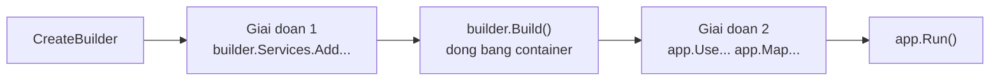

import { SummaryBox, Checklist, FAQSection } from '@site/src/components/SEO';

# 7.7 — 5. Program.cs và WebApplicationBuilder

<SummaryBox>
`Program.cs` có **hai giai đoạn tách bạch** mà `builder.Build()` là ranh giới: trước nó bạn **đăng ký**, sau nó bạn **cấu hình pipeline**. Hiểu ranh giới này giải thích hầu hết lỗi khởi động: đăng ký sau `Build()` không có tác dụng, và gọi `BuildServiceProvider()` giữa chừng tạo ra một container **thứ hai** với bộ singleton riêng — một nguồn bug mà bạn sẽ mất nhiều giờ để tìm ra. Trong giai đoạn hai, **thứ tự middleware là ngữ nghĩa**: đặt `UseAuthorization` trước `UseAuthentication` khiến mọi request đều vô danh, và không có lỗi nào được báo.
</SummaryBox>

## Mục tiêu bài học

Sau bài này bạn có thể:

- Mô tả hai giai đoạn của `Program.cs` và những gì hợp lệ ở mỗi giai đoạn.
- Tổ chức đăng ký theo layer bằng extension method.
- Sắp đúng thứ tự middleware và giải thích hậu quả khi sai.
- Chạy migration hoặc seed lúc khởi động một cách đúng đắn.
- Biết vì sao `BuildServiceProvider()` thủ công là lỗi.

## Nội dung bài học

### 7.7.1 — Hai giai đoạn

```csharp
var builder = WebApplication.CreateBuilder(args);

// ===== GIAI DOAN 1: DANG KY =====
builder.Services.AddControllers();
builder.Services.AddInfrastructure(builder.Configuration);
builder.Services.AddApplication();

var app = builder.Build();      // <-- RANH GIOI. Container duoc dong bang.

// ===== GIAI DOAN 2: PIPELINE =====
if (app.Environment.IsDevelopment())
    app.UseSwagger().UseSwaggerUI();

app.UseHttpsRedirection();
app.UseAuthentication();
app.UseAuthorization();
app.MapControllers();

app.Run();
```



Sau `Build()`, `builder.Services` vẫn gọi được nhưng **không còn tác dụng gì** — không exception, không cảnh báo, chỉ là service đó không bao giờ tồn tại. Đây là một trong những lỗi khó tìm nhất với người mới.

`WebApplication.CreateBuilder(args)` đã làm sẵn khá nhiều: nạp `appsettings.json`, `appsettings.{Environment}.json`, biến môi trường, tham số dòng lệnh; cấu hình logging; đăng ký `IConfiguration`, `IWebHostEnvironment`, `ILogger<T>`.

### 7.7.2 — Đừng gọi `BuildServiceProvider()` thủ công

```csharp
// SAI — tao mot container THU HAI
builder.Services.AddSingleton<ICache, MemoryCache>();

var sp = builder.Services.BuildServiceProvider();   // container #2
var cache = sp.GetRequiredService<ICache>();        // singleton cua container #2

builder.Services.AddSingleton(cache);
```

Bạn vừa tạo hai container, mỗi cái có bộ `Singleton` riêng. Về sau, một phần ứng dụng dùng instance của container #1, phần khác dùng instance của container #2 — cùng một kiểu `Singleton` nhưng **hai đối tượng khác nhau**. Cache ghi ở một nơi, đọc ở nơi khác thì rỗng.

Tệ hơn: container #2 không bao giờ được `Dispose`, nên mọi `IDisposable` trong đó rò rỉ.

Analyzer `ASP0000` cảnh báo chuyện này. Cần cấu hình phụ thuộc vào một service khác thì dùng options pattern với `IConfigureOptions<T>` ([bài 7.8](7.8-options-pattern.mdx)) — nó được resolve **sau** khi container dựng xong.

### 7.7.3 — Tách đăng ký theo layer

Khi `Program.cs` vượt 100 dòng đăng ký, nó trở thành nơi không ai muốn đụng vào. Tách bằng extension method, **mỗi layer một file, nằm trong chính project của layer đó**:

```csharp
// Infrastructure/DependencyInjection.cs
public static class InfrastructureServiceCollectionExtensions
{
    public static IServiceCollection AddInfrastructure(
        this IServiceCollection services, IConfiguration configuration)
    {
        services.AddDbContext<CrmDbContext>(options =>
            options.UseSqlServer(configuration.GetConnectionString("CrmDb")));

        services.AddScoped<ICustomerRepository, EfCustomerRepository>();
        services.AddScoped<IUnitOfWork, EfUnitOfWork>();

        services.AddOptions<EmailSettings>()
            .Bind(configuration.GetSection(EmailSettings.SectionName))
            .ValidateDataAnnotations()
            .ValidateOnStart();

        services.AddSingleton<IEmailService, SmtpEmailService>();

        return services;      // tra ve de noi chuoi
    }
}
```

```csharp
// Application/DependencyInjection.cs
public static class ApplicationServiceCollectionExtensions
{
    public static IServiceCollection AddApplication(this IServiceCollection services)
    {
        services.AddScoped<ICustomerService, CustomerService>();
        services.AddTransient<ILeadScorer, RuleBasedLeadScorer>();

        services.AddMediatR(cfg => cfg.RegisterServicesFromAssembly(
            typeof(ApplicationServiceCollectionExtensions).Assembly));

        return services;
    }
}
```

Ba lợi ích thật:

1. **Ranh giới layer hiện ra.** `AddApplication()` không nhận `IConfiguration` — nếu một ngày nó cần, đó là tín hiệu layer application đang biết về hạ tầng.
2. **`Program.cs` đọc được trong 30 giây.**
3. **Integration test dùng lại được**: gọi đúng các extension đó rồi `Replace` vài thứ.

Chỗ này thường bị làm quá tay thành `AddCustomerModule()`, `AddLeadModule()`, `AddOrderModule()`… Khi số extension method vượt số layer, bạn chỉ đang di chuyển sự lộn xộn.

### 7.7.4 — Thứ tự middleware là ngữ nghĩa

Giai đoạn 2 **không phải** danh sách bật/tắt — nó là thứ tự thực thi. Mỗi `app.UseXxx()` thêm một lớp vào pipeline, và request đi qua **theo đúng thứ tự bạn viết**.

```csharp
app.UseExceptionHandler("/error");   // ngoai cung — bat loi cua MOI lop ben trong
app.UseHttpsRedirection();
app.UseStaticFiles();
app.UseRouting();
app.UseCors();
app.UseAuthentication();             // BAT BUOC truoc Authorization
app.UseAuthorization();
app.MapControllers();
```

Ba hậu quả cụ thể khi sai thứ tự:

| Sai | Hậu quả |
|---|---|
| `UseAuthorization` trước `UseAuthentication` | `User` luôn vô danh, mọi `[Authorize]` từ chối — không có lỗi nào được báo |
| `UseExceptionHandler` đặt sau | Exception ở middleware phía trên nó không được bắt, client nhận trang lỗi mặc định |
| `UseCors` sau `UseAuthorization` | Preflight request bị chặn trước khi tới CORS, trình duyệt báo lỗi CORS khó hiểu |
| `UseStaticFiles` sau `UseAuthentication` | File tĩnh đi qua toàn bộ tầng xác thực, chậm không cần thiết |

Quy tắc dễ nhớ: **ngoài vào trong** — xử lý lỗi, bảo mật truyền tải, định tuyến, xác thực, phân quyền, rồi mới tới endpoint.

### 7.7.5 — Migration và seed lúc khởi động

```csharp
var app = builder.Build();

using (var scope = app.Services.CreateScope())
{
    var db = scope.ServiceProvider.GetRequiredService<CrmDbContext>();
    await db.Database.MigrateAsync();
}

app.Run();
```

`CreateScope()` là bắt buộc: `app.Services` là **root provider**, và lấy thẳng một service `Scoped` từ đó sẽ ném exception khi `ValidateScopes` bật — hoặc tệ hơn, giam nó nếu không bật ([bài 7.5](7.5-service-lifetimes.mdx)).

Với production nhiều instance, cách này có vấn đề: khi bạn scale lên 3 pod, cả ba cùng chạy migration một lúc. EF Core có khoá nên thường ổn, nhưng cách an toàn là tách migration thành **bước riêng trong pipeline triển khai**.

### 7.7.6 — Rà lại code của bạn

<Checklist
  title="Danh sách rà soát Program.cs"
  items={[
    { text: "Mọi đăng ký nằm trước builder.Build()." },
    { text: "Không có lời gọi BuildServiceProvider() thủ công nào (cảnh báo ASP0000)." },
    { text: "Đăng ký được tách theo layer, mỗi extension method nằm trong project của layer đó." },
    { text: "AddApplication() không nhận IConfiguration." },
    { text: "UseAuthentication đứng trước UseAuthorization." },
    { text: "UseExceptionHandler là middleware đầu tiên." },
    { text: "UseCors đứng trước UseAuthorization." },
    { text: "Migration lúc khởi động chạy trong một scope tạo bằng CreateScope()." },
    { text: "ValidateOnBuild và ValidateScopes được bật cho mọi môi trường." },
  ]}
/>

## Bài tập áp dụng

#### Bài 1 — Đăng ký sau `Build()`

Thêm một `builder.Services.AddScoped<IFoo, Foo>()` **sau** `builder.Build()`, rồi tiêm `IFoo` vào một controller. Ghi lại thông báo lỗi và **thời điểm** nó xuất hiện.

**Tiêu chí hoàn thành:** bạn nêu được vì sao `ServiceCollection` bị đóng băng sau `Build()`.

<details>
<summary><strong>Gợi ý và lời giải — Bài 1</strong></summary>

**Gợi ý.** `builder.Build()` là ranh giới giữa hai giai đoạn: **cấu hình** và **chạy**. Hãy nghĩ xem điều gì sẽ xảy ra nếu container cho phép thêm đăng ký sau khi nó đã dựng xong đồ thị phụ thuộc và tạo ra các `Singleton`.

**Lời giải.**

```csharp
var builder = WebApplication.CreateBuilder(args);
builder.Services.AddControllers();

var app = builder.Build();                          // <- RANH GIỚI

builder.Services.AddScoped<IFoo, Foo>();            // quá muộn
app.MapControllers();
app.Run();
```

Gọi một endpoint có tiêm `IFoo`:

```text
InvalidOperationException: Unable to resolve service for type 'IFoo'
while attempting to activate 'FooController'.
```

**Thời điểm xuất hiện: lúc có request đầu tiên**, không phải lúc khởi động. Ứng dụng khởi động hoàn toàn bình thường.

Với .NET 8 trở lên, việc thêm vào `Services` sau `Build()` còn có thể ném ngay:

```text
InvalidOperationException: Cannot modify ServiceCollection after
the application is built.
```

Tuỳ phiên bản và cách bạn thêm, nhưng cả hai đều dẫn tới cùng kết luận.

**Vì sao `ServiceCollection` bị đóng băng.** `Build()` làm ba việc không thể hoàn tác:

```text
1. Đọc toàn bộ ServiceCollection và dựng đồ thị phụ thuộc
2. Sinh mã khởi tạo tối ưu cho từng kiểu dịch vụ
3. Tạo phạm vi gốc, nơi các Singleton sẽ sống
```

Cho phép thêm đăng ký sau đó sẽ khiến đồ thị và mã đã sinh trở nên sai. Tệ hơn, một `Singleton` đã được tạo từ đăng ký cũ sẽ tiếp tục sống song song với đăng ký mới — hai phiên bản của cùng một dịch vụ.

**Hai giai đoạn, và việc gì thuộc giai đoạn nào:**

| Giai đoạn | Làm gì | Đối tượng |
|---|---|---|
| **Trước `Build()`** | Đăng ký dịch vụ, đọc cấu hình, đặt tuỳ chọn | `builder.Services`, `builder.Configuration` |
| **Sau `Build()`** | Xây đường ống middleware, ánh xạ endpoint, chạy | `app.Use...`, `app.Map...` |

**Nhầm lẫn hay gặp nhất — cần một dịch vụ để cấu hình một dịch vụ khác:**

```csharp
// SAI — Build giữa chừng, tạo ra container thứ hai
var sp = builder.Services.BuildServiceProvider();
var opts = sp.GetRequiredService<IOptions<SmtpOptions>>();
builder.Services.AddSingleton<IEmailSender>(new SmtpSender(opts.Value.Host));
```

Cách này tạo ra **hai container**, và mọi `Singleton` bị nhân đôi — bài 2 chứng minh hậu quả.

```csharp
// ĐÚNG — dùng factory, container tự giải quyết đúng lúc
builder.Services.AddSingleton<IEmailSender>(sp =>
{
    var opts = sp.GetRequiredService<IOptions<SmtpOptions>>();
    return new SmtpSender(opts.Value.Host);
});
```

**Khi cần một dịch vụ *sau* khi ứng dụng đã dựng** — ví dụ để chạy migration:

```csharp
var app = builder.Build();

using (var scope = app.Services.CreateScope())          // dùng container THẬT
{
    var db = scope.ServiceProvider.GetRequiredService<CrmDbContext>();
    await db.Database.MigrateAsync();
}

app.Run();
```

Lưu ý `CreateScope()` — không lấy trực tiếp từ `app.Services`, vì `DbContext` là `Scoped` và lấy từ phạm vi gốc sẽ ném lỗi hoặc gây rò rỉ như [bài 7.5](7.5-service-lifetimes.mdx) trình bày.

</details>

#### Bài 2 — Hai container do gọi `BuildServiceProvider()` thủ công

Gọi `BuildServiceProvider()` giữa chừng, lấy ra một `Singleton` giữ một bộ đếm, rồi so sánh giá trị đó với giá trị lấy từ một controller. Ghi lại hai con số khác nhau.

**Tiêu chí hoàn thành:** bạn chứng minh được có **hai** thể hiện của cùng một `Singleton`.

<details>
<summary><strong>Gợi ý và lời giải — Bài 2</strong></summary>

**Gợi ý.** `Singleton` nghĩa là "một thể hiện **cho mỗi container**", không phải "một thể hiện cho mỗi ứng dụng". Hai container thì hai thể hiện.

**Lời giải.**

```csharp
public class Counter
{
    public static int SoLanTao;
    public readonly int Id;
    public int Value;
    public Counter() => Id = Interlocked.Increment(ref SoLanTao);
}

var builder = WebApplication.CreateBuilder(args);
builder.Services.AddSingleton<Counter>();
builder.Services.AddControllers();

// SAI — dựng một container tạm
var spTam = builder.Services.BuildServiceProvider();
var c1 = spTam.GetRequiredService<Counter>();
c1.Value = 100;
Console.WriteLine($"container tạm : Counter#{c1.Id}, Value = {c1.Value}");

var app = builder.Build();                             // container THẬT
var c2 = app.Services.GetRequiredService<Counter>();
Console.WriteLine($"container thật: Counter#{c2.Id}, Value = {c2.Value}");
```

**Kết quả:**

```text
container tạm : Counter#1, Value = 100
container thật: Counter#2, Value = 0
```

**Hai thể hiện khác nhau.** `Value = 100` đặt ở container tạm hoàn toàn vô hình với ứng dụng thật.

**Ba hậu quả trong hệ thống thật:**

1. **Trạng thái bị chia đôi.** Bộ nhớ đệm, bộ đếm, hàng đợi trong bộ nhớ — mọi thứ ghi vào container tạm đều mất.
2. **Tài nguyên bị nhân đôi và rò rỉ.** Container tạm cũng tạo ra các `Singleton` nắm kết nối, nhóm luồng, bộ đếm thời gian — và **không ai `Dispose` container tạm**, nên chúng sống mãi.
3. **Rất khó chẩn đoán.** Triệu chứng là "cache không hoạt động" hoặc "cấu hình không có tác dụng", và không có gì trong log chỉ về nguyên nhân.

ASP.NET Core cảnh báo về việc này:

```text
warn: Microsoft.Extensions.DependencyInjection[0]
      Calling 'BuildServiceProvider' from application code results in an
      additional copy of singleton services being created.
```

Cảnh báo dễ bị bỏ qua giữa hàng chục dòng log khởi động — nên hãy chủ động tìm nó:

```bash
grep -rn "BuildServiceProvider()" --include=*.cs src/ | grep -v Test
```

**Hai tình huống hay dẫn tới lỗi này, và cách làm đúng:**

```csharp
// Tình huống 1: cần giá trị cấu hình để đăng ký dịch vụ
// SAI
var sp = builder.Services.BuildServiceProvider();
var opts = sp.GetRequiredService<IOptions<CacheOptions>>();
builder.Services.AddSingleton(new Cache(opts.Value.Size));

// ĐÚNG — đọc thẳng từ Configuration, hoặc dùng factory
var size = builder.Configuration.GetValue<int>("Cache:Size");
builder.Services.AddSingleton(new Cache(size));

// Tình huống 2: cần một dịch vụ khác để dựng dịch vụ này
// ĐÚNG — factory, container tự giải quyết thứ tự
builder.Services.AddSingleton<ICache>(sp =>
    new Cache(sp.GetRequiredService<IOptions<CacheOptions>>().Value.Size));
```

**Ngoại lệ chính đáng: trong kiểm thử.** Khi viết unit test cho chính phần đăng ký DI, gọi `BuildServiceProvider()` là hoàn toàn bình thường — vì đó là container duy nhất trong bài kiểm thử đó:

```csharp
[Fact]
public void MoiDichVuDeuGiaiQuyetDuoc()
{
    var services = new ServiceCollection();
    services.AddCrmInfrastructure(config);

    var sp = services.BuildServiceProvider(new ServiceProviderOptions
    {
        ValidateScopes = true,
        ValidateOnBuild = true          // bắt captive dependency ngay
    });

    Assert.NotNull(sp.GetService<IOrderRepository>());
}
```

Bài kiểm thử dạng này rất đáng viết: nó bắt được lỗi đăng ký **trong CI** thay vì lúc triển khai.

</details>

#### Bài 3 — Đảo thứ tự middleware xác thực

Đổi chỗ `UseAuthentication` và `UseAuthorization`, gọi một endpoint có `[Authorize]` với token **hợp lệ**. Ghi lại mã trạng thái và xác nhận log **không** có lỗi nào.

**Tiêu chí hoàn thành:** bạn giải thích được vì sao lỗi này "im lặng" và vì sao nó khó chẩn đoán hơn một ngoại lệ.

<details>
<summary><strong>Gợi ý và lời giải — Bài 3</strong></summary>

**Gợi ý.** `UseAuthentication` **dựng** danh tính người dùng từ token. `UseAuthorization` **kiểm tra** danh tính đó. Nếu chạy ngược thứ tự, cái thứ hai kiểm tra cái gì?

**Lời giải.**

```csharp
var app = builder.Build();

app.UseAuthorization();      // kiểm tra quyền TRƯỚC
app.UseAuthentication();     // dựng danh tính SAU
app.MapControllers();
```

Gọi với token hoàn toàn hợp lệ:

```bash
curl -i localhost:5000/api/v1/customers -H "Authorization: Bearer $TOKEN_HOP_LE"
```

```text
HTTP/1.1 401 Unauthorized
```

**Và log hoàn toàn sạch.** Không ngoại lệ, không cảnh báo, không một dòng nào bất thường.

**Vì sao im lặng.** Khi `UseAuthorization` chạy, `HttpContext.User` vẫn là một `ClaimsPrincipal` **rỗng** — chưa ai điền vào. Middleware phân quyền làm đúng việc của nó: thấy người dùng ẩn danh, thấy endpoint yêu cầu đăng nhập, trả `401`. Đó là hành vi **hoàn toàn đúng** với dữ liệu nó có.

Không có gì sai để mà báo. Sai nằm ở **thứ tự**, và thứ tự là thứ không middleware nào kiểm tra được.

**Vì sao khó chẩn đoán hơn một ngoại lệ:**

| | Ngoại lệ | Lỗi thứ tự middleware |
|---|---|---|
| Có dấu vết ngăn xếp | Có | **Không** |
| Chỉ ra dòng code sai | Có | **Không** |
| Xuất hiện trong log lỗi | Có | **Không** |
| Người điều tra bắt đầu từ | Thông báo lỗi | **Không có gì** |

Người gặp lỗi này sẽ đi kiểm tra token, kiểm tra khoá ký, kiểm tra thời hạn, kiểm tra cấu hình `TokenValidationParameters` — mọi thứ **trừ** thứ tự hai dòng trong `Program.cs`. Nhiều giờ có thể trôi qua.

**Bốn lỗi thứ tự cùng loại:**

| Đặt sai | Triệu chứng | Chẩn đoán nhầm thường gặp |
|---|---|---|
| `UseAuthorization` trước `UseAuthentication` | Luôn 401 dù token đúng | "Token có vấn đề" |
| `UseCors` sau `MapControllers` | Trình duyệt chặn, Postman chạy được | "Lỗi phía frontend" |
| `UseExceptionHandler` không ở đầu | Lỗi không được bắt, trả trang lỗi mặc định | "Xử lý ngoại lệ không hoạt động" |
| `UseStaticFiles` sau middleware chặn | Không phục vụ được file tĩnh | "File bị thiếu" |

Cột cuối cho thấy điểm chung: mọi triệu chứng đều **dẫn người điều tra đi sai hướng**.

**Cách phòng — ba việc:**

1. **Chú thích lý do cho từng dòng.** Không phải chú thích nó làm gì, mà chú thích **vì sao nó ở đúng chỗ đó**:

   ```csharp
   app.UseExceptionHandler();     // đầu tiên: bắt lỗi của MỌI middleware phía dưới
   app.UseHttpsRedirection();
   app.UseRouting();              // trước Cors và Authorization: cần biết endpoint đích
   app.UseCors("Default");
   app.UseAuthentication();       // dựng User — PHẢI trước Authorization
   app.UseAuthorization();        // kiểm tra quyền trên User vừa dựng
   app.MapControllers();          // cuối cùng: điểm kết thúc đường ống
   ```

2. **Gom vào một extension** như [bài 5.6](../module-05-advanced-csharp/5.6-extension-methods.mdx) trình bày, để thứ tự chỉ tồn tại ở đúng một chỗ.

3. **Viết kiểm thử tích hợp cho đúng tình huống này:**

   ```csharp
   [Fact]
   public async Task TokenHopLe_TruyCapDuocEndpointCoAuthorize()
   {
       var client = _factory.CreateClient();
       client.DefaultRequestHeaders.Authorization = new("Bearer", TaoTokenHopLe());

       var res = await client.GetAsync("/api/v1/customers");

       Assert.Equal(HttpStatusCode.OK, res.StatusCode);
   }
   ```

Bài kiểm thử này chạy qua **toàn bộ** đường ống nên nó bắt được lỗi thứ tự — thứ mà unit test không bao giờ bắt được. Đây chính là lý do kiểm thử tích hợp tồn tại, và [bài 9.9](../../stage-03-aspnet-core-backend/module-09-web-api-professional/9.9-api-testing.mdx) trình bày đầy đủ.

</details>

## Tự kiểm tra

<FAQSection
  items={[
    {
      question: "Program.cs có hai giai đoạn nào?",
      answer: "Giai đoạn đăng ký service trước builder.Build, và giai đoạn cấu hình pipeline sau đó. builder.Build là ranh giới, nó đóng băng container lại. Đăng ký sau thời điểm này vẫn biên dịch được và không có cảnh báo nào, nhưng service đó sẽ không bao giờ tồn tại."
    },
    {
      question: "Vì sao không được gọi BuildServiceProvider() thủ công?",
      answer: "Vì nó tạo ra một container thứ hai với bộ Singleton riêng, nên cùng một kiểu Singleton sẽ có hai đối tượng khác nhau ở hai phần của ứng dụng. Container thứ hai cũng không bao giờ được Dispose nên mọi IDisposable trong đó rò rỉ. Analyzer ASP0000 cảnh báo chuyện này."
    },
    {
      question: "Tách đăng ký theo layer được lợi gì?",
      answer: "Ranh giới layer hiện ra, ví dụ AddApplication không nhận IConfiguration nên nếu một ngày nó cần thì đó là tín hiệu layer application đang biết về hạ tầng. Program.cs đọc được trong 30 giây. Và integration test dùng lại được các extension đó rồi Replace vài thứ."
    },
    {
      question: "Đặt UseAuthorization trước UseAuthentication thì sao?",
      answer: "User luôn vô danh nên mọi endpoint có Authorize đều từ chối, kể cả với token hợp lệ. Nguy hiểm ở chỗ không có lỗi nào được báo, chỉ là 401 hoặc 403 không giải thích được. Thứ tự middleware là ngữ nghĩa chứ không phải danh sách bật tắt."
    },
    {
      question: "Thứ tự middleware nên nhớ thế nào?",
      answer: "Ngoài vào trong: xử lý lỗi trước tiên để bắt được mọi lớp bên trong, rồi bảo mật truyền tải, file tĩnh, định tuyến, CORS, xác thực, phân quyền, cuối cùng mới tới endpoint."
    },
    {
      question: "Chạy migration lúc khởi động thế nào cho đúng?",
      answer: "Phải tạo scope bằng app.Services.CreateScope rồi lấy DbContext từ scope đó, vì app.Services là root provider và lấy thẳng service Scoped từ đó sẽ ném exception hoặc giam nó. Với production nhiều instance thì an toàn hơn là tách migration thành bước riêng trong pipeline triển khai."
    }
  ]}
/>

## Kết luận

Ba điều đáng nhớ nhất:

1. **`builder.Build()` là ranh giới.** Trước nó đăng ký, sau nó cấu hình pipeline.
2. **`BuildServiceProvider()` thủ công tạo container thứ hai** — nguồn bug im lặng và rò rỉ.
3. **Thứ tự middleware là ngữ nghĩa**, và sai thứ tự thường không báo lỗi gì cả.

## Tham khảo

- [ASP.NET Core Middleware](https://learn.microsoft.com/en-us/aspnet/core/fundamentals/middleware/)
- [App startup in ASP.NET Core](https://learn.microsoft.com/en-us/aspnet/core/fundamentals/startup)
- [ASP0000: Do not call BuildServiceProvider](https://learn.microsoft.com/en-us/aspnet/core/diagnostics/asp0000)
- [Dependency injection in ASP.NET Core](https://learn.microsoft.com/en-us/aspnet/core/fundamentals/dependency-injection)

## Điều hướng

- **Bài trước:** [7.6 — 4. Registering Services](7.6-registering-services.mdx)
- **Bài tiếp theo:** [7.8 — 6. Options Pattern](7.8-options-pattern.mdx)
- **Về module:** [Trang mục lục](./)

## Bài liên quan

- [Singleton, Scoped hay Transient? Chọn sai là DbContext sống mãi](/blog/singleton-scoped-transient-captive-dependency) — Ba lifetime trong DI container của ASP.NET Core khác nhau ở thời điểm tạo và thời điểm dispose instance.
