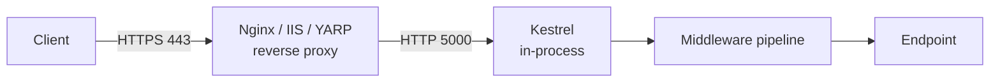

import { SummaryBox, Checklist, FAQSection } from '@site/src/components/SEO';

# 8.2 — 1. Kiến trúc ASP.NET Core

<SummaryBox>
ASP.NET Core không phải bản nâng cấp của ASP.NET — nó được **viết lại từ đầu**, và ba quyết định thiết kế giải thích mọi thứ còn lại. **Kestrel** là HTTP server chạy in-process, thay cho việc phụ thuộc IIS; nó tự phục vụ được nhưng trong production gần như luôn đứng sau **reverse proxy**. **Pipeline là một chuỗi middleware do bạn lắp**, không phải một danh sách `HttpModule` cố định. Và **mọi thứ đều là service trong DI container**, kể cả những thứ trước đây là `static`. Từ .NET 6, `Startup.cs` biến mất và tất cả gói vào `Program.cs` — cùng một lớp `WebApplication` đóng cả hai vai trò builder và host.
</SummaryBox>

## Mục tiêu bài học

Sau bài này bạn có thể:

- Giải thích vai trò của Kestrel và vì sao cần reverse proxy.
- Mô tả minimal hosting model và những gì `CreateBuilder` làm sẵn.
- Phân biệt Generic Host với `WebApplication`.
- Đọc hiểu cách ASP.NET Core quyết định môi trường đang chạy.

## Nội dung bài học

### 8.2.1 — Khác biệt so với ASP.NET (.NET Framework)

| | ASP.NET (.NET Framework) | ASP.NET Core |
|---|---|---|
| Hệ điều hành | Chỉ Windows | Windows, Linux, macOS |
| Web server | Bắt buộc IIS | Kestrel, có thể sau Nginx/IIS/YARP |
| Pipeline | `HttpModule` / `HttpHandler` | Chuỗi middleware do bạn lắp |
| DI | Không có sẵn | Có sẵn, dùng khắp framework |
| Cấu hình | `web.config` (XML) | `appsettings.json`, env, Key Vault |
| Khởi động | `Global.asax` + `Startup.cs` | Chỉ `Program.cs` |
| Hiệu năng | Trung bình | Hàng đầu trong TechEmpower |

Hai dòng đáng chú ý nhất: **DI** và **pipeline**. Trong ASP.NET cũ, `HttpContext.Current` là `static` và có thể gọi từ bất cứ đâu; điều đó làm code không test được và tạo ra chính những ambient context mà [bài 7.10](../../stage-02-csharp-professional/module-07-dependency-injection/7.9-anti-patterns.mdx) cảnh báo. ASP.NET Core bỏ nó: muốn `HttpContext` thì phải tiêm `IHttpContextAccessor`.

### 8.2.2 — Kestrel và reverse proxy



**Kestrel** là HTTP server viết bằng C#, chạy **trong chính tiến trình** ứng dụng — không có ranh giới tiến trình giữa server và code của bạn như thời IIS. Đây là một phần lớn lý do ASP.NET Core nhanh.

Kestrel tự chạy được, nhưng trong production nó thường đứng sau reverse proxy vì bốn lý do:

1. **Kết thúc TLS** — chứng chỉ, gia hạn, TLS offload.
2. **Chống tấn công ở tầng ngoài** — rate limit, lọc IP, chịu slow-loris.
3. **Nhiều ứng dụng một cổng 443** — định tuyến theo tên miền.
4. **File tĩnh** — Nginx phục vụ nhanh hơn và rẻ hơn.

Hệ quả cần biết: sau proxy, mọi request tới Kestrel đều có IP nguồn là **IP của proxy**, và giao thức là `http` chứ không phải `https`. Phải bật forwarded headers:

```csharp
app.UseForwardedHeaders(new ForwardedHeadersOptions
{
    ForwardedHeaders = ForwardedHeaders.XForwardedFor | ForwardedHeaders.XForwardedProto
});
```

Và phải đặt **trước** mọi middleware đọc IP hoặc scheme. Quên bước này thì rate limit theo IP sẽ chặn nhầm tất cả người dùng như một, còn `UseHttpsRedirection` sẽ chuyển hướng vô tận.

:::warning Cẩn thận với header chuyển tiếp
Chỉ tin `X-Forwarded-*` khi request thật sự đến từ proxy của bạn — cấu hình `KnownProxies` hoặc `KnownNetworks`. Bài [Forward header trong ASP.NET Core: vì sao "forward hết" là một lỗi kiến trúc](/blog/forward-http-header-an-toan-aspnet-core) nói rõ vì sao chuyển tiếp bừa là lỗ hổng.
:::

### 8.2.3 — Minimal hosting model

```csharp
var builder = WebApplication.CreateBuilder(args);

builder.Services.AddControllers();
builder.Services.AddEndpointsApiExplorer();
builder.Services.AddSwaggerGen();

var app = builder.Build();

if (app.Environment.IsDevelopment())
    app.UseSwagger().UseSwaggerUI();

app.UseHttpsRedirection();
app.UseAuthorization();
app.MapControllers();

app.Run();
```

`WebApplication.CreateBuilder(args)` làm sẵn khá nhiều thứ, theo **thứ tự ưu tiên tăng dần** cho cấu hình:

1. `appsettings.json`
2. `appsettings.{Environment}.json`
3. User secrets (chỉ Development)
4. Biến môi trường
5. Tham số dòng lệnh

Nguồn sau **đè** nguồn trước — nên biến môi trường luôn thắng file. Đây là cách container truyền cấu hình vào ([bài 8.7](8.6-configuration-system.mdx)).

Nó cũng cấu hình logging (Console, Debug, EventSource), thiết lập Kestrel và IIS integration, đăng ký `IConfiguration`, `IWebHostEnvironment`, `ILogger<T>`, và bật `ValidateScopes` **chỉ khi** môi trường là Development ([bài 7.5](../../stage-02-csharp-professional/module-07-dependency-injection/7.4-service-lifetimes.mdx)).

Lớp `WebApplication` cài đồng thời ba interface: `IHost` (vòng đời), `IApplicationBuilder` (pipeline) và `IEndpointRouteBuilder` (định tuyến). Đó là lý do bạn gọi được cả `app.Use...`, `app.Map...` và `app.Run()` trên cùng một đối tượng — và cũng là lý do `app.Run()` có **hai nghĩa hoàn toàn khác nhau**:

```csharp
app.Run(async ctx => await ctx.Response.WriteAsync("hi"));   // terminal middleware
app.Run();                                                    // khoi dong va chan luong
```

### 8.2.4 — Generic Host

`WebApplication` dựng trên **Generic Host** (`Microsoft.Extensions.Hosting`) — chính là thứ mà Worker Service dùng. Nó lo vòng đời: khởi động mọi `IHostedService`, lắng nghe tín hiệu dừng (SIGTERM, Ctrl+C), và shutdown gọn gàng.

Ý nghĩa thực tế: `BackgroundService` bạn viết ở [bài 6.9](../../stage-02-csharp-professional/module-06-async-programming/6.8-channels-and-producer-consumer.mdx) chạy **bên trong cùng tiến trình** với web app, dùng chung DI container, chung cấu hình, chung logger.

Khi Kubernetes gửi SIGTERM, host ngừng nhận request mới, chờ request đang chạy xong, gọi `StopAsync` của mọi hosted service, rồi thoát — mặc định chờ **5 giây**, đổi bằng `HostOptions.ShutdownTimeout`.

### 8.2.5 — Môi trường

```csharp
if (app.Environment.IsDevelopment())
    app.UseDeveloperExceptionPage();
else
    app.UseExceptionHandler("/error");
```

Môi trường đọc từ biến `ASPNETCORE_ENVIRONMENT`. Ba giá trị có ý nghĩa sẵn: `Development`, `Staging`, `Production`. **Không đặt gì thì mặc định là `Production`** — an toàn theo mặc định, nhưng cũng là lý do người mới thấy "sao trên máy tôi không có trang lỗi chi tiết".

Tên tuỳ ý cũng được (`QA`, `Demo`) với `IsEnvironment("QA")`, nhưng lưu ý `IsDevelopment()` chỉ đúng với đúng chữ `Development`.

Đừng bao giờ để `UseDeveloperExceptionPage()` chạy ở Production: nó in stack trace, đường dẫn file nguồn và giá trị biến ra cho người dùng.

### 8.2.6 — Rà lại code của bạn

<Checklist
  title="Danh sách rà soát kiến trúc"
  items={[
    { text: "Sau reverse proxy đã bật UseForwardedHeaders, đặt trước mọi middleware đọc IP hoặc scheme." },
    { text: "ForwardedHeadersOptions có KnownProxies hoặc KnownNetworks, không tin mọi nguồn." },
    { text: "Không dùng HttpContext qua static; cần thì tiêm IHttpContextAccessor." },
    { text: "Trang lỗi chi tiết chỉ bật ở Development." },
    { text: "Biết rõ ASPNETCORE_ENVIRONMENT được đặt ở đâu cho từng môi trường triển khai." },
    { text: "ShutdownTimeout đủ dài cho request và background job dài nhất." },
    { text: "Cấu hình nhạy cảm đến từ biến môi trường, không từ appsettings.json đã commit." },
  ]}
/>

## Bài tập áp dụng

#### Bài 1 — Thấy IP của proxy thay vì của người dùng

Dựng Nginx trước một ứng dụng ASP.NET Core, ghi log `HttpContext.Connection.RemoteIpAddress` khi **chưa** bật `UseForwardedHeaders`, rồi bật lên và ghi lại. So sánh hai giá trị.

**Tiêu chí hoàn thành:** bạn nêu được ba tính năng bị hỏng khi IP sai, và vì sao **không** nên bật `ForwardedHeaders` một cách vô điều kiện.

<details>
<summary><strong>Gợi ý và lời giải — Bài 1</strong></summary>

**Gợi ý.** Với reverse proxy, kết nối TCP mà Kestrel nhìn thấy đến **từ proxy**, không phải từ người dùng. IP thật chỉ còn trong header.

**Lời giải.**

```csharp
app.Use(async (ctx, next) =>
{
    _logger.LogInformation("IP={Ip}, X-Forwarded-For={Xff}, Scheme={Scheme}",
        ctx.Connection.RemoteIpAddress,
        ctx.Request.Headers["X-Forwarded-For"].ToString(),
        ctx.Request.Scheme);
    await next();
});
```

**Chưa bật `UseForwardedHeaders`:**

```text
IP=172.18.0.2, X-Forwarded-For=203.0.113.45, Scheme=http
```

`172.18.0.2` là IP của container Nginx trong mạng Docker. IP thật `203.0.113.45` chỉ nằm trong header. Và `Scheme` là `http` dù người dùng truy cập qua HTTPS.

**Sau khi bật:**

```csharp
app.UseForwardedHeaders(new ForwardedHeadersOptions
{
    ForwardedHeaders = ForwardedHeaders.XForwardedFor | ForwardedHeaders.XForwardedProto
});
```

```text
IP=203.0.113.45, X-Forwarded-For=, Scheme=https
```

Middleware đọc header, gán vào `RemoteIpAddress` và `Scheme`, rồi **xoá header đã dùng**.

**Ba tính năng hỏng khi IP sai:**

| Tính năng | Hỏng thế nào |
|---|---|
| Giới hạn tần suất theo IP | Mọi request trông như đến từ **cùng một IP** — hoặc chặn hết, hoặc không chặn ai |
| Danh sách trắng IP | Không phân biệt được người dùng, nên hoặc mở cho tất cả hoặc chặn tất cả |
| Nhật ký kiểm toán | Ghi lại IP của proxy — vô dụng khi cần điều tra |

Ngoài ra `Scheme` sai làm `Url.Action` sinh ra đường dẫn `http://` trong email và trong chuyển hướng, gây cảnh báo bảo mật trên trình duyệt.

**Vì sao *không* nên bật vô điều kiện — đây là phần quan trọng.** Header `X-Forwarded-For` do client gửi, nên **client giả mạo được**:

```bash
curl localhost:5000/api/admin -H "X-Forwarded-For: 127.0.0.1"
```

Nếu ứng dụng tin header này vô điều kiện, kẻ tấn công tự nhận mình là `127.0.0.1` và vượt qua mọi danh sách trắng dựa trên IP.

**Cấu hình an toàn — chỉ tin proxy của chính bạn:**

```csharp
builder.Services.Configure<ForwardedHeadersOptions>(o =>
{
    o.ForwardedHeaders = ForwardedHeaders.XForwardedFor | ForwardedHeaders.XForwardedProto;

    o.KnownProxies.Clear();
    o.KnownNetworks.Clear();
    o.KnownNetworks.Add(new IPNetwork(IPAddress.Parse("172.18.0.0"), 16));  // mạng Docker

    o.ForwardLimit = 1;          // chỉ tin MỘT tầng proxy
});
```

Ba dòng cuối là phần bảo mật:

- **Xoá danh sách mặc định** rồi khai báo rõ ràng, thay vì tin mọi thứ.
- **`ForwardLimit = 1`** nghĩa là chỉ lấy giá trị cuối cùng trong chuỗi `X-Forwarded-For`. Không có giới hạn, kẻ tấn công gửi một chuỗi dài và ứng dụng lấy nhầm phần tử do họ kiểm soát.

**Với Cloudflare hoặc CDN**, số tầng proxy nhiều hơn nên `ForwardLimit` phải khớp đúng, và nên dùng header riêng của nhà cung cấp như `CF-Connecting-IP` — vốn được họ bảo đảm không giả mạo được. Bài [Chuyển tiếp HTTP header an toàn trong ASP.NET Core](/blog/forward-http-header-an-toan-aspnet-core) đi sâu vào cấu hình cho từng trường hợp.

**Vị trí trong đường ống.** `UseForwardedHeaders` phải đứng **rất sớm**, trước mọi middleware đọc IP hoặc scheme — thường ngay sau `UseExceptionHandler`.

</details>

#### Bài 2 — Thứ tự nguồn cấu hình

Đặt cùng một khoá trong `appsettings.json`, `appsettings.Development.json` và biến môi trường với ba giá trị khác nhau. In ra giá trị cuối cùng và xác nhận thứ tự ưu tiên.

**Tiêu chí hoàn thành:** bạn xác nhận đúng thứ tự và biết công cụ nào cho biết provider nào đã thắng.

<details>
<summary><strong>Gợi ý và lời giải — Bài 2</strong></summary>

**Gợi ý.** Bài này trùng ý với [bài 8.7](8.6-configuration-system.mdx) nhưng ở đây trọng tâm là cách `CreateBuilder` thiết lập sẵn thứ tự — bạn không phải cấu hình gì.

**Lời giải.**

```json
// appsettings.json
{ "Demo": { "Gia": "tu-appsettings" } }

// appsettings.Development.json
{ "Demo": { "Gia": "tu-development" } }
```

```bash
export Demo__Gia="tu-bien-moi-truong"
export ASPNETCORE_ENVIRONMENT=Development
dotnet run
```

```csharp
app.MapGet("/cau-hinh", (IConfiguration c) => new
{
    GiaTri = c["Demo:Gia"],
    ChiTiet = ((IConfigurationRoot)c).GetDebugView()
});
```

**Kết quả:**

```text
tu-bien-moi-truong

Demo:
  Gia=tu-bien-moi-truong (EnvironmentVariablesConfigurationProvider)
```

Biến môi trường thắng, và `GetDebugView()` ghi rõ provider nào đã thắng trong dấu ngoặc.

**Thứ tự `WebApplication.CreateBuilder` thiết lập sẵn** — nạp sau thắng nạp trước:

```text
1. appsettings.json
2. appsettings.{Environment}.json
3. User Secrets              (chỉ khi Environment = Development)
4. Biến môi trường
5. Tham số dòng lệnh
```

**Ba hệ quả quan trọng khi triển khai:**

1. **Cùng một image Docker chạy được ở mọi môi trường.** Chỉ đổi biến môi trường. Đây là nguyên tắc thứ ba của [Twelve-Factor App](https://12factor.net/config), và là lý do không nên build image riêng cho từng môi trường.

2. **Bí mật không bao giờ nằm trong kho code.** Chúng ở tầng 4 hoặc cao hơn, nên luôn thắng mọi giá trị mặc định trong file.

3. **User Secrets chỉ hoạt động ở Development.** Nhiều người bối rối khi đặt secret rồi triển khai lên staging và thấy nó không có tác dụng — vì tầng 3 bị bỏ qua hoàn toàn khi môi trường khác Development.

**Xác định môi trường hiện tại đến từ đâu:**

```text
ASPNETCORE_ENVIRONMENT   -> dùng cho ứng dụng web
DOTNET_ENVIRONMENT       -> dùng cho ứng dụng console và worker
```

Không đặt biến nào thì mặc định là `Production` — một mặc định an toàn có chủ ý: nếu quên cấu hình, ứng dụng chạy ở chế độ **ít lộ thông tin nhất**.

**Đây cũng là lý do trang lỗi chi tiết chỉ hiện ở Development:**

```csharp
if (app.Environment.IsDevelopment())
    app.UseDeveloperExceptionPage();
else
    app.UseExceptionHandler();
```

Triển khai mà quên đặt biến môi trường thì bạn nhận nhánh `else` — an toàn. Nếu mặc định là Development thì ngược lại, và mọi lỗi sẽ phơi bày dấu vết ngăn xếp ra ngoài như [bài 8.9](8.8-global-exception-handling.mdx) phân tích.

**Thêm môi trường riêng.** Không bị giới hạn ở ba tên có sẵn:

```bash
export ASPNETCORE_ENVIRONMENT=Staging
```

```csharp
if (app.Environment.IsEnvironment("Staging")) { /* ... */ }
```

File `appsettings.Staging.json` sẽ tự động được nạp ở tầng 2.

</details>

#### Bài 3 — Tắt máy gọn gàng

Viết một endpoint mất 20 giây, gọi nó rồi gửi tín hiệu dừng cho tiến trình. Ghi lại chuyện gì xảy ra với thời gian chờ mặc định và với 30 giây.

**Tiêu chí hoàn thành:** bạn nêu được vì sao tắt máy gọn gàng quan trọng với triển khai luân phiên.

<details>
<summary><strong>Gợi ý và lời giải — Bài 3</strong></summary>

**Gợi ý.** Khi nhận tín hiệu dừng, host ngừng nhận request mới nhưng **chờ** các request đang chạy hoàn tất — trong một khoảng thời gian có hạn.

**Lời giải.**

```csharp
app.MapGet("/cham", async (CancellationToken ct, ILogger<Program> log) =>
{
    log.LogInformation("BẮT ĐẦU");
    await Task.Delay(20_000, ct);
    log.LogInformation("XONG");
    return Results.Ok();
});
```

```bash
curl localhost:5000/cham &
sleep 2
kill -TERM $(pgrep -f "dotnet.*Crm.Api")
```

**Với thời gian chờ mặc định 5 giây:**

```text
info: BẮT ĐẦU
info: Application is shutting down...
(sau 5 giây)
(tiến trình bị kết thúc — KHÔNG có dòng XONG)
```

Request bị cắt giữa chừng. Client nhận lỗi kết nối, và nếu đó là một thao tác ghi dữ liệu, nó có thể để lại trạng thái dở dang.

**Với 30 giây:**

```csharp
builder.Services.Configure<HostOptions>(o =>
    o.ShutdownTimeout = TimeSpan.FromSeconds(30));
```

```text
info: BẮT ĐẦU
info: Application is shutting down...
(sau 20 giây)
info: XONG
(tiến trình thoát sạch)
```

**Vì sao quan trọng với triển khai luân phiên.** Quy trình chuẩn khi thay một pod:

```text
1. Kubernetes gửi SIGTERM cho pod cũ
2. Đồng thời gỡ pod khỏi danh sách nhận lưu lượng
3. Pod cũ ngừng nhận request mới nhưng HOÀN TẤT các request đang chạy
4. Pod cũ thoát sạch
5. Pod mới nhận lưu lượng
```

Nếu bước 3 bị cắt ngắn, mọi request đang xử lý tại thời điểm triển khai đều thất bại. Với hệ thống triển khai vài lần mỗi ngày, đó là một lượng lỗi đều đặn mà người dùng cảm nhận được — và nó xuất hiện trong biểu đồ dưới dạng những đợt lỗi ngắn trùng với giờ triển khai.

**Ba việc cần làm cho tắt máy gọn gàng:**

1. **Đặt thời gian chờ đủ dài**, nhưng đừng quá dài — Kubernetes cũng có hạn riêng:

   ```yaml
   terminationGracePeriodSeconds: 45     # PHẢI lớn hơn ShutdownTimeout của ứng dụng
   ```

   Nếu `ShutdownTimeout` là 30 giây mà `terminationGracePeriodSeconds` là 20, Kubernetes gửi `SIGKILL` trước khi ứng dụng kịp xong — và cấu hình của bạn không có tác dụng gì.

2. **Truyền `CancellationToken` cho tác vụ nền**, để chúng dừng gọn thay vì bị cắt giữa chừng:

   ```csharp
   protected override async Task ExecuteAsync(CancellationToken stoppingToken)
   {
       while (!stoppingToken.IsCancellationRequested)
       {
           await XuLyAsync(stoppingToken);
       }
       _logger.LogInformation("Tác vụ nền đã dừng gọn");
   }
   ```

3. **Thêm độ trễ trước khi bắt đầu tắt**, để bộ cân bằng tải kịp nhận biết:

   ```yaml
   lifecycle:
     preStop:
       exec: { command: ["sleep", "5"] }
   ```

   Điểm này hay bị bỏ qua. Việc gỡ pod khỏi danh sách nhận lưu lượng **không tức thời** — nó cần vài giây để lan tới mọi nút. Không có `preStop`, pod có thể nhận thêm request **sau khi** đã bắt đầu tắt.

**Đăng ký hành động khi tắt:**

```csharp
var lifetime = app.Services.GetRequiredService<IHostApplicationLifetime>();

lifetime.ApplicationStopping.Register(() => Log.Information("Bắt đầu tắt"));
lifetime.ApplicationStopped.Register(() => Log.Information("Đã tắt xong"));
```

Hai sự kiện này hữu ích để xác nhận quá trình tắt diễn ra đúng như thiết kế — và để phát hiện khi nó **không** diễn ra, tức là tiến trình bị giết thay vì tự thoát.

</details>

## Tự kiểm tra

<FAQSection
  items={[
    {
      question: "Kestrel là gì và vì sao vẫn cần reverse proxy?",
      answer: "Kestrel là HTTP server viết bằng C# chạy trong chính tiến trình ứng dụng, không có ranh giới tiến trình giữa server và code như thời IIS, và đó là một phần lớn lý do ASP.NET Core nhanh. Vẫn cần reverse proxy cho bốn việc: kết thúc TLS, chống tấn công ở tầng ngoài, phục vụ nhiều ứng dụng trên một cổng 443, và phục vụ file tĩnh."
    },
    {
      question: "Chạy sau reverse proxy cần chú ý gì?",
      answer: "Mọi request tới Kestrel đều có IP nguồn là IP của proxy và scheme là http chứ không phải https, nên phải bật UseForwardedHeaders và đặt nó trước mọi middleware đọc IP hoặc scheme. Quên bước này thì rate limit theo IP chặn nhầm tất cả người dùng như một, còn UseHttpsRedirection chuyển hướng vô tận. Và chỉ nên tin header chuyển tiếp từ proxy của mình qua KnownProxies."
    },
    {
      question: "CreateBuilder nạp cấu hình theo thứ tự nào?",
      answer: "Theo thứ tự ưu tiên tăng dần: appsettings.json, appsettings theo môi trường, user secrets chỉ ở Development, biến môi trường, rồi tham số dòng lệnh. Nguồn sau đè nguồn trước nên biến môi trường luôn thắng file, đó là cách container truyền cấu hình vào."
    },
    {
      question: "Vì sao app.Run có hai nghĩa?",
      answer: "Vì WebApplication cài đồng thời IHost, IApplicationBuilder và IEndpointRouteBuilder. app.Run với một delegate là terminal middleware trong pipeline, còn app.Run không tham số là khởi động host và chặn luồng chính."
    },
    {
      question: "Generic Host mang lại gì?",
      answer: "Nó lo vòng đời ứng dụng: khởi động mọi IHostedService, lắng nghe SIGTERM và Ctrl+C, rồi shutdown gọn gàng. Nhờ nó, BackgroundService chạy trong cùng tiến trình với web app và dùng chung DI container, cấu hình và logger. Mặc định host chỉ chờ 5 giây khi dừng."
    },
    {
      question: "Không đặt ASPNETCORE_ENVIRONMENT thì sao?",
      answer: "Mặc định là Production, an toàn theo mặc định. Đó cũng là lý do người mới thấy không có trang lỗi chi tiết trên máy mình. Lưu ý IsDevelopment chỉ đúng với đúng chữ Development, và không bao giờ để UseDeveloperExceptionPage chạy ở Production vì nó in stack trace và đường dẫn file nguồn ra cho người dùng."
    }
  ]}
/>

## Kết luận

Ba điều đáng nhớ nhất:

1. **Kestrel chạy in-process** — nhanh, nhưng sau proxy thì phải bật `UseForwardedHeaders` đúng cách.
2. **Biến môi trường đè file cấu hình.** Đó là hợp đồng giữa ứng dụng và hệ thống triển khai.
3. **`WebApplication` là ba interface trong một** — builder, pipeline và host.

## Tham khảo

- [Kestrel web server in ASP.NET Core](https://learn.microsoft.com/en-us/aspnet/core/fundamentals/servers/kestrel)
- [Configure ASP.NET Core to work with proxy servers](https://learn.microsoft.com/en-us/aspnet/core/host-and-deploy/proxy-load-balancer)
- [Use multiple environments in ASP.NET Core](https://learn.microsoft.com/en-us/aspnet/core/fundamentals/environments)
- [.NET Generic Host](https://learn.microsoft.com/en-us/dotnet/core/extensions/generic-host)

## Điều hướng

- **Bài trước:** Không có (bài mở đầu module).
- **Bài tiếp theo:** [8.2 — 2. Request Pipeline và Middleware](8.2-request-pipeline-and-middleware.mdx)
- **Về module:** [Trang mục lục](./)

## Bài liên quan

- [Forward header trong ASP.NET Core: vì sao 'forward hết' là một lỗi kiến trúc](/blog/forward-http-header-an-toan-aspnet-core) — Vòng lặp copy mọi header từ request đi vào sang lời gọi HttpClient đi ra là đoạn code trông vô hại nhất mà tôi từng thấy gây sự cố production.
