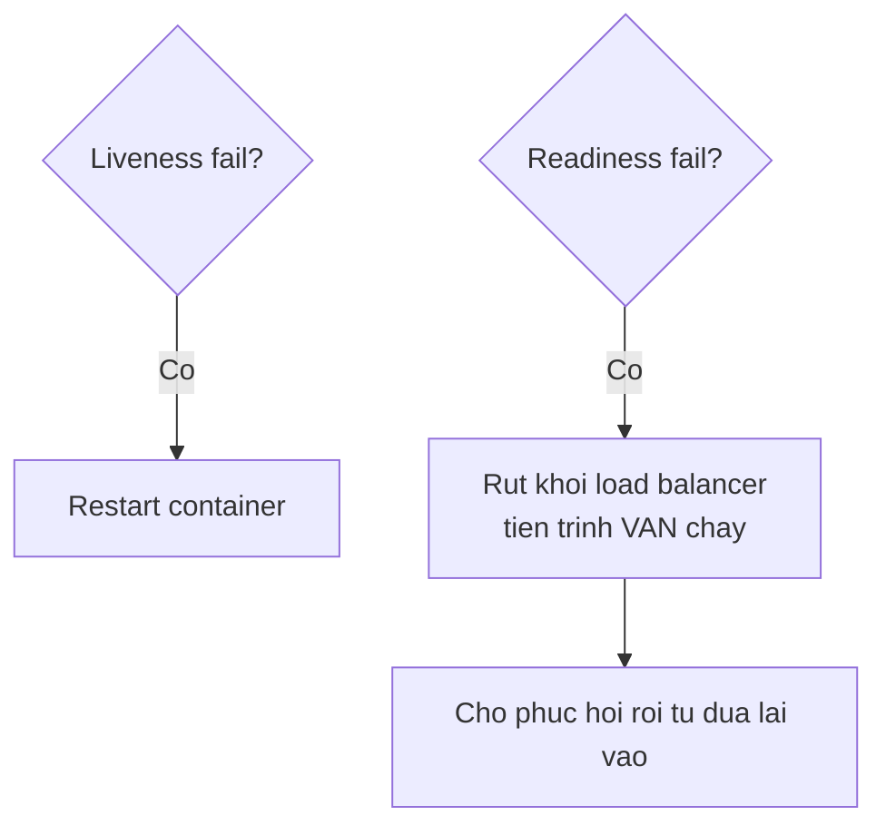

import { SummaryBox, Checklist, FAQSection } from '@site/src/components/SEO';

# 8.10 — 9. Health Checks

<SummaryBox>
Health check không phải "một endpoint trả OK". Có **hai loại khác hẳn nhau**, và trộn chúng là nguyên nhân của một sự cố kinh điển: **liveness** trả lời "tiến trình có còn sống không" và thất bại nghĩa là **restart**; **readiness** trả lời "có nhận request được không" và thất bại nghĩa là **tạm rút khỏi load balancer**. Nếu liveness probe của bạn kiểm tra database, thì database chậm 30 giây sẽ làm Kubernetes **restart toàn bộ pod** — biến một sự cố database thành một sự cố toàn hệ thống, và các pod vừa khởi động lại càng làm database quá tải hơn.
</SummaryBox>

## Mục tiêu bài học

Sau bài này bạn có thể:

- Phân biệt liveness, readiness và startup probe.
- Cấu hình hai endpoint riêng bằng tag.
- Viết custom health check có timeout.
- Cấu hình probe trong Docker Compose và Kubernetes.
- Tránh biến health check thành điểm nghẽn.

## Nội dung bài học

### 8.10.1 — Hai câu hỏi khác nhau

| | Liveness | Readiness |
|---|---|---|
| Câu hỏi | Tiến trình còn sống không? | Nhận request được không? |
| Thất bại nghĩa là | **Restart container** | **Rút khỏi load balancer** |
| Nên kiểm tra | Chỉ bản thân tiến trình | Database, cache, phụ thuộc bắt buộc |
| Thời gian chạy | Vài mili giây | Có thể vài trăm mili giây |



**Vì sao trộn hai loại là nguy hiểm:**

Giả sử liveness probe kiểm tra database. Database chậm 30 giây vì một truy vấn nặng:

1. Liveness thất bại ở mọi pod.
2. Kubernetes restart **toàn bộ** pod.
3. Các pod khởi động lại đồng loạt mở kết nối mới → database càng quá tải.
4. Liveness lại thất bại → restart loop.

Một sự cố database đã biến thành sự cố toàn hệ thống, và vòng lặp tự nuôi chính nó. Với readiness thì các pod chỉ tạm rút khỏi load balancer, giữ nguyên trạng thái, và tự quay lại khi database hồi phục.

**Quy tắc: liveness không kiểm tra gì bên ngoài tiến trình.**

### 8.10.2 — Cấu hình bằng tag

```csharp
builder.Services.AddHealthChecks()
    // Liveness — khong cham gi ben ngoai
    .AddCheck("self", () => HealthCheckResult.Healthy(), tags: ["live"])

    // Readiness — phu thuoc bat buoc
    .AddSqlServer(
        connectionString: builder.Configuration.GetConnectionString("CrmDb")!,
        name: "database",
        failureStatus: HealthStatus.Unhealthy,
        tags: ["ready"])

    // Phu thuoc khong bat buoc -> Degraded, KHONG phai Unhealthy
    .AddRedis(
        builder.Configuration.GetConnectionString("Redis")!,
        name: "cache",
        failureStatus: HealthStatus.Degraded,
        tags: ["ready"]);
```

```csharp
app.MapHealthChecks("/health/live", new HealthCheckOptions
{
    Predicate = check => check.Tags.Contains("live")
});

app.MapHealthChecks("/health/ready", new HealthCheckOptions
{
    Predicate = check => check.Tags.Contains("ready"),
    ResponseWriter = WriteJsonResponse
});
```

`failureStatus` quan trọng hơn vẻ ngoài của nó. Ba trạng thái ánh xạ sang HTTP:

| Trạng thái | HTTP | Ý nghĩa |
|---|---|---|
| `Healthy` | 200 | Bình thường |
| `Degraded` | **200** | Có vấn đề nhưng vẫn phục vụ được |
| `Unhealthy` | 503 | Không phục vụ được |

`Degraded` trả **200**, nên load balancer vẫn gửi request tới. Đó chính là điều bạn muốn khi Redis chết: ứng dụng chậm hơn vì mất cache, nhưng vẫn chạy. Đặt Redis là `Unhealthy` sẽ rút **toàn bộ** pod khỏi load balancer vì một phụ thuộc không bắt buộc — tức tự gây ra downtime.

### 8.10.3 — Custom health check

```csharp
public sealed class PaymentGatewayHealthCheck(IHttpClientFactory factory) : IHealthCheck
{
    public async Task<HealthCheckResult> CheckHealthAsync(
        HealthCheckContext context, CancellationToken ct = default)
    {
        try
        {
            using var cts = CancellationTokenSource.CreateLinkedTokenSource(ct);
            cts.CancelAfter(TimeSpan.FromSeconds(3));          // BAT BUOC co timeout

            var client = factory.CreateClient("payment");
            var response = await client.GetAsync("/ping", cts.Token);

            return response.IsSuccessStatusCode
                ? HealthCheckResult.Healthy()
                : HealthCheckResult.Degraded($"Gateway tra ve {(int)response.StatusCode}");
        }
        catch (OperationCanceledException) when (!ct.IsCancellationRequested)
        {
            return HealthCheckResult.Degraded("Gateway khong phan hoi trong 3 giay");
        }
        catch (Exception ex)
        {
            return HealthCheckResult.Unhealthy("Khong ket noi duoc gateway", ex);
        }
    }
}

builder.Services.AddHealthChecks()
    .AddCheck<PaymentGatewayHealthCheck>("payment", tags: ["ready"]);
```

Ba nguyên tắc:

1. **Luôn có timeout.** Health check không timeout sẽ treo cùng phụ thuộc của nó, và probe của orchestrator sẽ timeout — kết quả là restart loop.
2. **Không bao giờ ném.** Trả `Unhealthy` kèm exception, để framework ghi lại đúng cách.
3. **Nhẹ.** Probe chạy mỗi 10–30 giây trên mọi instance. `SELECT 1` chứ không phải đếm số bản ghi.

Với database, `AddSqlServer` mặc định chạy `SELECT 1` — vừa đủ.

### 8.10.4 — Đừng lộ chi tiết ra ngoài

```csharp
static Task WriteJsonResponse(HttpContext context, HealthReport report)
{
    context.Response.ContentType = "application/json";

    return context.Response.WriteAsJsonAsync(new
    {
        status = report.Status.ToString(),
        duration = report.TotalDuration.TotalMilliseconds,
        checks = report.Entries.Select(e => new
        {
            name = e.Key,
            status = e.Value.Status.ToString(),
            duration = e.Value.Duration.TotalMilliseconds
            // KHONG tra e.Value.Description hay Exception ra ngoai
        })
    });
}
```

`Description` và `Exception` thường chứa connection string, tên máy chủ và thông điệp lỗi của database — đúng những thứ [bài 8.9](8.9-global-exception-handling.mdx) nói là không được lộ.

Nếu cần endpoint chi tiết cho đội vận hành, giới hạn truy cập:

```csharp
app.MapHealthChecks("/health/detail", new HealthCheckOptions
{
    Predicate = _ => true,
    ResponseWriter = WriteDetailedResponse
}).RequireAuthorization("OpsOnly");
```

Và nhớ loại health check khỏi log truy cập ([bài 8.8](8.8-logging-with-serilog.mdx)) — probe mỗi 10 giây là 8.640 dòng log mỗi ngày cho mỗi instance.

### 8.10.5 — Cấu hình probe

```yaml
# docker-compose.yml
healthcheck:
  test: ["CMD", "curl", "-f", "http://localhost:8080/health/live"]
  interval: 30s
  timeout: 5s
  retries: 3
  start_period: 40s
```

`start_period` là phần hay bị bỏ qua: trong khoảng đó, thất bại **không tính**. Ứng dụng .NET cần vài giây để JIT và chạy migration, và không có nó thì container bị đánh dấu hỏng trước khi kịp khởi động.

```yaml
# Kubernetes
startupProbe:                       # cho phep khoi dong cham
  httpGet: { path: /health/live, port: 8080 }
  failureThreshold: 30
  periodSeconds: 10                 # cho toi da 300 giay

livenessProbe:
  httpGet: { path: /health/live, port: 8080 }
  periodSeconds: 10
  failureThreshold: 3

readinessProbe:
  httpGet: { path: /health/ready, port: 8080 }
  periodSeconds: 10
  failureThreshold: 2
```

`startupProbe` là cách đúng cho ứng dụng khởi động chậm: khi nó còn chạy, liveness và readiness **bị tạm dừng**. Không có nó, bạn buộc phải đặt `initialDelaySeconds` lớn cho liveness — và như vậy suốt vòng đời pod, mọi sự cố thật đều được phát hiện chậm hơn.

### 8.10.6 — Rà lại code của bạn

<Checklist
  title="Danh sách rà soát health checks"
  items={[
    { text: "Liveness và readiness là hai endpoint riêng biệt." },
    { text: "Liveness không kiểm tra database hay bất kỳ phụ thuộc bên ngoài nào." },
    { text: "Phụ thuộc không bắt buộc như cache đặt failureStatus là Degraded." },
    { text: "Mọi custom health check đều có timeout riêng." },
    { text: "Health check không bao giờ ném exception, luôn trả HealthCheckResult." },
    { text: "Endpoint công khai không trả Description hay Exception." },
    { text: "Health check bị loại khỏi log truy cập." },
    { text: "Kubernetes có startupProbe cho ứng dụng khởi động chậm." },
    { text: "docker-compose healthcheck có start_period đủ dài." },
  ]}
/>

## Bài tập áp dụng

#### Bài 1 — Tái hiện vòng lặp khởi động lại

Cấu hình liveness probe kiểm tra database, dừng database, và quan sát container bị khởi động lại liên tục. Tách sang readiness và xác nhận container vẫn chạy còn lưu lượng được chuyển đi.

**Tiêu chí hoàn thành:** bạn mô tả được vòng lặp theo từng bước và nêu được vì sao nó **làm sự cố tệ hơn**.

<details>
<summary><strong>Gợi ý và lời giải — Bài 1</strong></summary>

**Gợi ý.** Kubernetes phản ứng với hai probe theo hai cách hoàn toàn khác nhau: liveness thất bại thì **giết và khởi động lại**; readiness thất bại thì **ngừng gửi lưu lượng** nhưng để container chạy.

**Lời giải — cấu hình sai:**

```yaml
livenessProbe:
  httpGet: { path: /health, port: 8080 }    # /health kiểm tra CẢ database
  periodSeconds: 10
  failureThreshold: 3
```

```csharp
builder.Services.AddHealthChecks()
    .AddNpgSql(cs);          // không phân tag — nằm trong cả /health
```

**Vòng lặp khi database gặp sự cố 30 giây:**

```text
1. Database chậm/mất kết nối
2. /health trả 503 trên MỌI thể hiện
3. Sau 3 lần thất bại (30 giây), Kubernetes GIẾT toàn bộ pod
4. Pod mới khởi động, mở kết nối mới tới database
5. Một đợt kết nối đồng loạt đổ vào database vốn đang yếu
6. Database quá tải THẬT -> chậm hơn nữa
7. Health check lại thất bại -> quay lại bước 3
```

Một sự cố database 30 giây biến thành **gián đoạn kéo dài**, và chính cơ chế bảo vệ là nguyên nhân. Đây là vòng lặp khởi động lại, một lỗi cấu hình kinh điển.

**Cấu hình đúng — tách bằng tag:**

```csharp
builder.Services.AddHealthChecks()
    .AddCheck("self", () => HealthCheckResult.Healthy(), tags: ["live"])
    .AddNpgSql(cs, name: "postgres", tags: ["ready"])
    .AddRedis(redis, name: "redis", tags: ["ready"]);

app.MapHealthChecks("/health/live",  new() { Predicate = c => c.Tags.Contains("live") });
app.MapHealthChecks("/health/ready", new() { Predicate = c => c.Tags.Contains("ready") });
```

```yaml
livenessProbe:
  httpGet: { path: /health/live, port: 8080 }     # chỉ hỏi "tiến trình còn sống không"
  periodSeconds: 10
  failureThreshold: 3

readinessProbe:
  httpGet: { path: /health/ready, port: 8080 }    # hỏi "sẵn sàng phục vụ chưa"
  periodSeconds: 5
  failureThreshold: 2
```

**Hành vi mới khi database gặp sự cố:**

```text
1. Database chậm
2. /health/ready trả 503 -> Kubernetes NGỪNG gửi lưu lượng tới pod
3. /health/live vẫn trả 200 -> pod KHÔNG bị giết
4. Database hồi phục
5. /health/ready trả 200 -> lưu lượng quay lại
```

Không có pod nào bị khởi động lại, không có đợt kết nối đồng loạt, và ứng dụng tự phục hồi khi database hồi phục.

**Ba nguyên tắc viết health check:**

| Loại | Kiểm tra gì | Không kiểm tra gì |
|---|---|---|
| **Liveness** | Tiến trình còn phản hồi | **Mọi phụ thuộc bên ngoài** |
| **Readiness** | Phụ thuộc **bắt buộc** | Phụ thuộc tuỳ chọn |
| **Startup** | Khởi tạo đã xong chưa | — |

Dòng thứ hai đáng nói thêm: chỉ đưa vào readiness những thứ mà **thiếu nó thì ứng dụng không làm được gì**. Một dịch vụ gửi email hỏng không nên khiến toàn bộ API ngừng nhận request — hãy để nó ở mức `Degraded` thay vì `Unhealthy`, như bài 2 phân tích.

**Startup probe cho ứng dụng khởi động chậm:**

```yaml
startupProbe:
  httpGet: { path: /health/live, port: 8080 }
  failureThreshold: 30
  periodSeconds: 5          # cho phép tối đa 150 giây để khởi động
```

Khi có startup probe, Kubernetes **hoãn** liveness cho tới khi nó thành công lần đầu. Không có nó, một ứng dụng cần 60 giây để khởi động sẽ bị giết ở giây thứ 30 — và rơi vào một vòng lặp khởi động lại khác, lần này ngay từ đầu.

</details>

#### Bài 2 — `Degraded` trả 200

Đặt Redis ở trạng thái `Degraded`, dừng Redis, và gọi `/health/ready`. Xác nhận mã trạng thái là 200 dù JSON ghi `Degraded`. Đổi sang `Unhealthy` và xác nhận nó thành 503.

**Tiêu chí hoàn thành:** bạn nêu được khi nào nên dùng `Degraded` và khi nào phải dùng `Unhealthy`.

<details>
<summary><strong>Gợi ý và lời giải — Bài 2</strong></summary>

**Gợi ý.** ASP.NET Core ánh xạ ba trạng thái sang hai mã HTTP. Hãy tìm xem `Degraded` rơi vào nhóm nào.

**Lời giải.**

```csharp
builder.Services.AddHealthChecks()
    .AddRedis(redis, name: "redis", tags: ["ready"],
              failureStatus: HealthStatus.Degraded);      // <- thay vì Unhealthy
```

Dừng Redis rồi gọi:

```bash
curl -i localhost:5000/health/ready
```

```text
HTTP/1.1 200 OK

{
  "status": "Degraded",
  "results": {
    "postgres": { "status": "Healthy" },
    "redis":    { "status": "Degraded", "description": "Connection refused" }
  }
}
```

**Mã 200 dù trạng thái là `Degraded`.** Kubernetes coi pod này vẫn sẵn sàng và tiếp tục gửi lưu lượng.

Đổi thành `HealthStatus.Unhealthy`:

```text
HTTP/1.1 503 Service Unavailable
```

**Bảng ánh xạ mặc định:**

| `HealthStatus` | Mã HTTP | Kubernetes hiểu là |
|---|---|---|
| `Healthy` | 200 | Sẵn sàng |
| `Degraded` | **200** | **Sẵn sàng** |
| `Unhealthy` | 503 | Không sẵn sàng |

**Khi nào dùng cái nào — câu hỏi quyết định:** *thiếu thứ này thì ứng dụng còn phục vụ được phần lớn chức năng không?*

| Phụ thuộc | Trạng thái khi hỏng | Vì sao |
|---|---|---|
| Database chính | `Unhealthy` | Không có nó thì hầu như không làm được gì |
| Redis dùng làm cache | **`Degraded`** | Chậm hơn, nhưng vẫn chạy được từ database |
| Redis dùng lưu phiên | `Unhealthy` | Không có nó thì người dùng không đăng nhập được |
| Dịch vụ gửi email | `Degraded` | Xếp hàng lại, gửi sau |
| Cổng thanh toán | `Degraded` | Chỉ ảnh hưởng luồng thanh toán |
| Dịch vụ lưu file | Tuỳ | Ảnh hưởng tính năng tải lên, không ảnh hưởng phần còn lại |

Chú ý Redis xuất hiện hai lần với hai kết luận khác nhau — **cùng một công nghệ, vai trò khác nhau thì trạng thái khác nhau**. Điều quyết định không phải là thứ gì hỏng mà là **hệ thống còn làm được gì khi thiếu nó**.

**Đổi ánh xạ khi cần:**

```csharp
app.MapHealthChecks("/health/ready", new HealthCheckOptions
{
    Predicate = c => c.Tags.Contains("ready"),
    ResultStatusCodes =
    {
        [HealthStatus.Healthy]   = StatusCodes.Status200OK,
        [HealthStatus.Degraded]  = StatusCodes.Status200OK,        // giữ 200
        [HealthStatus.Unhealthy] = StatusCodes.Status503ServiceUnavailable
    }
});
```

**Giá trị thật của `Degraded`: nó là tín hiệu cho hệ thống giám sát, không cho bộ điều phối.** Kubernetes bỏ qua nó, nhưng bạn nên cảnh báo dựa trên nó:

```text
Unhealthy -> cảnh báo mức khẩn cấp, gọi người trực
Degraded  -> cảnh báo mức thấp, xem trong giờ làm việc
```

Nhờ vậy bạn biết Redis đang hỏng và cần xử lý, nhưng không ai bị đánh thức lúc 3 giờ sáng cho một vấn đề chỉ làm hệ thống chậm đi.

**Một lưu ý về phản hồi mặc định.** `MapHealthChecks` mặc định chỉ trả **một chuỗi** như `Healthy`, không phải JSON như ví dụ trên. Muốn có chi tiết thì phải viết `ResponseWriter` — và khi viết, hãy cẩn thận không lộ thông tin nội bộ ra endpoint công khai, như bài tiếp theo trong mục 8.10.4 trình bày.

</details>

#### Bài 3 — Đo chi phí của chính probe

Viết một health check chạy `SELECT COUNT(*)` trên bảng lớn, đặt chu kỳ 5 giây, và đo tải database sinh ra bởi chính health check trên 5 thể hiện.

**Tiêu chí hoàn thành:** bạn tính được số truy vấn mỗi ngày và nêu được nguyên tắc viết health check rẻ.

<details>
<summary><strong>Gợi ý và lời giải — Bài 3</strong></summary>

**Gợi ý.** Nhân lên: số probe × chu kỳ × số thể hiện × số giây trong ngày. Con số thường lớn hơn nhiều so với trực giác.

**Lời giải — health check tốn kém:**

```csharp
builder.Services.AddHealthChecks()
    .AddCheck<DatabaseHealthCheck>("db", tags: ["ready"]);

public class DatabaseHealthCheck(CrmDbContext db) : IHealthCheck
{
    public async Task<HealthCheckResult> CheckHealthAsync(
        HealthCheckContext ctx, CancellationToken ct)
    {
        var n = await db.Orders.CountAsync(ct);          // QUÉT TOÀN BẢNG
        return HealthCheckResult.Healthy($"{n} đơn hàng");
    }
}
```

**Tính tải:**

```text
1 probe mỗi 5 giây = 12 lần mỗi phút
× 5 thể hiện       = 60 truy vấn mỗi phút
× 60 × 24          = 86.400 truy vấn COUNT(*) mỗi ngày
```

Trên bảng 10 triệu dòng, mỗi `COUNT(*)` có thể mất hàng trăm mili-giây và quét toàn bộ bảng. Đây là **tải thường trực** do chính cơ chế giám sát tạo ra — và nó chạy cả lúc hệ thống không có người dùng nào.

Thêm cả liveness probe và một hệ thống giám sát ngoài cùng gọi, con số dễ dàng vượt 200.000 truy vấn mỗi ngày.

**Health check rẻ:**

```csharp
public class DatabaseHealthCheck(CrmDbContext db) : IHealthCheck
{
    public async Task<HealthCheckResult> CheckHealthAsync(
        HealthCheckContext ctx, CancellationToken ct)
    {
        try
        {
            using var cts = CancellationTokenSource.CreateLinkedTokenSource(ct);
            cts.CancelAfter(TimeSpan.FromSeconds(2));           // hạn chặt

            var mo = await db.Database.CanConnectAsync(cts.Token);
            return mo
                ? HealthCheckResult.Healthy()
                : HealthCheckResult.Unhealthy("Không kết nối được database");
        }
        catch (Exception ex)
        {
            return HealthCheckResult.Unhealthy("Database không phản hồi", ex);
        }
    }
}
```

`CanConnectAsync` chỉ mở kết nối và chạy một truy vấn tối thiểu — vài mili-giây, không chạm dữ liệu.

**Bốn nguyên tắc viết health check:**

1. **Kiểm tra *kết nối được không*, không kiểm tra *dữ liệu có đúng không*.** Health check trả lời "tôi có nói chuyện được với database không", không phải "dữ liệu có toàn vẹn không".
2. **Luôn đặt hạn chờ ngắn.** Health check không có hạn chờ sẽ **tự nó bị treo**, và bộ điều phối hiểu nhầm là tiến trình chết — một cách tự gây ra sự cố.
3. **Không bao giờ ném ngoại lệ.** Bắt hết và trả `Unhealthy` kèm mô tả. Ngoại lệ thoát ra khỏi health check cho phản hồi 500 thay vì 503, và một số bộ cân bằng tải xử lý hai mã này khác nhau.
4. **Lưu đệm kết quả khi kiểm tra tốn kém:**

   ```csharp
   builder.Services.AddHealthChecks()
       .AddCheck<ExpensiveCheck>("x", tags: ["ready"])
       .AddCheck("cached", () => /* đọc kết quả đã đệm 30 giây */);
   ```

**Đừng quên chính hạ tầng cũng gọi.** Danh sách những thứ thường cùng gọi một endpoint health check:

| Nguồn gọi | Chu kỳ điển hình |
|---|---|
| Kubernetes liveness | 10 giây |
| Kubernetes readiness | 5 giây |
| Bộ cân bằng tải | 5–30 giây |
| Hệ thống giám sát ngoài | 30–60 giây |
| Bảng điều khiển trạng thái | 10 giây |

Năm nguồn, nhân với số thể hiện. Vì vậy health check phải rẻ tới mức bạn không cần nghĩ tới chi phí của nó.

</details>

## Tự kiểm tra

<FAQSection
  items={[
    {
      question: "Liveness và readiness khác nhau thế nào?",
      answer: "Liveness trả lời tiến trình còn sống không, và thất bại nghĩa là restart container. Readiness trả lời có nhận request được không, và thất bại nghĩa là tạm rút khỏi load balancer nhưng tiến trình vẫn chạy. Liveness chỉ nên kiểm tra bản thân tiến trình, còn readiness kiểm tra các phụ thuộc bắt buộc."
    },
    {
      question: "Vì sao liveness probe không được kiểm tra database?",
      answer: "Vì database chậm sẽ làm liveness thất bại ở mọi pod, orchestrator restart toàn bộ, các pod khởi động lại đồng loạt mở kết nối mới khiến database càng quá tải, rồi liveness lại thất bại. Một sự cố database biến thành sự cố toàn hệ thống với vòng lặp tự nuôi chính nó."
    },
    {
      question: "Degraded trả về mã HTTP nào?",
      answer: "200, không phải 503. Đó là điều bạn muốn khi một phụ thuộc không bắt buộc như Redis chết: ứng dụng chậm hơn vì mất cache nhưng vẫn phục vụ được. Đặt phụ thuộc không bắt buộc là Unhealthy sẽ rút toàn bộ pod khỏi load balancer và tự gây ra downtime."
    },
    {
      question: "Custom health check cần theo nguyên tắc nào?",
      answer: "Ba nguyên tắc. Luôn có timeout, vì check không timeout sẽ treo cùng phụ thuộc và probe của orchestrator sẽ timeout dẫn tới restart loop. Không bao giờ ném exception mà trả HealthCheckResult.Unhealthy kèm exception. Và phải nhẹ, vì probe chạy mỗi 10 tới 30 giây trên mọi instance."
    },
    {
      question: "Vì sao không trả Description ra endpoint công khai?",
      answer: "Vì Description và Exception thường chứa connection string, tên máy chủ nội bộ và thông điệp lỗi của database. Cần chi tiết cho đội vận hành thì làm một endpoint riêng có yêu cầu xác thực."
    },
    {
      question: "startupProbe giải quyết vấn đề gì?",
      answer: "Nó cho ứng dụng khởi động chậm một khoảng thời gian dài mà trong đó liveness và readiness bị tạm dừng. Không có nó thì bạn buộc phải đặt initialDelaySeconds lớn cho liveness, và như vậy suốt vòng đời pod mọi sự cố thật đều được phát hiện chậm hơn."
    }
  ]}
/>

## Kết luận

Ba điều đáng nhớ nhất:

1. **Liveness không chạm gì bên ngoài tiến trình.** Trộn với readiness là công thức của restart loop.
2. **Phụ thuộc không bắt buộc là `Degraded`**, và `Degraded` trả 200.
3. **Endpoint công khai chỉ trả trạng thái.** Chi tiết nằm sau xác thực.

## Tham khảo

- [Health checks in ASP.NET Core](https://learn.microsoft.com/en-us/aspnet/core/host-and-deploy/health-checks)
- [Configure Liveness, Readiness and Startup Probes (Kubernetes)](https://kubernetes.io/docs/tasks/configure-pod-container/configure-liveness-readiness-startup-probes/)
- [Health monitoring in microservices](https://learn.microsoft.com/en-us/dotnet/architecture/microservices/implement-resilient-applications/monitor-app-health)
- [AspNetCore.Diagnostics.HealthChecks](https://github.com/Xabaril/AspNetCore.Diagnostics.HealthChecks)

## Điều hướng

- **Bài trước:** [8.9 — 8. Global Exception Handling](8.9-global-exception-handling.mdx)
- **Bài tiếp theo:** [8.11 — Mở rộng và đào sâu](8.11-advanced-notes.mdx)
- **Về module:** [Trang mục lục](./)
