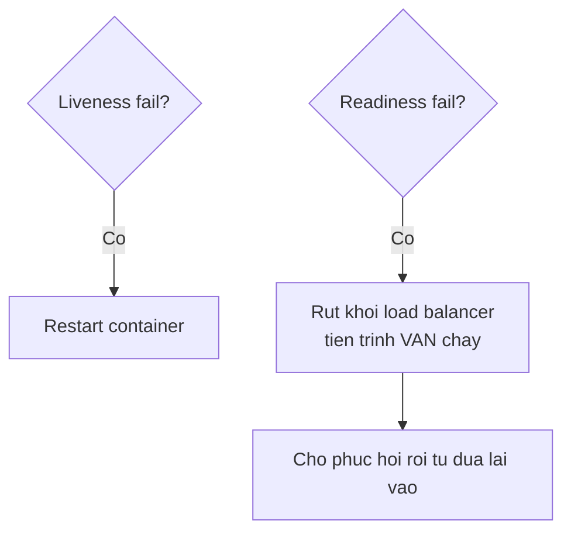

import { SummaryBox, Checklist, FAQSection } from '@site/src/components/SEO';

# 8.10 — 9. Health Checks

<SummaryBox>
Health check không phải "một endpoint trả OK". Có **hai loại khác hẳn nhau**, và trộn chúng là nguyên nhân của một sự cố kinh điển: **liveness** trả lời "tiến trình có còn sống không" và thất bại nghĩa là **restart**; **readiness** trả lời "có nhận request được không" và thất bại nghĩa là **tạm rút khỏi load balancer**. Nếu liveness probe của bạn kiểm tra database, thì database chậm 30 giây sẽ làm Kubernetes **restart toàn bộ pod** — biến một sự cố database thành một sự cố toàn hệ thống, và các pod vừa khởi động lại càng làm database quá tải hơn.
</SummaryBox>

## Mục tiêu bài học

Sau bài này bạn có thể:

- Phân biệt liveness, readiness và startup probe.
- Cấu hình hai endpoint riêng bằng tag.
- Viết custom health check có timeout.
- Cấu hình probe trong Docker Compose và Kubernetes.
- Tránh biến health check thành điểm nghẽn.

## Nội dung bài học

### 8.10.1 — Hai câu hỏi khác nhau

| | Liveness | Readiness |
|---|---|---|
| Câu hỏi | Tiến trình còn sống không? | Nhận request được không? |
| Thất bại nghĩa là | **Restart container** | **Rút khỏi load balancer** |
| Nên kiểm tra | Chỉ bản thân tiến trình | Database, cache, phụ thuộc bắt buộc |
| Thời gian chạy | Vài mili giây | Có thể vài trăm mili giây |



**Vì sao trộn hai loại là nguy hiểm:**

Giả sử liveness probe kiểm tra database. Database chậm 30 giây vì một truy vấn nặng:

1. Liveness thất bại ở mọi pod.
2. Kubernetes restart **toàn bộ** pod.
3. Các pod khởi động lại đồng loạt mở kết nối mới → database càng quá tải.
4. Liveness lại thất bại → restart loop.

Một sự cố database đã biến thành sự cố toàn hệ thống, và vòng lặp tự nuôi chính nó. Với readiness thì các pod chỉ tạm rút khỏi load balancer, giữ nguyên trạng thái, và tự quay lại khi database hồi phục.

**Quy tắc: liveness không kiểm tra gì bên ngoài tiến trình.**

### 8.10.2 — Cấu hình bằng tag

```csharp
builder.Services.AddHealthChecks()
    // Liveness — khong cham gi ben ngoai
    .AddCheck("self", () => HealthCheckResult.Healthy(), tags: ["live"])

    // Readiness — phu thuoc bat buoc
    .AddSqlServer(
        connectionString: builder.Configuration.GetConnectionString("CrmDb")!,
        name: "database",
        failureStatus: HealthStatus.Unhealthy,
        tags: ["ready"])

    // Phu thuoc khong bat buoc -> Degraded, KHONG phai Unhealthy
    .AddRedis(
        builder.Configuration.GetConnectionString("Redis")!,
        name: "cache",
        failureStatus: HealthStatus.Degraded,
        tags: ["ready"]);
```

```csharp
app.MapHealthChecks("/health/live", new HealthCheckOptions
{
    Predicate = check => check.Tags.Contains("live")
});

app.MapHealthChecks("/health/ready", new HealthCheckOptions
{
    Predicate = check => check.Tags.Contains("ready"),
    ResponseWriter = WriteJsonResponse
});
```

`failureStatus` quan trọng hơn vẻ ngoài của nó. Ba trạng thái ánh xạ sang HTTP:

| Trạng thái | HTTP | Ý nghĩa |
|---|---|---|
| `Healthy` | 200 | Bình thường |
| `Degraded` | **200** | Có vấn đề nhưng vẫn phục vụ được |
| `Unhealthy` | 503 | Không phục vụ được |

`Degraded` trả **200**, nên load balancer vẫn gửi request tới. Đó chính là điều bạn muốn khi Redis chết: ứng dụng chậm hơn vì mất cache, nhưng vẫn chạy. Đặt Redis là `Unhealthy` sẽ rút **toàn bộ** pod khỏi load balancer vì một phụ thuộc không bắt buộc — tức tự gây ra downtime.

### 8.10.3 — Custom health check

```csharp
public sealed class PaymentGatewayHealthCheck(IHttpClientFactory factory) : IHealthCheck
{
    public async Task<HealthCheckResult> CheckHealthAsync(
        HealthCheckContext context, CancellationToken ct = default)
    {
        try
        {
            using var cts = CancellationTokenSource.CreateLinkedTokenSource(ct);
            cts.CancelAfter(TimeSpan.FromSeconds(3));          // BAT BUOC co timeout

            var client = factory.CreateClient("payment");
            var response = await client.GetAsync("/ping", cts.Token);

            return response.IsSuccessStatusCode
                ? HealthCheckResult.Healthy()
                : HealthCheckResult.Degraded($"Gateway tra ve {(int)response.StatusCode}");
        }
        catch (OperationCanceledException) when (!ct.IsCancellationRequested)
        {
            return HealthCheckResult.Degraded("Gateway khong phan hoi trong 3 giay");
        }
        catch (Exception ex)
        {
            return HealthCheckResult.Unhealthy("Khong ket noi duoc gateway", ex);
        }
    }
}

builder.Services.AddHealthChecks()
    .AddCheck<PaymentGatewayHealthCheck>("payment", tags: ["ready"]);
```

Ba nguyên tắc:

1. **Luôn có timeout.** Health check không timeout sẽ treo cùng phụ thuộc của nó, và probe của orchestrator sẽ timeout — kết quả là restart loop.
2. **Không bao giờ ném.** Trả `Unhealthy` kèm exception, để framework ghi lại đúng cách.
3. **Nhẹ.** Probe chạy mỗi 10–30 giây trên mọi instance. `SELECT 1` chứ không phải đếm số bản ghi.

Với database, `AddSqlServer` mặc định chạy `SELECT 1` — vừa đủ.

### 8.10.4 — Đừng lộ chi tiết ra ngoài

```csharp
static Task WriteJsonResponse(HttpContext context, HealthReport report)
{
    context.Response.ContentType = "application/json";

    return context.Response.WriteAsJsonAsync(new
    {
        status = report.Status.ToString(),
        duration = report.TotalDuration.TotalMilliseconds,
        checks = report.Entries.Select(e => new
        {
            name = e.Key,
            status = e.Value.Status.ToString(),
            duration = e.Value.Duration.TotalMilliseconds
            // KHONG tra e.Value.Description hay Exception ra ngoai
        })
    });
}
```

`Description` và `Exception` thường chứa connection string, tên máy chủ và thông điệp lỗi của database — đúng những thứ [bài 8.9](8.9-global-exception-handling.mdx) nói là không được lộ.

Nếu cần endpoint chi tiết cho đội vận hành, giới hạn truy cập:

```csharp
app.MapHealthChecks("/health/detail", new HealthCheckOptions
{
    Predicate = _ => true,
    ResponseWriter = WriteDetailedResponse
}).RequireAuthorization("OpsOnly");
```

Và nhớ loại health check khỏi log truy cập ([bài 8.8](8.8-logging-with-serilog.mdx)) — probe mỗi 10 giây là 8.640 dòng log mỗi ngày cho mỗi instance.

### 8.10.5 — Cấu hình probe

```yaml
# docker-compose.yml
healthcheck:
  test: ["CMD", "curl", "-f", "http://localhost:8080/health/live"]
  interval: 30s
  timeout: 5s
  retries: 3
  start_period: 40s
```

`start_period` là phần hay bị bỏ qua: trong khoảng đó, thất bại **không tính**. Ứng dụng .NET cần vài giây để JIT và chạy migration, và không có nó thì container bị đánh dấu hỏng trước khi kịp khởi động.

```yaml
# Kubernetes
startupProbe:                       # cho phep khoi dong cham
  httpGet: { path: /health/live, port: 8080 }
  failureThreshold: 30
  periodSeconds: 10                 # cho toi da 300 giay

livenessProbe:
  httpGet: { path: /health/live, port: 8080 }
  periodSeconds: 10
  failureThreshold: 3

readinessProbe:
  httpGet: { path: /health/ready, port: 8080 }
  periodSeconds: 10
  failureThreshold: 2
```

`startupProbe` là cách đúng cho ứng dụng khởi động chậm: khi nó còn chạy, liveness và readiness **bị tạm dừng**. Không có nó, bạn buộc phải đặt `initialDelaySeconds` lớn cho liveness — và như vậy suốt vòng đời pod, mọi sự cố thật đều được phát hiện chậm hơn.

### 8.10.6 — Rà lại code của bạn

<Checklist
  title="Danh sách rà soát health checks"
  items={[
    { text: "Liveness và readiness là hai endpoint riêng biệt." },
    { text: "Liveness không kiểm tra database hay bất kỳ phụ thuộc bên ngoài nào." },
    { text: "Phụ thuộc không bắt buộc như cache đặt failureStatus là Degraded." },
    { text: "Mọi custom health check đều có timeout riêng." },
    { text: "Health check không bao giờ ném exception, luôn trả HealthCheckResult." },
    { text: "Endpoint công khai không trả Description hay Exception." },
    { text: "Health check bị loại khỏi log truy cập." },
    { text: "Kubernetes có startupProbe cho ứng dụng khởi động chậm." },
    { text: "docker-compose healthcheck có start_period đủ dài." },
  ]}
/>

## Bài tập áp dụng

1. **Tái hiện restart loop.** Cấu hình liveness probe kiểm tra database, dừng database, và quan sát container bị restart liên tục. Tách sang readiness và xác nhận container vẫn chạy còn traffic được chuyển đi.

2. **`Degraded` trả 200.** Đặt Redis là `Degraded`, dừng Redis, và gọi `/health/ready`. Xác nhận status code là 200 dù JSON ghi `Degraded`. Đổi sang `Unhealthy` và xác nhận nó thành 503.

3. **Đo chi phí probe.** Viết một health check chạy `SELECT COUNT(*)` trên bảng lớn, đặt `periodSeconds: 5`, và đo tải database sinh ra bởi chính health check trên 5 instance.

## Tự kiểm tra

<FAQSection
  items={[
    {
      question: "Liveness và readiness khác nhau thế nào?",
      answer: "Liveness trả lời tiến trình còn sống không, và thất bại nghĩa là restart container. Readiness trả lời có nhận request được không, và thất bại nghĩa là tạm rút khỏi load balancer nhưng tiến trình vẫn chạy. Liveness chỉ nên kiểm tra bản thân tiến trình, còn readiness kiểm tra các phụ thuộc bắt buộc."
    },
    {
      question: "Vì sao liveness probe không được kiểm tra database?",
      answer: "Vì database chậm sẽ làm liveness thất bại ở mọi pod, orchestrator restart toàn bộ, các pod khởi động lại đồng loạt mở kết nối mới khiến database càng quá tải, rồi liveness lại thất bại. Một sự cố database biến thành sự cố toàn hệ thống với vòng lặp tự nuôi chính nó."
    },
    {
      question: "Degraded trả về mã HTTP nào?",
      answer: "200, không phải 503. Đó là điều bạn muốn khi một phụ thuộc không bắt buộc như Redis chết: ứng dụng chậm hơn vì mất cache nhưng vẫn phục vụ được. Đặt phụ thuộc không bắt buộc là Unhealthy sẽ rút toàn bộ pod khỏi load balancer và tự gây ra downtime."
    },
    {
      question: "Custom health check cần theo nguyên tắc nào?",
      answer: "Ba nguyên tắc. Luôn có timeout, vì check không timeout sẽ treo cùng phụ thuộc và probe của orchestrator sẽ timeout dẫn tới restart loop. Không bao giờ ném exception mà trả HealthCheckResult.Unhealthy kèm exception. Và phải nhẹ, vì probe chạy mỗi 10 tới 30 giây trên mọi instance."
    },
    {
      question: "Vì sao không trả Description ra endpoint công khai?",
      answer: "Vì Description và Exception thường chứa connection string, tên máy chủ nội bộ và thông điệp lỗi của database. Cần chi tiết cho đội vận hành thì làm một endpoint riêng có yêu cầu xác thực."
    },
    {
      question: "startupProbe giải quyết vấn đề gì?",
      answer: "Nó cho ứng dụng khởi động chậm một khoảng thời gian dài mà trong đó liveness và readiness bị tạm dừng. Không có nó thì bạn buộc phải đặt initialDelaySeconds lớn cho liveness, và như vậy suốt vòng đời pod mọi sự cố thật đều được phát hiện chậm hơn."
    }
  ]}
/>

## Kết luận

Ba điều đáng nhớ nhất:

1. **Liveness không chạm gì bên ngoài tiến trình.** Trộn với readiness là công thức của restart loop.
2. **Phụ thuộc không bắt buộc là `Degraded`**, và `Degraded` trả 200.
3. **Endpoint công khai chỉ trả trạng thái.** Chi tiết nằm sau xác thực.

## Tham khảo

- [Health checks in ASP.NET Core](https://learn.microsoft.com/en-us/aspnet/core/host-and-deploy/health-checks)
- [Configure Liveness, Readiness and Startup Probes (Kubernetes)](https://kubernetes.io/docs/tasks/configure-pod-container/configure-liveness-readiness-startup-probes/)
- [Health monitoring in microservices](https://learn.microsoft.com/en-us/dotnet/architecture/microservices/implement-resilient-applications/monitor-app-health)
- [AspNetCore.Diagnostics.HealthChecks](https://github.com/Xabaril/AspNetCore.Diagnostics.HealthChecks)

## Điều hướng

- **Bài trước:** [8.9 — 8. Global Exception Handling](8.9-global-exception-handling.mdx)
- **Bài tiếp theo:** [8.11 — Mở rộng và đào sâu](8.11-advanced-notes.mdx)
- **Về module:** [Trang mục lục](./)
