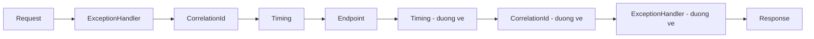

import { SummaryBox, Checklist, FAQSection } from '@site/src/components/SEO';

# 8.3 — 2. Request Pipeline và Middleware

<SummaryBox>
Pipeline **không phải một hàng đợi** mà là các lớp **bọc nhau**, giống búp bê Nga: mỗi middleware gọi `next()` rồi **code sau `next()` chạy trên đường về**. Hiểu đúng mô hình này giải thích ba thứ hay gây bối rối. Một: middleware đăng ký sớm thấy request **sớm nhất** nhưng thấy response **muộn nhất**. Hai: sau khi `next()` chạy xong, response có thể **đã gửi đi rồi**, nên mọi thay đổi header ở đó bị bỏ qua — im lặng hoặc kèm exception. Ba: middleware được dựng **một lần** cho cả vòng đời ứng dụng, nên nó là **singleton**, và tiêm service scoped vào constructor của nó là captive dependency.
</SummaryBox>

## Mục tiêu bài học

Sau bài này bạn có thể:

- Vẽ đúng đường đi của một request qua pipeline, cả chiều đi lẫn chiều về.
- Phân biệt `Use`, `Run`, `Map`, `MapWhen`, `UseWhen`.
- Viết middleware đúng cách với service scoped.
- Giải thích `HasStarted` và vì sao nó chặn việc ghi header.
- Chọn đúng vị trí cho từng middleware.

## Nội dung bài học

### 8.3.1 — Pipeline là các lớp bọc nhau



```csharp
app.Use(async (context, next) =>
{
    // (1) CHIỀU ĐI — trước khi các middleware sau chạy
    await next(context);
    // (2) CHIEU VE — sau khi TAT CA middleware sau va endpoint da chay xong
});
```

Hai hệ quả trực tiếp:

- Middleware đăng ký **sớm** thấy request **đầu tiên** và thấy response **cuối cùng**. Vì vậy `UseExceptionHandler` phải đứng đầu: nó cần bọc ngoài mọi thứ để bắt được exception từ mọi lớp bên trong.
- `try/finally` quanh `next()` cho bạn một chỗ chắc chắn chạy dù bên trong có ném hay không — đó là cách đo thời gian request.

### 8.3.2 — `Use`, `Run`, `Map`

```csharp
// Use — xử lý rồi chuyển tiếp
app.Use(async (context, next) => { ...; await next(context); ...; });

// Run — terminal, KHÔNG gọi next. Mọi thứ sau nó không bao giờ chạy.
app.Run(async context => await context.Response.WriteAsync("Hello"));

// Map — re nhanh theo duong dan, nhanh co pipeline rieng
app.Map("/admin", admin =>
{
    admin.UseMiddleware<AdminAuditMiddleware>();
    admin.Run(async ctx => await ctx.Response.WriteAsync("Admin"));
});

// MapWhen — re nhanh theo dieu kien tuy y
app.MapWhen(ctx => ctx.Request.Query.ContainsKey("debug"), branch => { ... });

// UseWhen — chay them middleware roi QUAY LAI pipeline chinh
app.UseWhen(ctx => ctx.Request.Path.StartsWithSegments("/api"),
    api => api.UseMiddleware<ApiKeyMiddleware>());
```

Khác biệt quan trọng nhất là giữa `MapWhen` và `UseWhen`:

| | Sau nhánh |
|---|---|
| `Map` / `MapWhen` | **Không quay lại** pipeline chính |
| `UseWhen` | **Quay lại** pipeline chính |

Chọn nhầm `MapWhen` khi bạn chỉ muốn thêm một bước kiểm tra sẽ khiến `MapControllers()` không bao giờ chạy cho nhánh đó — và bạn nhận 404 trên mọi endpoint khớp điều kiện.

**Short-circuit** là việc không gọi `next()`:

```csharp
app.Use(async (context, next) =>
{
    if (!context.Request.Headers.ContainsKey("X-Api-Key"))
    {
        context.Response.StatusCode = 401;
        await context.Response.WriteAsync("Thieu API key");
        return;                                   // không gọi next -> dừng ở đây
    }
    await next(context);
});
```

### 8.3.3 — Middleware là singleton

```csharp
// SAI — ICustomerRepository la Scoped
public class AuditMiddleware(RequestDelegate next, ICustomerRepository repo)
{
    public async Task InvokeAsync(HttpContext context) { ... }
}
```

Middleware được dựng **một lần** lúc khởi động và dùng lại cho mọi request — tức nó là **singleton**. Tiêm service scoped vào constructor là captive dependency ([bài 7.5](../../stage-02-csharp-professional/module-07-dependency-injection/7.4-service-lifetimes.mdx)), và nó sẽ nổ ngay lúc khởi động khi `ValidateScopes` bật.

```csharp
// ĐÚNG — tiêm qua tham số của InvokeAsync, mỗi request một instance
public class AuditMiddleware(RequestDelegate next, ILogger<AuditMiddleware> logger)
{
    public async Task InvokeAsync(HttpContext context, ICustomerRepository repo)
    {
        ...
        await next(context);
    }
}
```

`ILogger<T>` là singleton nên để ở constructor vẫn đúng. Chỉ service **scoped** mới phải xuống `InvokeAsync`.

Có một lựa chọn khác: cài `IMiddleware` và đăng ký nó `Scoped` — khi đó cả middleware được tạo mới mỗi request. Nó rõ ràng hơn nhưng tốn hơn, và phải nhớ đăng ký vào DI, nếu không bạn nhận lỗi lúc chạy.

### 8.3.4 — Hai middleware thật sự hữu ích

```csharp
// Đo thời gian — try/finally để luôn chạy dù có exception
public class RequestTimingMiddleware(RequestDelegate next, ILogger<RequestTimingMiddleware> logger)
{
    public async Task InvokeAsync(HttpContext context)
    {
        var start = Stopwatch.GetTimestamp();
        try
        {
            await next(context);
        }
        finally
        {
            logger.LogInformation("HTTP {Method} {Path} -> {StatusCode} trong {Elapsed}ms",
                context.Request.Method, context.Request.Path, context.Response.StatusCode,
                Stopwatch.GetElapsedTime(start).TotalMilliseconds);
        }
    }
}
```

`Stopwatch.GetTimestamp()` cộng `GetElapsedTime()` (.NET 7+) không cấp phát gì, khác với `Stopwatch.StartNew()` tạo một object mỗi request.

```csharp
// Correlation ID — nối log của nhiều hệ thống lại với nhau
public class CorrelationIdMiddleware(RequestDelegate next)
{
    private const string Header = "X-Correlation-ID";

    public async Task InvokeAsync(HttpContext context)
    {
        var correlationId = context.Request.Headers[Header].FirstOrDefault()
                            ?? Guid.NewGuid().ToString();

        context.TraceIdentifier = correlationId;

        // PHẢI đặt header TRƯỚC khi response bắt đầu
        context.Response.OnStarting(() =>
        {
            context.Response.Headers[Header] = correlationId;
            return Task.CompletedTask;
        });

        using (LogContext.PushProperty("CorrelationId", correlationId))
        {
            await next(context);
        }
    }
}
```

Chú ý `OnStarting`. Viết thẳng `context.Response.Headers[Header] = ...` **sau** `await next(context)` là lỗi ở mục tiếp theo.

### 8.3.5 — `HasStarted`: vì sao không ghi được header nữa

Response được gửi đi **theo luồng**. Ngay khi byte đầu tiên rời server, header đã đi trước nó — và không có cách nào lấy lại.

```csharp
await next(context);

context.Response.Headers["X-Foo"] = "bar";     // bị bỏ qua, hoặc ném exception
```

```csharp
if (!context.Response.HasStarted)
    context.Response.Headers["X-Foo"] = "bar";
```

Đây là nguyên nhân thật sự của lỗi kinh điển `System.InvalidOperationException: StatusCode cannot be set because the response has already started`. Nó hay xuất hiện ở middleware xử lý lỗi cố đổi status code sau khi endpoint đã ghi một phần response.

Cách đúng là `Response.OnStarting(...)` — callback chạy **ngay trước** khi header được gửi, tức thời điểm cuối cùng còn sửa được.

### 8.3.6 — Thứ tự

```csharp
app.UseForwardedHeaders();                       // trước mọi thứ đọc IP/scheme
app.UseExceptionHandler("/error");               // bao ngoai tat ca
app.UseMiddleware<CorrelationIdMiddleware>();    // som, de moi log deu co
app.UseRequestTiming();
app.UseHttpsRedirection();
app.UseStaticFiles();                            // trước auth: file tĩnh không cần xác thực
app.UseRouting();
app.UseRateLimiter();
app.UseCors();                                   // trước Authorization
app.UseAuthentication();                         // trước Authorization
app.UseAuthorization();
app.MapControllers();
```

Bốn hệ quả cụ thể khi sai, đã liệt kê ở [bài 7.7](../../stage-02-csharp-professional/module-07-dependency-injection/7.6-program-cs-and-webapplicationbuilder.mdx). Thêm một điểm riêng cho middleware của bạn: **đặt trước `UseRouting()` thì chưa biết endpoint nào sẽ xử lý**. Cần thông tin đó (ví dụ để đọc attribute trên action) thì phải đặt **giữa** `UseRouting()` và `UseEndpoints`/`MapControllers()`:

```csharp
app.UseRouting();
app.Use(async (ctx, next) =>
{
    var endpoint = ctx.GetEndpoint();            // null nếu đặt trước UseRouting
    var attr = endpoint?.Metadata.GetMetadata<AuditAttribute>();
    ...
    await next(ctx);
});
app.UseAuthorization();
```

### 8.3.7 — Sai lầm hay gặp

- **Quên `await next(context)`** — request rơi vào im lặng, client chờ tới timeout, không có lỗi nào trong log.
- **Đọc body request mà không bật buffering** — body là stream đọc một lần; middleware đọc xong thì model binding nhận stream rỗng. Cần `context.Request.EnableBuffering()` rồi `Position = 0` sau khi đọc.
- **Middleware có trạng thái** — nó là singleton, nên field instance bị chia sẻ giữa mọi request đồng thời. Trạng thái theo request thuộc về `HttpContext.Items`.
- **Việc nặng, đồng bộ trong middleware** — nó chạy cho **mọi** request, kể cả file tĩnh và health check.

### 8.3.8 — Rà lại code của bạn

<Checklist
  title="Danh sách rà soát middleware"
  items={[
    { text: "Mọi nhánh trong middleware đều gọi next hoặc cố ý short-circuit có ghi response." },
    { text: "Không tiêm service scoped vào constructor của middleware." },
    { text: "Middleware không có field instance nào giữ trạng thái theo request." },
    { text: "Việc ghi header sau next được bọc bằng HasStarted hoặc chuyển sang OnStarting." },
    { text: "Đo thời gian dùng try/finally để luôn ghi log kể cả khi có exception." },
    { text: "Middleware cần biết endpoint được đặt sau UseRouting()." },
    { text: "Middleware đọc body request có gọi EnableBuffering và reset Position." },
    { text: "Dùng UseWhen chứ không phải MapWhen khi cần quay lại pipeline chính." },
  ]}
/>

## Bài tập áp dụng

#### Bài 1 — Thấy đường ống chạy hai chiều

Viết ba middleware, mỗi cái ghi một dòng **trước** `next()` và một dòng **sau**. Gọi một endpoint và ghi lại thứ tự 6 dòng log.

**Tiêu chí hoàn thành:** bạn dự đoán đúng thứ tự **trước khi** chạy, và giải thích được vì sao nó đối xứng.

<details>
<summary><strong>Gợi ý và lời giải — Bài 1</strong></summary>

**Gợi ý.** Mỗi middleware **bọc** middleware phía sau nó, giống như các lớp vỏ hành. `await next()` là lời gọi vào lớp bên trong; dòng sau nó chỉ chạy khi lớp trong đã xong.

**Lời giải.**

```csharp
app.Use(async (ctx, next) =>
{
    Console.WriteLine("A vào");
    await next();
    Console.WriteLine("A ra");
});

app.Use(async (ctx, next) =>
{
    Console.WriteLine("B vào");
    await next();
    Console.WriteLine("B ra");
});

app.Use(async (ctx, next) =>
{
    Console.WriteLine("C vào");
    await next();
    Console.WriteLine("C ra");
});

app.MapGet("/", () => "xin chào");
```

**Kết quả:**

```text
A vào
B vào
C vào
A ra        <- KHÔNG PHẢI: thứ tự thật là C ra, B ra, A ra
```

Thứ tự đúng:

```text
A vào
B vào
C vào
C ra
B ra
A ra
```

**Đối xứng như ngoặc lồng nhau:** `A( B( C( endpoint ) ) )`. Middleware đăng ký **đầu tiên** là lớp **ngoài cùng**, nên nó thấy request **sớm nhất** và thấy response **muộn nhất**.

**Ba hệ quả thực tế của tính đối xứng này:**

1. **Đo thời gian phải đặt ở ngoài cùng.** Middleware đo thời gian đặt ở vị trí đầu tiên mới bao trọn thời gian xử lý của mọi lớp bên trong.

2. **Xử lý ngoại lệ phải ở ngoài cùng.** Ngoại lệ từ lớp trong lan ngược ra, nên chỉ lớp bọc ngoài mới bắt được. Đặt `UseExceptionHandler` ở giữa nghĩa là nó chỉ bắt được lỗi của nửa dưới.

3. **Ghi header phản hồi phải làm *trước* `next()`.** Sau khi `next()` trả về, phản hồi thường đã bắt đầu được gửi — bài 2 chứng minh điều này.

**Một chi tiết quan trọng: đoạn code "sau `next()`" có thể không bao giờ chạy.** Nếu một middleware bên trong ném ngoại lệ, hoặc **không gọi `next()`**, thì mọi dòng "ra" của các lớp ngoài đều bị bỏ qua:

```csharp
app.Use(async (ctx, next) =>
{
    var sw = Stopwatch.StartNew();
    await next();
    _logger.LogInformation("Mất {Ms} ms", sw.ElapsedMilliseconds);   // KHÔNG chạy khi có lỗi
});
```

Sửa bằng `try/finally`:

```csharp
app.Use(async (ctx, next) =>
{
    var sw = Stopwatch.StartNew();
    try { await next(); }
    finally { _logger.LogInformation("Mất {Ms} ms, mã {Code}", sw.ElapsedMilliseconds, ctx.Response.StatusCode); }
});
```

Đây là lỗi rất hay gặp trong middleware đo lường: **chỉ những request thành công mới được ghi nhận**, nên biểu đồ độ trễ trông đẹp hơn thực tế, và request lỗi — vốn thường là request chậm nhất — biến mất khỏi thống kê.

</details>

#### Bài 2 — Tái hiện `HasStarted`

Viết middleware ghi một header **sau** `await next(context)` với một endpoint có trả body. Ghi lại chuyện gì xảy ra, rồi sửa bằng `OnStarting`.

**Tiêu chí hoàn thành:** bạn nêu được vì sao không ghi được header nữa, dựa trên cách HTTP truyền dữ liệu.

<details>
<summary><strong>Gợi ý và lời giải — Bài 2</strong></summary>

**Gợi ý.** Nhớ lại cấu trúc một phản hồi HTTP ở [bài 2.5](../../stage-01-foundation/module-02-computer-science-basics/2.4-http-https.mdx): dòng trạng thái, rồi header, rồi dòng trống, rồi body. Thứ tự đó là thứ tự **trên đường truyền**.

**Lời giải — bản hỏng:**

```csharp
app.Use(async (ctx, next) =>
{
    var sw = Stopwatch.StartNew();
    await next();
    ctx.Response.Headers["X-Thoi-Gian"] = $"{sw.ElapsedMilliseconds}ms";   // QUÁ MUỘN
});
```

```text
System.InvalidOperationException: Headers are read-only, response has already started.
```

Hoặc, tuỳ phiên bản, nó **không ném** mà chỉ **âm thầm bỏ qua** — trường hợp này còn tệ hơn, vì header đơn giản là không xuất hiện và không ai biết vì sao.

**Vì sao.** HTTP gửi header **trước** body, và việc gửi bắt đầu ngay khi endpoint ghi byte đầu tiên. Tới lúc `next()` trả về, phản hồi đã "khởi hành" — header đã nằm trên đường truyền và không thể lấy lại.

Kiểm tra trạng thái này bằng:

```csharp
if (!ctx.Response.HasStarted) { /* còn ghi header được */ }
```

**Sửa bằng `OnStarting` — đăng ký một hàm gọi lại chạy ngay trước khi phản hồi khởi hành:**

```csharp
app.Use(async (ctx, next) =>
{
    var sw = Stopwatch.StartNew();

    ctx.Response.OnStarting(() =>
    {
        ctx.Response.Headers["X-Thoi-Gian"] = $"{sw.ElapsedMilliseconds}ms";
        return Task.CompletedTask;
    });

    await next();
});
```

`OnStarting` được gọi ở đúng thời điểm cuối cùng còn kịp — sau khi endpoint đã quyết định mã trạng thái, trước khi byte đầu tiên rời đi.

**Hai cách khác, tuỳ tình huống:**

```csharp
// Cách 1 — ghi header TRƯỚC next(), khi giá trị đã biết
app.Use(async (ctx, next) =>
{
    ctx.Response.Headers["X-Correlation-Id"] = Guid.NewGuid().ToString("N");
    await next();
});

// Cách 2 — OnCompleted, cho việc KHÔNG cần ghi vào phản hồi
ctx.Response.OnCompleted(() =>
{
    _metrics.Record(sw.ElapsedMilliseconds);       // chỉ đo lường, không đụng header
    return Task.CompletedTask;
});
```

**Bảng ba thời điểm:**

| Thời điểm | Còn ghi được header? | Dùng cho |
|---|---|---|
| Trước `next()` | **Có** | Header biết trước: mã tương quan, phiên bản API |
| Trong `OnStarting` | **Có** — cơ hội cuối | Header cần biết kết quả: thời gian xử lý, mã trạng thái |
| Sau `next()` | **Không** | Ghi log, đo lường, dọn dẹp |

**Một lưu ý về `OnStarting`.** Ngoại lệ ném trong hàm gọi lại này rất khó xử lý, vì lúc đó phản hồi đang trong quá trình khởi hành. Hãy giữ nó **thật đơn giản**: chỉ đặt header, không gọi database, không gọi mạng, không tính toán có thể lỗi.

</details>

#### Bài 3 — `MapWhen` và `UseWhen`

Dùng `MapWhen` để thêm một bước kiểm tra khoá API cho `/api`, xác nhận mọi endpoint `/api` trả 404. Đổi sang `UseWhen` và xác nhận chúng hoạt động.

**Tiêu chí hoàn thành:** bạn giải thích được vì sao `MapWhen` làm endpoint biến mất.

<details>
<summary><strong>Gợi ý và lời giải — Bài 3</strong></summary>

**Gợi ý.** `Map` và `MapWhen` tạo ra một **nhánh riêng** của đường ống. Câu hỏi là: sau khi nhánh đó chạy xong, luồng có quay lại đường ống chính không?

**Lời giải — bản hỏng:**

```csharp
app.MapWhen(
    ctx => ctx.Request.Path.StartsWithSegments("/api"),
    nhanh => nhanh.Use(async (ctx, next) =>
    {
        if (!ctx.Request.Headers.ContainsKey("X-Api-Key"))
        {
            ctx.Response.StatusCode = 401;
            return;
        }
        await next();
    }));

app.MapControllers();
```

Gọi `/api/customers` **kèm** khoá API hợp lệ:

```text
HTTP/1.1 404 Not Found
```

Mọi endpoint `/api` biến mất, dù khoá đúng.

**Vì sao.** `MapWhen` tạo một **nhánh cụt**. Khi điều kiện khớp, request đi vào nhánh đó và **không bao giờ quay lại** đường ống chính. Vì `app.MapControllers()` nằm ở đường ống chính, nhánh này không biết gì về nó — nó chạy hết middleware của mình rồi kết thúc, và không có endpoint nào xử lý nên trả 404.

```text
MapWhen:
  request -> [điều kiện khớp?] --có--> nhánh riêng -> KẾT THÚC
                               |
                              không
                               v
                          đường ống chính -> MapControllers

UseWhen:
  request -> [điều kiện khớp?] --có--> middleware thêm --+
                               |                          |
                              không ----------------------+
                                                          v
                                                  đường ống chính -> MapControllers
```

**Bản đúng:**

```csharp
app.UseWhen(
    ctx => ctx.Request.Path.StartsWithSegments("/api"),
    nhanh => nhanh.Use(async (ctx, next) =>
    {
        if (!ctx.Request.Headers.ContainsKey("X-Api-Key"))
        {
            ctx.Response.StatusCode = 401;
            return;
        }
        await next();
    }));

app.MapControllers();
```

`UseWhen` chèn middleware **có điều kiện** vào đường ống chính, rồi luồng đi tiếp bình thường.

**Bảng so sánh:**

| | `Map` / `MapWhen` | `UseWhen` |
|---|---|---|
| Quay lại đường ống chính | **Không** | **Có** |
| Dùng cho | Nhánh độc lập hoàn toàn | Thêm bước xử lý cho một nhóm đường dẫn |
| `Map` còn làm gì | Cắt tiền tố khỏi `Request.Path` | Không đổi đường dẫn |

**Điểm cuối bảng đáng chú ý.** `Map("/api", ...)` còn **cắt** `/api` khỏi `Request.Path` và chuyển nó sang `Request.PathBase`. Bên trong nhánh, `/api/customers` trở thành `/customers`. Điều này đúng ý khi bạn gắn một ứng dụng con vào một tiền tố, nhưng gây bất ngờ nếu bạn không biết.

**Khi nào `MapWhen` là đúng.** Khi nhánh đó **thật sự** tự xử lý hoàn toàn:

```csharp
// Đúng — health check tự trả kết quả, không cần đi tiếp
app.MapWhen(
    ctx => ctx.Request.Path == "/ping",
    nhanh => nhanh.Run(async ctx => await ctx.Response.WriteAsync("pong")));
```

Chú ý `Run` thay vì `Use` — `Run` là middleware **cuối cùng**, không nhận `next`. Dùng `Run` ở đây thể hiện rõ ý định: nhánh này kết thúc tại đây.

**Cách hiện đại hơn cho phần lớn trường hợp.** Thay vì `UseWhen` theo đường dẫn, dùng **bộ lọc theo endpoint** — nó chạy sau khi định tuyến nên biết chính xác endpoint đích:

```csharp
app.MapGroup("/api")
   .AddEndpointFilter<ApiKeyFilter>()
   .MapCustomerEndpoints();
```

Cách này rõ ràng hơn và không phụ thuộc vào việc khớp chuỗi đường dẫn.

</details>

## Tự kiểm tra

<FAQSection
  items={[
    {
      question: "Pipeline hoạt động theo mô hình nào?",
      answer: "Các lớp bọc nhau chứ không phải hàng đợi. Mỗi middleware gọi next rồi code sau next chạy trên đường về. Vì vậy middleware đăng ký sớm thấy request đầu tiên nhưng thấy response cuối cùng, và đó là lý do UseExceptionHandler phải đứng đầu để bọc ngoài mọi thứ."
    },
    {
      question: "MapWhen và UseWhen khác nhau thế nào?",
      answer: "MapWhen rẽ nhánh và không quay lại pipeline chính, còn UseWhen chạy thêm middleware rồi quay lại. Dùng nhầm MapWhen khi chỉ muốn thêm một bước kiểm tra sẽ khiến MapControllers không bao giờ chạy cho nhánh đó, và bạn nhận 404 trên mọi endpoint khớp điều kiện."
    },
    {
      question: "Vì sao không tiêm service scoped vào constructor của middleware?",
      answer: "Vì middleware được dựng một lần lúc khởi động và dùng lại cho mọi request, tức nó là singleton. Tiêm service scoped vào constructor là captive dependency và sẽ nổ lúc khởi động khi ValidateScopes bật. Cách đúng là tiêm qua tham số của InvokeAsync, khi đó mỗi request nhận một instance."
    },
    {
      question: "Vì sao không ghi được header sau khi gọi next?",
      answer: "Vì response được gửi theo luồng, và ngay khi byte đầu tiên rời server thì header đã đi trước nó. Đó là nguyên nhân của lỗi StatusCode cannot be set because the response has already started. Cách đúng là kiểm tra HasStarted, hoặc dùng Response.OnStarting để callback chạy ngay trước lúc header được gửi."
    },
    {
      question: "Middleware cần biết endpoint thì đặt ở đâu?",
      answer: "Giữa UseRouting và MapControllers. Đặt trước UseRouting thì GetEndpoint trả về null vì framework chưa quyết định endpoint nào sẽ xử lý request."
    },
    {
      question: "Đọc body request trong middleware cần lưu ý gì?",
      answer: "Body là stream đọc một lần, nên middleware đọc xong thì model binding nhận stream rỗng. Phải gọi EnableBuffering trước khi đọc và đặt lại Position về 0 sau khi đọc."
    }
  ]}
/>

## Kết luận

Ba điều đáng nhớ nhất:

1. **Pipeline là các lớp bọc nhau** — code sau `next()` chạy trên đường về, và thứ tự đăng ký quyết định cả hai chiều.
2. **Middleware là singleton.** Service scoped đi qua tham số của `InvokeAsync`, không qua constructor.
3. **Sau khi response bắt đầu thì header đã đi rồi.** Dùng `OnStarting`.

## Tham khảo

- [ASP.NET Core Middleware](https://learn.microsoft.com/en-us/aspnet/core/fundamentals/middleware/)
- [Write custom ASP.NET Core middleware](https://learn.microsoft.com/en-us/aspnet/core/fundamentals/middleware/write)
- [Factory-based middleware activation](https://learn.microsoft.com/en-us/aspnet/core/fundamentals/middleware/extensibility)
- [Routing in ASP.NET Core](https://learn.microsoft.com/en-us/aspnet/core/fundamentals/routing)

## Điều hướng

- **Bài trước:** [8.1 — 1. Kiến trúc ASP.NET Core](8.1-aspnet-core-architecture.mdx)
- **Bài tiếp theo:** [8.3 — 3. Routing](8.3-routing.mdx)
- **Về module:** [Trang mục lục](./)

## Bài liên quan

- [Forward header trong ASP.NET Core: vì sao 'forward hết' là một lỗi kiến trúc](/blog/forward-http-header-an-toan-aspnet-core) — Vòng lặp copy mọi header từ request đi vào sang lời gọi HttpClient đi ra là đoạn code trông vô hại nhất mà tôi từng thấy gây sự cố production.
- [Singleton, Scoped hay Transient? Chọn sai là DbContext sống mãi](/blog/singleton-scoped-transient-captive-dependency) — Ba lifetime trong DI container của ASP.NET Core khác nhau ở thời điểm tạo và thời điểm dispose instance.
- [HTTP header có chứa được tiếng Việt không? ASCII, obs-text và chỗ .NET vạch ranh giới](/blog/http-header-unicode-ascii-dotnet) — Câu trả lời ngắn là không, và lý do thú vị hơn vẻ ngoài của nó.
