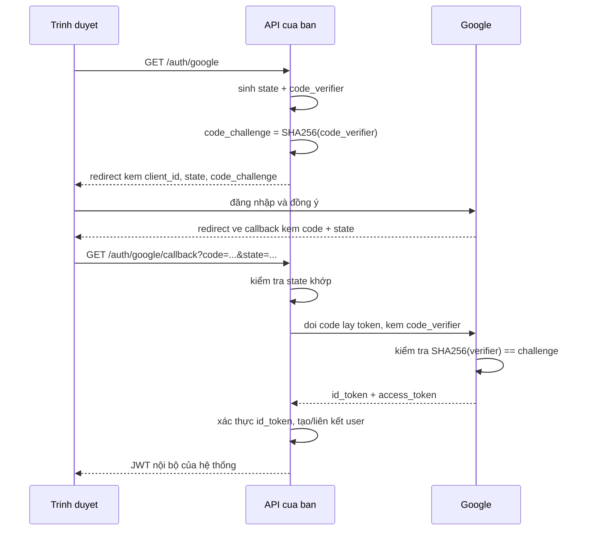

import { SummaryBox, Checklist, FAQSection } from '@site/src/components/SEO';

# 10.10 — 9. External Login và OAuth2 (Overview)

<SummaryBox>
Hai chuẩn hay bị gọi lẫn nhau: **OAuth 2.0 là uỷ quyền** (*"cho ứng dụng này đọc Google Drive của tôi"*), **OpenID Connect là xác thực** (*"đây là ai"*) — và OIDC xây **trên** OAuth2 bằng cách thêm `id_token`. Đăng nhập bằng Google thực ra là OIDC, không phải OAuth2 thuần. Về luồng: chỉ có **một** luồng nên dùng ngày nay — **Authorization Code + PKCE**; Implicit flow đã bị RFC 9700 **khuyến cáo bỏ**. Và rủi ro lớn nhất khi tích hợp: **liên kết tài khoản theo email mà không kiểm tra `email_verified`** — kẻ tấn công đăng ký một tài khoản ở nhà cung cấp nào đó với email của bạn và chiếm luôn tài khoản trong hệ thống.
</SummaryBox>

## Mục tiêu bài học

Sau bài này bạn có thể:

- Phân biệt OAuth 2.0 và OpenID Connect.
- Mô tả luồng Authorization Code + PKCE và vai trò của từng tham số.
- Liên kết tài khoản ngoài với tài khoản nội bộ an toàn.
- Nhận ra rủi ro chiếm tài khoản qua email chưa xác minh.
- Biết `state` và `nonce` chống lại điều gì.

## Nội dung bài học

### 10.10.1 — OAuth2 hay OpenID Connect

| | OAuth 2.0 | OpenID Connect |
|---|---|---|
| Trả lời | "Ứng dụng này được làm gì?" | "Người này là ai?" |
| Trả về | `access_token` | `access_token` + **`id_token`** |
| `id_token` là | — | **JWT** chứa danh tính, đã ký |
| Dùng cho | Gọi API của bên thứ ba | **Đăng nhập** |

Dùng `access_token` của OAuth2 để xác thực là sai: nó là **chìa khoá cho một API**, không phải bằng chứng danh tính, và với phần lớn nhà cung cấp nó là chuỗi mờ mà bạn không tự xác thực được.

`id_token` thì khác — nó là JWT có chữ ký, xác thực được bằng khoá công từ endpoint JWKS của nhà cung cấp, đúng như [bài 10.3](10.2-jwt-authentication.mdx).

Khi bạn thấy "Sign in with Google/Microsoft/GitHub", đó gần như luôn là OIDC.

### 10.10.2 — Authorization Code + PKCE



Ba tham số bảo mật, mỗi cái chống một thứ khác nhau:

| Tham số | Chống |
|---|---|
| **`state`** | **CSRF** — kẻ tấn công ép bạn hoàn tất luồng đăng nhập bằng tài khoản của họ |
| **`nonce`** | **Replay** — `id_token` cũ bị dùng lại |
| **`code_verifier` / PKCE** | **Đánh cắp mã** — mã bị chặn trên đường redirect cũng vô dụng |

`state` phải là chuỗi ngẫu nhiên, được lưu ở phía bạn, và **đối chiếu** khi callback về. Bỏ qua bước đối chiếu là một lỗ hổng CSRF thật sự — và nó dễ bị bỏ qua vì luồng vẫn chạy bình thường khi không có ai tấn công.

**PKCE** sinh ra cho ứng dụng di động (không giữ được secret), nhưng RFC 9700 khuyến nghị dùng cho **mọi** loại client, kể cả web server có secret.

**Implicit flow** — trả token thẳng trong URL fragment — đã bị khuyến cáo **không dùng**: token lọt vào lịch sử trình duyệt, vào log của proxy, vào header `Referer`.

### 10.10.3 — Cấu hình

```bash
dotnet add package Microsoft.AspNetCore.Authentication.Google
```

```csharp
builder.Services.AddAuthentication()
    .AddGoogle(options =>
    {
        options.ClientId     = builder.Configuration["Google:ClientId"]!;
        options.ClientSecret = builder.Configuration["Google:ClientSecret"]!;
        options.CallbackPath = "/api/auth/google/callback";

        options.UsePkce = true;                       // mặc định true từ .NET 6
        options.SaveTokens = false;                   // không lưu token của Google
        options.Scope.Add("email");
        options.Scope.Add("profile");

        options.ClaimActions.MapJsonKey("email_verified", "email_verified");
    });
```

`ClientSecret` là **secret** — biến môi trường hoặc Key Vault, không phải `appsettings.json` ([bài 8.7](../module-08-aspnet-core-fundamentals/8.6-configuration-system.mdx)).

`SaveTokens = false` trừ khi bạn thật sự cần gọi API của Google sau đó. Lưu token của bên thứ ba là thêm một thứ phải bảo vệ.

Dòng `ClaimActions` là quan trọng nhất trong đoạn cấu hình — nó đưa `email_verified` vào claim để mục sau dùng.

### 10.10.4 — Rủi ro chiếm tài khoản

```csharp
// SAI — liên kết theo email mà không kiểm tra gì
var user = await _userManager.FindByEmailAsync(email);
if (user is not null)
    await _userManager.AddLoginAsync(user, info);   // CHIEM TAI KHOAN
```

Kịch bản tấn công:

1. Nạn nhân có tài khoản `victim@company.com` trong hệ thống của bạn, đăng nhập bằng mật khẩu.
2. Kẻ tấn công tìm một nhà cung cấp OIDC **không xác minh email** và đăng ký ở đó với `victim@company.com`.
3. Kẻ tấn công bấm "Đăng nhập bằng nhà cung cấp X" trên hệ thống của bạn.
4. Hệ thống thấy email khớp, liên kết tài khoản, và **cấp quyền vào tài khoản của nạn nhân**.

Hai tầng bảo vệ:

```csharp
// 1. Chi tin email DA XAC MINH
var emailVerified = info.Principal.FindFirstValue("email_verified");
if (!string.Equals(emailVerified, "true", StringComparison.OrdinalIgnoreCase))
    return Result.Fail("Nhà cung cấp chưa xác minh email này");

// 2. Chỉ tự động liên kết với nhà cung cấp ĐÁNG TIN CẬY
if (!_options.TrustedProviders.Contains(info.LoginProvider))
{
    // Gửi email xác nhận cho chủ tài khoản, không liên kết ngay
    await _linkRequests.SendConfirmationAsync(existingUser, info, ct);
    return Result.Fail("Chúng tôi đã gửi email xác nhận để liên kết tài khoản");
}
```

Danh sách nhà cung cấp đáng tin nên **rất ngắn** — Google và Microsoft xác minh email; nhiều nhà cung cấp khác thì không, hoặc không nói rõ.

Luồng đầy đủ:

```csharp
public async Task<Result<TokenPair>> HandleExternalLoginAsync(
    ExternalLoginInfo info, CancellationToken ct)
{
    // 1. Da lien ket -> dang nhap
    var user = await _userManager.FindByLoginAsync(info.LoginProvider, info.ProviderKey);
    if (user is not null)
        return Result.Success(await _tokens.IssuePairAsync(user, ct));

    var email = info.Principal.FindFirstValue(ClaimTypes.Email);
    if (email is null)
        return Result.Fail("Nhà cung cấp không trả về email");

    if (!IsEmailVerified(info))
        return Result.Fail("Nhà cung cấp chưa xác minh email này");

    // 2. Email đã tồn tại -> cần xác nhận trước khi liên kết
    var existing = await _userManager.FindByEmailAsync(email);
    if (existing is not null)
    {
        if (!_options.TrustedProviders.Contains(info.LoginProvider))
        {
            await _linkRequests.SendConfirmationAsync(existing, info, ct);
            return Result.Fail("Chúng tôi đã gửi email xác nhận để liên kết tài khoản");
        }

        await _userManager.AddLoginAsync(existing, info);
        return Result.Success(await _tokens.IssuePairAsync(existing, ct));
    }

    // 3. Người dùng mới
    var newUser = new AppUser
    {
        UserName = email, Email = email, EmailConfirmed = true,
        FullName = info.Principal.FindFirstValue(ClaimTypes.Name),
    };

    var created = await _userManager.CreateAsync(newUser);
    if (!created.Succeeded)
        return Result.Fail(string.Join("; ", created.Errors.Select(e => e.Description)));

    await _userManager.AddLoginAsync(newUser, info);
    await _userManager.AddToRoleAsync(newUser, CrmRoles.ReadOnly);   // quyền thấp nhất

    return Result.Success(await _tokens.IssuePairAsync(newUser, ct));
}
```

Chú ý dòng cuối: người dùng mới nhận **quyền thấp nhất**. Tự động cấp quyền theo tên miền email (`@company.com` thành `Manager`) là cách nhiều hệ thống bị xâm nhập — tên miền email không phải bằng chứng về vai trò trong tổ chức.

### 10.10.5 — Xử lý ở phía client

Với SPA hoặc mobile, đừng trả JWT nội bộ trong **URL**:

```csharp
// SAI — token vào lịch sử trình duyệt, vào log proxy, vào Referer
return Redirect($"{clientUrl}/auth/callback?token={jwt}");
```

```csharp
// DUNG — refresh token trong cookie HttpOnly, client tu doi lay access token
Response.Cookies.Append("refresh_token", refreshToken, new CookieOptions
{
    HttpOnly = true, Secure = true, SameSite = SameSiteMode.Lax,
    Path = "/api/auth", Expires = DateTimeOffset.UtcNow.AddDays(7),
});

return Redirect($"{clientUrl}/auth/callback");
```

`SameSite = Lax` ở đây có chủ đích: `Strict` sẽ **không** gửi cookie trong lần điều hướng từ Google về — và luồng đăng nhập hỏng theo cách rất khó chẩn đoán.

Client sau đó gọi `/api/auth/refresh` để lấy access token, đúng mẫu ở [bài 10.4](10.3-refresh-token.mdx).

### 10.10.6 — Rà lại code của bạn

<Checklist
  title="Danh sách rà soát đăng nhập ngoài"
  items={[
    { text: "Dùng Authorization Code + PKCE, không dùng Implicit flow." },
    { text: "state được sinh ngẫu nhiên và ĐỐI CHIẾU khi callback." },
    { text: "id_token được xác thực chữ ký bằng khoá công từ JWKS." },
    { text: "Chỉ liên kết tài khoản khi email_verified là true." },
    { text: "Email trùng với tài khoản có sẵn cần xác nhận trước khi liên kết." },
    { text: "Danh sách nhà cung cấp đáng tin rất ngắn và được review." },
    { text: "Người dùng mới nhận quyền thấp nhất, không cấp theo tên miền email." },
    { text: "ClientSecret nằm trong biến môi trường hoặc Key Vault." },
    { text: "SaveTokens tắt trừ khi thật sự cần gọi API của nhà cung cấp." },
    { text: "Không trả JWT nội bộ qua URL; dùng cookie HttpOnly." },
    { text: "Cookie dùng SameSite Lax để sống sót qua redirect từ nhà cung cấp." },
  ]}
/>

## Bài tập áp dụng

#### Bài 1 — Đọc `id_token` và quyết định dùng claim nào

Hoàn tất một luồng đăng nhập Google, lấy `id_token` và giải mã payload. Liệt kê các claim và xác định cái nào bạn thật sự dùng.

**Tiêu chí hoàn thành:** bạn chỉ ra được claim nào **định danh người dùng một cách bền vững**, và vì sao `email` không phải claim đó.

<details>
<summary><strong>Gợi ý và lời giải — Bài 1</strong></summary>

**Gợi ý.** Hỏi: người dùng có đổi được giá trị này không? Và nếu họ đổi, tài khoản của họ trong hệ thống bạn có còn nhận ra họ không?

**Lời giải — lấy và giải mã:**

```csharp
options.SaveTokens = true;      // tạm bật để xem, xem lưu ý ở cuối

// Trong callback
var idToken = await HttpContext.GetTokenAsync("Google", "id_token");
```

```bash
python3 -c "
import base64,json,sys
p = sys.argv[1].split('.')[1]; p += '=' * (-len(p) % 4)
print(json.dumps(json.loads(base64.urlsafe_b64decode(p)), indent=2, ensure_ascii=False))
" "$ID_TOKEN"
```

```json
{
  "iss": "https://accounts.google.com",
  "azp": "1234.apps.googleusercontent.com",
  "aud": "1234.apps.googleusercontent.com",
  "sub": "110248495921238986420",
  "email": "an@company.com",
  "email_verified": true,
  "name": "Nguyễn Văn An",
  "picture": "https://lh3.googleusercontent.com/a/...",
  "given_name": "An",
  "family_name": "Nguyễn Văn",
  "iat": 1790000000,
  "exp": 1790003600
}
```

**Claim định danh bền vững là `sub`.** Nó do Google cấp, duy nhất trong phạm vi issuer, và **không bao giờ đổi** — kể cả khi người dùng đổi email, đổi tên, hay đổi ảnh đại diện.

**Vì sao `email` không dùng làm định danh — ba lý do:**

1. **Người dùng đổi được.** Google Workspace cho phép đổi địa chỉ chính. Sau khi đổi, nếu bạn tra theo email thì người đó thành một người mới và mất sạch dữ liệu.
2. **Email có thể được cấp lại.** Nhân viên nghỉ việc, công ty gán `an@company.com` cho người mới. Tra theo email là người mới vào thẳng tài khoản của người cũ.
3. **`email_verified` có thể là `false`.** Với một số nhà cung cấp, người dùng tự khai email mà không chứng minh sở hữu — xem bài 2.

**Cách lưu đúng:**

```csharp
public sealed class ExternalLogin
{
    public string Provider { get; init; } = null!;      // "Google"
    public string ProviderKey { get; init; } = null!;   // sub — KHOÁ THẬT
    public Guid UserId { get; init; }
}
```

```sql
CREATE UNIQUE INDEX UX_ExternalLogins ON ExternalLogins(Provider, ProviderKey);
```

`email` chỉ dùng để **hiển thị** và để **gợi ý liên kết** với tài khoản sẵn có — và việc liên kết đó cần xác nhận, xem bài 2.

**Bảng phân loại claim:**

| Claim | Dùng làm gì | Lưu lại? |
|---|---|---|
| `sub` | **Định danh** | Có — cùng `Provider` |
| `email` | Hiển thị, gợi ý liên kết | Có, nhưng cập nhật lại mỗi lần đăng nhập |
| `email_verified` | Quyết định có tự động liên kết không | Không — kiểm tại chỗ |
| `name`, `picture` | Hiển thị | Tuỳ, cập nhật mỗi lần đăng nhập |
| `given_name`, `family_name` | Hầu như không dùng | Không |
| `iss`, `aud`, `exp` | Thư viện tự xác thực | Không |

**Lưu ý về `SaveTokens`.** Bật nó lưu cả `access_token` của Google vào cookie xác thực, làm cookie phình lên và giữ một thứ bạn thường không cần. Chỉ bật khi thật sự gọi API của Google thay mặt người dùng:

```csharp
options.SaveTokens = false;        // mặc định nên là false
```

Sau khi xem xong bài tập này, tắt nó đi.

</details>

---

#### Bài 2 — Chiếm tài khoản qua liên kết tự động theo email

Tạo tài khoản `test@example.com` bằng mật khẩu. Giả lập một `ExternalLoginInfo` có cùng email nhưng `email_verified = false`, và xác nhận code **không** liên kết.

**Tiêu chí hoàn thành:** bạn mô tả được **toàn bộ chuỗi tấn công** từ góc nhìn kẻ xấu, không chỉ nói "thiếu kiểm tra".

<details>
<summary><strong>Gợi ý và lời giải — Bài 2</strong></summary>

**Gợi ý.** Có những nhà cung cấp OAuth cho phép đặt email tuỳ ý trong hồ sơ mà không bắt chứng minh sở hữu.

**Lời giải — code dễ tổn thương:**

```csharp
var info = await _signInManager.GetExternalLoginInfoAsync();
var email = info!.Principal.FindFirstValue(ClaimTypes.Email);

var user = await _userManager.FindByEmailAsync(email!);
if (user is not null)
{
    await _userManager.AddLoginAsync(user, info);      // LIÊN KẾT NGAY
    await _signInManager.SignInAsync(user, isPersistent: false);
    return Redirect("/");
}
```

**Chuỗi tấn công đầy đủ:**

```text
1. Kẻ tấn công biết nạn nhân dùng ceo@company.com trên hệ thống của bạn
   (email công ty thường đoán được: ho.ten@congty.com)

2. Hắn tạo tài khoản ở một nhà cung cấp OAuth cho phép tự khai email,
   và đặt email hồ sơ thành ceo@company.com — không cần chứng minh gì

3. Hắn bấm "Đăng nhập bằng <nhà cung cấp>" trên hệ thống của bạn

4. Code của bạn đọc claim email, thấy ceo@company.com, tìm thấy tài
   khoản của CEO, và GẮN danh tính của kẻ tấn công vào tài khoản đó

5. Hắn đăng nhập vào tài khoản CEO — không cần mật khẩu, không cần
   chạm vào email thật của CEO, không để lại dấu vết nào bất thường
```

**Điểm đáng chú ý:** không có bước nào là "tấn công" theo nghĩa kỹ thuật. Không dò mật khẩu, không khai thác lỗ hổng bộ nhớ, không SQL injection. Hắn chỉ dùng đúng luồng đăng nhập mà bạn cung cấp.

**Bản đã sửa — ba tầng kiểm tra:**

```csharp
var info = await _signInManager.GetExternalLoginInfoAsync();
if (info is null) return Redirect("/login?error=external");

// Tầng 1: đã liên kết trước đó -> đăng nhập thẳng
var linked = await _signInManager.ExternalLoginSignInAsync(
    info.LoginProvider, info.ProviderKey, isPersistent: false);
if (linked.Succeeded) return Redirect("/");

var email = info.Principal.FindFirstValue(ClaimTypes.Email);
var verified = info.Principal.FindFirstValue("email_verified") == "true";

// Tầng 2: email đã tồn tại -> KHÔNG tự liên kết
var existing = email is null ? null : await _userManager.FindByEmailAsync(email);
if (existing is not null)
{
    if (!verified || !TrustedProviders.Contains(info.LoginProvider))
    {
        await _mail.SendLinkConfirmationAsync(existing, info, ct);
        return Redirect("/login?info=check-your-email");
    }

    await _userManager.AddLoginAsync(existing, info);
    await _signInManager.SignInAsync(existing, isPersistent: false);
    return Redirect("/");
}

// Tầng 3: người dùng mới -> tạo với quyền thấp nhất
if (!verified) return Redirect("/login?error=email-not-verified");

var newUser = new AppUser { UserName = email, Email = email, EmailConfirmed = true };
await _userManager.CreateAsync(newUser);
await _userManager.AddLoginAsync(newUser, info);
await _userManager.AddToRoleAsync(newUser, CrmRoles.ReadOnly);
```

**Ba nguyên tắc rút ra:**

1. **`email_verified = false` thì không liên kết gì cả** — email đó chưa được chứng minh là của ai.
2. **Chỉ tự động liên kết với nhà cung cấp bạn tin cậy.** Google và Microsoft có quy trình xác minh email nghiêm túc; một nhà cung cấp OAuth bất kỳ thì không.
3. **Khi email đã tồn tại, hãy hỏi chủ tài khoản.** Gửi email xác nhận tới **địa chỉ đã có trong hệ thống** — chỉ người thật sự kiểm soát hộp thư đó mới bấm được.

**Và tài khoản mới luôn bắt đầu ở quyền thấp nhất.** Nếu bước xác minh nào đó vẫn bị vượt qua, kẻ tấn công cũng chỉ có tài khoản chỉ-đọc thay vì quyền của tài khoản cũ.

</details>

---

#### Bài 3 — `SameSite=Strict` làm gãy luồng đăng nhập ngoài

Đặt cookie refresh token với `SameSite = Strict`, chạy luồng đăng nhập Google, và xác nhận cookie **không** được gửi khi quay về. Đổi sang `Lax` và kiểm chứng lại.

**Tiêu chí hoàn thành:** bạn nêu được `Strict` và `Lax` khác nhau ở tình huống nào, và vì sao `Lax` vẫn chặn được CSRF.

<details>
<summary><strong>Gợi ý và lời giải — Bài 3</strong></summary>

**Gợi ý.** Người dùng quay về từ `accounts.google.com` bằng một **chuyển hướng**, không phải bằng cách gõ địa chỉ. Với trình duyệt, đó là điều hướng **xuyên site**.

**Lời giải — với `Strict`:**

```csharp
Response.Cookies.Append("refresh_token", token, new CookieOptions
{
    HttpOnly = true,
    Secure   = true,
    SameSite = SameSiteMode.Strict,
    Path     = "/api/auth"
});
```

```text
1. Người dùng bấm "Đăng nhập bằng Google"
2. Chuyển sang accounts.google.com
3. Đăng nhập, Google chuyển về https://crm.company.com/signin-google?code=...
4. Trình duyệt KHÔNG gửi cookie — vì request đến từ một site khác
5. Server không thấy cookie tương quan -> "Correlation failed"
```

```text
Exception: .AspNetCore.Correlation.Google.xxx cookie not found.
```

**Cùng lỗi này xảy ra với mọi thứ đi qua chuyển hướng xuyên site:** thanh toán trả về từ cổng, xác nhận email bằng link, đăng nhập một lần của doanh nghiệp.

**Với `Lax`:**

```csharp
SameSite = SameSiteMode.Lax
```

```text
200 — đăng nhập thành công
```

**Khác biệt chính xác giữa hai giá trị:**

| Tình huống | `Strict` | `Lax` | `None` |
|---|---|---|---|
| Gõ địa chỉ trực tiếp | Gửi | Gửi | Gửi |
| **Điều hướng cấp cao nhất** bằng `GET` từ site khác | **Không** | **Gửi** | Gửi |
| `POST` từ form ở site khác | Không | **Không** | Gửi |
| `fetch`/XHR từ site khác | Không | **Không** | Gửi |
| Ảnh, iframe nhúng ở site khác | Không | Không | Gửi |

Dòng thứ hai là dòng cứu luồng OAuth: người dùng **tự bấm** và đi tới trang của bạn ở cấp cao nhất — đó là điều hướng hợp pháp.

**Vì sao `Lax` vẫn chặn được CSRF.** Tấn công CSRF cổ điển dựa vào việc trang độc hại tự gửi một request thay đổi dữ liệu mà người dùng không biết:

```html
<!-- Trang của kẻ tấn công -->
<form action="https://crm.company.com/api/customers/42" method="POST">
  <input name="delete" value="true">
</form>
<script>document.forms[0].submit()</script>
```

Đây là `POST` xuyên site — **dòng thứ ba trong bảng** — nên `Lax` **không** gửi cookie, và request thất bại. Điều `Lax` cho phép chỉ là `GET` ở cấp cao nhất, mà `GET` theo đúng thiết kế thì không được thay đổi dữ liệu.

**Điều này nói thêm một chuyện:** nếu API của bạn có endpoint `GET` gây thay đổi dữ liệu (`GET /customers/42/delete`), thì `Lax` **không** bảo vệ nó. Đó là một lý do nữa để tôn trọng ngữ nghĩa của HTTP method, như [bài 9.2](../module-09-web-api-professional/9.1-rest-api-design-principles.mdx) trình bày.

**Cấu hình thực dụng:**

```csharp
// Cookie phiên và refresh token — Lax là đủ và tương thích OAuth
SameSite = SameSiteMode.Lax

// Cookie cho thao tác đặc biệt nhạy cảm và không đi qua redirect nào
SameSite = SameSiteMode.Strict

// Chỉ khi frontend nằm ở tên miền khác backend — và BẮT BUỘC kèm Secure
SameSite = SameSiteMode.None, Secure = true
```

**Cẩn thận với `None`:** nó tắt hẳn lớp bảo vệ SameSite, nên phải bù lại bằng token chống CSRF hoặc kiểm tra header `Origin` ở phía server.

</details>

## Tự kiểm tra

<FAQSection
  items={[
    {
      question: "OAuth 2.0 và OpenID Connect khác nhau thế nào?",
      answer: "OAuth 2.0 là uỷ quyền, trả lời ứng dụng này được làm gì, và trả về access_token. OpenID Connect là xác thực, trả lời người này là ai, và xây trên OAuth2 bằng cách thêm id_token là một JWT có chữ ký chứa danh tính. Đăng nhập bằng Google thực ra là OIDC."
    },
    {
      question: "Vì sao không dùng access_token để xác thực?",
      answer: "Vì nó là chìa khoá cho một API chứ không phải bằng chứng danh tính, và với phần lớn nhà cung cấp nó là chuỗi mờ mà bạn không tự xác thực được. id_token thì là JWT có chữ ký, xác thực được bằng khoá công từ endpoint JWKS."
    },
    {
      question: "state, nonce và PKCE chống lại những gì?",
      answer: "state chống CSRF, tức kẻ tấn công ép bạn hoàn tất luồng đăng nhập bằng tài khoản của họ. nonce chống replay id_token cũ. PKCE chống đánh cắp mã, làm cho mã bị chặn trên đường redirect cũng vô dụng vì thiếu code_verifier."
    },
    {
      question: "Vì sao Implicit flow không nên dùng nữa?",
      answer: "Vì nó trả token thẳng trong URL fragment, nên token lọt vào lịch sử trình duyệt, vào log của proxy và vào header Referer. RFC 9700 khuyến cáo không dùng; thay bằng Authorization Code cộng PKCE cho mọi loại client."
    },
    {
      question: "Rủi ro khi liên kết tài khoản theo email là gì?",
      answer: "Kẻ tấn công tìm một nhà cung cấp OIDC không xác minh email, đăng ký ở đó bằng email của nạn nhân, rồi đăng nhập vào hệ thống của bạn. Hệ thống thấy email khớp, liên kết tài khoản và cấp quyền vào tài khoản nạn nhân. Phải kiểm tra email_verified và chỉ tự động liên kết với danh sách nhà cung cấp đáng tin rất ngắn."
    },
    {
      question: "Vì sao cookie phải là SameSite Lax chứ không phải Strict trong luồng này?",
      answer: "Vì Strict sẽ không gửi cookie trong lần điều hướng từ nhà cung cấp quay về ứng dụng của bạn, nên luồng đăng nhập hỏng theo cách rất khó chẩn đoán. Lax vẫn gửi cookie với điều hướng cấp cao nhất bằng GET, đúng trường hợp này."
    }
  ]}
/>

## Kết luận

Ba điều đáng nhớ nhất:

1. **Đăng nhập là OIDC, không phải OAuth2 thuần.** Xác thực `id_token`, đừng dùng `access_token`.
2. **Authorization Code + PKCE là luồng duy nhất nên dùng**, và `state` phải được đối chiếu.
3. **Không liên kết tài khoản theo email chưa xác minh** — đó là đường chiếm tài khoản.

## Tham khảo

- [RFC 6749 — The OAuth 2.0 Authorization Framework](https://www.rfc-editor.org/rfc/rfc6749.html)
- [RFC 9700 — Best Current Practice for OAuth 2.0 Security](https://www.rfc-editor.org/rfc/rfc9700.html)
- [External provider authentication in ASP.NET Core](https://learn.microsoft.com/en-us/aspnet/core/security/authentication/social/)
- [OpenID Connect Core 1.0](https://openid.net/specs/openid-connect-core-1_0.html)

## Điều hướng

- **Bài trước:** [10.8 — 8. ASP.NET Core Identity (Overview)](10.8-overview.mdx)
- **Bài tiếp theo:** [10.10 — 10. Security Best Practices](10.10-security-best-practices.mdx)
- **Về module:** [Trang mục lục](./)
