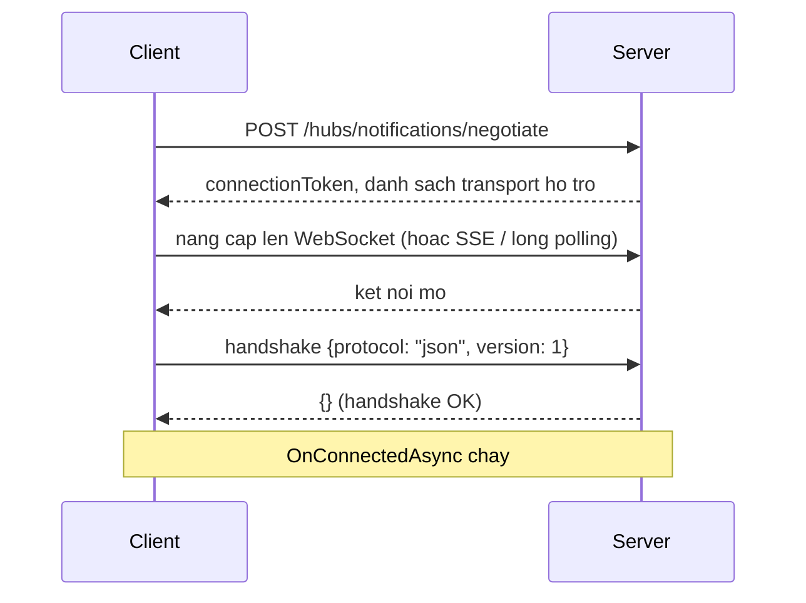

import { SummaryBox, Checklist, FAQSection } from '@site/src/components/SEO';

# 11.3 — 2. SignalR Architecture

<SummaryBox>
Ba hiểu lầm về kiến trúc SignalR gây ra phần lớn lỗi trong thực tế. **Một: `Hub` là transient** — một instance mới được tạo cho **mỗi lời gọi**, không phải mỗi kết nối, nên field instance trong Hub **không giữ được gì**. **Hai: `ConnectionId` không ổn định** — nó đổi mỗi lần kết nối lại, và kết nối lại xảy ra thường xuyên trên mạng di động, nên đừng lưu nó vào database như định danh người dùng; hãy dùng `UserIdentifier`. **Ba: một người dùng có nhiều kết nối** — hai tab, điện thoại, laptop. Gửi tới một `ConnectionId` là gửi tới **một tab**, không phải tới một người.
</SummaryBox>

## Mục tiêu bài học

Sau bài này bạn có thể:

- Mô tả bước `negotiate` và vì sao nó tồn tại.
- Giải thích vòng đời của `Hub` và hệ quả với trạng thái.
- Phân biệt `ConnectionId`, `UserIdentifier` và nhóm.
- Xử lý đúng việc một người dùng có nhiều kết nối.
- Đọc hiểu vòng đời một kết nối từ bắt tay tới ngắt.

## Nội dung bài học

### 11.3.1 — Bắt tay



Bước `negotiate` tồn tại vì client **không biết trước** transport nào dùng được. Mạng công ty chặn WebSocket, proxy cũ không hỗ trợ nâng cấp giao thức — `negotiate` cho server nói rõ nó hỗ trợ gì.

Hai hệ quả thực tế:

**`negotiate` là một request HTTP riêng**, nên nó đi qua toàn bộ pipeline: CORS, xác thực, rate limit. Nhiều lỗi "SignalR không kết nối được" thực ra là **`negotiate` bị chặn** bởi CORS hoặc bởi rate limit — và thông báo lỗi ở client thì mơ hồ.

**Bỏ qua `negotiate`** được nếu bạn chắc chắn WebSocket dùng được:

```javascript
new signalR.HubConnectionBuilder()
    .withUrl("/hubs/notifications", {
        skipNegotiation: true,
        transport: signalR.HttpTransportType.WebSockets
    })
    .build();
```

Nó bớt một vòng đi về và **bỏ luôn nhu cầu sticky session** — nhưng không còn dự phòng khi WebSocket bị chặn.

### 11.3.2 — `Hub` là transient

```csharp
public class NotificationHub : Hub<INotificationClient>
{
    private int _messageCount;         // VO DUNG — luon la 0

    public async Task SendMessage(string text)
    {
        _messageCount++;               // instance moi moi lan goi
        ...
    }
}
```

SignalR tạo **một instance Hub mới cho mỗi lời gọi từ client** — không phải mỗi kết nối. Nên:

- **Field instance không giữ được gì** giữa hai lời gọi.
- Trạng thái phải nằm ở service singleton, cache phân tán, hoặc database.
- Hub **không** được lưu tham chiếu tới `Clients` hay `Context` để dùng sau — chúng chỉ hợp lệ trong lời gọi hiện tại.

```csharp
// SAI — Context đã không còn hợp lệ khi callback chạy
public override Task OnConnectedAsync()
{
    _timer = new Timer(_ => Clients.Caller.Ping(), null, 0, 5000);
    return base.OnConnectedAsync();
}
```

Muốn gửi từ ngoài ngữ cảnh một lời gọi thì dùng `IHubContext<T>` ([bài 11.8](11.7-ihubcontext-server-push-outside-hub.mdx)).

Về DI: Hub được resolve từ **scope của kết nối**, nên tiêm `DbContext` vào constructor Hub **chạy được** — nhưng scope đó sống suốt thời gian kết nối, có thể hàng giờ. Đó là một captive dependency trá hình ([bài 7.5](../../stage-02-csharp-professional/module-07-dependency-injection/7.4-service-lifetimes.mdx)): `DbContext` tích luỹ entity và trả dữ liệu cũ.

```csharp
// ĐÚNG — tạo scope riêng cho mỗi lần gọi
public class NotificationHub(IServiceScopeFactory scopeFactory) : Hub<INotificationClient>
{
    public async Task MarkAsRead(Guid id)
    {
        await using var scope = scopeFactory.CreateAsyncScope();
        var db = scope.ServiceProvider.GetRequiredService<AppDbContext>();
        ...
    }
}
```

### 11.3.3 — Ba cách định danh

| | Là gì | Ổn định | Dùng để |
|---|---|---|---|
| **`ConnectionId`** | Một kết nối (một tab) | **Không** — đổi khi kết nối lại | Trả lời đúng tab vừa gọi |
| **`UserIdentifier`** | Một người dùng | **Có** | Gửi tới **mọi** thiết bị của một người |
| **Group** | Một tập kết nối có tên | Có (tên nhóm) | Broadcast theo chủ đề |

```csharp
await Clients.Caller.Receive(dto);                    // dung tab vua goi
await Clients.User(userId).Receive(dto);              // MỌI thiết bị của người đó
await Clients.Group("tenant-123").Receive(dto);       // ca nhom
await Clients.All.Receive(dto);                       // tat ca — hiem khi dung
```

**`ConnectionId` đổi mỗi lần kết nối lại**, và kết nối lại xảy ra liên tục: mạng di động chuyển sóng, laptop mở nắp, Wi-Fi chập chờn. Lưu nó vào database như định danh người dùng là một lỗi phổ biến — sau 30 giây nó đã sai.

`UserIdentifier` mặc định lấy từ claim `NameIdentifier`. Đổi được:

```csharp
public sealed class UserIdProvider : IUserIdProvider
{
    public string? GetUserId(HubConnectionContext connection)
        => connection.User?.FindFirstValue("sub");
}

builder.Services.AddSingleton<IUserIdProvider, UserIdProvider>();
```

`Clients.User(id)` tự động gửi tới **mọi** kết nối của người đó — SignalR duy trì ánh xạ đó giúp bạn. Đây là lý do gần như luôn nên dùng `Clients.User` thay vì tự quản lý danh sách `ConnectionId`.

### 11.3.4 — Vòng đời kết nối

```csharp
public class NotificationHub(IPresenceTracker presence) : Hub<INotificationClient>
{
    public override async Task OnConnectedAsync()
    {
        var userId = Context.UserIdentifier;
        if (userId is null)
        {
            Context.Abort();                 // không xác thực được
            return;
        }

        await Groups.AddToGroupAsync(Context.ConnectionId, $"user-{userId}");
        await presence.ConnectAsync(userId, Context.ConnectionId);

        await base.OnConnectedAsync();
    }

    public override async Task OnDisconnectedAsync(Exception? exception)
    {
        var userId = Context.UserIdentifier;
        if (userId is not null)
            await presence.DisconnectAsync(userId, Context.ConnectionId);

        if (exception is not null)
            _logger.LogWarning(exception, "Ket noi {Id} ngat bat thuong", Context.ConnectionId);

        await base.OnDisconnectedAsync(exception);
    }
}
```

Bốn điều về `OnDisconnectedAsync`:

1. **`exception` khác `null`** nghĩa là ngắt bất thường (mất mạng); `null` nghĩa là client chủ động đóng.
2. Nó có thể **không chạy** nếu tiến trình server bị kill — trạng thái presence phải tự hết hạn, đừng chỉ dựa vào sự kiện này ([bài 11.10](11.9-presence-online-offline-status.mdx)).
3. Nó có thể chạy **muộn** — mất tới `ClientTimeoutInterval` (mặc định 30 giây) để phát hiện kết nối chết.
4. Nhóm được dọn tự động, không cần `RemoveFromGroupAsync`.

Và nhớ: người dùng mở 3 tab thì `OnDisconnectedAsync` chạy **3 lần**, mỗi lần một `ConnectionId`. "Người này đã offline" chỉ đúng khi **kết nối cuối cùng** đóng.

### 11.3.5 — Giữ nhịp và timeout

```csharp
builder.Services.AddSignalR(options =>
{
    options.KeepAliveInterval     = TimeSpan.FromSeconds(15);   // server ping client
    options.ClientTimeoutInterval = TimeSpan.FromSeconds(30);   // > 2x KeepAlive
    options.HandshakeTimeout      = TimeSpan.FromSeconds(15);
    options.MaximumReceiveMessageSize = 32 * 1024;
    options.EnableDetailedErrors  = builder.Environment.IsDevelopment();
});
```

Vì sao cần giữ nhịp: **TCP không báo ngay khi kết nối chết**. Rút cáp mạng và socket vẫn "mở" trong nhiều phút. Ping định kỳ là cách duy nhất phát hiện sớm.

Quy tắc: **`ClientTimeoutInterval` ít nhất gấp đôi `KeepAliveInterval`**, để một ping bị mất không làm đứt kết nối. Đặt sai tỷ lệ này gây ra hiện tượng "cứ vài phút lại mất kết nối" rất khó chẩn đoán.

`EnableDetailedErrors` chỉ bật ở Development — ở production nó gửi **stack trace tới client** ([bài 8.9](../module-08-aspnet-core-fundamentals/8.8-global-exception-handling.mdx)).

`MaximumReceiveMessageSize` mặc định 32KB. SignalR không dành cho truyền file; dùng HTTP upload thường ([bài 9.6](../module-09-web-api-professional/9.5-file-upload-and-download.mdx)).

### 11.3.6 — Rà lại code của bạn

<Checklist
  title="Danh sách rà soát kiến trúc SignalR"
  items={[
    { text: "Không có field instance nào trong Hub dùng để giữ trạng thái." },
    { text: "Không lưu tham chiếu tới Clients hay Context để dùng ngoài lời gọi." },
    { text: "Hub tạo scope riêng cho mỗi lời gọi thay vì tiêm DbContext vào constructor." },
    { text: "Không lưu ConnectionId vào database như định danh người dùng." },
    { text: "Dùng Clients.User thay vì tự quản lý danh sách ConnectionId." },
    { text: "Hiểu rằng một người dùng có nhiều kết nối và OnDisconnected chạy nhiều lần." },
    { text: "Trạng thái presence có cơ chế tự hết hạn, không chỉ dựa vào OnDisconnectedAsync." },
    { text: "ClientTimeoutInterval ít nhất gấp đôi KeepAliveInterval." },
    { text: "EnableDetailedErrors chỉ bật ở Development." },
    { text: "Endpoint negotiate được xem xét trong cấu hình CORS và rate limit." },
  ]}
/>

## Bài tập áp dụng

#### Bài 1 — Hub là transient, và hệ quả của điều đó

Thêm một biến đếm là field instance trong Hub, tăng nó mỗi lời gọi, và in ra. Xác nhận nó luôn là 1.

**Tiêu chí hoàn thành:** bạn nêu được **hai** hệ quả thực tế của việc Hub là transient, không chỉ nói "không lưu state được".

<details>
<summary><strong>Gợi ý và lời giải — Bài 1</strong></summary>

**Gợi ý.** Nếu mỗi lời gọi tạo một Hub mới, thì `this` trong một callback bất đồng bộ trỏ vào cái gì sau khi lời gọi kết thúc?

**Lời giải:**

```csharp
public class NotificationHub : Hub<INotificationClient>
{
    private int _callCount;                    // field instance

    public Task Ping()
    {
        _callCount++;
        return Clients.Caller.Receive(new { count = _callCount });
    }
}
```

```js
for (let i = 0; i < 5; i++) await connection.invoke('Ping');
```

```text
{ count: 1 }
{ count: 1 }
{ count: 1 }
{ count: 1 }
{ count: 1 }
```

**Luôn là 1.** SignalR tạo một instance Hub mới cho **mỗi lời gọi** rồi huỷ ngay sau đó — giống hệt cách controller hoạt động.

**Hệ quả 1 — không giữ trạng thái trong Hub.**

```csharp
// SAI
private readonly List<string> _joinedRooms = new();

public async Task JoinRoom(string room)
{
    _joinedRooms.Add(room);                    // mất ngay sau lời gọi
    await Groups.AddToGroupAsync(Context.ConnectionId, room);
}
```

Trạng thái phải nằm ở nơi sống lâu hơn: nhóm của SignalR, Redis, hoặc database. `Context.Items` cũng dùng được — nó sống theo **kết nối**, không theo lời gọi.

**Hệ quả 2 — không dùng `Context` hay `Clients` sau khi lời gọi kết thúc.** Đây là hệ quả hay gây lỗi hơn và ít người biết:

```csharp
// SAI — Context đã không còn hợp lệ khi callback chạy
public Task StartLongJob()
{
    _ = Task.Run(async () =>
    {
        await Task.Delay(5000);
        await Clients.Caller.Receive(new { done = true });   // NÉM
    });
    return Task.CompletedTask;
}
```

```text
ObjectDisposedException: Cannot access a disposed object.
Object name: 'NotificationHub'.
```

Hub đã bị huỷ từ lâu trước khi `Task.Delay` xong.

**Cách đúng — chụp lại những gì cần rồi dùng `IHubContext`:**

```csharp
public Task StartLongJob()
{
    var connectionId = Context.ConnectionId;        // chụp GIÁ TRỊ, không giữ Context

    _ = Task.Run(async () =>
    {
        using var scope = _scopeFactory.CreateScope();
        var hub = scope.ServiceProvider
            .GetRequiredService<IHubContext<NotificationHub, INotificationClient>>();

        await Task.Delay(5000);
        await hub.Clients.Client(connectionId).Receive(new { done = true });
    });

    return Task.CompletedTask;
}
```

`IHubContext` là **singleton** và sống độc lập với vòng đời Hub — đó là thứ dùng để gửi tin từ ngoài Hub, như [bài 11.8](11.7-ihubcontext-server-push-outside-hub.mdx) trình bày.

**Nhưng `Task.Run` trong Hub vẫn là mẫu xấu.** Nó không sống sót qua restart và không có retry. Việc dài nên đi vào hàng đợi, và worker gửi thông báo qua `IHubContext` khi xong.

**Bảng vòng đời cần nhớ:**

| | Sống theo | Dùng để |
|---|---|---|
| Instance Hub | Một lời gọi | Xử lý ngay lời gọi đó |
| `Context.Items` | Một kết nối | Lưu dữ liệu nhỏ theo kết nối |
| Nhóm SignalR | Một kết nối | Gửi theo nhóm |
| `IHubContext` | Ứng dụng | Gửi từ bất kỳ đâu |

</details>

---

#### Bài 2 — `ConnectionId` đổi sau mỗi lần kết nối lại

Log `ConnectionId` trong `OnConnectedAsync`, bật tắt mạng vài lần, và ghi lại các giá trị khác nhau cho cùng một người dùng.

**Tiêu chí hoàn thành:** bạn nêu được vì sao **không** được lưu `ConnectionId` vào database làm khoá lâu dài.

<details>
<summary><strong>Gợi ý và lời giải — Bài 2</strong></summary>

**Gợi ý.** `ConnectionId` định danh một **kết nối**, không định danh một **người**.

**Lời giải:**

```csharp
public override Task OnConnectedAsync()
{
    _logger.LogInformation("Kết nối {ConnectionId} cho user {UserId}",
        Context.ConnectionId, Context.UserIdentifier);
    return base.OnConnectedAsync();
}
```

Bật tắt mạng ba lần:

```text
info: Kết nối vXk3Lm9QwRt2Yb8Nc4Fh1A cho user 8f3a1b2c
info: Kết nối Jz7Pq2Wn5Rx8Ty1Ub6Ve3D cho user 8f3a1b2c
info: Kết nối Hn4Km8Bz1Qp6Ws3Xr9Td5F cho user 8f3a1b2c
info: Kết nối Ct9Vb2Nm7Lk4Jh1Gf6Ds8A cho user 8f3a1b2c
```

**Bốn `ConnectionId` khác nhau, cùng một người.**

**Vì sao không được lưu làm khoá lâu dài.** Bảng ánh xạ kiểu này hỏng theo ba cách cùng lúc:

```sql
CREATE TABLE UserConnections (
    UserId       UNIQUEIDENTIFIER NOT NULL,
    ConnectionId NVARCHAR(100)    NOT NULL     -- SAI
);
```

1. **Rác tích luỹ.** Mất mạng đột ngột thì `OnDisconnectedAsync` **không chạy** — bản ghi nằm lại mãi. Sau một tuần, bảng đầy id của những kết nối chết.
2. **Gửi vào hư không.** Bạn gửi tới một `ConnectionId` đã chết: không lỗi, không cảnh báo, tin nhắn biến mất.
3. **Không sống sót qua restart.** Khởi động lại server là mọi `ConnectionId` mất hiệu lực, nhưng database vẫn giữ chúng.

**Cách đúng — dùng `Clients.User(userId)`:**

```csharp
await _hub.Clients.User(userId.ToString()).Receive(dto);
```

SignalR tự quản lý ánh xạ người dùng sang kết nối, tự dọn khi ngắt, và gửi tới **mọi thiết bị** của người đó. Với backplane Redis, nó hoạt động xuyên nhiều instance.

`Context.UserIdentifier` lấy từ claim `NameIdentifier` theo mặc định. Đổi được nếu cần:

```csharp
public sealed class UserIdProvider : IUserIdProvider
{
    public string? GetUserId(HubConnectionContext connection)
        => connection.User.FindFirstValue("sub");
}
```

**Khi nào `ConnectionId` vẫn hữu ích:** trả lời đúng **kết nối vừa gọi** — `Clients.Caller` dùng nó nội bộ — hoặc theo dõi trạng thái online trong Redis **có TTL**, để kết nối chết tự biến mất thay vì phải dọn tay. Xem [bài 11.10](11.9-presence-online-offline-status.mdx).

**Một hệ quả thực tế của việc `ConnectionId` đổi:** **nhóm cũng biến mất**. Nhóm gắn với `ConnectionId`, nên sau khi kết nối lại, client **không còn** trong nhóm nào. Phải join lại trong `onreconnected` — đây là lỗi phổ biến nhất khi dùng SignalR, và là bài 1 của [bài 11.5](11.4-client-side-integration.mdx).

</details>

---

#### Bài 3 — Tỷ lệ sai giữa `KeepAliveInterval` và `ClientTimeoutInterval`

Đặt `KeepAliveInterval = 30s` và `ClientTimeoutInterval = 30s`, chạy vài phút và ghi lại số lần mất kết nối. Sửa tỷ lệ và so sánh.

**Tiêu chí hoàn thành:** bạn nêu được tỷ lệ đúng và **vì sao** nó phải là tỷ lệ đó, chứ không chỉ chép con số.

<details>
<summary><strong>Gợi ý và lời giải — Bài 3</strong></summary>

**Gợi ý.** Nếu server gửi ping mỗi 30 giây và client bỏ cuộc sau 30 giây không nghe gì, thì chỉ cần một gói ping trễ là đủ.

**Lời giải — cấu hình sai:**

```csharp
builder.Services.AddSignalR(o =>
{
    o.KeepAliveInterval = TimeSpan.FromSeconds(30);
    o.ClientTimeoutInterval = TimeSpan.FromSeconds(30);     // BẰNG NHAU
});
```

```text
14:02:10  reconnecting: Server timeout elapsed without receiving a message
14:03:41  reconnecting: Server timeout elapsed without receiving a message
14:05:02  reconnecting: Server timeout elapsed without receiving a message
```

**Mất kết nối vài lần mỗi phút**, dù mạng hoàn toàn bình thường.

**Vì sao.** Server gửi ping đúng mỗi 30 giây, client hết kiên nhẫn đúng sau 30 giây. Không có biên an toàn nào: một gói ping trễ 50 mili-giây vì GC pause, vì mạng nghẽn, hay vì thread pool bận là client kết luận "server chết".

Cửa sổ lỗi bằng **0**.

**Cấu hình đúng — client chờ gấp đôi chu kỳ ping:**

```csharp
builder.Services.AddSignalR(o =>
{
    o.KeepAliveInterval = TimeSpan.FromSeconds(15);         // server ping mỗi 15s
    o.ClientTimeoutInterval = TimeSpan.FromSeconds(30);     // client chờ 30s
    o.HandshakeTimeout = TimeSpan.FromSeconds(15);
});
```

```js
const connection = new signalR.HubConnectionBuilder()
    .withUrl('/hubs/notifications')
    .withKeepAliveInterval(15000)      // client ping mỗi 15s
    .withServerTimeout(30000)          // client chờ server 30s
    .build();
```

```text
(không có dòng reconnecting nào trong 30 phút)
```

**Vì sao tỷ lệ phải là 2×.** Với `timeout = 2 × interval`, client chịu được **mất trọn một ping** rồi mới bỏ cuộc:

```text
t=0    ping 1  -> nhận được
t=15   ping 2  -> MẤT
t=30   ping 3  -> nhận được, đồng hồ chờ đặt lại

Client chờ tới t=30 mới hết hạn, và ping 3 tới đúng lúc -> giữ kết nối
```

Với tỷ lệ 1×, mất một ping là đứt ngay. Với tỷ lệ 3× trở lên, bạn chịu được hai ping mất nhưng phát hiện server chết thật chậm hơn. **2× là mặc định của SignalR** và là cân bằng hợp lý.

**Cấu hình phải đặt ở cả hai phía.** Client cũng ping server, nên `ClientTimeoutInterval` ở server phải lớn hơn `keepAliveInterval` của client. Đặt một bên là lệch.

**Và có một tầng nữa dễ bị bỏ sót:** reverse proxy. Nginx mặc định đóng kết nối không có dữ liệu sau **60 giây**:

```nginx
location /hubs/ {
    proxy_pass http://crm;
    proxy_http_version 1.1;
    proxy_set_header Upgrade $http_upgrade;
    proxy_set_header Connection "upgrade";
    proxy_read_timeout 3600s;              # không cắt kết nối dài
}
```

Ping mỗi 15 giây thì proxy không bao giờ thấy kết nối rỗi, nên thường không vấn đề. Nhưng nếu bạn nới ping lên 120 giây để "tiết kiệm", proxy sẽ cắt trước — và triệu chứng là mất kết nối đều đặn mỗi 60 giây, chỉ xuất hiện trên môi trường có proxy.

**Ba con số nên nhớ cùng nhau:**

```text
KeepAliveInterval (15s)  <  ClientTimeoutInterval (30s)  <  proxy_read_timeout (3600s)
```

</details>

## Tự kiểm tra

<FAQSection
  items={[
    {
      question: "Bước negotiate để làm gì?",
      answer: "Client không biết trước transport nào dùng được vì mạng công ty có thể chặn WebSocket hay proxy cũ không hỗ trợ nâng cấp giao thức, nên negotiate cho server nói rõ nó hỗ trợ gì. Nó là một request HTTP riêng nên đi qua CORS, xác thực và rate limit; nhiều lỗi SignalR không kết nối được thực ra là negotiate bị chặn."
    },
    {
      question: "Hub có vòng đời thế nào?",
      answer: "Nó là transient, một instance mới cho mỗi lời gọi từ client chứ không phải mỗi kết nối. Nên field instance không giữ được gì giữa hai lời gọi, và không được lưu tham chiếu tới Clients hay Context để dùng sau vì chúng chỉ hợp lệ trong lời gọi hiện tại."
    },
    {
      question: "Tiêm DbContext vào constructor Hub có sao không?",
      answer: "Chạy được nhưng sai, vì Hub resolve từ scope của kết nối và scope đó sống suốt thời gian kết nối, có thể hàng giờ. Đó là captive dependency trá hình: DbContext tích luỹ entity và trả dữ liệu cũ. Nên tạo scope riêng cho mỗi lời gọi bằng IServiceScopeFactory."
    },
    {
      question: "Vì sao không lưu ConnectionId vào database?",
      answer: "Vì nó đổi mỗi lần kết nối lại, và kết nối lại xảy ra liên tục khi mạng di động chuyển sóng, laptop mở nắp hay Wi-Fi chập chờn. Sau vài chục giây giá trị đã sai. Dùng UserIdentifier, và Clients.User tự gửi tới mọi kết nối của người đó."
    },
    {
      question: "OnDisconnectedAsync có đáng tin không?",
      answer: "Không hoàn toàn. Nó có thể không chạy nếu tiến trình server bị kill, và có thể chạy muộn vì mất tới ClientTimeoutInterval để phát hiện kết nối chết. Vì vậy trạng thái presence phải có cơ chế tự hết hạn chứ không chỉ dựa vào sự kiện này."
    },
    {
      question: "Vì sao ClientTimeoutInterval phải gấp đôi KeepAliveInterval?",
      answer: "Để một gói ping bị mất không làm đứt kết nối. Đặt hai giá trị bằng nhau gây ra hiện tượng cứ vài phút lại mất kết nối, rất khó chẩn đoán vì nó phụ thuộc vào chất lượng mạng."
    }
  ]}
/>

## Kết luận

Ba điều đáng nhớ nhất:

1. **`Hub` là transient.** Trạng thái thuộc về service singleton hoặc kho dùng chung.
2. **`ConnectionId` là một tab, không phải một người.** Dùng `Clients.User`.
3. **`ClientTimeoutInterval` gấp đôi `KeepAliveInterval`** — sai tỷ lệ là mất kết nối định kỳ.

## Tham khảo

- [Use hubs in SignalR for ASP.NET Core](https://learn.microsoft.com/en-us/aspnet/core/signalr/hubs)
- [ASP.NET Core SignalR configuration](https://learn.microsoft.com/en-us/aspnet/core/signalr/configuration)
- [Manage users and groups in SignalR](https://learn.microsoft.com/en-us/aspnet/core/signalr/groups)
- [Logging and diagnostics in ASP.NET Core SignalR](https://learn.microsoft.com/en-us/aspnet/core/signalr/diagnostics)

## Điều hướng

- **Bài trước:** [11.1 — 1. Tại sao cần Real-time?](11.1-why-real-time-matters.mdx)
- **Bài tiếp theo:** [11.3 — 3. Setup SignalR Server](11.3-setup-signalr-server.mdx)
- **Về module:** [Trang mục lục](./)
