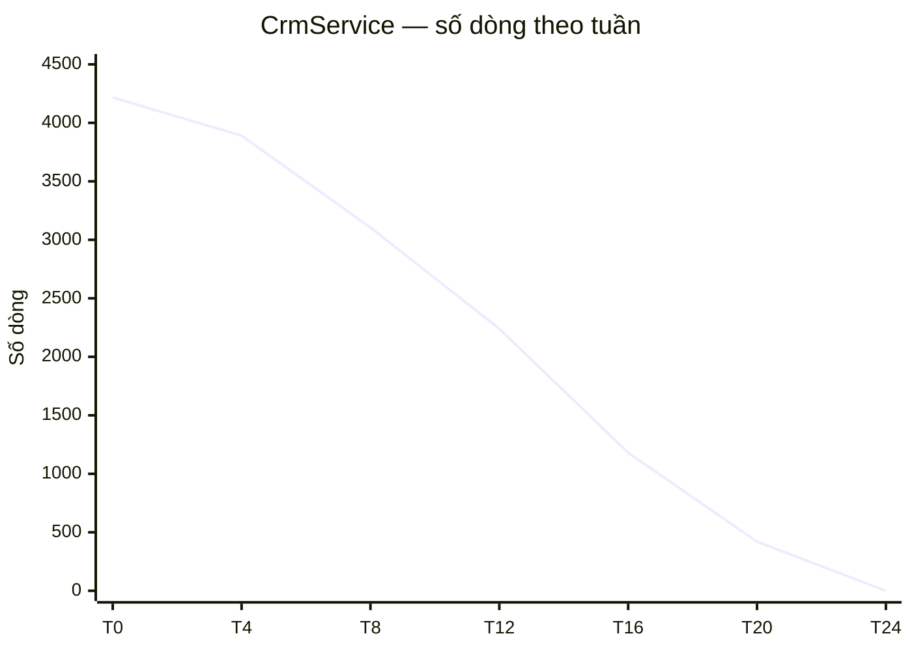

import { SummaryBox, Checklist, FAQSection } from '@site/src/components/SEO';

# 16.15 — Mini case study

<SummaryBox>
Một ca refactor thật: `CrmService` dài **4.217 dòng**, 19 dependency trong constructor, 63 phương thức public, và **mọi** controller đều gọi nó. Đội 6 người, không được dừng phát triển tính năng. Điều đáng học nhất không phải kỹ thuật — Strangler Fig đã biết ở [bài 16.11](16.10-anti-patterns-to-avoid.mdx) — mà là **cách làm việc đó song song với phát triển tính năng**: quy tắc "chạm đâu gỡ đó", cách đo tiến độ, và **ba sai lầm** đội mắc phải trong ba tháng đầu khiến tiến độ gần như bằng không trước khi họ đổi cách làm.
</SummaryBox>

## Mục tiêu bài học

Sau bài này bạn có thể:

- Lập kế hoạch gỡ God Service không cần dừng phát triển.
- Đo tiến độ refactor bằng số liệu thay vì cảm giác.
- Tránh ba sai lầm phổ biến khi refactor dần.
- Biết khi nào nên dừng refactor.

## Nội dung bài học

### 16.15.1 — Hiện trạng

```csharp
public class CrmService
{
    public CrmService(
        ILeadRepository leads, ICustomerRepository customers,
        IOrderRepository orders, IInvoiceRepository invoices,
        IEmailSender email, ISmsSender sms, IPdfGenerator pdf,
        IFileStorage storage, IPaymentGateway payment,
        ICacheService cache, IBackgroundJobClient jobs,
        ILogger<CrmService> logger, IConfiguration config,
        IMapper mapper, ICurrentUser currentUser,
        IDateTimeProvider clock, IEventPublisher events,
        IAuditService audit, INotificationService notifications)
    { /* ... */ }

    // 63 phương thức public, 4.217 dòng
}
```

Ba hậu quả đo được, không phải cảm tính:

```
- Thời gian chạy bộ test của service này:  8 phút (mỗi test dựng 19 mock)
- Số merge conflict trung bình mỗi tuần:   11 (cả đội sửa cùng file)
- Thời gian đồng bộ của developer mới:     ~3 ngày chỉ để hiểu file này
```

### 16.15.2 — Ba sai lầm trong ba tháng đầu

**Sai lầm 1 — lập kế hoạch refactor toàn bộ.** Đội dành hai tuần viết tài liệu thiết kế cho kiến trúc đích, rồi phát hiện không có cách nào đi từ A tới B trong một lần. Tài liệu bị bỏ.

**Sai lầm 2 — tách theo tầng kỹ thuật.** Nỗ lực đầu tiên là tách `CrmService` thành `CrmReadService`, `CrmWriteService`, `CrmValidationService`. Kết quả: ba file lớn thay vì một, và **mỗi tính năng vẫn phải sửa cả ba** ([bài 16.11](16.10-anti-patterns-to-avoid.mdx)).

**Sai lầm 3 — refactor trên nhánh riêng.** Một người refactor trên nhánh `refactor/crm-service` trong 5 tuần. Khi merge, có **340 conflict** vì phần còn lại của đội vẫn sửa file đó hàng ngày. Nhánh bị bỏ.

Ba tháng, tiến độ gần bằng không. Điểm chung của cả ba sai lầm: chúng đều cố làm refactor thành **một dự án tách biệt** thay vì một phần của công việc hàng ngày.

### 16.15.3 — Cách làm mới: chạm đâu gỡ đó

Quy tắc duy nhất, viết vào định nghĩa hoàn thành của đội:

> **Mỗi khi cần sửa một phương thức trong `CrmService`, kéo nó ra thành một handler riêng trước, rồi mới sửa.**

```csharp
// Bước 1: tạo handler, COPY logic nguyên vẹn (chưa sửa gì)
public sealed class ConvertLeadHandler(
    ILeadRepository leads,
    ICustomerRepository customers,
    IEventPublisher events)              // chỉ 3 dependency, không phải 19
    : IRequestHandler<ConvertLeadCommand, Result>
{
    public async Task<Result> Handle(ConvertLeadCommand request, CancellationToken ct)
    {
        // logic copy tu CrmService.ConvertLeadAsync
    }
}

// Buoc 2: CrmService UY QUYEN — moi caller cu van chay binh thuong
public async Task<Result> ConvertLeadAsync(Guid leadId)
    => await _sender.Send(new ConvertLeadCommand(new LeadId(leadId)));

// Bước 3: giờ mới sửa theo yêu cầu nghiệp vụ mới
```

Ba đặc điểm khiến cách này hoạt động được:

- **Không có nhánh dài hạn.** Mỗi lần gỡ là một PR nhỏ, merge trong ngày.
- **Không dừng tính năng.** Việc gỡ đi kèm công việc đang làm, không thay thế nó.
- **Rủi ro thấp.** Bước 1 là copy nguyên văn, nên nếu có lỗi thì lỗi nằm ở bước 3 — phần bạn đang chủ động sửa.

Bước 2 quan trọng: giữ `CrmService` như một lớp uỷ quyền nghĩa là **không caller nào phải sửa** cùng lúc. Việc dọn caller làm dần sau.

### 16.15.4 — Đo tiến độ

Ba chỉ số, đo hàng tuần và vẽ theo thời gian:

```bash
# 1. Số dòng của CrmService
wc -l src/Crm.Application/Services/CrmService.cs

# 2. So dependency trong constructor
grep -c "I[A-Z][a-zA-Z]* " CrmService.cs

# 3. Số phương thức CÒN logic (chưa phải uỷ quyền thuần)
grep -c "public async Task" CrmService.cs
```

| Tuần | Số dòng | Dependency | Phương thức còn logic |
|---|---|---|---|
| 0 | 4217 | 19 | 63 |
| 4 | 3890 | 19 | 57 |
| 8 | 3105 | 16 | 44 |
| 12 | 2240 | 12 | 31 |
| 16 | 1180 | 7 | 16 |
| 20 | 420 | 3 | 5 |
| 24 | **0** | — | **0** (xoá file) |

Đường cong dốc dần về cuối — điển hình: những phương thức còn lại cuối cùng thường là phương thức **ít được chạm nhất**, nên chúng cần một đợt dọn chủ động ở tuần 20–24 thay vì chờ có người chạm vào.

Biểu đồ này cũng là công cụ **thuyết phục quản lý**: nó cho thấy refactor đang tiến triển mà không tốn sprint riêng nào.

### 16.15.5 — Kết quả

| Chỉ số | Trước | Sau |
|---|---|---|
| Thời gian chạy test của phần này | 8 phút | **40 giây** |
| Merge conflict mỗi tuần | 11 | **1–2** |
| Thời gian hiểu một use case | ~2 giờ | **~15 phút** |
| Dependency trung bình mỗi handler | 19 | **3,2** |
| Số sprint dành riêng cho refactor | — | **0** |

Hàng cuối là điều đáng nói nhất: toàn bộ việc này diễn ra **bên trong** công việc phát triển bình thường. Không có "sprint kỹ thuật", không phải xin phép dừng tính năng.

Test nhanh hơn 12 lần không chỉ là con số dễ chịu: nó đổi hành vi của đội — khi bộ test chạy 40 giây, người ta chạy nó trước mỗi commit; khi nó chạy 8 phút, người ta chỉ chạy lúc CI báo đỏ.

### 16.15.6 — Khi nào dừng

Không phải mọi God Service đều đáng gỡ hết. Ba tình huống nên dừng:

**1. Phần còn lại không ai chạm tới.** Nếu 400 dòng cuối là tính năng dùng mỗi năm một lần, chi phí gỡ cao hơn lợi ích. Để nguyên và ghi chú.

**2. Module sắp bị thay thế.** Nếu nghiệp vụ đó sẽ bị bỏ trong 6 tháng, refactor là lãng phí.

**3. Không có test.** Refactor code không có test là đánh bạc. Viết test đặc tả hành vi hiện tại trước — kể cả khi hành vi đó trông sai, vì có thể có ai đó đang phụ thuộc vào nó ([bài 16.9](16.9-testing-strategy-overview.mdx)).

### 16.15.7 — Rà lại code của bạn

<Checklist
  title="Danh sách rà soát khi gỡ God Service"
  items={[
    { text: "Quy tắc chạm đâu gỡ đó được viết vào định nghĩa hoàn thành." },
    { text: "Không có nhánh refactor dài hạn nào đang tồn tại." },
    { text: "Mỗi lần gỡ là một PR nhỏ merge trong ngày." },
    { text: "Bước đầu là copy nguyên văn, không sửa logic cùng lúc." },
    { text: "Service cũ giữ vai trò uỷ quyền để caller không phải sửa cùng lúc." },
    { text: "Tách theo use case, không tách theo tầng kỹ thuật." },
    { text: "Có ba chỉ số đo hàng tuần và vẽ theo thời gian." },
    { text: "Có test đặc tả hành vi hiện tại trước khi refactor." },
    { text: "Đã xác định phần nào không đáng gỡ và ghi chú lý do." },
  ]}
/>

## Bài tập áp dụng

#### Bài 1 — Đo hiện trạng

Tìm lớp lớn nhất trong dự án và đo ba chỉ số ở mục 16.15.4.

**Tiêu chí hoàn thành:** bạn có ba con số cho ít nhất ba lớp, và giải thích được vì sao **ba chỉ số này** chứ không phải ba chỉ số khác.

<details>
<summary><strong>Gợi ý và lời giải — Bài 1</strong></summary>

**Gợi ý.** Chỉ số tốt phải đo được nhanh, khó gian lận, và giảm khi tình hình thật sự tốt lên.

**Lời giải — script đo:**

```bash
#!/usr/bin/env bash
# do-god-service.sh
printf "%-42s %6s %5s %5s\n" "FILE" "DÒNG" "DEP" "PT"
printf "%-42s %6s %5s %5s\n" "----" "----" "---" "--"

find src -name "*Service.cs" -o -name "*Manager.cs" -o -name "*Helper.cs" \
  | while read -r f; do
      dong=$(wc -l < "$f")
      dep=$(grep -c "private readonly" "$f")
      pt=$(grep -cE "public (async )?(Task|void|[A-Z])" "$f")
      [ "$dong" -gt 200 ] && printf "%-42s %6d %5d %5d\n" "$(basename "$f")" "$dong" "$dep" "$pt"
    done | sort -k2 -rn
```

```text
FILE                                        DÒNG   DEP    PT
----                                        ----   ---    --
CrmService.cs                               4217    19    63
OrderService.cs                             1842    14    28
LeadService.cs                               687    14    14
CustomerService.cs                           512    11    19
ReportService.cs                             398     9    12
```

**Vì sao ba chỉ số này:**

**1. Số dòng — đo khối lượng, và ai cũng hiểu ngay.**

```text
Dưới 200:     bình thường
200–500:      bắt đầu khó đọc
500–1000:     cần tách
Trên 1000:    God Service
```

Nó không hoàn hảo — một file 400 dòng toàn code lặp dễ hơn một file 200 dòng logic dày — nhưng nó đo được trong một giây và không ai tranh cãi về cách tính.

**2. Số dependency — đo phạm vi trách nhiệm, và đây là chỉ số tốt nhất trong ba cái.**

```text
1–3 dependency:   lớp làm một việc
4–6:              chấp nhận được
7–10:             đang làm nhiều việc
Trên 10:          chắc chắn vi phạm nguyên tắc trách nhiệm đơn
```

Lý do nó tốt: một lớp cần 19 dependency nghĩa là nó **chạm tới 19 mối quan tâm khác nhau** — và đó là định nghĩa của việc làm quá nhiều việc. Khác với số dòng, nó không giảm được bằng cách gộp dòng hay xuống dòng ít đi.

Nó cũng dự báo được chi phí test: 19 dependency nghĩa là mọi test cho lớp này phải dựng hoặc mock 19 thứ.

**3. Số phương thức public — đo bề mặt API.**

```text
1 phương thức:     handler (lý tưởng)
2–5:               service tập trung
6–15:              đang phình
Trên 15:           God Service
```

Ba chỉ số này **tương quan với nhau**, và đó là điểm mạnh: nếu một lớp cao ở cả ba, kết luận chắc chắn. Nếu nó cao ở một chỉ số mà thấp ở hai chỉ số kia, đó là trường hợp cần xem kỹ hơn:

```text
Nhiều dòng, ít dependency, ít phương thức
    -> có thể là một thuật toán phức tạp, không phải God Service

Ít dòng, nhiều dependency
    -> lớp uỷ quyền thuần tuý -> có thể xoá được
```

**Vì sao không dùng các chỉ số khác:**

| Chỉ số | Vì sao không dùng làm chỉ số chính |
|---|---|
| Cyclomatic complexity | Cần công cụ, khó giải thích cho người ngoài kỹ thuật |
| Coupling / Cohesion | Đo được nhưng trừu tượng, khó hành động theo |
| Test coverage | Không đo kích thước, và gian lận được ([bài 16.9](16.9-testing-strategy-overview.mdx)) |
| Số dòng trung bình mỗi phương thức | Che mất một phương thức 800 dòng giữa 40 phương thức nhỏ |

Ba chỉ số đã chọn có một tính chất chung: **đo được bằng `grep`**, không cần cài gì, và ai cũng chạy lại được để kiểm chứng.

**Thêm hai chỉ số bổ sung khi cần thuyết phục:**

**4. Số người chạm mỗi tháng** — nó nối chỉ số kỹ thuật với chi phí thật:

```bash
git log --since='3 months ago' --format='%an' -- src/Crm.Application/Services/CrmService.cs \
  | sort -u | wc -l
```

```text
11
```

**5. Số merge conflict** — chi phí đo bằng thời gian:

```bash
git log --since='6 months ago' --format='%s' --merges \
  | grep -ci "conflict\|resolve" 
```

**Ghi lại thành bảng để theo dõi:**

```markdown
## Đo God Service — 2026-09-25

| Lớp | Dòng | Dep | PT | Người/tháng | Ưu tiên |
|---|---:|---:|---:|---:|---|
| CrmService | 4.217 | 19 | 63 | 11 | **1** |
| OrderService | 1.842 | 14 | 28 | 7 | **2** |
| LeadService | 687 | 14 | 14 | 6 | 3 |
| CustomerService | 512 | 11 | 19 | 4 | 4 |
```

Cột "người/tháng" quyết định thứ tự ưu tiên nhiều hơn cột "dòng": một lớp 4.000 dòng mà chỉ một người chạm mỗi quý ít gây đau hơn một lớp 700 dòng mà sáu người chạm mỗi tuần.

**Đưa vào CI như một cảnh báo, không phải một rào chặn:**

```yaml
- name: Cảnh báo God Service
  run: |
    ./scripts/do-god-service.sh > hien-tai.txt
    cat hien-tai.txt
    if awk 'NR>2 && $3 > 10 { n++ } END { exit (n > 0 ? 1 : 0) }' hien-tai.txt; then
      echo "::notice::Không có lớp nào trên 10 dependency"
    else
      echo "::warning::Có lớp trên 10 dependency — xem bảng ở trên"
    fi
```

Dùng `::warning::` chứ không `exit 1`: mục đích là làm cho con số **hiện ra trong mỗi PR**, không phải chặn merge. Chặn merge vì một lớp cũ có 19 dependency sẽ khiến nhóm tắt kiểm tra này trong tuần đầu.

</details>

---

#### Bài 2 — Gỡ một phương thức

Chọn phương thức bạn sắp phải sửa, kéo ra thành handler riêng theo ba bước, rồi mới sửa. Đo số dependency của handler mới.

**Tiêu chí hoàn thành:** bạn thực hiện được trên dự án thật, và giải thích được vì sao **gỡ trước khi sửa** rẻ hơn **sửa rồi gỡ sau**.

<details>
<summary><strong>Gợi ý và lời giải — Bài 2</strong></summary>

**Gợi ý.** Nếu bạn sửa một phương thức trong God Service, bạn phải hiểu bao nhiêu context xung quanh?

**Lời giải — quy trình ba bước đã có ở [bài 16.10](16.10-anti-patterns-to-avoid.mdx). Bài này về thời điểm.**

**Vì sao gỡ TRƯỚC khi sửa rẻ hơn:**

```text
Sửa trong God Service:
    1. Đọc 4.217 dòng để tìm phương thức
    2. Hiểu phương thức đó dùng những dependency nào trong 19 cái
    3. Sửa
    4. Chạy test — 8 phút, vì test phải dựng cả 19 dependency
    5. Không chắc có ảnh hưởng phương thức khác không
    6. PR chạm một file mà 11 người khác cũng đang sửa -> xung đột

Gỡ trước rồi sửa:
    1. Kéo phương thức ra handler mới     (20 phút, cơ học)
    2. Handler có 3 dependency, 38 dòng
    3. Viết test cho handler              (10 phút, chạy 200 ms)
    4. Sửa                                 (trong một file 38 dòng)
    5. Test chạy 200 ms, chạy được liên tục
    6. PR chạm 3 file mới, không ai đang sửa -> không xung đột
```

Bước 4 là chỗ khác biệt lớn nhất: sửa một phương thức 38 dòng với 3 dependency là một việc; sửa cùng phương thức đó khi nó nằm giữa 4.217 dòng là một việc khác hẳn về mặt nhận thức.

**Ba lý do cụ thể:**

**1. Bạn đã phải đọc và hiểu phương thức đó rồi.** Việc gỡ chỉ tốn thêm 20 phút, và nó tận dụng hiểu biết bạn vừa xây dựng được. Gỡ vào lúc khác nghĩa là phải đọc lại từ đầu.

**2. Test nhanh hơn đổi cách bạn làm việc.**

```text
Test 8 phút:    chạy một lần ở cuối, hoặc chỉ chạy khi CI báo đỏ
Test 200 ms:    chạy sau mỗi thay đổi nhỏ
```

Với vòng phản hồi 200 ms, bạn thử được nhiều cách; với 8 phút, bạn chọn cách đầu tiên có vẻ đúng.

**3. Rủi ro hồi quy thấp hơn.** Khi phương thức đã tách ra, thay đổi của bạn **không thể** ảnh hưởng tới 62 phương thức còn lại — vì chúng không còn chia sẻ state hay dependency nào với nó.

**Quy trình chi tiết:**

```csharp
// Bước 1 — sao chép nguyên văn sang handler mới, CHƯA sửa gì
public sealed class GuiBaoGiaHandler : IRequestHandler<GuiBaoGiaCommand, Result>
{
    private readonly CrmDbContext _db;
    private readonly IPdfGenerator _pdf;
    private readonly IEmailSender _email;
    // 3 dependency, không phải 19

    public async Task<Result> Handle(GuiBaoGiaCommand c, CancellationToken ct)
    {
        // Logic sao chép nguyên văn từ CrmService.GuiBaoGiaAsync
    }
}
```

```csharp
// Bước 2 — service cũ uỷ quyền, chữ ký GIỮ NGUYÊN
public async Task<Result> GuiBaoGiaAsync(LeadId id, CancellationToken ct)
    => await _mediator.Send(new GuiBaoGiaCommand(id), ct);
```

```bash
dotnet test        # xanh — chưa sửa hành vi gì
git commit -m "refactor: tách GuiBaoGia ra khỏi CrmService"
```

**Commit ở đây là quan trọng.** Bạn có một điểm quay về sạch sẽ, và người review thấy rõ "chỉ là di chuyển code".

```csharp
// Bước 3 — GIỜ mới sửa, trong một file 38 dòng
public async Task<Result> Handle(GuiBaoGiaCommand c, CancellationToken ct)
{
    // Tính năng mới: gửi kèm file đính kèm
}
```

```bash
git commit -m "feat: báo giá gửi kèm tài liệu đính kèm"
```

Hai commit tách bạch: một cái di chuyển code, một cái đổi hành vi. Người review kiểm tra cái thứ nhất bằng cách xác nhận không có thay đổi logic, và tập trung toàn bộ sự chú ý vào cái thứ hai.

**Đo kết quả:**

```markdown
| | CrmService.GuiBaoGiaAsync | GuiBaoGiaHandler |
|---|---:|---:|
| Dòng của lớp chứa nó | 4.217 | 38 |
| Dependency | 19 | 3 |
| Thời gian chạy test liên quan | 8 phút | 0,2 giây |
| File phải mở để hiểu | 1 (nhưng 4.217 dòng) | 1 (38 dòng) |
| Người khác đang sửa cùng file | 11 | 0 |
```

**Trong lúc gỡ, bạn sẽ phát hiện ba thứ:**

**1. Dependency không dùng tới.** Phương thức trong God Service có thể tham chiếu `_cache` hay `_sms` chỉ vì chúng có sẵn, không vì cần:

```csharp
_cache.Remove($"baogia:{id}");        // cache này có ai đọc không?
```

**2. Logic trùng với phương thức khác.** Hai phương thức trong cùng God Service thường có đoạn giống nhau — và khi tách ra, sự trùng lặp trở nên rõ ràng.

**3. Quy tắc nghiệp vụ nằm sai chỗ.** Điều kiện `if (lead.Value >= 500_000_000)` trong service thuộc về entity ([bài 16.1](16.1-when-growth-exposes-architecture.mdx)).

Đừng sửa cả ba trong cùng PR. Ghi chú lại, tách thành ticket riêng:

```csharp
// TODO(CRM-4821): _cache.Remove ở đây có vẻ thừa — không tìm thấy nơi đọc khoá này
```

**Và quy tắc cho nhóm — viết vào định nghĩa hoàn thành:**

```markdown
## Definition of Done — bổ sung

Khi sửa một phương thức trong lớp có trên 10 dependency:
1. Tách phương thức đó ra handler riêng TRƯỚC (commit riêng)
2. Rồi mới thực hiện thay đổi (commit riêng)

Nếu việc tách mất hơn 2 giờ, ghi ticket và thảo luận thay vì tự quyết định.
```

Mệnh đề cuối quan trọng: một số phương thức quấn quá chặt vào state của service và không tách được trong hai giờ. Quy tắc phải có lối thoát, nếu không nó sẽ bị bỏ qua hoàn toàn.

**Điều làm cách này bền vững:** nó không cần sprint riêng, không cần xin phép, và mỗi lần làm đều mang lại lợi ích **ngay trong công việc hiện tại**. Đó là lý do nó thành công ở nơi mà "dự án refactor" thất bại.

</details>

---

#### Bài 3 — Vẽ đường cong tiến độ

Ghi ba chỉ số mỗi tuần trong một tháng và vẽ biểu đồ.

**Tiêu chí hoàn thành:** bạn tự động hoá việc thu thập, và giải thích được vì sao **đường cong** thuyết phục hơn **con số cuối cùng**.

<details>
<summary><strong>Gợi ý và lời giải — Bài 3</strong></summary>

**Gợi ý.** Bạn trình bày kết quả cho ai, và họ cần biết điều gì?

**Lời giải — tự động hoá thu thập:**

```bash
#!/usr/bin/env bash
# scripts/ghi-chi-so.sh — chạy hằng tuần qua cron hoặc CI
set -euo pipefail

FILE="src/Crm.Application/Services/CrmService.cs"
CSV="docs/metrics/god-service.csv"

mkdir -p "$(dirname "$CSV")"
[ -f "$CSV" ] || echo "ngay,dong,dependency,phuong_thuc,nguoi_cham_30_ngay" > "$CSV"

if [ -f "$FILE" ]; then
  dong=$(wc -l < "$FILE")
  dep=$(grep -c "private readonly" "$FILE")
  pt=$(grep -cE "public (async )?(Task|void)" "$FILE")
else
  dong=0; dep=0; pt=0          # file đã bị xoá — mục tiêu cuối cùng
fi

nguoi=$(git log --since='30 days ago' --format='%an' -- "$FILE" 2>/dev/null | sort -u | wc -l)

echo "$(date +%F),$dong,$dep,$pt,$nguoi" >> "$CSV"
```

```yaml
# .github/workflows/chi-so.yml
on:
  schedule:
    - cron: '0 1 * * 1'          # mỗi thứ Hai
  workflow_dispatch:

jobs:
  ghi-chi-so:
    runs-on: ubuntu-latest
    steps:
      - uses: actions/checkout@v4
        with: { fetch-depth: 0 }
      - run: ./scripts/ghi-chi-so.sh
      - uses: stefanzweifel/git-auto-commit-action@v5
        with:
          commit_message: "chore: ghi chỉ số tuần $(date +%V)"
          file_pattern: docs/metrics/*.csv
```

```csv
ngay,dong,dependency,phuong_thuc,nguoi_cham_30_ngay
2026-04-06,4217,19,63,11
2026-04-13,4180,19,62,10
2026-04-20,3945,18,59,11
2026-04-27,3890,19,57,9
2026-05-04,3612,17,52,8
...
2026-09-21,420,3,5,2
2026-09-28,0,0,0,0
```

**Vẽ biểu đồ ngay trong Markdown:**

````markdown

````

**Vì sao đường cong thuyết phục hơn con số cuối cùng — bốn lý do:**

**1. Nó cho thấy XU HƯỚNG, và xu hướng dự báo được tương lai.**

```text
"CrmService còn 2.240 dòng"
    -> vẫn lớn -> nghe như thất bại

"4.217 -> 3.890 -> 3.105 -> 2.240 trong 12 tuần"
    -> giảm đều khoảng 165 dòng/tuần
    -> ngoại suy: về 0 vào khoảng tuần 26
    -> nghe như một kế hoạch đang chạy đúng hướng
```

Cùng một con số 2.240, hai cách diễn giải hoàn toàn khác nhau — và đường cong là thứ tạo ra sự khác biệt đó.

**2. Nó cho thấy công việc đang diễn ra mà KHÔNG cần sprint riêng.**

Đây là điểm quan trọng nhất khi trình bày với quản lý: đường cong giảm đều trong khi các tính năng vẫn được giao đúng hạn là bằng chứng rằng cách làm "chạm đâu gỡ đó" hiệu quả. Nó biến câu hỏi "khi nào xong refactor?" thành "nhìn đường cong đi".

**3. Nó phát hiện khi công việc dừng lại.**

```text
Tuần 12: 2.240
Tuần 13: 2.238
Tuần 14: 2.240
Tuần 15: 2.235      <- đường ngang
```

Đường ngang nghĩa là không ai chạm vào phần còn lại — thường vì đó là những phương thức ít dùng nhất. Đây là tín hiệu cần chuyển từ "chạm đâu gỡ đó" sang một đợt dọn chủ động, và bạn biết điều đó **trước** khi công việc bị lãng quên.

**4. Nó là tài liệu cho người đến sau.**

Sáu tháng sau, một người mới hỏi "vì sao code ở đây được tổ chức thế này?" — biểu đồ cộng ADR ([bài 16.11](16.11-roadmap-sh-supplement.mdx)) trả lời trong hai phút.

**Bốn chỉ số nên vẽ cùng nhau:**

```markdown
## Tiến độ gỡ God Service

### Số dòng và số dependency
| Tuần | Dòng | Dep | Phương thức | Người chạm/30 ngày |
|---|---:|---:|---:|---:|
| 0 | 4.217 | 19 | 63 | 11 |
| 4 | 3.890 | 19 | 57 | 9 |
| 8 | 3.105 | 16 | 44 | 8 |
| 12 | 2.240 | 12 | 31 | 6 |
| 16 | 1.180 | 7 | 16 | 4 |
| 20 | 420 | 3 | 5 | 2 |
| 24 | **0** | — | **0** | — |

### Chỉ số hệ quả
| Tuần | Test (giây) | Conflict/tuần | Dep TB mỗi handler |
|---|---:|---:|---:|
| 0 | 480 | 11 | — |
| 12 | 210 | 5 | 4,1 |
| 24 | **40** | **1,5** | **3,2** |
```

Bảng thứ hai là bảng nói với **người ngoài nhóm kỹ thuật**: thời gian chạy test và số merge conflict là những thứ ai cũng hiểu là chi phí.

**Và một lưu ý về cách trình bày:**

```text
Đừng gọi đây là "chỉ số chất lượng code"
    -> nghe như đánh giá con người, gây phòng thủ

Gọi là "chi phí thay đổi" hoặc "tiến độ gỡ nợ kỹ thuật"
    -> nói về hệ thống, không về người viết ra nó
```

Ba chỉ số này đo **hệ thống tại thời điểm hiện tại**, không đo ai. Cách đặt tên quyết định liệu nhóm coi chúng là công cụ hay là bảng điểm — và một bảng điểm sẽ bị tối ưu hoá thay vì được dùng.

**Mở rộng — theo dõi toàn bộ codebase, không chỉ một file:**

```bash
#!/usr/bin/env bash
# Tổng số lớp có trên 10 dependency
find src -name "*.cs" -exec grep -c "private readonly" {} + \
  | awk -F: '$2 > 10 { n++ } END { print n+0 }'
```

```csv
ngay,so_lop_tren_10_dep,tong_dong_service,handler_trung_binh_dep
2026-04-06,7,12840,-
2026-09-28,1,3210,3.2
```

Chỉ số "số lớp trên 10 dependency" là chỉ số sức khoẻ tổng thể tốt nhất trong ba cái: nó không quan tâm file nào, chỉ đếm có bao nhiêu chỗ đang vi phạm — và nó về 0 khi codebase thật sự khoẻ mạnh.

</details>

## Tự kiểm tra

<FAQSection
  items={[
    {
      question: "Vì sao refactor trên nhánh riêng thất bại?",
      answer: "Vì phần còn lại của đội vẫn sửa file đó hàng ngày, nên sau năm tuần có hàng trăm conflict khi merge. Refactor phải đi cùng dòng công việc chính, không tách ra thành nhánh dài hạn."
    },
    {
      question: "Vì sao tách God Service theo tầng kỹ thuật là sai?",
      answer: "Vì kết quả là nhiều file lớn thay vì một, và mỗi tính năng vẫn phải sửa tất cả các file đó. Phải tách theo use case để mỗi thay đổi chỉ chạm một chỗ."
    },
    {
      question: "Quy tắc chạm đâu gỡ đó hoạt động thế nào?",
      answer: "Mỗi khi cần sửa một phương thức trong service lớn, kéo nó ra thành handler riêng trước rồi mới sửa. Không có nhánh dài hạn, không dừng phát triển tính năng, và rủi ro thấp vì bước đầu chỉ là copy nguyên văn."
    },
    {
      question: "Vì sao service cũ nên giữ vai trò uỷ quyền?",
      answer: "Để không caller nào phải sửa cùng lúc với việc gỡ. Việc dọn caller làm dần về sau, nên mỗi PR vẫn nhỏ và merge được trong ngày."
    },
    {
      question: "Vì sao đường cong tiến độ dốc dần về cuối?",
      answer: "Vì những phương thức còn lại cuối cùng là những phương thức ít được chạm nhất, nên quy tắc chạm đâu gỡ đó không còn tác dụng với chúng. Chúng cần một đợt dọn chủ động ở giai đoạn cuối."
    },
    {
      question: "Ba tình huống nên dừng refactor là gì?",
      answer: "Khi phần còn lại không ai chạm tới nên chi phí gỡ cao hơn lợi ích, khi module sắp bị thay thế, và khi không có test. Trường hợp cuối cần viết test đặc tả hành vi hiện tại trước, kể cả khi hành vi đó trông sai."
    }
  ]}
/>

## Kết luận

Ba điều đáng nhớ nhất:

1. **Refactor phải đi cùng công việc hàng ngày**, không thành dự án tách biệt.
2. **Copy nguyên văn trước, sửa sau.** Hai việc đó không nên làm cùng lúc.
3. **Đo bằng số liệu và vẽ theo thời gian** — đó cũng là cách thuyết phục quản lý.

## Tham khảo

- [Strangler Fig Application (Martin Fowler)](https://martinfowler.com/bliki/StranglerFigApplication.html)
- [Anemic Domain Model (Martin Fowler)](https://martinfowler.com/bliki/AnemicDomainModel.html)
- [Clean Architecture template (Steve Smith)](https://github.com/ardalis/CleanArchitecture)
- [Architectural principles](https://learn.microsoft.com/en-us/dotnet/architecture/modern-web-apps-azure/architectural-principles)

## Điều hướng

- **Bài trước:** [16.13 — Mở rộng và đào sâu](16.13-advanced-notes.mdx)
- **Bài tiếp theo:** [16.15 — Ví dụ thực tế nhanh](16.15-quick-real-world-example.mdx)
- **Về module:** [Trang mục lục](./)
