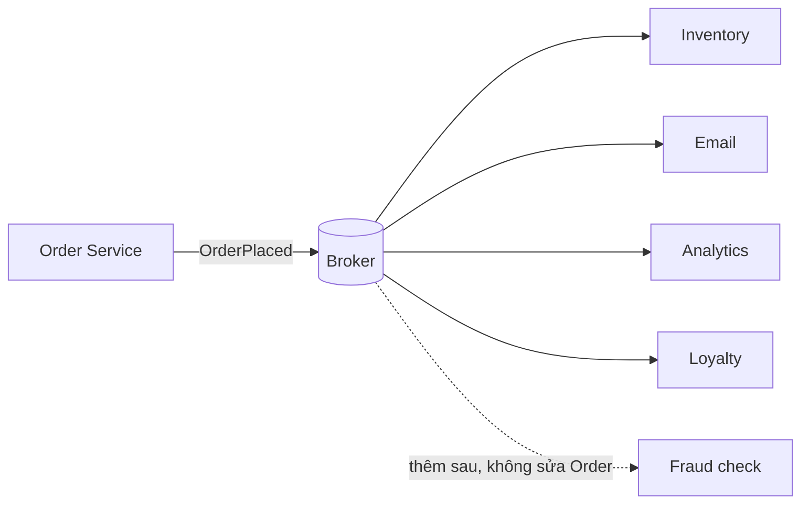

import { SummaryBox, Checklist, FAQSection } from '@site/src/components/SEO';

# 17.2 — 1. Event-driven architecture (EDA) — khi nào dùng?

<SummaryBox>
EDA giải quyết một vấn đề cụ thể: **coupling thời gian** — bên gửi không phải chờ bên nhận xử lý xong, và không sập khi bên nhận sập. Nhưng nó **không miễn phí**, và cái giá không nằm ở chỗ dựng broker (một `docker compose` là xong) mà ở chỗ **hệ thống của bạn không còn nhất quán ngay lập tức**: đơn hàng tạo xong nhưng tồn kho chưa trừ, và trong vài trăm mili giây đó mọi câu hỏi "dữ liệu đúng chưa" đều có câu trả lời "còn tuỳ". Thêm vào đó là **schema versioning**, **thứ tự**, **message trùng**, **DLQ** và debug xuyên tiến trình. Nguyên tắc chọn: nếu bạn chỉ có **một** service và một database, **domain event in-process** ([bài 16.9](../module-16-clean-architecture/16.8-in-process.mdx)) cộng một job nền gần như luôn là lựa chọn đúng.
</SummaryBox>

## Mục tiêu bài học

Sau bài này bạn có thể:

- Nêu ba lý do chính đáng để đưa broker vào hệ thống.
- Kể đúng chi phí thật của EDA, không chỉ chi phí hạ tầng.
- Phân biệt domain event và integration event.
- Chọn giữa in-process event, job nền và broker theo tình huống.
- Nhận ra khi nào EDA đang được dùng vì "nghe hiện đại".

## Nội dung bài học

### 17.2.1 — Ba lý do chính đáng

**1. Giảm coupling thời gian.**

```csharp
// ĐỒNG BỘ — Sales phụ thuộc vào Billing còn sống
public async Task<Result> ConvertLeadAsync(LeadId id, CancellationToken ct)
{
    var customer = await CreateCustomerAsync(id, ct);

    // Billing down 30 giây -> convert lead THẤT BẠI, dù nghiệp vụ chính đã xong
    await _billingClient.CreateSubscriptionAsync(customer.Id, ct);

    return Result.Success();
}
```

Ở đây Sales **không thể** hoàn thành việc của mình nếu Billing chết. Đây là coupling thời gian: hai service phải **cùng sống** tại cùng một thời điểm.

```csharp
// BẤT ĐỒNG BỘ — Sales xong việc của nó, Billing xử lý khi nó sẵn sàng
public async Task<Result> ConvertLeadAsync(LeadId id, CancellationToken ct)
{
    var customer = await CreateCustomerAsync(id, ct);

    await _publisher.PublishAsync(
        new LeadConvertedIntegrationEvent(customer.Id, DateTime.UtcNow), ct);

    return Result.Success();
}
```

Billing down 30 giây? Message nằm trong queue và được xử lý khi nó sống lại.

**2. Nhiều bên quan tâm cùng một sự kiện.**

Khi `OrderPlaced` cần kích hoạt: trừ tồn kho, gửi email xác nhận, ghi analytics, cập nhật điểm thưởng — và danh sách này **còn dài ra**. Gọi trực tiếp nghĩa là mỗi lần thêm một bên quan tâm, bạn phải sửa code của bên gửi.



Đây là [Publisher-Subscriber](https://learn.microsoft.com/en-us/azure/architecture/patterns/publisher-subscriber): bên gửi **không biết** ai đang nghe.

**3. Hấp thụ tải đột biến.**

Chiến dịch marketing đẩy 10.000 đơn trong 5 phút. Xử lý đồng bộ nghĩa là 10.000 request cùng đánh vào database. Queue biến đỉnh tải thành một hàng đợi mà consumer rút ra với tốc độ nó chịu được — đây là [Competing Consumers](https://learn.microsoft.com/en-us/azure/architecture/patterns/competing-consumers).

Đổi lại: độ trễ. Đơn thứ 9.000 có thể đợi vài phút. Điều đó **chấp nhận được** với email xác nhận, **không chấp nhận được** với kiểm tra thẻ tín dụng.

### 17.2.2 — Chi phí thật, cái mà ít ai nói trước

Chi phí lớn nhất **không phải** dựng broker. Nó là bốn thứ sau.

**Nhất quán cuối cùng (eventual consistency).** Đây là thay đổi lớn nhất và nó **lan ra tới giao diện người dùng**:

```
t=0ms    POST /orders -> 201 Created, OrderId = 123
t=1ms    User redirect sang /orders/123
t=2ms    Trang hien thi: ton kho CHUA tru, diem thuong CHUA cong
t=400ms  Consumer xử lý xong
```

Người dùng bấm F5 và thấy số khác. Bạn phải **thiết kế cho việc này**: hiển thị trạng thái "đang xử lý", hoặc đọc lại từ chính service vừa ghi, hoặc chấp nhận và giải thích trong UI. Đây không phải bug — đây là hệ quả tất yếu, và nó phải được quyết định **trước**, không phải vá sau.

**Schema versioning.** Message đang nằm trong queue được tạo bởi **phiên bản code cũ**. Bạn triển khai bản mới có thêm trường bắt buộc → consumer mới không đọc được message cũ.

```csharp
// V1 — dang chay
public record LeadConvertedEvent(Guid CustomerId, DateTime ConvertedAt);

// V2 — thêm trường: PHẢI có giá trị mặc định, KHÔNG được bắt buộc
public record LeadConvertedEvent(
    Guid CustomerId,
    DateTime ConvertedAt,
    string? Source = null);      // nullable + default => đọc được message V1
```

Quy tắc: **chỉ thêm trường tuỳ chọn, không bao giờ xoá hay đổi nghĩa trường cũ**. Muốn thay đổi lớn thì phát hành `LeadConvertedEventV2` song song và tắt V1 sau khi queue cạn.

**Thứ tự không được đảm bảo.** `LeadCreated` và `LeadConverted` có thể tới consumer **ngược thứ tự** nếu chúng đi qua các partition hoặc consumer khác nhau. Consumer phải chịu được điều này — thường bằng cách kiểm tra trạng thái hiện tại thay vì giả định trạng thái trước đó.

**Debug xuyên tiến trình.** Một lỗi giờ nằm ở "đâu đó" giữa bốn service. Không có `correlation id` truyền qua message và log tập trung, bạn gần như mù. Đây là chi phí bắt buộc, không phải tuỳ chọn ([bài 15.9](../../stage-04-database-production/module-15-docker-deployment/15.8-production-monitoring.mdx)).

### 17.2.3 — Domain event và integration event

Hai khái niệm hay bị trộn, và trộn chúng gây hậu quả thật.

| | Domain event | Integration event |
|---|---|---|
| Phạm vi | Trong một service | Xuyên service |
| Vận chuyển | In-process, cùng transaction | Broker |
| Đặt tên | Ngôn ngữ nghiệp vụ nội bộ | Hợp đồng công khai |
| Đổi được không | Tự do, refactor thoải mái | **Là API — đổi là breaking change** |
| Dữ liệu | Có thể chứa entity | Chỉ dữ liệu nguyên thuỷ, tự chứa |

```csharp
// Domain event — noi bo, co the chua entity
public sealed record LeadConvertedDomainEvent(Lead Lead) : IDomainEvent;

// Integration event — hợp đồng công khai, tự chứa, không entity
public sealed record LeadConvertedIntegrationEvent(
    Guid EventId,
    Guid CustomerId,
    string CustomerEmail,
    decimal ContractValue,
    DateTime OccurredAtUtc);
```

**Sai lầm phổ biến:** publish thẳng domain event ra broker. Khi đó mọi lần refactor entity nội bộ đều thành breaking change với các service khác — bạn vừa biến cấu trúc bên trong của mình thành API công khai.

Luồng đúng: domain event kích hoạt handler nội bộ, handler đó **dịch** sang integration event và đưa vào outbox ([bài 17.4](17.3-outbox-pattern-applied.mdx)).

### 17.2.4 — Khi nào KHÔNG cần broker

```csharp
// Một service, một database -> in-process là đủ và ĐƠN GIẢN HƠN NHIỀU
public async Task Handle(LeadConvertedDomainEvent e, CancellationToken ct)
{
    await _loyaltyService.AddPointsAsync(e.Lead.CustomerId, 100, ct);
}
```

Không broker, không serialize, không trùng lặp, không DLQ, **trong cùng transaction** nên không có trạng thái nửa vời. Debug bằng một breakpoint.

**Cần chạy nền nhưng vẫn một service?** Job nền ([bài 14.7](../../stage-04-database-production/module-14-caching-background-jobs/14.6-hangfire-background-jobs.mdx)) rẻ hơn broker rất nhiều:

```csharp
_jobs.Enqueue<IEmailSender>(s => s.SendWelcomeEmailAsync(customerId));
```

Hangfire đã có retry, dashboard, và lưu trữ bền trên chính database bạn đang dùng.

**Bảng quyết định:**

| Tình huống | Dùng gì |
|---|---|
| Một service, cần nhất quán ngay | Domain event in-process |
| Một service, việc chạy nền được | Job nền (Hangfire/Quartz) |
| Nhiều service, chịu được trễ | **Broker** |
| Nhiều service, cần trả lời ngay | Gọi HTTP/gRPC đồng bộ |
| Cần replay lịch sử, nhiều consumer độc lập | **Kafka** |

Hàng thứ tư đáng chú ý: EDA **không thay thế** gọi đồng bộ. "Số dư tài khoản là bao nhiêu" là câu hỏi cần trả lời ngay — đó là một truy vấn, không phải một sự kiện.

**Dấu hiệu EDA đang bị dùng sai:** bạn publish một event rồi **chờ** event phản hồi để trả về cho người dùng. Đó là gọi đồng bộ được viết bằng cách phức tạp gấp năm lần — và mất luôn khả năng gỡ lỗi bằng stack trace.

### 17.2.5 — Rà lại code của bạn

<Checklist
  title="Danh sách rà soát trước khi đưa broker vào"
  items={[
    { text: "Đã trả lời được broker giải quyết vấn đề cụ thể nào trong ba lý do." },
    { text: "Đã cân nhắc domain event in-process và job nền trước." },
    { text: "Đội chấp nhận được nhất quán cuối cùng, và giao diện đã tính tới nó." },
    { text: "Integration event tự chứa, không tham chiếu entity nội bộ." },
    { text: "Quy ước phiên bản message đã thống nhất: chỉ thêm trường tuỳ chọn." },
    { text: "Consumer không giả định thứ tự message." },
    { text: "Có correlation id truyền qua message và log tập trung." },
    { text: "Không dùng event để mô phỏng gọi đồng bộ rồi chờ phản hồi." },
  ]}
/>

## Bài tập áp dụng

#### Bài 1 — Đo coupling thời gian

Trong dự án của bạn, tìm một lời gọi HTTP đồng bộ giữa hai thành phần. Tắt bên nhận và ghi lại chính xác điều gì xảy ra với người dùng.

**Tiêu chí hoàn thành:** bạn mô tả được chuỗi sự kiện đầy đủ, và tính được **tính sẵn sàng tổng hợp** của chuỗi phụ thuộc.

<details>
<summary><strong>Gợi ý và lời giải — Bài 1</strong></summary>

**Gợi ý.** Nếu A gọi B đồng bộ, A hoạt động được khi B chết không?

**Lời giải — tìm các lời gọi đồng bộ:**

```bash
grep -rn "HttpClient\|GetFromJsonAsync\|PostAsJsonAsync\|_.*Client\." --include="*.cs" src/ \
  | grep -v "Tests" | grep -oP "^[^:]+" | sort -u
```

```csharp
public async Task<Result> ChotLeadAsync(LeadId id, CancellationToken ct)
{
    var lead = await _db.Leads.FirstAsync(l => l.Id == id, ct);
    lead.ChuyenSangWon(...);
    await _db.SaveChangesAsync(ct);

    // Lời gọi đồng bộ tới dịch vụ khác
    await _erpClient.TaoDonHangAsync(new TaoDonHangRequest(lead.Id, lead.Value), ct);

    return Result.ThanhCong();
}
```

**Tắt bên nhận và quan sát:**

```bash
docker stop erp-service
curl -X POST http://localhost:8080/leads/abc-123/chot -w "\nThời gian: %{time_total}s\n"
```

```text
Thời gian: 100.412s

HTTP 500
{"title":"Lỗi hệ thống"}
```

**Chuỗi sự kiện đầy đủ:**

```text
t=0,00    Request tới, handler bắt đầu
t=0,01    SELECT lead từ database
t=0,04    UPDATE lead -> Status = Won, COMMIT
t=0,05    Gọi HTTP tới erp-service
t=0,05    Kết nối TCP thất bại -> Polly retry lần 1
t=1,05    retry lần 2
t=3,05    retry lần 3
t=100,4   HttpClient timeout hết hạn
t=100,4   Exception -> HTTP 500 cho người dùng
```

**Và đây là phần tệ nhất, tệ hơn cả thời gian chờ:**

```text
Lead ĐÃ được chốt trong database (commit ở t=0,04)
Đơn hàng KHÔNG được tạo
Người dùng nhận lỗi 500

-> Người dùng bấm lại -> "Lead đã ở trạng thái cuối"
-> Người dùng nghĩ thao tác thất bại
-> Thực tế: nửa thành công, nửa thất bại, và không có cách nào hoàn tác
```

Đây là **dual write problem** ([bài 17.2](17.2-messaging-fears-lost-duplicates.mdx)): hai thao tác trên hai hệ thống, không có transaction chung.

**Tính tính sẵn sàng tổng hợp** — đây là phần chính của bài.

Với phụ thuộc đồng bộ, tính sẵn sàng **nhân lên**:

```text
API chính:    99,9%
ERP service:  99,9%
Dịch vụ email: 99,5%
Dịch vụ tính điểm: 99,0%

Tổng hợp = 0,999 × 0,999 × 0,995 × 0,990 = 98,3%
```

| Số phụ thuộc đồng bộ (mỗi cái 99,9%) | Tổng hợp | Downtime mỗi năm |
|---:|---:|---:|
| 0 | 99,90% | 8,8 giờ |
| 1 | 99,80% | 17,5 giờ |
| 3 | 99,70% | 26,3 giờ |
| 5 | 99,50% | 43,8 giờ |
| 10 | 99,00% | 87,6 giờ |

**Mỗi phụ thuộc đồng bộ là một cách mới để hệ thống của bạn chết**, và chúng cộng dồn. Đây là lý do một kiến trúc microservices gọi nhau đồng bộ theo chuỗi thường có tính sẵn sàng **thấp hơn** monolith mà nó thay thế.

Và con số trên còn lạc quan, vì nó giả định các sự cố độc lập. Trong thực tế chúng tương quan: một sự cố mạng ảnh hưởng nhiều dịch vụ cùng lúc.

**Ba cách cắt coupling thời gian:**

**Cách 1 — đưa việc phụ ra ngoài transaction, qua event:**

```csharp
public async Task<Result> ChotLeadAsync(LeadId id, CancellationToken ct)
{
    var lead = await _db.Leads.FirstAsync(l => l.Id == id, ct);
    var kq = lead.ChuyenSangWon(...);
    if (!kq.ThanhCong) return kq;

    // Ghi outbox trong CÙNG transaction
    _db.Outbox.Add(TinNhanOutbox.Tao(new LeadDaChot(lead.Id, lead.Value)));
    await _db.SaveChangesAsync(ct);

    return Result.ThanhCong();      // trả về NGAY, không chờ ERP
}
```

```text
ERP chết:
    -> lead vẫn được chốt
    -> message nằm trong outbox
    -> người dùng nhận 204, không biết gì về sự cố
    -> khi ERP sống lại, dispatcher publish và đơn hàng được tạo
```

Tính sẵn sàng của luồng chốt lead giờ **không phụ thuộc** vào ERP.

**Cách 2 — nếu bắt buộc đồng bộ, đặt timeout ngắn và có phương án dự phòng:**

```csharp
services.AddHttpClient<IErpClient, ErpClient>(c =>
{
    c.Timeout = TimeSpan.FromSeconds(3);          // KHÔNG để mặc định 100 giây
})
.AddResilienceHandler("erp", b =>
{
    b.AddTimeout(TimeSpan.FromSeconds(3));
    b.AddRetry(new HttpRetryStrategyOptions
    {
        MaxRetryAttempts = 2,
        Delay = TimeSpan.FromMilliseconds(200),
        UseJitter = true,
    });
    b.AddCircuitBreaker(new HttpCircuitBreakerStrategyOptions
    {
        FailureRatio = 0.5,
        SamplingDuration = TimeSpan.FromSeconds(30),
        BreakDuration = TimeSpan.FromSeconds(15),
    });
});
```

Timeout mặc định của `HttpClient` là **100 giây** — con số vô lý với một API phục vụ người dùng, và nó chính là nguyên nhân của 100,4 giây ở trên. Đặt timeout tường minh là thay đổi rẻ nhất và hiệu quả nhất trong cả bài.

**Cách 3 — nếu phải có cả hai thành công, dùng saga có bước bù trừ:**

```csharp
// Bước 1: chốt lead, ghi trạng thái "đang tạo đơn"
// Bước 2: tạo đơn hàng
// Bước 2 thất bại -> bước bù trừ: đưa lead về trạng thái cũ, thông báo
```

Chi tiết ở [bài 17.11](17.11-advanced-notes.mdx).

**Bảng quyết định:**

| Tình huống | Cách |
|---|---|
| Bên nhận chết thì thao tác chính **vẫn đúng** | **Event, qua outbox** |
| Cần kết quả ngay để trả về cho người dùng | Đồng bộ, timeout ngắn, circuit breaker |
| Cả hai **phải** thành công hoặc cả hai rollback | Saga có bù trừ |
| Việc phụ hoàn toàn (email, thông báo, thống kê) | **Event** |

**Và đo lại sau khi sửa:**

```bash
docker stop erp-service
curl -X POST http://localhost:8080/leads/abc-124/chot -w "\nThời gian: %{time_total}s\n"
```

```text
Thời gian: 0.047s
HTTP 204
```

```sql
SELECT COUNT(*) FROM Outbox WHERE GuiLuc IS NULL;
```

```text
1
```

Message chờ trong outbox. Người dùng không bị ảnh hưởng. Khi ERP sống lại, nó được gửi đi.

</details>

---

#### Bài 2 — Dịch domain event sang integration event

Chọn một domain event và viết integration event tương ứng — tự chứa, không entity. So sánh số trường.

**Tiêu chí hoàn thành:** bạn nêu được **ba** khác biệt cốt lõi giữa hai loại event, và hiểu vì sao trộn chúng là nguồn của nợ kỹ thuật.

<details>
<summary><strong>Gợi ý và lời giải — Bài 2</strong></summary>

**Gợi ý.** Domain event được xử lý bởi code của bạn, trong cùng tiến trình. Integration event thì không.

**Lời giải — domain event:**

```csharp
namespace Crm.Domain.Events;

public record LeadDaChot(
    Lead Lead,                          // ENTITY — có phương thức, có navigation
    NguoiDung NguoiThucHien,            // ENTITY
    DateTime ThoiDiem) : IDomainEvent;
```

```csharp
public class TaoDonHangHandler : INotificationHandler<LeadDaChot>
{
    public async Task Handle(LeadDaChot e, CancellationToken ct)
    {
        // Truy cập được mọi thứ của entity — kể cả navigation chưa nạp
        var khach = e.Lead.Customer;
        var diaChi = khach.Addresses.First(a => a.LaMacDinh);
    }
}
```

**Integration event:**

```csharp
namespace Crm.Contracts.Events;

public record LeadDaChotV1(
    Guid      EventId,
    DateTime  ThoiDiemUtc,
    int       PhienBan,

    Guid      LeadId,
    string    TenLead,
    decimal   GiaTri,
    string    TienTe,

    Guid      KhachHangId,
    string    TenKhachHang,
    string    EmailKhachHang,

    Guid      NguoiThucHienId,
    string    TenNguoiThucHien,

    string    TenantId);
```

| | Domain event | Integration event |
|---|---:|---:|
| Số trường | 3 | **13** |
| Kiểu dữ liệu | Entity, value object | **Chỉ kiểu nguyên thuỷ** |
| Namespace | `Crm.Domain.Events` | `Crm.Contracts.Events` |

**Ba khác biệt cốt lõi:**

**Khác biệt 1 — phạm vi và người tiêu thụ.**

```text
Domain event:      trong CÙNG tiến trình, cùng transaction
                   người tiêu thụ là code của chính bạn
                   -> truy cập entity được, vì chúng đang trong bộ nhớ

Integration event: qua broker, sang tiến trình khác, có thể sang đội khác
                   người tiêu thụ có thể viết bằng ngôn ngữ khác
                   -> chỉ dùng được kiểu nguyên thuỷ
```

Đây là lý do integration event phải **tự chứa**: consumer ở một dịch vụ khác không có `DbContext` của bạn, không truy cập được `e.Lead.Customer`.

**Khác biệt 2 — hợp đồng và tính ổn định.**

```text
Domain event:      chi tiết NỘI BỘ
                   đổi tự do, chỉ cần sửa code trong cùng repo
                   trình biên dịch bắt lỗi

Integration event: HỢP ĐỒNG CÔNG KHAI
                   đổi là thay đổi phá vỡ với mọi consumer
                   không ai bắt lỗi cho bạn — consumer gãy lúc chạy
```

Hệ quả thực tế:

```csharp
// Domain event — đổi thoải mái
public record LeadDaChot(Lead Lead, NguoiDung NguoiThucHien, DateTime ThoiDiem);
// thêm một tham số -> trình biên dịch chỉ ra mọi handler cần sửa

// Integration event — CHỈ ĐƯỢC THÊM trường tuỳ chọn
public record LeadDaChotV1(
    Guid EventId, ..., 
    string? MaChienDich = null);       // thêm được, có mặc định

// Muốn thay đổi phá vỡ -> tạo phiên bản MỚI
public record LeadDaChotV2(...);       // V1 vẫn publish song song một thời gian
```

**Khác biệt 3 — thời điểm và tính nhất quán.**

```text
Domain event:      dispatch TRONG transaction
                   nếu rollback -> event không có hiệu lực
                   nhất quán tức thời

Integration event: publish SAU khi commit, qua outbox
                   consumer xử lý sau vài mili giây tới vài giây
                   nhất quán cuối cùng
```

**Vì sao trộn hai loại là nguồn của nợ kỹ thuật:**

```csharp
// SAI — publish domain event thẳng ra broker
await _bus.Publish(new LeadDaChot(lead, nguoiDung, DateTime.UtcNow), ct);
```

Bốn vấn đề xảy ra ngay:

**1. Serialize entity thất bại hoặc cho kết quả khổng lồ:**

```text
System.Text.Json.JsonException: A possible object cycle was detected.
```

Hoặc, nếu có `ReferenceHandler.Preserve`, nó serialize cả đồ thị — một `Lead` kéo theo `Customer`, `Customer` kéo theo `Orders`, và message trở thành 2 MB.

**2. Hợp đồng phụ thuộc vào cấu trúc database.** Đổi tên một cột trong entity là **thay đổi phá vỡ** với mọi consumer — và không ai nhận ra khi review, vì nó trông như một refactor nội bộ.

**3. Consumer phải tham chiếu assembly Domain:**

```csharp
// Dịch vụ ERP phải tham chiếu Crm.Domain để deserialize
using Crm.Domain.Entities;
```

Giờ ERP phụ thuộc vào Domain của CRM — hai dịch vụ không còn triển khai độc lập được, và ranh giới mà bạn dựng microservices để có đã biến mất.

**4. Rò rỉ dữ liệu.** Entity chứa mọi trường, kể cả những trường mà dịch vụ nhận không nên thấy: ghi chú nội bộ, biên lợi nhuận, thông tin người phụ trách.

**Cách đúng — dịch ở ranh giới:**

```csharp
// Domain phát domain event
public Result ChuyenSangWon(NguoiDung nguoiThucHien, DateTime bayGio)
{
    Status = LeadStatus.Won;
    Raise(new LeadDaChot(this, nguoiThucHien, bayGio));
    return Result.ThanhCong();
}
```

```csharp
// Handler DỊCH sang integration event và ghi vào outbox
public class PhatLeadDaChotRaNgoaiHandler : INotificationHandler<LeadDaChot>
{
    public Task Handle(LeadDaChot e, CancellationToken ct)
    {
        var integrationEvent = new LeadDaChotV1(
            EventId:          Guid.CreateVersion7(),
            ThoiDiemUtc:      e.ThoiDiem,
            PhienBan:         1,
            LeadId:           e.Lead.Id.Value,
            TenLead:          e.Lead.Name,
            GiaTri:           e.Lead.Value.Amount,
            TienTe:           e.Lead.Value.Currency,
            KhachHangId:      e.Lead.CustomerId.Value,
            TenKhachHang:     e.Lead.Customer.Name,
            EmailKhachHang:   e.Lead.Customer.Email.Value,
            NguoiThucHienId:  e.NguoiThucHien.Id.Value,
            TenNguoiThucHien: e.NguoiThucHien.HoTen,
            TenantId:         e.Lead.TenantId);

        _db.Outbox.Add(TinNhanOutbox.Tao(integrationEvent));
        return Task.CompletedTask;
    }
}
```

**Đặt integration event ở một project riêng:**

```text
src/
  Crm.Domain/              <- domain event, KHÔNG ai ngoài chạm tới
  Crm.Contracts/           <- integration event, PUBLIC
    Events/
      LeadDaChotV1.cs
      DonHangDaTaoV1.cs
```

```xml
<!-- Crm.Contracts.csproj — không tham chiếu gì -->
<Project Sdk="Microsoft.NET.Sdk">
  <PropertyGroup>
    <TargetFramework>netstandard2.0</TargetFramework>   <!-- tương thích rộng nhất -->
  </PropertyGroup>
</Project>
```

Đóng gói thành NuGet package để dịch vụ khác dùng — và **đánh phiên bản theo SemVer**, vì đó thật sự là một API công khai.

**Kiến trúc test chặn việc trộn:**

```csharp
[Fact]
public void Integration_event_khong_duoc_chua_kieu_cua_Domain()
{
    var kq = Types.InAssembly(typeof(LeadDaChotV1).Assembly)
        .ShouldNot().HaveDependencyOnAny("Crm.Domain", "Microsoft.EntityFrameworkCore")
        .GetResult();

    kq.IsSuccessful.Should().BeTrue(
        "Crm.Contracts phải tự chứa để dịch vụ khác dùng được mà không kéo theo Domain");
}

[Fact]
public void Integration_event_chi_duoc_dung_kieu_nguyen_thuy()
{
    var choPhep = new[] { typeof(string), typeof(Guid), typeof(decimal), typeof(int),
                          typeof(long), typeof(bool), typeof(DateTime), typeof(DateTimeOffset) };

    var viPham = typeof(LeadDaChotV1).Assembly.GetTypes()
        .Where(t => t.Name.EndsWith("V1") || t.Name.EndsWith("V2"))
        .SelectMany(t => t.GetProperties())
        .Where(p => !choPhep.Contains(Nullable.GetUnderlyingType(p.PropertyType) ?? p.PropertyType)
                 && !p.PropertyType.IsEnum)
        .Select(p => $"{p.DeclaringType!.Name}.{p.Name}: {p.PropertyType.Name}")
        .ToList();

    viPham.Should().BeEmpty();
}
```

**Và về số trường — 3 so với 13 không phải là chi phí, mà là cái giá của sự độc lập.** Mỗi trường thêm vào là một thứ mà consumer **không phải gọi ngược về hỏi bạn**. Một integration event thiếu trường sẽ khiến consumer gọi HTTP về để lấy thêm dữ liệu — và bạn quay lại đúng coupling thời gian ở bài 1.

</details>

---

#### Bài 3 — Phiên bản message

Thêm một trường **bắt buộc** vào một record event, serialize bằng bản cũ và deserialize bằng bản mới. Ghi lại lỗi nhận được.

**Tiêu chí hoàn thành:** bạn ghi lại được lỗi chính xác, và nêu được quy tắc tương thích **hai chiều** cùng lý do cần cả hai.

<details>
<summary><strong>Gợi ý và lời giải — Bài 3</strong></summary>

**Gợi ý.** Trong lúc rolling update, producer phiên bản mới và consumer phiên bản cũ cùng chạy. Cả hai chiều đều phải hoạt động.

**Lời giải:**

```csharp
// Phiên bản 1 — đang chạy trên production
public record LeadDaChotV1(Guid EventId, Guid LeadId, decimal GiaTri);
```

```csharp
// Phiên bản 2 — thêm trường BẮT BUỘC
public record LeadDaChotV1(Guid EventId, Guid LeadId, decimal GiaTri, string TenantId);
```

```csharp
var cu = """{"EventId":"...","LeadId":"...","GiaTri":5000000}""";
var moi = JsonSerializer.Deserialize<LeadDaChotV1>(cu);
```

```text
System.Text.Json.JsonException: JSON deserialization for type 'LeadDaChotV1'
was missing required properties including: 'TenantId'.
```

Hoặc, tuỳ cấu hình, `TenantId` bằng `null` và consumer ném `NullReferenceException` ở một chỗ xa hơn — trường hợp này khó chẩn đoán hơn.

**Message trong queue lúc deploy:**

```text
Queue có 12.000 message chưa xử lý, tất cả ở định dạng V1 cũ
Deploy consumer mới
-> 12.000 message thất bại
-> retry 3 lần mỗi cái -> 36.000 lần thất bại
-> tất cả vào dead-letter queue
```

**Quy tắc tương thích hai chiều:**

| | Nghĩa | Ai cần |
|---|---|---|
| **Backward compatible** | Consumer **mới** đọc được message **cũ** | Khi deploy consumer trước |
| **Forward compatible** | Consumer **cũ** đọc được message **mới** | Khi deploy producer trước |

**Vì sao cần cả hai:** trong một lần rolling update, bạn **không kiểm soát được** thứ tự.

```text
t=0    Producer V1, Consumer V1
t=1    Deploy bắt đầu
t=2    Producer V2  +  Consumer V1  <- cần FORWARD compatible
       Producer V1  +  Consumer V2  <- cần BACKWARD compatible
t=5    Producer V2, Consumer V2
```

Cả hai tổ hợp tồn tại cùng lúc trong vài phút. Và nếu producer và consumer thuộc hai đội khác nhau, khoảng đó có thể là **vài tuần**.

Thêm vào đó, message đã nằm trong queue luôn ở định dạng cũ — nên backward compatibility là bắt buộc kể cả khi bạn deploy mọi thứ cùng lúc.

**Thay đổi nào an toàn:**

| Thay đổi | Backward | Forward | An toàn |
|---|:-:|:-:|:-:|
| Thêm trường **tuỳ chọn** có mặc định | Có | Có | **Có** |
| Thêm giá trị mới vào enum | Có | **Không** | Cẩn thận |
| Đổi tên trường | Không | Không | **Không** |
| Xoá trường | **Không** | Có | **Không** |
| Đổi kiểu trường | Không | Không | **Không** |
| Thêm trường **bắt buộc** | **Không** | Có | **Không** |
| Làm trường bắt buộc thành tuỳ chọn | Có | Không | Cẩn thận |

Chỉ **một** thay đổi an toàn hoàn toàn: thêm trường tuỳ chọn có giá trị mặc định.

```csharp
// AN TOÀN
public record LeadDaChotV1(
    Guid EventId,
    Guid LeadId,
    decimal GiaTri,
    string? TenantId = null,          // tuỳ chọn, có mặc định
    string? MaChienDich = null);
```

```csharp
// Consumer xử lý trường thiếu một cách tường minh
public async Task Consume(ConsumeContext<LeadDaChotV1> ctx)
{
    var tenantId = ctx.Message.TenantId
        ?? await SuyRaTenantTuLeadAsync(ctx.Message.LeadId, ct);   // dự phòng cho message cũ
}
```

**Dòng "thêm giá trị mới vào enum" đáng chú ý** vì nó dễ bị bỏ qua:

```csharp
public enum TrangThaiLead { New, Contacted, Won, Lost, ChoDuyet }   // thêm ChoDuyet
```

```csharp
// Consumer cũ
var xuLy = message.TrangThai switch
{
    TrangThaiLead.Won  => XuLyWon(),
    TrangThaiLead.Lost => XuLyLost(),
    _ => throw new ArgumentOutOfRangeException(),      // ChoDuyet rơi vào đây
};
```

Giảm thiểu bằng cách luôn có nhánh mặc định hợp lý, và dùng `string` thay vì `enum` trong integration event:

```csharp
public record LeadDaChotV1(Guid EventId, Guid LeadId, string TrangThai);
```

```csharp
if (!Enum.TryParse<TrangThaiLead>(ctx.Message.TrangThai, out var tt))
{
    _logger.LogWarning("Trạng thái không nhận dạng được: {TrangThai} — bỏ qua",
                       ctx.Message.TrangThai);
    return;
}
```

**Khi cần thay đổi phá vỡ — đánh phiên bản và publish song song:**

```csharp
public record LeadDaChotV1(Guid EventId, Guid LeadId, decimal GiaTri);

public record LeadDaChotV2(
    Guid EventId, Guid LeadId,
    Money GiaTri,                    // đổi kiểu -> phá vỡ
    string TenantId);
```

```csharp
// Giai đoạn 1: publish CẢ HAI
_db.Outbox.Add(TinNhanOutbox.Tao(new LeadDaChotV1(id, leadId, giaTri.Amount)));
_db.Outbox.Add(TinNhanOutbox.Tao(new LeadDaChotV2(id, leadId, giaTri, tenantId)));
```

```text
Giai đoạn 1 (tuần 1–4):   publish cả V1 và V2, consumer cũ đọc V1
Giai đoạn 2 (tuần 5–8):   consumer chuyển sang V2, theo dõi V1 còn ai đọc không
Giai đoạn 3 (tuần 9):     ngừng publish V1
```

Đây là expand–contract, giống hệt mẫu ở [bài 13.12](../../stage-04-database-production/module-13-entity-framework-core/13.12-mini-case-study.mdx) — chỉ khác là hợp đồng nằm ở message thay vì ở schema database.

**Biết khi nào ngừng publish V1 — đếm consumer:**

```csharp
public async Task Consume(ConsumeContext<LeadDaChotV1> ctx)
{
    _demConsumerCu.Add(1,
        new KeyValuePair<string, object?>("consumer", ctx.DestinationAddress?.ToString()));
}
```

```text
Nếu số này về 0 và giữ nguyên trong 2 tuần -> an toàn để ngừng publish V1
```

Không có chỉ số này, quyết định "ngừng publish V1" là một phỏng đoán — và phỏng đoán sai nghĩa là một dịch vụ nào đó ngừng nhận được dữ liệu trong im lặng.

**Hai biện pháp phòng ngừa:**

**1. Schema registry** — kiểm tra tương thích **tự động** khi publish:

```csharp
services.AddSingleton<ISchemaRegistryClient>(
    new CachedSchemaRegistryClient(new SchemaRegistryConfig { Url = "http://schema-registry:8081" }));
```

```text
Đặt chế độ tương thích: BACKWARD hoặc FULL
-> đăng ký một schema không tương thích sẽ bị TỪ CHỐI
-> lỗi xuất hiện lúc deploy, không phải lúc consumer gãy
```

**2. Test tương thích trong CI** — rẻ hơn schema registry và đủ cho phần lớn dự án:

```csharp
[Fact]
public void Event_moi_phai_doc_duoc_payload_cu()
{
    // Payload thật, lưu trong repo từ lần deploy trước
    var payloadCu = File.ReadAllText("TestData/LeadDaChotV1-2026-03.json");

    var act = () => JsonSerializer.Deserialize<LeadDaChotV1>(payloadCu);

    act.Should().NotThrow("consumer mới phải đọc được message cũ còn trong queue");
}
```

Lưu một payload mẫu cho **mỗi** integration event, cập nhật khi thêm trường mới nhưng **không bao giờ xoá** payload cũ. Thư mục đó trở thành hồ sơ đầy đủ về mọi định dạng từng tồn tại — và test chạy trong vài mili giây.

</details>

## Tự kiểm tra

<FAQSection
  items={[
    {
      question: "Ba lý do chính đáng để dùng broker là gì?",
      answer: "Giảm coupling thời gian để bên gửi không sập khi bên nhận sập, cho phép nhiều bên cùng quan tâm một sự kiện mà không phải sửa bên gửi, và hấp thụ tải đột biến bằng cách biến đỉnh tải thành hàng đợi."
    },
    {
      question: "Chi phí lớn nhất của EDA là gì?",
      answer: "Không phải dựng broker mà là nhất quán cuối cùng. Hệ thống không còn đúng ngay lập tức, nên giao diện phải được thiết kế cho việc đó. Ba chi phí còn lại là schema versioning, thứ tự không đảm bảo, và debug xuyên tiến trình."
    },
    {
      question: "Domain event khác integration event thế nào?",
      answer: "Domain event nằm trong một service, đi in-process trong cùng transaction, và refactor tự do. Integration event đi xuyên service qua broker nên nó là hợp đồng công khai, phải tự chứa và không được tham chiếu entity nội bộ, vì đổi nó là breaking change."
    },
    {
      question: "Vì sao không nên publish thẳng domain event ra broker?",
      answer: "Vì khi đó cấu trúc bên trong của service trở thành API công khai, nên mọi lần refactor entity đều thành breaking change với các service khác. Cách đúng là domain event kích hoạt handler nội bộ, handler dịch sang integration event rồi đưa vào outbox."
    },
    {
      question: "Quy tắc thêm trường vào message đang dùng là gì?",
      answer: "Chỉ thêm trường tuỳ chọn có giá trị mặc định, không bao giờ xoá hay đổi nghĩa trường cũ, vì trong queue vẫn còn message do phiên bản cũ tạo ra. Muốn thay đổi lớn thì phát hành event phiên bản mới song song và tắt bản cũ sau khi queue cạn."
    },
    {
      question: "Dấu hiệu nào cho thấy EDA đang bị dùng sai?",
      answer: "Publish một event rồi chờ event phản hồi để trả kết quả cho người dùng. Đó thực chất là gọi đồng bộ nhưng viết phức tạp hơn nhiều lần và mất khả năng gỡ lỗi bằng stack trace. Câu hỏi cần trả lời ngay là truy vấn, không phải sự kiện."
    }
  ]}
/>

## Kết luận

Ba điều đáng nhớ nhất:

1. **EDA mua coupling thời gian bằng nhất quán cuối cùng.** Đó là một giao dịch, không phải nâng cấp thuần.
2. **Một service một database thì in-process event hoặc job nền gần như luôn đúng hơn.**
3. **Integration event là API.** Thiết kế nó như thiết kế một endpoint công khai.

## Tham khảo

- [Publisher-Subscriber pattern](https://learn.microsoft.com/en-us/azure/architecture/patterns/publisher-subscriber)
- [Event-driven architecture (Martin Fowler)](https://martinfowler.com/articles/201701-event-driven.html)
- [Integration events in .NET microservices](https://learn.microsoft.com/en-us/dotnet/architecture/microservices/multi-container-microservice-net-applications/integration-event-based-microservice-communications)
- [Competing Consumers pattern](https://learn.microsoft.com/en-us/azure/architecture/patterns/competing-consumers)

## Điều hướng

- **Bài trước:** Không có (bài mở đầu module).
- **Bài tiếp theo:** [17.2 — 2. Hai nỗi sợ cốt lõi: mất tin & gửi trùng](17.2-messaging-fears-lost-duplicates.mdx)
- **Về module:** [Trang mục lục](./)
