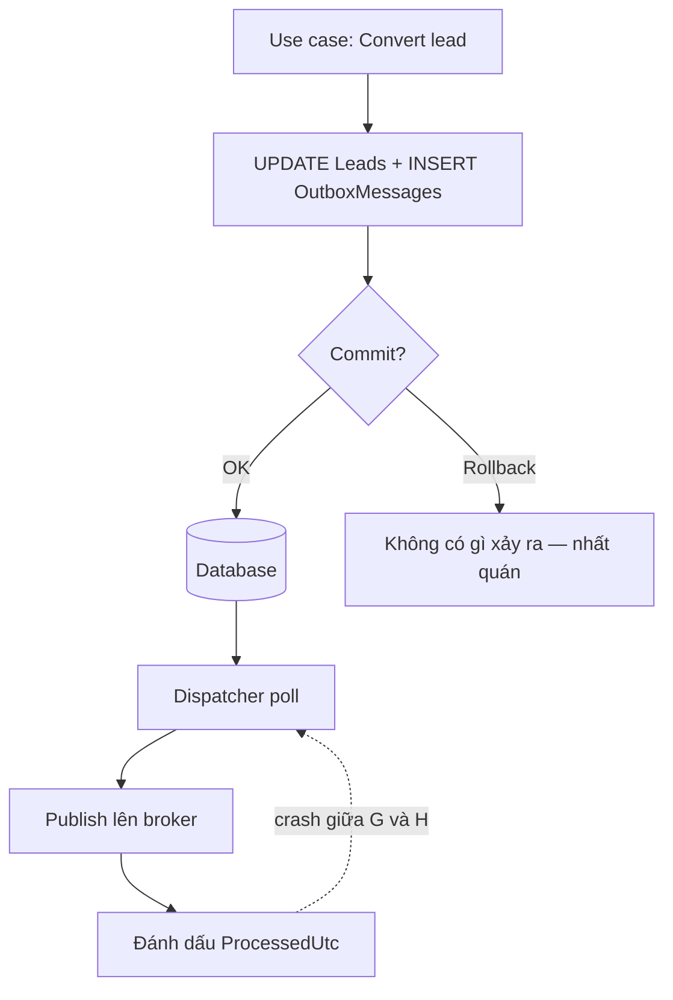

import { SummaryBox, Checklist, FAQSection } from '@site/src/components/SEO';

# 17.4 — 3. Outbox pattern (ứng dụng)

<SummaryBox>
Outbox giải dual write bằng một ý tưởng đơn giản: **đừng ghi vào hai nơi** — ghi message vào **chính database nghiệp vụ**, trong **chính transaction** đang chạy. Nếu transaction commit, message chắc chắn có; nếu rollback, message biến mất cùng thay đổi nghiệp vụ. Một worker đọc bảng đó và publish sau. Phải hiểu rõ giới hạn: outbox đảm bảo **không mất**, nó **không** loại bỏ trùng — worker có thể publish xong rồi chết trước khi đánh dấu, nên consumer vẫn cần idempotency ([bài 17.3](17.2-messaging-fears-lost-duplicates.mdx)). Hai chi tiết quyết định outbox chạy được trên production hay không, và cả hai đều hay bị bỏ qua: **dispatcher phải an toàn khi chạy nhiều instance** (dùng `SKIP LOCKED` hoặc `READPAST`), và **bảng phải được dọn**, nếu không nó sẽ thành bảng lớn nhất hệ thống.
</SummaryBox>

## Mục tiêu bài học

Sau bài này bạn có thể:

- Thiết kế bảng outbox với đủ cột cần cho vận hành.
- Ghi outbox tự động qua `SaveChangesAsync` interceptor.
- Viết dispatcher an toàn khi chạy nhiều instance.
- Xử lý thứ tự message khi nghiệp vụ yêu cầu.
- Quyết định tự viết hay dùng outbox của MassTransit.

## Nội dung bài học

### 17.4.1 — Ý tưởng và luồng



Đường đứt nét là điểm mấu chốt: nếu worker chết **sau** khi publish nhưng **trước** khi đánh dấu, message sẽ được publish lại. Outbox là **at-least-once**, đúng như broker.

### 17.4.2 — Bảng outbox

```sql
CREATE TABLE OutboxMessages (
    Id              UNIQUEIDENTIFIER NOT NULL PRIMARY KEY,
    OccurredOnUtc   DATETIME2        NOT NULL,
    Type            NVARCHAR(300)    NOT NULL,
    Payload         NVARCHAR(MAX)    NOT NULL,
    ProcessedOnUtc  DATETIME2        NULL,
    Error           NVARCHAR(MAX)    NULL,
    RetryCount      INT              NOT NULL DEFAULT 0,
    CorrelationId   UNIQUEIDENTIFIER NULL
);

-- Index lọc: chỉ chứa hàng CHƯA xử lý -> nhỏ và nhanh dù bảng có triệu hàng
CREATE NONCLUSTERED INDEX IX_Outbox_Unprocessed
    ON OutboxMessages (OccurredOnUtc)
    WHERE ProcessedOnUtc IS NULL;
```

Mệnh đề `WHERE ProcessedOnUtc IS NULL` là **filtered index**. Nó chỉ chứa hàng chưa xử lý, nên index vẫn nhỏ kể cả khi bảng có hàng triệu dòng ([bài 12.5](../../stage-04-database-production/module-12-sql-deep-dive/12.4-indexing.mdx)). Không có nó, mỗi lần poll là một lần quét bảng.

Ba cột hay bị bỏ qua nhưng cần khi có sự cố lúc 2 giờ sáng: `Error` để biết vì sao message kẹt, `RetryCount` để phát hiện message lặp vô hạn, `CorrelationId` để nối message với request gốc trong log.

### 17.4.3 — Ghi outbox tự động

Viết tay `_db.OutboxMessages.Add(...)` ở mỗi use case sẽ bị quên. Dùng interceptor để tự động chuyển domain event thành outbox message:

```csharp
public sealed class ConvertDomainEventsToOutboxInterceptor : SaveChangesInterceptor
{
    public override ValueTask<InterceptionResult<int>> SavingChangesAsync(
        DbContextEventData eventData, InterceptionResult<int> result, CancellationToken ct = default)
    {
        var context = eventData.Context;
        if (context is null) return base.SavingChangesAsync(eventData, result, ct);

        var outboxMessages = context.ChangeTracker
            .Entries<IHasDomainEvents>()
            .Select(e => e.Entity)
            .SelectMany(entity =>
            {
                var events = entity.DomainEvents.ToList();
                entity.ClearDomainEvents();
                return events;
            })
            .Select(domainEvent => new OutboxMessage
            {
                Id = Guid.NewGuid(),
                OccurredOnUtc = DateTime.UtcNow,
                Type = domainEvent.GetType().AssemblyQualifiedName!,
                Payload = JsonSerializer.Serialize(domainEvent, domainEvent.GetType())
            })
            .ToList();

        context.Set<OutboxMessage>().AddRange(outboxMessages);

        return base.SavingChangesAsync(eventData, result, ct);
    }
}
```

Vì interceptor chạy **trong** `SavingChangesAsync`, các hàng outbox nằm trong **cùng transaction** với thay đổi nghiệp vụ. Đó chính là điều outbox cần.

```csharp
builder.Services.AddDbContext<AppDbContext>((sp, options) =>
    options.UseSqlServer(cs)
           .AddInterceptors(sp.GetRequiredService<ConvertDomainEventsToOutboxInterceptor>()));
```

**Cảnh báo:** `ExecuteUpdate` và `ExecuteDelete` **không đi qua** `SaveChangesAsync`, nên không sinh outbox message ([bài 13.8](../../stage-04-database-production/module-13-entity-framework-core/13.7-performance.mdx)). Dùng chúng cho thao tác có ý nghĩa nghiệp vụ là mất event một cách im lặng.

### 17.4.4 — Dispatcher an toàn khi chạy nhiều instance

Đây là phần dễ sai nhất. Dispatcher ngây thơ:

```csharp
// SAI khi chạy 3 instance — cả ba cùng đọc một bộ message
var messages = await _db.OutboxMessages
    .Where(m => m.ProcessedOnUtc == null)
    .OrderBy(m => m.OccurredOnUtc)
    .Take(100)
    .ToListAsync(ct);
```

Ba instance cùng `SELECT` ra cùng 100 hàng và cùng publish → mỗi message đi **ba lần**. Sửa bằng cách khoá hàng ngay khi đọc:

```sql
-- SQL Server: READPAST bỏ qua hàng đang bị instance khác khoá
UPDATE TOP (100) OutboxMessages WITH (READPAST, UPDLOCK)
SET ProcessedOnUtc = SYSUTCDATETIME()
OUTPUT inserted.Id, inserted.Type, inserted.Payload
WHERE ProcessedOnUtc IS NULL;
```

```sql
-- PostgreSQL: SKIP LOCKED
UPDATE outbox_messages SET processed_on_utc = now()
WHERE id IN (
    SELECT id FROM outbox_messages
    WHERE processed_on_utc IS NULL
    ORDER BY occurred_on_utc
    LIMIT 100
    FOR UPDATE SKIP LOCKED
)
RETURNING id, type, payload;
```

Mỗi instance lấy được **một bộ message khác nhau**, và các instance không chờ nhau.

Lưu ý đánh đổi ở đây: đánh dấu `ProcessedOnUtc` **trước** khi publish nghĩa là nếu publish thất bại, message coi như đã xử lý và **mất**. Đánh dấu **sau** khi publish nghĩa là crash giữa chừng sẽ publish lại — **trùng**. Cùng một đánh đổi at-most-once và at-least-once ở [bài 17.3](17.2-messaging-fears-lost-duplicates.mdx). Chọn đánh dấu **sau**, và để consumer idempotent lo phần trùng.

```csharp
public sealed class OutboxDispatcher(IServiceScopeFactory scopeFactory, ILogger<OutboxDispatcher> logger)
    : BackgroundService
{
    protected override async Task ExecuteAsync(CancellationToken ct)
    {
        while (!ct.IsCancellationRequested)
        {
            try
            {
                await DispatchBatchAsync(ct);
            }
            catch (Exception ex)
            {
                logger.LogError(ex, "Outbox dispatcher loi, thu lai sau");
            }

            await Task.Delay(TimeSpan.FromSeconds(5), ct);
        }
    }
}
```

`try/catch` bao quanh toàn bộ vòng lặp là bắt buộc: một exception thoát ra khỏi `ExecuteAsync` sẽ **giết luôn** `BackgroundService` và nó không tự khởi động lại ([bài 14.9](../../stage-04-database-production/module-14-caching-background-jobs/14.8-message-bus-intro.mdx)).

### 17.4.5 — Thứ tự

Outbox không đảm bảo thứ tự khi có nhiều dispatcher. Nếu nghiệp vụ **thật sự** cần thứ tự trong phạm vi một aggregate:

```csharp
// Chi khoa theo aggregate -> cac aggregate khac nhau van chay song song
var batch = await _db.OutboxMessages
    .FromSqlRaw(@"
        SELECT TOP (100) * FROM OutboxMessages WITH (READPAST, UPDLOCK)
        WHERE ProcessedOnUtc IS NULL
        ORDER BY AggregateId, OccurredOnUtc")
    .ToListAsync(ct);

foreach (var group in batch.GroupBy(m => m.AggregateId))
    foreach (var message in group.OrderBy(m => m.OccurredOnUtc))
        await PublishAsync(message, ct);        // tuan tu trong nhom
```

Hỏi kỹ trước khi làm việc này: **có thật sự cần thứ tự không?** Thường thì không. Consumer kiểm tra trạng thái hiện tại thay vì giả định trạng thái trước đó sẽ đơn giản hơn nhiều so với đảm bảo thứ tự xuyên hệ thống.

### 17.4.6 — Dọn bảng

Bảng outbox tăng vô hạn nếu không dọn — một hệ thống vừa phải sinh vài triệu hàng mỗi tháng.

```sql
-- Xoá theo lô để không khoá bảng lâu
WHILE 1 = 1
BEGIN
    DELETE TOP (5000) FROM OutboxMessages
    WHERE ProcessedOnUtc IS NOT NULL
      AND ProcessedOnUtc < DATEADD(day, -7, SYSUTCDATETIME());

    IF @@ROWCOUNT < 5000 BREAK;
END
```

Giữ 7 ngày là đủ để điều tra sự cố. `DELETE` một phát vài triệu hàng sẽ leo thang khoá lên toàn bảng và chặn mọi insert ([bài 12.7](../../stage-04-database-production/module-12-sql-deep-dive/12.6-transactions-and-locking.mdx)).

### 17.4.7 — Tự viết hay dùng framework

MassTransit đã có [transactional outbox](https://masstransit.io/documentation/patterns/transactional-outbox) tích hợp EF Core:

```csharp
builder.Services.AddMassTransit(x =>
{
    x.AddEntityFrameworkOutbox<AppDbContext>(o =>
    {
        o.QueryDelay = TimeSpan.FromSeconds(5);
        o.UseSqlServer();
        o.UseBusOutbox();
    });
});
```

| | Tự viết | MassTransit |
|---|---|---|
| Kiểm soát | Toàn bộ | Theo khuôn khổ framework |
| Thời gian | Vài ngày kể cả test | Vài dòng cấu hình |
| Đã xử lý nhiều instance | Bạn phải tự lo | Có sẵn |
| Dọn bảng | Tự viết | Có sẵn |
| Hiểu cơ chế | Sâu | Dễ dùng như hộp đen |

Khuyến nghị: **tự viết một lần để hiểu**, rồi dùng framework trên production nếu bạn đã dùng MassTransit. Dùng framework mà không hiểu outbox làm gì sẽ khiến bạn bất lực khi nó kẹt.

### 17.4.8 — Rà lại code của bạn

<Checklist
  title="Danh sách rà soát outbox"
  items={[
    { text: "Hàng outbox được ghi trong cùng transaction với thay đổi nghiệp vụ." },
    { text: "Có filtered index trên điều kiện ProcessedOnUtc IS NULL." },
    { text: "Dispatcher dùng READPAST hoặc SKIP LOCKED để chạy được nhiều instance." },
    { text: "Đánh dấu đã xử lý sau khi publish, và consumer idempotent." },
    { text: "Vòng lặp BackgroundService có try catch bao ngoài để không chết im lặng." },
    { text: "Bảng outbox có job dọn, xoá theo lô." },
    { text: "Bảng có cột Error, RetryCount, CorrelationId để chẩn đoán." },
    { text: "Đã kiểm tra ExecuteUpdate và ExecuteDelete không bỏ qua việc sinh event." },
    { text: "Có cảnh báo khi số message chưa xử lý vượt ngưỡng." },
  ]}
/>

## Bài tập áp dụng

1. **Chứng minh outbox không mất tin.** Ghi outbox trong cùng transaction, chèn `Environment.FailFast` ngay sau `SaveChangesAsync`. Khởi động lại và xác nhận dispatcher vẫn publish được message.

2. **Tái hiện publish trùng do nhiều instance.** Chạy hai dispatcher không dùng `READPAST` trên cùng database, đếm số lần mỗi message được publish. Thêm `READPAST` và đo lại.

3. **Đo tác dụng của filtered index.** Tạo một triệu hàng đã xử lý, chạy truy vấn poll, xem execution plan trước và sau khi thêm filtered index.

## Tự kiểm tra

<FAQSection
  items={[
    {
      question: "Outbox giải quyết dual write bằng cách nào?",
      answer: "Bằng cách không ghi vào hai nơi. Message được ghi vào chính database nghiệp vụ trong chính transaction đang chạy, nên nếu commit thì message chắc chắn có, nếu rollback thì nó biến mất cùng thay đổi nghiệp vụ. Một worker riêng đọc bảng đó và publish sau."
    },
    {
      question: "Outbox có loại bỏ message trùng không?",
      answer: "Không. Worker có thể publish xong rồi chết trước khi đánh dấu đã xử lý, nên message sẽ được publish lại. Outbox đảm bảo không mất chứ không đảm bảo không trùng, và consumer vẫn cần idempotency."
    },
    {
      question: "Vì sao dispatcher cần READPAST hoặc SKIP LOCKED?",
      answer: "Vì khi chạy nhiều instance, một truy vấn SELECT thông thường sẽ trả cùng một bộ message cho mọi instance, nên mỗi message bị publish nhiều lần. Hai cơ chế đó cho mỗi instance lấy một bộ khác nhau và không chờ nhau."
    },
    {
      question: "Nên đánh dấu đã xử lý trước hay sau khi publish?",
      answer: "Sau khi publish. Đánh dấu trước thì nếu publish thất bại, message coi như đã xử lý và mất luôn. Đánh dấu sau thì crash giữa chừng chỉ gây trùng, và trùng đã được consumer idempotent xử lý."
    },
    {
      question: "Vì sao filtered index quan trọng với bảng outbox?",
      answer: "Vì index chỉ chứa hàng chưa xử lý nên nó vẫn nhỏ và nhanh kể cả khi bảng có hàng triệu dòng đã xử lý. Không có nó, mỗi lần poll là một lần quét bảng lớn."
    },
    {
      question: "ExecuteUpdate có ảnh hưởng gì tới outbox?",
      answer: "Có. ExecuteUpdate và ExecuteDelete không đi qua SaveChangesAsync nên interceptor không chạy và không sinh outbox message. Dùng chúng cho thao tác có ý nghĩa nghiệp vụ là mất event một cách im lặng."
    }
  ]}
/>

## Kết luận

Ba điều đáng nhớ nhất:

1. **Một transaction, một database.** Đó là toàn bộ ý tưởng của outbox.
2. **Dispatcher phải khoá hàng khi đọc**, nếu không nhiều instance sẽ publish trùng.
3. **Bảng outbox phải được dọn**, và filtered index là thứ giữ cho nó nhanh.

## Tham khảo

- [Transactional Outbox pattern](https://microservices.io/patterns/data/transactional-outbox.html)
- [MassTransit transactional outbox](https://masstransit.io/documentation/patterns/transactional-outbox)
- [NServiceBus Outbox](https://docs.particular.net/nservicebus/outbox/)
- [Integration events in .NET microservices](https://learn.microsoft.com/en-us/dotnet/architecture/microservices/multi-container-microservice-net-applications/integration-event-based-microservice-communications)

## Điều hướng

- **Bài trước:** [17.2 — 2. Hai nỗi sợ cốt lõi: mất tin & gửi trùng](17.2-messaging-fears-lost-duplicates.mdx)
- **Bài tiếp theo:** [17.4 — 4. So sánh Kafka và RabbitMQ (thực dụng)](17.4-kafka-vs-rabbitmq-pragmatic.mdx)
- **Về module:** [Trang mục lục](./)

## Bài liên quan

- [Unit of Work trong .NET và ABP: SaveChangesAsync không phải commit](/blog/unit-of-work-dotnet-abp) — DbContext của EF Core bản thân nó đã là một Unit of Work, nên bọc thêm một interface IUnitOfWork gọi SaveChanges thường chỉ thêm lớp trung gian vô…
