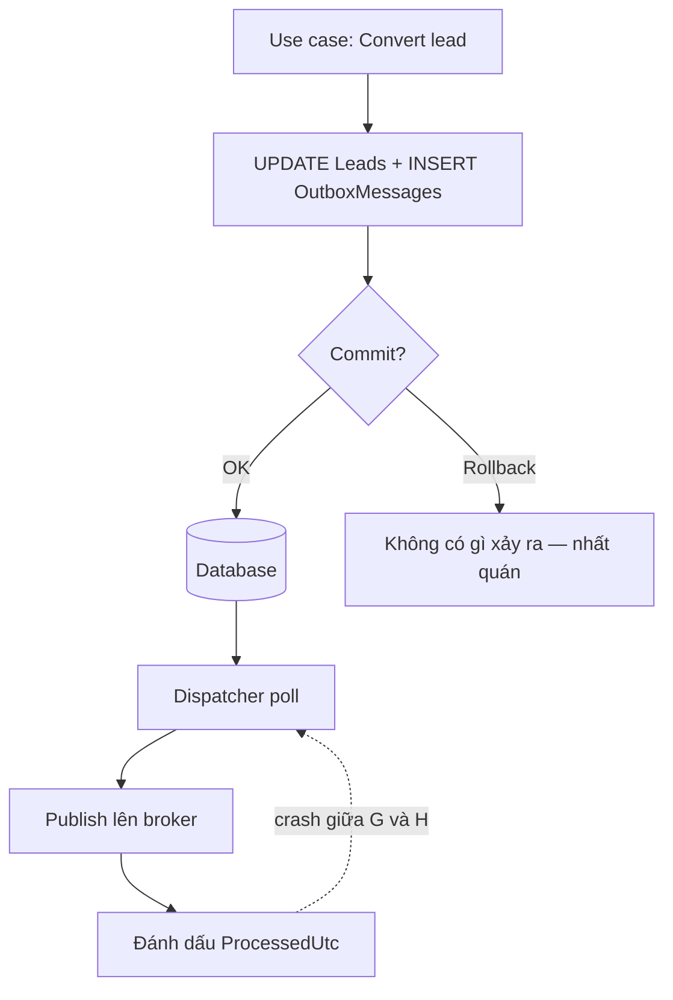

import { SummaryBox, Checklist, FAQSection } from '@site/src/components/SEO';

# 17.4 — 3. Outbox pattern (ứng dụng)

<SummaryBox>
Outbox giải dual write bằng một ý tưởng đơn giản: **đừng ghi vào hai nơi** — ghi message vào **chính database nghiệp vụ**, trong **chính transaction** đang chạy. Nếu transaction commit, message chắc chắn có; nếu rollback, message biến mất cùng thay đổi nghiệp vụ. Một worker đọc bảng đó và publish sau. Phải hiểu rõ giới hạn: outbox đảm bảo **không mất**, nó **không** loại bỏ trùng — worker có thể publish xong rồi chết trước khi đánh dấu, nên consumer vẫn cần idempotency ([bài 17.2](17.2-messaging-fears-lost-duplicates.mdx)). Hai chi tiết quyết định outbox chạy được trên production hay không, và cả hai đều hay bị bỏ qua: **dispatcher phải an toàn khi chạy nhiều instance** (dùng `SKIP LOCKED` hoặc `READPAST`), và **bảng phải được dọn**, nếu không nó sẽ thành bảng lớn nhất hệ thống.
</SummaryBox>

## Mục tiêu bài học

Sau bài này bạn có thể:

- Thiết kế bảng outbox với đủ cột cần cho vận hành.
- Ghi outbox tự động qua `SaveChangesAsync` interceptor.
- Viết dispatcher an toàn khi chạy nhiều instance.
- Xử lý thứ tự message khi nghiệp vụ yêu cầu.
- Quyết định tự viết hay dùng outbox của MassTransit.

## Nội dung bài học

### 17.4.1 — Ý tưởng và luồng



Đường đứt nét là điểm mấu chốt: nếu worker chết **sau** khi publish nhưng **trước** khi đánh dấu, message sẽ được publish lại. Outbox là **at-least-once**, đúng như broker.

### 17.4.2 — Bảng outbox

```sql
CREATE TABLE OutboxMessages (
    Id              UNIQUEIDENTIFIER NOT NULL PRIMARY KEY,
    OccurredOnUtc   DATETIME2        NOT NULL,
    Type            NVARCHAR(300)    NOT NULL,
    Payload         NVARCHAR(MAX)    NOT NULL,
    ProcessedOnUtc  DATETIME2        NULL,
    Error           NVARCHAR(MAX)    NULL,
    RetryCount      INT              NOT NULL DEFAULT 0,
    CorrelationId   UNIQUEIDENTIFIER NULL
);

-- Index lọc: chỉ chứa hàng CHƯA xử lý -> nhỏ và nhanh dù bảng có triệu hàng
CREATE NONCLUSTERED INDEX IX_Outbox_Unprocessed
    ON OutboxMessages (OccurredOnUtc)
    WHERE ProcessedOnUtc IS NULL;
```

Mệnh đề `WHERE ProcessedOnUtc IS NULL` là **filtered index**. Nó chỉ chứa hàng chưa xử lý, nên index vẫn nhỏ kể cả khi bảng có hàng triệu dòng ([bài 12.5](../../stage-04-database-production/module-12-sql-deep-dive/12.4-indexing.mdx)). Không có nó, mỗi lần poll là một lần quét bảng.

Ba cột hay bị bỏ qua nhưng cần khi có sự cố lúc 2 giờ sáng: `Error` để biết vì sao message kẹt, `RetryCount` để phát hiện message lặp vô hạn, `CorrelationId` để nối message với request gốc trong log.

### 17.4.3 — Ghi outbox tự động

Viết tay `_db.OutboxMessages.Add(...)` ở mỗi use case sẽ bị quên. Dùng interceptor để tự động chuyển domain event thành outbox message:

```csharp
public sealed class ConvertDomainEventsToOutboxInterceptor : SaveChangesInterceptor
{
    public override ValueTask<InterceptionResult<int>> SavingChangesAsync(
        DbContextEventData eventData, InterceptionResult<int> result, CancellationToken ct = default)
    {
        var context = eventData.Context;
        if (context is null) return base.SavingChangesAsync(eventData, result, ct);

        var outboxMessages = context.ChangeTracker
            .Entries<IHasDomainEvents>()
            .Select(e => e.Entity)
            .SelectMany(entity =>
            {
                var events = entity.DomainEvents.ToList();
                entity.ClearDomainEvents();
                return events;
            })
            .Select(domainEvent => new OutboxMessage
            {
                Id = Guid.NewGuid(),
                OccurredOnUtc = DateTime.UtcNow,
                Type = domainEvent.GetType().AssemblyQualifiedName!,
                Payload = JsonSerializer.Serialize(domainEvent, domainEvent.GetType())
            })
            .ToList();

        context.Set<OutboxMessage>().AddRange(outboxMessages);

        return base.SavingChangesAsync(eventData, result, ct);
    }
}
```

Vì interceptor chạy **trong** `SavingChangesAsync`, các hàng outbox nằm trong **cùng transaction** với thay đổi nghiệp vụ. Đó chính là điều outbox cần.

```csharp
builder.Services.AddDbContext<AppDbContext>((sp, options) =>
    options.UseSqlServer(cs)
           .AddInterceptors(sp.GetRequiredService<ConvertDomainEventsToOutboxInterceptor>()));
```

**Cảnh báo:** `ExecuteUpdate` và `ExecuteDelete` **không đi qua** `SaveChangesAsync`, nên không sinh outbox message ([bài 13.8](../../stage-04-database-production/module-13-entity-framework-core/13.7-performance.mdx)). Dùng chúng cho thao tác có ý nghĩa nghiệp vụ là mất event một cách im lặng.

### 17.4.4 — Dispatcher an toàn khi chạy nhiều instance

Đây là phần dễ sai nhất. Dispatcher ngây thơ:

```csharp
// SAI khi chạy 3 instance — cả ba cùng đọc một bộ message
var messages = await _db.OutboxMessages
    .Where(m => m.ProcessedOnUtc == null)
    .OrderBy(m => m.OccurredOnUtc)
    .Take(100)
    .ToListAsync(ct);
```

Ba instance cùng `SELECT` ra cùng 100 hàng và cùng publish → mỗi message đi **ba lần**. Sửa bằng cách khoá hàng ngay khi đọc:

```sql
-- SQL Server: READPAST bỏ qua hàng đang bị instance khác khoá
UPDATE TOP (100) OutboxMessages WITH (READPAST, UPDLOCK)
SET ProcessedOnUtc = SYSUTCDATETIME()
OUTPUT inserted.Id, inserted.Type, inserted.Payload
WHERE ProcessedOnUtc IS NULL;
```

```sql
-- PostgreSQL: SKIP LOCKED
UPDATE outbox_messages SET processed_on_utc = now()
WHERE id IN (
    SELECT id FROM outbox_messages
    WHERE processed_on_utc IS NULL
    ORDER BY occurred_on_utc
    LIMIT 100
    FOR UPDATE SKIP LOCKED
)
RETURNING id, type, payload;
```

Mỗi instance lấy được **một bộ message khác nhau**, và các instance không chờ nhau.

Lưu ý đánh đổi ở đây: đánh dấu `ProcessedOnUtc` **trước** khi publish nghĩa là nếu publish thất bại, message coi như đã xử lý và **mất**. Đánh dấu **sau** khi publish nghĩa là crash giữa chừng sẽ publish lại — **trùng**. Cùng một đánh đổi at-most-once và at-least-once ở [bài 17.2](17.2-messaging-fears-lost-duplicates.mdx). Chọn đánh dấu **sau**, và để consumer idempotent lo phần trùng.

```csharp
public sealed class OutboxDispatcher(IServiceScopeFactory scopeFactory, ILogger<OutboxDispatcher> logger)
    : BackgroundService
{
    protected override async Task ExecuteAsync(CancellationToken ct)
    {
        while (!ct.IsCancellationRequested)
        {
            try
            {
                await DispatchBatchAsync(ct);
            }
            catch (Exception ex)
            {
                logger.LogError(ex, "Outbox dispatcher loi, thu lai sau");
            }

            await Task.Delay(TimeSpan.FromSeconds(5), ct);
        }
    }
}
```

`try/catch` bao quanh toàn bộ vòng lặp là bắt buộc: một exception thoát ra khỏi `ExecuteAsync` sẽ **giết luôn** `BackgroundService` và nó không tự khởi động lại ([bài 14.9](../../stage-04-database-production/module-14-caching-background-jobs/14.8-message-bus-intro.mdx)).

### 17.4.5 — Thứ tự

Outbox không đảm bảo thứ tự khi có nhiều dispatcher. Nếu nghiệp vụ **thật sự** cần thứ tự trong phạm vi một aggregate:

```csharp
// Chi khoa theo aggregate -> cac aggregate khac nhau van chay song song
var batch = await _db.OutboxMessages
    .FromSqlRaw(@"
        SELECT TOP (100) * FROM OutboxMessages WITH (READPAST, UPDLOCK)
        WHERE ProcessedOnUtc IS NULL
        ORDER BY AggregateId, OccurredOnUtc")
    .ToListAsync(ct);

foreach (var group in batch.GroupBy(m => m.AggregateId))
    foreach (var message in group.OrderBy(m => m.OccurredOnUtc))
        await PublishAsync(message, ct);        // tuan tu trong nhom
```

Hỏi kỹ trước khi làm việc này: **có thật sự cần thứ tự không?** Thường thì không. Consumer kiểm tra trạng thái hiện tại thay vì giả định trạng thái trước đó sẽ đơn giản hơn nhiều so với đảm bảo thứ tự xuyên hệ thống.

### 17.4.6 — Dọn bảng

Bảng outbox tăng vô hạn nếu không dọn — một hệ thống vừa phải sinh vài triệu hàng mỗi tháng.

```sql
-- Xoá theo lô để không khoá bảng lâu
WHILE 1 = 1
BEGIN
    DELETE TOP (5000) FROM OutboxMessages
    WHERE ProcessedOnUtc IS NOT NULL
      AND ProcessedOnUtc < DATEADD(day, -7, SYSUTCDATETIME());

    IF @@ROWCOUNT < 5000 BREAK;
END
```

Giữ 7 ngày là đủ để điều tra sự cố. `DELETE` một phát vài triệu hàng sẽ leo thang khoá lên toàn bảng và chặn mọi insert ([bài 12.7](../../stage-04-database-production/module-12-sql-deep-dive/12.6-transactions-and-locking.mdx)).

### 17.4.7 — Tự viết hay dùng framework

MassTransit đã có [transactional outbox](https://masstransit.io/documentation/patterns/transactional-outbox) tích hợp EF Core:

```csharp
builder.Services.AddMassTransit(x =>
{
    x.AddEntityFrameworkOutbox<AppDbContext>(o =>
    {
        o.QueryDelay = TimeSpan.FromSeconds(5);
        o.UseSqlServer();
        o.UseBusOutbox();
    });
});
```

| | Tự viết | MassTransit |
|---|---|---|
| Kiểm soát | Toàn bộ | Theo khuôn khổ framework |
| Thời gian | Vài ngày kể cả test | Vài dòng cấu hình |
| Đã xử lý nhiều instance | Bạn phải tự lo | Có sẵn |
| Dọn bảng | Tự viết | Có sẵn |
| Hiểu cơ chế | Sâu | Dễ dùng như hộp đen |

Khuyến nghị: **tự viết một lần để hiểu**, rồi dùng framework trên production nếu bạn đã dùng MassTransit. Dùng framework mà không hiểu outbox làm gì sẽ khiến bạn bất lực khi nó kẹt.

### 17.4.8 — Rà lại code của bạn

<Checklist
  title="Danh sách rà soát outbox"
  items={[
    { text: "Hàng outbox được ghi trong cùng transaction với thay đổi nghiệp vụ." },
    { text: "Có filtered index trên điều kiện ProcessedOnUtc IS NULL." },
    { text: "Dispatcher dùng READPAST hoặc SKIP LOCKED để chạy được nhiều instance." },
    { text: "Đánh dấu đã xử lý sau khi publish, và consumer idempotent." },
    { text: "Vòng lặp BackgroundService có try catch bao ngoài để không chết im lặng." },
    { text: "Bảng outbox có job dọn, xoá theo lô." },
    { text: "Bảng có cột Error, RetryCount, CorrelationId để chẩn đoán." },
    { text: "Đã kiểm tra ExecuteUpdate và ExecuteDelete không bỏ qua việc sinh event." },
    { text: "Có cảnh báo khi số message chưa xử lý vượt ngưỡng." },
  ]}
/>

## Bài tập áp dụng

#### Bài 1 — Chứng minh outbox không mất tin

Ghi outbox trong cùng transaction, chèn `Environment.FailFast` ngay sau `SaveChangesAsync`. Khởi động lại và xác nhận dispatcher vẫn publish được message.

**Tiêu chí hoàn thành:** bạn chỉ ra được **chính xác** chỗ mà khoảnh khắc "chết giữa chừng" chuyển sang, và vì sao chỗ mới vô hại.

<details>
<summary><strong>Gợi ý và lời giải — Bài 1</strong></summary>

**Gợi ý.** Outbox không loại bỏ khoảnh khắc nguy hiểm. Nó di chuyển khoảnh khắc đó.

**Lời giải — cài đặt:**

```csharp
public class TinNhanOutbox
{
    public Guid      Id           { get; private set; }
    public string    LoaiMessage  { get; private set; } = null!;
    public string    NoiDung      { get; private set; } = null!;
    public DateTime  TaoLuc       { get; private set; }
    public DateTime? GuiLuc       { get; private set; }
    public int       SoLanThu     { get; private set; }
    public string?   LoiGanNhat   { get; private set; }

    private TinNhanOutbox() { }

    public static TinNhanOutbox Tao<T>(T message) where T : class => new()
    {
        Id          = Guid.CreateVersion7(),
        LoaiMessage = typeof(T).AssemblyQualifiedName!,
        NoiDung     = JsonSerializer.Serialize(message),
        TaoLuc      = DateTime.UtcNow,
    };

    public void DanhDauDaGui(DateTime bayGio) => GuiLuc = bayGio;
    public void GhiNhanLoi(string loi) { SoLanThu++; LoiGanNhat = loi; }
}
```

```csharp
public async Task<Result> ChotLeadAsync(LeadId id, CancellationToken ct)
{
    var lead = await _db.Leads.FirstAsync(l => l.Id == id, ct);
    var kq = lead.ChuyenSangWon(_user.ToNguoiDung(), _clock.GetUtcNow().UtcDateTime);
    if (!kq.ThanhCong) return kq;

    _db.Outbox.Add(TinNhanOutbox.Tao(new LeadDaChotV1(
        EventId: Guid.CreateVersion7(), LeadId: lead.Id.Value, GiaTri: lead.Value.Amount)));

    await _db.SaveChangesAsync(ct);                    // MỘT điểm commit

    Environment.FailFast("Mô phỏng tiến trình chết");

    return Result.ThanhCong();
}
```

```bash
curl -X POST http://localhost:8080/leads/abc-123/chot     # tiến trình chết
```

```sql
SELECT Id, Status FROM Leads WHERE Id = 'abc-123';
SELECT Id, LoaiMessage, GuiLuc, SoLanThu FROM Outbox WHERE GuiLuc IS NULL;
```

```text
abc-123    Won

Id                LoaiMessage       GuiLuc   SoLanThu
0192f8a3-...      LeadDaChotV1      NULL     0
```

**Lead đã chốt VÀ message đã được ghi** — cả hai trong cùng một transaction, nên chúng cùng tồn tại hoặc cùng không.

```bash
dotnet run --project src/Crm.Worker
```

```text
[OutboxDispatcher] Tìm thấy 1 message chưa gửi
[OutboxDispatcher] Đã publish LeadDaChotV1 0192f8a3-...
```

```bash
rabbitmqctl list_queues name messages
```

```text
erp-tao-don-hang    1
```

**Khoảnh khắc nguy hiểm chuyển sang đâu:**

```text
TRƯỚC (không outbox):
    [ghi database] ---- KHOẢNH KHẮC NGUY HIỂM ---- [publish]
    chết ở đây -> MẤT MESSAGE, không phục hồi được

SAU (có outbox):
    [ghi database + outbox trong một transaction]
                   ↓
    [dispatcher: publish] ---- KHOẢNH KHẮC NGUY HIỂM ---- [đánh dấu GuiLuc]
    chết ở đây -> message được publish LẠI -> TRÙNG LẶP
```

**Vì sao chỗ mới vô hại:**

```text
Mất message:  không phục hồi được bằng bất cứ cách nào
              hệ quả nghiệp vụ không bao giờ xảy ra
              không ai biết

Trùng message: xử lý được bằng consumer idempotent (bài 17.2)
               consumer thứ hai thấy đã xử lý rồi và bỏ qua
               phát hiện được, đo được
```

Outbox **không loại bỏ** vấn đề hai tướng quân — nó chuyển hậu quả từ dạng không xử lý được sang dạng xử lý được.

```text
Bảo đảm:           AT-LEAST-ONCE
Nghĩa vụ kèm theo: consumer PHẢI idempotent
```

**Dispatcher:**

```csharp
public class OutboxDispatcher(IServiceScopeFactory scopeFactory,
                              ILogger<OutboxDispatcher> logger) : BackgroundService
{
    protected override async Task ExecuteAsync(CancellationToken ct)
    {
        using var timer = new PeriodicTimer(TimeSpan.FromSeconds(1));
        while (await timer.WaitForNextTickAsync(ct))
        {
            try { await XuLyMotVongAsync(ct); }
            catch (Exception ex) { logger.LogError(ex, "Lỗi trong vòng dispatch"); }
        }
    }

    private async Task XuLyMotVongAsync(CancellationToken ct)
    {
        await using var scope = scopeFactory.CreateAsyncScope();
        var db  = scope.ServiceProvider.GetRequiredService<CrmDbContext>();
        var bus = scope.ServiceProvider.GetRequiredService<IPublishEndpoint>();

        await using var tx = await db.Database.BeginTransactionAsync(ct);

        var chuaGui = await db.Outbox
            .FromSql($@"
                SELECT TOP (100) * FROM Outbox WITH (UPDLOCK, READPAST)
                WHERE GuiLuc IS NULL AND SoLanThu < 10
                ORDER BY TaoLuc")
            .ToListAsync(ct);

        foreach (var m in chuaGui)
        {
            try
            {
                var kieu = Type.GetType(m.LoaiMessage)!;
                var msg  = JsonSerializer.Deserialize(m.NoiDung, kieu)!;
                await bus.Publish(msg, kieu, ct);
                m.DanhDauDaGui(DateTime.UtcNow);
            }
            catch (Exception ex)
            {
                m.GhiNhanLoi(ex.Message);
                logger.LogWarning(ex, "Không publish được {Id}, lần {Lan}", m.Id, m.SoLanThu);
            }
        }

        await db.SaveChangesAsync(ct);
        await tx.CommitAsync(ct);
    }
}
```

**Ba chi tiết trong dispatcher:**

1. **`UPDLOCK, READPAST`** — cho phép nhiều instance chạy song song, chi tiết ở bài 2.
2. **`SoLanThu < 10`** — message hỏng vĩnh viễn (kiểu không deserialize được) không chặn hàng đợi mãi.
3. **`try`/`catch` trong vòng lặp, không quanh cả vòng** — một message hỏng không làm 99 message còn lại bị bỏ qua.

**Và một chi tiết ít người để ý: `PeriodicTimer` 1 giây nghĩa là độ trễ trung bình 500 ms.** Với luồng cần nhanh hơn, kết hợp poll với đánh thức trực tiếp:

```csharp
// Sau khi SaveChanges thành công, đánh thức dispatcher
_outboxSignal.Set();
```

```csharp
// Trong dispatcher — chờ tín hiệu hoặc hết chu kỳ, cái nào đến trước
await Task.WhenAny(_outboxSignal.WaitAsync(ct), timer.WaitForNextTickAsync(ct).AsTask());
```

Poll vẫn phải giữ làm lưới an toàn: tín hiệu chỉ hoạt động trong cùng tiến trình, và một instance khác ghi outbox thì instance này không nhận được tín hiệu.

</details>

---

#### Bài 2 — Publish trùng do nhiều instance

Chạy hai dispatcher không dùng `READPAST` trên cùng database, đếm số lần mỗi message được publish. Thêm `READPAST` và đo lại.

**Tiêu chí hoàn thành:** bạn giải thích được `UPDLOCK` và `READPAST` làm gì, và nêu được phương án thay thế trên PostgreSQL.

<details>
<summary><strong>Gợi ý và lời giải — Bài 2</strong></summary>

**Gợi ý.** Hai dispatcher cùng chạy `SELECT TOP 100 WHERE GuiLuc IS NULL`. Chúng lấy được gì?

**Lời giải — không có hint:**

```csharp
var chuaGui = await db.Outbox
    .Where(m => m.GuiLuc == null && m.SoLanThu < 10)
    .OrderBy(m => m.TaoLuc)
    .Take(100)
    .ToListAsync(ct);
```

```bash
dotnet run --project src/Crm.Worker &
dotnet run --project src/Crm.Worker &
# Ghi 1.000 message vào outbox
```

```bash
rabbitmqctl list_queues name messages
```

```text
erp-tao-don-hang    1847
```

**1.847 message cho 1.000 bản ghi outbox.** Phần lớn được publish hai lần.

```text
t=0,000  Dispatcher A: SELECT -> lấy message 1..100
t=0,003  Dispatcher B: SELECT -> lấy message 1..100  (CÙNG tập)
t=0,010  A publish 1..100
t=0,014  B publish 1..100        <- trùng
t=0,050  A: UPDATE GuiLuc, COMMIT
t=0,055  B: UPDATE GuiLuc, COMMIT
```

**Với `UPDLOCK, READPAST`:**

```csharp
var chuaGui = await db.Outbox
    .FromSql($@"
        SELECT TOP (100) * FROM Outbox WITH (UPDLOCK, READPAST)
        WHERE GuiLuc IS NULL AND SoLanThu < 10
        ORDER BY TaoLuc")
    .ToListAsync(ct);
```

```text
erp-tao-don-hang    1000
```

Đúng 1.000. Không trùng.

**`UPDLOCK` và `READPAST` làm gì:**

**`UPDLOCK`** — lấy khoá update thay vì khoá đọc chia sẻ:

```text
Khoá S (mặc định):  nhiều giao dịch cùng đọc được
                    -> A và B cùng SELECT được cùng dòng

Khoá U (UPDLOCK):   chỉ MỘT giao dịch giữ được trên một dòng
                    -> B không đọc được dòng A đang giữ
```

Khoá được giữ tới khi transaction kết thúc, nên các dòng A đã lấy không ai đụng được cho tới khi A commit.

**`READPAST`** — bỏ qua dòng đang bị khoá thay vì chờ:

```text
Không có READPAST:  B thấy dòng 1..100 bị khoá -> CHỜ tới khi A commit
                    -> hai dispatcher chạy TUẦN TỰ, không nhanh hơn một cái

Có READPAST:        B BỎ QUA dòng 1..100 -> lấy 101..200
                    -> hai dispatcher chạy SONG SONG, thông lượng gấp đôi
```

**Hai hint kết hợp cho đúng thứ cần: mỗi dòng được xử lý bởi đúng một dispatcher, và các dispatcher không chặn nhau.**

```text
UPDLOCK một mình:            không trùng, nhưng tuần tự (chậm)
READPAST một mình:           vẫn trùng, vì khoá S không loại trừ
UPDLOCK + READPAST:          không trùng, song song
```

**Trên PostgreSQL — `FOR UPDATE SKIP LOCKED`:**

```csharp
var chuaGui = await db.Outbox
    .FromSql($@"
        SELECT * FROM outbox
        WHERE gui_luc IS NULL AND so_lan_thu < 10
        ORDER BY tao_luc
        LIMIT 100
        FOR UPDATE SKIP LOCKED")
    .ToListAsync(ct);
```

`FOR UPDATE` tương đương `UPDLOCK`; `SKIP LOCKED` tương đương `READPAST`. Cú pháp này cũng có trong MySQL 8.0+ và Oracle.

**Hỗ trợ cả hai provider:**

```csharp
private IQueryable<TinNhanOutbox> LayMessageChuaGui(CrmDbContext db, int soLuong)
    => db.Database.IsNpgsql()
        ? db.Outbox.FromSql($@"
              SELECT * FROM outbox WHERE gui_luc IS NULL AND so_lan_thu < 10
              ORDER BY tao_luc LIMIT {soLuong} FOR UPDATE SKIP LOCKED")
        : db.Outbox.FromSql($@"
              SELECT TOP ({soLuong}) * FROM Outbox WITH (UPDLOCK, READPAST)
              WHERE GuiLuc IS NULL AND SoLanThu < 10 ORDER BY TaoLuc");
```

**Ba phương án thay thế, và vì sao chúng kém hơn:**

**1. Chỉ chạy MỘT dispatcher.**

```yaml
apiVersion: apps/v1
kind: Deployment
metadata: { name: crm-outbox-dispatcher }
spec:
  replicas: 1
  strategy: { type: Recreate }
```

Đơn giản, nhưng ba nhược điểm: không scale được khi lượng message tăng, một điểm lỗi duy nhất, và trong lúc rolling update vẫn có thể có hai pod cùng sống ([bài 14.11](../../stage-04-database-production/module-14-caching-background-jobs/14.11-mini-case-study.mdx)) — nên bạn vẫn cần `READPAST`.

**2. Khoá phân tán qua Redis.**

```csharp
await using var khoa = await _redLock.CreateLockAsync("outbox-dispatcher", TimeSpan.FromMinutes(1));
if (!khoa.IsAcquired) return;
```

Thêm một phụ thuộc, và có thể thất bại theo những cách khó lường — khoá hết hạn giữa chừng, Redis failover ([bài 14.11](../../stage-04-database-production/module-14-caching-background-jobs/14.11-mini-case-study.mdx)). `READPAST` không có vấn đề nào trong số đó, vì nó dùng chính database bạn đã có.

**3. Chia theo hash.**

```csharp
var chiSo = int.Parse(Environment.GetEnvironmentVariable("INSTANCE_INDEX")!);
var tong  = int.Parse(Environment.GetEnvironmentVariable("INSTANCE_COUNT")!);

var chuaGui = await db.Outbox
    .Where(m => m.GuiLuc == null && m.Id.GetHashCode() % tong == chiSo)
    .ToListAsync(ct);
```

Hoạt động, nhưng cứng nhắc: đổi số instance phải cấu hình lại, và một instance chết nghĩa là phần của nó **không ai xử lý** cho tới khi nó quay lại.

**`UPDLOCK, READPAST` tốt hơn cả ba** vì nó không thêm phụ thuộc, tự động cân bằng khi số instance đổi, và một instance chết thì các instance khác tiếp quản ngay (khoá được nhả khi kết nối đóng).

**Kiểm chứng bằng test:**

```csharp
[Fact]
public async Task Hai_dispatcher_khong_publish_trung()
{
    await TaoMessageOutboxAsync(soLuong: 1000);

    var bus = new FakePublishEndpoint();
    await Task.WhenAll(
        ChayDispatcherAsync(bus, TimeSpan.FromSeconds(5)),
        ChayDispatcherAsync(bus, TimeSpan.FromSeconds(5)));

    bus.DaPublish.Should().HaveCount(1000);
    bus.DaPublish.Select(m => m.Id).Should().OnlyHaveUniqueItems();
}
```

Test này cần **database thật** — SQLite và provider in-memory không hỗ trợ `UPDLOCK`/`READPAST`, nên chúng sẽ cho test xanh ngay cả với bản có lỗi. Dùng Testcontainers với SQL Server hoặc PostgreSQL.

**Và một chỉ số nên theo dõi:**

```csharp
_meter.CreateObservableGauge("outbox.pending", () =>
    _db.Outbox.Count(m => m.GuiLuc == null));

_meter.CreateObservableGauge("outbox.oldest_pending_seconds", () =>
{
    var somNhat = _db.Outbox.Where(m => m.GuiLuc == null).Min(m => (DateTime?)m.TaoLuc);
    return somNhat is null ? 0 : (DateTime.UtcNow - somNhat.Value).TotalSeconds;
});
```

Chỉ số thứ hai quan trọng hơn: số message chờ có thể nhỏ mà vẫn có một message kẹt từ ba ngày trước vì `SoLanThu` đã chạm trần.

</details>

---

#### Bài 3 — Đo tác dụng của filtered index

Tạo một triệu hàng đã xử lý, chạy truy vấn poll, xem execution plan trước và sau khi thêm filtered index.

**Tiêu chí hoàn thành:** bạn đọc được execution plan, và giải thích được vì sao filtered index **đặc biệt phù hợp** với bảng outbox.

<details>
<summary><strong>Gợi ý và lời giải — Bài 3</strong></summary>

**Gợi ý.** Bảng có một triệu hàng, trong đó bao nhiêu hàng thoả `GuiLuc IS NULL`?

**Lời giải — dữ liệu thử:**

```sql
INSERT INTO Outbox (Id, LoaiMessage, NoiDung, TaoLuc, GuiLuc, SoLanThu)
SELECT TOP (1000000)
    NEWID(), 'LeadDaChotV1', '{}',
    DATEADD(SECOND, -ROW_NUMBER() OVER (ORDER BY (SELECT NULL)), SYSUTCDATETIME()),
    DATEADD(SECOND, -ROW_NUMBER() OVER (ORDER BY (SELECT NULL)) + 1, SYSUTCDATETIME()),
    0
FROM sys.all_columns a CROSS JOIN sys.all_columns b;

-- 50 hàng chưa gửi
INSERT INTO Outbox (Id, LoaiMessage, NoiDung, TaoLuc, GuiLuc, SoLanThu)
SELECT TOP (50) NEWID(), 'LeadDaChotV1', '{}', SYSUTCDATETIME(), NULL, 0
FROM sys.all_columns;
```

```sql
SET STATISTICS IO ON;

SELECT TOP (100) * FROM Outbox WITH (UPDLOCK, READPAST)
WHERE GuiLuc IS NULL AND SoLanThu < 10
ORDER BY TaoLuc;
```

```text
|--Sort(ORDER BY:([TaoLuc] ASC))
   |--Clustered Index Scan(OBJECT:([PK_Outbox]),
          WHERE:([GuiLuc] IS NULL AND [SoLanThu]<(10)))

Table 'Outbox'. Scan count 1, logical reads 48291
CPU time = 312 ms, elapsed time = 340 ms
```

**Quét toàn bộ một triệu hàng để tìm 50 hàng.** Và nó chạy **mỗi giây**.

**Thêm filtered index:**

```sql
CREATE NONCLUSTERED INDEX IX_Outbox_ChuaGui
ON Outbox (TaoLuc)
INCLUDE (LoaiMessage, NoiDung, SoLanThu)
WHERE GuiLuc IS NULL;
```

```csharp
builder.Entity<TinNhanOutbox>()
    .HasIndex(m => m.TaoLuc)
    .IncludeProperties(m => new { m.LoaiMessage, m.NoiDung, m.SoLanThu })
    .HasFilter("[GuiLuc] IS NULL")
    .HasDatabaseName("IX_Outbox_ChuaGui");
```

```text
|--Top(TOP EXPRESSION:((100)))
   |--Index Seek(OBJECT:([IX_Outbox_ChuaGui]), ORDERED FORWARD,
          WHERE:([SoLanThu]<(10)))

Table 'Outbox'. Scan count 1, logical reads 3
CPU time = 0 ms, elapsed time = 1 ms
```

**Từ 48.291 xuống 3 logical reads — hơn 16.000 lần.** Và bước `Sort` biến mất, vì index đã sắp theo `TaoLuc`.

**Vì sao filtered index đặc biệt phù hợp với bảng outbox:**

**1. Tỷ lệ hàng thoả điều kiện cực thấp, và không đổi theo thời gian.**

```text
Tổng hàng:        1.000.050
Hàng chưa gửi:           50    (0,005%)
```

Filtered index chỉ chứa các hàng thoả `WHERE`, nên:

```sql
SELECT i.name, p.rows, SUM(a.used_pages) * 8 / 1024 AS SizeMB
FROM sys.indexes i
JOIN sys.partitions p ON p.object_id = i.object_id AND p.index_id = i.index_id
JOIN sys.allocation_units a ON a.container_id = p.partition_id
WHERE OBJECT_NAME(i.object_id) = 'Outbox'
GROUP BY i.name, p.rows;
```

```text
name                    rows       SizeMB
PK_Outbox            1000050          412
IX_Outbox_ChuaGui         50            1      <- 1 MB thay vì 412 MB
```

**Index 1 MB nằm trọn trong bộ nhớ, mãi mãi** — bất kể bảng lớn đến đâu. Đây là tính chất quan trọng nhất: kích thước index tỉ lệ với **số message đang chờ**, không với kích thước bảng.

**2. Chi phí ghi gần như bằng không.**

```text
INSERT message mới (GuiLuc = NULL)   -> THÊM vào index
UPDATE GuiLuc = <thời điểm>           -> XOÁ khỏi index
```

Một index thường trên `TaoLuc` phải cập nhật cho **mọi** hàng; filtered index chỉ chạm tới các hàng chưa gửi. Với bảng outbox, mỗi message chỉ vào và ra khỏi index đúng một lần.

**3. Truy vấn poll chạy liên tục, nên lợi ích nhân lên.**

```text
Poll mỗi giây, 86.400 lần mỗi ngày

Không index:  86.400 × 48.291 reads = 4,17 tỷ logical reads/ngày
Có index:     86.400 × 3 reads      = 259.200 reads/ngày
```

**Ba chi tiết khi tạo filtered index:**

**1. `INCLUDE` các cột cần đọc**, để có covering index và tránh key lookup:

```text
Không INCLUDE:  Index Seek + 100 Key Lookup -> ~300 reads
Có INCLUDE:     Index Seek only             -> 3 reads
```

**2. Điều kiện `WHERE` của truy vấn phải KHỚP với filter của index.**

```sql
-- Dùng được index
WHERE GuiLuc IS NULL AND SoLanThu < 10

-- KHÔNG dùng được — filter là IS NULL, truy vấn dùng phép so sánh khác
WHERE GuiLuc = '1900-01-01' AND SoLanThu < 10
```

Đây là lý do nên để `GuiLuc` nullable thay vì dùng một giá trị sentinel.

**3. `SET` options phải đúng khi tạo và khi truy vấn.** SQL Server từ chối dùng filtered index nếu một số `SET` option khác với lúc tạo:

```sql
SET ANSI_NULLS ON;
SET QUOTED_IDENTIFIER ON;
SET ARITHABORT ON;
```

EF Core và `SqlClient` đặt đúng mặc định, nhưng một số công cụ cũ thì không — và triệu chứng là "index tồn tại nhưng plan vẫn scan".

**Và đừng quên dọn bảng** — filtered index giúp truy vấn poll nhanh, nhưng bảng vẫn lớn vô hạn:

```sql
-- Chạy hằng ngày, chia lô
DECLARE @SoDong INT = 1;
WHILE @SoDong > 0
BEGIN
    DELETE TOP (5000) FROM Outbox
    WHERE GuiLuc IS NOT NULL AND GuiLuc < DATEADD(DAY, -7, SYSUTCDATETIME());
    SET @SoDong = @@ROWCOUNT;
    WAITFOR DELAY '00:00:01';
END
```

Chia lô là bắt buộc: một `DELETE` xoá một triệu hàng giữ khoá lâu và làm transaction log phình ([bài 12.8](../../stage-04-database-production/module-12-sql-deep-dive/12.8-database-migration-strategy.mdx)).

**Với bảng rất lớn, cân nhắc phân vùng theo ngày:**

```sql
-- Xoá cả một phân vùng là thao tác METADATA, gần như tức thời
ALTER TABLE Outbox SWITCH PARTITION 3 TO OutboxCu PARTITION 3;
TRUNCATE TABLE OutboxCu;
```

**Kiểm chứng index đang được dùng:**

```sql
SELECT i.name, s.user_seeks, s.user_scans, s.user_lookups, s.last_user_seek
FROM sys.dm_db_index_usage_stats s
JOIN sys.indexes i ON i.object_id = s.object_id AND i.index_id = s.index_id
WHERE OBJECT_NAME(s.object_id) = 'Outbox';
```

```text
name                  user_seeks   user_scans   last_user_seek
IX_Outbox_ChuaGui         86412            0    2026-09-25 08:14:22
PK_Outbox                     0            2    2026-09-25 02:00:00
```

`user_seeks` cao và `user_scans` bằng 0 nghĩa là truy vấn poll đang seek đúng như mong đợi. Nếu `user_scans` của `PK_Outbox` tăng đều, có một truy vấn nào đó vẫn đang quét toàn bảng.

</details>

## Tự kiểm tra

<FAQSection
  items={[
    {
      question: "Outbox giải quyết dual write bằng cách nào?",
      answer: "Bằng cách không ghi vào hai nơi. Message được ghi vào chính database nghiệp vụ trong chính transaction đang chạy, nên nếu commit thì message chắc chắn có, nếu rollback thì nó biến mất cùng thay đổi nghiệp vụ. Một worker riêng đọc bảng đó và publish sau."
    },
    {
      question: "Outbox có loại bỏ message trùng không?",
      answer: "Không. Worker có thể publish xong rồi chết trước khi đánh dấu đã xử lý, nên message sẽ được publish lại. Outbox đảm bảo không mất chứ không đảm bảo không trùng, và consumer vẫn cần idempotency."
    },
    {
      question: "Vì sao dispatcher cần READPAST hoặc SKIP LOCKED?",
      answer: "Vì khi chạy nhiều instance, một truy vấn SELECT thông thường sẽ trả cùng một bộ message cho mọi instance, nên mỗi message bị publish nhiều lần. Hai cơ chế đó cho mỗi instance lấy một bộ khác nhau và không chờ nhau."
    },
    {
      question: "Nên đánh dấu đã xử lý trước hay sau khi publish?",
      answer: "Sau khi publish. Đánh dấu trước thì nếu publish thất bại, message coi như đã xử lý và mất luôn. Đánh dấu sau thì crash giữa chừng chỉ gây trùng, và trùng đã được consumer idempotent xử lý."
    },
    {
      question: "Vì sao filtered index quan trọng với bảng outbox?",
      answer: "Vì index chỉ chứa hàng chưa xử lý nên nó vẫn nhỏ và nhanh kể cả khi bảng có hàng triệu dòng đã xử lý. Không có nó, mỗi lần poll là một lần quét bảng lớn."
    },
    {
      question: "ExecuteUpdate có ảnh hưởng gì tới outbox?",
      answer: "Có. ExecuteUpdate và ExecuteDelete không đi qua SaveChangesAsync nên interceptor không chạy và không sinh outbox message. Dùng chúng cho thao tác có ý nghĩa nghiệp vụ là mất event một cách im lặng."
    }
  ]}
/>

## Kết luận

Ba điều đáng nhớ nhất:

1. **Một transaction, một database.** Đó là toàn bộ ý tưởng của outbox.
2. **Dispatcher phải khoá hàng khi đọc**, nếu không nhiều instance sẽ publish trùng.
3. **Bảng outbox phải được dọn**, và filtered index là thứ giữ cho nó nhanh.

## Tham khảo

- [Transactional Outbox pattern](https://microservices.io/patterns/data/transactional-outbox.html)
- [MassTransit transactional outbox](https://masstransit.io/documentation/patterns/transactional-outbox)
- [NServiceBus Outbox](https://docs.particular.net/nservicebus/outbox/)
- [Integration events in .NET microservices](https://learn.microsoft.com/en-us/dotnet/architecture/microservices/multi-container-microservice-net-applications/integration-event-based-microservice-communications)

## Điều hướng

- **Bài trước:** [17.2 — 2. Hai nỗi sợ cốt lõi: mất tin & gửi trùng](17.2-messaging-fears-lost-duplicates.mdx)
- **Bài tiếp theo:** [17.4 — 4. So sánh Kafka và RabbitMQ (thực dụng)](17.4-kafka-vs-rabbitmq-pragmatic.mdx)
- **Về module:** [Trang mục lục](./)

## Bài liên quan

- [Unit of Work trong .NET và ABP: SaveChangesAsync không phải commit](/blog/unit-of-work-dotnet-abp) — DbContext của EF Core bản thân nó đã là một Unit of Work, nên bọc thêm một interface IUnitOfWork gọi SaveChanges thường chỉ thêm lớp trung gian vô…
