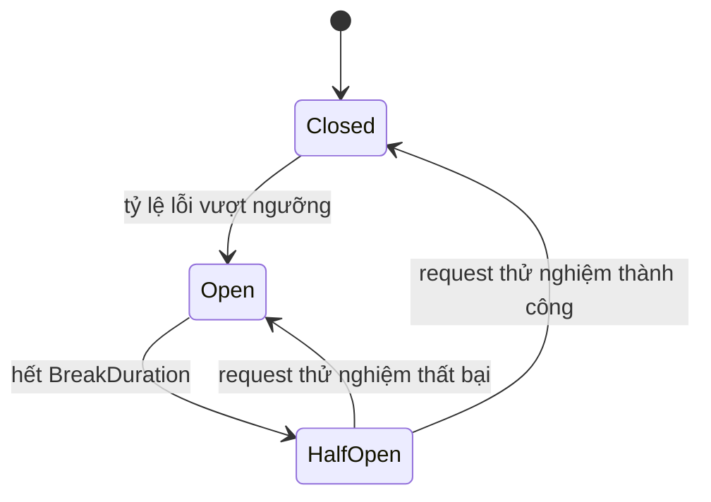

import { SummaryBox, Checklist, FAQSection } from '@site/src/components/SEO';

# 17.7 — 6. Retry và backoff

<SummaryBox>
Retry là con dao hai lưỡi rõ rệt nhất trong hệ phân tán: đúng chỗ thì nó biến lỗi mạng thoáng qua thành chuyện không ai biết, sai chỗ thì nó **biến một sự cố nhỏ thành sự cố toàn hệ thống**. Ba điều kiện phải đủ trước khi bật retry. Một, thao tác phải **idempotent** — retry một lệnh trừ tiền không idempotent là trừ tiền hai lần. Hai, phải phân biệt **lỗi tạm thời** (timeout, 503 — retry giúp ích) với **poison message** (sai schema, bug logic — retry vô ích và chỉ làm nghẽn hàng đợi). Ba, **jitter là bắt buộc chứ không phải tối ưu hoá**: nếu 500 consumer cùng gặp lỗi rồi cùng retry sau đúng 2 giây, bạn vừa tạo một đợt tấn công đồng bộ vào chính service đang ốm. Và DLQ chỉ có giá trị nếu **có người theo dõi nó**.
</SummaryBox>

## Mục tiêu bài học

Sau bài này bạn có thể:

- Phân biệt lỗi tạm thời và poison message trong code.
- Cài exponential backoff có jitter và giải thích vì sao cần jitter.
- Thiết kế retry hai tầng: ngay lập tức và có trì hoãn.
- Dùng circuit breaker để không dồn tải lên service đang hỏng.
- Vận hành DLQ như một hàng đợi cần xử lý, không phải thùng rác.

## Nội dung bài học

### 17.7.1 — Điều kiện tiên quyết: idempotency

```csharp
// KHÔNG idempotent — retry = trừ tiền hai lần
public async Task ChargeAsync(Guid orderId, decimal amount, CancellationToken ct)
{
    await _paymentGateway.ChargeAsync(amount, ct);   // timeout -> retry -> tru 2 lan
}
```

Điều nguy hiểm ở đây: **timeout không có nghĩa là thất bại**. Request có thể đã tới nơi và đã được xử lý, chỉ có phản hồi bị mất trên đường về. Retry trong trường hợp đó là trừ tiền lần thứ hai.

```csharp
// Idempotent — gateway nhận diện key và trả về kết quả cũ
public async Task ChargeAsync(Guid orderId, decimal amount, CancellationToken ct)
{
    await _paymentGateway.ChargeAsync(
        amount,
        idempotencyKey: $"order-{orderId}",      // gateway tu chan trung
        ct);
}
```

**Quy tắc:** không bật retry cho thao tác chưa idempotent ([bài 17.3](17.2-messaging-fears-lost-duplicates.mdx)). Làm idempotent trước, retry sau.

### 17.7.2 — Phân loại lỗi

| Loại | Ví dụ | Xử lý |
|---|---|---|
| **Tạm thời** | Timeout, 503, deadlock, mất kết nối | **Retry có backoff** |
| **Poison** | JSON sai, thiếu trường bắt buộc, `NullReferenceException` | **Vào DLQ ngay** |
| **Nghiệp vụ** | Lead không tồn tại, số dư không đủ | **Không retry** — ghi nhận và dừng |

Retry một poison message 5 lần là lãng phí 5 lần, và trong lúc đó nó **chiếm chỗ** của message hợp lệ phía sau.

```csharp
public async Task ConsumeAsync(ConsumeContext<LeadConvertedEvent> context)
{
    try
    {
        await _handler.HandleAsync(context.Message, context.CancellationToken);
    }
    catch (Exception ex) when (IsTransient(ex))
    {
        throw;                                    // de pipeline retry
    }
    catch (Exception ex)
    {
        _logger.LogError(ex, "Poison message {MessageId}", context.MessageId);
        await context.Send(_dlqUri, context.Message);     // vao DLQ ngay
    }
}

private static bool IsTransient(Exception ex) => ex switch
{
    TimeoutException => true,
    HttpRequestException => true,
    SqlException s => s.Number is 1205 or -2 or 49918,   // deadlock, timeout, busy
    _ => false
};
```

Chi tiết dễ bỏ sót: `SqlException 1205` là **deadlock victim** — lỗi này **luôn** đáng retry, và retry gần như luôn thành công vì lần chạy sau thường không trùng thứ tự khoá ([bài 12.7](../../stage-04-database-production/module-12-sql-deep-dive/12.6-transactions-and-locking.mdx)).

### 17.7.3 — Jitter: vì sao bắt buộc

```csharp
// SAI — 500 consumer cùng retry tại chính xác giây thứ 2, 4, 8
var delay = TimeSpan.FromSeconds(Math.Pow(2, attempt));
```

Kịch bản thực tế: database quá tải 1 giây, 500 consumer cùng timeout. Cả 500 cùng chờ 2 giây, rồi **cùng lúc** đánh vào database đang hồi phục. Nó sập lần nữa. Cả 500 cùng chờ 4 giây, rồi lại cùng đánh. Đây là **thundering herd** — retry đang **ngăn** hệ thống hồi phục.

```csharp
// ĐÚNG — full jitter: mỗi consumer chờ một khoảng NGẪU NHIÊN
private static TimeSpan GetDelay(int attempt)
{
    var maxDelay = Math.Min(Math.Pow(2, attempt), 60);      // tran 60 giay
    var jittered = Random.Shared.NextDouble() * maxDelay;   // [0, maxDelay)
    return TimeSpan.FromSeconds(jittered);
}
```

Tải retry giờ **trải đều** thay vì dồn thành các đỉnh nhọn. [AWS phân tích chi tiết](https://aws.amazon.com/builders-library/timeouts-retries-and-backoff-with-jitter/) và kết luận full jitter cho kết quả tốt nhất trong hầu hết trường hợp — đơn giản hơn và hiệu quả hơn các biến thể phức tạp.

Với .NET, `Microsoft.Extensions.Http.Resilience` đã có sẵn:

```csharp
builder.Services.AddHttpClient<BillingClient>()
    .AddStandardResilienceHandler(options =>
    {
        options.Retry.MaxRetryAttempts = 3;
        options.Retry.BackoffType = DelayBackoffType.Exponential;
        options.Retry.UseJitter = true;                 // bat buoc
        options.AttemptTimeout.Timeout = TimeSpan.FromSeconds(10);
    });
```

`AddStandardResilienceHandler` gói sẵn timeout, retry, circuit breaker và rate limiter theo thứ tự đúng.

### 17.7.4 — Retry hai tầng

Một mức retry duy nhất phục vụ hai nhu cầu mâu thuẫn: lỗi mạng chớp nhoáng cần thử **lại ngay**, còn service down cần **chờ lâu**. MassTransit tách làm hai tầng:

```csharp
cfg.ReceiveEndpoint("lead-converted", e =>
{
    // Tầng 1: lỗi chớp nhoáng — thử lại ngay, message GIỮ trong bộ nhớ
    e.UseMessageRetry(r => r.Immediate(3));

    // Tầng 2: lỗi kéo dài — TRẢ message về queue, consumer khác có thể xử lý
    e.UseScheduledRedelivery(r => r.Intervals(
        TimeSpan.FromMinutes(1),
        TimeSpan.FromMinutes(5),
        TimeSpan.FromMinutes(15)));

    e.Consumer<LeadConvertedConsumer>();
});
```

Khác biệt quan trọng giữa hai tầng: **retry ngay** giữ message trong bộ nhớ consumer và **chiếm** một slot xử lý; **redelivery** trả message về broker, giải phóng consumer để xử lý message khác. Nếu chỉ có tầng 1 với khoảng chờ dài, một service down 10 phút sẽ làm toàn bộ consumer của bạn ngồi chờ và hàng đợi dồn ứ.

### 17.7.5 — Circuit breaker

Retry giải quyết lỗi thoáng qua. Khi service phía sau **đang chết hẳn**, retry chỉ làm nó chết lâu hơn.

```csharp
// Chan hoan toan sau khi ty le loi vuot nguong
options.CircuitBreaker.FailureRatio = 0.5;                          // 50% loi
options.CircuitBreaker.MinimumThroughput = 10;                      // toi thieu 10 request
options.CircuitBreaker.SamplingDuration = TimeSpan.FromSeconds(30);
options.CircuitBreaker.BreakDuration = TimeSpan.FromSeconds(15);
```

Ba trạng thái:



Khi mở, lời gọi **thất bại ngay** không cần đi ra mạng. Hai lợi ích: service đang ốm được **giảm tải** để hồi phục, và bên gọi **không bị treo** chờ timeout — tránh cạn thread pool và lan lỗi ngược lên.

`MinimumThroughput` quan trọng: không có nó, 1 lỗi trên 1 request cũng thành "100% lỗi" và mở circuit oan.

### 17.7.6 — DLQ không phải thùng rác

Message vào DLQ nghĩa là **có việc cần người xử lý**. DLQ không ai nhìn là dữ liệu mất một cách im lặng, chỉ chậm hơn.

```csharp
// Cảnh báo khi DLQ có message — ngưỡng là 1, không phải 100
_meter.CreateObservableGauge("dlq_message_count", () => GetDlqDepth());
```

Quy trình tối thiểu cần có:

1. **Cảnh báo** khi DLQ có message — ngưỡng là **1**.
2. **Xem được nội dung** message và lý do thất bại (stack trace, số lần retry).
3. **Replay được** sau khi sửa bug.
4. **Xoá được** message không còn ý nghĩa.

Mỗi message trong DLQ phải kèm ngữ cảnh chẩn đoán:

```csharp
await context.Send(_dlqUri, context.Message, c =>
{
    c.Headers.Set("FailureReason", ex.Message);
    c.Headers.Set("FailedAtUtc", DateTime.UtcNow.ToString("O"));
    c.Headers.Set("RetryCount", context.GetRetryAttempt());
    c.Headers.Set("CorrelationId", context.CorrelationId?.ToString());
});
```

Không có những header này, xử lý DLQ lúc 2 giờ sáng là đoán mò.

### 17.7.7 — Rà lại code của bạn

<Checklist
  title="Danh sách rà soát retry và backoff"
  items={[
    { text: "Mọi thao tác có retry đều idempotent." },
    { text: "Đã phân biệt lỗi tạm thời, poison message và lỗi nghiệp vụ trong code." },
    { text: "Lỗi nghiệp vụ không bị retry." },
    { text: "Backoff có jitter, không phải chu kỳ cố định." },
    { text: "Có trần cho khoảng chờ để không chờ hàng giờ." },
    { text: "Có retry hai tầng: thử lại ngay và trì hoãn trả về queue." },
    { text: "Circuit breaker có MinimumThroughput để không mở oan." },
    { text: "DLQ có cảnh báo với ngưỡng bằng 1." },
    { text: "Message trong DLQ kèm lý do thất bại và correlation id." },
    { text: "Có quy trình replay message từ DLQ sau khi sửa bug." },
  ]}
/>

## Bài tập áp dụng

#### Bài 1 — Tái hiện thundering herd

Chạy 200 task cùng retry với backoff cố định vào một endpoint, vẽ biểu đồ số request theo thời gian. Thêm full jitter và vẽ lại.

**Tiêu chí hoàn thành:** bạn thấy được các đỉnh đều đặn trong bản không jitter, và giải thích được vì sao **chính sự cố** tạo ra sự đồng bộ hoá.

<details>
<summary><strong>Gợi ý và lời giải — Bài 1</strong></summary>

**Gợi ý.** Trước sự cố, 200 client gọi rải rác. Sau khi tất cả cùng nhận 503, chúng ở trạng thái nào?

**Lời giải — mô phỏng 500 client, backoff nhân đôi từ 1 giây, 5 lần thử, gom theo cửa sổ 0,25 giây (chỉ tính lần thử lại):**

```python
def mo_phong(jitter):
    moc = []
    for _ in range(500):
        t = 0.0
        for lan in range(5):
            d = 1.0 * (2 ** lan)                       # 1, 2, 4, 8, 16 giây
            if jitter == 'full':
                d = random.uniform(0, d)
            elif jitter == 'equal':
                d = d / 2 + random.uniform(0, d / 2)
            t += d
            moc.append(t)
    return moc
```

```text
Không jitter   đỉnh 2.000 req/s   trải trên  1,2 s   kết thúc 31,0 s
Equal jitter   đỉnh 1.028 req/s   trải trên 24,2 s   kết thúc 29,7 s
Full jitter    đỉnh   772 req/s   trải trên 27,2 s   kết thúc 27,8 s
```

Vị trí các đỉnh khi không có jitter:

```text
t =  0s   500 request
t =  1s   500 request      <- đúng bằng đỉnh ban đầu
t =  3s   500 request
t =  7s   500 request
t = 15s   500 request
t = 31s   500 request
```

**Sáu đợt sóng, mỗi đợt lớn bằng đợt đầu**, trong 31 giây. Dịch vụ đang quá tải nhận đúng cùng mức tải, lặp lại sáu lần.

**Vì sao chính sự cố tạo ra sự đồng bộ hoá** — đây là điểm cốt lõi và nó phản trực giác:

```text
Trước sự cố:
    500 client gọi rải rác ngẫu nhiên theo nhu cầu của chúng
    -> tải phân bố đều theo thời gian

Khoảnh khắc sự cố:
    dịch vụ trả 503 cho TẤT CẢ trong cùng một khoảnh khắc
    -> 500 client cùng bắt đầu đếm ngược từ cùng một thời điểm
    -> chúng bị CĂN CHỈNH vào cùng một đồng hồ

Sau đó:
    backoff tất định giữ nguyên sự căn chỉnh đó qua MỌI lần thử
```

Nói cách khác: **sự cố là một sự kiện đồng bộ hoá toàn cục**. Nó biến một tập client độc lập thành một đám đông cùng nhịp — và backoff tất định không phá vỡ nhịp đó mà còn củng cố nó.

**Vì sao backoff một mình không đủ:**

```text
Backoff giải quyết:  "mỗi client gọi lại quá nhanh"
                     -> trục thời gian của MỘT client

Backoff KHÔNG giải:  "mọi client gọi lại cùng thời điểm"
                     -> trục đồng bộ GIỮA các client
```

Hậu quả thực tế: dịch vụ vừa hồi phục lúc t=0,5s sẽ bị dội 500 request lúc t=1s và sập lại. Chu kỳ này lặp nhiều lần, và mỗi lần hệ thống chỉ "gần như" hồi phục.

**Ba kiểu jitter:**

```csharp
// Full jitter — ngẫu nhiên trong toàn khoảng [0, delay]
var delay = TimeSpan.FromSeconds(Random.Shared.NextDouble() * Math.Pow(2, lan));

// Equal jitter — nửa cố định, nửa ngẫu nhiên
var coBan = Math.Pow(2, lan);
var delay = TimeSpan.FromSeconds(coBan / 2 + Random.Shared.NextDouble() * coBan / 2);

// Decorrelated jitter — dựa trên độ trễ TRƯỚC ĐÓ
var delay = TimeSpan.FromSeconds(
    Math.Min(maxDelay, Random.Shared.NextDouble() * (truocDo * 3 - coBan) + coBan));
```

| Kiểu | Đỉnh tải | Dùng khi |
|---|---:|---|
| Không jitter | 2.000 req/s | Không bao giờ |
| **Equal jitter** | 1.028 req/s | **Mặc định tốt** — giữ tính chất backoff |
| Full jitter | 772 req/s | Tải rất cao, muốn phân tán tối đa |

**Equal jitter là mặc định tốt** vì nó giữ được điều quan trọng của backoff: độ trễ **luôn tăng** theo số lần thử. Với full jitter, lần thử thứ năm có thể rơi vào 0,1 giây — nhanh hơn cả lần đầu.

**Trong .NET, dùng Polly:**

```csharp
services.AddHttpClient<IErpClient, ErpClient>()
    .AddResilienceHandler("erp", b =>
    {
        b.AddRetry(new HttpRetryStrategyOptions
        {
            MaxRetryAttempts = 3,
            BackoffType = DelayBackoffType.Exponential,
            UseJitter = true,                       // <- dòng quan trọng nhất
            Delay = TimeSpan.FromSeconds(1),
        });
    });
```

`UseJitter = true` là mặc định nên bật ở **mọi** chính sách retry. Không có lý do chính đáng nào để tắt nó.

**Và jitter không chỉ dành cho retry.** Mọi lúc nhiều tiến trình làm cùng một việc theo cùng một lịch:

```csharp
// TTL cache — tránh mọi instance cùng hết hạn
var ttl = TimeSpan.FromMinutes(10) + TimeSpan.FromSeconds(Random.Shared.Next(0, 120));

// Job định kỳ — tránh mọi pod cùng chạy lúc phút tròn
await Task.Delay(TimeSpan.FromSeconds(Random.Shared.Next(0, 30)), ct);

// Poll outbox — tránh nhiều dispatcher cùng truy vấn
var chuKy = TimeSpan.FromSeconds(1) + TimeSpan.FromMilliseconds(Random.Shared.Next(0, 500));
```

**Nhận ra vấn đề này trên production:**

```text
Biểu đồ request theo thời gian có các ĐỈNH ĐỀU ĐẶN
cách nhau đúng 1s, 2s, 4s, 8s... sau mỗi sự cố
```

Hình răng cưa đều đặn sau một sự cố là chữ ký rõ ràng: có một chính sách retry ở đâu đó chưa bật jitter, và nó đang kéo dài mọi sự cố của bạn.

</details>

---

#### Bài 2 — Phân loại lỗi tạm thời và lỗi vĩnh viễn

Viết hàm `IsTransient` cho dự án của bạn, liệt kê đầy đủ mã lỗi SQL đáng retry. Kiểm thử bằng cách ném từng loại exception.

**Tiêu chí hoàn thành:** bạn phân loại được đúng, và nêu được vì sao retry một lỗi vĩnh viễn **tệ hơn** là không retry.

<details>
<summary><strong>Gợi ý và lời giải — Bài 2</strong></summary>

**Gợi ý.** "Email không đúng định dạng" — thử lại 3 lần có đổi kết quả không?

**Lời giải:**

```csharp
public static class PhanLoaiLoi
{
    // Mã lỗi SQL Server đáng retry
    private static readonly HashSet<int> MaLoiSqlTamThoi =
    [
        -2,      // Timeout
        20,      // Instance không hợp lệ
        64,      // Lỗi mạng khi thiết lập kết nối
        233,     // Kết nối bị đóng
        1205,    // Deadlock victim
        10053,   // Lỗi vận chuyển
        10054,   // Kết nối bị reset
        10060,   // Timeout mạng
        40197,   // Azure SQL: lỗi xử lý request
        40501,   // Azure SQL: service busy
        40613,   // Azure SQL: database không khả dụng
        49918,   // Azure SQL: không đủ tài nguyên
        49919,   // Azure SQL: quá nhiều thao tác
        49920,   // Azure SQL: service busy
        4060,    // Không mở được database
        4221,    // Login thất bại tạm thời
    ];

    public static bool LaTamThoi(Exception ex) => ex switch
    {
        // Mạng và timeout
        TimeoutException                           => true,
        OperationCanceledException                 => false,   // người dùng huỷ, không retry
        HttpRequestException                       => true,
        SocketException                            => true,
        IOException                                => true,

        // SQL
        SqlException sql                           => MaLoiSqlTamThoi.Contains(sql.Number),
        DbUpdateConcurrencyException               => true,    // xung đột, thử lại có thể thành công
        DbUpdateException e                        => LaTamThoi(e.InnerException ?? e),

        // PostgreSQL
        PostgresException pg                       => pg.IsTransient,

        // Redis
        RedisConnectionException                   => true,
        RedisTimeoutException                      => true,

        // HTTP theo mã trạng thái
        ApiException api                           => LaMaHttpTamThoi(api.StatusCode),

        // Nghiệp vụ và lập trình — KHÔNG retry
        ValidationException                        => false,
        BusinessRuleException                      => false,
        ArgumentException                          => false,
        InvalidOperationException                  => false,
        NotSupportedException                      => false,
        JsonException                              => false,
        UnauthorizedAccessException                => false,

        _                                          => false,   // mặc định KHÔNG retry
    };

    private static bool LaMaHttpTamThoi(HttpStatusCode ma) => ma switch
    {
        HttpStatusCode.RequestTimeout        => true,    // 408
        HttpStatusCode.TooManyRequests       => true,    // 429
        HttpStatusCode.InternalServerError   => true,    // 500
        HttpStatusCode.BadGateway            => true,    // 502
        HttpStatusCode.ServiceUnavailable    => true,    // 503
        HttpStatusCode.GatewayTimeout        => true,    // 504
        _                                    => false,
    };
}
```

**Bốn quyết định đáng giải thích trong đoạn trên:**

**1. Mặc định là KHÔNG retry.** Nhánh `_ => false` nghĩa là một loại exception chưa biết sẽ không bị retry. Ngược lại — mặc định retry — nghĩa là một lỗi lập trình mới sẽ bị thử lại ba lần, làm chậm phản hồi và làm nhiễu log.

**2. `OperationCanceledException` KHÔNG retry.** Nó thường nghĩa là người dùng đã đóng kết nối hoặc `CancellationToken` đã bị huỷ. Retry là làm việc cho một request không còn ai chờ.

Nhưng cẩn thận: `SqlException` với mã `-2` (timeout) đôi khi bọc trong `OperationCanceledException` khi dùng `CancellationToken`. Kiểm tra token trước:

```csharp
OperationCanceledException oce when !ct.IsCancellationRequested => true,   // timeout thật
OperationCanceledException                                      => false,  // người dùng huỷ
```

**3. `DbUpdateConcurrencyException` CÓ retry.** Xung đột optimistic concurrency nghĩa là có người khác vừa sửa — thử lại với dữ liệu mới có thể thành công ([bài 13.8](../../stage-04-database-production/module-13-entity-framework-core/13.8-concurrency-control.mdx)).

Nhưng chỉ retry khi logic **nạp lại dữ liệu** ở mỗi lần thử. Retry cùng một `DbContext` với `OriginalValues` cũ sẽ thất bại mãi mãi.

**4. `429 Too Many Requests` CÓ retry, nhưng phải tôn trọng `Retry-After`:**

```csharp
b.AddRetry(new HttpRetryStrategyOptions
{
    ShouldHandle = args => ValueTask.FromResult(
        args.Outcome.Result?.StatusCode is HttpStatusCode.TooManyRequests
                                        or HttpStatusCode.ServiceUnavailable),
    DelayGenerator = args =>
    {
        // Nếu server nói chờ bao lâu, TÔN TRỌNG
        var retryAfter = args.Outcome.Result?.Headers.RetryAfter?.Delta;
        return ValueTask.FromResult(retryAfter);      // null -> dùng backoff mặc định
    },
});
```

Bỏ qua `Retry-After` và retry sớm hơn là cách chắc chắn để bị chặn lâu hơn.

**Vì sao retry một lỗi vĩnh viễn tệ hơn là không retry:**

```text
Không retry:
    lỗi trả về ngay -> người dùng biết ngay -> sửa và thử lại
    1 lời gọi, 50 ms

Retry một lỗi vĩnh viễn:
    3 lần thử với backoff 1s, 2s, 4s
    -> 4 lời gọi, 7 giây chờ
    -> vẫn cùng một lỗi
    -> người dùng chờ 7 giây để nhận một thông báo lẽ ra có ngay
```

Bốn hậu quả cụ thể:

**1. Lãng phí tài nguyên.** Với 15% request có dữ liệu không hợp lệ và mỗi cái retry 3 lần, bạn tăng tải lên **1,45 lần** cho những request chắc chắn thất bại.

**2. Che giấu lỗi thật.** Log đầy exception lặp lại, và tín hiệu thật chìm trong nhiễu:

```text
[Error] ValidationException: Email không hợp lệ (lần 1/3)
[Error] ValidationException: Email không hợp lệ (lần 2/3)
[Error] ValidationException: Email không hợp lệ (lần 3/3)
```

**3. Làm nhiễu circuit breaker.** Lỗi validate được tính vào tỷ lệ lỗi, và mạch có thể ngắt vì người dùng gửi dữ liệu sai — trong khi dịch vụ đích hoàn toàn khoẻ.

```csharp
b.AddCircuitBreaker(new HttpCircuitBreakerStrategyOptions
{
    ShouldHandle = args => ValueTask.FromResult(
        args.Outcome.Result?.StatusCode >= HttpStatusCode.InternalServerError),
    // 4xx KHÔNG tính vào tỷ lệ lỗi của circuit breaker
});
```

**4. Nhân lên nếu có nhiều tầng retry.** Ba tầng mỗi tầng 3 lần là 64 lời gọi cho một lỗi validate ([bài 14.9](../../stage-04-database-production/module-14-caching-background-jobs/14.9-idempotency-and-retry.mdx)).

**Kiểm thử phân loại:**

```csharp
[Theory]
[InlineData(typeof(TimeoutException), true)]
[InlineData(typeof(HttpRequestException), true)]
[InlineData(typeof(ValidationException), false)]
[InlineData(typeof(ArgumentNullException), false)]
[InlineData(typeof(JsonException), false)]
public void Phan_loai_exception_dung(Type kieuException, bool mongDoiTamThoi)
{
    var ex = (Exception)Activator.CreateInstance(kieuException)!;
    PhanLoaiLoi.LaTamThoi(ex).Should().Be(mongDoiTamThoi);
}

[Theory]
[InlineData(1205, true)]      // deadlock
[InlineData(-2, true)]        // timeout
[InlineData(40501, true)]     // Azure SQL busy
[InlineData(2627, false)]     // vi phạm unique -> KHÔNG retry
[InlineData(547, false)]      // vi phạm khoá ngoại -> KHÔNG retry
[InlineData(8152, false)]     // chuỗi bị cắt -> KHÔNG retry
public void Phan_loai_ma_loi_SQL_dung(int maLoi, bool mongDoiTamThoi)
{
    var ex = TaoSqlException(maLoi);
    PhanLoaiLoi.LaTamThoi(ex).Should().Be(mongDoiTamThoi);
}
```

Ba dòng cuối của test thứ hai quan trọng: 2627, 547 và 8152 là những mã **rất hay bị retry nhầm** vì chúng là `SqlException` và trông giống lỗi database. Nhưng chúng là vi phạm ràng buộc — dữ liệu sai, và thử lại 100 lần vẫn sai.

**Và với EF Core, dùng `EnableRetryOnFailure` thay vì tự viết cho phần database:**

```csharp
options.UseSqlServer(conn, sql => sql.EnableRetryOnFailure(
    maxRetryCount: 3,
    maxRetryDelay: TimeSpan.FromSeconds(10),
    errorNumbersToAdd: null));      // null -> dùng danh sách mặc định của EF Core
```

Danh sách mặc định của `SqlServerRetryingExecutionStrategy` đã được Microsoft duy trì và cập nhật theo các mã lỗi mới của Azure SQL — tốt hơn danh sách bạn tự viết và quên cập nhật.

Nhưng nhớ: bật nó nghĩa là transaction do người dùng khởi tạo phải nằm trong execution strategy ([bài 14.9](../../stage-04-database-production/module-14-caching-background-jobs/14.9-idempotency-and-retry.mdx)), và nó cộng vào tổng số tầng retry của hệ thống.

</details>

---

#### Bài 3 — Quan sát circuit breaker

Cấu hình `AddStandardResilienceHandler`, dựng một endpoint luôn trả 500, và ghi lại thời điểm circuit chuyển trạng thái.

**Tiêu chí hoàn thành:** bạn quan sát được ba trạng thái, và chọn được tham số có cơ sở cho một dịch vụ cụ thể.

<details>
<summary><strong>Gợi ý và lời giải — Bài 3</strong></summary>

**Gợi ý.** Mạch ngắt rồi thì khi nào nó thử lại? Và nó thử bằng cách nào?

**Lời giải:**

```csharp
services.AddHttpClient<IErpClient, ErpClient>(c => c.BaseAddress = new Uri(erpUrl))
    .AddResilienceHandler("erp", b =>
    {
        b.AddTimeout(TimeSpan.FromSeconds(3));

        b.AddRetry(new HttpRetryStrategyOptions
        {
            MaxRetryAttempts = 3,
            BackoffType = DelayBackoffType.Exponential,
            UseJitter = true,
            Delay = TimeSpan.FromSeconds(1),
            OnRetry = args =>
            {
                _logger.LogWarning("Retry lần {Lan} sau {Delay}ms",
                                   args.AttemptNumber + 1, args.RetryDelay.TotalMilliseconds);
                return default;
            },
        });

        b.AddCircuitBreaker(new HttpCircuitBreakerStrategyOptions
        {
            FailureRatio = 0.5,
            MinimumThroughput = 10,
            SamplingDuration = TimeSpan.FromSeconds(30),
            BreakDuration = TimeSpan.FromSeconds(15),

            OnOpened = args =>
            {
                _logger.LogError("Circuit MỞ lúc {Luc:O}, sẽ đóng lại sau {Break}s",
                                 DateTime.UtcNow, args.BreakDuration.TotalSeconds);
                _trangThaiMach = 1;
                return default;
            },
            OnClosed = args =>
            {
                _logger.LogInformation("Circuit ĐÓNG lúc {Luc:O}", DateTime.UtcNow);
                _trangThaiMach = 0;
                return default;
            },
            OnHalfOpened = args =>
            {
                _logger.LogInformation("Circuit NỬA MỞ lúc {Luc:O} — thử một request",
                                       DateTime.UtcNow);
                _trangThaiMach = 2;
                return default;
            },
        });
    });
```

```bash
hey -z 60s -c 5 -q 2 http://localhost:8080/goi-erp
```

```text
08:14:22.104  Retry lần 1 sau 1043ms
08:14:23.201  Retry lần 2 sau 2118ms
08:14:25.398  Retry lần 3 sau 4087ms
...
08:14:31.882  Circuit MỞ lúc 2026-09-25T01:14:31Z, sẽ đóng lại sau 15s
08:14:31.9    (request trả lỗi NGAY, không gọi ERP)
08:14:46.891  Circuit NỬA MỞ lúc 2026-09-25T01:14:46Z — thử một request
08:14:46.9    (request thử thất bại)
08:14:46.9    Circuit MỞ lúc 2026-09-25T01:14:46Z
08:15:01.9    Circuit NỬA MỞ ...
```

**Ba trạng thái:**

```text
ĐÓNG (Closed):     gọi bình thường, đếm tỷ lệ lỗi trong SamplingDuration
                   -> tỷ lệ vượt FailureRatio -> chuyển sang MỞ

MỞ (Open):         KHÔNG gọi, thất bại ngay lập tức
                   -> sau BreakDuration -> chuyển sang NỬA MỞ

NỬA MỞ (HalfOpen): cho MỘT request đi qua để thăm dò
                   -> thành công -> ĐÓNG
                   -> thất bại  -> MỞ tiếp
```

Trạng thái nửa mở là chi tiết quan trọng nhất: nó cho phép mạch **tự phục hồi** mà không dội tải lên dịch vụ vừa sống lại. Chỉ một request được thử, thay vì toàn bộ lưu lượng bị dồn.

```text
BrokenCircuitException: The circuit is now open and is not allowing calls.
```

**Hai con số đáng chú ý trong lần chạy:**

```text
Từ lỗi đầu tiên tới lúc mạch mở:   9,8 giây
                                    -> trong khoảng đó, 30 lời gọi vô ích tới ERP đang chết

Sau khi mạch mở:                    request thất bại trong ~0,1 ms thay vì 3 giây timeout
                                    -> nhanh hơn 30.000 lần
```

Con số thứ hai là giá trị thật của circuit breaker: nó không chỉ bảo vệ dịch vụ đích, nó còn **giải phóng luồng và kết nối** của chính bạn. Không có nó, 50 request đồng thời mỗi cái chờ 3 giây sẽ chiếm 50 luồng trong suốt thời gian đó.

**Chọn tham số có cơ sở:**

**`MinimumThroughput`** — số lời gọi tối thiểu trước khi tính tỷ lệ:

```text
Không có nó: 1 lỗi / 1 lời gọi = 100% -> mạch ngắt ngay lúc khởi động

Đặt bằng lưu lượng của khoảng 10–30 giây ở mức bình thường:
    5 req/s  -> MinimumThroughput 50–150
```

**`FailureRatio`** — phụ thuộc tỷ lệ lỗi **bình thường** của dịch vụ đó:

```text
Dịch vụ rất ổn định (lỗi nền dưới 1%):   0,10–0,15
Dịch vụ có lỗi nền vài phần trăm:          0,25–0,30
API bên thứ ba hay lỗi lặt vặt:            0,50
```

Quy tắc: ngưỡng phải **cao hơn hẳn** tỷ lệ lỗi bình thường. Đo tỷ lệ nền trước khi đặt số — nếu không, mạch sẽ ngắt ngẫu nhiên trong lúc mọi thứ vẫn ổn.

**`SamplingDuration`** — cửa sổ tính tỷ lệ:

```text
Ngắn (10s):  phản ứng nhanh, nhưng nhạy với biến động nhất thời
Dài (60s):   ổn định, nhưng phản ứng chậm
Thường: 30 giây
```

Phải **dài hơn** thời gian một chuỗi retry hoàn tất, nếu không một chuỗi retry của một request có thể tự nó lấp đầy cửa sổ.

**`BreakDuration`** — nên **dài hơn thời gian hồi phục điển hình**:

```text
Dịch vụ tự khởi động lại trong 30 giây  -> 30–60 giây
Sự cố cần người can thiệp                -> 2–5 phút
API bên thứ ba có rate limit             -> theo cửa sổ rate limit của họ
```

**Thứ tự middleware — chi tiết quyết định:**

```csharp
b.AddTimeout(...);           // 1. ngoài cùng — timeout tổng
b.AddRetry(...);             // 2.
b.AddCircuitBreaker(...);    // 3.
b.AddTimeout(...);           // 4. trong cùng — timeout cho MỖI lần thử
```

`AddStandardResilienceHandler` dựng sẵn đúng thứ tự này:

```csharp
services.AddHttpClient<IErpClient, ErpClient>()
    .AddStandardResilienceHandler(o =>
    {
        o.TotalRequestTimeout.Timeout = TimeSpan.FromSeconds(30);
        o.AttemptTimeout.Timeout = TimeSpan.FromSeconds(10);
        o.Retry.MaxRetryAttempts = 3;
        o.CircuitBreaker.FailureRatio = 0.5;
        o.CircuitBreaker.SamplingDuration = TimeSpan.FromSeconds(30);
    });
```

Lưu ý ràng buộc: `AttemptTimeout` phải **nhỏ hơn hoặc bằng một nửa** `SamplingDuration`, và `TotalRequestTimeout` phải lớn hơn `AttemptTimeout` — Polly kiểm tra và ném lỗi cấu hình lúc khởi động nếu sai.

**Giám sát trạng thái mạch — bắt buộc:**

```csharp
_meter.CreateObservableGauge("circuit_breaker.state",
    () => new Measurement<int>(_trangThaiMach,
        new KeyValuePair<string, object?>("service", "erp")));
```

```text
0 = đóng, 1 = mở, 2 = nửa mở

Cảnh báo khi mạch ở trạng thái mở liên tục quá 5 phút.
```

Không có chỉ số này, một mạch mở lâu là một luồng nghiệp vụ đang dừng **trong im lặng** — request trả lỗi nhanh và gọn, nên không có gì trông như sự cố.

**Và một cân nhắc về phạm vi của mạch:**

```csharp
// Một mạch cho CẢ dịch vụ ERP
services.AddHttpClient<IErpClient, ErpClient>().AddStandardResilienceHandler();
```

```text
Endpoint /don-hang của ERP hỏng
-> mạch ngắt
-> endpoint /khach-hang cũng không gọi được, dù nó vẫn khoẻ
```

Nếu các endpoint của một dịch vụ có độ tin cậy khác nhau, tách thành nhiều `HttpClient`:

```csharp
services.AddHttpClient<IErpDonHangClient, ErpDonHangClient>().AddStandardResilienceHandler();
services.AddHttpClient<IErpKhachHangClient, ErpKhachHangClient>().AddStandardResilienceHandler();
```

Đây là đánh đổi: nhiều mạch nghĩa là cách ly tốt hơn, nhưng mỗi mạch cần đủ lưu lượng để `MinimumThroughput` có ý nghĩa. Với dịch vụ ít được gọi, một mạch chung là đúng.

</details>

## Tự kiểm tra

<FAQSection
  items={[
    {
      question: "Vì sao idempotency là điều kiện tiên quyết của retry?",
      answer: "Vì timeout không có nghĩa là thất bại. Request có thể đã tới nơi và đã được xử lý, chỉ có phản hồi bị mất trên đường về. Retry một thao tác không idempotent trong trường hợp đó sẽ thực hiện nó lần thứ hai, ví dụ trừ tiền hai lần."
    },
    {
      question: "Ba loại lỗi cần phân biệt là gì?",
      answer: "Lỗi tạm thời như timeout, 503 hay deadlock thì retry có backoff. Poison message như JSON sai hay thiếu trường bắt buộc thì vào DLQ ngay vì retry vô ích và chiếm chỗ của message hợp lệ. Lỗi nghiệp vụ như số dư không đủ thì không retry, chỉ ghi nhận và dừng."
    },
    {
      question: "Vì sao jitter là bắt buộc chứ không phải tối ưu hoá?",
      answer: "Vì không có jitter thì mọi consumer gặp lỗi cùng lúc sẽ cùng retry tại đúng những mốc thời gian giống nhau, tạo ra các đỉnh tải đồng bộ đánh vào service đang hồi phục. Đó là thundering herd, và nó khiến retry ngăn hệ thống hồi phục thay vì giúp."
    },
    {
      question: "Retry ngay và redelivery có trì hoãn khác nhau thế nào?",
      answer: "Retry ngay giữ message trong bộ nhớ consumer và chiếm một slot xử lý, phù hợp với lỗi chớp nhoáng. Redelivery trả message về broker nên giải phóng consumer để xử lý message khác, phù hợp khi service phía sau down lâu."
    },
    {
      question: "Circuit breaker giải quyết vấn đề gì mà retry không giải quyết được?",
      answer: "Khi service phía sau chết hẳn, retry chỉ dồn thêm tải và làm nó chết lâu hơn. Circuit breaker cho lời gọi thất bại ngay không đi ra mạng, vừa giảm tải cho service đang ốm vừa tránh cho bên gọi bị treo chờ timeout và cạn thread pool."
    },
    {
      question: "Vì sao ngưỡng cảnh báo DLQ nên là 1?",
      answer: "Vì mỗi message vào DLQ là một việc cần người xử lý. DLQ không ai theo dõi chính là mất dữ liệu một cách im lặng, chỉ chậm hơn. Message trong DLQ cũng cần kèm lý do thất bại và correlation id để chẩn đoán được."
    }
  ]}
/>

## Kết luận

Ba điều đáng nhớ nhất:

1. **Idempotent trước, retry sau.** Thứ tự ngược lại gây mất tiền thật.
2. **Jitter là bắt buộc.** Backoff cố định biến retry thành tấn công đồng bộ.
3. **DLQ cần người theo dõi**, nếu không nó chỉ là nơi mất dữ liệu chậm hơn.

## Tham khảo

- [Retry pattern](https://learn.microsoft.com/en-us/azure/architecture/patterns/retry)
- [Transient fault handling](https://learn.microsoft.com/en-us/azure/architecture/best-practices/transient-faults)
- [Timeouts, retries and backoff with jitter (AWS)](https://aws.amazon.com/builders-library/timeouts-retries-and-backoff-with-jitter/)
- [Building resilient apps with .NET](https://learn.microsoft.com/en-us/dotnet/core/resilience/)

## Điều hướng

- **Bài trước:** [17.5 — 5. CDC (Change Data Capture)](17.5-change-data-capture.mdx)
- **Bài tiếp theo:** [17.7 — 7. Demo tinh thần: Outbox + idempotency](17.7-outbox-idempotency-demo.mdx)
- **Về module:** [Trang mục lục](./)
