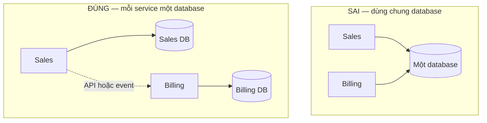
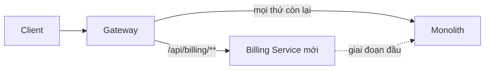

import { SummaryBox, Checklist, FAQSection } from '@site/src/components/SEO';

# 18.3 — 2. Service decomposition

<SummaryBox>
Tách sai chỗ còn tệ hơn không tách. Hai nguyên tắc quyết định: tách theo **subdomain nghiệp vụ** (Sales, Billing, Inventory) chứ **không** theo tầng kỹ thuật (Auth Service, Validation Service, Database Service), và **mỗi service sở hữu dữ liệu của nó** — không service nào được đọc trực tiếp bảng của service khác. Vi phạm nguyên tắc thứ hai là sai lầm phổ biến nhất: hai service dùng chung một database trông có vẻ tiện, nhưng nó tạo ra thứ tệ nhất của cả hai thế giới — bạn chịu độ phức tạp vận hành của microservices mà **không** có được triển khai độc lập, vì mỗi lần đổi schema là một lần phối hợp triển khai. Và cách tách an toàn duy nhất trên hệ đang chạy là **Strangler Fig**: mọc dần thứ mới quanh thứ cũ, không bao giờ viết lại một lần.
</SummaryBox>

## Mục tiêu bài học

Sau bài này bạn có thể:

- Tách service theo subdomain thay vì theo tầng kỹ thuật.
- Giải thích vì sao dùng chung database phá hỏng toàn bộ lợi ích.
- Áp dụng Strangler Fig để tách dần mà không dừng hệ thống.
- Xử lý dữ liệu dùng chung khi không còn `JOIN`.
- Nhận ra ranh giới tách sai và sửa lại.

## Nội dung bài học

### 18.3.1 — Tách theo subdomain, không theo tầng

```
SAI — tach theo tang ky thuat
  Auth Service
  Validation Service
  Database Service
  Notification Service
```

Vì sao sai: mọi tính năng đều phải đi qua **tất cả** các service. Thêm một trường vào form khách hàng chạm Validation Service, Database Service và Auth Service. Bạn đã tạo ra một hệ thống mà **mỗi thay đổi đều cần phối hợp triển khai** — chính là thứ microservices cố tránh.

```
DUNG — tach theo subdomain nghiep vu
  Sales Service       (lead, opportunity, quote)
  Billing Service     (invoice, payment, subscription)
  Inventory Service   (product, stock, warehouse)
```

Mỗi service **tự làm trọn** một loại nhu cầu nghiệp vụ. Thêm trường vào lead chỉ chạm Sales Service.

Cách nhận biết ranh giới đúng: **từ ngữ có nghĩa khác nhau ở hai bên**. Với Sales, "customer" là người có thể mua hàng — quan tâm ngân sách, nhu cầu, người ra quyết định. Với Billing, "customer" là một đơn vị thanh toán — quan tâm mã số thuế, hạn mức tín dụng, chu kỳ hoá đơn.

```csharp
// Sales Service — customer theo goc nhin ban hang
public sealed class Customer
{
    public CustomerId Id { get; private set; }
    public string CompanyName { get; private set; }
    public Money EstimatedBudget { get; private set; }
    public ContactPerson DecisionMaker { get; private set; }
}

// Billing Service — CÙNG một khách hàng, MÔ HÌNH khác hẳn
public sealed class Customer
{
    public CustomerId Id { get; private set; }
    public string LegalName { get; private set; }
    public TaxCode TaxCode { get; private set; }
    public Money CreditLimit { get; private set; }
    public BillingCycle Cycle { get; private set; }
}
```

Hai lớp cùng tên, khác nội dung, **và đó là đúng** — mỗi service mô hình hoá theo nhu cầu của mình. Cố ép chúng thành một model dùng chung sẽ tạo ra một lớp khổng lồ mà không service nào dùng hết, và mọi thay đổi ở một bên đều ảnh hưởng bên kia.

### 18.3.2 — Database per service



Dùng chung database gây ra bốn vấn đề, và cái thứ nhất phá hỏng lý do tồn tại của microservices:

| Vấn đề | Hậu quả |
|---|---|
| **Không triển khai độc lập được** | Đổi schema phải phối hợp triển khai cả hai service |
| Không đổi công nghệ được | Cả hai bị khoá vào cùng một engine |
| Coupling ngầm | Sales `JOIN` bảng Billing → Billing không dám đổi cột |
| Tranh chấp tài nguyên | Truy vấn báo cáo nặng của Billing làm chậm Sales |

Kết quả là **distributed monolith** ([bài 18.8](18.7-anti-pattern-distributed-monolith.mdx)): chi phí của microservices, lợi ích của monolith.

Nguyên tắc: **một service, một schema, không ai khác đọc trực tiếp**.

### 18.3.3 — Không còn JOIN thì làm sao?

Đây là câu hỏi thực tế nhất khi tách, và có ba cách giải, mỗi cách đánh đổi khác nhau.

**Cách 1 — Gọi API đồng bộ.** Đơn giản nhất, dùng khi dữ liệu phải mới tuyệt đối.

```csharp
var invoices = await _billingClient.GetInvoicesAsync(customerId, ct);
```

Cái giá: coupling thời gian. Billing chết thì màn hình này chết. Bắt buộc có timeout và circuit breaker ([bài 17.6](../module-17-distributed-systems/17.6-retry-and-backoff.mdx)).

**Cách 2 — Nhân bản dữ liệu qua event.** Phù hợp khi dữ liệu ít đổi và chấp nhận trễ vài giây.

```csharp
// Sales giữ một BẢN SAO tối thiểu của dữ liệu Billing
public sealed class CustomerBillingInfo
{
    public CustomerId CustomerId { get; set; }
    public bool HasOverdueInvoice { get; set; }      // chỉ giữ thứ Sales CẦN
    public DateTime LastUpdatedUtc { get; set; }
}

public sealed class InvoiceOverdueConsumer(SalesDbContext db) : IConsumer<InvoiceOverdueEvent>
{
    public async Task Consume(ConsumeContext<InvoiceOverdueEvent> context)
    {
        var info = await db.CustomerBillingInfo
            .FirstOrDefaultAsync(c => c.CustomerId == context.Message.CustomerId);

        info!.HasOverdueInvoice = true;
        info.LastUpdatedUtc = DateTime.UtcNow;
        await db.SaveChangesAsync();
    }
}
```

Giờ Sales truy vấn được "khách nào đang nợ quá hạn" **không cần gọi Billing**. Cái giá: dữ liệu trễ vài giây, và bạn phải giữ bản sao đồng bộ.

Điểm quan trọng: **chỉ nhân bản đúng thứ bạn cần**, không sao chép cả bảng. `HasOverdueInvoice` là một `bool`, không phải toàn bộ danh sách hoá đơn.

**Cách 3 — API composition.** Gateway hoặc BFF gọi nhiều service rồi ghép kết quả ([bài 18.4](18.3-api-gateway-yarp-dotnet.mdx)). Phù hợp cho màn hình tổng hợp, nhưng độ trễ bằng service chậm nhất.

| Cách | Khi dùng | Đánh đổi |
|---|---|---|
| Gọi API | Dữ liệu phải mới tuyệt đối | Coupling thời gian |
| Nhân bản qua event | Dữ liệu ít đổi, chịu trễ được | Phải giữ đồng bộ |
| API composition | Màn hình tổng hợp | Trễ bằng service chậm nhất |

### 18.3.4 — Strangler Fig: tách dần

Viết lại một lần ("big bang rewrite") là cách thất bại đã được ghi nhận nhiều lần. [Strangler Fig](https://martinfowler.com/bliki/StranglerFigApplication.html) là cách an toàn: mọc thứ mới quanh thứ cũ cho tới khi thứ cũ không còn gì.



Năm bước:

1. **Đặt gateway trước monolith.** Chưa tách gì cả, mọi request vẫn về monolith. Bước này tự nó đã an toàn và có thể triển khai ngay.
2. **Chọn module ít phụ thuộc nhất** để tách đầu tiên — thường là notification hoặc reporting, không phải core domain.
3. **Dựng service mới, đồng bộ dữ liệu hai chiều** trong giai đoạn chuyển tiếp.
4. **Chuyển route ở gateway** sang service mới, giữ khả năng chuyển ngược lại trong một câu lệnh.
5. **Xoá code cũ khỏi monolith** sau khi ổn định vài tuần.

Ba nguyên tắc để không hỏng giữa chừng:

- **Luôn quay lại được.** Mỗi bước phải đảo ngược được bằng đổi cấu hình, không phải bằng triển khai khẩn cấp.
- **Một module một lần.** Tách song song ba module là ba nguồn rủi ro cộng dồn.
- **Xoá code cũ.** Để lại "phòng khi cần" nghĩa là duy trì hai bản của cùng một logic, và chúng sẽ lệch nhau.

### 18.3.5 — Khi tách sai

Dấu hiệu ranh giới sai, theo mức độ nghiêm trọng tăng dần:

| Dấu hiệu | Ý nghĩa |
|---|---|
| Hai service luôn deploy cùng nhau | Chúng là **một** service bị cắt đôi |
| Một tính năng chạm 5 repo | Ranh giới cắt ngang luồng nghiệp vụ |
| Service A gọi B gọi C gọi A | Ranh giới sai hẳn — có vòng phụ thuộc |
| Service chỉ có CRUD, không quy tắc | Đó là một bảng, không phải service |

**Gộp lại là quyết định hợp lệ.** Nếu hai service luôn đi cùng nhau, gộp chúng làm hệ thống **đơn giản hơn thật sự**. Đây không phải thừa nhận thất bại — đó là sửa một giả định sai bằng thông tin mới. Chi phí giữ một ranh giới sai cao hơn nhiều so với chi phí gộp lại.

### 18.3.6 — Rà lại code của bạn

<Checklist
  title="Danh sách rà soát khi tách service"
  items={[
    { text: "Service tách theo subdomain nghiệp vụ, không theo tầng kỹ thuật." },
    { text: "Mỗi service có database hoặc schema riêng, không ai đọc trực tiếp của ai." },
    { text: "Không có JOIN xuyên ranh giới service." },
    { text: "Model cùng tên ở hai service được phép khác nhau, không ép dùng chung." },
    { text: "Dữ liệu nhân bản chỉ giữ đúng phần cần, không sao chép cả bảng." },
    { text: "Việc tách đi theo Strangler Fig, mỗi bước đảo ngược được bằng cấu hình." },
    { text: "Tách một module một lần, không song song nhiều module." },
    { text: "Code cũ được xoá sau khi service mới ổn định." },
    { text: "Không có service nào chỉ làm CRUD mà không có quy tắc nghiệp vụ." },
  ]}
/>

## Bài tập áp dụng

#### Bài 1 — Vẽ bản đồ subdomain

Liệt kê các subdomain trong hệ thống của bạn và tìm một từ có nghĩa khác nhau ở hai subdomain. Viết hai model tương ứng.

**Tiêu chí hoàn thành:** bạn phân loại được subdomain thành **ba loại**, và biết loại nào đáng tách trước.

<details>
<summary><strong>Gợi ý và lời giải — Bài 1</strong></summary>

**Gợi ý.** Không phải mọi subdomain đều quan trọng như nhau. Cái nào là lý do khách hàng trả tiền cho bạn?

**Lời giải — ba loại subdomain:**

| Loại | Nghĩa | Ví dụ trong CRM | Chiến lược |
|---|---|---|---|
| **Core** | **Lợi thế cạnh tranh** — lý do khách chọn bạn | Quản lý pipeline bán hàng, chấm điểm lead | **Tự viết, đầu tư nhiều nhất** |
| **Supporting** | Cần thiết nhưng không phải lợi thế | Quản lý người dùng, báo cáo, thông báo | Tự viết, đơn giản |
| **Generic** | Ai cũng cần, ai cũng giống | Gửi email, thanh toán, lưu file | **Mua hoặc dùng dịch vụ có sẵn** |

**Phân loại CRM:**

```text
CORE (tự viết, đầu tư nhiều):
    Sales Pipeline    — quản lý lead, cơ hội, giai đoạn bán hàng
    Lead Scoring      — chấm điểm và ưu tiên lead

SUPPORTING (tự viết, đơn giản):
    Customer Management
    Reporting
    Activity Tracking

GENERIC (mua, đừng tự viết):
    Identity          — Auth0, Azure AD B2C, Keycloak
    Notification      — SendGrid, Twilio
    Billing           — Stripe, Chargebee
    File Storage      — S3, Azure Blob
```

**Loại nào đáng tách trước — và câu trả lời phản trực giác:**

```text
Generic  -> tách TRƯỚC, hoặc thay bằng dịch vụ có sẵn
            ranh giới rõ ràng, ít phụ thuộc, dễ nhất

Supporting -> tách khi có lý do cụ thể (scale, đội riêng)

Core     -> tách SAU CÙNG, hoặc KHÔNG tách
            đây là nơi nghiệp vụ thay đổi nhiều nhất
            tách sớm = mỗi thay đổi phải phối hợp nhiều service
```

Trực giác thường ngược lại — người ta muốn tách phần quan trọng nhất trước. Nhưng phần quan trọng nhất cũng là phần **thay đổi nhiều nhất**, và ranh giới của nó chưa ổn định.

**Tìm từ có nhiều nghĩa:**

```text
"Khách hàng" ở bốn subdomain:

Sales:        một cơ hội, có thể chưa mua gì
Support:      người đang dùng sản phẩm, có ticket
Billing:      pháp nhân trả tiền, có mã số thuế
Identity:     người đăng nhập, có email và vai trò
```

**Viết hai model tương ứng:**

```csharp
namespace Crm.Sales.Domain;

public class KhachHangTiemNang
{
    public KhachHangTiemNangId Id { get; private set; }
    public string Ten { get; private set; } = null!;
    public NguonKhach Nguon { get; private set; }
    public GiaiDoan GiaiDoan { get; private set; }
    public Money GiaTriDuKien { get; private set; } = null!;
    public NhanVienId NguoiPhuTrach { get; private set; }
    public int DiemChamLead { get; private set; }

    public Result ChuyenGiaiDoan(GiaiDoan moi, NguoiDung nguoiThucHien)
    {
        if (!GiaiDoan.ChuyenDuocSang(moi))
            return Result.Loi($"Không chuyển từ {GiaiDoan} sang {moi}");

        GiaiDoan = moi;
        Raise(new GiaiDoanDaDoi(Id, moi));
        return Result.ThanhCong();
    }
}
```

```csharp
namespace Crm.Billing.Domain;

public class PhapNhanThanhToan
{
    public PhapNhanId Id { get; private set; }
    public string TenPhapLy { get; private set; } = null!;
    public MaSoThue MaSoThue { get; private set; } = null!;
    public DiaChi DiaChiXuatHoaDon { get; private set; } = null!;
    public Money HanMucCongNo { get; private set; } = null!;
    public Money CongNoHienTai { get; private set; } = null!;

    public Result KiemTraHanMuc(Money soTienMoi)
    {
        if (CongNoHienTai + soTienMoi > HanMucCongNo)
            return Result.Loi($"Vượt hạn mức công nợ {HanMucCongNo}");
        return Result.ThanhCong();
    }
}
```

**Hai model, không chung thuộc tính nào**, và mỗi cái có bất biến viết ra được:

```text
KhachHangTiemNang: "chỉ chuyển giai đoạn theo thứ tự đã định"
                   "GiaTriDuKien phải dương"

PhapNhanThanhToan: "MaSoThue bắt buộc và đúng định dạng"
                   "không xuất hoá đơn vượt hạn mức"
```

Đây là bằng chứng rằng ranh giới đúng: **nếu hai model chung nhiều thuộc tính và không có bất biến riêng, chúng có lẽ là một.**

**Liên kết bằng id, qua bảng ánh xạ:**

```csharp
namespace Crm.SharedKernel;

public class AnhXaKhachHang
{
    public KhachHangTiemNangId? SalesId   { get; private set; }
    public PhapNhanId?          BillingId { get; private set; }
    public NguoiDungId?         IdentityId { get; private set; }
    public string?              SupportId { get; private set; }
}
```

Mọi trường nullable ở đây là **có nghĩa**: một cơ hội chưa chốt chưa có pháp nhân thanh toán, một người dùng có thể không phải khách hàng nào.

**Ba dấu hiệu ranh giới subdomain đúng:**

```text
1. Mỗi model có bất biến RIÊNG, viết ra được
2. Đổi một subdomain KHÔNG buộc đổi subdomain khác
3. Ngôn ngữ nghiệp vụ trong mỗi subdomain NHẤT QUÁN
   (không cần giải thích "khách hàng ở đây nghĩa là...")
```

**Và ba dấu hiệu ranh giới sai:**

```text
1. Một use case luôn ghi vào nhiều subdomain trong một transaction
2. Hai subdomain luôn thay đổi cùng nhau trong lịch sử Git
3. Cần một lớp "chung" mà cả hai phụ thuộc vào, và nó lớn dần
```

Kiểm tra dấu hiệu 2:

```bash
git log --since='1 year ago' --format='%H' | while read c; do
  git diff-tree --no-commit-id --name-only -r "$c" \
    | grep -oP 'Modules/\K[A-Za-z]+' | sort -u | paste -sd,
done | sort | uniq -c | sort -rn | head -5
```

```text
  84 Leads
  62 Billing,Leads          <- hai module này thay đổi cùng nhau 62 lần
  41 Billing
  18 Notification
```

62 lần thay đổi chung trong một năm nghĩa là ranh giới giữa `Leads` và `Billing` **chưa đúng** — chúng chia sẻ một khái niệm mà chưa ai làm rõ.

**Bản đồ kết quả:**

```markdown
## Bản đồ subdomain — CRM

| Subdomain | Loại | Model chính | Tách? |
|---|---|---|---|
| Sales Pipeline | **Core** | KhachHangTiemNang, CoHoi | Sau cùng |
| Lead Scoring | **Core** | LeadScore, TieuChiCham | Sau cùng |
| Customer Mgmt | Supporting | KhachHang | Khi có lý do |
| Reporting | Supporting | — (đọc từ nơi khác) | **Có — scale khác biệt** |
| Notification | Generic | — | **Có — hoặc dùng SendGrid** |
| Identity | Generic | — | **Thay bằng Auth0** |
| Billing | Generic | PhapNhanThanhToan | Thay bằng Stripe |

## Từ có nhiều nghĩa
- "Khách hàng": 4 nghĩa
- "Sản phẩm": 2 nghĩa (catalog / kho)
- "Trạng thái": 3 nghĩa (bán hàng / thanh toán / giao hàng)
```

**Và một kết luận thường bất ngờ: phần lớn thứ đáng tách là thứ nên MUA, không phải nên viết.**

```text
Identity:     Auth0 hoặc Azure AD B2C
              -> tiết kiệm nhiều tháng, và bảo mật tốt hơn code tự viết

Notification: SendGrid + Twilio
              -> họ lo deliverability, danh sách chặn, tuân thủ

Billing:      Stripe hoặc Chargebee
              -> họ lo PCI DSS, tiền tệ, thuế
```

Ba dịch vụ này thường chiếm 40% nỗ lực của đội mà không đóng góp gì vào lợi thế cạnh tranh. Thay chúng bằng dịch vụ có sẵn thường cho lợi ích lớn hơn bất kỳ quyết định kiến trúc nào — và nó cũng là một cách "tách service" mà không phải vận hành thêm gì.

</details>

---

#### Bài 2 — Tìm coupling dữ liệu

Tìm mọi truy vấn `JOIN` giữa bảng của hai module. Với mỗi cái, chọn một trong ba cách ở mục 18.3.3 và giải thích lý do.

**Tiêu chí hoàn thành:** bạn phân loại được mọi `JOIN` và chọn cách xử lý có lý do, không chọn một cách cho tất cả.

<details>
<summary><strong>Gợi ý và lời giải — Bài 2</strong></summary>

**Gợi ý.** Ba cách có ba đánh đổi khác nhau. Câu hỏi để chọn là: "dữ liệu này cần TƯƠI đến mức nào?"

**Lời giải — tìm đầy đủ:**

```csharp
options.UseSqlServer(conn).LogTo(sql =>
{
    var schemas = new[] { "leads", "billing", "notification", "identity" };
    var chamToi = schemas.Where(s => sql.Contains($"[{s}].")).ToList();

    if (chamToi.Count > 1)
        File.AppendAllText("join-xuyen-module.log",
            $"{string.Join("+", chamToi)}\n{sql}\n---\n");
}, LogLevel.Information);
```

```bash
dotnet test
grep -c "^---$" join-xuyen-module.log
grep -oP "^[a-z+]+$" join-xuyen-module.log | sort | uniq -c | sort -rn
```

```text
24 JOIN xuyên module

  11 billing+leads
   6 leads+notification
   4 identity+leads
   3 billing+identity
```

**Phân loại và chọn cách:**

```markdown
| # | JOIN | Dùng để | Tần suất | Cần tươi? | Cách |
|---|---|---|---|---|---|
| 1 | Invoice + Lead.Ten | Hiển thị tên trên hoá đơn | Mỗi lần xem | Không — tên lúc tạo | **Cách 3: lưu vào Invoice** |
| 2 | Invoice + Lead.TrangThai | Lọc hoá đơn của lead đã chốt | Danh sách, thường xuyên | Vài giây OK | **Cách 2: snapshot** |
| 3 | Lead + Customer.HanMucCongNo | Kiểm tra trước khi chốt | Mỗi lần chốt | **Phải tươi** | **Cách 1: gọi API** |
| 4 | Lead + User.HoTen | Hiển thị người phụ trách | Danh sách | Vài phút OK | **Cách 2: snapshot** |
| 5 | Notification + Lead.Email | Gửi email | Mỗi lần gửi | Phải tươi | **Cách 3: đưa vào message** |
```

**Giải thích từng lựa chọn:**

**#1 — lưu vào chính bản ghi (cách 3):**

```csharp
public class Invoice
{
    public Guid    LeadId        { get; private set; }
    public string  TenLeadLucTao { get; private set; } = null!;
    public decimal GiaTriLucTao  { get; private set; }
}
```

```text
Lý do: hoá đơn là CHỨNG TỪ. Nó phải ghi tên tại thời điểm xuất.
Nếu lead đổi tên sau đó, hoá đơn cũ KHÔNG được đổi theo.

-> đây không chỉ là tối ưu kỹ thuật, mà là YÊU CẦU NGHIỆP VỤ
```

Đây là trường hợp mà `JOIN` vốn đã **sai về mặt nghiệp vụ** — tách service chỉ làm lộ ra điều đó.

**#2 — snapshot qua event (cách 2):**

```csharp
public class LeadSnapshot
{
    public Guid     LeadId     { get; private set; }
    public string   TrangThai  { get; private set; } = null!;
    public DateTime CapNhatLuc { get; private set; }
}
```

```csharp
public class CapNhatLeadSnapshotConsumer : IConsumer<TrangThaiLeadDaDoiV1>
{
    public async Task Consume(ConsumeContext<TrangThaiLeadDaDoiV1> ctx)
    {
        var e = ctx.Message;
        var s = await _db.LeadSnapshots.FirstOrDefaultAsync(x => x.LeadId == e.LeadId, ct);

        if (s is null) { _db.LeadSnapshots.Add(LeadSnapshot.Tao(e.LeadId, e.TrangThai, e.ThoiDiemUtc)); }
        else if (s.CapNhatLuc < e.ThoiDiemUtc) { s.CapNhat(e.TrangThai, e.ThoiDiemUtc); }
        else { return; }                          // event cũ hơn — bỏ qua

        await _db.SaveChangesAsync(ct);
    }
}
```

```text
Lý do: truy vấn thường xuyên (danh sách hoá đơn), dữ liệu ít đổi,
       và trễ vài giây không ai thiệt hại.

-> snapshot cho truy vấn NHANH, không phụ thuộc thời gian vào module kia
```

**Chỉ nhân bản đúng thứ cần** — `TrangThai` là một chuỗi, không phải toàn bộ entity `Lead`.

**#3 — gọi API đồng bộ (cách 1):**

```csharp
public async Task<Result> ChotLeadAsync(LeadId id, CancellationToken ct)
{
    var lead = await _db.Leads.FirstAsync(l => l.Id == id, ct);

    // PHẢI tươi — hạn mức công nợ có thể vừa đổi
    var hanMuc = await _billingClient.KiemTraHanMucAsync(lead.CustomerId, lead.Value, ct);
    if (!hanMuc.ConHanMuc)
        return Result.Loi($"Khách vượt hạn mức công nợ: còn {hanMuc.ConLai}");

    return lead.ChuyenSangWon(...);
}
```

```text
Lý do: đây là kiểm tra ĐIỀU KIỆN trước khi cho phép một hành động.
Dùng dữ liệu cũ vài giây = cho phép một giao dịch lẽ ra phải bị chặn.

-> chấp nhận coupling thời gian, kèm timeout và circuit breaker
```

```csharp
services.AddHttpClient<IBillingClient, BillingClient>(c =>
{
    c.BaseAddress = new Uri(billingUrl);
    c.Timeout = TimeSpan.FromSeconds(3);
})
.AddStandardResilienceHandler();
```

Và phải có phương án khi Billing chết:

```csharp
catch (BrokenCircuitException)
{
    // Quyết định NGHIỆP VỤ: chặn hay cho qua?
    _logger.LogWarning("Không kiểm tra được hạn mức — chặn theo chính sách an toàn");
    return Result.Loi("Tạm thời không kiểm tra được hạn mức công nợ. Vui lòng thử lại.");
}
```

Chọn "chặn" hay "cho qua" là quyết định nghiệp vụ, không phải kỹ thuật — và nó phải được hỏi, không được đoán.

**#5 — đưa dữ liệu vào message (cách 3):**

```csharp
// Message TỰ CHỨA — consumer không cần gọi ngược về
public record LeadDaChotV1(
    Guid EventId,
    Guid LeadId,
    string TenLead,
    string EmailLead,          // đưa vào message
    decimal GiaTri,
    string TienTe);
```

```csharp
public class GuiEmailConsumer : IConsumer<LeadDaChotV1>
{
    public async Task Consume(ConsumeContext<LeadDaChotV1> ctx)
    {
        // KHÔNG gọi về Sales để lấy email
        await _emailSender.GuiAsync(ctx.Message.EmailLead, "Chúc mừng", ...);
    }
}
```

```text
Lý do: message tự chứa loại bỏ HẲN phụ thuộc.
Email tại thời điểm chốt là email đúng để gửi thông báo về việc chốt đó.
```

**Vì sao không chọn một cách cho tất cả:**

```text
Chọn cách 1 cho tất cả:
    -> mọi màn hình phụ thuộc vào mọi service
    -> uptime tích luỹ sụp đổ ([bài 18.4](18.4-inter-service-communication.mdx))
    -> N+1 qua mạng

Chọn cách 2 cho tất cả:
    -> nhân bản dữ liệu khắp nơi
    -> mỗi service có 5 bảng snapshot phải đồng bộ
    -> và dữ liệu cần tươi thì bị trễ -> sai nghiệp vụ

Chọn cách 3 cho tất cả:
    -> không cập nhật được khi dữ liệu đổi
    -> đúng cho chứng từ, sai cho trạng thái hiện tại
```

**Câu hỏi để chọn — theo thứ tự:**

```text
1. Dữ liệu này có phải "tại thời điểm xảy ra" không?
   CÓ -> cách 3 (lưu vào bản ghi hoặc message)

2. Nếu không: trễ vài giây có ai thiệt hại không?
   KHÔNG -> cách 2 (snapshot qua event)

3. Nếu có: cách 1 (gọi API), kèm timeout, circuit breaker và phương án dự phòng
```

**Ghi kết quả thành bảng quyết định:**

```markdown
## Xử lý 24 JOIN xuyên module

| Cách | Số JOIN | Chi phí |
|---|---:|---|
| Cách 3 — lưu vào bản ghi/message | 14 | Thấp nhất; thường cũng đúng nghiệp vụ hơn |
| Cách 2 — snapshot qua event | 7 | 3 bảng snapshot, 3 consumer |
| Cách 1 — gọi API đồng bộ | 3 | Coupling thời gian, cần circuit breaker |

Ước lượng: 3 tuần
```

**14 trên 24 dùng cách 3 là tỷ lệ điển hình** — và nó cho thấy phần lớn `JOIN` xuyên module tồn tại vì tiện, không vì nghiệp vụ cần.

</details>

---

#### Bài 3 — Lập kế hoạch Strangler Fig

Chọn module ít phụ thuộc nhất, viết 5 bước tách cụ thể kèm cách quay lại ở từng bước.

**Tiêu chí hoàn thành:** mỗi bước có cách quay lại **cụ thể**, và bạn xác định được bước nào là điểm không quay lại.

<details>
<summary><strong>Gợi ý và lời giải — Bài 3</strong></summary>

**Gợi ý.** Nếu bước 4 thất bại, bạn làm gì? Câu trả lời phải cụ thể hơn "quay lại code cũ".

**Lời giải — chọn module:**

```csharp
[Fact]
public void Dem_phu_thuoc_cua_tung_module()
{
    var modules = new[] { "Leads", "Billing", "Notification", "Reporting", "Identity" };

    foreach (var m in modules)
    {
        var raNgoai = DemPhuThuocRaNgoai(m);        // module này gọi module khác
        var vaoTrong = DemPhuThuocVaoTrong(m);      // module khác gọi module này

        _output.WriteLine($"{m,-14} ra ngoài: {raNgoai,3}  vào trong: {vaoTrong,3}  " +
                          $"tổng: {raNgoai + vaoTrong,3}");
    }
}
```

```text
Leads          ra ngoài:  12  vào trong:  34  tổng:  46
Billing        ra ngoài:  18  vào trong:   8  tổng:  26
Reporting      ra ngoài:  24  vào trong:   0  tổng:  24
Identity       ra ngoài:   2  vào trong:  41  tổng:  43
Notification   ra ngoài:   4  vào trong:   6  tổng:  10      <- ÍT NHẤT
```

**`Notification` là ứng viên tốt nhất**, và không chỉ vì tổng nhỏ:

```text
- Chỉ 4 phụ thuộc ra ngoài, 6 vào trong
- Không có transaction chung với module khác
- Luồng một chiều: nhận event -> gửi email/SMS
- Thất bại không làm hỏng nghiệp vụ chính
- Có nhu cầu scale riêng (chiến dịch marketing)
```

Dòng thứ tư quan trọng: **tách một module mà thất bại của nó không gây hậu quả nghiêm trọng** là cách học ít rủi ro nhất.

**Năm bước, mỗi bước có cách quay lại:**

```markdown
## Kế hoạch tách Notification Service

### Bước 1 — Tách thành project riêng trong cùng solution (tuần 1)
**Làm gì:**
- Tạo `Crm.Notification` project
- Chuyển code vào, chỉ tham chiếu `Crm.Contracts`
- Vẫn chạy trong CÙNG tiến trình, CÙNG database

**Kiểm chứng:** kiến trúc test xanh, không lỗi biên dịch

**Quay lại:** `git revert` — không có gì thay đổi ở runtime
**Rủi ro:** THẤP

---

### Bước 2 — Tách schema database (tuần 2)
**Làm gì:**
- `CREATE SCHEMA notification`, chuyển 4 bảng sang
- Xoá khoá ngoại xuyên schema
- Thay JOIN xuyên schema bằng một trong ba cách ở bài 2

**Kiểm chứng:** log SQL không còn JOIN xuyên schema

**Quay lại:** `ALTER SCHEMA dbo TRANSFER notification.<bảng>`, thêm lại khoá ngoại
**Rủi ro:** THẤP — chỉ đổi metadata, không di chuyển dữ liệu

---

### Bước 3 — Đổi lời gọi trực tiếp thành message (tuần 3–4)
**Làm gì:**
- Module khác không gọi `INotificationService` nữa
- Chúng publish event qua outbox
- Notification consume event, vẫn trong cùng tiến trình

**Kiểm chứng:**
- Test đếm: 0 lời gọi trực tiếp còn lại
- Test đầu-cuối: gửi lead mới -> email được gửi

**Quay lại:** bật lại lời gọi trực tiếp bằng feature flag
```csharp
if (_flags.IsEnabled("notification-qua-message"))
    await _publisher.PublishAsync(new LeadDaTaoV1(...), ct);
else
    await _notificationService.GuiEmailChaoMungAsync(lead, ct);
```
**Rủi ro:** TRUNG BÌNH — độ trễ tăng từ đồng bộ sang bất đồng bộ

---

### Bước 4 — Deploy như tiến trình riêng, CÙNG database (tuần 5)
**Làm gì:**
- Tạo `Crm.Notification.Worker`, deploy riêng
- Vẫn kết nối CÙNG database (schema notification)
- Monolith ngừng chạy consumer của Notification

**Kiểm chứng:**
- Message được consume bởi tiến trình mới
- Độ trễ gửi email không tăng quá 2 giây

**Quay lại:** tắt worker mới, bật lại consumer trong monolith — chuỗi kết nối không đổi
**Rủi ro:** TRUNG BÌNH — nhưng quay lại NHANH, vì dữ liệu vẫn chung

---

### Bước 5 — Tách database riêng (tuần 6–8)
**Làm gì:**
- Tạo database `CrmNotification`
- Di chuyển 4 bảng sang
- Đổi chuỗi kết nối của worker

**Kiểm chứng:** monolith không còn kết nối nào tới schema notification

**Quay lại:** **KHÓ** — dữ liệu mới đã ghi vào database mới
              Phải di chuyển NGƯỢC, và dữ liệu ghi trong khoảng đó
              cần được đối chiếu

**Rủi ro:** CAO
**ĐÂY LÀ ĐIỂM KHÔNG QUAY LẠI**
```

**Bước 5 là điểm không quay lại, và đây là lý do:**

```text
Bước 1–4: mọi thứ vẫn ở CÙNG database
          -> quay lại = đổi cấu hình hoặc revert code
          -> dữ liệu không bị ảnh hưởng
          -> thời gian quay lại: PHÚT

Bước 5:   dữ liệu ở HAI database
          -> quay lại = di chuyển dữ liệu ngược
          -> và dữ liệu ghi từ lúc tách phải được gộp lại
          -> thời gian quay lại: NGÀY
```

**Nguyên tắc rút ra: hoãn việc tách database càng lâu càng tốt.**

```text
Bước 1–4 cho bạn 80% lợi ích của microservices:
    - ranh giới rõ ràng
    - deploy độc lập (bước 4)
    - scale độc lập (bước 4)
    - đội riêng làm việc độc lập

Bước 5 cho thêm:
    - cách ly lỗi database
    - chọn loại database khác nếu cần
```

Với nhiều hệ thống, dừng ở bước 4 là điểm cân bằng tốt nhất — bạn có dịch vụ độc lập mà vẫn giữ được transaction và khả năng quay lại.

**Chạy song song và so sánh ở bước 4** — giảm rủi ro thêm một bậc:

```csharp
public async Task GuiEmailAsync(GuiEmailRequest req, CancellationToken ct)
{
    var duong = _flags.GetVariant("notification-service");

    if (duong == "moi" || duong == "ca-hai")
        await _publisher.PublishAsync(new GuiEmailV1(req), ct);

    if (duong == "cu" || duong == "ca-hai")
        await _notificationCu.GuiAsync(req, ct);

    if (duong == "ca-hai")
        _demSoSanh.Add(1);      // so sánh kết quả hai đường
}
```

```text
Tuần 5, ngày 1–2:  10% traffic qua đường mới
Tuần 5, ngày 3–4:  50%
Tuần 5, ngày 5:    100%
```

Với `ca-hai`, cẩn thận: email sẽ được gửi hai lần. Dùng chế độ này chỉ cho việc so sánh **log**, không cho tác dụng phụ thật — hoặc cho đường cũ ghi log thay vì gửi.

**Ba sai lầm thường gặp khi tách:**

**1. Tách database trước khi tách code.**

```text
Tách database ở bước 2 thay vì bước 5
-> mọi JOIN gãy NGAY
-> phải sửa tất cả cùng lúc
-> PR khổng lồ, không quay lại được
```

**2. Không có feature flag.**

```text
Bước 3 và 4 không có cách bật/tắt
-> phát hiện vấn đề lúc 2 giờ sáng
-> phải deploy để quay lại, mất 20 phút
-> với feature flag: 10 giây
```

**3. Bỏ qua bước 1 và 2, nhảy thẳng sang bước 4.**

```text
"Chúng ta cứ tạo service mới và viết lại"
-> phát hiện 34 phụ thuộc ẩn khi đã viết được một nửa
-> dự án kéo dài, và monolith vẫn phải bảo trì song song
```

**Và đo ở mỗi bước, không chỉ ở cuối:**

```markdown
| Bước | Độ trễ gửi email p99 | Email gửi/ngày | Lỗi/ngày |
|---|---:|---:|---:|
| 0 (trước) | 180 ms | 12.400 | 3 |
| 3 (qua message) | 2,1 s | 12.398 | 4 |
| 4 (tiến trình riêng) | 2,4 s | 12.401 | 2 |
| 5 (database riêng) | 2,3 s | 12.397 | 2 |
```

Cột "email gửi/ngày" là cột quan trọng nhất: nó xác nhận **không mất message** qua từng bước. Nếu con số này giảm, dừng lại và tìm nguyên nhân trước khi đi tiếp.

</details>

## Tự kiểm tra

<FAQSection
  items={[
    {
      question: "Vì sao tách theo tầng kỹ thuật là sai?",
      answer: "Vì mọi tính năng đều phải đi qua tất cả các service, nên mỗi thay đổi nhỏ đều cần phối hợp triển khai nhiều service. Đó chính là thứ microservices muốn tránh. Tách theo subdomain thì mỗi service tự làm trọn một loại nhu cầu nghiệp vụ."
    },
    {
      question: "Làm sao nhận biết ranh giới subdomain đúng?",
      answer: "Khi cùng một từ có nghĩa khác nhau ở hai bên. Với Sales, customer là người có thể mua hàng nên quan tâm ngân sách và người ra quyết định. Với Billing, customer là đơn vị thanh toán nên quan tâm mã số thuế và hạn mức tín dụng."
    },
    {
      question: "Vì sao hai service dùng chung database lại nguy hiểm?",
      answer: "Vì nó phá hỏng lý do tồn tại của microservices: đổi schema phải phối hợp triển khai cả hai service nên không còn triển khai độc lập. Ngoài ra còn khoá công nghệ, tạo coupling ngầm qua JOIN, và gây tranh chấp tài nguyên. Kết quả là distributed monolith."
    },
    {
      question: "Ba cách thay thế JOIN sau khi tách là gì?",
      answer: "Gọi API đồng bộ khi dữ liệu phải mới tuyệt đối, đánh đổi là coupling thời gian. Nhân bản dữ liệu qua event khi dữ liệu ít đổi và chịu trễ được, đánh đổi là phải giữ đồng bộ. API composition ở gateway cho màn hình tổng hợp, đánh đổi là trễ bằng service chậm nhất."
    },
    {
      question: "Nguyên tắc quan trọng nhất khi nhân bản dữ liệu là gì?",
      answer: "Chỉ nhân bản đúng thứ bạn cần chứ không sao chép cả bảng. Nếu Sales chỉ cần biết khách có nợ quá hạn hay không thì giữ một trường bool, không giữ toàn bộ danh sách hoá đơn."
    },
    {
      question: "Vì sao gộp hai service lại là quyết định hợp lệ?",
      answer: "Vì nếu chúng luôn deploy cùng nhau thì thực chất chúng là một service bị cắt đôi, và gộp lại làm hệ thống đơn giản hơn thật sự. Chi phí duy trì một ranh giới sai cao hơn nhiều so với chi phí gộp lại."
    }
  ]}
/>

## Kết luận

Ba điều đáng nhớ nhất:

1. **Tách theo subdomain, không theo tầng.** Ranh giới đúng là nơi ngôn ngữ nghiệp vụ đổi nghĩa.
2. **Dùng chung database xoá sạch lợi ích** và giữ nguyên chi phí.
3. **Strangler Fig, không bao giờ viết lại một lần** — và mỗi bước phải quay lại được.

## Tham khảo

- [Decompose by subdomain](https://microservices.io/patterns/decomposition/decompose-by-subdomain.html)
- [Database per service](https://microservices.io/patterns/data/database-per-service.html)
- [Strangler Fig Application (Martin Fowler)](https://martinfowler.com/bliki/StranglerFigApplication.html)
- [Identify microservice domain model boundaries](https://learn.microsoft.com/en-us/dotnet/architecture/microservices/architect-microservice-container-applications/identify-microservice-domain-model-boundaries)

## Điều hướng

- **Bài trước:** [18.1 — 1. Khi nào *không* nên microservices?](18.1-when-not-to-use-microservices.mdx)
- **Bài tiếp theo:** [18.3 — 3. API Gateway — YARP (ưu tiên .NET)](18.3-api-gateway-yarp-dotnet.mdx)
- **Về module:** [Trang mục lục](./)
