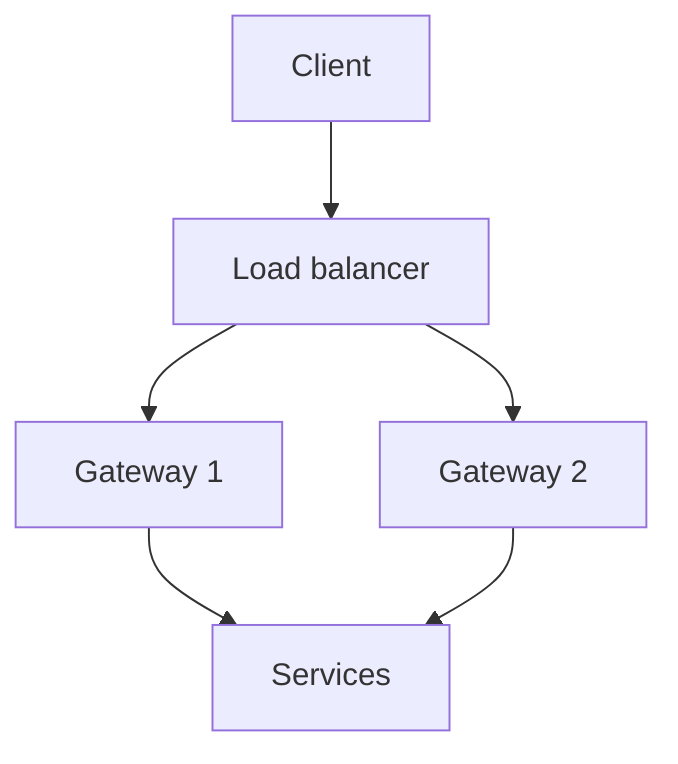

import { SummaryBox, Checklist, FAQSection } from '@site/src/components/SEO';

# 18.4 — 3. API Gateway — YARP (ưu tiên .NET)

<SummaryBox>
Gateway là **cửa vào duy nhất** của hệ thống: nó gom những mối quan tâm chung — TLS, xác thực, rate limit, correlation id — vào một chỗ, để mỗi service không phải tự làm lại. [YARP](https://microsoft.github.io/reverse-proxy/) là lựa chọn mặc định trên .NET vì nó là một thư viện ASP.NET Core, nên bạn dùng đúng middleware, DI và cấu hình đã biết. Nhưng gateway có **hai cái bẫy lớn**. Thứ nhất: nó rất dễ trở thành **nơi chứa logic nghiệp vụ** — mỗi lần thêm một chút "chỉ một if thôi" cho tới khi nó thành monolith mới mà mọi đội đều phải sửa. Thứ hai, quan trọng hơn: **gateway là điểm chết đơn**. Gateway sập thì **toàn bộ** hệ thống sập, kể cả khi mọi service phía sau đều khoẻ mạnh — nên nó phải chạy nhiều instance ngay từ đầu.
</SummaryBox>

## Mục tiêu bài học

Sau bài này bạn có thể:

- Phân định rõ việc gateway làm và việc gateway không được làm.
- Cấu hình YARP với route, cluster, health check và transform.
- Đặt xác thực và rate limit đúng chỗ.
- Tránh biến gateway thành điểm chết đơn.
- Chọn giữa gateway và BFF.

## Nội dung bài học

### 18.4.1 — Gateway làm gì

| Nên làm ở gateway | Vì sao |
|---|---|
| TLS termination | Một chỗ quản lý chứng chỉ |
| Xác thực JWT | Mọi service không phải tự làm lại |
| Rate limiting | Chặn lạm dụng trước khi vào hệ thống |
| Correlation id | Sinh một lần, truyền xuyên suốt |
| Định tuyến và cân bằng tải | Client chỉ cần biết một địa chỉ |
| CORS | Một chính sách thống nhất |
| Nén phản hồi | Giảm băng thông ở biên |

**Tuyệt đối không làm ở gateway:**

```csharp
// SAI — logic nghiep vu trong gateway
app.MapPost("/api/orders", async (OrderRequest req, HttpContext ctx) =>
{
    if (req.Total > 10_000_000)
        await _approvalService.RequestApprovalAsync(req);      // quy tac nghiep vu!

    var customer = await _customerClient.GetAsync(req.CustomerId);
    if (customer.IsBlacklisted) return Results.Forbid();       // quy tac nghiep vu!

    return await _orderClient.CreateAsync(req);
});
```

Vấn đề cụ thể: quy tắc "đơn trên 10 triệu cần duyệt" giờ nằm ở gateway thay vì Order Service. Đội Order **không thể** đổi quy tắc của chính mình mà không sửa gateway, và gateway thuộc về ai? Sau sáu tháng, gateway thành nơi mọi đội đều phải sửa và không ai dám sửa.

**Ranh giới đơn giản:** gateway chỉ được ra quyết định dựa trên **HTTP** (đường dẫn, header, token), không bao giờ dựa trên **nghiệp vụ** (số tiền, trạng thái khách hàng).

### 18.4.2 — YARP: cấu hình đầy đủ

```csharp
var builder = WebApplication.CreateBuilder(args);

builder.Services.AddReverseProxy()
    .LoadFromConfig(builder.Configuration.GetSection("ReverseProxy"));

builder.Services.AddAuthentication(JwtBearerDefaults.AuthenticationScheme)
    .AddJwtBearer(options =>
    {
        options.Authority = builder.Configuration["Auth:Authority"];
        options.Audience = "crm-api";
    });

builder.Services.AddRateLimiter(options =>
{
    options.AddFixedWindowLimiter("per-user", o =>
    {
        o.PermitLimit = 100;
        o.Window = TimeSpan.FromMinutes(1);
    });
});

var app = builder.Build();

app.UseAuthentication();
app.UseAuthorization();
app.UseRateLimiter();

app.MapReverseProxy();
app.Run();
```

```json
{
  "ReverseProxy": {
    "Routes": {
      "sales-route": {
        "ClusterId": "sales",
        "AuthorizationPolicy": "default",
        "RateLimiterPolicy": "per-user",
        "Match": { "Path": "/api/sales/{**catch-all}" },
        "Transforms": [
          { "PathRemovePrefix": "/api/sales" },
          { "RequestHeader": "X-Forwarded-For", "Append": "{RemoteIpAddress}" }
        ]
      },
      "billing-route": {
        "ClusterId": "billing",
        "AuthorizationPolicy": "default",
        "Match": { "Path": "/api/billing/{**catch-all}" },
        "Transforms": [ { "PathRemovePrefix": "/api/billing" } ]
      }
    },
    "Clusters": {
      "sales": {
        "LoadBalancingPolicy": "PowerOfTwoChoices",
        "HealthCheck": {
          "Active": {
            "Enabled": true,
            "Interval": "00:00:10",
            "Timeout": "00:00:05",
            "Path": "/health/ready"
          }
        },
        "Destinations": {
          "sales-1": { "Address": "http://sales-1:8080/" },
          "sales-2": { "Address": "http://sales-2:8080/" }
        }
      },
      "billing": {
        "Destinations": {
          "billing-1": { "Address": "http://billing-1:8080/" }
        }
      }
    }
  }
}
```

Ba chi tiết đáng chú ý:

- **`HealthCheck.Active`** cho YARP chủ động loại instance chết khỏi vòng cân bằng tải. Không có nó, request vẫn được gửi tới instance đã chết và người dùng nhận lỗi 502.
- **Đường dẫn health check phải là `/health/ready`**, không phải `/health/live`. Liveness chỉ nói tiến trình còn sống; readiness nói nó sẵn sàng nhận request ([bài 15.9](../../stage-04-database-production/module-15-docker-deployment/15.8-production-monitoring.mdx)).
- **`PowerOfTwoChoices`** là chính sách cân bằng tải mặc định tốt: chọn ngẫu nhiên hai đích rồi lấy cái ít tải hơn. Nó tránh được điểm yếu của round-robin (gửi đều cho cả instance đang chậm) mà không cần theo dõi toàn cục.

### 18.4.3 — Correlation id

Đây là thứ **phải có** trước khi tách service, và gateway là nơi đúng để sinh nó.

```csharp
app.Use(async (context, next) =>
{
    var correlationId = context.Request.Headers["X-Correlation-ID"].FirstOrDefault()
        ?? Activity.Current?.TraceId.ToString()
        ?? Guid.NewGuid().ToString();

    context.Request.Headers["X-Correlation-ID"] = correlationId;
    context.Response.Headers["X-Correlation-ID"] = correlationId;

    using (LogContext.PushProperty("CorrelationId", correlationId))
    {
        await next();
    }
});
```

Trả correlation id **về trong response header** là chi tiết nhỏ nhưng giá trị lớn: người dùng báo lỗi kèm mã đó, và bạn tìm được toàn bộ luồng trong log chỉ bằng một truy vấn.

YARP tự động chuyển tiếp header `traceparent` theo chuẩn W3C Trace Context, nên nếu đã bật OpenTelemetry thì trace xuyên service hoạt động mà không cần cấu hình thêm ([bài 18.6](18.5-observability-three-pillars.mdx)).

### 18.4.4 — Gateway là điểm chết đơn



Bốn yêu cầu bắt buộc, không phải tuỳ chọn:

1. **Ít nhất 2 instance**, đứng sau một load balancer.
2. **Không giữ trạng thái.** Mọi thông tin phiên phải nằm trong token hoặc store dùng chung, nếu không mỗi instance sẽ trả kết quả khác nhau.
3. **Nhẹ.** Mỗi mili giây ở gateway cộng vào **mọi** request của hệ thống.
4. **Giám sát riêng.** Gateway chậm thì mọi thứ chậm, và biểu đồ của từng service sẽ trông hoàn toàn bình thường.

```csharp
// Timeout o gateway PHAI ngan hon timeout cua client
builder.Services.AddHttpClient("yarp")
    .ConfigureHttpClient(c => c.Timeout = TimeSpan.FromSeconds(30));
```

Nếu client chờ 30 giây còn gateway chờ 60, client bỏ cuộc trước nhưng gateway vẫn giữ kết nối tới service — và dưới tải cao, số kết nối treo đó sẽ làm cạn tài nguyên gateway.

### 18.4.5 — Gateway hay BFF

| | API Gateway | BFF (Backend for Frontend) |
|---|---|---|
| Số lượng | Một cho cả hệ thống | Một cho **mỗi loại client** |
| Nhiệm vụ | Định tuyến, mối quan tâm chung | Ghép dữ liệu, cắt gọt cho UI cụ thể |
| Logic | Không có logic nghiệp vụ | Có logic ghép và biến đổi |
| Chủ sở hữu | Đội nền tảng | **Đội frontend tương ứng** |

[BFF](https://learn.microsoft.com/en-us/azure/architecture/patterns/backends-for-frontends) giải một vấn đề cụ thể: web và mobile cần dữ liệu khác nhau. Mobile cần payload gọn để tiết kiệm băng thông, web cần đầy đủ. Nhồi cả hai vào một API dẫn tới over-fetching cho bên này và thiếu dữ liệu cho bên kia.

```csharp
// BFF cho mobile — ghep va cat gon
app.MapGet("/mobile/dashboard", async (ISalesClient sales, IBillingClient billing, CancellationToken ct) =>
{
    var leadsTask = sales.GetRecentLeadsAsync(limit: 5, ct);
    var invoicesTask = billing.GetOverdueCountAsync(ct);

    await Task.WhenAll(leadsTask, invoicesTask);     // song song, không tuần tự

    return new MobileDashboardDto(
        RecentLeads: leadsTask.Result.Select(l => new LeadSummary(l.Id, l.Name)),
        OverdueInvoiceCount: invoicesTask.Result);
});
```

`Task.WhenAll` ở đây quan trọng: gọi tuần tự thì độ trễ là **tổng**, gọi song song thì độ trễ là **max** ([bài 6.6](../../stage-02-csharp-professional/module-06-async-programming/6.5-task-parallel-library.mdx)).

**Không phải hệ nào cũng cần BFF.** Nếu chỉ có một loại client, gateway là đủ và thêm BFF chỉ là thêm một tầng phải vận hành.

### 18.4.6 — Rà lại code của bạn

<Checklist
  title="Danh sách rà soát gateway"
  items={[
    { text: "Gateway không chứa quy tắc nghiệp vụ nào." },
    { text: "Quyết định ở gateway chỉ dựa trên HTTP, không dựa trên dữ liệu nghiệp vụ." },
    { text: "Có active health check và trỏ tới readiness, không phải liveness." },
    { text: "Gateway chạy ít nhất hai instance sau load balancer." },
    { text: "Gateway không giữ trạng thái cục bộ." },
    { text: "Correlation id được sinh ở gateway và trả về trong response header." },
    { text: "Timeout ở gateway ngắn hơn timeout của client." },
    { text: "Có giám sát độ trễ riêng cho gateway." },
    { text: "Nếu dùng BFF, mỗi BFF do đội frontend tương ứng sở hữu." },
  ]}
/>

## Bài tập áp dụng

1. **Dựng YARP đầy đủ.** Cấu hình hai cluster với health check chủ động. Dừng một instance và xác nhận YARP loại nó khỏi vòng cân bằng tải trong vòng 10 giây.

2. **Kiểm tra correlation id.** Gửi một request qua gateway tới service, xác nhận cùng một id xuất hiện trong log của cả hai và trong response header.

3. **Đo chi phí BFF.** Viết một endpoint BFF gọi hai service tuần tự, đo độ trễ, đổi sang `Task.WhenAll` và đo lại.

## Tự kiểm tra

<FAQSection
  items={[
    {
      question: "Ranh giới giữa việc gateway nên làm và không nên làm là gì?",
      answer: "Gateway chỉ được ra quyết định dựa trên HTTP như đường dẫn, header và token. Nó không bao giờ được quyết định dựa trên dữ liệu nghiệp vụ như số tiền hay trạng thái khách hàng, vì khi đó quy tắc của một đội nằm trong hệ thống của đội khác."
    },
    {
      question: "Vì sao active health check quan trọng với gateway?",
      answer: "Vì không có nó, gateway vẫn gửi request tới instance đã chết và người dùng nhận lỗi 502. Health check chủ động cho gateway loại instance hỏng khỏi vòng cân bằng tải trước khi có request nào bị ảnh hưởng."
    },
    {
      question: "Vì sao health check phải trỏ tới readiness chứ không phải liveness?",
      answer: "Vì liveness chỉ nói tiến trình còn sống, còn readiness nói nó sẵn sàng nhận request. Một service vừa khởi động hoặc mất kết nối database vẫn sống nhưng chưa phục vụ được, và gửi request tới đó sẽ lỗi."
    },
    {
      question: "Vì sao gateway là điểm chết đơn và xử lý thế nào?",
      answer: "Vì mọi request đều đi qua nó, nên gateway sập là cả hệ thống sập kể cả khi mọi service phía sau vẫn khoẻ. Phải chạy ít nhất hai instance sau load balancer, không giữ trạng thái cục bộ, giữ nó nhẹ, và giám sát riêng."
    },
    {
      question: "Vì sao timeout ở gateway phải ngắn hơn timeout của client?",
      answer: "Vì nếu client bỏ cuộc trước, gateway vẫn giữ kết nối tới service phía sau. Dưới tải cao, số kết nối treo đó sẽ làm cạn tài nguyên của chính gateway."
    },
    {
      question: "BFF khác gateway ở điểm nào?",
      answer: "Gateway là một cho cả hệ thống, chỉ định tuyến và xử lý mối quan tâm chung, do đội nền tảng sở hữu. BFF là một cho mỗi loại client, có logic ghép và cắt gọt dữ liệu cho UI cụ thể, và do chính đội frontend tương ứng sở hữu."
    }
  ]}
/>

## Kết luận

Ba điều đáng nhớ nhất:

1. **Gateway quyết định theo HTTP, không theo nghiệp vụ.** Đó là ranh giới giữ nó không phình ra.
2. **Hai instance là tối thiểu**, vì gateway sập là cả hệ thống sập.
3. **Correlation id sinh ở gateway và trả về cho client** — rẻ để làm, vô giá khi có sự cố.

## Tham khảo

- [YARP documentation](https://microsoft.github.io/reverse-proxy/)
- [YARP trong ASP.NET Core](https://learn.microsoft.com/en-us/aspnet/core/fundamentals/servers/yarp/getting-started)
- [Backends for Frontends pattern](https://learn.microsoft.com/en-us/azure/architecture/patterns/backends-for-frontends)
- [Gateway Offloading pattern](https://learn.microsoft.com/en-us/azure/architecture/patterns/gateway-offloading)

## Điều hướng

- **Bài trước:** [18.2 — 2. Service decomposition](18.2-service-decomposition.mdx)
- **Bài tiếp theo:** [18.4 — 4. Giao tiếp giữa các service](18.4-inter-service-communication.mdx)
- **Về module:** [Trang mục lục](./)
