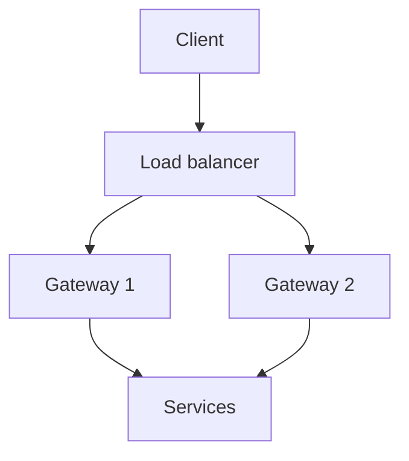

import { SummaryBox, Checklist, FAQSection } from '@site/src/components/SEO';

# 18.4 — 3. API Gateway — YARP (ưu tiên .NET)

<SummaryBox>
Gateway là **cửa vào duy nhất** của hệ thống: nó gom những mối quan tâm chung — TLS, xác thực, rate limit, correlation id — vào một chỗ, để mỗi service không phải tự làm lại. [YARP](https://microsoft.github.io/reverse-proxy/) là lựa chọn mặc định trên .NET vì nó là một thư viện ASP.NET Core, nên bạn dùng đúng middleware, DI và cấu hình đã biết. Nhưng gateway có **hai cái bẫy lớn**. Thứ nhất: nó rất dễ trở thành **nơi chứa logic nghiệp vụ** — mỗi lần thêm một chút "chỉ một if thôi" cho tới khi nó thành monolith mới mà mọi đội đều phải sửa. Thứ hai, quan trọng hơn: **gateway là điểm chết đơn**. Gateway sập thì **toàn bộ** hệ thống sập, kể cả khi mọi service phía sau đều khoẻ mạnh — nên nó phải chạy nhiều instance ngay từ đầu.
</SummaryBox>

## Mục tiêu bài học

Sau bài này bạn có thể:

- Phân định rõ việc gateway làm và việc gateway không được làm.
- Cấu hình YARP với route, cluster, health check và transform.
- Đặt xác thực và rate limit đúng chỗ.
- Tránh biến gateway thành điểm chết đơn.
- Chọn giữa gateway và BFF.

## Nội dung bài học

### 18.4.1 — Gateway làm gì

| Nên làm ở gateway | Vì sao |
|---|---|
| TLS termination | Một chỗ quản lý chứng chỉ |
| Xác thực JWT | Mọi service không phải tự làm lại |
| Rate limiting | Chặn lạm dụng trước khi vào hệ thống |
| Correlation id | Sinh một lần, truyền xuyên suốt |
| Định tuyến và cân bằng tải | Client chỉ cần biết một địa chỉ |
| CORS | Một chính sách thống nhất |
| Nén phản hồi | Giảm băng thông ở biên |

**Tuyệt đối không làm ở gateway:**

```csharp
// SAI — logic nghiep vu trong gateway
app.MapPost("/api/orders", async (OrderRequest req, HttpContext ctx) =>
{
    if (req.Total > 10_000_000)
        await _approvalService.RequestApprovalAsync(req);      // quy tac nghiep vu!

    var customer = await _customerClient.GetAsync(req.CustomerId);
    if (customer.IsBlacklisted) return Results.Forbid();       // quy tac nghiep vu!

    return await _orderClient.CreateAsync(req);
});
```

Vấn đề cụ thể: quy tắc "đơn trên 10 triệu cần duyệt" giờ nằm ở gateway thay vì Order Service. Đội Order **không thể** đổi quy tắc của chính mình mà không sửa gateway, và gateway thuộc về ai? Sau sáu tháng, gateway thành nơi mọi đội đều phải sửa và không ai dám sửa.

**Ranh giới đơn giản:** gateway chỉ được ra quyết định dựa trên **HTTP** (đường dẫn, header, token), không bao giờ dựa trên **nghiệp vụ** (số tiền, trạng thái khách hàng).

### 18.4.2 — YARP: cấu hình đầy đủ

```csharp
var builder = WebApplication.CreateBuilder(args);

builder.Services.AddReverseProxy()
    .LoadFromConfig(builder.Configuration.GetSection("ReverseProxy"));

builder.Services.AddAuthentication(JwtBearerDefaults.AuthenticationScheme)
    .AddJwtBearer(options =>
    {
        options.Authority = builder.Configuration["Auth:Authority"];
        options.Audience = "crm-api";
    });

builder.Services.AddRateLimiter(options =>
{
    options.AddFixedWindowLimiter("per-user", o =>
    {
        o.PermitLimit = 100;
        o.Window = TimeSpan.FromMinutes(1);
    });
});

var app = builder.Build();

app.UseAuthentication();
app.UseAuthorization();
app.UseRateLimiter();

app.MapReverseProxy();
app.Run();
```

```json
{
  "ReverseProxy": {
    "Routes": {
      "sales-route": {
        "ClusterId": "sales",
        "AuthorizationPolicy": "default",
        "RateLimiterPolicy": "per-user",
        "Match": { "Path": "/api/sales/{**catch-all}" },
        "Transforms": [
          { "PathRemovePrefix": "/api/sales" },
          { "RequestHeader": "X-Forwarded-For", "Append": "{RemoteIpAddress}" }
        ]
      },
      "billing-route": {
        "ClusterId": "billing",
        "AuthorizationPolicy": "default",
        "Match": { "Path": "/api/billing/{**catch-all}" },
        "Transforms": [ { "PathRemovePrefix": "/api/billing" } ]
      }
    },
    "Clusters": {
      "sales": {
        "LoadBalancingPolicy": "PowerOfTwoChoices",
        "HealthCheck": {
          "Active": {
            "Enabled": true,
            "Interval": "00:00:10",
            "Timeout": "00:00:05",
            "Path": "/health/ready"
          }
        },
        "Destinations": {
          "sales-1": { "Address": "http://sales-1:8080/" },
          "sales-2": { "Address": "http://sales-2:8080/" }
        }
      },
      "billing": {
        "Destinations": {
          "billing-1": { "Address": "http://billing-1:8080/" }
        }
      }
    }
  }
}
```

Ba chi tiết đáng chú ý:

- **`HealthCheck.Active`** cho YARP chủ động loại instance chết khỏi vòng cân bằng tải. Không có nó, request vẫn được gửi tới instance đã chết và người dùng nhận lỗi 502.
- **Đường dẫn health check phải là `/health/ready`**, không phải `/health/live`. Liveness chỉ nói tiến trình còn sống; readiness nói nó sẵn sàng nhận request ([bài 15.9](../../stage-04-database-production/module-15-docker-deployment/15.8-production-monitoring.mdx)).
- **`PowerOfTwoChoices`** là chính sách cân bằng tải mặc định tốt: chọn ngẫu nhiên hai đích rồi lấy cái ít tải hơn. Nó tránh được điểm yếu của round-robin (gửi đều cho cả instance đang chậm) mà không cần theo dõi toàn cục.

### 18.4.3 — Correlation id

Đây là thứ **phải có** trước khi tách service, và gateway là nơi đúng để sinh nó.

```csharp
app.Use(async (context, next) =>
{
    var correlationId = context.Request.Headers["X-Correlation-ID"].FirstOrDefault()
        ?? Activity.Current?.TraceId.ToString()
        ?? Guid.NewGuid().ToString();

    context.Request.Headers["X-Correlation-ID"] = correlationId;
    context.Response.Headers["X-Correlation-ID"] = correlationId;

    using (LogContext.PushProperty("CorrelationId", correlationId))
    {
        await next();
    }
});
```

Trả correlation id **về trong response header** là chi tiết nhỏ nhưng giá trị lớn: người dùng báo lỗi kèm mã đó, và bạn tìm được toàn bộ luồng trong log chỉ bằng một truy vấn.

YARP tự động chuyển tiếp header `traceparent` theo chuẩn W3C Trace Context, nên nếu đã bật OpenTelemetry thì trace xuyên service hoạt động mà không cần cấu hình thêm ([bài 18.6](18.5-observability-three-pillars.mdx)).

### 18.4.4 — Gateway là điểm chết đơn



Bốn yêu cầu bắt buộc, không phải tuỳ chọn:

1. **Ít nhất 2 instance**, đứng sau một load balancer.
2. **Không giữ trạng thái.** Mọi thông tin phiên phải nằm trong token hoặc store dùng chung, nếu không mỗi instance sẽ trả kết quả khác nhau.
3. **Nhẹ.** Mỗi mili giây ở gateway cộng vào **mọi** request của hệ thống.
4. **Giám sát riêng.** Gateway chậm thì mọi thứ chậm, và biểu đồ của từng service sẽ trông hoàn toàn bình thường.

```csharp
// Timeout o gateway PHAI ngan hon timeout cua client
builder.Services.AddHttpClient("yarp")
    .ConfigureHttpClient(c => c.Timeout = TimeSpan.FromSeconds(30));
```

Nếu client chờ 30 giây còn gateway chờ 60, client bỏ cuộc trước nhưng gateway vẫn giữ kết nối tới service — và dưới tải cao, số kết nối treo đó sẽ làm cạn tài nguyên gateway.

### 18.4.5 — Gateway hay BFF

| | API Gateway | BFF (Backend for Frontend) |
|---|---|---|
| Số lượng | Một cho cả hệ thống | Một cho **mỗi loại client** |
| Nhiệm vụ | Định tuyến, mối quan tâm chung | Ghép dữ liệu, cắt gọt cho UI cụ thể |
| Logic | Không có logic nghiệp vụ | Có logic ghép và biến đổi |
| Chủ sở hữu | Đội nền tảng | **Đội frontend tương ứng** |

[BFF](https://learn.microsoft.com/en-us/azure/architecture/patterns/backends-for-frontends) giải một vấn đề cụ thể: web và mobile cần dữ liệu khác nhau. Mobile cần payload gọn để tiết kiệm băng thông, web cần đầy đủ. Nhồi cả hai vào một API dẫn tới over-fetching cho bên này và thiếu dữ liệu cho bên kia.

```csharp
// BFF cho mobile — ghep va cat gon
app.MapGet("/mobile/dashboard", async (ISalesClient sales, IBillingClient billing, CancellationToken ct) =>
{
    var leadsTask = sales.GetRecentLeadsAsync(limit: 5, ct);
    var invoicesTask = billing.GetOverdueCountAsync(ct);

    await Task.WhenAll(leadsTask, invoicesTask);     // song song, không tuần tự

    return new MobileDashboardDto(
        RecentLeads: leadsTask.Result.Select(l => new LeadSummary(l.Id, l.Name)),
        OverdueInvoiceCount: invoicesTask.Result);
});
```

`Task.WhenAll` ở đây quan trọng: gọi tuần tự thì độ trễ là **tổng**, gọi song song thì độ trễ là **max** ([bài 6.6](../../stage-02-csharp-professional/module-06-async-programming/6.5-task-parallel-library.mdx)).

**Không phải hệ nào cũng cần BFF.** Nếu chỉ có một loại client, gateway là đủ và thêm BFF chỉ là thêm một tầng phải vận hành.

### 18.4.6 — Rà lại code của bạn

<Checklist
  title="Danh sách rà soát gateway"
  items={[
    { text: "Gateway không chứa quy tắc nghiệp vụ nào." },
    { text: "Quyết định ở gateway chỉ dựa trên HTTP, không dựa trên dữ liệu nghiệp vụ." },
    { text: "Có active health check và trỏ tới readiness, không phải liveness." },
    { text: "Gateway chạy ít nhất hai instance sau load balancer." },
    { text: "Gateway không giữ trạng thái cục bộ." },
    { text: "Correlation id được sinh ở gateway và trả về trong response header." },
    { text: "Timeout ở gateway ngắn hơn timeout của client." },
    { text: "Có giám sát độ trễ riêng cho gateway." },
    { text: "Nếu dùng BFF, mỗi BFF do đội frontend tương ứng sở hữu." },
  ]}
/>

## Bài tập áp dụng

#### Bài 1 — Dựng YARP với health check chủ động

Cấu hình hai cluster với health check chủ động. Dừng một instance và xác nhận YARP loại nó khỏi vòng cân bằng tải trong vòng 10 giây.

**Tiêu chí hoàn thành:** bạn đo được thời gian loại bỏ, và phân biệt được health check **chủ động** với **thụ động**.

<details>
<summary><strong>Gợi ý và lời giải — Bài 1</strong></summary>

**Gợi ý.** Gateway biết một instance chết bằng cách nào — hỏi nó, hay chờ một request thất bại?

**Lời giải — cấu hình:**

```json
{
  "ReverseProxy": {
    "Routes": {
      "leads-route": {
        "ClusterId": "leads-cluster",
        "Match": { "Path": "/api/leads/{**catch-all}" },
        "Transforms": [
          { "PathPattern": "/leads/{**catch-all}" },
          { "RequestHeader": "X-Forwarded-Prefix", "Set": "/api" }
        ]
      },
      "billing-route": {
        "ClusterId": "billing-cluster",
        "Match": { "Path": "/api/billing/{**catch-all}" },
        "Transforms": [{ "PathPattern": "/billing/{**catch-all}" }]
      }
    },
    "Clusters": {
      "leads-cluster": {
        "LoadBalancingPolicy": "PowerOfTwoChoices",
        "HealthCheck": {
          "Active": {
            "Enabled": true,
            "Interval": "00:00:05",
            "Timeout": "00:00:02",
            "Policy": "ConsecutiveFailures",
            "Path": "/health/ready"
          },
          "Passive": {
            "Enabled": true,
            "Policy": "TransportFailureRate",
            "ReactivationPeriod": "00:00:30"
          }
        },
        "Metadata": {
          "ConsecutiveFailuresHealthPolicy.Threshold": "2"
        },
        "Destinations": {
          "leads-1": { "Address": "http://leads-1:8080/" },
          "leads-2": { "Address": "http://leads-2:8080/" },
          "leads-3": { "Address": "http://leads-3:8080/" }
        }
      }
    }
  }
}
```

```csharp
builder.Services.AddReverseProxy()
    .LoadFromConfig(builder.Configuration.GetSection("ReverseProxy"))
    .AddTransforms(b => b.AddRequestTransform(async ctx =>
    {
        var correlationId = ctx.HttpContext.Request.Headers["X-Correlation-Id"].FirstOrDefault()
                            ?? Activity.Current?.TraceId.ToString()
                            ?? Guid.CreateVersion7().ToString();
        ctx.ProxyRequest.Headers.Remove("X-Correlation-Id");
        ctx.ProxyRequest.Headers.Add("X-Correlation-Id", correlationId);
        await Task.CompletedTask;
    }));

app.MapReverseProxy();
```

```bash
watch -n 1 'curl -s http://gateway:8080/api/leads/ping'
docker stop leads-2
```

```text
[08:14:22] leads-1 OK
[08:14:23] leads-2 OK
[08:14:24] docker stop leads-2
[08:14:25] leads-3 OK
[08:14:26] ERROR — Bad Gateway          <- request rơi vào leads-2 đã chết
[08:14:27] leads-1 OK
[08:14:29] ERROR — Bad Gateway
[08:14:31] leads-1 OK                   <- health check thứ 2 thất bại, YARP loại leads-2
[08:14:32] leads-3 OK
[08:14:33] leads-1 OK
```

```text
Thời gian loại bỏ: khoảng 7 giây (2 lần health check × 5 giây interval)
Số request lỗi:    2
```

**Giảm xuống dưới 10 giây:**

```json
"Active": {
  "Interval": "00:00:03",
  "Timeout": "00:00:01"
},
"Metadata": { "ConsecutiveFailuresHealthPolicy.Threshold": "2" }
```

```text
Thời gian loại bỏ: khoảng 4 giây
```

Nhưng đừng giảm quá tay:

```text
Interval 1 giây × 3 destination × 5 cluster = 15 request/giây chỉ cho health check
-> tốn tài nguyên, và có thể làm nhiễu số liệu của service
```

**Chủ động và thụ động — khác biệt và vì sao cần cả hai:**

| | Chủ động (Active) | Thụ động (Passive) |
|---|---|---|
| Cách hoạt động | **Gateway gọi** `/health/ready` định kỳ | **Quan sát** request thật |
| Phát hiện | Trước khi có request lỗi | Sau khi đã có request lỗi |
| Chi phí | Request thêm, liên tục | **Không có** |
| Phát hiện lỗi từng phần | Không — endpoint health có thể OK | **Có** |
| Instance vừa khởi động | Biết khi nào sẵn sàng | Không biết |

```text
Chủ động BẮT ĐƯỢC:
    instance chết hẳn, đang khởi động, database mất kết nối
Chủ động KHÔNG BẮT ĐƯỢC:
    endpoint /health/ready trả 200 nhưng endpoint nghiệp vụ trả 500
    -> instance "khoẻ" theo health check, nhưng hỏng với người dùng

Thụ động BẮT ĐƯỢC:
    tỷ lệ lỗi của request THẬT vượt ngưỡng
```

Đây là lý do cần cả hai: chủ động phát hiện **sớm**, thụ động phát hiện **đúng**.

```json
"Passive": {
  "Enabled": true,
  "Policy": "TransportFailureRate",
  "ReactivationPeriod": "00:00:30"
},
"Metadata": {
  "TransportFailureRateHealthPolicy.RateLimit": "0.3"
}
```

```text
Tỷ lệ lỗi vận chuyển vượt 30% -> loại destination
Sau 30 giây -> đưa lại vào vòng và quan sát tiếp
```

**Ba chi tiết cấu hình quan trọng:**

**1. `Path` phải trỏ vào readiness, không phải liveness:**

```json
"Path": "/health/ready"
```

```text
/health/live  -> chỉ kiểm tra tiến trình sống -> luôn 200 -> vô dụng cho gateway
/health/ready -> kiểm tra dependency -> ĐÚNG
```

**2. `LoadBalancingPolicy`:**

| Policy | Cách chọn | Dùng khi |
|---|---|---|
| `PowerOfTwoChoices` | Chọn 2 ngẫu nhiên, lấy cái ít tải hơn | **Mặc định tốt** |
| `RoundRobin` | Luân phiên | Request đồng đều |
| `LeastRequests` | Ít request đang chạy nhất | Thời gian xử lý rất khác nhau |
| `Random` | Ngẫu nhiên | — |
| `FirstAlphabetical` | Luôn cái đầu | Chỉ để debug |

`PowerOfTwoChoices` là lựa chọn tốt trong phần lớn trường hợp: nó gần bằng `LeastRequests` về chất lượng phân bổ nhưng rẻ hơn nhiều về chi phí tính toán.

**3. Timeout phải nhỏ hơn interval:**

```json
"Interval": "00:00:05",
"Timeout": "00:00:02"       // nhỏ hơn interval
```

Timeout lớn hơn interval nghĩa là các lần kiểm tra chồng lên nhau.

**Và cảnh báo lớn nhất: gateway là điểm chết đơn.**

```text
Gateway chết -> TOÀN BỘ hệ thống không truy cập được
-> dù mọi service phía sau đều khoẻ
```

Ba biện pháp:

```yaml
# 1. Nhiều instance gateway
spec:
  replicas: 3
  strategy:
    rollingUpdate: { maxUnavailable: 0, maxSurge: 1 }
```

```csharp
// 2. Gateway phải CỰC nhẹ — không logic nghiệp vụ, không gọi database
// KHÔNG làm thế này ở gateway:
var user = await _db.Users.FirstAsync(u => u.Id == userId, ct);
```

```yaml
# 3. PodDisruptionBudget
apiVersion: policy/v1
kind: PodDisruptionBudget
spec:
  minAvailable: 2
  selector: { matchLabels: { app: gateway } }
```

**Ba thứ gateway TUYỆT ĐỐI không được làm:**

```text
1. Logic nghiệp vụ    -> nó thành một service nữa, và là service ai cũng phụ thuộc
2. Gọi database       -> thêm điểm lỗi, thêm độ trễ cho MỌI request
3. Lưu trạng thái     -> không scale được, không thay thế được instance
```

Gateway chỉ nên làm bốn việc: **định tuyến, cân bằng tải, xác thực token (chỉ xác minh chữ ký), và thêm correlation id.**

**Quan sát:**

```csharp
builder.Services.AddOpenTelemetry().WithMetrics(m => m
    .AddMeter("Yarp.ReverseProxy")
    .AddPrometheusExporter());
```

```promql
# Destination nào đang bị loại?
yarp_proxy_current_requests{destination="leads-2"}

# Tỷ lệ lỗi theo cluster
rate(yarp_proxy_requests_failed_total[5m]) / rate(yarp_proxy_requests_started_total[5m])
```

</details>

---

#### Bài 2 — Kiểm tra correlation id

Gửi một request qua gateway tới service, xác nhận cùng một id xuất hiện trong log của cả hai và trong response header.

**Tiêu chí hoàn thành:** bạn nối được log của hai thành phần, và biết vì sao `trace_id` của OpenTelemetry **tốt hơn** correlation id tự sinh.

<details>
<summary><strong>Gợi ý và lời giải — Bài 2</strong></summary>

**Gợi ý.** Correlation id nối được log. Nó có cho bạn biết thời gian của từng chặng không?

**Lời giải — cấu hình ở gateway:**

```csharp
app.Use(async (ctx, next) =>
{
    var id = ctx.Request.Headers["X-Correlation-Id"].FirstOrDefault()
             ?? Guid.CreateVersion7().ToString();

    ctx.Items["CorrelationId"] = id;
    ctx.Response.Headers["X-Correlation-Id"] = id;

    using var scope = logger.BeginScope(new Dictionary<string, object>
    {
        ["CorrelationId"] = id,
    });

    await next();
});
```

```csharp
.AddTransforms(b => b.AddRequestTransform(ctx =>
{
    var id = (string)ctx.HttpContext.Items["CorrelationId"]!;
    ctx.ProxyRequest.Headers.Remove("X-Correlation-Id");
    ctx.ProxyRequest.Headers.Add("X-Correlation-Id", id);
    return default;
}));
```

```csharp
// Ở service — đọc và đưa vào log scope
app.Use(async (ctx, next) =>
{
    var id = ctx.Request.Headers["X-Correlation-Id"].FirstOrDefault() ?? "không-có";
    using var scope = logger.BeginScope(new Dictionary<string, object> { ["CorrelationId"] = id });
    await next();
});
```

```bash
curl -i http://gateway:8080/api/leads/abc-123
```

```text
HTTP/1.1 200 OK
X-Correlation-Id: 0192f8a3-1234-7890-abcd-ef1234567890
```

```bash
kubectl logs -l app=gateway | grep 0192f8a3
kubectl logs -l app=leads   | grep 0192f8a3
```

```text
[gateway] {"CorrelationId":"0192f8a3-...","msg":"Định tuyến tới leads-cluster"}
[leads]   {"CorrelationId":"0192f8a3-...","msg":"Nạp lead abc-123"}
[leads]   {"CorrelationId":"0192f8a3-...","msg":"Trả về LeadDto"}
```

**Vì sao `trace_id` của OpenTelemetry tốt hơn:**

| | Correlation id tự sinh | `trace_id` OpenTelemetry |
|---|---|---|
| Nối log | **Có** | **Có** |
| **Thời gian từng chặng** | **Không** | **Có** |
| **Quan hệ cha-con** | **Không** | **Có** |
| Truyền qua message broker | Phải tự viết | **Tự động** |
| Truyền qua database | Không | Có (với instrumentation) |
| Chuẩn | Tự định nghĩa | **W3C Trace Context** |
| Công cụ đọc | grep | **Jaeger, Tempo, Azure Monitor** |

Hai dòng in đậm là khác biệt quyết định:

```text
Correlation id nói:  "những dòng log này thuộc cùng một request"
Trace nói:           "request này mất 2.184 ms, trong đó 1.892 ms ở lời gọi
                      tới billing-service, và trong đó 1.740 ms ở một truy vấn SQL"
```

Với correlation id, bạn **ghép log và tự tính thời gian**. Với trace, thời gian đã được đo và cấu trúc đã có sẵn.

**Cấu hình OpenTelemetry — và bỏ correlation id tự viết:**

```csharp
builder.Services.AddOpenTelemetry()
    .ConfigureResource(r => r.AddService("crm-gateway", serviceVersion: version))
    .WithTracing(t => t
        .AddAspNetCoreInstrumentation()
        .AddHttpClientInstrumentation()
        .AddSource("Yarp.ReverseProxy")
        .AddOtlpExporter());

builder.Logging.AddOpenTelemetry(o =>
{
    o.IncludeScopes = true;
    o.IncludeFormattedMessage = true;
    o.AddOtlpExporter();
});
```

**Context được truyền tự động qua header chuẩn W3C:**

```text
traceparent: 00-4bf92f3577b34da6a3ce929d0e0e4736-00f067aa0ba902b7-01
             ^^ ^^^^^^^^^^^^^^^^^^^^^^^^^^^^^^^^ ^^^^^^^^^^^^^^^^ ^^
             |  trace-id (32 hex)                span-id          flags
             version
```

`HttpClient` của .NET **tự động** thêm header này — không cần transform nào ở YARP.

```json
{"timestamp":"2026-09-25T08:14:22Z","level":"Information",
 "message":"Nạp lead abc-123",
 "trace_id":"4bf92f3577b34da6a3ce929d0e0e4736",
 "span_id":"00f067aa0ba902b7",
 "service.name":"crm-leads"}
```

```text
Waterfall trong Jaeger:

GET /api/leads/abc-123                                    2.184 ms  ████████████████████
├─ [gateway] proxy to leads-cluster                       2.170 ms  ███████████████████░
│  └─ [leads] GET /leads/abc-123                          2.142 ms  ███████████████████░
│     ├─ SELECT Leads WHERE Id = @p0                         14 ms  █
│     └─ [leads] HTTP GET billing/khach-hang/xyz           1.892 ms  █████████████████░
│        └─ [billing] GET /khach-hang/xyz                  1.874 ms  █████████████████░
│           └─ SELECT ... FROM Customers                   1.740 ms  ████████████████░
```

Nhìn một lần là thấy nút thắt: một truy vấn SQL ở billing chiếm 80% tổng thời gian.

**Vẫn giữ `X-Correlation-Id` ở response header** — để người dùng báo lỗi có thể đưa cho bạn một id:

```csharp
app.Use(async (ctx, next) =>
{
    await next();
    if (Activity.Current is { } a)
        ctx.Response.Headers["X-Trace-Id"] = a.TraceId.ToString();
});
```

```text
Người dùng: "Tôi gặp lỗi, mã là 4bf92f3577b34da6a3ce929d0e0e4736"
-> dán vào Jaeger -> thấy toàn bộ request trong 5 giây
```

Đây là cải thiện lớn cho quy trình hỗ trợ: thay vì "lỗi lúc khoảng 2 giờ chiều", bạn có một định danh chính xác.

**Ba chi tiết dễ sai:**

**1. `IncludeScopes = true` là bắt buộc** — không có nó, `trace_id` không xuất hiện trong log.

**2. Truyền context qua message broker.** MassTransit làm tự động, nhưng nếu tự viết:

```csharp
// Khi publish
var context = new Dictionary<string, string>();
Propagators.DefaultTextMapPropagator.Inject(
    new PropagationContext(Activity.Current!.Context, Baggage.Current),
    context, (d, k, v) => d[k] = v);
message.Headers = context;

// Khi consume
var parent = Propagators.DefaultTextMapPropagator.Extract(
    default, message.Headers, (d, k) => d.TryGetValue(k, out var v) ? [v] : []);
using var activity = _source.StartActivity("consume", ActivityKind.Consumer, parent.ActivityContext);
```

**3. Lưu trace context vào outbox.** Message nằm trong outbox vài giây, và context phải được lưu cùng:

```csharp
public static TinNhanOutbox Tao<T>(T message) where T : class => new()
{
    // ...
    TraceParent = Activity.Current?.Id,       // định dạng W3C
};
```

Không có nó, trace bị đứt làm hai: một phần cho request HTTP, một phần cho dispatcher ([bài 17.7](../module-17-distributed-systems/17.7-outbox-idempotency-demo.mdx)).

**Và sampling — đừng ghi 100% trace ở production:**

```yaml
# OpenTelemetry Collector — tail-based sampling
processors:
  tail_sampling:
    decision_wait: 10s
    policies:
      - name: giu-loi
        type: status_code
        status_code: { status_codes: [ERROR] }
      - name: giu-cham
        type: latency
        latency: { threshold_ms: 1000 }
      - name: con-lai
        type: probabilistic
        probabilistic: { sampling_percentage: 5 }
```

Giữ 100% trace lỗi và trace chậm — đó chính là những trace bạn cần — và 5% phần còn lại để có cơ sở so sánh.

</details>

---

#### Bài 3 — Đo chi phí BFF

Viết một endpoint BFF gọi hai service tuần tự, đo độ trễ, đổi sang `Task.WhenAll` và đo lại.

**Tiêu chí hoàn thành:** bạn đo được cả hai, và nêu được **ba** vấn đề khác của BFF ngoài độ trễ.

<details>
<summary><strong>Gợi ý và lời giải — Bài 3</strong></summary>

**Gợi ý.** Hai lời gọi độc lập chạy tuần tự mất bao lâu? Chạy song song thì sao?

**Lời giải — tuần tự:**

```csharp
app.MapGet("/bff/lead-tong-quan/{id}", async (
    Guid id, ILeadClient leads, IBillingClient billing, CancellationToken ct) =>
{
    var lead = await leads.LayAsync(id, ct);                        // 180 ms
    if (lead is null) return Results.NotFound();

    var hoaDon = await billing.LayHoaDonAsync(lead.CustomerId, ct); // 240 ms

    return Results.Ok(new LeadTongQuanDto(lead, hoaDon));
});
```

```bash
hey -n 500 -c 10 http://gateway:8080/bff/lead-tong-quan/abc-123
```

```text
Latency distribution:
  50% in 0.4180 secs
  95% in 0.4890 secs
  99% in 0.6120 secs
```

**Song song — nhưng chỉ khi các lời gọi ĐỘC LẬP:**

Đoạn tuần tự ở trên **không** song song hoá được, vì `billing.LayHoaDonAsync` cần
`lead.CustomerId` — thứ chỉ có sau khi lời gọi đầu tiên xong. Đây là một phụ thuộc
thật, và cách sửa là ở **thiết kế API**, không ở `Task.WhenAll`:

```csharp
// Billing nhận leadId thay vì customerId -> hai lời gọi trở nên ĐỘC LẬP
app.MapGet("/billing/hoa-don-theo-lead/{leadId}", ...);
```

```csharp
app.MapGet("/bff/lead-tong-quan/{id}", async (
    Guid id, ILeadClient leads, IBillingClient billing, CancellationToken ct) =>
{
    var leadTask  = leads.LayAsync(id, ct);                    // 180 ms
    var hoaDonTask = billing.LayHoaDonTheoLeadAsync(id, ct);   // 240 ms

    await Task.WhenAll(leadTask, hoaDonTask);                  // chạy CÙNG LÚC

    var lead = await leadTask;
    if (lead is null) return Results.NotFound();

    return Results.Ok(new LeadTongQuanDto(lead, await hoaDonTask));
});
```

```text
Latency distribution:
  50% in 0.2410 secs
  95% in 0.2980 secs
  99% in 0.3840 secs
```

**Từ 418 ms xuống 241 ms — nhanh 42%.** Tổng thời gian giờ bằng **lời gọi chậm nhất**
(240 ms) thay vì **tổng hai lời gọi** (180 + 240 = 420 ms).

```text
Tuần tự:   [leads 180ms][billing 240ms]           = 420 ms
Song song: [leads 180ms]                           = max(180, 240)
           [billing 240ms]                         = 240 ms
```

**Và đây là bài học quan trọng hơn con số: phụ thuộc giữa các lời gọi là vấn đề THIẾT KẾ API.**

```text
Billing nhận customerId  -> BFF phải gọi leads trước -> tuần tự bắt buộc
Billing nhận leadId      -> hai lời gọi độc lập      -> song song được
```

Khi thiết kế API cho service, hãy hỏi: *"client sẽ gọi endpoint này cùng lúc với
endpoint nào khác?"* — và nhận tham số sao cho chúng không phụ thuộc nhau.

Với chuỗi phụ thuộc thật sự không phá được, hãy vẽ ra để biết giới hạn:

```text
Tầng 1 (song song):  leads.LayAsync      180 ms
                     leads.LayHoatDong   120 ms   -> max = 180 ms
Tầng 2 (song song):  billing.LayHoaDon   240 ms
                     customers.LayAsync   90 ms   -> max = 240 ms

Tổng tối thiểu = 180 + 240 = 420 ms
```

Con số này là **sàn** — không tối ưu xuống dưới được mà không đổi thiết kế API.

**Ba vấn đề khác của BFF ngoài độ trễ:**

**Vấn đề 1 — xử lý lỗi từng phần.**

```csharp
await Task.WhenAll(hoaDonTask, khachTask);
```

```text
Nếu billing chết:
    Task.WhenAll ném exception
    -> TOÀN BỘ endpoint trả 500
    -> người dùng không thấy gì, kể cả thông tin lead vốn đã lấy được
```

```csharp
// Xử lý từng phần — trả về những gì lấy được
var ketQua = await Task.WhenAll(
    LayAnToanAsync(() => billing.LayHoaDonAsync(lead.CustomerId, ct)),
    LayAnToanAsync(() => customers.LayAsync(lead.CustomerId, ct)));

return Results.Ok(new LeadTongQuanDto
{
    Lead = lead,
    HoaDon = ketQua[0] as List<HoaDonDto>,          // null nếu billing chết
    KhachHang = ketQua[1] as KhachHangDto,
    CanhBao = ketQua.Any(r => r is null)
        ? "Một số thông tin tạm thời không khả dụng" : null,
});
```

```csharp
private static async Task<object?> LayAnToanAsync<T>(Func<Task<T>> goi)
{
    try { return await goi(); }
    catch (Exception ex) { _logger.LogWarning(ex, "Lấy dữ liệu thất bại"); return null; }
}
```

**Suy giảm có kiểm soát** tốt hơn nhiều so với lỗi toàn phần: người dùng thấy thông tin lead và một dòng cảnh báo, thay vì một trang lỗi.

**Vấn đề 2 — BFF nhân lên số lời gọi, và dễ thành N+1 qua mạng.**

```csharp
// SAI — N+1 qua mạng
var leads = await leadClient.LayDanhSachAsync(ct);          // 1 lời gọi

var ketQua = new List<LeadTongQuanDto>();
foreach (var lead in leads)                                  // 50 lead
{
    var khach = await customerClient.LayAsync(lead.CustomerId, ct);   // 50 lời gọi!
    ketQua.Add(new LeadTongQuanDto(lead, khach));
}
```

```text
51 lời gọi mạng, mỗi cái 20 ms -> 1.020 ms
```

```csharp
// ĐÚNG — một lời gọi cho nhiều id
var leads = await leadClient.LayDanhSachAsync(ct);
var customerIds = leads.Select(l => l.CustomerId).Distinct().ToList();

var khachHang = await customerClient.LayTheoIdsAsync(customerIds, ct);   // 1 lời gọi
var map = khachHang.ToDictionary(k => k.Id);

var ketQua = leads.Select(l => new LeadTongQuanDto(l, map.GetValueOrDefault(l.CustomerId)));
```

```text
2 lời gọi -> 45 ms
```

Đây là N+1 ở [bài 13.6](../../stage-04-database-production/module-13-entity-framework-core/13.6-n-plus-1-problem.mdx), nhưng qua mạng — nên mỗi lần lặp tốn 20 ms thay vì 4 ms, và hậu quả lớn hơn nhiều.

**Mọi API của service nên có phiên bản nhận danh sách id:**

```csharp
app.MapPost("/khach-hang/batch", async (List<Guid> ids, ICustomerQueries q, CancellationToken ct)
    => await q.LayTheoIdsAsync(ids, ct));
```

**Vấn đề 3 — BFF dễ trở thành một monolith mới.**

```text
Tháng 1:  BFF gọi 2 service, 200 dòng
Tháng 6:  BFF gọi 6 service, 2.400 dòng, có logic nghiệp vụ
Tháng 12: mọi thay đổi ở bất kỳ service nào cũng phải sửa BFF
          -> BFF thành điểm nghẽn triển khai
          -> đúng thứ mà microservices được dựng lên để tránh
```

Ba quy tắc giữ BFF mỏng:

```text
1. BFF chỉ GỌI và GHÉP dữ liệu — không có quy tắc nghiệp vụ
2. Mỗi BFF phục vụ MỘT loại client (web, mobile, đối tác)
   -> không dùng chung một BFF cho mọi client
3. BFF thuộc về đội FRONTEND, không thuộc đội backend
   -> nó thay đổi theo nhu cầu giao diện
```

Quy tắc 3 là quy tắc gốc của mẫu BFF: **Backend For Frontend** nghĩa là nó là phần backend **của** frontend, không phải một tầng chung.

**Kiểm tra quy tắc 1:**

```csharp
[Fact]
public void BFF_khong_duoc_chua_logic_nghiep_vu()
{
    var viPham = Directory
        .GetFiles(ThuMucBff(), "*.cs", SearchOption.AllDirectories)
        .Where(f => Regex.IsMatch(File.ReadAllText(f),
            @"\b(if|switch)\b.*\b(Status|TrangThai|GiaTri|Nguong)\b"))
        .Select(Path.GetFileName)
        .ToList();

    viPham.Should().BeEmpty("BFF chỉ ghép dữ liệu, quy tắc nghiệp vụ thuộc về service");
}
```

**Và cân nhắc phương án thay thế: GraphQL.**

```graphql
query {
  lead(id: "abc-123") {
    ten
    giaTri
    khachHang { ten email }
    hoaDon(trangThai: CHUA_THANH_TOAN) { soTien hanThanhToan }
  }
}
```

```text
Ưu:    client tự quyết định lấy gì -> không cần một endpoint BFF cho mỗi màn hình
       DataLoader giải quyết N+1 tự động
Nhược: thêm một tầng phải vận hành
       khó cache hơn REST
       dễ viết truy vấn tốn kém -> cần giới hạn độ sâu và độ phức tạp
```

GraphQL đáng cân nhắc khi bạn thấy mình đang viết endpoint BFF thứ mười lăm cho mười lăm màn hình. Với ba bốn endpoint, BFF viết tay đơn giản hơn.

**Đo và theo dõi:**

```csharp
using var activity = _source.StartActivity("bff.lead-tong-quan");
activity?.SetTag("bff.so_loi_goi", 4);
activity?.SetTag("bff.so_loi_goi_that_bai", soThatBai);
```

```promql
# Endpoint BFF nào gọi nhiều service nhất?
topk(5, bff_downstream_calls_total)
```

Nếu một endpoint BFF gọi trên 5 service, đó là dấu hiệu màn hình đó đang hiển thị quá nhiều thứ — và câu hỏi nên hỏi là liệu giao diện có cần tất cả cùng lúc không, thay vì làm sao gọi chúng nhanh hơn.

</details>

## Tự kiểm tra

<FAQSection
  items={[
    {
      question: "Ranh giới giữa việc gateway nên làm và không nên làm là gì?",
      answer: "Gateway chỉ được ra quyết định dựa trên HTTP như đường dẫn, header và token. Nó không bao giờ được quyết định dựa trên dữ liệu nghiệp vụ như số tiền hay trạng thái khách hàng, vì khi đó quy tắc của một đội nằm trong hệ thống của đội khác."
    },
    {
      question: "Vì sao active health check quan trọng với gateway?",
      answer: "Vì không có nó, gateway vẫn gửi request tới instance đã chết và người dùng nhận lỗi 502. Health check chủ động cho gateway loại instance hỏng khỏi vòng cân bằng tải trước khi có request nào bị ảnh hưởng."
    },
    {
      question: "Vì sao health check phải trỏ tới readiness chứ không phải liveness?",
      answer: "Vì liveness chỉ nói tiến trình còn sống, còn readiness nói nó sẵn sàng nhận request. Một service vừa khởi động hoặc mất kết nối database vẫn sống nhưng chưa phục vụ được, và gửi request tới đó sẽ lỗi."
    },
    {
      question: "Vì sao gateway là điểm chết đơn và xử lý thế nào?",
      answer: "Vì mọi request đều đi qua nó, nên gateway sập là cả hệ thống sập kể cả khi mọi service phía sau vẫn khoẻ. Phải chạy ít nhất hai instance sau load balancer, không giữ trạng thái cục bộ, giữ nó nhẹ, và giám sát riêng."
    },
    {
      question: "Vì sao timeout ở gateway phải ngắn hơn timeout của client?",
      answer: "Vì nếu client bỏ cuộc trước, gateway vẫn giữ kết nối tới service phía sau. Dưới tải cao, số kết nối treo đó sẽ làm cạn tài nguyên của chính gateway."
    },
    {
      question: "BFF khác gateway ở điểm nào?",
      answer: "Gateway là một cho cả hệ thống, chỉ định tuyến và xử lý mối quan tâm chung, do đội nền tảng sở hữu. BFF là một cho mỗi loại client, có logic ghép và cắt gọt dữ liệu cho UI cụ thể, và do chính đội frontend tương ứng sở hữu."
    }
  ]}
/>

## Kết luận

Ba điều đáng nhớ nhất:

1. **Gateway quyết định theo HTTP, không theo nghiệp vụ.** Đó là ranh giới giữ nó không phình ra.
2. **Hai instance là tối thiểu**, vì gateway sập là cả hệ thống sập.
3. **Correlation id sinh ở gateway và trả về cho client** — rẻ để làm, vô giá khi có sự cố.

## Tham khảo

- [YARP documentation](https://microsoft.github.io/reverse-proxy/)
- [YARP trong ASP.NET Core](https://learn.microsoft.com/en-us/aspnet/core/fundamentals/servers/yarp/getting-started)
- [Backends for Frontends pattern](https://learn.microsoft.com/en-us/azure/architecture/patterns/backends-for-frontends)
- [Gateway Offloading pattern](https://learn.microsoft.com/en-us/azure/architecture/patterns/gateway-offloading)

## Điều hướng

- **Bài trước:** [18.2 — 2. Service decomposition](18.2-service-decomposition.mdx)
- **Bài tiếp theo:** [18.4 — 4. Giao tiếp giữa các service](18.4-inter-service-communication.mdx)
- **Về module:** [Trang mục lục](./)
