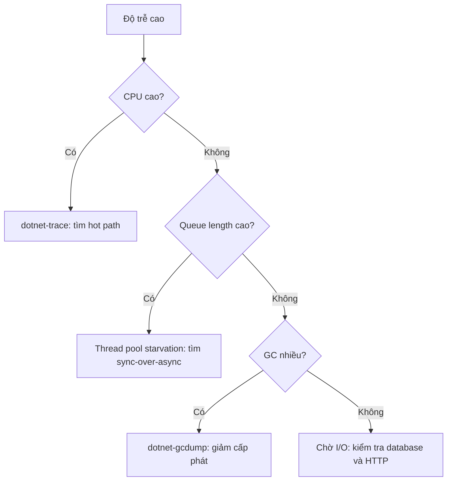

import { SummaryBox, Checklist, FAQSection } from '@site/src/components/SEO';

# 19.4 — 3. Profiling trên .NET server

<SummaryBox>
Profiling trên production khác hẳn trên máy phát triển: bạn **không thể** gắn debugger, không thể dừng tiến trình, và công cụ phải đủ nhẹ để không làm hệ thống tệ hơn. Bộ ba `dotnet-counters`, `dotnet-trace`, `dotnet-gcdump` giải quyết đúng việc đó — chúng gắn vào tiến trình đang chạy mà **không dừng** nó. Điểm quan trọng nhất của bài này là **cách đọc số liệu để nhận ra loại vấn đề**: CPU cao mà độ trễ thấp là chuyện bình thường; CPU **thấp** mà độ trễ **cao** là đang chờ I/O hoặc khoá. Và có một vấn đề đặc trưng của .NET mà mọi backend engineer phải nhận ra được: **thread pool starvation** — triệu chứng là độ trễ vọt lên hàng giây trong khi CPU nhàn rỗi, và nguyên nhân gần như luôn là `sync-over-async`.
</SummaryBox>

## Mục tiêu bài học

Sau bài này bạn có thể:

- Dùng `dotnet-counters` để chẩn đoán nhanh trên production.
- Thu và đọc trace CPU bằng `dotnet-trace`.
- Nhận ra thread pool starvation từ số liệu.
- Phân biệt bốn loại vấn đề qua tổ hợp chỉ số.
- Tìm rò rỉ bộ nhớ bằng `dotnet-gcdump`.

## Nội dung bài học

### 19.4.1 — dotnet-counters: bước đầu tiên

```bash
dotnet tool install -g dotnet-counters

dotnet-counters monitor -p 1 \
  --counters System.Runtime,Microsoft.AspNetCore.Hosting
```

```
[System.Runtime]
    CPU Usage (%)                            78
    GC Heap Size (MB)                       412
    Gen 0 GC Count / 1 sec                   18
    Gen 2 GC Count / 1 sec                    3      <-- CAO BAT THUONG
    Allocation Rate (B / 1 sec)     1,240,000,000    <-- 1,2 GB/giay!
    ThreadPool Thread Count                  47
    ThreadPool Queue Length                 312      <-- DANG DOI
    Exception Count / 1 sec                  84      <-- exception lam chi phi an

[Microsoft.AspNetCore.Hosting]
    Current Requests                        289
    Requests / 1 sec                         94
    Failed Requests                           2
```

Bốn con số đáng chú ý trong ví dụ này:

- **Gen 2 GC 3 lần/giây** là rất cao. Gen 2 collection dừng toàn bộ tiến trình (với một số chế độ GC) và tốn hàng chục tới hàng trăm mili giây.
- **Allocation rate 1,2 GB/s** là nguyên nhân của Gen 2 ở trên — cấp phát nhiều đẩy object lên gen cao.
- **ThreadPool Queue Length 312** nghĩa là 312 việc đang **xếp hàng chờ** thread rảnh. Đây là dấu hiệu starvation.
- **84 exception/giây** thường bị bỏ qua: ném và bắt exception tốn kém hơn nhiều so với trả về mã lỗi, và 84 lần/giây là chi phí ẩn đáng kể.

`dotnet-counters` gần như không tốn tài nguyên, nên chạy được trên production an toàn. Đây luôn là công cụ đầu tiên.

### 19.4.2 — Bốn loại vấn đề qua tổ hợp chỉ số

| CPU | Độ trễ | Queue length | Chẩn đoán |
|---|---|---|---|
| Cao | Cao | Thấp | **Nghẽn CPU thật** — tìm hot path |
| **Thấp** | **Cao** | **Cao** | **Thread pool starvation** — tìm sync-over-async |
| Thấp | Cao | Thấp | **Chờ I/O** — database, HTTP, disk |
| Cao | Thấp | Thấp | **Bình thường** — hệ thống đang làm việc hiệu quả |

Hàng cuối đáng nhấn mạnh: **CPU cao không phải vấn đề** nếu độ trễ vẫn đạt SLO. CPU 80% với p99 trong ngưỡng là dấu hiệu bạn đang **dùng hết** tài nguyên đã trả tiền. Mục tiêu là độ trễ, không phải CPU thấp.

Hàng thứ hai là loại vấn đề gây nhầm lẫn nhất: CPU nhàn rỗi nên mọi biểu đồ hạ tầng trông bình thường, trong khi người dùng đang đợi hàng giây.

### 19.4.3 — Thread pool starvation

```csharp
// NGUYÊN NHÂN SỐ MỘT — sync-over-async
public IActionResult GetLeads()
{
    var leads = _service.GetLeadsAsync().Result;      // CHIẾM một thread pool thread
    return Ok(leads);                                  // trong suốt thời gian chờ I/O
}
```

Cơ chế của sự sụp đổ, theo từng bước:

```
1. Thread pool có N thread (mặc định ~ số core)
2. Mỗi request .Result CHIẾM một thread và KHÔNG trả lại khi chờ I/O
3. Request thứ N+1 phải CHỜ thread rảnh
4. Thread pool tăng thread — nhưng chậm, khoảng 1-2 thread mỗi giây
5. Request đổ về nhanh hơn tốc độ tăng thread
6. Queue length tăng không giới hạn, độ trễ vọt lên hàng giây
7. CPU vẫn THẤP, vì mọi thread đều đang chờ I/O chứ không tính toán
```

Bước 4 là chìa khoá: thread pool **có** tự tăng, nhưng với tốc độ cố ý chậm để tránh tạo quá nhiều thread. Dưới đợt tải đột ngột, tốc độ đó không theo kịp.

```csharp
// SỬA — async suốt chuỗi, thread được trả lại khi chờ I/O
public async Task<IActionResult> GetLeads(CancellationToken ct)
{
    var leads = await _service.GetLeadsAsync(ct);
    return Ok(leads);
}
```

Các dạng sync-over-async cần tìm và loại bỏ ([bài 6.8](../../stage-02-csharp-professional/module-06-async-programming/6.7-common-pitfalls.mdx)):

```csharp
task.Result                    // chiếm thread
task.Wait()                    // chiếm thread
task.GetAwaiter().GetResult()  // chiếm thread
Task.Run(() => ...).Result     // chiếm HAI thread
```

Tìm chúng bằng phân tích tĩnh thay vì đọc thủ công:

```xml
<!-- .editorconfig -->
<!-- CA2007, VSTHRD002: cảnh báo sync-over-async -->
dotnet_diagnostic.VSTHRD002.severity = error
```

**Giảm nhẹ tạm thời** khi chưa sửa kịp:

```csharp
// KHÔNG phải cách sửa — chỉ mua thêm thời gian
ThreadPool.SetMinThreads(workerThreads: 200, completionPortThreads: 200);
```

Tăng số thread tối thiểu khiến pool tạo thread ngay thay vì tăng dần. Nó **che** triệu chứng, và mỗi thread tốn 1 MB stack — 200 thread là 200 MB. Dùng để sống sót qua sự cố, không phải để kết thúc vấn đề.

### 19.4.4 — dotnet-trace: tìm hot path

```bash
dotnet tool install -g dotnet-trace

# Thu 30 giay CPU sample
dotnet-trace collect -p 1 --duration 00:00:30 \
  --profile cpu-sampling -o trace.nettrace
```

Mở bằng PerfView (Windows), Visual Studio, hoặc chuyển sang định dạng speedscope:

```bash
dotnet-trace convert trace.nettrace --format Speedscope
```

Đọc call tree theo hai cột:

| Cột | Ý nghĩa | Dùng để |
|---|---|---|
| **Inclusive** | Thời gian của hàm **và** mọi hàm nó gọi | Tìm nhánh tốn kém |
| **Exclusive** | Thời gian **chỉ** trong thân hàm | Tìm hàm tự nó chậm |

Bắt đầu từ `Inclusive` cao nhất rồi đi xuống, tới khi gặp `Exclusive` cao — đó là nơi thời gian thật sự bị tiêu.

Trace cũng ghi **GC event** và **exception**, nên nó trả lời được "vì sao Gen 2 GC nhiều" mà `dotnet-counters` chỉ báo là có.

**Lưu ý trên production:** CPU sampling thêm khoảng 1–3% tải, chấp nhận được. Nhưng file trace lớn nhanh — 30 giây thường đủ, và giới hạn thời gian tránh làm đầy ổ đĩa.

### 19.4.5 — dotnet-gcdump: tìm rò rỉ bộ nhớ

```bash
dotnet tool install -g dotnet-gcdump

# Chụp hai lần cách nhau, so sánh
dotnet-gcdump collect -p 1 -o before.gcdump
# ... để hệ thống chạy thêm 30 phút ...
dotnet-gcdump collect -p 1 -o after.gcdump
```

So sánh hai ảnh chụp trong Visual Studio để xem loại object nào **tăng liên tục**. Ba nguyên nhân phổ biến trong .NET backend:

```csharp
// 1. Static collection không bao giờ dọn
private static readonly List<AuditEntry> _auditLog = [];    // tang mai mai

// 2. Event handler không huỷ đăng ký — giữ sống cả object chủ
_someService.DataChanged += OnDataChanged;                   // thieu -= khi dispose

// 3. IMemoryCache không có giới hạn kích thước
_cache.Set(key, value);                                      // thieu SizeLimit
```

Nguyên nhân thứ hai đặc biệt khó thấy: event handler giữ tham chiếu tới đối tượng đăng ký, nên cả đối tượng đó và mọi thứ nó tham chiếu đều không được thu gom, dù bạn nghĩ nó đã hết vòng đời.

`gcdump` nhẹ hơn full memory dump nhiều và **an toàn trên production**, nhưng nó gây một lần Gen 2 GC nên sẽ có một khoảng dừng ngắn.

### 19.4.6 — Quy trình chẩn đoán



Đi theo thứ tự này tránh được việc đoán mò. Mỗi nhánh dẫn tới một công cụ cụ thể và một loại nguyên nhân cụ thể.

### 19.4.7 — Rà lại code của bạn

<Checklist
  title="Danh sách rà soát profiling"
  items={[
    { text: "Không có .Result, .Wait hay GetAwaiter().GetResult() trong đường xử lý request." },
    { text: "Có phân tích tĩnh chặn sync-over-async ở mức lỗi." },
    { text: "Giám sát ThreadPool Queue Length, không chỉ CPU." },
    { text: "Có cảnh báo khi Gen 2 GC vượt ngưỡng." },
    { text: "Theo dõi allocation rate, không chỉ heap size." },
    { text: "Exception rate được giám sát vì đó là chi phí ẩn." },
    { text: "Công cụ chẩn đoán đã cài sẵn trong image production." },
    { text: "Có quy trình thu trace khi sự cố, không phải nghĩ ra lúc đang cháy." },
    { text: "Hiểu rằng CPU cao với độ trễ đạt SLO là bình thường." },
  ]}
/>

## Bài tập áp dụng

#### Bài 1 — Tái hiện starvation

Viết endpoint dùng `.Result` gọi một API chậm, tạo tải 100 request đồng thời, và quan sát `ThreadPool Queue Length` cùng CPU.

**Tiêu chí hoàn thành:** bạn **đo được** chênh lệch giữa bản chặn luồng và bản bất đồng bộ, và đọc được chữ ký của starvation từ số luồng chứ không chỉ từ thời gian.

<details>
<summary><strong>Gợi ý và lời giải — Bài 1</strong></summary>

**Gợi ý.** Cùng một khối lượng công việc, cùng một phụ thuộc chậm. Thứ duy nhất khác là luồng có được trả lại trong lúc chờ hay không.

**Lời giải — hai endpoint giống hệt nhau trừ một chi tiết:**

```csharp
var b = WebApplication.CreateBuilder(args);
b.WebHost.UseUrls("http://127.0.0.1:5233");
var app = b.Build();

async Task<string> PhuThuocChamAsync() { await Task.Delay(500); return "xong"; }

app.MapGet("/dong-bo",     () => PhuThuocChamAsync().Result);          // CHIẾM luồng
app.MapGet("/bat-dong-bo", async () => await PhuThuocChamAsync());     // trả luồng lại
app.MapGet("/nhanh",       () => "nhanh");
```

Và phần tạo tải, có theo dõi trạng thái thread pool:

```csharp
async Task<(double tong, int luongDinh, long hangDoiDinh)> ThuAsync(string duong, int n)
{
    int luongDinh = 0; long hangDoiDinh = 0;
    using var cts = new CancellationTokenSource();
    var theoDoi = Task.Run(async () =>
    {
        while (!cts.IsCancellationRequested)
        {
            luongDinh   = Math.Max(luongDinh,   ThreadPool.ThreadCount);
            hangDoiDinh = Math.Max(hangDoiDinh, ThreadPool.PendingWorkItemCount);
            await Task.Delay(20);
        }
    });

    var sw = Stopwatch.StartNew();
    var tai = Enumerable.Range(0, n)
        .Select(_ => http.GetStringAsync($"http://127.0.0.1:5233{duong}")).ToArray();
    await Task.WhenAll(tai);
    sw.Stop();

    cts.Cancel(); await theoDoi;
    return (sw.Elapsed.TotalMilliseconds, luongDinh, hangDoiDinh);
}
```

Kết quả đo trên .NET 9.0.203, máy 4 nhân (`ThreadPool.GetMinThreads` trả về 4):

```text
bất đồng bộ | 100 request:   704 ms | luồng đỉnh   5
đồng bộ     | 100 request: 4.356 ms | luồng đỉnh  41
```

| | Bất đồng bộ | Đồng bộ (`.Result`) |
|---|---:|---:|
| Tổng thời gian cho 100 request | **704 ms** | **4.356 ms** |
| So với mức lý tưởng (500 ms) | 1,4× | **8,7×** |
| Luồng thread pool lúc đỉnh | **5** | **41** |

**Ba điều ba cặp số này nói ra:**

**1. Mức lý tưởng là 500 ms, và bản bất đồng bộ gần như đạt được.**

```text
Phụ thuộc mất 500 ms. 100 request chạy song song.
-> nếu không có nghẽn nào, tổng thời gian ≈ 500 ms

Bất đồng bộ: 704 ms -> gần như song song hoàn toàn
Đồng bộ:   4.356 ms -> phần lớn thời gian là CHỜ LUỒNG, không phải chờ phụ thuộc
```

**2. Con số 41 luồng là chữ ký rõ nhất, rõ hơn cả thời gian.**

```text
Bất đồng bộ: 5 luồng cho 100 request đang chờ
    -> luồng được TRẢ LẠI trong lúc chờ I/O
    -> 5 luồng phục vụ được 100 việc đang treo

Đồng bộ: 41 luồng
    -> mỗi request CHIẾM một luồng suốt 500 ms
    -> thread pool phải tạo thêm luồng, và nó tạo chậm có chủ đích
```

Tốc độ tăng luồng giải thích chính xác con số 4.356 ms:

```text
Bắt đầu với 4 luồng (= số nhân), tăng khoảng 1–2 luồng mỗi giây
100 request, mỗi luồng xử lý được 2 request mỗi giây (500 ms/request)

-> hệ thống phải đợi pool nở ra tới ~41 luồng
-> và toàn bộ thời gian nở ra đó là thời gian người dùng đang chờ
```

Mỗi luồng tốn 1 MB stack, nên 41 luồng cũng là **41 MB** bộ nhớ mà bản bất đồng bộ không cần tới.

**3. Và một lưu ý trung thực về số đo `PendingWorkItemCount` trong thí nghiệm này:**

```text
Đo được: bất đồng bộ 151, đồng bộ 87 — NGƯỢC với điều ta mong đợi

Lý do: bộ tạo tải chạy CÙNG TIẾN TRÌNH với server trong bài này,
nên bộ đếm gộp cả công việc của client lẫn của server.
```

Đây là một ví dụ của chính cái bẫy ở [bài 19.1](19.1-measure-before-and-after.mdx): số đo đúng, nhưng nó đang trả lời một câu hỏi khác. Trong thí nghiệm này, hai chỉ số **đáng tin** là tổng thời gian và `ThreadCount`. Muốn đọc queue length cho đúng, phải đo trên tiến trình server tách riêng:

```bash
dotnet-counters monitor --process-id <pid-cua-server> \
  --counters System.Runtime[threadpool-queue-length,threadpool-thread-count],Microsoft.AspNetCore.Hosting
```

```text
[System.Runtime]
    ThreadPool Queue Length                    1.847
    ThreadPool Thread Count                       41
    CPU Usage (%)                                  8      <- THẤP
[Microsoft.AspNetCore.Hosting]
    Current Requests                              94
    Request Duration (ms, p99)                 3.812      <- CAO
```

Tổ hợp **CPU thấp + độ trễ cao + queue length cao** chính là hàng thứ hai trong bảng ở mục 19.4.2 — và nó là loại vấn đề gây nhầm lẫn nhất, vì mọi biểu đồ hạ tầng đều trông bình thường.

**Vì sao CPU thấp là phần đánh lừa nhiều nhất:**

```text
41 luồng, tất cả đang nằm trong Task.Delay / chờ I/O
-> không luồng nào TÍNH TOÁN
-> CPU 8%

Đội vận hành nhìn biểu đồ: "CPU còn dư nhiều, hạ tầng ổn"
Người dùng: đợi 4 giây cho một request đáng lẽ mất nửa giây
```

Phản xạ sai thường thấy là **thêm máy** — và nó không giúp gì, vì mỗi máy mới cũng chỉ lặp lại đúng vấn đề đó.

**Tìm nguyên nhân bằng phân tích tĩnh, không bằng mắt:**

```bash
grep -rnE "\.Result\b|\.Wait\(\)|GetAwaiter\(\)\.GetResult\(\)" --include="*.cs" src/ \
  | grep -v "/Tests/" | grep -v "Program.cs"
```

```text
src/Crm.Api/Controllers/LeadsController.cs:42:  var leads = _service.GetLeadsAsync().Result;
src/Crm.Api/Services/BaoCaoService.cs:88:      var data = _repo.LayAsync().GetAwaiter().GetResult();
src/Crm.Api/Infrastructure/CacheWarmer.cs:23:  _cache.NapAsync().Wait();
```

Và chặn nó quay lại:

```ini
# .editorconfig
dotnet_diagnostic.VSTHRD002.severity = error    # tránh dùng Result/Wait
dotnet_diagnostic.CA2007.severity = suggestion  # cân nhắc ConfigureAwait
```

**`SetMinThreads` — khi nào dùng và vì sao nó không phải cách sửa:**

```csharp
ThreadPool.SetMinThreads(workerThreads: 200, completionPortThreads: 200);
```

```text
Nó xoá bỏ giai đoạn "pool nở ra chậm" -> triệu chứng biến mất ngay
Nhưng: 200 luồng × 1 MB stack = 200 MB
       và mỗi lần chuyển ngữ cảnh giữa 200 luồng đều tốn CPU

Dùng nó để sống sót qua một sự cố lúc 2 giờ sáng: hợp lý.
Để nó lại trong code và coi như đã xong: vấn đề sẽ quay lại ở quy mô lớn hơn.
```

**Viết test chặn hồi quy, rẻ hơn nhiều so với đo tải:**

```csharp
[Fact]
public async Task Endpoint_khong_chiem_luong_thread_pool()
{
    var truoc = ThreadPool.ThreadCount;

    var tai = Enumerable.Range(0, 50)
        .Select(_ => _client.GetAsync("/api/leads")).ToArray();
    await Task.WhenAll(tai);

    var tang = ThreadPool.ThreadCount - truoc;

    tang.Should().BeLessThan(10,
        "50 request bất đồng bộ chỉ cần vài luồng; tăng nhiều nghĩa là có chỗ chặn luồng");
}
```

Test này chạy trong khoảng một giây và bắt được đúng loại hồi quy khó thấy nhất khi đọc code.

</details>

---

#### Bài 2 — Đọc trace

Thu trace 30 giây dưới tải, mở bằng speedscope, và tìm hàm có `Exclusive` cao nhất.

**Tiêu chí hoàn thành:** bạn phân biệt được `Exclusive` với `Inclusive`, và biết vì sao hàm đứng đầu danh sách thường **không** phải chỗ cần sửa.

<details>
<summary><strong>Gợi ý và lời giải — Bài 2</strong></summary>

**Gợi ý.** `Inclusive` gồm cả thời gian của các hàm được gọi bên trong. `Exclusive` chỉ tính thời gian ở **chính** hàm đó.

**Lời giải — thu trace dưới tải thật:**

```bash
# Cài công cụ (một lần)
dotnet tool install -g dotnet-trace
dotnet tool install -g dotnet-counters

# Tìm tiến trình
dotnet-trace ps
```

```text
 12483  Crm.Api  /app/Crm.Api
```

```bash
# Tạo tải ở một cửa sổ khác, rồi thu trace TRONG LÚC có tải
k6 run --duration 60s --vus 50 ci/tai-leads.js &

dotnet-trace collect --process-id 12483 \
  --duration 00:00:30 \
  --profile cpu-sampling \
  --format speedscope \
  --output crm-api.speedscope.json
```

```text
Recording trace 42.8181  (MB)
Trace completed.
Writing:  crm-api.speedscope.json
```

Mở `crm-api.speedscope.json` tại [speedscope.app](https://www.speedscope.app/) — tệp được xử lý ngay trong trình duyệt, không tải lên đâu cả.

**Ba chế độ xem, và chế độ nào dùng khi nào:**

| Chế độ | Dùng khi |
|---|---|
| **Time Order** | Xem diễn biến theo thời gian — tìm đợt tăng đột biến, tìm GC pause |
| **Left Heavy** | **Gộp mọi lời gọi cùng đường dẫn** — đây là chế độ dùng nhiều nhất |
| **Sandwich** | Sắp xếp theo `Exclusive` — trả lời đúng câu hỏi của bài này |

Chế độ **Sandwich** cho bảng như sau:

```text
Self (Exclusive)   Total (Inclusive)   Symbol
        18,4%             18,4%        System.Net.Sockets.Socket.AwaitableSocketAsyncEventArgs...
        11,2%             11,2%        System.Threading.Monitor.Wait
         9,8%             62,1%        Npgsql.NpgsqlDataReader.NextResult
         7,1%              7,1%        System.Text.Json.Utf8JsonWriter.WriteStringValue
         6,3%             71,4%        Crm.Api.Services.LeadService.SearchAsync
         5,9%              5,9%        System.Buffers.ArrayPool`1.Rent
```

**Vì sao hàm đứng đầu KHÔNG phải chỗ cần sửa:**

```text
Socket.AwaitableSocketAsyncEventArgs — 18,4% Exclusive

Đây là chỗ tiến trình NẰM CHỜ dữ liệu từ mạng.
Không có gì để tối ưu ở đó — nó là hệ quả, không phải nguyên nhân.

Sửa nó nghĩa là... làm mạng nhanh hơn?
```

Ba mục đầu trong bảng (`Socket`, `Monitor.Wait`, và phần lớn `NextResult`) đều là **chờ**, không phải **làm**. Với một ứng dụng backend điển hình, đây là chuyện bình thường và chiếm phần lớn thời gian.

**Cột cần nhìn là `Inclusive` của code CỦA BẠN:**

```text
Crm.Api.Services.LeadService.SearchAsync — Inclusive 71,4%, Exclusive 6,3%

Inclusive 71,4%  -> gần ba phần tư thời gian đi qua hàm này
Exclusive  6,3%  -> nhưng chỉ 6,3% là do chính nó
-> 65,1% còn lại nằm ở những thứ nó GỌI RA
```

Và `Npgsql.NpgsqlDataReader.NextResult` với `Inclusive 62,1%` nói rõ 65,1% đó đi đâu: **database**. Kết luận đúng từ trace này không phải "tối ưu `SearchAsync`", mà là "vấn đề nằm ở truy vấn" — tức chuyển sang [bài 19.4](19.4-database-first-bottleneck.mdx).

**Quy tắc đọc trace, gói trong bốn bước:**

```text
1. Lọc bỏ mọi frame của runtime và thư viện — tìm code CỦA BẠN
2. Sắp theo Inclusive -> hàm nào chiếm nhiều thời gian nhất?
3. Trong hàm đó, xem Exclusive: thời gian ở CHÍNH nó hay ở thứ nó gọi?
       Exclusive cao -> tối ưu chính hàm đó
       Exclusive thấp -> đi sâu vào thứ nó gọi
4. Lặp lại cho tới khi gặp một hàm có Exclusive cao — đó là đích
```

**Khi `Exclusive` cao ở code của bạn, ví dụ điển hình:**

```text
Self 22,8%   Crm.Api.Mapping.LeadMapper.ToDto
```

```csharp
// Nguyên nhân: reflection cho MỖI thuộc tính, MỖI đối tượng
public static LeadDto ToDto(Lead lead)
{
    var dto = new LeadDto();
    foreach (var p in typeof(Lead).GetProperties())          // reflection mỗi lần gọi
        typeof(LeadDto).GetProperty(p.Name)?.SetValue(dto, p.GetValue(lead));
    return dto;
}
```

```csharp
// Sửa: ánh xạ tường minh — và đây mới là lúc BenchmarkDotNet có ích
public static LeadDto ToDto(Lead lead) => new(lead.Id, lead.HoTen, lead.Email, lead.TrangThai);
```

Đây đúng là thứ tự đã nêu ở mục 19.3.4 của [bài 19.2](19.2-benchmarkdotnet.mdx): **profiler chỉ ra chỗ đáng sửa, rồi BenchmarkDotNet so sánh các cách sửa.**

**Ba cái bẫy khi thu trace:**

**1. Thu trace lúc không có tải.**

```text
Không có tải -> không có gì để thấy
-> trace toàn frame của vòng lặp chờ kết nối
```

Luôn thu **trong lúc** có tải đại diện.

**2. `cpu-sampling` không thấy được thời gian chờ.**

```bash
# Thấy CPU đi đâu — nhưng không thấy vì sao request chậm khi CPU thấp
dotnet-trace collect --profile cpu-sampling

# Thấy cả sự kiện I/O, contention, GC — dùng khi nghi ngờ chờ đợi
dotnet-trace collect \
  --providers Microsoft-DotNETCore-SampleProfiler,Microsoft-Windows-DotNETRuntime:0x1F000080018:5
```

Với bài 1 ở trên — CPU thấp, độ trễ cao — `cpu-sampling` gần như không cho thông tin gì, vì vấn đề nằm ở chỗ **không** tiêu CPU.

**3. Trace làm chậm chính hệ thống đang đo.**

```text
cpu-sampling: chi phí thấp, chạy được trên production
Trace đầy đủ mọi provider: có thể làm chậm 10–30%
-> và trên một hệ thống đang gặp sự cố, 30% đó có thể là giọt nước tràn ly
```

Trên production, bắt đầu bằng `dotnet-counters` (gần như không tốn gì), rồi mới tới `dotnet-trace` với `cpu-sampling`, và chỉ bật đầy đủ provider khi đã khoanh vùng được.

</details>

---

#### Bài 3 — Tìm rò rỉ

Tạo một static collection tăng dần, chụp hai `gcdump` cách nhau 10 phút và so sánh.

**Tiêu chí hoàn thành:** bạn chứng minh được đó là **rò rỉ** chứ không phải bộ nhớ chờ thu gom, bằng một phép thử dứt khoát.

<details>
<summary><strong>Gợi ý và lời giải — Bài 3</strong></summary>

**Gợi ý.** Bộ nhớ tăng không phải rò rỉ. Bộ nhớ tăng **và sống sót qua một lần thu gom gen-2 đầy đủ** mới là rò rỉ.

**Lời giải — dựng mẫu rò rỉ kinh điển và đo:**

```csharp
static class CacheTinh
{
    public static readonly Dictionary<string, byte[]> Muc = new();   // không giới hạn, không xoá
}

static void ChupHeap(string nhan)
{
    Console.WriteLine($"{nhan,-10} | heap {GC.GetTotalMemory(false) / 1048576.0,8:F1} MB | " +
                      $"RSS {Process.GetCurrentProcess().WorkingSet64 / 1048576.0,7:F1} MB | " +
                      $"gen0 {GC.CollectionCount(0),4} gen1 {GC.CollectionCount(1),3} gen2 {GC.CollectionCount(2),3} | " +
                      $"mục {CacheTinh.Muc.Count,7:N0}");
}

ChupHeap("bắt đầu");
int n = 0;
for (int vong = 1; vong <= 5; vong++)
{
    for (int i = 0; i < 40_000; i++)
        CacheTinh.Muc[$"lead:{n++}"] = new byte[512];
    ChupHeap($"vòng {vong}");
}

GC.Collect(2, GCCollectionMode.Forced, blocking: true, compacting: true);   // phép thử dứt khoát
ChupHeap("sau GC");
```

Kết quả đo trên .NET 9.0.203:

```text
bắt đầu    | heap      0,0 MB | RSS    25,2 MB | gen0    0 gen1   0 gen2   0 | mục       0
vòng 1     | heap     25,3 MB | RSS    55,9 MB | gen0    2 gen1   1 gen2   1 | mục  40.000
vòng 2     | heap     51,7 MB | RSS    81,9 MB | gen0    3 gen1   1 gen2   1 | mục  80.000
vòng 3     | heap     71,0 MB | RSS   105,7 MB | gen0    5 gen1   3 gen2   2 | mục 120.000
vòng 4     | heap    101,9 MB | RSS   132,7 MB | gen0    6 gen1   4 gen2   2 | mục 160.000
vòng 5     | heap    124,2 MB | RSS   156,0 MB | gen0    9 gen1   7 gen2   3 | mục 200.000
sau GC     | heap    120,0 MB | RSS   168,5 MB | gen0   10 gen1   8 gen2   4 | mục 200.000
```

**Dòng cuối là toàn bộ bằng chứng:**

```text
Trước GC đầy đủ: 124,2 MB
Sau  GC đầy đủ: 120,0 MB   -> chỉ giải phóng 4,2 MB (3,4%)

Rác thật sự sẽ biến mất gần hết sau một lần gen-2 blocking + compacting.
120 MB sống sót nghĩa là 120 MB đó vẫn ĐANG ĐƯỢC THAM CHIẾU.
```

Đây là phép thử dứt khoát, và nó phân biệt hai tình huống hay bị nhầm:

| Hiện tượng | Sau `GC.Collect(2, ..., blocking, compacting)` | Kết luận |
|---|---|---|
| Bộ nhớ tăng, sau GC **giảm mạnh** | Về gần mức ban đầu | **Không rò rỉ** — GC chỉ chưa chạy |
| Bộ nhớ tăng, sau GC **gần như không đổi** | Giữ nguyên | **Rò rỉ** |

**Hai chi tiết nữa trong bảng, đáng để ý:**

**1. Heap tăng gần như tuyến tính theo số mục: 25 → 52 → 71 → 102 → 124 MB.**

```text
Tăng đều theo số mục -> nguồn rò rỉ tỷ lệ với lưu lượng
-> thường là: cache không giới hạn, danh sách sự kiện, hoặc collection tĩnh

Nếu tăng theo BẬC THANG thay vì tuyến tính
-> thường là một tài nguyên bị giữ mỗi lần làm một việc nào đó
```

**2. RSS (168,5 MB) cao hơn heap (120,0 MB) khoảng 48 MB.**

```text
Phần chênh: stack của luồng, mã đã JIT, bộ đệm native, phân mảnh

Nên khi theo dõi rò rỉ, hãy nhìn HEAP, không nhìn RSS.
RSS có thể tăng vì lý do không liên quan, và nó cũng không giảm ngay
sau GC — như thấy ở dòng cuối: heap giảm 4,2 MB nhưng RSS lại TĂNG.
```

**Làm đúng bài tập với `dotnet-gcdump`, trên ứng dụng thật:**

```bash
dotnet tool install -g dotnet-gcdump

dotnet-gcdump collect --process-id 12483 --output lan-1.gcdump
# ... chờ 10 phút dưới tải ...
dotnet-gcdump collect --process-id 12483 --output lan-2.gcdump
```

Mở cả hai bằng Visual Studio hoặc PerfView và so sánh:

```text
Type                                      Count 1    Count 2      Delta   Size Delta
System.Byte[]                              40.021    200.043   +160.022    +81,9 MB
System.String                              44.187    204.209   +160.022     +9,8 MB
Dictionary<String, Byte[]>+Entry           40.960    262.144   +221.184    +10,6 MB
Crm.Api.Models.Lead                         1.204      1.198        -6      -0,0 MB
```

**Ba cột này đọc như sau:**

```text
Delta dương và LỚN + tăng tỷ lệ với thời gian -> ứng viên rò rỉ
Delta dao động quanh 0                        -> bình thường
```

Rồi tìm **đường giữ tham chiếu** (path to root) — đây mới là phần trả lời "vì sao chúng không bị thu gom":

```text
System.Byte[]
  <- Dictionary<String, Byte[]>+Entry[]
    <- Dictionary<String, Byte[]>
      <- static Crm.Api.Caching.CacheTinh.Muc        <- GỐC: trường static
```

Dòng cuối là câu trả lời. Một trường `static` là gốc GC, nên mọi thứ nó giữ sẽ sống tới khi tiến trình kết thúc.

**Bốn nguồn rò rỉ phổ biến nhất trong ứng dụng ASP.NET Core:**

| Nguồn | Dấu hiệu trong gcdump | Cách sửa |
|---|---|---|
| Cache tĩnh không giới hạn | Collection tĩnh tăng đều | `MemoryCache` có `SizeLimit` ([bài 14.2](../../stage-04-database-production/module-14-caching-background-jobs/14.2-imemorycache.mdx)) |
| Event handler không gỡ | Nhiều `EventHandler`, đối tượng đáng lẽ đã chết vẫn sống | Gỡ bằng `-=` hoặc dùng tham chiếu yếu |
| `HttpClient` tạo mới mỗi lần | `SocketsHttpHandler` tăng đều | `IHttpClientFactory` |
| Dịch vụ đăng ký nhầm vòng đời | Đối tượng `Scoped` bị giữ bởi `Singleton` | Kiểm tra bằng `ValidateScopes` |

Mục cuối có cách phát hiện tự động, và nên bật trong mọi môi trường:

```csharp
builder.Host.UseDefaultServiceProvider((ctx, o) =>
{
    o.ValidateScopes = true;      // ném lỗi khi Singleton giữ Scoped
    o.ValidateOnBuild = true;     // kiểm tra ngay lúc khởi động, không đợi request đầu
});
```

**Theo dõi để phát hiện sớm, thay vì đợi tới lúc hết bộ nhớ:**

```promql
# Heap tăng đều trong 6 giờ mà không quay về -> nghi ngờ rò rỉ
deriv(dotnet_gc_heap_size_bytes{generation="2"}[6h]) > 0
  and
min_over_time(dotnet_gc_heap_size_bytes{generation="2"}[6h])
  > min_over_time(dotnet_gc_heap_size_bytes{generation="2"}[24h] offset 6h)
```

Điều kiện thứ hai quan trọng hơn điều kiện thứ nhất: rò rỉ không chỉ làm bộ nhớ **tăng**, nó làm **mức đáy** đi lên. Một ứng dụng khoẻ mạnh có bộ nhớ lên xuống theo tải nhưng luôn quay về cùng một mức đáy; một ứng dụng rò rỉ thì mức đáy đó trôi lên mỗi ngày.

**Và cách phát hiện rẻ nhất, không cần công cụ nào:**

```text
Khởi động lại pod -> bộ nhớ về mức thấp -> tăng dần suốt ngày -> OOMKilled
-> rồi lặp lại

Nếu lịch khởi động lại của pod trùng với chu kỳ này, bạn đã có câu trả lời
trước cả khi mở gcdump.
```

</details>

## Tự kiểm tra

<FAQSection
  items={[
    {
      question: "Vì sao dotnet-counters luôn là công cụ đầu tiên?",
      answer: "Vì nó gần như không tốn tài nguyên nên chạy an toàn trên production, gắn vào tiến trình đang chạy mà không dừng nó, và cho ngay tổ hợp chỉ số đủ để phân loại vấn đề trước khi dùng công cụ nặng hơn."
    },
    {
      question: "Tổ hợp chỉ số nào cho thấy thread pool starvation?",
      answer: "CPU thấp, độ trễ cao và ThreadPool Queue Length cao. Đây là loại vấn đề gây nhầm lẫn nhất vì mọi biểu đồ hạ tầng trông bình thường do CPU nhàn rỗi, trong khi người dùng đang đợi hàng giây."
    },
    {
      question: "Thread pool starvation xảy ra theo cơ chế nào?",
      answer: "Sync-over-async chiếm một thread và không trả lại trong lúc chờ I/O. Khi số request vượt số thread, các request sau phải chờ. Thread pool có tự tăng nhưng chỉ khoảng một hai thread mỗi giây, nên dưới tải đột ngột nó không theo kịp và queue tăng không giới hạn."
    },
    {
      question: "Tăng ThreadPool.SetMinThreads có phải cách sửa không?",
      answer: "Không, nó chỉ che triệu chứng và mua thêm thời gian, vì mỗi thread tốn khoảng 1 MB stack nên 200 thread là 200 MB. Cách sửa thật là loại bỏ sync-over-async và dùng async suốt chuỗi."
    },
    {
      question: "Inclusive và Exclusive trong call tree khác nhau thế nào?",
      answer: "Inclusive là thời gian của hàm và mọi hàm nó gọi, dùng để tìm nhánh tốn kém. Exclusive là thời gian chỉ trong thân hàm, dùng để tìm hàm tự nó chậm. Cách đọc là đi từ Inclusive cao nhất xuống tới khi gặp Exclusive cao."
    },
    {
      question: "Vì sao CPU cao không nhất thiết là vấn đề?",
      answer: "Vì mục tiêu là độ trễ chứ không phải CPU thấp. CPU 80% với p99 vẫn đạt SLO nghĩa là bạn đang dùng hết tài nguyên đã trả tiền, đó là dấu hiệu tốt chứ không phải dấu hiệu xấu."
    }
  ]}
/>

## Kết luận

Ba điều đáng nhớ nhất:

1. **Tổ hợp CPU, độ trễ và queue length phân loại được vấn đề** trước khi dùng công cụ nặng.
2. **CPU thấp + độ trễ cao = đang chờ**, và trên .NET nguyên nhân thường là sync-over-async.
3. **Mục tiêu là độ trễ, không phải CPU thấp.**

## Tham khảo

- [dotnet-counters](https://learn.microsoft.com/en-us/dotnet/core/diagnostics/dotnet-counters)
- [dotnet-trace](https://learn.microsoft.com/en-us/dotnet/core/diagnostics/dotnet-trace)
- [Chẩn đoán thread pool starvation](https://learn.microsoft.com/en-us/dotnet/core/diagnostics/debug-threadpool-starvation)
- [dotnet-gcdump](https://learn.microsoft.com/en-us/dotnet/core/diagnostics/dotnet-gcdump)

## Điều hướng

- **Bài trước:** [19.2 — 2. BenchmarkDotNet](19.2-benchmarkdotnet.mdx)
- **Bài tiếp theo:** [19.4 — 4. Database thường là nghẽn đầu tiên](19.4-database-first-bottleneck.mdx)
- **Về module:** [Trang mục lục](./)
