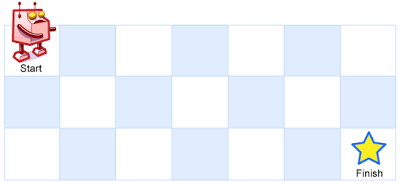

import Tabs from '@theme/Tabs';
import TabItem from '@theme/TabItem';
import CodeBlock from '@theme/CodeBlock';
import UniquePathsCs from '!!raw-loader!./csharp/62-unique-paths.cs';
import UniquePathsTs from '!!raw-loader!./typescript/62-unique-paths.ts';

# 62. Unique Paths

## Giới thiệu bài toán

Chi tiết: https://leetcode.com/problems/unique-paths/

There is a robot on an `m x n` grid. The robot is initially located at the top-left corner (i.e., `grid[0][0]`). The robot tries to move to the bottom-right corner (i.e., `grid[m - 1][n - 1]`). The robot can only move either `down` or `right` at any point in time.

:::tip Yêu cầu
Given the two integers `m` and `n`, return the number of possible unique paths that the robot can take to reach the bottom-right corner.
:::

The test cases are generated so that the answer will be less than or equal to `2 * 10^9`.

## Giải quyết bài toán

Ta lập bảng 2 chiều `m x n` để lưu số lượng đường đi tại mỗi ô.

Dễ dàng nhận thấy, số lượng đường đi tại ô `(i, j)` bằng tổng số lượng đường đi tại ô `(i - 1, j)` và `(i, j - 1)`. Trong đó, ô `(i - 1, j)` là ô phía trên ô `(i, j)` và ô `(i, j - 1)` là ô bên trái ô `(i, j)`.

Lưu ý, ô `(i, j)` nếu nằm ở hàng đầu tiên hoặc cột đầu tiên thì số lượng đường đi tại ô đó luôn bằng `1`.

|		|	1	|	2	|	3	|	4	|	5	|	6	|	7	|	8	|   y   |
| ----- | ----- | ----- | ----- | ----- | ----- | ----- | ----- | ----- | ----- |
| **1**	|	0	|	1	|	1	|	1	|	1	|	1	|	1	|	1	|   1   |
| **2**	|	1	|	2	|	3	|	4	|	5	|	6	|	7	|	8	|   	|
| **3**	|	1	|	3	|	6	|	10	|	15	|	21	|	28	|		|		|
| **4**	|	1	|	4	|	10	|	20	|	35	|	56	|		|		|		|
| **5**	|	1	|	5	|	15	|	35	|	70	|		|		|		|		|
| **x**	|	1	|		|		|		|		|		|		|		| value |

<Tabs defaultValue="csharp" groupId="language" queryString>
  <TabItem value="csharp" label="C#">
    <CodeBlock language="csharp" showLineNumbers>
        {UniquePathsCs}
    </CodeBlock>
  </TabItem>
  <TabItem value="typescript" label="TypeScript">
    <CodeBlock language="typescript" showLineNumbers>
        {UniquePathsTs}
    </CodeBlock>
  </TabItem>
</Tabs>

**Tham khảo:**
- [C#](https://leetcode.com/submissions/detail/1039901081/)
- [TypeScript](https://leetcode.com/submissions/detail/1039917510/)