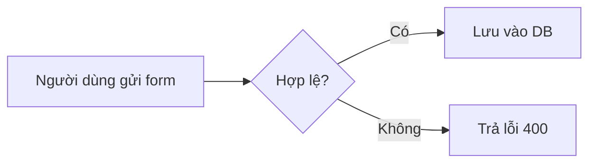

# Markdown Cheat Sheet: file .md là gì, viết README và viết cho AI agent đọc

> Nguồn: https://tiennhm.io.vn/en/blog/markdown-cheat-sheet
> File .md là file gì, mở bằng gì và tạo như thế nào — rồi tới bảng tra cú pháp Markdown đầy đủ: heading, danh sách, bảng, khối mã, task list, alert box, Mermaid, YAML frontmatter. Kèm phần vì sao mọi công cụ AI đều đọc và viết Markdown, những file như CLAUDE.md hay AGENTS.md mà agent tự đọc, và cách viết Markdown để agent hiểu đúng thay vì đoán.

> Bài viết là một Markdown Cheat Sheet đầy đủ, gồm hai nửa. Nửa đầu là bảng tra cú pháp: file .md là gì, mở và tạo bằng cách nào, rồi heading, danh sách, liên kết, ảnh, khối mã, bảng, task list, alert box của GitHub, sơ đồ Mermaid và YAML frontmatter, mỗi loại kèm ví dụ chạy được. Nửa sau trả lời câu hỏi vì sao Markdown trở thành định dạng chung của mọi công cụ AI: nó tốn khoảng một nửa số ký tự so với HTML cho cùng nội dung, nó nằm sẵn trong dữ liệu huấn luyện, và model cũng xuất ra chính nó. Kèm danh sách các file mà trợ lý AI tự đọc trong repo — README.md, CLAUDE.md, AGENTS.md, copilot-instructions.md, Cursor rules, SKILL.md — cùng các quy tắc viết để agent hiểu đúng thay vì đoán.

Bạn có thể tạo một file README trên Github với Markdown. Nhưng markdown là gì và cách tạo một file README trên Github với Markdown như thế nào? Hãy cùng tìm hiểu ở bài viết này nhé!

## Markdown là gì?

Markdown là một ngôn ngữ mã nguồn mở, được sử dụng để viết các file README, với cú pháp dễ hiểu và dễ đọc. Có thể được đọc trên nhiều nền tảng khác nhau, bao gồm những nền tảng web, trên máy tính, và trên các thiết bị di động.

Các định dạng file markdown phổ biến: `.markdown`, `.md`, `.mkd`, `.mkdown`, `.text`, `.mdown`...

Markdown là một trong số những markup language được sử dụng phổ biến nhất. Bên cạnh Markdown, bạn có thể sử dụng các markup language khác như [HTML](https://www.w3schools.com/html/), [XML](https://www.w3schools.com/xml/)...

Đặc biệt, bạn hoàn toàn có thể sử dụng cú pháp của các thẻ HTML trong file file markdown.

## File `.md` là gì và mở bằng gì

`.md` là phần mở rộng của file Markdown — một **file văn bản thuần** (plain text), không phải định dạng nhị phân như `.docx` hay `.pdf`. Mở nó bằng Notepad vẫn đọc được toàn bộ nội dung, chỉ là không thấy phần định dạng được render ra.

Vì là văn bản thuần nên:

- **Mở được bằng bất kỳ trình soạn thảo nào** — Notepad, TextEdit, Vim, VS Code.
- **Git so sánh được từng dòng**, nên review thay đổi trong pull request rất dễ. Đây là lý do tài liệu kỹ thuật thường viết bằng Markdown thay vì Word.
- **Không phụ thuộc phần mềm nào cả.** File `.docx` mà thiếu Word thì chật vật, còn `.md` thì mười năm sau vẫn đọc được.

Muốn xem bản đã render thì dùng công cụ có chế độ xem trước:

| Công cụ | Cách xem trước |
|---|---|
| VS Code | `Ctrl` + `Shift` + `V`, hoặc biểu tượng chia đôi màn hình |
| GitHub / GitLab | Tự render khi mở file `.md` trong repo |
| Typora, Obsidian | Render trực tiếp ngay lúc gõ |
| Trình duyệt | Cần tiện ích mở rộng như Markdown Viewer |

Các phần mở rộng khác cũng là Markdown: `.markdown`, `.mkd`, `.mdown`, `.mkdown`. Dùng phổ biến nhất vẫn là `.md`.

## Cách tạo file `.md`

Không cần phần mềm chuyên dụng. Chọn cách nào tiện nhất:

**Cách 1 — VS Code (khuyên dùng)**

1. `File` → `New File`.
2. `Ctrl` + `S` để lưu, đặt tên kèm đuôi `.md`, ví dụ `README.md`.
3. Gõ nội dung, rồi `Ctrl` + `Shift` + `V` để xem bản render.

**Cách 2 — Ngay trên GitHub, không cần cài gì**

1. Vào repo → `Add file` → `Create new file`.
2. Đặt tên `README.md`.
3. Gõ nội dung, dùng tab `Preview` để xem trước, rồi `Commit changes`.

**Cách 3 — Dòng lệnh**

```bash
# Linux / macOS
touch README.md

# Windows PowerShell
New-Item README.md
```

**Cách 4 — Notepad trên Windows**

Mở Notepad, gõ nội dung, rồi `Save As`. Nhớ hai điều: chọn `All Files` ở mục `Save as type` (không thì Windows tự thêm `.txt` thành `README.md.txt`), và chọn encoding `UTF-8` để tiếng Việt không bị lỗi font.

Lưu ý về tên file: `README.md` viết hoa là quy ước, và GitHub nhận cả `readme.md` lẫn `Readme.md`. Nhưng trên Linux tên file phân biệt hoa thường, nên cứ viết hoa toàn bộ cho thống nhất.

## Cú pháp Markdown

### Định dạng text

Markdown hỗ trợ các kiểu định dạng text như sau:

```markdown
- *In nghiêng*
- _In nghiêng_
- **In đậm**
- __In đậm__
- ***In đậm và nghiêng***
- ___In đậm và nghiêng___
- ~~Gạch ngang~~
- *~~In nghiêng và gạch ngang~~*
- **~~In đậm và gạch ngang~~**
- Kiểu<sub>subscript</sub>: H<sub>2</sub>O
- Kiểu<sup>superscript</sup>: E = mc<sup>2</sup>
```

Kết quả:

- *In nghiêng*
- _In nghiêng_
- **In đậm**
- __In đậm__
- ***In đậm và nghiêng***
- ___In đậm và nghiêng___
- ~~Gạch ngang~~
- *~~In nghiêng và gạch ngang~~*
- **~~In đậm và gạch ngang~~**
- Kiểusubscript: H2O
- Kiểusuperscript: E = mc2

### Thanh kẻ ngang

Để tạo thanh kẻ ngang, hãy sử dụng cú pháp sau (dùng tối thiểu 4 dấu `-`):

```mardown
----
```

Kết quả:

----

### Header

Có tất cả 6 header trong Markdown, bạn có thể sử dụng 1-6 `#` để tạo header.

```markdown
# Header 1
## Header 2
### Header 3
#### Header 4
##### Header 5
###### Header 6
```

Kết quả:

- # Header 1
- ## Header 2
- ### Header 3
- #### Header 4
- ##### Header 5
- ###### Header 6

Trong đó, Header 1 là header lớn nhất, Header 6 là header nhỏ nhất. Thông thường, Header 1 sẽ được sử dụng để tạo tiêu đề, các Header khác sẽ được sử dụng để tạo các section trong file README.

### Danh sách

Có 2 loại danh sách trong Markdown, danh sách đánh thứ tự và danh sách không đánh thứ tự.

#### Danh sách đánh thứ tự

Để tạo danh sách đánh thứ tự, bạn có thể sử dụng các số nguyên như sau:

```markdown
1. Item 1
2. Item 2
3. Item 3
```

Kết quả:

1. Item 1
2. Item 2
3. Item 3

Lưu ý: Markdown sẽ tự động đánh thứ tự các item trong danh sách. Ví dụ, khi bạn viết:

```markdown
1. Item 1
1. Item 2
1. Item 3
```

Kết quả:

1. Item 1
1. Item 2
1. Item 3

#### Danh sách không đánh thứ tự

Để tạo danh sách không đánh thứ tự, bạn có thể sử dụng các dấu `-` hoặc `+` như sau:

```markdown
- Item 1
- Item 2
- Item 3
```

Kết quả:

- Item 1
- Item 2
- Item 3

Bạn có thể sử dụng cả 2 loại danh sách trong 1 file README. Ví dụ:

```markdown
- Item 1
- Item 2
    + Item 2.1
    + Item 2.2
- Item 3
    - Item 3.1
    - Item 3.2
        + Item 3.2.1
        + Item 3.2.2
    - Item 3.3
```

Kết quả:

- Item 1
- Item 2
    + Item 2.1
    + Item 2.2
- Item 3
    - Item 3.1
    - Item 3.2
        + Item 3.2.1
        + Item 3.2.2
    - Item 3.3

### Blockquote

Blockquote là một cách để đánh dấu một đoạn văn bản. Bạn có thể sử dụng `>` như sau:

```markdown
> Lorem ipsum dolor sit amet, consectetur adipiscing elit. Integer posuere erat a ante. Aenean eu leo quam. Pellentesque ornare sem lacinia quam venenatis vestibulum.
>> Aenean eu leo quam. Pellentesque ornare sem lacinia quam venenatis vestibulum.
>> Pellentesque ornare sem lacinia quam venenatis vestibulum.

> Quisque rutrum. Aenean imperdiet. Etiam ultricies nisi vel augue. Curabitur ullamcorper ultricies nisi.
```

Kết quả:

> Lorem ipsum dolor sit amet, consectetur adipiscing elit. Integer posuere erat a ante. Aenean eu leo quam. Pellentesque ornare sem lacinia quam venenatis vestibulum.
>> Aenean eu leo quam. Pellentesque ornare sem lacinia quam venenatis vestibulum.
>> Pellentesque ornare sem lacinia quam venenatis vestibulum.

> Quisque rutrum. Aenean imperdiet. Etiam ultricies nisi vel augue. Curabitur ullamcorper ultricies nisi.

### Code

Để đánh dấu một block code, bạn có thể sử dụng dấu `\`` như sau:

```markdown
`print('Hi')`: để viết code trong cùng 1 dòng
```

```
<br />
# Cách viết code trong 1 block
<br />
print("Hello World")
<br />
print("Nice to meet you!")
<br />
```

Bên cạnh đó, bạn có thể highlight một block code bằng cách thêm ngôn ngữ như sau:

```python
<br />
# Cách viết code trong 1 block
<br />
print("Hello World")
<br />
print("Nice to meet you!")
<br />
```

Kết quả:

```python
# Cách viết code trong 1 block
print("Hello World")
print("Nice to meet you!")
```

Danh sách các ngôn ngữ được hỗ trợ, bạn có thể xem tại [đây](https://github.com/github-linguist/linguist/blob/master/lib/linguist/languages.yml).

### Link

Để tạo link, bạn có thể sử dụng cú pháp như sau:

```markdown
[Link trang web của tôi.](https://tiennhm.github.io)
[Gửi mail cho tôi.](mailto:tiennhm.it@gmail.com)
```

Kết quả:

[Link trang web của tôi.](https://tiennhm.github.io)
[Gửi mail cho tôi.](mailto:tiennhm.it@gmail.com)

### Image

Để đính kèm 1 image, bạn có thể sử dụng cú pháp như sau:

```markdown

```

Kết quả:


### Image link

Để đính kèm 1 image vào link, bạn có thể sử dụng cú pháp như sau:

```markdown
[](https://tiennhm.github.io)
```

Kết quả:

[](https://tiennhm.github.io)

### Table

Table là một cách trình bày dữ liệu dạng bảng, trực quan. Bạn có thể sử dụng cú pháp như sau:

```markdown
| Column 1 | Column 2 | Column 3 |
| -------- | -------- | -------- |
| Item 1   | Item 2   | Item 3   |
| Item 4   | Item 5   | Item 6   |
```

Kết quả:

| Column 1 | Column 2 | Column 3 |
| -------- | -------- | -------- |
| Item 1   | Item 2   | Item 3   |
| Item 4   | Item 5   | Item 6   |

Bạn cũng có thể canh lề table bằng cách sử dụng dấu `:` như sau:

```markdown
| Column 1 | Column 2 | Column 3 |
| :------- | :------: | -------: |
| Canh trái Item 1 | Canh giữa Item 2 | Canh phải Item 3 |
| Lorem ipsum dolor sit amet, consectetur adipiscing elit.  | Lorem ipsum dolor sit amet, consectetur adipiscing elit. | Lorem ipsum dolor sit amet, consectetur adipiscing elit. |
```

Kết quả:

| Column 1 | Column 2 | Column 3 |
| :------- | :------: | -------: |
| Canh trái Item 1 | Canh giữa Item 2 | Canh phải Item 3 |
| Lorem ipsum dolor sit amet, consectetur adipiscing elit.  | Lorem ipsum dolor sit amet, consectetur adipiscing elit. | Lorem ipsum dolor sit amet, consectetur adipiscing elit. |

### Task list

Danh sách công việc có ô đánh dấu, GitHub render thành checkbox bấm được ngay trên giao diện issue và pull request:

```markdown
- [x] Dựng khung dự án
- [ ] Viết test
- [ ] Viết tài liệu
```

Kết quả:

- [x] Dựng khung dự án
- [ ] Viết test
- [ ] Viết tài liệu

Dấu cách giữa `-` và `[` là bắt buộc. Thiếu nó thì ra danh sách thường kèm cặp ngoặc vuông.

### Gạch ngang và chú thích chân trang

```markdown
~~Đoạn này đã bỏ~~

Markdown do John Gruber tạo ra năm 2004[^1].

[^1]: Đặc tả gốc ở daringfireball.net/projects/markdown.
```

`~~gạch ngang~~` là cú pháp GFM, chạy trên GitHub, GitLab và phần lớn nền tảng hiện nay. Chú thích chân trang thì kén hơn — GitHub có, nhưng một số trình render không hỗ trợ.

### Khối thu gọn

Cú pháp Markdown không có khối đóng mở, phải mượn HTML:

````html
<details>
<summary>Log lỗi đầy đủ</summary>

```
System.NullReferenceException: Object reference not set...
```

</details>
````

Hữu ích khi muốn giấu bớt log dài hay phần cấu hình rườm rà trong README mà vẫn cho người cần xem mở ra được.

> **Tip: Dòng trống sau `` là bắt buộc. Thiếu nó, GitHub coi toàn bộ phần bên trong là HTML thô và không render Markdown nữa.**
>
>
### Alert box của GitHub

GitHub nhận năm loại hộp cảnh báo, viết như blockquote kèm nhãn:

```markdown
> [!NOTE]
> Thông tin nên biết.

> [!TIP]
> Mẹo giúp làm nhanh hơn.

> [!IMPORTANT]
> Thông tin thiết yếu để dùng được.

> [!WARNING]
> Nội dung cần chú ý ngay.

> [!CAUTION]
> Rủi ro nếu làm sai.
```

Đây là cú pháp riêng của GitHub. Nơi khác render nó thành blockquote thường — vẫn đọc được, chỉ mất màu sắc.

### Sơ đồ với Mermaid

GitHub render trực tiếp khối mã gắn nhãn `mermaid` thành sơ đồ:

````markdown

````

Sơ đồ nằm ngay trong file văn bản nên Git so sánh được từng dòng, khác hẳn việc nhúng ảnh PNG xuất từ công cụ vẽ. Sửa một mũi tên là thấy rõ trong diff.

### YAML frontmatter

Khối nằm trên cùng file, kẹp giữa hai dòng ba gạch ngang, chứa **siêu dữ liệu** của tài liệu chứ không phải nội dung:

```markdown
---
title: Hướng dẫn cài đặt
author: TienNHM
date: 2026-09-30
tags: [docs, setup]
---

# Hướng dẫn cài đặt

Nội dung bắt đầu từ đây.
```

Bản thân Markdown không định nghĩa frontmatter — nó là quy ước do công cụ đặt ra, và nay là quy ước gần như phổ quát. Jekyll, Hugo, Docusaurus, Obsidian đều đọc nó. Quan trọng hơn với chủ đề phần sau: **các công cụ AI cũng dùng đúng khối này** để biết tài liệu nói về cái gì trước khi đọc nội dung.

Ba gạch ngang phải nằm ở **dòng đầu tiên**, không có dòng trống hay ký tự nào phía trên. Sai chỗ này thì công cụ coi cả khối là nội dung và in ra nguyên xi.

## README.md là gì và nên có những gì

`README.md` là file GitHub tự động hiển thị ngay dưới danh sách file khi ai đó mở repo. Nó là thứ đầu tiên người lạ nhìn thấy, nên đáng viết tử tế.

Một README dùng được thường có các phần sau, theo đúng thứ tự người đọc cần:

| Phần | Trả lời câu hỏi |
|---|---|
| Tên và mô tả một dòng | Dự án này là cái gì? |
| Ảnh chụp màn hình hoặc GIF | Nó trông như thế nào? |
| Cài đặt | Làm sao chạy được trên máy tôi? |
| Cách dùng | Dùng nó ra sao, kèm ví dụ cụ thể |
| Cấu hình | Có biến môi trường hay tham số nào cần đặt? |
| Đóng góp | Muốn gửi pull request thì làm thế nào? |
| Giấy phép | Tôi được phép dùng nó vào việc gì? |

Lỗi phổ biến nhất là viết dài dòng về động cơ và triết lý thiết kế ở đầu file, trong khi người đọc chỉ cần biết **chạy nó lên bằng cách nào**. Đặt phần cài đặt lên càng sớm càng tốt.

Ngoài `README.md`, GitHub còn nhận diện vài file Markdown đặc biệt khác: `CONTRIBUTING.md` hiện lên khi ai đó mở pull request, `LICENSE` được đọc để hiển thị nhãn giấy phép, và `.github/ISSUE_TEMPLATE/*.md` dùng làm mẫu cho issue mới.

## Markdown trong thời AI agent

Vài năm trước, Markdown là thứ chỉ lập trình viên cần biết để viết README. Bây giờ nó là **định dạng mà gần như mọi công cụ AI dùng để đọc và viết** — từ ChatGPT, Claude, Gemini cho tới các agent chạy trong terminal và trình soạn thảo. Biết Markdown giờ giống biết gõ mười ngón: không bắt buộc, nhưng thiếu nó thì mọi việc chậm hơn hẳn.

Phần này giải thích **vì sao** lại như vậy, chứ không chỉ liệt kê.

### Vì sao AI đọc Markdown tốt hơn các định dạng khác

**Thứ nhất, nó rẻ.** Model tính tiền và tính giới hạn theo token, mà token thì tỉ lệ thuận với số ký tự. Cùng một nội dung — một tiêu đề, một đoạn văn, một danh sách ba mục, một bảng ba cột và một khối lệnh — viết bằng hai định dạng rồi đếm:

| Định dạng | Số ký tự |
|---|---|
| Markdown | 258 |
| HTML tương đương | 514 |

HTML tốn gấp đôi cho **đúng cùng một lượng thông tin**. Phần dôi ra toàn là thẻ đóng, thẻ mở và dấu ngoặc — thứ model phải đọc nhưng không mang thêm ý nghĩa nào. Trên một tài liệu dài, khoản chênh đó là phần ngữ cảnh bạn mất đi mà không đổi lại được gì.

**Thứ hai, nó nằm sẵn trong dữ liệu huấn luyện.** Các model được huấn luyện trên lượng lớn văn bản từ GitHub, Stack Overflow, tài liệu kỹ thuật — nơi Markdown là mặc định. Nói cách khác, model đã đọc hàng triệu file `.md` trước khi gặp file của bạn. Đó là lý do nó đoán đúng ý đồ của bạn khi bạn viết `##` mà không cần giải thích.

**Thứ ba, nó vừa có cấu trúc vừa đọc được ở dạng thô.** JSON có cấu trúc nhưng người đọc mệt. Văn bản thuần dễ đọc nhưng không cho biết đâu là tiêu đề, đâu là mã. Markdown nằm giữa: model biết `##` mở một mục mới, khối ba backtick là mã không phải văn xuôi, `|` là bảng — mà bạn vẫn đọc file thô bình thường.

**Thứ tư, chiều ngược lại cũng đúng.** Model **xuất ra** Markdown theo mặc định. Nên khi bạn đưa Markdown vào và nhận Markdown ra, không có bước chuyển đổi nào ở giữa để làm hỏng dữ liệu.

> **Note: Điều này không có nghĩa "cứ Markdown là tốt". Dữ liệu bảng lớn hàng nghìn dòng thì CSV hay JSON hợp lý hơn — Markdown không có kiểu dữ liệu, không kiểm tra được tính hợp lệ. Markdown mạnh ở **tài liệu cho người đọc mà máy cũng cần hiểu**.**
>
>
### Những file Markdown mà công cụ AI tự đọc

Đây là phần đổi trực tiếp thành việc: nếu repo của bạn có sẵn những file này, trợ lý AI sẽ tự đọc chúng trước khi làm việc, không cần bạn dán lại mỗi lần.

| File | Công cụ đọc nó | Dùng để làm gì |
|---|---|---|
| `README.md` | Gần như mọi công cụ | Hiểu dự án là gì, chạy bằng cách nào |
| `CLAUDE.md` | Claude Code | Quy ước riêng của repo: lệnh build, phong cách code, điều cấm |
| `AGENTS.md` | Codex và một số agent khác | Vai trò tương tự, theo quy ước đang dần phổ biến |
| `.github/copilot-instructions.md` | GitHub Copilot | Hướng dẫn áp cho mọi gợi ý trong repo |
| `.cursor/rules/*.mdc` | Cursor | Quy tắc theo từng thư mục, có frontmatter chỉ định phạm vi |
| `SKILL.md` | Agent Skills | Một kỹ năng đóng gói, xem [bài về cơ chế skill](https://tiennhm.io.vn/blog/agent-skills-co-che-va-tri-thuc-bi-bo-qua) |
| `llms.txt` | Đề xuất chuẩn, mức áp dụng còn lẻ tẻ | Bản đồ nội dung site cho model đọc |

Điểm chung: **tất cả đều là Markdown, không có định dạng riêng nào cả**. Công cụ khác nhau, tên file khác nhau, nhưng cú pháp bên trong là thứ bạn vừa đọc ở nửa đầu bài này.

Thêm một điểm chung nữa: nội dung các file đó là **văn bản thuyết phục, không phải mệnh lệnh cưỡng chế**. Model đọc rồi tự quyết định có làm theo hay không. Viết mơ hồ thì nó làm theo kiểu mơ hồ.

### Viết Markdown để AI agent đọc đúng

Khi người đọc là model chứ không phải người, vài thói quen đổi khác:

**Tiêu đề là đơn vị truy xuất.** Agent thường không đọc cả file mà tìm tới phần liên quan. Một `##` nên gói trọn một chủ đề trả lời được độc lập. Tiêu đề kiểu "Phần 2" hay "Ghi chú thêm" là vô dụng — nó không cho biết bên dưới có gì. Đặt tên theo câu hỏi mà mục đó trả lời.

**Luôn gắn nhãn ngôn ngữ cho khối mã.** ` ```bash ` với ` ```json ` là hai chỉ dẫn khác nhau hoàn toàn: một cái bảo "đây là lệnh chạy được", cái kia bảo "đây là dữ liệu". Khối mã trần không nhãn buộc model phải đoán.

**Bảng cho sự kiện, văn xuôi cho lý lẽ.** Cần model trích ra chính xác một tập giá trị — tên biến môi trường, mã lỗi, phiên bản — thì đưa vào bảng. Bảng có ranh giới rõ nên khó đọc nhầm. Còn giải thích vì sao thì viết thành câu, đừng nhồi vào ô bảng.

**Đừng lồng quá ba cấp.** Danh sách lồng sâu làm quan hệ cha con nhoè đi khi văn bản bị cắt nhỏ để đưa vào ngữ cảnh. Sâu quá thì tách thành mục riêng.

**Nói rõ điều KHÔNG nên làm.** Model suy ra quy tắc từ ví dụ nó thấy. Nếu trong repo có hai cách làm cùng một việc, hãy viết thẳng cách nào đã bỏ — nếu không nó sẽ bắt chước cả hai.

**Ưu tiên đường dẫn tương đối trong repo.** `[cấu hình](./config/README.md)` giúp agent mở đúng file. Link tuyệt đối ra ngoài thì nó phải gọi mạng, chậm hơn và có khi không gọi được.

### Một ví dụ: cùng nội dung, hai cách viết

Viết thế này, agent đoán mò:

```markdown
## Ghi chú

Nhớ là project dùng pnpm nha. Test thì chạy như bình thường thôi.
Có một số chỗ còn dùng cách cũ, đừng đụng vào.
```

Viết thế này, agent làm đúng:

```markdown
## Lệnh thường dùng

| Việc | Lệnh |
|---|---|
| Cài phụ thuộc | `pnpm install` |
| Chạy test | `pnpm test` |
| Chạy một file test | `pnpm test -- path/to/file.spec.ts` |

Dùng `pnpm`, không dùng `npm` — repo có `pnpm-lock.yaml`, chạy `npm install`
sẽ sinh lockfile thứ hai gây lệch phiên bản.

Thư mục `src/legacy/` đang chờ gỡ bỏ. Không thêm code mới vào đó; sửa lỗi
thì sửa tại chỗ, không refactor.
```

Bản thứ hai dài hơn nhưng **không có chỗ nào phải đoán**: lệnh nằm trong bảng, lý do nằm trong câu, phạm vi cấm được chỉ đích danh bằng đường dẫn.

## Những chỗ Markdown hay gãy

Phần lớn lỗi Markdown đến từ vài quy tắc về khoảng trắng mà nhìn không thấy được:

| Triệu chứng | Nguyên nhân | Cách sửa |
|---|---|---|
| Xuống dòng bị nhập lại thành một đoạn | Markdown gộp các dòng liền nhau | Để một dòng trống, hoặc đặt `\` cuối dòng |
| Danh sách không ra danh sách | Thiếu dòng trống trước mục đầu tiên | Thêm dòng trống ngay trên `-` |
| Chữ giữa từ tự nhiên in nghiêng | `snake_case_name` bị hiểu là dấu nhấn mạnh | Bọc trong backtick, hoặc thoát bằng `\_` |
| Bảng vỡ cột | Có dấu `\|` trong nội dung ô | Thoát thành `\\\|` |
| Khối mã đóng sớm | Bên trong có ba backtick | Dùng bốn backtick cho khối ngoài |
| Đánh số nhảy lung tung | Mọi mục đều ghi `1.` | Không sao — trình render tự đánh lại đúng thứ tự |
| Frontmatter in ra nguyên xi | `---` không nằm ở dòng đầu tiên | Xoá mọi dòng trống phía trên |

Cái bẫy kinh điển nhất là **xuống dòng bằng hai dấu cách cuối dòng**. Nó chạy được, nhưng hai dấu cách đó vô hình, và phần lớn trình soạn thảo cấu hình "xoá khoảng trắng thừa khi lưu" sẽ âm thầm ăn mất chúng. Dùng `\` cuối dòng thì nhìn thấy được và không bị ai xoá.

## Kết luận

Markdown được tạo ra năm 2004 với một mục tiêu khiêm tốn: viết cho người đọc, để máy render ra HTML. Hai mươi năm sau nó trúng một vai trò không ai thiết kế trước — **định dạng chung giữa người và model**.

Lý do không phải may mắn. Nó rẻ về token, nằm sẵn trong dữ liệu huấn luyện, có cấu trúc vừa đủ để máy phân tích mà vẫn đọc được ở dạng thô. Ba tính chất đó tình cờ đúng là thứ một agent cần.

Nên câu "ai cũng nên biết Markdown" bây giờ không còn là lời khuyên dành riêng cho lập trình viên. Toàn bộ cú pháp thực dụng gói gọn trong khoảng mười ký hiệu, học một buổi là xong, và bạn dùng nó mỗi lần mở một công cụ AI — dù có để ý hay không.

Chỗ đáng đầu tư thêm không phải là nhớ thêm cú pháp, mà là **viết rõ hơn**: một tiêu đề nói đúng nội dung bên dưới, một khối mã có nhãn ngôn ngữ, một bảng thay cho đoạn văn lấp lửng. Người đọc được lợi. Model cũng vậy.

### File .md là file gì?

File .md là file Markdown, một file văn bản thuần chứa nội dung kèm các ký hiệu định dạng đơn giản như dấu thăng cho tiêu đề và dấu sao cho in đậm. Vì là văn bản thuần nên mở được bằng bất kỳ trình soạn thảo nào và Git so sánh được từng dòng, đó là lý do tài liệu kỹ thuật thường viết bằng Markdown thay vì Word.

### Mở file .md bằng gì?

Mở bằng bất kỳ trình soạn thảo văn bản nào, kể cả Notepad. Muốn xem bản đã render thì dùng VS Code với phím tắt Ctrl Shift V, hoặc các ứng dụng chuyên dụng như Typora và Obsidian. GitHub và GitLab tự render file .md khi bạn mở nó trong repo.

### Cách tạo file .md như thế nào?

Cách nhanh nhất là mở VS Code, tạo file mới rồi lưu với tên kèm đuôi .md, ví dụ README.md. Cũng có thể tạo thẳng trên GitHub qua Add file rồi Create new file mà không cần cài gì, hoặc dùng lệnh touch README.md trên Linux và macOS, New-Item README.md trên PowerShell. Nếu dùng Notepad thì nhớ chọn All Files khi lưu để Windows không tự thêm đuôi .txt.

### README.md là gì?

README.md là file Markdown mà GitHub tự động hiển thị ngay dưới danh sách file khi ai đó mở repo. Nó là thứ đầu tiên người lạ nhìn thấy, thường gồm tên và mô tả dự án, ảnh minh hoạ, hướng dẫn cài đặt, cách dùng, cấu hình, cách đóng góp và giấy phép.

### Tên file README viết hoa hay viết thường?

Quy ước là viết hoa toàn bộ thành README.md. GitHub nhận cả readme.md lẫn Readme.md, nhưng hệ thống file trên Linux phân biệt chữ hoa chữ thường nên viết hoa toàn bộ là cách an toàn và thống nhất nhất.

### Có dùng được thẻ HTML trong file Markdown không?

Được. Markdown cho phép chèn thẳng thẻ HTML, nên những thứ cú pháp Markdown không làm được như căn giữa ảnh, gộp ô trong bảng hay tạo khối thu gọn bằng thẻ details đều xử lý được bằng HTML. Tuy nhiên một số nền tảng lọc bớt thẻ vì lý do bảo mật, ví dụ GitHub loại bỏ thẻ script và phần lớn thuộc tính style.

### Vì sao các công cụ AI đều dùng Markdown?

Có bốn lý do. Thứ nhất là chi phí: cùng một nội dung, Markdown tốn khoảng một nửa số ký tự so với HTML tương đương, mà model tính giới hạn ngữ cảnh theo token nên phần dôi ra của HTML là ngữ cảnh bị lãng phí. Thứ hai, Markdown có mặt dày đặc trong dữ liệu huấn luyện vì GitHub và tài liệu kỹ thuật đều dùng nó. Thứ ba, nó vừa có cấu trúc cho máy phân tích vừa đọc được ở dạng thô. Thứ tư, model xuất ra Markdown theo mặc định nên không cần bước chuyển đổi nào ở giữa.

### File CLAUDE.md và AGENTS.md là gì?

Đó là các file Markdown đặt ở gốc repo để trợ lý AI tự đọc trước khi làm việc, chứa quy ước riêng của dự án như lệnh build, phong cách code và những điều không được làm. CLAUDE.md là quy ước của Claude Code, còn AGENTS.md là quy ước đang dần phổ biến cho các agent khác. Cả hai chỉ là Markdown thường, không có định dạng riêng nào cả.

### YAML frontmatter trong file Markdown là gì?

Là khối siêu dữ liệu nằm trên cùng file, kẹp giữa hai dòng ba gạch ngang, chứa các trường như title, author, date, tags. Bản thân Markdown không định nghĩa nó; đây là quy ước do công cụ đặt ra và nay gần như phổ quát, được Jekyll, Hugo, Docusaurus, Obsidian cùng nhiều công cụ AI đọc. Ba gạch ngang phải nằm ở dòng đầu tiên, không có dòng trống nào phía trên, nếu không cả khối sẽ bị in ra nguyên xi.

### Viết Markdown thế nào để AI agent hiểu đúng?

Đặt tiêu đề theo câu hỏi mà mục đó trả lời, vì agent thường tìm tới phần liên quan chứ không đọc cả file. Luôn gắn nhãn ngôn ngữ cho khối mã để phân biệt lệnh chạy được với dữ liệu. Dùng bảng cho các giá trị cần trích chính xác và văn xuôi cho phần giải thích lý do. Không lồng danh sách quá ba cấp. Nói rõ cả điều không nên làm, vì model suy ra quy tắc từ những gì nó thấy trong repo.

### Vì sao xuống dòng trong Markdown không ăn?

Markdown gộp các dòng liền nhau thành một đoạn, nên bấm Enter một lần không tạo dòng mới. Cách chuẩn là để một dòng trống giữa hai đoạn. Nếu cần ngắt dòng ngay trong cùng một đoạn thì đặt dấu gạch chéo ngược ở cuối dòng. Cách cũ là gõ hai dấu cách cuối dòng, nhưng hai dấu cách đó vô hình và phần lớn trình soạn thảo có bật tuỳ chọn xoá khoảng trắng thừa khi lưu sẽ âm thầm xoá mất.

### Markdown khác HTML ở điểm nào?

Cả hai đều là ngôn ngữ đánh dấu nhưng Markdown ưu tiên việc đọc được ngay ở dạng thô, còn HTML ưu tiên khả năng mô tả cấu trúc đầy đủ. Markdown gọn hơn nhiều, chẳng hạn một dấu thăng thay cho cặp thẻ h1, đổi lại nó chỉ phủ những thành phần thông dụng. Khi cần thứ Markdown không có, chèn thẳng HTML vào là được.

## Bài liên quan

- [Trắc nghiệm hệ thống file](https://tiennhm.io.vn/docs/operating-system/quiz/file-system) — Trắc nghiệm hệ thống file - FCB, các lớp chức năng, volume control block, bảng FAT, giới hạn của FAT32 và NTFS.
