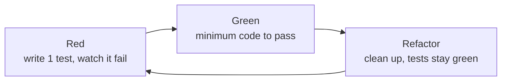

# TDD (Test-Driven Development): What the Research Says and How to Apply It Properly

> Nguồn: https://tiennhm.io.vn/en/blog/tdd-test-driven-development
> TDD is a technique where you write a failing test first, write the minimum code to pass it, then refactor. This post reviews the empirical studies (Nagappan 2008, Rafique & Mišić 2013, Fucci 2017), separates what has been shown from what is still disputed, and walks through a C# kata with xUnit to show the Red-Green-Refactor cycle in practice.

> **TDD (Test-Driven Development)** repeats three short steps: write a **failing** test (Red), write the **minimum** code to make it pass (Green), then **clean up** while keeping the tests green (Refactor). The empirical evidence is not black and white. In four industrial teams (Microsoft, IBM), defect density dropped **40–90%** but initial development time rose **15–35%**. A meta-analysis of 27 studies found only a **small** quality improvement and **little to no** effect on productivity. An experiment with 39 professional developers found that the order of writing tests and code had **no important influence**; results tracked **small, steady steps**. TDD is worth using as a design and fast-feedback tool, not as dogma.

Most TDD articles fall into two extremes: either a promise of "clean code, fewer bugs" with no numbers, or a "TDD is dead" argument with no evidence. This post takes the middle path: read what the research actually measured, then apply it in a C# example small enough to follow along.

## TL;DR
- TDD = the **Red → Green → Refactor** loop, a few minutes per cycle, formalized by Kent Beck (2002).
- Industrial evidence: defects **down 40–90%**, initial time **up 15–35%** (Nagappan et al., 2008).
- Meta-analysis of 27 studies: effect on quality **positive but small**, effect on productivity **barely visible** (Rafique & Mišić, 2013).
- What is associated with good results is **step granularity** and uniformity; test-first ordering has **no important influence** (Fucci et al., 2017, 39 professional developers).
- TDD fits **pure business logic** best, and fits UI, exploratory spikes and infrastructure integration poorly.
- Don't measure TDD by "number of tests" or "% coverage"; measure the **time from making a change to knowing what you broke**.

---

## What TDD is, and what it is not
Beck describes TDD as two rules: write new code only when an automated test is failing, and remove duplication. That yields three phases:

| Phase | What you do | Exit condition |
| --- | --- | --- |
| **Red** | Write **one** test describing the desired behavior | The test runs and **fails for the right reason** |
| **Green** | Write the minimum code, hard-coding if needed | All tests are green |
| **Refactor** | Clean up code and tests without changing behavior | Tests are still green |



Distinguish it from things that often get lumped together:

- **Test-first** is only about ordering (write the test first). TDD adds **disciplined refactoring** and taking small steps.
- **Unit tests** are the product. TDD is the **process** that produces them and, more importantly, produces a *design*.
- **ATDD/BDD** put tests at the business-behavior level, often forming an outer loop around the unit-level TDD loop.

An easily missed point: the Red phase must **fail for the right reason**. A test that is red because of a `NullReferenceException` inside the test code proves nothing about the behavior you want to build.

## The research evidence
This section separates what was measured from what is merely belief. The studies differ in context (students or professionals, experiment or case study), so read them as slices, not a single number.

| Study | Type | Main result |
| --- | --- | --- |
| Nagappan, Maximilien, Bhat, Williams (2008), *Empirical Software Engineering* | Case study, 4 industrial teams | Defect density down **40–90%**, development time up **15–35%** |
| Rafique & Mišić (2013), *IEEE TSE* | Meta-analysis of 27 studies | **Small** improvement in external quality, **little to no** effect on productivity; industrial studies show both a **larger** quality gain and a **larger** productivity drop than academic ones |
| Fucci et al. (2017), *IEEE TSE* | Experiment, 39 professional developers | Order of writing test and code had **no important influence**; quality and productivity gains were tied to **granularity** and **uniformity** of steps |
| Karac & Turhan (2018), *IEEE Software* | Overview article | Examines how far TDD has lived up to its promises, stressing that TDD is more than writing tests first |
| Causevic, Sundmark, Punnekkat (2011), *ICST* | Systematic review | Seven factors limiting adoption, including increased development time, lack of TDD experience, lack of upfront design, domain- and tool-specific issues, and legacy code |

Three takeaways:

1. **Fewer defects, but not for free.** The 40–90% figure is attractive, but it comes with 15–35% more time. Worth it for a team paying for production bugs; not for a throwaway prototype.
2. **Small effects when studies are pooled.** Rafique & Mišić found that both the quality gain *and* the productivity drop were larger in industrial than in academic studies, meaning real-world context amplifies both the benefit and the price. The productivity drop was also larger when the TDD group spent significantly more test effort than the control group.
3. **Mechanism matters more than the label.** In Fucci's experiment, the order of writing tests and code had no important influence; results tracked small, steady steps. The authors suggest the benefit comes from "fine-grained, steady steps that improve focus and flow". What is worth keeping is the **short feedback loop**.

> A note on sources: the figures from Nagappan, Rafique & Mišić and Fucci were checked against the published abstracts. If you cite them for academic purposes, open the original papers to check sample context, measures and confidence intervals.

## Why it may work: three mechanisms
1. **Short feedback.** A bug is found minutes after typing it, while you still remember what you changed. The cost of finding a bug grows sharply with the distance from where it was introduced.
2. **Tests are executable requirements.** Writing the test first forces you to answer "what does this function take, what does it return, what happens on error" *before* thinking about implementation.
3. **Design is pulled toward testability.** Code that is hard to test is often tightly coupled. The discomfort of writing a test is a design signal, not a tooling problem.

The limit is worth stating plainly: the third mechanism only holds if you **listen** to that signal. If you hit a hard-to-test unit and paper over it with a thicket of mocks, TDD only adds maintenance weight.

## Practice: an order-pricing kata in C# and xUnit
Assumed requirements, small enough to follow:

- Orders of **1,000,000** or more get **10%** off.
- **VIP** customers get an extra **5%**, stacked on top.
- A **negative** subtotal is invalid input.

### Cycle 1: Red, then Green by faking it
The first test picks the simplest case:

```csharp
public class OrderPricingTests
{
    [Fact]
    public void Total_UnderThreshold_NoDiscount()
    {
        var pricing = new OrderPricing();

        Assert.Equal(500_000m, pricing.Total(500_000m, isVip: false));
    }
}
```

At this point `OrderPricing` doesn't exist so it won't compile; that is itself a form of Red. Create an empty class whose method throws `NotImplementedException` so the test **runs and fails** for the right reason, then write just enough to pass:

```csharp
public class OrderPricing
{
    public decimal Total(decimal subtotal, bool isVip) => subtotal;
}
```

This is the **Fake It** technique: return what the test needs and don't rush to generalize.

### Cycle 2: triangulation
Add a test that forces the code to actually compute something (**triangulation**):

```csharp
[Fact]
public void Total_AtThreshold_Gets10PercentOff()
{
    var pricing = new OrderPricing();

    Assert.Equal(900_000m, pricing.Total(1_000_000m, isVip: false));
}
```

This test is red. The minimal implementation:

```csharp
public decimal Total(decimal subtotal, bool isVip)
    => subtotal >= 1_000_000m ? subtotal * 0.90m : subtotal;
```

The boundary case (exactly at the threshold) is where `>` versus `>=` bugs like to hide; writing it as a test early is a cheap and effective habit.

### Cycle 3: VIP and invalid input
```csharp
[Fact]
public void Total_VipUnderThreshold_Gets5PercentOff()
{
    var pricing = new OrderPricing();

    Assert.Equal(475_000m, pricing.Total(500_000m, isVip: true));
}

[Fact]
public void Total_VipAtThreshold_StacksTo15Percent()
{
    var pricing = new OrderPricing();

    Assert.Equal(850_000m, pricing.Total(1_000_000m, isVip: true));
}

[Fact]
public void Total_NegativeSubtotal_Throws()
{
    var pricing = new OrderPricing();

    Assert.Throws<ArgumentOutOfRangeException>(
        () => pricing.Total(-1m, isVip: false));
}
```

By now the implementation has nested conditions, so it is time to **Refactor** while every test is green:

```csharp
public class OrderPricing
{
    const decimal BulkThreshold = 1_000_000m;
    const decimal BulkRate = 0.10m;
    const decimal VipRate = 0.05m;

    public decimal Total(decimal subtotal, bool isVip)
    {
        if (subtotal < 0)
            throw new ArgumentOutOfRangeException(nameof(subtotal));

        var rate = 0m;
        if (subtotal >= BulkThreshold) rate += BulkRate;
        if (isVip) rate += VipRate;

        return subtotal * (1 - rate);
    }
}
```

The refactor pays off: business numbers get names, and the stacking rule lives in one place. The test suite is the safety net: if someone later switches from additive to multiplicative discounts, `StacksTo15Percent` goes red immediately.

> Verification note: the expected values (475,000, 850,000, 900,000) were computed by hand from the rules; the C# code in this post was not compiled or run while writing. Run `dotnet test` on your machine before using it.

### Three common mistakes when starting out
- **Writing many tests at once** and then the code. You lose the short feedback loop, the most valuable part of TDD.
- **Skipping Refactor.** Doing only Red-Green yields working but messy code, and the tests gradually become a burden.
- **Tests tied to implementation** (asserting which internal method was called) instead of observable behavior. Change the implementation and the tests break even though behavior didn't change.

## Two schools: Chicago and London
When code has dependencies (repositories, gateways), TDD splits into two approaches:

| | **Chicago (classicist)** | **London (mockist)** |
| --- | --- | --- |
| Tests check | Resulting **state** | **Interactions** between objects |
| Dependencies | Real objects or simple fakes | Replaced with mocks |
| Works from | Inside out | Outside in |
| Risk | Broader tests, harder to localize failures | Tests coupled to internal structure, brittle under refactoring |

Fowler analyzes this difference in *Mocks Aren't Stubs*, and Freeman & Pryce present the London style in *Growing Object-Oriented Software, Guided by Tests*. There is no absolute right answer; for pure business logic like the kata above, the Chicago style is usually less painful.

## When TDD is not a good choice
- **Exploratory code (spikes).** When you don't yet know what you are building, writing tests first only locks in a wrong assumption. Spike, learn, throw it away, then rewrite with TDD.
- **UI and visual effects.** The result needs human eyes; snapshot-style tests give little benefit relative to their maintenance cost.
- **Infrastructure integration** (database, queue, network). Mocking infrastructure gives false comfort; deliberate integration tests are more trustworthy.
- **Legacy code with no seams.** You need to break dependencies first, following Feathers in *Working Effectively with Legacy Code*, before TDD is possible.

This also matches the adoption-limiting factors Causevic et al. summarize: legacy code, domain- and tool-specific issues, and lack of TDD experience.

## Adoption checklist
**Before declaring 'our team does TDD'**

- [ ] Each new test is run and seen failing for the right reason before any code is written
- [ ] Each Red-Green cycle lasts minutes, not hours
- [ ] The Refactor phase actually happens, not skipped under pressure
- [ ] Tests assert observable behavior, not implementation details
- [ ] Edge cases (thresholds, empty, negative, null) are written as tests early
- [x] Used in the right places: pure business logic, not forced onto UI or spikes

## Frequently asked questions
## Frequently asked questions about TDD

### Does TDD really reduce defects?

There are signs it does, but the size depends on context. The case study of four industrial teams by Nagappan et al. (2008) recorded a 40–90% drop in defect density versus comparable projects not using TDD. The meta-analysis of 27 studies by Rafique and Mišić (2013) found only a small improvement in external quality, though the improvement in industrial studies was larger than in academic ones. The cautious reading: TDD usually helps, but don't expect the best-case figure to apply to your team.

### How much does TDD slow development down?

Nagappan et al. reported initial development time rising by about 15–35%. That cost is expected to be recovered in bug fixing and maintenance. For long-lived products it is usually worth it; for short-lived experiments it may not be.

### Is writing tests after the code worse than TDD?

Not necessarily. The experiment by Fucci et al. (2017) with 39 professional developers concluded that the order of writing tests and code had no important influence; quality and productivity were tied to working in small, steady steps. However, writing tests afterward tends to produce tests that merely mirror the existing code and skip the hard cases. TDD enforces that discipline through the structure of the process.

### How is TDD different from ordinary unit testing?

Unit tests are the product: small pieces of code that check a unit. TDD is the process that produces them through the Red-Green-Refactor loop, while also using tests to drive design. You can have unit tests without doing TDD, but you can't do TDD without automated tests.

### Should I use mocks in TDD?

Selectively. Mocks suit system boundaries such as calls to external services. Mocking every internal dependency couples tests to code structure and breaks them under refactoring even when behavior is unchanged. Prefer real objects or simple fakes when the cost is low.

## Conclusion
TDD is not a cure-all, and the research is not strong enough to turn it into dogma. What the research supports is a broader principle than the "TDD" label: **take small steps, get automated feedback after each one, and clean up regularly**.

Three things to remember:

1. **Accept the real trade-off.** Fewer defects in exchange for more up-front time; weigh it against your product's lifetime.
2. **Keep the steps small.** This is what the recent experiment points to, and it is also what slips first under pressure.
3. **Use it in the right place.** Pure business logic is TDD's home turf; UI, spikes and infrastructure need other tools.

## References
- Beck, K. (2002). *Test-Driven Development: By Example*. Addison-Wesley.
- Nagappan, N., Maximilien, E. M., Bhat, T., Williams, L. (2008). Realizing quality improvement through test driven development: results and experiences of four industrial teams. *Empirical Software Engineering*, 13(3), 289–302.
- Rafique, Y., Mišić, V. B. (2013). The effects of test-driven development on external quality and productivity: a meta-analysis. *IEEE Transactions on Software Engineering*, 39(6), 835–856.
- Fucci, D., Erdogmus, H., Turhan, B., Oivo, M., Juristo, N. (2017). A dissection of the test-driven development process: does it really matter to test-first or to test-last? *IEEE Transactions on Software Engineering*, 43(7), 597–614.
- Karac, I., Turhan, B. (2018). What do we (really) know about test-driven development? *IEEE Software*, 35(4), 81–85.
- Causevic, A., Sundmark, D., Punnekkat, S. (2011). Factors limiting industrial adoption of test driven development: a systematic review. *ICST 2011*, 337–346.
- Fowler, M. (2007). *Mocks Aren't Stubs*. martinfowler.com.
- Freeman, S., Pryce, N. (2009). *Growing Object-Oriented Software, Guided by Tests*. Addison-Wesley.
- Feathers, M. (2004). *Working Effectively with Legacy Code*. Prentice Hall.

---

**Last updated**: October 2026
