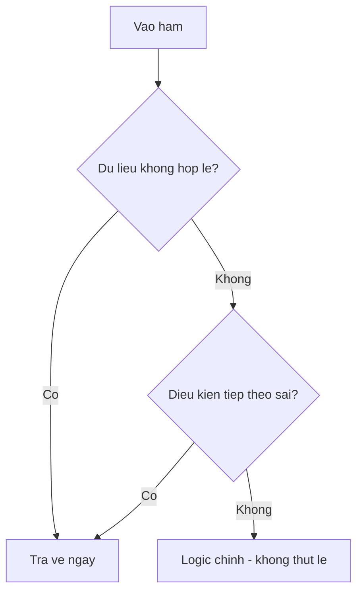

# 1.2 — 2. Điều Kiện (Conditions)

> Nguồn: https://tiennhm.io.vn/en/docs/dotnet-backend-zero-to-senior/stage-01-foundation/module-01-programming-logic/1.2-conditions
> if/else, switch expression và pattern matching hiện đại của C#. Kèm guard clause để code phẳng, cách kiểm tra null cho đúng, và vì sao đừng viết bảng giá thành chuỗi if-else.

> Điều kiện là chỗ chương trình ra quyết định — và cũng là chỗ code xấu đi nhanh nhất. Bài này đi từ `if/else` tới `switch expression` và **pattern matching**, thứ đã thay đổi hẳn cách viết điều kiện trong C# hiện đại. Ba kỹ thuật đáng mang về dùng ngay: **guard clause** để code không thụt vào thành hình mũi tên, `switch expression` để trình biên dịch nhắc khi bạn quên một nhánh, và `is null` thay cho `== null` để không bị toán tử `==` bị nạp chồng đánh lừa. Cuối bài là một cảnh báo: bảng giá và chính sách nghiệp vụ **không nên** nằm trong chuỗi `if-else`.

## Mục tiêu bài học

Sau bài này bạn có thể:

- Viết lại một khối `if` lồng ba tầng thành guard clause phẳng.
- Chọn giữa `switch` statement và `switch` expression, và giải thích tính vét cạn của cái thứ hai.
- Dùng pattern matching: kiểu, quan hệ, `and`/`or`/`not`, property pattern.
- Giải thích vì sao `is null` an toàn hơn `== null`.
- Nhận ra lúc nào một chuỗi `if-else` nên trở thành dữ liệu.

## Nội dung bài học

### 1.3.1 — `if` / `else` và bẫy lồng nhau

```csharp
int loyaltyPoints = 650;

if (loyaltyPoints >= 500)
    Console.WriteLine("Khách VIP — giảm 15%");
else if (loyaltyPoints >= 200)
    Console.WriteLine("Khách Bạc — giảm 5%");
else
    Console.WriteLine("Khách Thường — không ưu đãi");
```

Vấn đề xuất hiện khi điều kiện chồng lên nhau:

```csharp
// KHÓ ĐỌC — code hình mũi tên
public decimal CalculateDiscount(Customer? customer, Order? order)
{
    if (customer != null)
    {
        if (customer.IsActive)
        {
            if (order != null)
            {
                if (order.Total > 0)
                {
                    return order.Total * customer.DiscountRate;
                }
            }
        }
    }
    return 0m;
}
```

Bốn tầng thụt lề, và phần logic thật nằm ở tầng sâu nhất.

### 1.3.2 — Guard clause: loại trừ trước, xử lý sau



```csharp
// DỄ ĐỌC — chặn các trường hợp xấu trước, logic chính nằm phẳng ở cuối
public decimal CalculateDiscount(Customer? customer, Order? order)
{
    if (customer is null)       return 0m;
    if (!customer.IsActive)     return 0m;
    if (order is null)          return 0m;
    if (order.Total <= 0)       return 0m;

    return order.Total * customer.DiscountRate;
}
```

Cùng một logic, nhưng người đọc thấy ngay **những gì bị loại trừ**, rồi mới tới phần việc thật. Đây là một trong vài kỹ thuật cải thiện code nhiều nhất trên mỗi ký tự bỏ ra.

### 1.3.3 — Toán tử điều kiện và toán tử null

```csharp
// Ternary: chỉ dùng khi cả hai nhánh đều ngắn
string tier = loyaltyPoints >= 500 ? "VIP" : "Thường";

// ?. — gọi thành viên chỉ khi khác null
int? nameLength = customer?.Name?.Length;

// ?? — giá trị thay thế khi null
string display = customer?.Name ?? "(khách vãng lai)";

// ??= — gán chỉ khi đang null
config.Timeout ??= TimeSpan.FromSeconds(30);
```

Đừng lồng ternary vào nhau. `a ? b : c ? d : e` đọc được trong 5 giây khi mới viết và không đọc được sau ba tháng.

### 1.3.4 — `is null` thay vì `== null`

```csharp
if (customer is null) { }        // NÊN
if (customer == null) { }        // Cẩn thận
```

Khác biệt: toán tử `==` **có thể bị nạp chồng**. Một lớp có thể định nghĩa lại `==` và làm nó chạy một hàm bất kỳ — kể cả khi vế trái đang là `null`. Còn `is null` được trình biên dịch dịch thẳng thành phép so sánh tham chiếu, không thể bị can thiệp.

Trong thực tế, đa số kiểu không nạp chồng `==`. Nhưng `is null` ngắn hơn, không bao giờ sai, và đọc lên đúng nghĩa. Dạng phủ định là `is not null`.

### 1.3.5 — `switch` statement

```csharp
string leadStatus = "new";

switch (leadStatus)
{
    case "new":
        Console.WriteLine("Lead mới — liên hệ trong 24 giờ");
        break;
    case "contacted":
        Console.WriteLine("Đã liên hệ — chờ phản hồi");
        break;
    default:
        Console.WriteLine("Trạng thái không xác định");
        break;
}
```

C# **không cho phép rơi tự do** giữa các `case` như C hay JavaScript — quên `break` là lỗi biên dịch, không phải bug âm thầm. Đây là một trong những chỗ C# cố tình chặn một lớp lỗi kinh điển.

### 1.3.6 — `switch` expression: gọn hơn và được kiểm tra vét cạn

```csharp
string label = leadStatus switch
{
    "new"       => "Lead mới",
    "contacted" => "Đã liên hệ",
    "qualified" => "Đủ điều kiện",
    "lost"      => "Đã mất",
    _           => "Không xác định"
};
```

Giá trị lớn nhất của nó không phải là ngắn, mà là **vét cạn**: nếu bạn `switch` trên một `enum` và quên một giá trị, trình biên dịch cảnh báo. Khi ai đó thêm trạng thái mới vào enum sáu tháng sau, chính cảnh báo này chỉ ra mọi chỗ cần cập nhật.

```csharp
enum LeadStatus { New, Contacted, Qualified, Lost }

// Bỏ nhánh _ đi để nhận cảnh báo khi enum có thêm giá trị mới
decimal priority = status switch
{
    LeadStatus.New       => 1.0m,
    LeadStatus.Contacted => 0.7m,
    LeadStatus.Qualified => 0.9m,
    LeadStatus.Lost      => 0.0m,
};
```

Đánh đổi: nếu chạy vào một giá trị không khớp nhánh nào, chương trình ném `SwitchExpressionException` lúc chạy. Với `enum` nội bộ do bạn kiểm soát, đó là đánh đổi xứng đáng — thà nổ rõ ràng còn hơn im lặng trả về giá trị mặc định sai.

### 1.3.7 — Pattern matching

Đây là phần làm C# hiện đại khác hẳn C# cũ.

```csharp
// Pattern quan hệ và kết hợp and / or / not
string tier = points switch
{
    < 0                => "Dữ liệu lỗi",
    >= 0 and < 200     => "Thường",
    >= 200 and < 500   => "Bạc",
    >= 500             => "VIP"
};

// Pattern kiểu — thay cho chuỗi if (x is T) rồi ép kiểu
decimal fee = payment switch
{
    CardPayment c     => c.Amount * 0.022m,
    BankTransfer      => 11_000m,
    CashPayment       => 0m,
    null              => throw new ArgumentNullException(nameof(payment)),
    _                 => throw new NotSupportedException()
};

// Property pattern — xét nhiều thuộc tính cùng lúc
string shipping = order switch
{
    { Total: >= 500_000, Customer.IsVip: true } => "Miễn phí, giao nhanh",
    { Total: >= 500_000 }                       => "Miễn phí",
    { Customer.IsVip: true }                    => "Giảm 50% phí ship",
    _                                           => "Phí tiêu chuẩn"
};
```

So với cách viết cũ, `payment switch` bên trên thay thế cho một chuỗi `if (payment is CardPayment card)` — vừa ngắn hơn, vừa không quên được nhánh `null`.

Danh sách đầy đủ các pattern: [Patterns — C# reference](https://learn.microsoft.com/en-us/dotnet/csharp/language-reference/operators/patterns).

### 1.3.8 — `&&` và `&`: đoản mạch

```csharp
if (customer != null && customer.IsActive) { }   // AN TOÀN
if (customer != null &  customer.IsActive) { }   // NullReferenceException
```

`&&` **đoản mạch**: vế trái sai thì không chạy vế phải. `&` luôn chạy cả hai vế. Trong điều kiện, hầu như luôn dùng `&&` và `||`. Dùng `&` hay `|` chỉ khi bạn đang thao tác trên bit — mà đó là chuyện của bài khác.

### 1.3.9 — Khi nào `if-else` là sai cách

```csharp
// KHÔNG NÊN — chính sách nghiệp vụ nhúng cứng vào code
if (tier == "VIP")        return 0.15m;
else if (tier == "Gold")  return 0.10m;
else if (tier == "Silver")return 0.05m;
else                      return 0m;
```

Mỗi lần kinh doanh thêm một hạng khách, ai đó phải sửa code, build lại, deploy lại. Chuỗi `if-else` này thực ra là **một bảng dữ liệu bị viết nhầm thành code**:

```csharp
// NÊN — chính sách là dữ liệu, code chỉ tra cứu
private static readonly Dictionary<string, decimal> DiscountByTier = new()
{
    ["VIP"]    = 0.15m,
    ["Gold"]   = 0.10m,
    ["Silver"] = 0.05m,
};

public decimal GetDiscount(string tier) =>
    DiscountByTier.TryGetValue(tier, out var rate) ? rate : 0m;
```

Bước tiếp theo là đưa bảng đó xuống database hoặc file cấu hình — lúc ấy đổi chính sách không cần deploy nữa.

**Dấu hiệu nhận biết:** nếu các nhánh `if` chỉ khác nhau ở *giá trị* chứ không khác nhau ở *hành vi*, đó là dữ liệu chứ không phải logic.

### 1.3.10 — Rà lại code của bạn

**Danh sách rà soát điều kiện**

- [ ] Không có hàm nào lồng if quá hai tầng; phần còn lại đã chuyển thành guard clause.
- [ ] Kiểm tra null dùng is null / is not null thay vì == null.
- [ ] switch trên enum không có nhánh _, để trình biên dịch cảnh báo khi enum đổi.
- [ ] Không có ternary lồng ternary.
- [ ] Điều kiện dùng && và || chứ không phải & và |.
- [ ] Không có chuỗi if-else nào chỉ để tra một bảng giá trị.

## Bài tập áp dụng

#### Bài 1 — Làm phẳng ba lần

Lấy hàm `TinhGiam` bốn tầng ở mục 1.3.1. Viết lại hai lần: một bằng guard clause, một bằng property pattern. So sánh số dòng và độ sâu thụt lề của ba phiên bản.

**Tiêu chí hoàn thành:** cả ba phiên bản cho cùng kết quả trên bốn trường hợp — khách `null`, khách không hoạt động, đơn `null`, đơn hợp lệ.

Gợi ý và lời giải — Bài 1

**Gợi ý.** Guard clause đảo ngược cách nghĩ: thay vì hỏi *"khi nào thì làm?"*, hãy hỏi *"khi nào thì thoát?"*. Mỗi tầng `if` lồng nhau ứng với đúng một câu lệnh thoát sớm.

Với property pattern, để ý rằng bốn điều kiện đều là điều kiện **trên thuộc tính của tham số**. C# cho phép gộp chúng vào một mẫu duy nhất bằng cú pháp `{ Thuộc tính: giá trị }`.

**Lời giải — phiên bản guard clause:**

```csharp
public decimal CalculateDiscount(Customer? customer, Order? order)
{
    if (customer is null)   return 0m;
    if (!customer.IsActive) return 0m;
    if (order is null)      return 0m;
    if (order.Total <= 0)   return 0m;

    return order.Total * customer.DiscountRate;
}
```

**Lời giải — phiên bản property pattern:**

```csharp
public decimal CalculateDiscount(Customer? customer, Order? order)
    => (customer, order) switch
    {
        ({ IsActive: true } c, { Total: > 0 } o) => o.Total * c.DiscountRate,
        _ => 0m
    };
```

Mẫu `{ IsActive: true } c` làm ba việc cùng lúc: kiểm tra khác `null`, kiểm tra `IsActive` bằng `true`, và đặt tên `c` cho giá trị đã kiểm tra. Mẫu `{ Total: > 0 } o` tương tự.

**So sánh:**

| Phiên bản | Số dòng thân hàm | Độ sâu thụt lề tối đa | Đọc dễ nhất khi |
|---|---|---|---|
| Lồng nhau | 13 | 4 | — không bao giờ |
| Guard clause | 6 | 1 | Mỗi điều kiện loại trừ có lý do riêng cần ghi chú |
| Property pattern | 5 | 1 | Các điều kiện thuộc cùng một nhóm ý nghĩa |

**Chọn cái nào.** Guard clause là lựa chọn mặc định vì nó cho phép mỗi điều kiện có thông báo lỗi hoặc ghi chú riêng, và người mới đọc hiểu ngay. Property pattern gọn hơn và hợp khi các điều kiện cùng mô tả một trạng thái hợp lệ duy nhất. Điều **không** nên làm là giữ nguyên bản lồng nhau: nó buộc người đọc giữ bốn điều kiện trong đầu cùng lúc mới hiểu được dòng cuối.

**Điểm dễ sai.** Trong bản lồng nhau, nếu `order.Total <= 0` thì hàm rơi xuống `return 0m` ở cuối. Bản viết lại phải giữ đúng hành vi đó. Hãy kiểm tra bằng cả bốn trường hợp trước khi kết luận là tương đương.

#### Bài 2 — Bắt lỗi vét cạn bằng trình biên dịch

Tạo `enum LeadStatus` có bốn giá trị và một `switch expression` xử lý đủ bốn, **không** có nhánh `_`. Thêm giá trị thứ năm vào enum, biên dịch lại và ghi lại mã cảnh báo.

**Tiêu chí hoàn thành:** bạn nêu được mã cảnh báo và giải thích vì sao nó có giá trị hơn một ngoại lệ lúc chạy.

Gợi ý và lời giải — Bài 2

**Gợi ý.** Cảnh báo chỉ xuất hiện khi `switch expression` **không** có nhánh mặc định. Thêm `_ => ...` là bạn tự tắt mất cơ chế bảo vệ này, vì trình biên dịch thấy mọi giá trị đều đã có chỗ xử lý.

**Lời giải.**

```csharp
enum LeadStatus { New, Contacted, Qualified, Won }

string Describe(LeadStatus s) => s switch
{
    LeadStatus.New       => "Mới tạo",
    LeadStatus.Contacted => "Đã liên hệ",
    LeadStatus.Qualified => "Đủ điều kiện",
    LeadStatus.Won       => "Chốt thành công"
};
```

Thêm `Lost` vào enum rồi biên dịch lại:

```text
warning CS8509: The switch expression does not handle all possible values of
its input type (it is not exhaustive). For example, the pattern 'LeadStatus.Lost'
is not covered.
```

**Vì sao điều này quan trọng.** Đây là ví dụ điển hình của việc **đẩy lỗi lên thời điểm biên dịch**. Không có cảnh báo này, giá trị `Lost` sẽ ném `SwitchExpressionException` — nhưng chỉ khi có một lead thật rơi vào trạng thái đó, tức là trên production, vài tuần sau khi bạn thêm giá trị.

Trong một hệ thống thật, một `enum` trạng thái thường được `switch` ở hàng chục chỗ: tính phí, hiển thị nhãn, quyết định quyền, sinh báo cáo. Thêm một trạng thái mới mà không có cảnh báo nghĩa là bạn phải **nhớ** đi rà hết hàng chục chỗ đó. Cảnh báo `CS8509` biến việc phải nhớ thành một danh sách trình biên dịch tự liệt kê.

**Làm mạnh thêm.** Biến cảnh báo thành lỗi để không ai lỡ bỏ qua, bằng cách thêm vào file `.csproj`:

```xml
<PropertyGroup>
  <WarningsAsErrors>CS8509</WarningsAsErrors>
</PropertyGroup>
```

**Khi nào vẫn cần `_`.** Khi dữ liệu đến từ bên ngoài và có thể không thuộc enum — ví dụ một số nguyên ép kiểu từ database hoặc từ JSON. Lúc đó `_` nên **ném ngoại lệ có thông báo rõ** chứ không nên âm thầm trả giá trị mặc định:

```csharp
_ => throw new ArgumentOutOfRangeException(nameof(s), s, "Trạng thái không hợp lệ")
```

#### Bài 3 — Biến logic thành dữ liệu

Tìm trong một dự án thật một chuỗi `if-else` từ bốn nhánh trở lên mà các nhánh **chỉ khác nhau ở giá trị trả về**. Chuyển nó thành `Dictionary`.

**Tiêu chí hoàn thành:** trả lời được câu hỏi *"sau khi đổi, thêm một nhánh mới cần sửa mấy dòng?"* — và so với trước là bao nhiêu.

Gợi ý và lời giải — Bài 3

**Gợi ý.** Dấu hiệu nhận ra loại `if-else` này: xoá hết phần `if` đi thì các nhánh còn lại tạo thành một **bảng tra hai cột**. Nếu các nhánh có logic khác nhau chứ không chỉ khác giá trị trả về thì kỹ thuật này không áp dụng được — lúc đó cần đa hình hoặc `switch expression`.

**Lời giải — trước:**

```csharp
public decimal CalculateShippingFee(string region)
{
    if (region == "HN")      return 25_000m;
    else if (region == "HCM") return 30_000m;
    else if (region == "DN")  return 28_000m;
    else if (region == "CT")  return 35_000m;
    else                      return 50_000m;
}
```

**Sau:**

```csharp
private static readonly IReadOnlyDictionary<string, decimal> FeeByRegion =
    new Dictionary<string, decimal>
    {
        ["HN"]  = 25_000m,
        ["HCM"] = 30_000m,
        ["DN"]  = 28_000m,
        ["CT"]  = 35_000m,
    };

private const decimal DefaultFee = 50_000m;

public decimal CalculateShippingFee(string region)
    => FeeByRegion.TryGetValue(region, out var fee) ? fee : DefaultFee;
```

**Trả lời câu hỏi của đề:** thêm một khu vực mới cần sửa **một dòng** thay vì hai dòng, và quan trọng hơn là sửa trong một **bảng dữ liệu** chứ không phải trong luồng điều khiển.

**Ba lợi ích thật, ngoài việc ngắn hơn:**

1. **Dữ liệu tách khỏi logic.** Bảng giá có thể chuyển sang file cấu hình hoặc database mà hàm không đổi một dòng nào. Chuỗi `if-else` thì buộc phải biên dịch lại và triển khai lại mỗi lần đổi giá.
2. **Tra cứu nhanh hơn khi nhiều nhánh.** `if-else` kiểm tra tuần tự nên trung bình duyệt nửa số nhánh; `Dictionary` tra theo băm nên thời gian gần như không đổi dù có bốn hay bốn trăm khu vực. Với bốn nhánh thì khác biệt không đáng kể, nhưng nguyên tắc là vậy.
3. **Khó viết sai hơn.** Trong `if-else`, quên một `else` hoặc đặt nhầm thứ tự điều kiện tạo ra nhánh không bao giờ chạy tới — trình biên dịch không cảnh báo. Trong `Dictionary`, khoá trùng lặp bị phát hiện ngay.

**Khi nào *không* nên đổi.** Khi các nhánh có logic thật sự khác nhau chứ không chỉ khác giá trị, hoặc khi chỉ có hai tới ba nhánh và chúng gần như không bao giờ thay đổi. Chuyển sang `Dictionary` lúc đó chỉ làm code khó theo dõi hơn mà không đổi lại được gì.

## Tự kiểm tra

### Guard clause là gì và vì sao nó tốt hơn if lồng nhau?

Guard clause là cách xử lý mọi trường hợp không hợp lệ ngay đầu hàm rồi return sớm, để phần logic chính nằm phẳng ở cuối và không bị thụt lề. Người đọc thấy ngay các điều kiện bị loại trừ, thay vì phải lần theo bốn tầng ngoặc để tìm phần việc thật.

### Vì sao nên dùng is null thay vì == null?

Toán tử == có thể bị nạp chồng, nghĩa là một lớp có thể định nghĩa lại nó và chạy code bất kỳ. Còn is null được trình biên dịch dịch thẳng thành phép so sánh tham chiếu, không thể bị can thiệp. Ngoài ra is null ngắn hơn và đọc đúng nghĩa. Dạng phủ định là is not null.

### switch expression khác switch statement ở chỗ nào?

switch expression trả về một giá trị và được kiểm tra vét cạn. Khi switch trên enum mà thiếu nhánh, trình biên dịch cảnh báo — nhờ đó khi ai đó thêm giá trị mới vào enum, mọi chỗ cần cập nhật đều được chỉ ra. switch statement thì chỉ thực thi lệnh và không có bảo đảm này.

### Bỏ nhánh _ trong switch expression có rủi ro gì?

Nếu giá trị chạy vào không khớp nhánh nào, chương trình ném SwitchExpressionException lúc chạy. Với enum nội bộ do bạn kiểm soát thì đánh đổi này xứng đáng: nổ rõ ràng vẫn tốt hơn im lặng trả về giá trị mặc định sai. Với dữ liệu từ bên ngoài thì nên giữ nhánh _ và xử lý tường minh.

### Khi nào một chuỗi if-else nên trở thành dữ liệu?

Khi các nhánh chỉ khác nhau ở giá trị chứ không khác nhau ở hành vi — ví dụ bảng giảm giá theo hạng khách. Lúc đó nó là một bảng tra cứu bị viết nhầm thành code. Chuyển sang Dictionary, rồi xa hơn là đưa xuống database hay file cấu hình, để đổi chính sách không phải deploy lại.

### && và & khác nhau thế nào trong điều kiện?

&& đoản mạch: vế trái sai thì không chạy vế phải. & luôn chạy cả hai vế. Vì vậy customer != null & customer.IsActive vẫn ném NullReferenceException, còn dùng && thì an toàn. Trong điều kiện hầu như luôn dùng && và ||.

## Kết luận

Ba điều đáng nhớ nhất:

1. **Guard clause trước, logic chính sau.** Code phẳng đọc nhanh hơn code thụt lề, và chi phí đổi sang chỉ là vài phút.
2. **`switch expression` trên enum là một lưới an toàn.** Bỏ nhánh `_` đi để trình biên dịch nhắc bạn mỗi khi enum thay đổi.
3. **Nhánh `if` chỉ khác nhau ở giá trị thì đó là dữ liệu.** Đưa nó ra khỏi code, và lần đổi chính sách sau sẽ không cần một lần deploy.

## Tham khảo

- [Selection statements — if, switch](https://learn.microsoft.com/en-us/dotnet/csharp/language-reference/statements/selection-statements) — cú pháp đầy đủ
- [Patterns](https://learn.microsoft.com/en-us/dotnet/csharp/language-reference/operators/patterns) — toàn bộ pattern matching của C#
- [Null-coalescing operators `??` và `??=`](https://learn.microsoft.com/en-us/dotnet/csharp/language-reference/operators/null-coalescing-operator)
- [C# coding conventions](https://learn.microsoft.com/en-us/dotnet/csharp/fundamentals/coding-style/coding-conventions) — quy ước viết điều kiện

## Điều hướng

- **Bài trước:** [1.1 — 1. Biến và Kiểu Dữ Liệu](1.1-variables-and-data-types.mdx)
- **Bài tiếp theo:** [1.3 — 3. Vòng Lặp (Loops)](1.3-loops.mdx)
- **Về module:** [Trang mục lục](./)
