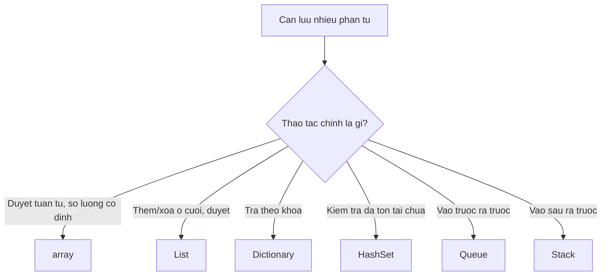

# 1.6 — 5. Mảng và Danh Sách (Arrays & Lists)

> Nguồn: https://tiennhm.io.vn/en/docs/dotnet-backend-zero-to-senior/stage-01-foundation/module-01-programming-logic/1.6-arrays-and-lists
> Array, List, Dictionary, HashSet — chọn sai một cái là biến vòng lặp O(n) thành O(n²). Kèm cách List tự lớn lên, yêu cầu của khoá Dictionary, và nên trả kiểu gì ra khỏi một API.

> Bốn cấu trúc bạn sẽ dùng hằng ngày: `array` (cố định, nhanh nhất), `List` (mảng biết tự lớn lên), `Dictionary<K,V>` (tra theo khoá, trung bình O(1)) và `HashSet` (kiểm tra tồn tại, trung bình O(1)). Chọn sai một cái không làm code sai — nó chỉ làm code **chậm dần theo lượng dữ liệu**. Cái bẫy kinh điển: gọi `list.Contains()` bên trong một vòng lặp, biến việc đối chiếu hai danh sách 10.000 phần tử từ tức thời thành 100 triệu phép so sánh. Đổi `List` thành `HashSet` là xong, và đó là một dòng code.

## Mục tiêu bài học

Sau bài này bạn có thể:

- Chọn giữa `array`, `List`, `Dictionary<K,V>`, `HashSet` theo thao tác chính bạn cần làm.
- Giải thích `List` lớn lên như thế nào, và vì sao đặt trước sức chứa lại có ích.
- Nêu điều kiện để một kiểu dùng được làm khoá `Dictionary`.
- Nhận ra và sửa bẫy `Contains` trong vòng lặp.
- Chọn kiểu trả về đúng cho một phương thức công khai.

## Nội dung bài học

### 1.6.1 — Bốn lựa chọn và thao tác mạnh nhất của mỗi cái



| Cấu trúc | Truy cập theo chỉ số | Tìm theo giá trị | Thêm vào cuối | Dùng khi |
|---|---|---|---|---|
| `T[]` | O(1) | O(n) | không thêm được | Số lượng biết trước và không đổi |
| `List` | O(1) | O(n) | O(1) trung bình | Mặc định cho danh sách |
| `Dictionary<K,V>` | — | **O(1)** theo khoá | O(1) trung bình | Tra cứu theo mã, theo Id |
| `HashSet` | — | **O(1)** | O(1) trung bình | Kiểm tra tồn tại, khử trùng lặp |

### 1.6.2 — `array`: cố định và liền mạch

```csharp
int[] scores = new int[5];             // 5 phần tử, mặc định bằng 0
string[] tiers = { "Thường", "Bạc", "VIP" };

Console.WriteLine(tiers.Length);       // 3  — Length, không phải Count
Console.WriteLine(tiers[^1]);          // "VIP"
```

Mảng nằm **liền mạch trong bộ nhớ**, nên truy cập theo chỉ số là một phép cộng địa chỉ — nhanh nhất có thể. Đổi lại kích thước cố định: muốn thêm phần tử phải cấp phát mảng mới và chép toàn bộ sang.

Trong code nghiệp vụ, bạn hiếm khi cần `array` trực tiếp. Nó đáng dùng khi số phần tử biết trước, hoặc trong đoạn code nhạy hiệu năng.

### 1.6.3 — `List`: mảng biết tự lớn lên

```csharp
var customers = new List<Customer>();
customers.Add(new Customer("A"));
customers.Insert(0, new Customer("B"));   // O(n) — phải dịch mọi phần tử
customers.RemoveAll(c => c.IsInactive);
Console.WriteLine(customers.Count);
```

Bên trong, `List` **là một array**. Khi đầy, nó cấp phát mảng mới **gấp đôi** rồi chép sang. Vì thế:

- `Add` ở cuối là O(1) *khấu hao* — thỉnh thoảng có một lần chép tốn kém, nhưng chia đều ra thì rẻ.
- `Insert(0, ...)` và `RemoveAt(0)` là **O(n)**, vì mọi phần tử phải dịch chỗ.
- Nếu biết trước số lượng, hãy đặt sức chứa để tránh chuỗi cấp phát và sao chép:

```csharp
var items = new List<Order>(capacity: 10_000);   // cấp phát đúng một lần
```

`Count` là số phần tử đang có; `Capacity` là sức chứa hiện tại. Hai con số khác nhau, và chỉ `Count` mới là thứ bạn quan tâm trong logic.

### 1.6.4 — `Dictionary<K,V>`: tra theo khoá

```csharp
var customersById = new Dictionary<int, Customer>();
customersById[42] = customer;

// Cách đọc AN TOÀN — không ném nếu thiếu khoá
if (customersById.TryGetValue(42, out var found))
    Console.WriteLine(found.Name);

// Cách đọc ném KeyNotFoundException nếu thiếu
var risky = customersById[999];
```

Dùng `TryGetValue` làm mặc định. Nó tra cứu **một lần duy nhất**, trong khi `ContainsKey` rồi `[key]` là tra hai lần.

**Điều kiện của khoá:** kiểu làm khoá phải cài đặt `GetHashCode()` và `Equals()` nhất quán với nhau. Các kiểu dựng sẵn (`int`, `string`, `Guid`) đã có sẵn. Nếu dùng `class` của bạn làm khoá mà không override hai thứ đó, `Dictionary` sẽ so sánh **theo tham chiếu** — hai object có nội dung giống hệt nhau vẫn là hai khoá khác nhau.

```csharp
// record tự sinh GetHashCode và Equals theo giá trị -> dùng làm khoá được ngay
public record CustomerKey(int TenantId, int CustomerId);
```

Một cái bẫy hay gặp với LINQ:

```csharp
// Ném ArgumentException nếu có hai đơn cùng CustomerId
var map = orders.ToDictionary(o => o.CustomerId);

// An toàn: gom nhóm trước
var map = orders.GroupBy(o => o.CustomerId)
                .ToDictionary(g => g.Key, g => g.ToList());
```

### 1.6.5 — `HashSet` và bẫy `Contains` trong vòng lặp

Đây là phần đáng giá nhất của cả bài.

```csharp
// CHẬM — O(n × m)
var activeIds = GetActiveIds();            // List<int>, 10.000 phần tử
foreach (var order in orders)              // 10.000 đơn
{
    if (activeIds.Contains(order.CustomerId))   // quét tuyến tính MỖI LẦN
        Process(order);
}
// Tổng: tới 100.000.000 phép so sánh
```

`List.Contains` phải quét từ đầu tới khi tìm thấy. Đặt nó trong vòng lặp là nhân hai kích thước với nhau.

```csharp
// NHANH — O(n + m)
var activeIds = GetActiveIds().ToHashSet();   // dựng một lần, O(m)
foreach (var order in orders)
{
    if (activeIds.Contains(order.CustomerId))  // O(1) trung bình
        Process(order);
}
// Tổng: khoảng 20.000 thao tác
```

Một dòng `.ToHashSet()` đổi 100 triệu phép so sánh lấy 20 nghìn. Đây chính là Big-O có mặt trong đời thật, và bài [1.8 — Cấu trúc dữ liệu và Big-O](1.8-data-structures-and-big-o.mdx) sẽ nói kỹ vì sao.

`HashSet` còn tự khử trùng lặp và có các phép toán tập hợp:

```csharp
var a = new HashSet<int> { 1, 2, 3 };
a.UnionWith(new[] { 3, 4 });        // {1,2,3,4}
a.IntersectWith(new[] { 2, 3, 9 }); // {2,3}
a.ExceptWith(new[] { 3 });          // {2}
```

### 1.6.6 — Trả kiểu gì ra khỏi API?

```csharp
// Rò rỉ khả năng sửa — người gọi Add/Remove thẳng vào trạng thái nội bộ của bạn
public List<Order> GetOrders() => _orders;

// Chỉ đọc, nhưng vẫn cho biết số lượng và truy cập theo chỉ số
public IReadOnlyList<Order> GetOrders() => _orders;

// Lười nhất — người gọi không biết đã vật chất hoá chưa
public IEnumerable<Order> GetOrders() => _orders;
```

Hướng dẫn thực dụng:

- Trả `IReadOnlyList` cho dữ liệu **đã có sẵn trong bộ nhớ**. Người gọi biết `Count` mà không sợ chạy lại truy vấn.
- Trả `IEnumerable` khi kết quả thật sự **được sinh dần** (`yield return`, luồng dữ liệu lớn).
- Nhận `IEnumerable` làm **tham số** — càng rộng càng dễ gọi.

Nguyên tắc chung: **nhận rộng, trả hẹp**.

### 1.6.7 — Rà lại code của bạn

**Danh sách rà soát collection**

- [ ] Không có Contains trên List nào nằm trong vòng lặp; đã đổi sang HashSet.
- [ ] Dùng TryGetValue thay cho cặp ContainsKey + indexer.
- [ ] Kiểu tự viết dùng làm khoá Dictionary đều là record, hoặc đã override GetHashCode và Equals.
- [ ] ToDictionary chỉ dùng khi khoá chắc chắn duy nhất; còn lại dùng GroupBy.
- [ ] Danh sách biết trước số lượng lớn thì khởi tạo kèm capacity.
- [ ] Phương thức công khai trả IReadOnlyList thay vì List.
- [ ] Không dùng Insert(0) hay RemoveAt(0) trong vòng lặp trên danh sách lớn.

## Bài tập áp dụng

Ba bài đều có kết quả đo được. Chạy ở chế độ `Release` (`dotnet run -c Release`), vì bản `Debug` tắt nhiều tối ưu và cho số liệu sai lệch.

#### Bài 1 — Đo bẫy `Contains` trong vòng lặp

Dựng hai danh sách 20.000 số nguyên có phần giao nhau. Đối chiếu bằng `List.Contains` trong vòng lặp, đo bằng `Stopwatch`. Làm lại với `HashSet`. Ghi lại tỉ lệ chênh lệch.

**Tiêu chí hoàn thành:** bạn giải thích được tỉ lệ đó bằng độ phức tạp, không chỉ đọc con số.

Gợi ý và lời giải — Bài 1

**Gợi ý.** Đếm số phép so sánh thay vì nhìn đồng hồ. Vòng lặp ngoài chạy 20.000 lần. Với mỗi lần, `List.Contains` làm gì? Nó không biết dữ liệu được sắp xếp hay chưa, nên phải duyệt tuần tự từ đầu.

**Lời giải.**

```csharp
var a = Enumerable.Range(0, 20000).ToList();
var b = Enumerable.Range(10000, 20000).ToList();

var sw = Stopwatch.StartNew();
int c1 = 0;
foreach (var x in a) if (b.Contains(x)) c1++;        // O(n²)
sw.Stop();
Console.WriteLine($"List.Contains : {sw.Elapsed.TotalMilliseconds:F2} ms");

var hs = new HashSet<int>(b);
sw.Restart();
int c2 = 0;
foreach (var x in a) if (hs.Contains(x)) c2++;       // O(n)
sw.Stop();
Console.WriteLine($"HashSet       : {sw.Elapsed.TotalMilliseconds:F2} ms");
```

**Kết quả đo thật trên .NET 9, chế độ Release:**

```text
List.Contains :     73.48 ms  (khớp 10000)
HashSet       :      0.84 ms  (khớp 10000)
nhanh gấp     :        88 lần
```

**Giải thích bằng độ phức tạp.** `List.Contains` duyệt tuần tự, trung bình phải đi qua nửa danh sách trước khi tìm thấy, tức khoảng 10.000 phép so sánh cho mỗi phần tử. Nhân với 20.000 lần lặp ngoài là **khoảng 200 triệu phép so sánh** — đó chính là O(n²).

`HashSet.Contains` tính mã băm của giá trị rồi nhảy thẳng tới ô tương ứng, mất thời gian gần như không đổi bất kể tập hợp lớn cỡ nào. Tổng cộng chỉ 20.000 lần tra, tức O(n).

**Điều quan trọng hơn con số 88 lần.** Tỉ lệ này **không cố định** — nó tăng theo kích thước dữ liệu. Thử lại với 200.000 phần tử thì chênh lệch không phải 880 lần mà lớn hơn nữa, vì một bên tăng theo bình phương còn một bên tăng tuyến tính. Đây là lý do một tính năng chạy tốt suốt giai đoạn thử nghiệm lại sập khi dữ liệu thật đổ vào.

**Cách nhận ra trong code review.** Dấu hiệu là một lời gọi `Contains`, `Any`, `First`, hoặc `Where` trên một tập hợp **bên trong** một vòng lặp duyệt tập hợp khác. Gặp mẫu này thì chuyển tập hợp bên trong sang `HashSet` hoặc `Dictionary` trước khi vào vòng lặp. Cùng một lỗi này khi tập hợp bên trong là database thì mang tên N+1, đã gặp ở [bài 1.4](1.4-loops.mdx).

#### Bài 2 — Khoá `Dictionary` sai kiểu

Tạo `class CustomerKey` **thường** (không phải `record`) với hai thuộc tính, dùng làm khoá `Dictionary`. Thêm một phần tử, rồi `TryGetValue` bằng một đối tượng **mới** có cùng giá trị. Giải thích vì sao không tìm thấy, rồi sửa bằng `record`.

**Tiêu chí hoàn thành:** bạn nêu đúng **hai** phương thức mà `Dictionary` dựa vào, và vì sao bản mặc định của `class` không đáp ứng.

Gợi ý và lời giải — Bài 2

**Gợi ý.** `Dictionary` tìm khoá theo hai bước: trước hết tính mã băm để biết nhìn vào ô nào, sau đó so sánh bằng để xác nhận đúng khoá. Vậy có **hai** phương thức tham gia. Với `class` thường, cả hai đều dựa trên cái gì?

**Lời giải.**

```csharp
class CustomerKeyCls { public string Region = ""; public int Code; }
record CustomerKeyRec(string Region, int Code);

var k1 = new CustomerKeyCls { Region = "HN", Code = 1 };
var k2 = new CustomerKeyCls { Region = "HN", Code = 1 };
var dc = new Dictionary<CustomerKeyCls, string> { [k1] = "x" };

var r1 = new CustomerKeyRec("HN", 1);
var r2 = new CustomerKeyRec("HN", 1);
var dr = new Dictionary<CustomerKeyRec, string> { [r1] = "x" };

Console.WriteLine($"class  tìm lại: {dc.TryGetValue(k2, out _)}");
Console.WriteLine($"record tìm lại: {dr.TryGetValue(r2, out _)}");
Console.WriteLine($"class  mã băm bằng nhau: {k1.GetHashCode() == k2.GetHashCode()}");
Console.WriteLine($"record mã băm bằng nhau: {r1.GetHashCode() == r2.GetHashCode()}");
```

**Kết quả đo thật trên .NET 9:**

```text
class  tìm lại: False
record tìm lại: True
class  mã băm bằng nhau: False
record mã băm bằng nhau: True
```

**Vì sao.** `Dictionary` dùng `GetHashCode()` để chọn ô chứa và `Equals()` để xác nhận. Bản mặc định của hai phương thức này ở `class` dựa trên **danh tính của đối tượng trong bộ nhớ**, không dựa trên giá trị các thuộc tính. Hai đối tượng khác nhau nên mã băm khác nhau, nên `Dictionary` tìm ở một ô hoàn toàn khác và kết luận không có.

`record` tự sinh cả `GetHashCode()` lẫn `Equals()` dựa trên **toàn bộ thuộc tính**, nên hai giá trị giống nhau cho cùng mã băm và được coi là bằng nhau.

**Vì sao lỗi này nguy hiểm.** Nó **không ném ngoại lệ**. `Dictionary` chỉ lặng lẽ báo không tìm thấy, và code thường xử lý trường hợp đó bằng cách thêm mới — nên bạn kết thúc với hai mục trùng nội dung, hoặc một bộ đệm không bao giờ trúng. Trong một hệ thống đang chạy, triệu chứng là "cache không hiệu quả" hoặc "dữ liệu bị nhân đôi", và rất ít người nghĩ ngay tới `GetHashCode`.

**Ba cách sửa, theo thứ tự nên dùng:**

1. **Dùng `record` hoặc `record struct`** — tự sinh cả hai phương thức, không viết thêm dòng nào.
2. **Tự ghi đè `Equals` và `GetHashCode`** khi buộc phải giữ `class`, và phải ghi đè **cả hai**, vì ghi đè một cái thôi là tạo ra lỗi còn khó tìm hơn.
3. **Truyền một `IEqualityComparer` riêng** vào hàm khởi tạo `Dictionary`, khi bạn không sở hữu kiểu khoá hoặc cần quy tắc so sánh khác nhau ở từng chỗ.

Bài [4.8 — Records và Value Objects](../../stage-02-csharp-professional/module-04-csharp-core/4.8-records-and-value-objects.mdx) đi sâu vào tiêu chí chọn giữa `record` và `class`.

#### Bài 3 — Đặt trước sức chứa cho `List`

Thêm 1.000.000 phần tử vào một `List` không đặt sức chứa và một `List` có đặt. So sánh thời gian và số lần cấp phát lại.

**Tiêu chí hoàn thành:** bạn tính được số lần cấp phát lại **bằng lý thuyết**, rồi đối chiếu với thực tế.

Gợi ý và lời giải — Bài 3

**Gợi ý.** `List` bọc bên trong một mảng có kích thước cố định. Khi mảng đầy, nó cấp phát mảng mới **gấp đôi** rồi sao chép toàn bộ nội dung sang. Sức chứa ban đầu là 4. Vậy để chứa một triệu phần tử, dãy sức chứa đi qua những giá trị nào, và có bao nhiêu bước?

**Lời giải.**

```csharp
var sw = Stopwatch.StartNew();
var l1 = new List<int>();
for (int i = 0; i < 1_000_000; i++) l1.Add(i);
sw.Stop();
Console.WriteLine($"không capacity: {sw.Elapsed.TotalMilliseconds:F1} ms");

sw.Restart();
var l2 = new List<int>(1_000_000);
for (int i = 0; i < 1_000_000; i++) l2.Add(i);
sw.Stop();
Console.WriteLine($"có capacity   : {sw.Elapsed.TotalMilliseconds:F1} ms");
```

**Kết quả đo thật trên .NET 9, chế độ Release:**

```text
không capacity: 15.4 ms
có capacity   :  8.6 ms
số lần cấp phát lại: 18
```

**Tính bằng lý thuyết.** Sức chứa đi theo dãy 4, 8, 16, 32, … mỗi bước gấp đôi. Để vượt 1.000.000 cần đi từ 4 tới 1.048.576, tức là **18 lần** cấp phát lại. Mỗi lần đều phải sao chép toàn bộ phần tử hiện có sang mảng mới, và tổng số phần tử phải sao chép cộng dồn xấp xỉ bằng **hai lần** kích thước cuối.

**Vì sao chênh lệch chỉ khoảng 1,8 lần chứ không nhiều hơn.** Vì phép nhân đôi khiến chi phí cấp phát lại phân bổ đều ra thành gần như không đổi trên mỗi lần `Add` — thuật ngữ gọi là chi phí khấu hao. Đây cũng là lý do `List` vẫn nhanh dù không đặt sức chứa, và là lý do **không nên** đặt sức chứa theo phản xạ.

**Khi nào việc này đáng làm:**

| Nên đặt sức chứa | Không cần |
|---|---|
| Biết trước số phần tử, ví dụ đã có `rows.Count` | Không biết trước số lượng |
| Danh sách rất lớn, từ hàng trăm nghìn phần tử | Danh sách vài chục phần tử |
| Vòng lặp nóng chạy liên tục | Code khởi tạo chạy một lần |

**Một chi tiết ít người biết.** Bộ nhớ lãng phí còn đáng kể hơn thời gian. Một `List` chứa 1.000.001 phần tử sẽ có sức chứa 2.097.152 — tức **chiếm gấp đôi** bộ nhớ cần thiết. Với đối tượng lớn thay vì số nguyên, phần thừa đó đủ gây áp lực lên bộ thu gom rác. Khi đã điền xong và không thêm nữa, gọi `TrimExcess()` để trả lại phần thừa, hoặc dùng thẳng `ToArray()`.

## Tự kiểm tra

### List lớn lên bằng cách nào?

Bên trong List là một array. Khi đầy, nó cấp phát một array mới gấp đôi sức chứa rồi chép toàn bộ phần tử sang. Vì thế Add ở cuối là O(1) khấu hao — thỉnh thoảng tốn một lần chép, nhưng chia đều ra thì rẻ. Nếu biết trước số lượng, đặt capacity lúc khởi tạo để chỉ cấp phát một lần.

### Vì sao Contains trong vòng lặp lại nguy hiểm?

Vì List.Contains phải quét tuyến tính, nên đặt nó trong vòng lặp là nhân hai kích thước với nhau. Hai tập 10.000 phần tử thành tối đa 100 triệu phép so sánh. Đổi danh sách tra cứu thành HashSet làm mỗi lần kiểm tra còn O(1) trung bình, tổng chi phí về khoảng 20.000 thao tác.

### Kiểu nào dùng được làm khoá Dictionary?

Kiểu có GetHashCode() và Equals() nhất quán với nhau. Các kiểu dựng sẵn như int, string, Guid đã có sẵn. Nếu dùng class tự viết mà không override hai thứ đó, Dictionary so sánh theo tham chiếu, nên hai object cùng nội dung vẫn là hai khoá khác nhau. Dùng record là cách đơn giản nhất vì nó tự sinh cả hai theo giá trị.

### TryGetValue tốt hơn ContainsKey rồi lấy indexer ở chỗ nào?

ContainsKey rồi dùng indexer là tra cứu hai lần trên cùng một khoá. TryGetValue làm đúng một lần và trả về cả kết quả lẫn cờ tìm thấy. Ngoài nhanh hơn, nó còn tránh được lỗi khi khoá bị xoá giữa hai lần tra trong môi trường nhiều luồng.

### Nên trả IEnumerable hay IReadOnlyList ra khỏi một phương thức?

Trả IReadOnlyList cho dữ liệu đã có trong bộ nhớ, vì người gọi biết được Count và truy cập theo chỉ số mà không sợ chạy lại truy vấn. Trả IEnumerable khi kết quả thật sự sinh dần, ví dụ hàm dùng yield return. Với tham số đầu vào thì ngược lại: nhận IEnumerable cho rộng đường gọi.

### ToDictionary bị ném ArgumentException là vì sao?

Vì có hai phần tử sinh ra cùng một khoá, mà Dictionary không cho phép khoá trùng. Nếu dữ liệu có thể trùng khoá, hãy GroupBy trước rồi ToDictionary với giá trị là danh sách của từng nhóm.

## Kết luận

Ba điều đáng nhớ nhất:

1. **`Contains` trong vòng lặp là lỗi hiệu năng phổ biến nhất với collection.** Và nó sửa bằng đúng một dòng `.ToHashSet()`.
2. **`TryGetValue` là cách đọc `Dictionary` mặc định.** Một lần tra cứu, không ném ngoại lệ, không cần kiểm tra trước.
3. **Nhận rộng, trả hẹp.** Nhận `IEnumerable`, trả `IReadOnlyList` — để người gọi dễ gọi mà không sửa được trạng thái nội bộ của bạn.

## Tham khảo

- [Arrays — C# programming guide](https://learn.microsoft.com/en-us/dotnet/csharp/programming-guide/arrays/)
- [`List` Class](https://learn.microsoft.com/en-us/dotnet/api/system.collections.generic.list-1) — chú ý phần Capacity
- [`Dictionary<TKey,TValue>` Class](https://learn.microsoft.com/en-us/dotnet/api/system.collections.generic.dictionary-2)
- [`HashSet` Class](https://learn.microsoft.com/en-us/dotnet/api/system.collections.generic.hashset-1)
- [Commonly used collection types](https://learn.microsoft.com/en-us/dotnet/standard/collections/commonly-used-collection-types) — bảng so sánh độ phức tạp chính thức
- [Collections and Data Structures](https://learn.microsoft.com/en-us/dotnet/standard/collections/) — tổng quan

## Điều hướng

- **Bài trước:** [1.5 — 4. Hàm (Functions / Methods)](1.5-functions-methods.mdx)
- **Bài tiếp theo:** [1.7 — 6. Tư Duy Giải Bài Toán](1.7-problem-solving-mindset.mdx)
- **Về module:** [Trang mục lục](./)
