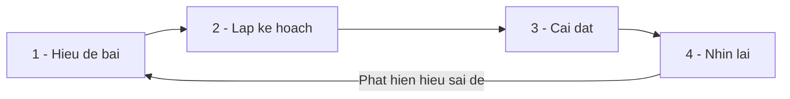

# 1.7 — 6. Tư Duy Giải Bài Toán

> Nguồn: https://tiennhm.io.vn/en/docs/dotnet-backend-zero-to-senior/stage-01-foundation/module-01-programming-logic/1.7-problem-solving-mindset
> Quy trình bốn bước để đi từ đề bài mơ hồ tới code chạy được: viết ví dụ trước khi viết code, liệt kê ca biên theo danh sách cố định, chia nhỏ, và đọc thông báo lỗi cho đúng cách.

> Phần lớn thời gian lập trình không dùng để gõ code, mà để **hiểu xem phải gõ cái gì**. Bài này đưa ra một quy trình bốn bước dùng được ngay, và ba kỹ thuật cụ thể hơn lời khuyên chung chung: **viết bảng ví dụ đầu vào → đầu ra trước khi viết dòng code nào** (nó biến đề bài mơ hồ thành thứ kiểm chứng được), **liệt kê ca biên theo một danh sách cố định** thay vì trông chờ trí nhớ, và **đọc stack trace từ dưới lên**. Cuối bài là phương pháp chia đôi để tìm lỗi — cách khoanh vùng một bug trong mười nghìn dòng chỉ bằng khoảng mười bốn lần thử.

## Mục tiêu bài học

Sau bài này bạn có thể:

- Biến một đề bài bằng lời thành bảng ví dụ đầu vào → đầu ra trước khi viết code.
- Liệt kê ca biên theo một danh sách cố định thay vì dựa vào trí nhớ.
- Chia một bài toán lớn thành các bước kiểm chứng được độc lập.
- Đọc một stack trace và chỉ ra đúng dòng gây lỗi.
- Dùng phương pháp chia đôi để khoanh vùng lỗi thay vì đọc mò.

## Nội dung bài học

### 1.7.1 — Quy trình bốn bước



Điều quan trọng nhất: **bước 1 chưa xong thì đừng sang bước 3**. Lỗi tốn kém nhất trong nghề không phải code sai — mà là code đúng cho một bài toán khác với bài toán cần giải.

### 1.7.2 — Bước 1: viết ví dụ trước khi viết code

Đề bài thường đến dưới dạng một câu: *"Phân loại lead theo doanh thu tiềm năng."*

Đừng mở IDE. Mở một bảng:

| Doanh thu tiềm năng | Số nhân viên | Kết quả mong đợi |
|---|---|---|
| 2.000.000.000 | 500 | Enterprise |
| 500.000.000 | 80 | Mid-market |
| 50.000.000 | 5 | SMB |
| 0 | 5 | ? **cần hỏi** |
| −10.000.000 | 5 | ? **cần hỏi** |
| 2.000.000.000 | 2 | ? **cần hỏi** |

Bảng này làm được ba việc mà đọc đề không làm được:

1. Nó **lộ ra chỗ mơ hồ**. Ba dòng cuối là ba câu hỏi phải hỏi người ra đề, không phải chỗ để tự đoán.
2. Nó **trở thành bộ test** ngay khi có câu trả lời.
3. Nó **chốt lại ranh giới**. `500.000.000` là Mid-market hay Enterprise? Phân loại có dùng số nhân viên không, hay chỉ doanh thu?

Quy tắc: nếu bạn chưa viết được ví dụ, bạn chưa hiểu đề. Viết code lúc đó là đoán.

### 1.7.3 — Ca biên: dùng danh sách, đừng dùng trí nhớ

Ca biên bị bỏ sót không phải vì khó, mà vì **không ai nhớ hết** lúc đang tập trung vào luồng chính. Cách chữa là có một danh sách cố định và chạy qua nó mỗi lần.

**Danh sách ca biên chuẩn**

- [ ] Rỗng — danh sách không có phần tử nào, chuỗi rỗng.
- [ ] Một phần tử — nhiều thuật toán sai ở đúng trường hợp này.
- [ ] null — tham số null, phần tử null bên trong danh sách.
- [ ] Trùng lặp — hai bản ghi cùng khoá.
- [ ] Biên — đúng bằng ngưỡng, ngay dưới, ngay trên.
- [ ] Số âm và số không — kể cả khi 'không thể xảy ra'.
- [ ] Rất lớn — tràn số, hết bộ nhớ, timeout.
- [ ] Thứ tự — dữ liệu chưa sắp xếp, sắp xếp ngược.
- [ ] Unicode — tiếng Việt có dấu, emoji, chuỗi nhiều byte.

Dòng cuối không phải chuyện lý thuyết: bài [Một dấu tiếng Việt làm chết lời gọi API](https://tiennhm.io.vn/blog/cloudflare-header-broke-dotnet-httpclient) là một sự cố thật, bắt đầu từ đúng một ký tự có dấu ở chỗ không ai ngờ tới.

### 1.7.4 — Bước 2: chia nhỏ tới mức kiểm chứng được

*"Xuất báo cáo doanh thu theo tháng cho từng chi nhánh, gửi email kèm file Excel."*

Câu đó không cài đặt được. Nhưng nó chia được:

1. Lấy danh sách chi nhánh đang hoạt động → **kiểm chứng được**: đếm số dòng.
2. Với mỗi chi nhánh, lấy doanh thu theo tháng → **kiểm chứng được**: đối chiếu một chi nhánh bằng tay.
3. Ghép thành bảng dữ liệu → **kiểm chứng được**: in ra console.
4. Xuất bảng ra file Excel → **kiểm chứng được**: mở file lên.
5. Gửi email kèm file → **kiểm chứng được**: gửi cho chính mình.

Tiêu chí chia đúng: **mỗi bước phải tự chứng minh được là đúng mà không cần chạy bước sau**. Nếu một bước chỉ kiểm tra được sau khi cả chuỗi chạy xong, nó chưa được chia đủ nhỏ.

Và luôn làm bước có rủi ro cao nhất trước. Nếu thư viện Excel không chạy được trên máy chủ Linux, bạn muốn biết điều đó ở ngày thứ nhất, không phải ngày thứ tư.

### 1.7.5 — Bước 3: chạy được trước, gọn gàng sau

"Làm chạy đã, tối ưu sau" là lời khuyên đúng — nhưng thiếu một vế. Vế đủ là:

> Làm chạy được, **rồi dọn ngay khi còn nhớ**, rồi mới tối ưu nếu đo thấy cần.

Bỏ vế giữa là cách sinh ra nợ kỹ thuật. Bản nháp chạy được rất dễ trở thành bản cuối, vì "nó đang chạy mà".

Còn tối ưu thì chỉ làm sau khi **đo**. Trực giác của con người về chỗ chậm gần như luôn sai — chi tiết ở bài [1.8 Big-O](1.8-data-structures-and-big-o.mdx).

### 1.7.6 — Đọc thông báo lỗi cho đúng

Thông báo lỗi là câu trả lời, không phải tiếng ồn. Đọc theo thứ tự này:

```
System.NullReferenceException: Object reference not set to an instance of an object.
   at CrmApp.Services.OrderService.CalculateTotal(Order order) in OrderService.cs:line 47
   at CrmApp.Services.OrderService.ProcessAsync(Int32 orderId) in OrderService.cs:line 22
   at CrmApp.Controllers.OrderController.Post(Int32 id) in OrderController.cs:line 15
```

1. **Loại ngoại lệ** — `NullReferenceException`: có cái gì đó đang là `null`.
2. **Dòng trên cùng của stack trace** — `OrderService.cs:line 47`. Đây là nơi nổ. Các dòng dưới là đường đi tới đó.
3. **Đọc từ dưới lên** để hiểu bối cảnh: request `POST` → `ProcessAsync` → `CalculateTotal`.
4. Mở đúng dòng 47 và hỏi: trong dòng này, cái gì có thể là `null`?

Sai lầm thường gặp là đọc mỗi dòng đầu rồi đoán. Số dòng nằm ngay đó.

### 1.7.7 — Bí thì chia đôi

Khi lỗi không lộ ra ở chỗ nào, đừng đọc lại code từ đầu. Hãy **chia đôi**.

```csharp
public async Task<Report> Build(int id)
{
    var orders = await _db.Orders.Where(o => o.CustomerId == id).ToListAsync();
    Console.WriteLine($"[1] orders = {orders.Count}");        // đúng như mong đợi?

    var filtered = orders.Where(o => o.IsPaid).ToList();
    Console.WriteLine($"[2] filtered = {filtered.Count}");    // còn đúng không?

    var total = filtered.Sum(o => o.Total);
    Console.WriteLine($"[3] total = {total}");                // tới đây sai chưa?
    // ...
}
```

Đặt một điểm quan sát ở giữa. Nếu dữ liệu ở đó đã sai, lỗi nằm ở nửa trên. Nếu còn đúng, lỗi nằm ở nửa dưới. Lặp lại.

Mỗi lần chia đôi loại bỏ một nửa không gian tìm kiếm, nên **mười nghìn dòng chỉ cần khoảng mười bốn lần thử**. Đây chính là `O(log n)` xuất hiện trong công việc hằng ngày.

Với lịch sử git, `git bisect` làm đúng việc này một cách tự động trên các commit.

### 1.7.8 — Bước 4: nhìn lại

Sau khi code chạy, dành năm phút trả lời bốn câu:

1. Đầu vào nào làm nó sai? (Nếu không nghĩ ra cái nào, bạn chưa nghĩ đủ lâu.)
2. Người tiếp theo đọc có hiểu **vì sao** viết thế này không, hay chỉ hiểu nó làm gì?
3. Nó xử lý được dữ liệu gấp 100 lần không? Nếu không thì tới ngưỡng nào là hỏng?
4. Đã có sẵn thư viện chuẩn làm việc này chưa?

Câu 4 tiết kiệm nhiều thời gian nhất. `.NET` đã có sẵn phân trang, so sánh chuỗi không phân biệt hoa thường, thao tác ngày tháng, gom nhóm — phần lớn tiện ích bạn định tự viết đều đã tồn tại và đã được nhiều người kiểm chứng.

## Bài tập áp dụng

Ba bài này rèn **quy trình**, không rèn cú pháp. Chúng có vẻ ít kỹ thuật hơn các bài trước, nhưng đây là bài quyết định bạn có tự giải được bài toán chưa gặp hay không.

### Bài 1 — Bảng ví dụ trước khi viết code

Lấy một yêu cầu bạn đang làm dở. **Trước khi viết thêm dòng nào**, lập bảng đầu vào → đầu ra có ít nhất sáu dòng, trong đó ít nhất hai dòng bạn **không tự trả lời được**. Gửi hai dòng đó cho người ra đề.

**Tiêu chí hoàn thành:** người ra đề phải suy nghĩ trước khi trả lời — nghĩa là bạn đã tìm ra chỗ đề bài còn mơ hồ.

Gợi ý và lời giải — Bài 1

**Gợi ý.** Hai dòng "không tự trả lời được" mới là phần giá trị của bài tập. Tìm chúng bằng cách lấy danh sách ca biên ở mục 1.7.3 và soi vào đề bài: yêu cầu nói gì về danh sách rỗng? Về giá trị đúng bằng ngưỡng? Về dữ liệu trùng?

**Lời giải — ví dụ với yêu cầu *"tính hoa hồng cho nhân viên kinh doanh: 5% doanh thu, nếu vượt 100 triệu thì 8%"*:**

| # | Đầu vào | Đầu ra mong đợi | Tự trả lời được? |
|---|---|---|---|
| 1 | Doanh thu 50.000.000 | 2.500.000 | Có |
| 2 | Doanh thu 150.000.000 | 12.000.000 | Có |
| 3 | Doanh thu 0 | 0 | Có |
| 4 | **Doanh thu đúng 100.000.000** | 5.000.000 hay 8.000.000? | **Không** |
| 5 | **Doanh thu 150 triệu — 8% tính trên toàn bộ hay chỉ phần vượt?** | 12.000.000 hay 9.000.000? | **Không** |
| 6 | Doanh thu âm do hoàn đơn | 0, hay hoa hồng âm? | **Không** |

**Vì sao ba dòng cuối đáng giá hơn ba dòng đầu.** Dòng 1 tới 3 chỉ xác nhận điều bạn đã hiểu. Dòng 4 tới 6 là những chỗ mà **nếu đoán sai, code chạy đúng theo nghĩa kỹ thuật nhưng sai theo nghĩa nghiệp vụ** — và loại lỗi đó thường chỉ bị phát hiện khi kế toán đối soát cuối tháng.

Riêng dòng 5 là chênh lệch 3 triệu đồng mỗi nhân viên mỗi tháng. Không câu lệnh `if` nào bắt được sai lầm này; chỉ có một câu hỏi hỏi đúng lúc mới bắt được.

**Vì sao phải hỏi *trước* khi viết code.** Hỏi sau khi đã viết xong nghĩa là bạn đã chọn một cách hiểu và cài đặt theo nó. Nếu người ra đề trả lời khác, bạn phải viết lại — và áp lực tâm lý khiến người ta có xu hướng thuyết phục người ra đề chấp nhận cách mình đã làm, thay vì sửa cho đúng.

**Thói quen nên hình thành.** Bảng này không cần đẹp, chỉ cần tồn tại trước khi code. Sau khi có câu trả lời, mỗi dòng trong bảng trở thành một bài kiểm thử — nên công sức bỏ ra được dùng lại ngay chứ không mất đi.

### Bài 2 — Chạy qua danh sách ca biên

Chọn một hàm bạn đã viết tuần trước. Chạy qua đủ chín mục trong danh sách ở mục 1.7.3. Ghi lại số ca mà hàm hiện tại xử lý sai.

**Tiêu chí hoàn thành:** bạn tìm được ít nhất một ca xử lý sai. Nếu không tìm được ca nào, gần như chắc chắn bạn đã chạy quá nhanh qua danh sách.

Gợi ý và lời giải — Bài 2

**Gợi ý.** Đừng chỉ đọc lướt danh sách rồi gật đầu. Với mỗi mục, hãy **viết ra giá trị đầu vào cụ thể** và chạy thử trong đầu hoặc bằng một bài kiểm thử nhanh.

**Lời giải — ví dụ áp dụng vào một hàm tưởng như vô hại:**

```csharp
public decimal TinhTrungBinh(List<Order> orders)
    => orders.Sum(o => o.Total) / orders.Count;
```

| Ca biên | Đầu vào cụ thể | Kết quả | Đúng? |
|---|---|---|---|
| Rỗng | `new List()` | `DivideByZeroException` | **Sai** |
| Một phần tử | một đơn 100.000 | 100.000 | Đúng |
| `null` | `null` | `NullReferenceException` | **Sai** |
| Trùng lặp | hai đơn giống hệt | tính cả hai | Đúng theo nghiệp vụ? Cần hỏi |
| Biên | tổng đúng bằng `decimal.MaxValue` | `OverflowException` | **Sai** |
| Số âm | đơn hoàn tiền `-50.000` | trung bình âm | Cần hỏi |
| Rất lớn | 10 triệu đơn | chậm, tốn bộ nhớ | Cần phân trang |
| Thứ tự | không ảnh hưởng | — | Đúng |
| Unicode | không liên quan | — | Đúng |

Ba ca sai rõ ràng, hai ca cần hỏi lại nghiệp vụ. Bản đã xử lý:

```csharp
public decimal TinhTrungBinh(IReadOnlyList<Order>? orders)
{
    if (orders is null || orders.Count == 0) return 0m;
    return orders.Sum(o => o.Total) / orders.Count;
}
```

**Điều đáng chú ý nhất.** Hàm gốc chỉ có **một dòng** và trông không thể sai. Đó chính là lý do danh sách ca biên tồn tại: rủi ro không tỉ lệ với độ dài code. Những hàm ngắn, quen thuộc và "hiển nhiên đúng" lại là nơi người ta bỏ qua việc kiểm tra kỹ nhất.

**Vì sao phải dùng danh sách thay vì trí nhớ.** Khi đang tập trung vào luồng chính, não bạn đã dùng hết dung lượng làm việc cho logic nghiệp vụ. Ca biên cần một cơ chế bên ngoài đầu — giống như phi công dùng checklist dù đã bay nghìn giờ. Danh sách ở mục 1.7.3 nên được dán vào mẫu pull request của đội.

### Bài 3 — Chia đôi có tính giờ

Nhờ đồng nghiệp cố ý gài một lỗi vào một hàm dài. Tìm nó bằng cách chia đôi, đếm số lần bạn phải đặt điểm quan sát. So với số lần nếu đọc tuần tự từ đầu.

**Tiêu chí hoàn thành:** bạn nói được vì sao chia đôi cho số lần tỉ lệ với logarit chứ không tỉ lệ với độ dài hàm.

Gợi ý và lời giải — Bài 3

**Gợi ý.** Chia đôi cần một điều kiện: bạn phải kiểm tra được **trạng thái ở giữa là đúng hay sai**. Nếu không xác định được điều đó, kỹ thuật không áp dụng được. Vậy trước khi đặt điểm quan sát đầu tiên, hãy trả lời: "ở điểm này, dữ liệu **phải** trông như thế nào nếu mọi thứ còn đúng?"

**Lời giải — quy trình.**

Giả sử hàm dài 64 dòng và lỗi nằm ở dòng 41.

```text
Lần 1: kiểm tra sau dòng 32  -> dữ liệu còn đúng  -> lỗi ở 33..64
Lần 2: kiểm tra sau dòng 48  -> dữ liệu đã sai    -> lỗi ở 33..48
Lần 3: kiểm tra sau dòng 40  -> dữ liệu còn đúng  -> lỗi ở 41..48
Lần 4: kiểm tra sau dòng 44  -> dữ liệu đã sai    -> lỗi ở 41..44
Lần 5: kiểm tra sau dòng 42  -> dữ liệu đã sai    -> lỗi ở 41..42
Lần 6: kiểm tra sau dòng 41  -> dữ liệu đã sai    -> LỖI Ở DÒNG 41
```

**Sáu lần** thay vì trung bình 32 lần khi đọc tuần tự.

**Vì sao là logarit.** Mỗi lần kiểm tra loại bỏ **một nửa** vùng nghi ngờ. Số lần cần thiết là số lần chia đôi 64 để còn 1, tức `log₂(64) = 6`. Đọc tuần tự thì trung bình phải đi qua nửa số dòng, tức 32.

Điểm mạnh thật sự lộ ra khi phạm vi lớn lên:

| Số dòng phải soi | Đọc tuần tự (trung bình) | Chia đôi |
|---|---|---|
| 64 | 32 | 6 |
| 1.000 | 500 | 10 |
| 1.000.000 | 500.000 | 20 |

Một triệu dòng chỉ cần 20 lần kiểm tra. Đây chính là sức mạnh của O(log n) mà [bài 1.8](1.8-data-structures-and-big-o.mdx) sẽ gọi tên.

**Cùng một kỹ thuật, ba quy mô khác nhau.** Đây không phải mẹo gỡ lỗi riêng lẻ mà là một ý tưởng lặp lại ở mọi tầng:

- **Trong một hàm:** đặt điểm quan sát ở giữa, như bài này.
- **Trong lịch sử Git:** `git bisect` tìm commit gây lỗi giữa hàng nghìn commit — [bài 3.10](../module-03-git-developer-workflow/3.10-debugging-workflow.mdx).
- **Trong một hệ thống nhiều dịch vụ:** kiểm tra ở giữa chuỗi gọi để biết lỗi nằm ở nửa trước hay nửa sau, thứ mà truy vết phân tán ở [Module 17](../../stage-05-senior-engineering/module-17-distributed-systems/) tự động hoá.
- **Trong cấu trúc dữ liệu:** chỉ số B-tree của database tra một dòng trong mười triệu bằng ba tới bốn lần đọc trang — [bài 12.5](../../stage-04-database-production/module-12-sql-deep-dive/12.5-indexing.mdx).

**Khi nào chia đôi *không* dùng được.** Khi lỗi không tất định — chỉ xảy ra lúc có nhiều luồng chạy song song, hoặc phụ thuộc vào thời điểm. Lúc đó "trạng thái ở giữa" không ổn định giữa các lần chạy, nên mỗi lần kiểm tra cho một kết quả khác nhau và việc chia đôi mất cơ sở.

## Tự kiểm tra

### Vì sao phải viết bảng ví dụ trước khi viết code?

Vì nó lộ ra chỗ mơ hồ trong đề bài trước khi bạn kịp đoán sai. Bảng đầu vào và đầu ra mong đợi biến một câu mô tả thành thứ kiểm chứng được, đồng thời trở thành bộ test ngay khi có câu trả lời. Nếu chưa viết được ví dụ thì chưa hiểu đề, và viết code lúc đó chỉ là đoán.

### Vì sao nên có danh sách ca biên cố định thay vì tự nhớ?

Vì ca biên bị bỏ sót không phải do khó, mà do lúc đang tập trung vào luồng chính thì không ai nhớ hết. Một danh sách cố định — rỗng, một phần tử, null, trùng lặp, biên, số âm, rất lớn, thứ tự, unicode — chạy qua mỗi lần thì không phụ thuộc vào trí nhớ nữa.

### Chia nhỏ bài toán thế nào là đủ nhỏ?

Khi mỗi bước tự chứng minh được là đúng mà không cần chạy bước sau. Nếu một bước chỉ kiểm tra được sau khi cả chuỗi chạy xong thì nó chưa đủ nhỏ. Ngoài ra nên làm bước rủi ro cao nhất trước, để phát hiện trở ngại ở ngày đầu chứ không phải ngày cuối.

### Đọc stack trace theo thứ tự nào?

Đọc loại ngoại lệ trước để biết chuyện gì xảy ra, rồi lấy dòng trên cùng của stack trace vì đó là nơi nổ, kèm số dòng cụ thể. Sau đó đọc từ dưới lên để hiểu đường đi tới chỗ đó. Sai lầm phổ biến là chỉ đọc dòng thông báo đầu tiên rồi đoán, trong khi số dòng đã nằm sẵn ở đó.

### Phương pháp chia đôi để tìm lỗi hoạt động ra sao?

Đặt một điểm quan sát ở giữa luồng xử lý. Nếu dữ liệu tại đó đã sai thì lỗi nằm ở nửa trên, còn đúng thì lỗi nằm ở nửa dưới. Lặp lại trên nửa còn lại. Mỗi lần loại bỏ một nửa không gian tìm kiếm, nên mười nghìn dòng chỉ cần khoảng mười bốn lần thử. Với lịch sử commit, git bisect làm đúng việc này tự động.

### Câu hỏi nào khi nhìn lại tiết kiệm thời gian nhất?

Câu hỏi thư viện chuẩn đã có sẵn chức năng này chưa. .NET đã có phân trang, so sánh chuỗi không phân biệt hoa thường, thao tác ngày tháng, gom nhóm — phần lớn tiện ích định tự viết đều đã tồn tại và đã được rất nhiều người kiểm chứng.

## Kết luận

Ba điều đáng nhớ nhất:

1. **Chưa viết được ví dụ thì chưa hiểu đề.** Bảng đầu vào → đầu ra là công cụ rẻ nhất để phát hiện mình đang giải nhầm bài.
2. **Ca biên dùng danh sách, không dùng trí nhớ.** Chín mục ở mục 1.7.3 chạy được trong hai phút.
3. **Bí thì chia đôi, đừng đọc lại từ đầu.** Mười nghìn dòng, mười bốn lần thử.

## Tham khảo

- [Debugging in Visual Studio Code](https://code.visualstudio.com/docs/editor/debugging) — breakpoint, watch, call stack
- [git-bisect](https://git-scm.com/docs/git-bisect) — chia đôi trên lịch sử commit
- [Best practices for exceptions](https://learn.microsoft.com/en-us/dotnet/standard/exceptions/best-practices-for-exceptions) — ngoại lệ nói gì với bạn
- [Collections and Data Structures](https://learn.microsoft.com/en-us/dotnet/standard/collections/) — kiểm tra trước khi tự viết

## Điều hướng

- **Bài trước:** [1.6 — 5. Mảng và Danh Sách (Arrays & Lists)](1.6-arrays-and-lists.mdx)
- **Bài tiếp theo:** [1.8 — 7. Cấu Trúc Dữ Liệu Cơ Bản và Big-O](1.8-data-structures-and-big-o.mdx)
- **Về module:** [Trang mục lục](./)

## Bài liên quan

- [Một dấu tiếng Việt làm chết lời gọi API: cf-ipcity, HttpClient và giới hạn ASCII](https://tiennhm.io.vn/blog/cloudflare-header-broke-dotnet-httpclient) — Trên một nền tảng loyalty thương mại điện tử khoảng 3 triệu khách hàng, một lời gọi HTTP nội bộ hỏng trên production trong khi database, Kubernetes…
